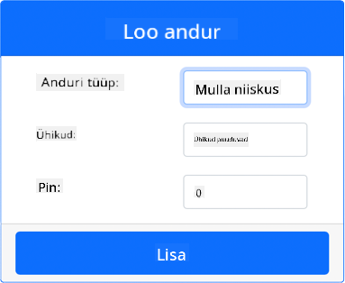
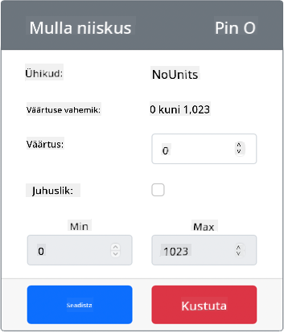

<!--
CO_OP_TRANSLATOR_METADATA:
{
  "original_hash": "2bf65f162bcebd35fbcba5fd245afac4",
  "translation_date": "2025-10-11T12:25:06+00:00",
  "source_file": "2-farm/lessons/2-detect-soil-moisture/virtual-device-soil-moisture.md",
  "language_code": "et"
}
-->
# Mulla niiskuse mõõtmine - Virtuaalne IoT riistvara

Selles õppetunni osas lisate oma virtuaalsele IoT-seadmele mahtuvusliku mulla niiskuse sensori ja loete selle väärtusi.

## Virtuaalne riistvara

Virtuaalne IoT-seade kasutab simuleeritud Grove mahtuvuslikku mulla niiskuse sensorit. See hoiab labori samasugusena nagu füüsilise Grove mahtuvusliku mulla niiskuse sensori kasutamine Raspberry Pi-ga.

Füüsilises IoT-seadmes oleks mulla niiskuse sensor mahtuvuslik sensor, mis mõõdab mulla niiskust, tuvastades mulla mahtuvuse, omaduse, mis muutub mulla niiskuse muutudes. Kui mulla niiskus suureneb, väheneb pinge.

See on analoogsensor, mis kasutab simuleeritud 10-bitist ADC-d, et raporteerida väärtust vahemikus 1–1,023.

### Lisa mulla niiskuse sensor CounterFit-i

Virtuaalse mulla niiskuse sensori kasutamiseks peate selle CounterFit rakendusse lisama.

#### Ülesanne - Lisa mulla niiskuse sensor CounterFit-i

Lisa mulla niiskuse sensor CounterFit rakendusse.

1. Loo oma arvutis uus Python rakendus kaustas `soil-moisture-sensor` ühe failiga nimega `app.py` ja Python virtuaalne keskkond ning lisa CounterFit pip paketid.

    > ⚠️ Vajadusel saate viidata [juhistele CounterFit Python projekti loomise ja seadistamise kohta õppetunnis 1](../../../1-getting-started/lessons/1-introduction-to-iot/virtual-device.md).

1. Veendu, et CounterFit veebirakendus töötab.

1. Loo mulla niiskuse sensor:

    1. *Create sensor* kastis *Sensors* paneelil, avage *Sensor type* rippmenüü ja valige *Soil Moisture*.

    1. Jätke *Units* väärtuseks *NoUnits*.

    1. Veenduge, et *Pin* oleks seatud väärtusele *0*.

    1. Valige **Add** nupp, et luua *Soil Moisture* sensor Pin 0-le.

    

    Mulla niiskuse sensor luuakse ja ilmub sensorite loendisse.

    

## Programmeeri mulla niiskuse sensori rakendus

Nüüd saab mulla niiskuse sensori rakendust programmeerida, kasutades CounterFit sensoreid.

### Ülesanne - Programmeeri mulla niiskuse sensori rakendus

Programmeeri mulla niiskuse sensori rakendus.

1. Veendu, et `soil-moisture-sensor` rakendus on avatud VS Code-is.

1. Ava `app.py` fail.

1. Lisa järgmine kood `app.py` faili algusesse, et ühendada rakendus CounterFit-iga:

    ```python
    from counterfit_connection import CounterFitConnection
    CounterFitConnection.init('127.0.0.1', 5000)
    ```

1. Lisa järgmine kood `app.py` faili, et importida vajalikud teegid:

    ```python
    import time
    from counterfit_shims_grove.adc import ADC
    ```

    `import time` lause impordib `time` mooduli, mida kasutatakse hiljem selles ülesandes.

    `from counterfit_shims_grove.adc import ADC` lause impordib `ADC` klassi, et suhelda virtuaalse analoog-digitaalmuunduriga, mis saab ühenduda CounterFit sensoriga.

1. Lisa sellele koodile alla järgmine kood, et luua `ADC` klassi eksemplar:

    ```python
    adc = ADC()
    ```

1. Lisa lõpmatu tsükkel, mis loeb selle ADC väärtusi Pin 0-lt ja kirjutab tulemuse konsooli. See tsükkel saab seejärel magada 10 sekundit lugemiste vahel.

    ```python
    while True:
        soil_moisture = adc.read(0)
        print("Soil moisture:", soil_moisture)
    
        time.sleep(10)
    ```

1. CounterFit rakenduses muuda mulla niiskuse sensori väärtust, mida rakendus loeb. Seda saab teha kahel viisil:

    * Sisesta number *Value* kasti mulla niiskuse sensori jaoks ja vali **Set** nupp. Sisestatud number on sensori tagastatav väärtus.

    * Märgi *Random* märkeruut ja sisesta *Min* ja *Max* väärtused, seejärel vali **Set** nupp. Iga kord, kui sensor loeb väärtust, loeb see juhusliku numbri vahemikus *Min* ja *Max*.

1. Käivita Python rakendus. Näed mulla niiskuse mõõtmisi konsoolis. Muuda *Value* või *Random* seadeid, et näha väärtuse muutumist.

    ```output
    (.venv) ➜ soil-moisture-sensor $ python app.py 
    Soil moisture: 615
    Soil moisture: 612
    Soil moisture: 498
    Soil moisture: 493
    Soil moisture: 490
    Soil Moisture: 388
    ```

> 💁 Selle koodi leiate [code/virtual-device](../../../../../2-farm/lessons/2-detect-soil-moisture/code/virtual-device) kaustast.

😀 Teie mulla niiskuse sensori programm õnnestus!

---

**Lahtiütlus**:  
See dokument on tõlgitud AI tõlketeenuse [Co-op Translator](https://github.com/Azure/co-op-translator) abil. Kuigi püüame tagada täpsust, palume arvestada, et automaatsed tõlked võivad sisaldada vigu või ebatäpsusi. Algne dokument selle algses keeles tuleks pidada autoriteetseks allikaks. Olulise teabe puhul soovitame kasutada professionaalset inimtõlget. Me ei vastuta selle tõlke kasutamisest tulenevate arusaamatuste või valesti tõlgenduste eest.