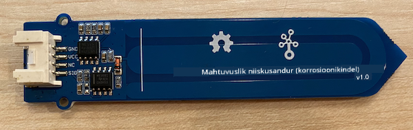
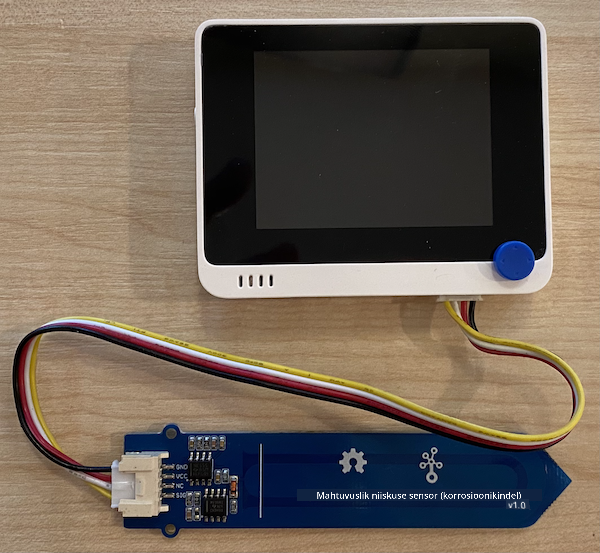

<!--
CO_OP_TRANSLATOR_METADATA:
{
  "original_hash": "0d55caa8c23d73635b7559102cd17b8a",
  "translation_date": "2025-10-11T12:25:40+00:00",
  "source_file": "2-farm/lessons/2-detect-soil-moisture/wio-terminal-soil-moisture.md",
  "language_code": "et"
}
-->
# Mõõda mulla niiskust - Wio Terminal

Selles õppetunni osas lisad oma Wio Terminalile mahtuvusliku mulla niiskuse sensori ja loed sellest väärtusi.

## Riistvara

Wio Terminal vajab mahtuvuslikku mulla niiskuse sensorit.

Sensor, mida kasutad, on [mahtuvuslik mulla niiskuse sensor](https://www.seeedstudio.com/Grove-Capacitive-Moisture-Sensor-Corrosion-Resistant.html), mis mõõdab mulla niiskust, tuvastades mulla mahtuvust – omadust, mis muutub vastavalt mulla niiskuse tasemele. Kui mulla niiskus suureneb, väheneb pinge.

See on analoogsensor, mis ühendatakse Wio Terminali analoogpistikutesse, kasutades sisseehitatud ADC-d, et luua väärtus vahemikus 0–1023.

### Ühenda mulla niiskuse sensor

Grove mulla niiskuse sensorit saab ühendada Wio Terminali konfigureeritava analoog/digitaalpordi külge.

#### Ülesanne - ühenda mulla niiskuse sensor

Ühenda mulla niiskuse sensor.



1. Sisesta Grove-kaabli üks ots mulla niiskuse sensori pistikusse. Kaabel läheb sisse ainult ühes suunas.

1. Kui Wio Terminal on arvutist või muust toiteallikast lahti ühendatud, ühenda Grove-kaabli teine ots Wio Terminali parempoolse Grove-pistiku külge, vaadates ekraani. See on pistik, mis asub kõige kaugemal toitenupust.



1. Sisesta mulla niiskuse sensor mulda. Sellel on "kõrgeima positsiooni joon" – valge joon sensori peal. Sisesta sensor kuni selle jooneni, kuid mitte üle selle.


1. Nüüd saad ühendada Wio Terminali oma arvutiga.

## Programmeeri mulla niiskuse sensor

Wio Terminali saab nüüd programmeerida kasutama ühendatud mulla niiskuse sensorit.

### Ülesanne - programmeeri mulla niiskuse sensor

Programmeeri seade.

1. Loo täiesti uus Wio Terminali projekt, kasutades PlatformIO-d. Nimeta see projekt `soil-moisture-sensor`. Lisa kood `setup` funktsiooni, et konfigureerida jadaport.

    > ⚠️ Vajadusel viita [juhistele PlatformIO projekti loomiseks projektis 1, õppetunnis 1](../../../1-getting-started/lessons/1-introduction-to-iot/wio-terminal.md#create-a-platformio-project).

1. Selle sensori jaoks ei ole eraldi teeki, kuid analoogpinnilt saab lugeda sisseehitatud Arduino [`analogRead`](https://www.arduino.cc/reference/en/language/functions/analog-io/analogread/) funktsiooni abil. Alusta analoogpinna sisendiks konfigureerimisest, et saaks sealt väärtusi lugeda, lisades järgmise koodi `setup` funktsiooni:

    ```cpp
    pinMode(A0, INPUT);
    ```

    See määrab `A0` pinni, kombineeritud analoog/digitaalpinna, sisendpinniks, kust saab pinget lugeda.

1. Lisa järgmine kood `loop` funktsiooni, et lugeda pinget sellelt pinnilt:

    ```cpp
    int soil_moisture = analogRead(A0);
    ```

1. Selle koodi alla lisa järgmine kood, et printida väärtus jadapordile:

    ```cpp
    Serial.print("Soil Moisture: ");
    Serial.println(soil_moisture);
    ```

1. Lõpuks lisa 10-sekundiline viivitus lõppu:

    ```cpp
    delay(10000);
    ```

1. Koosta ja laadi kood Wio Terminalile.

    > ⚠️ Vajadusel viita [juhistele PlatformIO projekti loomiseks projektis 1, õppetunnis 1](../../../1-getting-started/lessons/1-introduction-to-iot/wio-terminal.md#write-the-hello-world-app).

1. Kui kood on üles laaditud, saad mulla niiskust jälgida jadamonitori abil. Lisa mulda vett või eemalda sensor mullast ja vaata, kuidas väärtus muutub.

    ```output
    > Executing task: platformio device monitor <
    
    --- Available filters and text transformations: colorize, debug, default, direct, hexlify, log2file, nocontrol, printable, send_on_enter, time
    --- More details at http://bit.ly/pio-monitor-filters
    --- Miniterm on /dev/cu.usbmodem1201  9600,8,N,1 ---
    --- Quit: Ctrl+C | Menu: Ctrl+T | Help: Ctrl+T followed by Ctrl+H ---
    Soil Moisture: 526
    Soil Moisture: 529
    Soil Moisture: 521
    Soil Moisture: 494
    Soil Moisture: 454
    Soil Moisture: 456
    Soil Moisture: 395
    Soil Moisture: 388
    Soil Moisture: 394
    Soil Moisture: 391
    ```

    Näites toodud väljundis näed, kuidas pinge langeb, kui vett lisatakse.

> 💁 Selle koodi leiad [kaustast code/wio-terminal](../../../../../2-farm/lessons/2-detect-soil-moisture/code/wio-terminal).

😀 Sinu mulla niiskuse sensori programm oli edukas!

---

**Lahtiütlus**:  
See dokument on tõlgitud AI tõlketeenuse [Co-op Translator](https://github.com/Azure/co-op-translator) abil. Kuigi püüame tagada täpsust, palume arvestada, et automaatsed tõlked võivad sisaldada vigu või ebatäpsusi. Algne dokument selle algses keeles tuleks pidada autoriteetseks allikaks. Olulise teabe puhul soovitame kasutada professionaalset inimtõlget. Me ei vastuta selle tõlke kasutamisest tulenevate arusaamatuste või valesti tõlgenduste eest.