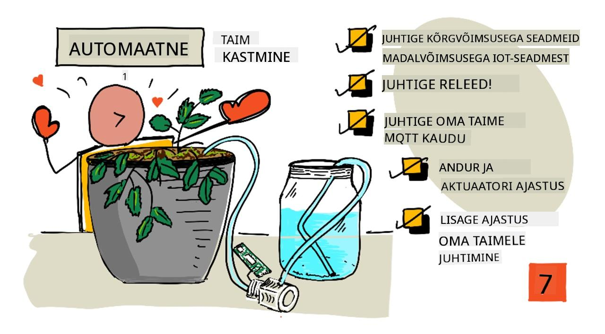
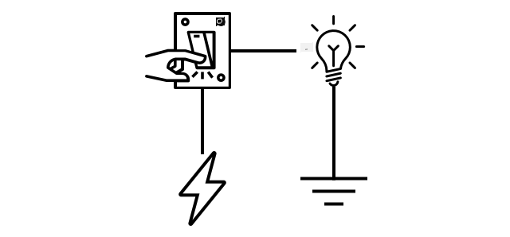
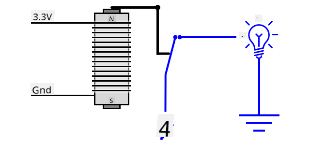
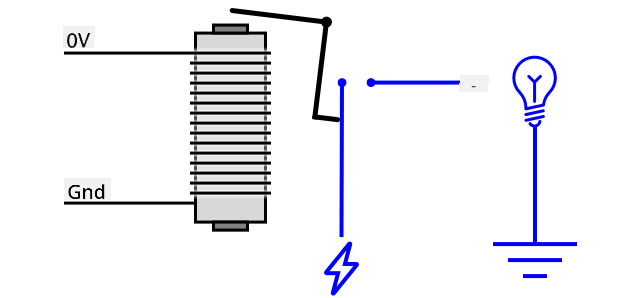
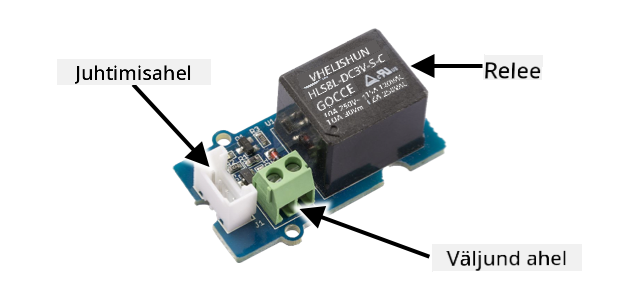
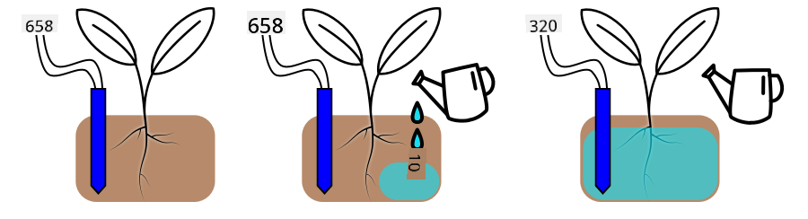
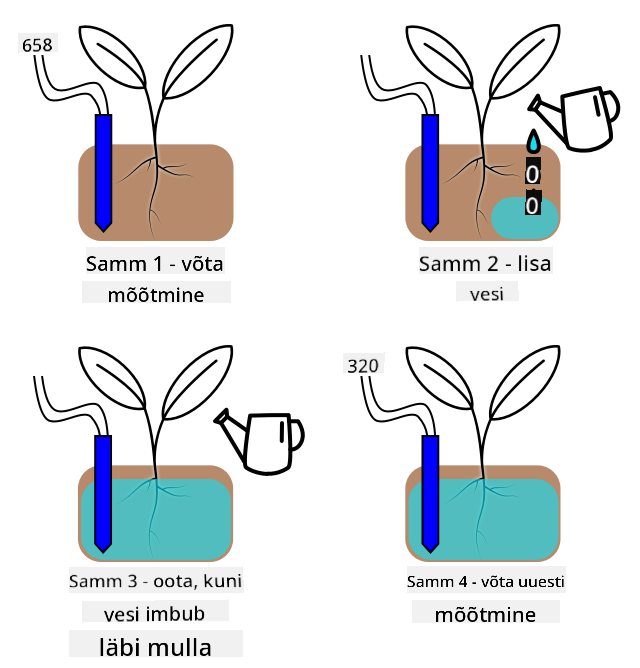

<!--
CO_OP_TRANSLATOR_METADATA:
{
  "original_hash": "f7bb24ba53fb627ddb38a8b24a05e594",
  "translation_date": "2025-10-11T12:45:45+00:00",
  "source_file": "2-farm/lessons/3-automated-plant-watering/README.md",
  "language_code": "et"
}
-->
# Automaatne taimede kastmine



> Visuaalne ülevaade: [Nitya Narasimhan](https://github.com/nitya). Klõpsa pildil, et näha suuremat versiooni.

See õppetund oli osa [IoT algajatele: Projekt 2 - Digitaalne põllumajandus](https://youtube.com/playlist?list=PLmsFUfdnGr3yCutmcVg6eAUEfsGiFXgcx) sarjast, mida korraldas [Microsoft Reactor](https://developer.microsoft.com/reactor/?WT.mc_id=academic-17441-jabenn).

[](https://youtu.be/g9FfZwv9R58)

## Eel-loengu viktoriin

[Eel-loengu viktoriin](https://black-meadow-040d15503.1.azurestaticapps.net/quiz/13)

## Sissejuhatus

Eelmises õppetunnis õppisite, kuidas jälgida mulla niiskust. Selles õppetunnis õpite, kuidas ehitada automaatse kastmissüsteemi põhikomponente, mis reageerivad mulla niiskusele. Samuti saate teada ajastuse kohta – kuidas sensorid vajavad aega muutustele reageerimiseks ja kuidas aktuaatorid vajavad aega, et muuta sensori poolt mõõdetavaid omadusi.

Selles õppetunnis käsitleme:

* [Kuidas juhtida suure võimsusega seadmeid madala võimsusega IoT-seadmest](../../../../../2-farm/lessons/3-automated-plant-watering)
* [Kuidas juhtida releed](../../../../../2-farm/lessons/3-automated-plant-watering)
* [Kuidas juhtida oma taime MQTT kaudu](../../../../../2-farm/lessons/3-automated-plant-watering)
* [Sensori ja aktuaatori ajastus](../../../../../2-farm/lessons/3-automated-plant-watering)
* [Ajastuse lisamine taime juhtimiserverisse](../../../../../2-farm/lessons/3-automated-plant-watering)

## Kuidas juhtida suure võimsusega seadmeid madala võimsusega IoT-seadmest

IoT-seadmed kasutavad madalat pinget. Kuigi see on piisav sensorite ja madala võimsusega aktuaatorite, nagu LED-id, jaoks, on see liiga madal suuremate seadmete, näiteks kastmispumba, juhtimiseks. Isegi väikesed pumbad, mida saaksite kasutada toataimede jaoks, tarbivad liiga palju voolu IoT arenduskomplekti jaoks ja võivad plaadi läbi põletada.

> 🎓 Vool, mida mõõdetakse amprites (A), näitab elektri hulka, mis liigub läbi vooluringi. Pinge annab tõuke, vool näitab, kui palju tõugatakse. Lisateavet voolu kohta leiate [Wikipedia elektrivoolu lehelt](https://wikipedia.org/wiki/Electric_current).

Lahendus sellele probleemile on ühendada pump välise toiteallikaga ja kasutada aktuaatorit pumba sisse lülitamiseks, sarnaselt sellele, kuidas lülitate valguse sisse. Väike kogus energiat (näiteks teie keha energia) on piisav, et sõrm lülitaks lüliti sisse, mis ühendab valguse koduse elektrivõrguga, mis töötab 110v/240v pingel.



> 🎓 [Kodune elektrivõrk](https://wikipedia.org/wiki/Mains_electricity) viitab elektrile, mida tarnitakse kodudesse ja ettevõtetesse riikliku infrastruktuuri kaudu paljudes maailma osades.

✅ IoT-seadmed suudavad tavaliselt pakkuda 3.3V või 5V pinget, vähem kui 1 amprit (1A) voolu. Võrdluseks, kodune elektrivõrk töötab enamasti 230V pingel (120V Põhja-Ameerikas ja 100V Jaapanis) ning suudab toita seadmeid, mis tarbivad kuni 30A voolu.

Selleks on mitmeid aktuaatoreid, sealhulgas mehaanilised seadmed, mida saab kinnitada olemasolevatele lülititele, et jäljendada sõrme nende sisse lülitamisel. Kõige populaarsem neist on relee.

### Releed

Relee on elektromehhaaniline lüliti, mis muudab elektrilise signaali mehaaniliseks liikumiseks, mis lülitab lüliti sisse. Relee tuumaks on elektromagnet.

> 🎓 [Elektromagnetid](https://wikipedia.org/wiki/Electromagnet) on magnetid, mis luuakse elektri juhtimisega läbi traadi mähise. Kui elekter on sisse lülitatud, muutub mähis magnetiliseks. Kui elekter on välja lülitatud, kaotab mähis oma magnetismi.



Relees juhib juhtimisahel elektromagneti. Kui elektromagnet on sisse lülitatud, tõmbab see kangi, mis liigutab lülitit, sulgedes kontaktid ja lõpetades väljundvooluringi.



Kui juhtimisahel on välja lülitatud, lülitub elektromagnet välja, vabastades kangi ja avades kontaktid, lülitades väljundvooluringi välja. Releed on digitaalsed aktuaatorid – kõrge signaal lülitab relee sisse, madal signaal lülitab selle välja.

Väljundvooluringi saab kasutada täiendava riistvara, näiteks kastmissüsteemi, toiteks. IoT-seade saab relee sisse lülitada, lõpetades väljundvooluringi, mis toidab kastmissüsteemi, ja taimed saavad vett. IoT-seade saab seejärel relee välja lülitada, katkestades kastmissüsteemi toite ja lülitades vee välja.


Ülaltoodud videos lülitatakse relee sisse. Relee LED süttib, et näidata, et see on sisse lülitatud (mõnel releeplaadil on LED-id, mis näitavad, kas relee on sisse või välja lülitatud), ja vool suunatakse pumbale, mis lülitub sisse ja pumpab vett taimele.

> 💁 Releed saab kasutada ka kahe väljundvooluringi vahel vahetamiseks, mitte ühe sisse ja välja lülitamiseks. Kui kang liigub, liigutab see lülitit ühe väljundvooluringi lõpetamisest teise lõpetamiseni, jagades tavaliselt ühise toiteühenduse või ühise maandusühenduse.

✅ Uurige: Releesid on mitut tüüpi, erinevustega, näiteks kas juhtimisahel lülitab relee sisse või välja, kui vool on rakendatud, või mitme väljundvooluringiga. Uurige nende erinevate tüüpide kohta.

Kui kang liigub, kuulete tavaliselt, kuidas see elektromagnetiga kontakti teeb, tehes selge klõpsu.

> 💁 Relee saab juhtida nii, et ühenduse loomine katkestab tegelikult relee toite, lülitades relee välja, mis seejärel saadab releele toite, lülitades selle uuesti sisse ja nii edasi. See tähendab, et relee klõpsab väga kiiresti, tekitades sumisevat heli. Nii töötasid mõned esimesed elektrilised uksekellad.

### Relee toide

Elektromagnet ei vaja palju energiat, et aktiveeruda ja kangi tõmmata, seda saab juhtida 3.3V või 5V väljundiga IoT arenduskomplektist. Väljundvooluring suudab kanda palju rohkem energiat, sõltuvalt releest, sealhulgas koduvõrgu pinget või isegi kõrgemaid energiatasemeid tööstuslikuks kasutamiseks. Nii saab IoT arenduskomplekt juhtida kastmissüsteemi, alates väikesest pumbast ühe taime jaoks kuni massiivse tööstusliku süsteemini terve kommertsfarmi jaoks.



Ülaltoodud pildil on Grove relee. Juhtimisahel ühendub IoT-seadmega ja lülitab relee sisse või välja, kasutades 3.3V või 5V. Väljundvooluringil on kaks terminali, millest kumbki võib olla toide või maandus. Väljundvooluring suudab käsitleda kuni 250V pinget ja 10A voolu, mis on piisav mitmesuguste koduvõrgu seadmete jaoks. Saadaval on releed, mis suudavad käsitleda veelgi kõrgemaid energiatasemeid.


Ülaltoodud pildil tarnitakse pumpa relee kaudu. Punane juhe ühendab USB toiteallika +5V terminali relee väljundvooluringi ühe terminaliga ja teine punane juhe ühendab väljundvooluringi teise terminali pumbaga. Must juhe ühendab pumba USB toiteallika maandusega. Kui relee lülitub sisse, lõpetab see vooluringi, saates pumbale 5V ja lülitades pumba sisse.

## Kuidas juhtida releed

Releed saab juhtida oma IoT arenduskomplektist.

### Ülesanne - relee juhtimine

Töötage läbi vastav juhend, et juhtida releed oma IoT-seadme abil:

* [Arduino - Wio Terminal](wio-terminal-relay.md)
* [Üheplaadiarvuti - Raspberry Pi](pi-relay.md)
* [Üheplaadiarvuti - Virtuaalne seade](virtual-device-relay.md)

## Kuidas juhtida oma taime MQTT kaudu

Praegu juhib releed IoT-seade otse ühe mulla niiskuse mõõtmise põhjal. Kommertskastmissüsteemis on juhtimisloogika tsentraliseeritud, võimaldades teha kastmisotsuseid mitme sensori andmete põhjal ja võimaldades konfiguratsiooni muuta ühes kohas. Selle simuleerimiseks saate releed juhtida MQTT kaudu.

### Ülesanne - relee juhtimine MQTT kaudu

1. Lisage vastavad MQTT teegid/pip-paketid ja kood oma `soil-moisture-sensor` projekti, et ühenduda MQTT-ga. Nimetage kliendi ID `soilmoisturesensor_client`, lisades sellele oma ID.

    > ⚠️ Vajadusel saate viidata [ühenduse loomise juhistele MQTT-ga projektis 1, õppetund 4](../../../1-getting-started/lessons/4-connect-internet/README.md#connect-your-iot-device-to-mqtt).

1. Lisage vastav seadmekood, et saata telemeetriat mulla niiskuse seadistustega. Telemeetria sõnumi jaoks nimetage omadus `soil_moisture`.

    > ⚠️ Vajadusel saate viidata [telemeetria saatmise juhistele MQTT-sse projektis 1, õppetund 4](../../../1-getting-started/lessons/4-connect-internet/README.md#send-telemetry-from-your-iot-device).

1. Looge kohalik serverikood, mis tellib telemeetriat ja saadab käsu relee juhtimiseks kaustas `soil-moisture-sensor-server`. Nimetage käsusõnumi omadus `relay_on` ja seadke kliendi ID `soilmoisturesensor_server`, lisades sellele oma ID. Hoidke sama struktuuri, mis serverikoodil, mille kirjutasite projektis 1, õppetund 4, kuna lisate sellele koodile hiljem selles õppetunnis.

    > ⚠️ Vajadusel saate viidata [telemeetria saatmise juhistele MQTT-sse](../../../1-getting-started/lessons/4-connect-internet/README.md#write-the-server-code) ja [käskude saatmise juhistele MQTT kaudu](../../../1-getting-started/lessons/4-connect-internet/README.md#send-commands-to-the-mqtt-broker) projektis 1, õppetund 4.

1. Lisage vastav seadmekood, et juhtida releed saadud käskude põhjal, kasutades sõnumi omadust `relay_on`. Saatke `relay_on` jaoks true, kui `soil_moisture` on suurem kui 450, vastasel juhul saatke false, sama loogika, mille lisasite IoT-seadmele varem.

    > ⚠️ Vajadusel saate viidata [käskudele MQTT-st reageerimise juhistele projektis 1, õppetund 4](../../../1-getting-started/lessons/4-connect-internet/README.md#handle-commands-on-the-iot-device).

> 💁 Selle koodi leiate kaustast [code-mqtt](../../../../../2-farm/lessons/3-automated-plant-watering/code-mqtt).

Veenduge, et kood töötab teie seadmes ja kohalikus serveris, ning testige seda, muutes mulla niiskuse taset, kas virtuaalse sensori saadetud väärtusi muutes või mulla niiskustaset muutes, lisades vett või eemaldades sensori mullast.

## Sensori ja aktuaatori ajastus

Tagasi õppetunnis 3 ehitasite öölambi – LED-i, mis lülitub sisse kohe, kui valguse tase langeb madalale, mida tuvastab valgussensor. Valgussensor tuvastas valguse taseme muutuse koheselt ja seade suutis kiiresti reageerida, piiratud ainult `loop` funktsiooni või `while True:` tsükli viivituse pikkusega. IoT arendajana ei saa te alati sellisele kiirele tagasiside tsüklile loota.

### Mulla niiskuse ajastus

Kui tegite eelmise õppetunni mulla niiskuse kohta füüsilise sensoriga, märkasite, et mulla niiskuse näit langes alles mõne sekundi pärast, kui kastsite oma taime. See ei ole tingitud sensori aeglusest, vaid sellest, et vesi vajab aega, et imbuda läbi mulla.

> 💁 Kui kastsite sensori lähedal, võisite näha, et näit langes kiiresti ja siis tõusis tagasi – see on põhjustatud vee levimisest sensori lähedalt ülejäänud mulda, vähendades sensori juures mulla niiskust.



Ülaltoodud diagrammil näitab mulla niiskuse näit 658. Taim kastetakse, kuid see näit ei muutu kohe, kuna vesi pole veel sensorini jõudnud. Kastmine võib isegi lõppeda enne, kui vesi jõuab sensorini ja väärtus langeb, kajastades uut niiskustaset.

Kui kirjutaksite koodi kastmissüsteemi juhtimiseks relee kaudu mulla niiskuse taseme põhjal, peaksite seda viivitust arvesse võtma ja ehitama oma IoT-seadmesse targema ajastuse.

✅ Mõelge hetkeks, kuidas te seda teeksite.

### Sensori ja aktuaatori ajastuse juhtimine
Kujutle, et sul on ülesanne ehitada niisutussüsteem farmi jaoks. Pinnase tüübi põhjal on leitud, et taimede ideaalne pinnase niiskustase vastab analoogpingele 400–450.

Seadme võiks programmeerida samamoodi nagu öölambi – kogu aeg, kui sensor loeb üle 450, lülitatakse relee sisse, et pump tööle panna. Probleem on aga selles, et vesi vajab aega, et pumbast pinnasesse ja sensorini jõuda. Sensor peatab vee, kui tuvastab taseme 450, kuid veetase jätkab langemist, kuna pumbatud vesi imbub edasi pinnasesse. Lõpptulemuseks on vee raiskamine ja juurte kahjustamise oht.

✅ Pea meeles – liiga palju vett võib olla taimedele sama kahjulik kui liiga vähe ning raiskab väärtuslikku ressurssi.

Parem lahendus on mõista, et aktuaatori sisselülitamise ja sensori loetava omaduse muutumise vahel on viivitus. See tähendab, et sensor peaks mitte ainult ootama enne väärtuse uuesti mõõtmist, vaid ka aktuaator peaks olema mõnda aega välja lülitatud enne järgmist sensori mõõtmist.

Kui kaua peaks relee iga kord sees olema? Parem on olla ettevaatlik ja lülitada relee sisse ainult lühikeseks ajaks, seejärel oodata, kuni vesi imbub pinnasesse, ja siis uuesti niiskustaset kontrollida. Lõppude lõpuks saab alati pumpa uuesti sisse lülitada, et vett lisada, kuid pinnasest vett eemaldada ei saa.

> 💁 Selline ajastuse kontroll on väga spetsiifiline IoT-seadme, mõõdetava omaduse ning kasutatavate sensorite ja aktuaatorite jaoks.


Näiteks mul on maasikataim, millel on pinnase niiskuse sensor ja pump, mida juhib relee. Olen täheldanud, et kui vett lisada, kulub umbes 20 sekundit, enne kui pinnase niiskuse näit stabiliseerub. See tähendab, et pean relee välja lülitama ja ootama 20 sekundit enne niiskustaseme kontrollimist. Pigem liiga vähe vett kui liiga palju – pumpa saab alati uuesti sisse lülitada, kuid taimest vett välja võtta ei saa.



See tähendab, et parim protsess oleks niisutustsükkel, mis näeb välja umbes selline:

* Lülita pump sisse 5 sekundiks
* Oota 20 sekundit
* Kontrolli pinnase niiskust
* Kui tase on endiselt üle vajaliku, korda ülaltoodud samme

5 sekundit võib pumba jaoks olla liiga pikk aeg, eriti kui niiskustase on vaid veidi üle vajaliku taseme. Parim viis ajastuse määramiseks on proovida ja seejärel kohandada, kui sensori andmed on saadaval, pideva tagasiside tsükliga. See võib viia isegi täpsema ajastamiseni, näiteks pumba sisselülitamine 1 sekundiks iga 100 üle vajaliku pinnase niiskuse taseme asemel, mitte fikseeritud 5 sekundiks.

✅ Tee veidi uurimistööd: Kas on veel muid ajastuse kaalutlusi? Kas taimi saab kasta igal ajal, kui pinnase niiskus on liiga madal, või on olemas kindlad kellaajad, mis on kastmiseks head ja halvad?

> 💁 Ilmaennustusi saab samuti arvesse võtta, kui kontrollida automaatseid niisutussüsteeme välitingimustes kasvatamiseks. Kui on oodata vihma, siis kastmist saab edasi lükata, kuni vihm on lõppenud. Sel hetkel võib pinnas olla piisavalt niiske, et kastmist pole vaja, mis on palju tõhusam kui vee raiskamine vahetult enne vihma.

## Lisa ajastus oma taimekontrolliserverisse

Serveri koodi saab muuta, et lisada kontroll niisutustsükli ajastuse ja pinnase niiskustaseme muutumise ootamise üle. Serveri loogika relee ajastuse kontrollimiseks on järgmine:

1. Telemeetria sõnum vastu võetud
1. Kontrolli pinnase niiskustaset
1. Kui tase on korras, ära tee midagi. Kui näit on liiga kõrge (mis tähendab, et pinnase niiskus on liiga madal), siis:
    1. Saada käsk relee sisselülitamiseks
    1. Oota 5 sekundit
    1. Saada käsk relee väljalülitamiseks
    1. Oota 20 sekundit, et pinnase niiskustase stabiliseeruks

Niisutustsükkel, protsess telemeetria sõnumi vastuvõtmisest kuni pinnase niiskustaseme uuesti töötlemiseks valmisolekuni, võtab umbes 25 sekundit. Me saadame pinnase niiskustaseme andmeid iga 10 sekundi järel, seega on kattuvus, kus sõnum saadetakse, samal ajal kui server ootab pinnase niiskustaseme stabiliseerumist, mis võib käivitada uue niisutustsükli.

Selle lahendamiseks on kaks võimalust:

* Muuda IoT-seadme koodi nii, et telemeetria saadetakse ainult iga minut, sel viisil niisutustsükkel lõppeb enne järgmise sõnumi saatmist
* Tühista telemeetria tellimus niisutustsükli ajal

Esimene võimalus ei ole alati hea lahendus suurte farmide jaoks. Põllumees võib soovida salvestada pinnase niiskustaseme andmeid kastmise ajal hilisemaks analüüsiks, näiteks et olla teadlik vee voolust farmi erinevates piirkondades, et suunata sihipärasemat kastmist. Teine võimalus on parem – kood lihtsalt ignoreerib telemeetriat, kui seda ei saa kasutada, kuid telemeetria on endiselt olemas teiste teenuste jaoks, mis võivad seda tellida.

> 💁 IoT-andmeid ei saadeta ainult ühest seadmest ühele teenusele, vaid paljud seadmed võivad saata andmeid vahendajale ja paljud teenused võivad neid andmeid vahendajalt kuulata. Näiteks üks teenus võib kuulata pinnase niiskuse andmeid ja salvestada need andmebaasi hilisemaks analüüsiks. Teine teenus võib kuulata sama telemeetriat, et juhtida niisutussüsteemi.

### Ülesanne - lisa ajastus oma taimekontrolliserverisse

Uuenda oma serveri koodi, et relee töötaks 5 sekundit ja ootaks seejärel 20 sekundit.

1. Ava `soil-moisture-sensor-server` kaust VS Code'is, kui see pole juba avatud. Veendu, et virtuaalne keskkond on aktiveeritud.

1. Ava `app.py` fail

1. Lisa järgmine kood `app.py` faili olemasolevate importide alla:

    ```python
    import threading
    ```

    See lause impordib Python'i teegist `threading`, mis võimaldab Python'il täita muud koodi ootamise ajal.

1. Lisa järgmine kood enne `handle_telemetry` funktsiooni, mis töötleb serveri koodis vastu võetud telemeetria sõnumeid:

    ```python
    water_time = 5
    wait_time = 20
    ```

    See määratleb, kui kaua relee töötab (`water_time`) ja kui kaua pärast seda oodatakse, et pinnase niiskust kontrollida (`wait_time`).

1. Lisa selle koodi alla järgmine:

    ```python
    def send_relay_command(client, state):
        command = { 'relay_on' : state }
        print("Sending message:", command)
        client.publish(server_command_topic, json.dumps(command))
    ```

    See kood määratleb funktsiooni nimega `send_relay_command`, mis saadab MQTT kaudu käsu relee juhtimiseks. Telemeetria luuakse sõnastikuna ja seejärel muudetakse JSON-stringiks. `state` väärtus määrab, kas relee peaks olema sisse või välja lülitatud.

1. Lisa pärast `send_relay_code` funktsiooni järgmine kood:

    ```python
    def control_relay(client):
        print("Unsubscribing from telemetry")
        mqtt_client.unsubscribe(client_telemetry_topic)
    
        send_relay_command(client, True)
        time.sleep(water_time)
        send_relay_command(client, False)
    
        time.sleep(wait_time)
    
        print("Subscribing to telemetry")
        mqtt_client.subscribe(client_telemetry_topic)
    ```

    See määratleb funktsiooni relee juhtimiseks vastavalt vajalikele ajastustele. See algab telemeetria tellimuse tühistamisega, et pinnase niiskuse sõnumeid ei töödeldaks kastmise ajal. Järgmisena saadab see käsu relee sisselülitamiseks. Seejärel ootab `water_time` enne relee väljalülitamise käsu saatmist. Lõpuks ootab see `wait_time` sekundeid, et pinnase niiskustase stabiliseeruks. Seejärel tellib telemeetria uuesti.

1. Muuda `handle_telemetry` funktsioon järgnevaks:

    ```python
    def handle_telemetry(client, userdata, message):
        payload = json.loads(message.payload.decode())
        print("Message received:", payload)
    
        if payload['soil_moisture'] > 450:
            threading.Thread(target=control_relay, args=(client,)).start()
    ```

    See kood kontrollib pinnase niiskustaset. Kui see on üle 450, vajab pinnas kastmist, seega kutsub see `control_relay` funktsiooni. See funktsioon töötab eraldi lõimes, taustal.

1. Veendu, et sinu IoT-seade töötab, ja käivita see kood. Muuda pinnase niiskustaset ja jälgi, mis releega juhtub – see peaks töötama 5 sekundit ja jääma vähemalt 20 sekundiks välja, lülitudes sisse ainult siis, kui pinnase niiskustase pole piisav.

    ```output
    (.venv) ➜  soil-moisture-sensor-server ✗ python app.py
    Message received: {'soil_moisture': 457}
    Unsubscribing from telemetry
    Sending message: {'relay_on': True}
    Sending message: {'relay_on': False}
    Subscribing to telemetry
    Message received: {'soil_moisture': 302}
    ```

    Hea viis seda simuleeritud niisutussüsteemis testida on kasutada kuiva pinnast ja valada vett käsitsi, kui relee on sees, peatades valamise, kui relee välja lülitub.

> 💁 Selle koodi leiad [code-timing](../../../../../2-farm/lessons/3-automated-plant-watering/code-timing) kaustast.

> 💁 Kui soovid kasutada pumpa, et ehitada päris niisutussüsteem, siis saad kasutada [6V veepumpa](https://www.seeedstudio.com/6V-Mini-Water-Pump-p-1945.html) koos [USB terminali toiteallikaga](https://www.adafruit.com/product/3628). Veendu, et pumba toide oleks relee kaudu ühendatud.

---

## 🚀 Väljakutse

Kas oskad mõelda mõnele teisele IoT- või elektriseadmele, millel on sarnane probleem, kus aktuaatori tulemuste jõudmine sensorini võtab aega? Tõenäoliselt on sul kodus või koolis paar sellist seadet.

* Milliseid omadusi need mõõdavad?
* Kui kaua võtab aega, et omadus muutuks pärast aktuaatori kasutamist?
* Kas on okei, kui omadus muutub üle vajaliku väärtuse?
* Kuidas saab vajadusel tagasi viia vajaliku väärtuse juurde?

## Loengu järgne viktoriin

[Loengu järgne viktoriin](https://black-meadow-040d15503.1.azurestaticapps.net/quiz/14)

## Ülevaade ja iseseisev õppimine

* Loe rohkem releede kohta, sealhulgas nende ajaloolisest kasutusest telefonikeskjaamades, [relee Wikipedia lehelt](https://wikipedia.org/wiki/Relay).

## Ülesanne

[Ehita tõhusam kastmistsükkel](assignment.md)

---

**Lahtiütlus**:  
See dokument on tõlgitud AI tõlketeenuse [Co-op Translator](https://github.com/Azure/co-op-translator) abil. Kuigi püüame tagada täpsust, palume arvestada, et automaatsed tõlked võivad sisaldada vigu või ebatäpsusi. Algne dokument selle algses keeles tuleks pidada autoriteetseks allikaks. Olulise teabe puhul soovitame kasutada professionaalset inimtõlget. Me ei vastuta selle tõlke kasutamisest tulenevate arusaamatuste või valesti tõlgenduste eest.