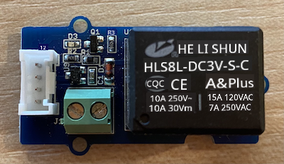
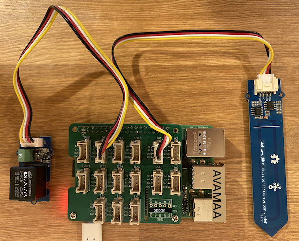

<!--
CO_OP_TRANSLATOR_METADATA:
{
  "original_hash": "66b81165e60f8f169bd52a401b6a0f8b",
  "translation_date": "2025-10-11T12:46:59+00:00",
  "source_file": "2-farm/lessons/3-automated-plant-watering/pi-relay.md",
  "language_code": "et"
}
-->
# Juhtige releed - Raspberry Pi

Selles õppetüki osas lisate oma Raspberry Pi-le relee lisaks mulla niiskuse andurile ja juhite seda mulla niiskustaseme põhjal.

## Riistvara

Raspberry Pi vajab releed.

Relee, mida kasutate, on [Grove relee](https://www.seeedstudio.com/Grove-Relay.html), tavaliselt avatud relee (see tähendab, et väljundvooluring on avatud või ühendamata, kui releele signaali ei saadeta), mis suudab käsitleda kuni 250V ja 10A väljundvooluringe.

See on digitaalne täiturmehhanism, seega ühendatakse see Grove Base Hat'i digitaalse pistikuga.

### Ühendage relee

Grove relee saab ühendada Raspberry Pi-ga.

#### Ülesanne

Ühendage relee.



1. Sisestage Grove kaabli üks ots relee pistikusse. See läheb sisse ainult ühel viisil.

1. Kui Raspberry Pi on välja lülitatud, ühendage Grove kaabli teine ots digitaalse pistikuga, mis on märgitud **D5** Grove Base Hat'il, mis on ühendatud Pi-ga. See pistik on teine vasakult, pistikute reas GPIO pin'ide kõrval. Jätke mulla niiskuse andur ühendatuks **A0** pistikuga.



1. Sisestage mulla niiskuse andur mulda, kui see ei ole juba eelmise õppetüki käigus tehtud.

## Programmeerige relee

Nüüd saab Raspberry Pi programmeerida kasutama ühendatud releed.

### Ülesanne

Programmeerige seade.

1. Lülitage Pi sisse ja oodake, kuni see käivitub.

1. Avage `soil-moisture-sensor` projekt eelmise õppetüki põhjal VS Code'is, kui see pole juba avatud. Lisate sellele projektile koodi.

1. Lisage järgmine kood `app.py` faili olemasolevate importide alla:

    ```python
    from grove.grove_relay import GroveRelay
    ```
  
   See käsk impordib `GroveRelay` Grove Python'i teekidest, et suhelda Grove releega.

1. Lisage järgmine kood `ADC` klassi deklaratsiooni alla, et luua `GroveRelay` eksemplar:

    ```python
    relay = GroveRelay(5)
    ```
  
   See loob relee, kasutades pin'i **D5**, digitaalset pin'i, millega te relee ühendasite.

1. Et testida, kas relee töötab, lisage järgmine kood `while True:` tsüklisse:

    ```python
    relay.on()
    time.sleep(.5)
    relay.off()
    ```
  
   Kood lülitab relee sisse, ootab 0,5 sekundit ja lülitab seejärel relee välja.

1. Käivitage Python'i rakendus. Relee lülitub sisse ja välja iga 10 sekundi järel, poolesekundilise viivitusega sisse- ja väljalülitamise vahel. Kuulete, kuidas relee klõpsab sisse ja välja. Grove plaadi LED süttib, kui relee on sees, ja kustub, kui relee on väljas.

    

## Juhtige releed mulla niiskuse põhjal

Nüüd, kui relee töötab, saab seda juhtida vastavalt mulla niiskuse näitudele.

### Ülesanne

Juhtige releed.

1. Kustutage 3 koodirida, mille lisasite relee testimiseks. Asendage need järgmise koodiga:

    ```python
    if soil_moisture > 450:
        print("Soil Moisture is too low, turning relay on.")
        relay.on()
    else:
        print("Soil Moisture is ok, turning relay off.")
        relay.off()
    ```
  
   See kood kontrollib mulla niiskuse taset mulla niiskuse andurist. Kui see on üle 450, lülitab see relee sisse ja lülitab selle välja, kui tase langeb alla 450.

   > 💁 Tuletame meelde, et mahtuvuslik mulla niiskuse andur loeb: mida madalam on mulla niiskuse tase, seda rohkem on muld niiske ja vastupidi.

1. Käivitage Python'i rakendus. Näete, kuidas relee lülitub sisse või välja sõltuvalt mulla niiskuse tasemest. Proovige kuivas mullas ja lisage seejärel vett.

    ```output
    Soil Moisture: 638
    Soil Moisture is too low, turning relay on.
    Soil Moisture: 452
    Soil Moisture is too low, turning relay on.
    Soil Moisture: 347
    Soil Moisture is ok, turning relay off.
    ```
  
> 💁 Selle koodi leiate kaustast [code-relay/pi](../../../../../2-farm/lessons/3-automated-plant-watering/code-relay/pi).

😀 Teie mulla niiskuse anduriga juhitav relee programm õnnestus!

---

**Lahtiütlus**:  
See dokument on tõlgitud AI tõlketeenuse [Co-op Translator](https://github.com/Azure/co-op-translator) abil. Kuigi püüame tagada täpsust, palume arvestada, et automaatsed tõlked võivad sisaldada vigu või ebatäpsusi. Algne dokument selle algses keeles tuleks pidada autoriteetseks allikaks. Olulise teabe puhul soovitame kasutada professionaalset inimtõlget. Me ei vastuta selle tõlke kasutamisest tulenevate arusaamatuste või valesti tõlgenduste eest.