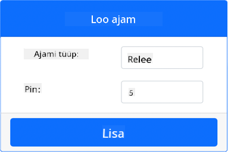
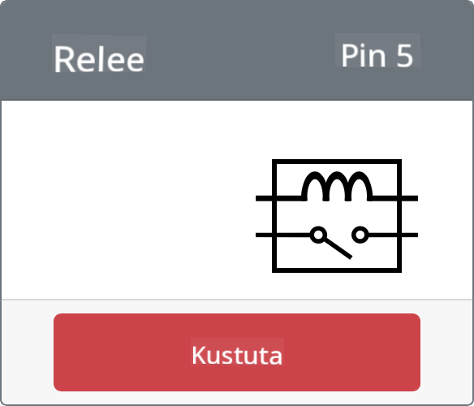

<!--
CO_OP_TRANSLATOR_METADATA:
{
  "original_hash": "f8f541ee945545017a51aaf309aa37c3",
  "translation_date": "2025-10-11T12:47:47+00:00",
  "source_file": "2-farm/lessons/3-automated-plant-watering/virtual-device-relay.md",
  "language_code": "et"
}
-->
# Juhtige releed - Virtuaalne IoT riistvara

Selles õppetunni osas lisate oma virtuaalsele IoT-seadmele relee lisaks mulla niiskuse andurile ja juhite seda mulla niiskustaseme põhjal.

## Virtuaalne riistvara

Virtuaalne IoT-seade kasutab simuleeritud Grove-releed. See hoiab labori samasugusena nagu füüsilise Grove-releega Raspberry Pi kasutamine.

Füüsilises IoT-seadmes oleks relee tavaliselt avatud relee (mis tähendab, et väljundring on avatud või lahti ühendatud, kui releele signaali ei saadeta). Selline relee suudab käsitleda väljundringi kuni 250V ja 10A.

### Lisa relee CounterFit-i

Virtuaalse relee kasutamiseks peate selle CounterFit rakendusse lisama.

#### Ülesanne

Lisa relee CounterFit rakendusse.

1. Ava VS Code'is `soil-moisture-sensor` projekt eelmisest õppetunnist, kui see pole juba avatud. Te lisate sellele projektile.

1. Veenduge, et CounterFit veebirakendus töötab.

1. Loo relee:

    1. *Create actuator* kastis *Actuators* paneelil avage *Actuator type* rippmenüü ja valige *Relay*.

    1. Määrake *Pin* väärtuseks *5*.

    1. Valige **Add** nupp, et luua relee Pin 5-le.

    

    Relee luuakse ja ilmub aktuaatorite loendisse.

    

## Programmeeri relee

Mulla niiskuse anduri rakendust saab nüüd programmeerida virtuaalse relee kasutamiseks.

### Ülesanne

Programmeeri virtuaalne seade.

1. Ava VS Code'is `soil-moisture-sensor` projekt eelmisest õppetunnist, kui see pole juba avatud. Te lisate sellele projektile.

1. Lisa järgmine kood `app.py` faili olemasolevate importide alla:

    ```python
    from counterfit_shims_grove.grove_relay import GroveRelay
    ```

    See käsk impordib `GroveRelay` Grove Python shim teekidest, et suhelda virtuaalse Grove-releega.

1. Lisa järgmine kood `ADC` klassi deklaratsiooni alla, et luua `GroveRelay` instants:

    ```python
    relay = GroveRelay(5)
    ```

    See loob relee, kasutades Pin **5**, millele te relee ühendasite.

1. Testimaks, kas relee töötab, lisa järgmine kood `while True:` tsüklisse:

    ```python
    relay.on()
    time.sleep(.5)
    relay.off()
    ```

    Kood lülitab relee sisse, ootab 0,5 sekundit ja lülitab relee välja.

1. Käivita Python rakendus. Relee lülitub sisse ja välja iga 10 sekundi järel, poolsekundilise viivitusega sisse- ja väljalülitamise vahel. Näete, kuidas virtuaalne relee CounterFit rakenduses sulgub ja avaneb, kui relee sisse ja välja lülitatakse.

    

## Juhi releed mulla niiskuse põhjal

Nüüd, kui relee töötab, saab seda juhtida mulla niiskuse näitude põhjal.

### Ülesanne

Juhi releed.

1. Kustuta 3 koodirida, mille lisasite relee testimiseks. Asenda need järgmise koodiga:

    ```python
    if soil_moisture > 450:
        print("Soil Moisture is too low, turning relay on.")
        relay.on()
    else:
        print("Soil Moisture is ok, turning relay off.")
        relay.off()
    ```

    See kood kontrollib mulla niiskustaset mulla niiskuse andurilt. Kui see on üle 450, lülitab see relee sisse, ja kui see langeb alla 450, lülitab relee välja.

    > 💁 Pea meeles, et mahtuvuslik mulla niiskuse andur loeb: mida madalam on mulla niiskustase, seda rohkem niiskust mullas on ja vastupidi.

1. Käivita Python rakendus. Näete, kuidas relee lülitub sisse või välja sõltuvalt mulla niiskustasemetest. Muutke mulla niiskuse anduri *Value* või *Random* seadeid, et näha väärtuse muutumist.

    ```output
    Soil Moisture: 638
    Soil Moisture is too low, turning relay on.
    Soil Moisture: 452
    Soil Moisture is too low, turning relay on.
    Soil Moisture: 347
    Soil Moisture is ok, turning relay off.
    ```

> 💁 Selle koodi leiate [code-relay/virtual-device](../../../../../2-farm/lessons/3-automated-plant-watering/code-relay/virtual-device) kaustast.

😀 Teie virtuaalne mulla niiskuse andur, mis juhib releed, töötas edukalt!

---

**Lahtiütlus**:  
See dokument on tõlgitud AI tõlketeenuse [Co-op Translator](https://github.com/Azure/co-op-translator) abil. Kuigi püüame tagada täpsust, palume arvestada, et automaatsed tõlked võivad sisaldada vigu või ebatäpsusi. Algne dokument selle algses keeles tuleks pidada autoriteetseks allikaks. Olulise teabe puhul soovitame kasutada professionaalset inimtõlget. Me ei vastuta selle tõlke kasutamisest tulenevate arusaamatuste või valesti tõlgenduste eest.