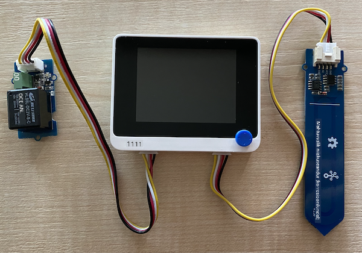

<!--
CO_OP_TRANSLATOR_METADATA:
{
  "original_hash": "f3c5d8afa2ef6a0b425ef8ff20615cb4",
  "translation_date": "2025-10-11T12:44:19+00:00",
  "source_file": "2-farm/lessons/3-automated-plant-watering/wio-terminal-relay.md",
  "language_code": "et"
}
-->
# Juhtige releed - Wio Terminal

Selles õppetunni osas lisate Wio Terminalile relee lisaks mulla niiskuse andurile ja juhite seda mulla niiskustaseme põhjal.

## Riistvara

Wio Terminal vajab releed.

Relee, mida kasutate, on [Grove relee](https://www.seeedstudio.com/Grove-Relay.html), tavaliselt avatud relee (see tähendab, et väljundring on avatud või lahti ühendatud, kui releele signaali ei saadeta), mis suudab käsitleda kuni 250V ja 10A väljundringi.

See on digitaalne ajam, mis ühendatakse Wio Terminali digitaalsete pistikutega. Kombineeritud analoog/digitaalne port on juba mulla niiskuse anduriga kasutusel, seega ühendatakse see teise pordiga, mis on kombineeritud I<sub>2</sub>C ja digitaalne port.

### Ühendage relee

Grove relee saab ühendada Wio Terminali digitaalse pordiga.

#### Ülesanne

Ühendage relee.


1. Sisestage Grove kaabli üks ots relee pistikusse. See läheb sisse ainult ühel viisil.

1. Kui Wio Terminal on arvutist või muust toiteallikast lahti ühendatud, ühendage Grove kaabli teine ots Wio Terminali vasakpoolse Grove pistikuga, vaadates ekraani. Jätke mulla niiskuse andur ühendatuks parempoolse pistikuga.



1. Sisestage mulla niiskuse andur mulda, kui see pole juba eelmisest õppetunnist seal.

## Programmeerige relee

Nüüd saab Wio Terminali programmeerida kasutama ühendatud releed.

### Ülesanne

Programmeeri seade.

1. Avage VS Code'is eelmise õppetunni projekt `soil-moisture-sensor`, kui see pole juba avatud. Lisate sellele projektile.

2. Selle ajami jaoks pole eraldi teeki - see on digitaalne ajam, mida juhitakse kõrge või madala signaaliga. Selle sisselülitamiseks saadate pordile kõrge signaali (3.3V), väljalülitamiseks madala signaali (0V). Seda saab teha sisseehitatud Arduino [`digitalWrite`](https://www.arduino.cc/reference/en/language/functions/digital-io/digitalwrite/) funktsiooni abil. Lisage `setup` funktsiooni lõppu järgmine kood, et seadistada kombineeritud I<sub>2</sub>C/digitaalne port väljundpordiks, mis saadab releele pinget:

    ```cpp
    pinMode(PIN_WIRE_SCL, OUTPUT);
    ```

    `PIN_WIRE_SCL` on kombineeritud I<sub>2</sub>C/digitaalse pordi number.

1. Relee töö testimiseks lisage `loop` funktsiooni lõppu, pärast viimast `delay`, järgmine kood:

    ```cpp
    digitalWrite(PIN_WIRE_SCL, HIGH);
    delay(500);
    digitalWrite(PIN_WIRE_SCL, LOW);
    ```

    Kood saadab releega ühendatud pordile kõrge signaali, et see sisse lülitada, ootab 500ms (pool sekundit), seejärel saadab madala signaali, et relee välja lülitada.

1. Koostage ja laadige kood Wio Terminalile.

1. Kui kood on üles laaditud, lülitub relee sisse ja välja iga 10 sekundi järel, poolsekundilise viivitusega sisse- ja väljalülitamise vahel. Kuulete relee klõpsu sisse ja välja lülitamisel. Grove plaadil olev LED süttib, kui relee on sees, ja kustub, kui relee on väljas.

    

## Juhtige releed mulla niiskuse põhjal

Nüüd, kui relee töötab, saab seda juhtida mulla niiskuse näitude põhjal.

### Ülesanne

Juhtige releed.

1. Kustutage 3 rida koodi, mille lisasite relee testimiseks. Asendage need järgmise koodiga:

    ```cpp
    if (soil_moisture > 450)
    {
        Serial.println("Soil Moisture is too low, turning relay on.");
        digitalWrite(PIN_WIRE_SCL, HIGH);
    }
    else
    {
        Serial.println("Soil Moisture is ok, turning relay off.");
        digitalWrite(PIN_WIRE_SCL, LOW);
    }
    ```

    See kood kontrollib mulla niiskuse taset mulla niiskuse andurist. Kui see on üle 450, lülitab see relee sisse, ja kui see langeb alla 450, lülitab relee välja.

    > 💁 Tuletame meelde, et mahtuvuslik mulla niiskuse andur loeb: mida madalam on mulla niiskuse tase, seda rohkem niiskust on mullas ja vastupidi.

1. Koostage ja laadige kood Wio Terminalile.

1. Jälgige seadet seeria monitori kaudu. Näete, kuidas relee lülitub sisse või välja sõltuvalt mulla niiskuse tasemest. Proovige kuivas mullas, seejärel lisage vett.

    ```output
    Soil Moisture: 638
    Soil Moisture is too low, turning relay on.
    Soil Moisture: 452
    Soil Moisture is too low, turning relay on.
    Soil Moisture: 347
    Soil Moisture is ok, turning relay off.
    ```

> 💁 Selle koodi leiate kaustast [code-relay/wio-terminal](../../../../../2-farm/lessons/3-automated-plant-watering/code-relay/wio-terminal).

😀 Teie mulla niiskuse anduriga relee juhtimise programm oli edukas!

---

**Lahtiütlus**:  
See dokument on tõlgitud AI tõlketeenuse [Co-op Translator](https://github.com/Azure/co-op-translator) abil. Kuigi püüame tagada täpsust, palume arvestada, et automaatsed tõlked võivad sisaldada vigu või ebatäpsusi. Algne dokument selle algses keeles tuleks pidada autoriteetseks allikaks. Olulise teabe puhul soovitame kasutada professionaalset inimtõlget. Me ei vastuta selle tõlke kasutamisest tulenevate arusaamatuste või valesti tõlgenduste eest.