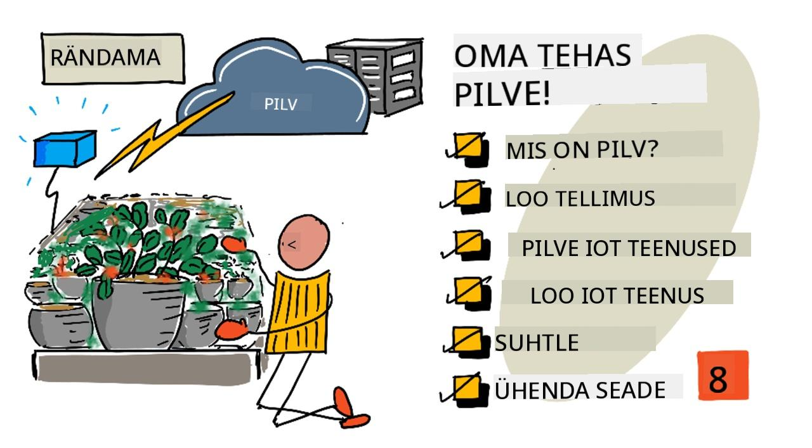
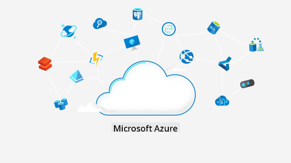
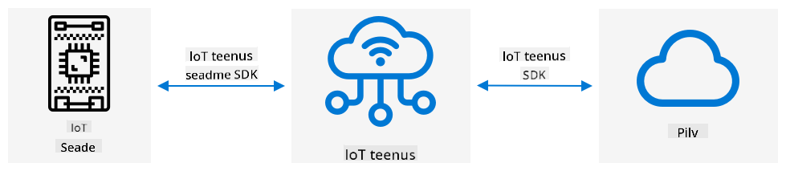
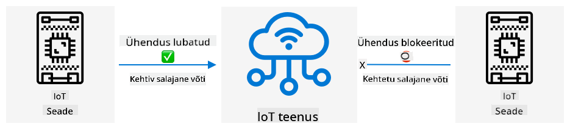
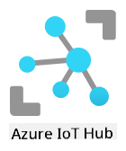

<!--
CO_OP_TRANSLATOR_METADATA:
{
  "original_hash": "4d8e7a066d75b625e7a979c14157041d",
  "translation_date": "2025-10-11T12:30:48+00:00",
  "source_file": "2-farm/lessons/4-migrate-your-plant-to-the-cloud/README.md",
  "language_code": "et"
}
-->
# Viige oma taim pilve



> Visuaal autorilt [Nitya Narasimhan](https://github.com/nitya). Klõpsake pildil, et näha suuremat versiooni.

See õppetund oli osa [IoT algajatele: Projekt 2 - Digitaalne põllumajandus](https://youtube.com/playlist?list=PLmsFUfdnGr3yCutmcVg6eAUEfsGiFXgcx) sarjast, mida korraldas [Microsoft Reactor](https://developer.microsoft.com/reactor/?WT.mc_id=academic-17441-jabenn).

[](https://youtu.be/bNxjopXkhvk)

## Eel-loengu viktoriin

[Eel-loengu viktoriin](https://black-meadow-040d15503.1.azurestaticapps.net/quiz/15)

## Sissejuhatus

Eelmises õppetunnis õppisite, kuidas ühendada oma taim MQTT brokeriga ja juhtida releed serverikoodiga, mis töötab lokaalselt. See moodustab tuuma internetiga ühendatud automaatse kastmissüsteemi jaoks, mida kasutatakse nii kodus üksikute taimede kui ka kommertspõllumajanduse jaoks.

IoT-seade suhtles avaliku MQTT brokeriga, et demonstreerida põhimõtteid, kuid see pole kõige usaldusväärsem ega turvalisem viis. Selles õppetunnis õpite tundma pilveteenuseid ja IoT-võimalusi, mida pakuvad avalikud pilveteenused. Samuti õpite, kuidas viia oma taim avalikust MQTT brokerist ühe sellise pilveteenuse juurde.

Selles õppetunnis käsitleme:

* [Mis on pilv?](../../../../../2-farm/lessons/4-migrate-your-plant-to-the-cloud)
* [Loo pilvetellimus](../../../../../2-farm/lessons/4-migrate-your-plant-to-the-cloud)
* [Pilve IoT-teenused](../../../../../2-farm/lessons/4-migrate-your-plant-to-the-cloud)
* [Loo IoT-teenus pilves](../../../../../2-farm/lessons/4-migrate-your-plant-to-the-cloud)
* [Suhtlemine IoT Hubiga](../../../../../2-farm/lessons/4-migrate-your-plant-to-the-cloud)
* [Ühendage oma seade IoT-teenusega](../../../../../2-farm/lessons/4-migrate-your-plant-to-the-cloud)

## Mis on pilv?

Enne pilve kasutuselevõttu, kui ettevõte soovis pakkuda teenuseid oma töötajatele (näiteks andmebaasid või failisalvestus) või avalikkusele (näiteks veebisaidid), ehitati ja haldati andmekeskust. See võis ulatuda väikesest arvutite ruumist kuni suure hooneni, kus oli palju arvuteid. Ettevõte haldas kõike, sealhulgas:

* Arvutite ostmine
* Riistvara hooldus
* Elektri- ja jahutussüsteemid
* Võrgundus
* Turvalisus, sealhulgas hoone ja tarkvara turvalisus
* Tarkvara paigaldamine ja uuendamine

See võis olla väga kallis, nõuda laia valikut oskustega töötajaid ja olla aeglane muutuste tegemisel. Näiteks, kui veebipood pidi valmistuma kiireks pühadehooajaks, tuli neil mitu kuud ette planeerida, et osta rohkem riistvara, seda seadistada ja paigaldada müügiprotsessi tarkvara. Pärast pühadehooaja lõppu, kui müük vähenes, jäid arvutid, mille eest oli makstud, seisma kuni järgmise kiire hooajani.

✅ Kas arvate, et see võimaldaks ettevõtetel kiiresti reageerida? Kui veebipoe riided muutuksid populaarseks tänu kuulsusele, kas nad suudaksid piisavalt kiiresti suurendada arvutusvõimsust, et toetada tellimuste järsku kasvu?

### Kellegi teise arvuti

Pilve nimetatakse tihti naljatades "kellegi teise arvutiks". Algne idee oli lihtne - arvutite ostmise asemel rentida kellegi teise arvutit. Keegi teine, pilveteenuse pakkuja, haldaks suuri andmekeskusi. Nad vastutaksid riistvara ostmise ja paigaldamise, elektri ja jahutuse, võrgunduse, hoone turvalisuse, riist- ja tarkvarauuenduste eest, kõige eest. Kliendina rendiksite vajalikke arvuteid, rentides rohkem, kui nõudlus kasvab, ja vähendades renditud arvuteid, kui nõudlus langeb. Need pilve andmekeskused asuvad üle kogu maailma.


Need andmekeskused võivad olla mitme ruutkilomeetri suurused. Ülaltoodud pildid on tehtud mõned aastad tagasi Microsofti pilve andmekeskuses ja näitavad algset suurust koos plaanitud laienemisega. Laienemiseks puhastatud ala on üle 5 ruutkilomeetri.

> 💁 Need andmekeskused vajavad nii suurt elektrienergiat, et mõnel on oma elektrijaamad. Tänu nende suurusele ja pilveteenuse pakkujate investeeringutele on need tavaliselt väga keskkonnasõbralikud. Nad on efektiivsemad kui suured arvukad väikesed andmekeskused, töötavad peamiselt taastuvenergia abil ja pilveteenuse pakkujad teevad kõvasti tööd, et vähendada jäätmeid, vähendada veekasutust ja istutada uuesti metsi, mis on maha raiutud andmekeskuste ehitamiseks. Lisateavet selle kohta, kuidas üks pilveteenuse pakkuja töötab jätkusuutlikkuse nimel, leiate [Azure'i jätkusuutlikkuse lehelt](https://azure.microsoft.com/global-infrastructure/sustainability/?WT.mc_id=academic-17441-jabenn).

✅ Tehke veidi uurimistööd: Lugege suuremate pilveteenuste kohta, nagu [Microsofti Azure](https://azure.microsoft.com/?WT.mc_id=academic-17441-jabenn) või [Google'i GCP](https://cloud.google.com). Kui palju andmekeskusi neil on ja kus need asuvad?

Pilve kasutamine hoiab ettevõtete kulud madalal ja võimaldab neil keskenduda sellele, mida nad kõige paremini teevad, jättes pilvearvutuse ekspertteadmised teenusepakkuja kätte. Ettevõtted ei pea enam rentima või ostma andmekeskuse ruumi, maksma erinevatele teenusepakkujatele ühenduvuse ja elektri eest ega palkama eksperte. Selle asemel saavad nad maksta ühe igakuise arve pilveteenuse pakkujale, et kõik oleks hooldatud.

Pilveteenuse pakkuja saab seejärel kasutada mastaabisäästu, et kulusid vähendada, ostes arvuteid hulgi madalama hinnaga, investeerides tööriistadesse, et vähendada hooldustöökoormust, ja isegi projekteerides ja ehitades oma riistvara, et parandada pilveteenust.

### Microsoft Azure

Azure on Microsofti arendajate pilv, mida kasutate nende õppetundide jaoks. Allolev video annab lühikese ülevaate Azure'ist:

[](https://www.microsoft.com/videoplayer/embed/RE4Ibng?WT.mc_id=academic-17441-jabenn)

## Loo pilvetellimus

Pilveteenuste kasutamiseks peate registreeruma pilveteenuse pakkuja juures. Selles õppetunnis registreerute Microsoft Azure'i tellimuse jaoks. Kui teil on juba Azure'i tellimus, võite selle ülesande vahele jätta. Siin kirjeldatud tellimuse üksikasjad on kirjutamise ajal õiged, kuid võivad muutuda.

> 💁 Kui pääsete nendele õppetundidele oma kooli kaudu, võib teil juba olla Azure'i tellimus. Kontrollige oma õpetajaga.

Azure'i tasuta tellimusi on kahte tüüpi, millele saate registreeruda:

* **Azure for Students** - See tellimus on mõeldud 18+ vanustele õpilastele. Registreerumiseks ei ole vaja krediitkaarti ja õpilase staatuse kinnitamiseks kasutatakse kooli e-posti aadressi. Registreerumisel saate 100 USA dollarit, mida kulutada pilveressurssidele, koos tasuta teenustega, sealhulgas IoT-teenuse tasuta versiooniga. See kestab 12 kuud ja seda saab uuendada igal aastal, kui olete endiselt õpilane.

* **Azure'i tasuta tellimus** - See tellimus on mõeldud kõigile, kes ei ole õpilased. Registreerumiseks on vaja krediitkaarti, kuid teie kaarti ei arveldata, seda kasutatakse ainult selleks, et kinnitada, et olete päris inimene, mitte bot. Esimesel 30 päeval saate 200 dollarit krediiti, mida kasutada mis tahes teenuse jaoks, koos Azure'i teenuste tasuta tasemetega. Kui teie krediit on ära kasutatud, ei arveldata teie kaarti, kui te ei muuda tellimust tasulise tellimuse vastu.

> 💁 Microsoft pakub alla 18-aastastele õpilastele Azure for Students Starter tellimust, kuid kirjutamise ajal ei toeta see IoT-teenuseid.

### Ülesanne - registreeru tasuta pilvetellimuse jaoks

Kui olete 18+ vanune õpilane, saate registreeruda Azure for Students tellimuse jaoks. Teil tuleb kinnitada oma kooli e-posti aadress. Seda saab teha kahel viisil:

* Registreeruge GitHubi õpilaste arendajapaketi jaoks aadressil [education.github.com/pack](https://education.github.com/pack). See annab teile juurdepääsu mitmesugustele tööriistadele ja pakkumistele, sealhulgas GitHubile ja Microsoft Azure'ile. Kui olete arendajapaketi jaoks registreerunud, saate seejärel aktiveerida Azure for Students pakkumise.

* Registreeruge otse Azure for Students konto jaoks aadressil [azure.microsoft.com/free/students](https://azure.microsoft.com/free/students/?WT.mc_id=academic-17441-jabenn).

> ⚠️ Kui teie kooli e-posti aadressi ei tunnustata, tõstke [probleem selles repos](https://github.com/Microsoft/IoT-For-Beginners/issues) ja me vaatame, kas see saab lisatud Azure for Students lubatud nimekirja.

Kui te ei ole õpilane või teil pole kehtivat kooli e-posti aadressi, saate registreeruda Azure'i tasuta tellimuse jaoks.

* Registreeruge Azure'i tasuta tellimuse jaoks aadressil [azure.microsoft.com/free](https://azure.microsoft.com/free/?WT.mc_id=academic-17441-jabenn)

## Pilve IoT-teenused

Avalik test-MQTT broker, mida olete kasutanud, on suurepärane tööriist õppimiseks, kuid sellel on mitmeid puudusi, kui seda kasutada kommertskeskkonnas:

* Usaldusväärsus - see on tasuta teenus ilma garantiideta ja võib igal ajal välja lülituda
* Turvalisus - see on avalik, seega võib igaüks teie telemeetriat kuulata või saata käske teie riistvara juhtimiseks
* Jõudlus - see on mõeldud ainult mõne test-sõnumi jaoks, seega ei suudaks see toime tulla suure hulga sõnumitega
* Avastamine - pole võimalust teada, millised seadmed on ühendatud

Pilve IoT-teenused lahendavad need probleemid. Neid haldavad suured pilveteenuse pakkujad, kes investeerivad tugevalt usaldusväärsusse ja on valmis lahendama tekkivaid probleeme. Neil on sisseehitatud turvalisus, et takistada häkkeritel teie andmeid lugemast või saata pahatahtlikke käske. Nad on ka suure jõudlusega, suutes toime tulla miljonite sõnumitega iga päev, kasutades pilve vajadusel skaleerimiseks.

> 💁 Kuigi nende eeliste eest makstakse igakuist tasu, pakuvad enamik pilveteenuse pakkujaid oma IoT-teenuse tasuta versiooni, millel on piiratud arv sõnumeid päevas või seadmeid, mis saavad ühenduda. See tasuta versioon on tavaliselt rohkem kui piisav, et arendaja saaks teenust õppida. Selles õppetunnis kasutate tasuta versiooni.

IoT-seadmed ühenduvad pilveteenusega kas seadme SDK (teek, mis pakub koodi teenuse funktsioonidega töötamiseks) või otse suhtlusprotokolli, näiteks MQTT või HTTP kaudu. Seadme SDK on tavaliselt lihtsaim tee, kuna see haldab kõike teie eest, näiteks teab, milliseid teemasid avaldada või tellida ja kuidas turvalisust hallata.



Teie seade suhtleb seejärel teie rakenduse teiste osadega selle teenuse kaudu - sarnaselt sellele, kuidas te saatsite telemeetriat ja saite käske MQTT kaudu. Tavaliselt kasutatakse selleks teenuse SDK-d või sarnast teeki. Sõnumid tulevad teie seadmest teenusesse, kus rakenduse muud komponendid saavad neid lugeda, ja sõnumeid saab saata tagasi teie seadmesse.



Need teenused rakendavad turvalisust, teades kõiki seadmeid, mis saavad ühenduda ja andmeid saata, kas seadmete eelregistreerimise kaudu teenuses või andes seadmetele salajased võtmed või sertifikaadid, mida nad saavad kasutada teenusega registreerimiseks esmakordsel ühendamisel. Tundmatud seadmed ei saa ühenduda; kui nad proovivad, teenus lükkab ühenduse tagasi ja ignoreerib nende saadetud sõnumeid.

✅ Tehke veidi uurimistööd: Mis on avatud IoT-teenuse puudused, kus iga seade või kood saab ühenduda? Kas leiate konkreetseid näiteid häkkeritest, kes on seda ära kasutanud?

Teie rakenduse muud komponendid saavad ühenduda IoT-teenusega ja saada teavet kõigi ühendatud või registreeritud seadmete kohta ning suhelda nendega otse, kas massiliselt või individuaalselt.

> 💁 IoT-teenused rakendavad ka täiendavaid võimalusi ning pilveteenuse pakkujatel on täiendavad teenused ja rakendused, mida saab teenusega ühendada. Näiteks kui soovite salvestada kõik telemeetria sõnumid, mida kõik seadmed saadavad, andmebaasi, on tavaliselt pilveteenuse pakkuja konfiguratsioonitööriistas vaid mõne klõpsuga võimalik teenus andmebaasiga ühendada ja andmeid sinna voogesitada.

## Loo IoT-teenus pilves

Nüüd, kui teil on Azure'i tellimus, saate registreeruda IoT-teenuse jaoks. Microsofti IoT-teenus on nimega Azure IoT Hub.



Allolev video annab lühikese ülevaate Azure IoT Hubist:

[](https://www.youtube.com/watch?v=smuZaZZXKsU)

> 🎥 Klõpsake ülaltoodud pildil, et vaadata videot

✅ Võtke hetk, et teha veidi uurimistööd ja lugeda IoT Hubi ülevaadet [Microsofti IoT Hubi dokumentatsioonist](https://docs.microsoft.com/azure/iot-hub/about-iot-hub?WT.mc_id=academic-17441-jabenn).
Azure'i pilveteenuseid saab seadistada veebipõhise portaali või käsurealiidese (CLI) kaudu. Selle ülesande jaoks kasutad CLI-d.

### Ülesanne - Azure CLI installimine

Azure CLI kasutamiseks tuleb see esmalt installida oma arvutisse või Maci.

1. Järgi [Azure CLI dokumentatsioonis](https://docs.microsoft.com/cli/azure/install-azure-cli?WT.mc_id=academic-17441-jabenn) toodud juhiseid CLI installimiseks.

1. Azure CLI toetab mitmeid laiendusi, mis lisavad võimalusi hallata erinevaid Azure'i teenuseid. Installi IoT laiendus, käivitades oma käsurealt või terminalist järgmise käsu:

    ```sh
    az extension add --name azure-iot
    ```

1. Logi oma Azure'i tellimusse sisse, käivitades käsurealt või terminalist järgmise käsu:

    ```sh
    az login
    ```

    Avaneb veebileht sinu vaikimisi brauseris. Logi sisse kontoga, mida kasutasid Azure'i tellimuse registreerimiseks. Kui oled sisse loginud, võid brauseri vahekaardi sulgeda.

1. Kui sul on mitu Azure'i tellimust, näiteks kooli poolt antud ja oma isiklik Azure for Students tellimus, pead valima, millist soovid kasutada. Käivita järgmine käsk, et näha kõiki tellimusi, millele sul on juurdepääs:

    ```sh
    az account list --output table
    ```

    Väljundis näed iga tellimuse nime koos selle `SubscriptionId`-ga.

    ```output
    ➜  ~ az account list --output table
    Name                    CloudName    SubscriptionId                        State    IsDefault
    ----------------------  -----------  ------------------------------------  -------  -----------
    School-subscription     AzureCloud   cb30cde9-814a-42f0-a111-754cb788e4e1  Enabled  True
    Azure for Students      AzureCloud   fa51c31b-162c-4599-add6-781def2e1fbf  Enabled  False
    ```

    Tellimuse valimiseks, mida soovid kasutada, kasuta järgmist käsku:

    ```sh
    az account set --subscription <SubscriptionId>
    ```

    Asenda `<SubscriptionId>` selle tellimuse ID-ga, mida soovid kasutada. Pärast käsu käivitamist käivita uuesti käsk, et loetleda oma kontod. Näed, et `IsDefault` veerg on märgitud `True` tellimuse jaoks, mille just määrasid.

### Ülesanne - ressursigrupi loomine

Azure'i teenuseid, nagu IoT Hubi instantsid, virtuaalmasinad, andmebaasid või AI-teenused, nimetatakse **ressurssideks**. Iga ressurss peab kuuluma **ressursigruppi**, mis on loogiline grupp ühe või mitme ressursi jaoks.

> 💁 Ressursigruppide kasutamine võimaldab hallata mitut teenust korraga. Näiteks, kui oled kõik selle projekti õppetunnid lõpetanud, saad ressursigrupi kustutada ja kõik selles olevad ressursid kustutatakse automaatselt.

1. Azure'il on mitmeid andmekeskusi üle maailma, mis on jagatud regioonideks. Kui lood Azure'i ressursi või ressursigrupi, pead määrama, kuhu soovid selle luua. Käivita järgmine käsk, et saada asukohtade loetelu:

    ```sh
    az account list-locations --output table
    ```

    Näed asukohtade loetelu. See loetelu on pikk.

    > 💁 Kirjutamise ajal on saadaval 65 asukohta, kuhu saab ressursse paigutada.

    ```output
        ➜  ~ az account list-locations --output table
    DisplayName               Name                 RegionalDisplayName
    ------------------------  -------------------  -------------------------------------
    East US                   eastus               (US) East US
    East US 2                 eastus2              (US) East US 2
    South Central US          southcentralus       (US) South Central US
    ...
    ```

    Pane tähele `Name` veerus olevat väärtust sinu lähima regiooni jaoks. Regioonide kaarti leiad [Azure geograafia lehelt](https://azure.microsoft.com/global-infrastructure/geographies/?WT.mc_id=academic-17441-jabenn).

1. Käivita järgmine käsk, et luua ressursigrupp nimega `soil-moisture-sensor`. Ressursigrupi nimed peavad olema tellimuses unikaalsed.

    ```sh
    az group create --name soil-moisture-sensor \
                    --location <location>
    ```

    Asenda `<location>` asukohaga, mille valisid eelnevas etapis.

### Ülesanne - IoT Hubi loomine

Nüüd saad luua IoT Hubi ressursi oma ressursigrupis.

1. Kasuta järgmist käsku, et luua oma IoT Hubi ressurss:

    ```sh
    az iot hub create --resource-group soil-moisture-sensor \
                      --sku F1 \
                      --partition-count 2 \
                      --name <hub_name>
    ```

    Asenda `<hub_name>` nimega, mille valid oma hubi jaoks. See nimi peab olema globaalselt unikaalne - keegi teine ei tohi olla loonud IoT Hubi sama nimega. Seda nime kasutatakse URL-is, mis viitab hubile, seega peab see olema unikaalne. Kasuta midagi nagu `soil-moisture-sensor-` ja lisa lõppu unikaalne identifikaator, näiteks mõned juhuslikud sõnad või oma nimi.

    `--sku F1` valik määrab, et kasutatakse tasuta taset. Tasuta tase toetab 8,000 sõnumit päevas koos enamiku täishinna tasemete funktsioonidega.

    > 🎓 Azure'i teenuste erinevaid hinnatasemeid nimetatakse tasemeteks. Igal tasemel on erinev hind ja see pakub erinevaid funktsioone või andmemahtusid.

    > 💁 Kui soovid rohkem teada saada hinnakujunduse kohta, vaata [Azure IoT Hubi hinnakujunduse juhendit](https://azure.microsoft.com/pricing/details/iot-hub/?WT.mc_id=academic-17441-jabenn).

    `--partition-count 2` valik määrab, kui palju andmevooge IoT Hub toetab. Rohkem partitsioone vähendab andmete blokeerimist, kui mitu asja loevad ja kirjutavad IoT Hubi. Partitsioonid jäävad nende õppetundide ulatusest välja, kuid see väärtus tuleb määrata, et luua tasuta taseme IoT Hub.

    > 💁 Iga tellimuse kohta saab olla ainult üks tasuta taseme IoT Hub.

IoT Hub luuakse. Selleks võib kuluda minut või kaks.

## Suhtlemine IoT Hubiga

Eelmises õppetunnis kasutasid MQTT-d ja saatsid sõnumeid erinevatel teemadel, kusjuures erinevatel teemadel olid erinevad eesmärgid. IoT Hubis ei saadeta sõnumeid erinevatel teemadel, vaid seadmel ja hubil on määratletud viisid suhtlemiseks.

> 💁 IoT Hubi ja sinu seadme vaheline suhtlus võib toimuda MQTT, HTTPS või AMQP kaudu.

* Seadmelt pilvele (D2C) sõnumid - need on sõnumid, mida seade saadab IoT Hubi, näiteks telemeetria. Neid saab rakenduse koodiga IoT Hubist lugeda.

    > 🎓 IoT Hub kasutab taustal Azure'i teenust nimega [Event Hubs](https://docs.microsoft.com/azure/event-hubs/?WT.mc_id=academic-17441-jabenn). Kui kirjutad koodi, et lugeda sõnumeid, mis saadetakse hubi, nimetatakse neid sageli sündmusteks.

* Pilvest seadmele (C2D) sõnumid - need on sõnumid, mida rakenduse kood saadab IoT Hubi kaudu IoT seadmele.

* Otsese meetodi päringud - need on sõnumid, mida rakenduse kood saadab IoT Hubi kaudu IoT seadmele, et paluda seadmel midagi teha, näiteks juhtida aktuaatorit. Need sõnumid nõuavad vastust, et rakenduse kood saaks teada, kas päring õnnestus.

* Seadme kaksikud - need on JSON-dokumendid, mis hoitakse sünkroonis seadme ja IoT Hubi vahel ning neid kasutatakse seadete või muude omaduste salvestamiseks, mida kas seade raporteerib või mida IoT Hub peaks seadmele määrama (nn soovitud omadused).

IoT Hub saab sõnumeid ja otsese meetodi päringuid salvestada konfigureeritava aja jooksul (vaikimisi üks päev), nii et kui seade või rakenduse kood kaotab ühenduse, saab see pärast uuesti ühenduse loomist kätte sõnumid, mis saadeti, kui see oli offline. Seadme kaksikud hoitakse IoT Hubis püsivalt, nii et igal ajal saab seade uuesti ühenduse luua ja saada viimased seadme kaksikud.

✅ Tee veidi uurimistööd: Loe rohkem nende sõnumitüüpide kohta [Seadmelt pilvele suhtluse juhendist](https://docs.microsoft.com/azure/iot-hub/iot-hub-devguide-d2c-guidance?WT.mc_id=academic-17441-jabenn) ja [Pilvest seadmele suhtluse juhendist](https://docs.microsoft.com/azure/iot-hub/iot-hub-devguide-c2d-guidance?WT.mc_id=academic-17441-jabenn) IoT Hubi dokumentatsioonis.

## Ühenda oma seade IoT teenusega

Kui hub on loodud, saab sinu IoT seade sellega ühenduse luua. Ainult registreeritud seadmed saavad teenusega ühenduse luua, seega pead esmalt seadme registreerima. Registreerimisel saad ühenduse stringi, mida seade saab kasutada ühenduse loomiseks. See ühenduse string on seadmespetsiifiline ja sisaldab teavet IoT Hubi, seadme ja salajase võtme kohta, mis võimaldab seadmel ühenduse luua.

> 🎓 Ühenduse string on üldine termin tekstile, mis sisaldab ühenduse üksikasju. Neid kasutatakse IoT Hubidega, andmebaasidega ja paljude teiste teenustega ühenduse loomiseks. Need koosnevad tavaliselt teenuse identifikaatorist, näiteks URL-ist, ja turvateabest, näiteks salajasest võtme. Need edastatakse SDK-dele teenusega ühenduse loomiseks.

> ⚠️ Ühenduse stringid tuleks hoida turvaliselt! Turvalisust käsitletakse üksikasjalikumalt tulevases õppetunnis.

### Ülesanne - registreeri oma IoT seade

IoT seade saab registreerida IoT Hubiga Azure CLI abil.

1. Käivita järgmine käsk, et registreerida seade:

    ```sh
    az iot hub device-identity create --device-id soil-moisture-sensor \
                                      --hub-name <hub_name>
    ```

    Asenda `<hub_name>` nimega, mida kasutasid oma IoT Hubi jaoks.

    See loob seadme ID-ga `soil-moisture-sensor`.

1. Kui sinu IoT seade ühendub IoT Hubiga SDK kaudu, peab see kasutama ühenduse stringi, mis annab hubi URL-i koos salajase võtmega. Käivita järgmine käsk, et saada ühenduse string:

    ```sh
    az iot hub device-identity connection-string show --device-id soil-moisture-sensor \
                                                      --output table \
                                                      --hub-name <hub_name>
    ```

    Asenda `<hub_name>` nimega, mida kasutasid oma IoT Hubi jaoks.

1. Salvesta väljundis kuvatud ühenduse string, kuna vajad seda hiljem.

### Ülesanne - ühenda oma IoT seade pilvega

Järgi vastavat juhendit, et ühendada oma IoT seade pilvega:

* [Arduino - Wio Terminal](wio-terminal-connect-hub.md)
* [Üheplaadiarvuti - Raspberry Pi/virtuaalne IoT seade](single-board-computer-connect-hub.md)

### Ülesanne - jälgi sündmusi

Praegu ei uuenda sa oma serveri koodi. Selle asemel saad kasutada Azure CLI-d, et jälgida sündmusi oma IoT seadmest.

1. Veendu, et sinu IoT seade töötab ja saadab mulla niiskuse telemeetria väärtusi.

1. Käivita oma käsureal või terminalis järgmine käsk, et jälgida sõnumeid, mis saadetakse sinu IoT Hubi:

    ```sh
    az iot hub monitor-events --hub-name <hub_name>
    ```

    Asenda `<hub_name>` nimega, mida kasutasid oma IoT Hubi jaoks.

    Näed sõnumeid ilmumas konsooli väljundis, kui need saadetakse sinu IoT seadme poolt.

    ```output
    Starting event monitor, use ctrl-c to stop...
    {
        "event": {
            "origin": "soil-moisture-sensor",
            "module": "",
            "interface": "",
            "component": "",
            "payload": "{\"soil_moisture\": 376}"
        }
    },
    {
        "event": {
            "origin": "soil-moisture-sensor",
            "module": "",
            "interface": "",
            "component": "",
            "payload": "{\"soil_moisture\": 381}"
        }
    }
    ```

    `payload` sisu vastab sõnumile, mille sinu IoT seade saatis.

    > Kirjutamise ajal ei tööta `az iot` laiendus täielikult Apple Siliconi seadmetel. Kui kasutad Apple Siliconi seadet, pead sõnumeid jälgima teisel viisil, näiteks kasutades [Azure IoT tööriistu Visual Studio Code'i jaoks](https://docs.microsoft.com/en-us/azure/iot-hub/iot-hub-vscode-iot-toolkit-cloud-device-messaging).

1. Nendel sõnumitel on automaatselt lisatud mitmeid omadusi, näiteks ajatempli, millal need saadeti. Neid nimetatakse *annotatsioonideks*. Kõigi sõnumi annotatsioonide vaatamiseks kasuta järgmist käsku:

    ```sh
    az iot hub monitor-events --properties anno --hub-name <hub_name>
    ```

    Asenda `<hub_name>` nimega, mida kasutasid oma IoT Hubi jaoks.

    Näed sõnumeid ilmumas konsooli väljundis, kui need saadetakse sinu IoT seadme poolt.

    ```output
    Starting event monitor, use ctrl-c to stop...
    {
        "event": {
            "origin": "soil-moisture-sensor",
            "module": "",
            "interface": "",
            "component": "",
            "properties": {},
            "annotations": {
                "iothub-connection-device-id": "soil-moisture-sensor",
                "iothub-connection-auth-method": "{\"scope\":\"device\",\"type\":\"sas\",\"issuer\":\"iothub\",\"acceptingIpFilterRule\":null}",
                "iothub-connection-auth-generation-id": "637553997165220462",
                "iothub-enqueuedtime": 1619976150288,
                "iothub-message-source": "Telemetry",
                "x-opt-sequence-number": 1379,
                "x-opt-offset": "550576",
                "x-opt-enqueued-time": 1619976150277
            },
            "payload": "{\"soil_moisture\": 381}"
        }
    }
    ```

    Annotatsioonides olevad ajaväärtused on [UNIX aeg](https://wikipedia.org/wiki/Unix_time), mis tähistab sekundite arvu alates 1. jaanuari 1970 keskööst.

    Lõpeta sündmuste jälgimine, kui oled valmis.

### Ülesanne - juhi oma IoT seadet

Saad kasutada Azure CLI-d, et kutsuda oma IoT seadmel otseseid meetodeid.

1. Käivita oma käsureal või terminalis järgmine käsk, et käivitada `relay_on` meetod IoT seadmel:

    ```sh
    az iot hub invoke-device-method --device-id soil-moisture-sensor \
                                    --method-name relay_on \
                                    --method-payload '{}' \
                                    --hub-name <hub_name>
    ```

    Asenda `<hub_name>` nimega, mida kasutasid oma IoT Hubi jaoks.

    See saadab otsese meetodi päringu meetodi jaoks, mis on määratud `method-name` abil. Otsesed meetodid võivad võtta meetodi jaoks andmeid sisaldava `method-payload` parameetri JSON-vormingus.

    Näed, kuidas relee lülitub sisse, ja vastavat väljundit oma IoT seadmest:

    ```output
    Direct method received -  relay_on
    ```

1. Korda eelmist sammu, kuid määra `--method-name` väärtuseks `relay_off`. Näed, kuidas relee lülitub välja, ja vastavat väljundit IoT seadmest.

---

## 🚀 Väljakutse

IoT Hubi tasuta tase võimaldab 8,000 sõnumit päevas. Kood, mille kirjutasid, saadab telemeetria sõnumeid iga 10 sekundi järel. Kui palju sõnumeid päevas saadetakse, kui üks sõnum saadetakse iga 10 sekundi järel?

Mõtle, kui tihti peaks mulla niiskuse mõõtmisi saatma? Kuidas saad oma koodi muuta, et jääda tasuta taseme piiridesse ja kontrollida nii tihti kui vaja, kuid mitte liiga tihti? Mis siis, kui soovid lisada teise seadme?

## Loengu järgnev test

[Loengu järgnev test](https://black-meadow-040d15503.1.azurestaticapps.net/quiz/16)

## Ülevaade ja iseseisev õppimine

IoT Hub SDK on avatud lähtekoodiga nii Arduino kui Python jaoks. GitHubi koodirepositooriumides on mitmeid näiteid, mis näitavad, kuidas töötada erinevate IoT Hubi funktsioonidega.

* Kui kasutad Wio Terminali, vaata [Arduino näiteid GitHubis](https://github.com/Azure/azure-iot-pal-arduino/tree/master/pal/samples)
* Kui kasutad Raspberry Pi või virtuaalset seadet, vaata [Python näidiseid GitHubis](https://github.com/Azure/azure-iot-sdk-python/tree/master/azure-iot-hub/samples)

## Ülesanne

[Uuri pilveteenuste kohta](assignment.md)

---

**Lahtiütlus**:  
See dokument on tõlgitud AI tõlketeenuse [Co-op Translator](https://github.com/Azure/co-op-translator) abil. Kuigi püüame tagada täpsust, palume arvestada, et automaatsed tõlked võivad sisaldada vigu või ebatäpsusi. Algne dokument selle algses keeles tuleks pidada autoriteetseks allikaks. Olulise teabe puhul soovitame kasutada professionaalset inimtõlget. Me ei vastuta selle tõlke kasutamisest tulenevate arusaamatuste või valesti tõlgenduste eest.