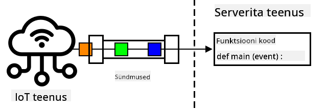
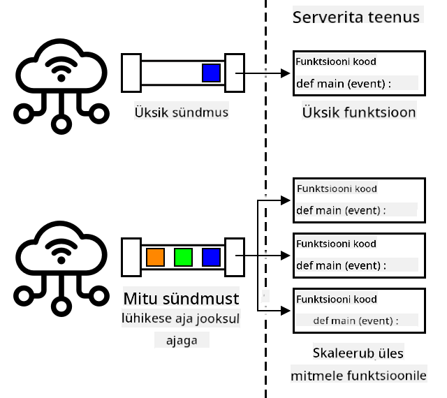
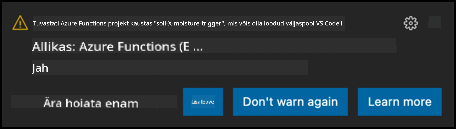

<!--
CO_OP_TRANSLATOR_METADATA:
{
  "original_hash": "5f2d2f4a5a023c93ab34a0cc5b47c0c4",
  "translation_date": "2025-10-11T12:39:26+00:00",
  "source_file": "2-farm/lessons/5-migrate-application-to-the-cloud/README.md",
  "language_code": "et"
}
-->
# Rakenda oma rakenduse loogika pilve


> Visuaalne ülevaade: [Nitya Narasimhan](https://github.com/nitya). Klõpsa pildil, et näha suuremat versiooni.

See õppetund oli osa [IoT algajatele: Projekt 2 - Digitaalne põllumajandus](https://youtube.com/playlist?list=PLmsFUfdnGr3yCutmcVg6eAUEfsGiFXgcx) sarjast, mida korraldas [Microsoft Reactor](https://developer.microsoft.com/reactor/?WT.mc_id=academic-17441-jabenn).

[](https://youtu.be/VVZDcs5u1_I)

## Eel-loengu viktoriin

[Eel-loengu viktoriin](https://black-meadow-040d15503.1.azurestaticapps.net/quiz/17)

## Sissejuhatus

Eelmises õppetunnis õppisite, kuidas ühendada oma taime mulla niiskuse jälgimise ja relee juhtimise pilvepõhise IoT-teenusega. Järgmine samm on viia serverikood, mis kontrollib relee ajastust, pilve. Selles õppetunnis õpite, kuidas seda teha serverivabade funktsioonide abil.

Selles õppetunnis käsitleme:

* [Mis on serverivaba?](../../../../../2-farm/lessons/5-migrate-application-to-the-cloud)
* [Loo serverivaba rakendus](../../../../../2-farm/lessons/5-migrate-application-to-the-cloud)
* [Loo IoT Hub sündmuse käivitaja](../../../../../2-farm/lessons/5-migrate-application-to-the-cloud)
* [Saada otsemeetodi päringud serverivabast koodist](../../../../../2-farm/lessons/5-migrate-application-to-the-cloud)
* [Paigalda oma serverivaba kood pilve](../../../../../2-farm/lessons/5-migrate-application-to-the-cloud)

## Mis on serverivaba?

Serverivaba, või serverivaba arvutus, hõlmab väikeste koodiplokkide loomist, mis töötavad pilves vastuseks erinevatele sündmustele. Kui sündmus toimub, käivitatakse teie kood ja sellele edastatakse sündmuse andmed. Need sündmused võivad pärineda mitmesugustest allikatest, sealhulgas veebipäringutest, järjekorda pandud sõnumitest, andmebaasis tehtud muudatustest või IoT-seadmete poolt IoT-teenusele saadetud sõnumitest.



> 💁 Kui olete varem kasutanud andmebaasi käivitajaid, võite mõelda sellele kui samale asjale – kood, mis käivitatakse sündmuse, näiteks rea lisamise, korral.



Teie kood käivitatakse ainult siis, kui sündmus toimub; muul ajal ei hoita teie koodi aktiivsena. Sündmus toimub, teie kood laaditakse ja käivitatakse. See muudab serverivaba mudeli väga skaleeritavaks – kui palju sündmusi toimub korraga, saab pilveteenuse pakkuja käivitada teie funktsiooni nii mitu korda kui vaja, kasutades kõiki saadaolevaid servereid. Selle mudeli miinus on see, et kui teil on vaja jagada teavet sündmuste vahel, peate selle salvestama kuhugi, näiteks andmebaasi, mitte hoidma seda mälus.

Teie kood kirjutatakse funktsioonina, mis võtab sündmuse üksikasjad parameetrina. Serverivabade funktsioonide kirjutamiseks saab kasutada mitmesuguseid programmeerimiskeeli.

> 🎓 Serverivaba mudelit nimetatakse ka teenusena pakutavateks funktsioonideks (FaaS), kuna iga sündmuse käivitaja rakendatakse koodis funktsioonina.

Hoolimata nimest kasutatakse serverivabas mudelis tegelikult servereid. Nimi tuleneb sellest, et arendajana ei pea te muretsema serverite pärast, mis on vajalikud teie koodi käitamiseks; te hoolite ainult sellest, et teie kood käivitatakse sündmuse korral. Pilveteenuse pakkujal on serverivaba *käituskeskkond*, mis haldab serverite, võrgu, salvestusruumi, CPU, mälu ja kõige muu eraldamist, mis on vajalik teie koodi käitamiseks. Selle mudeli puhul ei maksa te serveri eest, kuna serverit pole. Selle asemel maksate aja eest, mil teie kood töötab, ja kasutatud mälu koguse eest.

> 💰 Serverivaba mudel on üks odavamaid viise koodi käitamiseks pilves. Näiteks kirjutamise ajal võimaldab üks pilveteenuse pakkuja kõigil teie serverivabadel funktsioonidel töötada kokku 1 000 000 korda kuus enne, kui nad hakkavad teilt tasu võtma, ja pärast seda maksate 0,20 USA dollarit iga 1 000 000 käivituse eest. Kui teie kood ei tööta, te ei maksa.

IoT-arendajana on serverivaba mudel ideaalne. Saate kirjutada funktsiooni, mis käivitatakse vastuseks sõnumitele, mis saadetakse mis tahes IoT-seadmest, mis on ühendatud teie pilvepõhise IoT-teenusega. Teie kood käsitleb kõiki saadetud sõnumeid, kuid töötab ainult siis, kui seda vajatakse.

✅ Vaadake tagasi koodile, mille kirjutasite serverikoodina, mis kuulas sõnumeid MQTT kaudu. Kuidas võiks see pilves serverivabas mudelis töötada? Kuidas arvate, et koodi tuleks muuta, et toetada serverivaba arvutust?

> 💁 Serverivaba mudel laieneb ka teistele pilveteenustele, lisaks koodi käitamisele. Näiteks on pilves saadaval serverivabad andmebaasid, mis kasutavad serverivaba hinnastamismudelit, kus maksate päringu või sisestuse eest, tavaliselt hinnastamise alusel, mis põhineb töö mahul, mis on vajalik päringu teenindamiseks. Näiteks ühe rea valimine esmasvõtme alusel maksab vähem kui keeruline operatsioon, mis liidab palju tabeleid ja tagastab tuhandeid ridu.

## Loo serverivaba rakendus

Microsofti serverivaba arvutusteenus kannab nime Azure Functions.


Lühike video allpool annab ülevaate Azure Functionsist.

[](https://www.youtube.com/watch?v=8-jz5f_JyEQ)

> 🎥 Klõpsa ülaloleval pildil, et vaadata videot.

✅ Võtke hetk, et teha uurimistööd ja lugeda Azure Functions ülevaadet [Microsoft Azure Functions dokumentatsioonist](https://docs.microsoft.com/azure/azure-functions/functions-overview?WT.mc_id=academic-17441-jabenn).

Azure Functions rakenduste kirjutamiseks alustate Azure Functions rakendusega oma valitud keeles. Azure Functions toetab vaikimisi Pythonit, JavaScripti, TypeScripti, C#, F#, Java ja Powershelli. Selles õppetunnis õpite, kuidas kirjutada Azure Functions rakendust Pythonis.

> 💁 Azure Functions toetab ka kohandatud käitlejaid, nii et saate kirjutada oma funktsioone mis tahes keeles, mis toetab HTTP-päringuid, sealhulgas vanemates keeltes nagu COBOL.

Funktsioonirakendused koosnevad ühest või mitmest *käivitajast* – funktsioonidest, mis reageerivad sündmustele. Ühes funktsioonirakenduses võib olla mitu käivitajat, mis kõik jagavad ühist konfiguratsiooni. Näiteks teie funktsioonirakenduse konfiguratsioonifailis võivad olla teie IoT Hubi ühenduse üksikasjad ja kõik rakenduse funktsioonid saavad seda kasutada ühendamiseks ja sündmuste kuulamiseks.

### Ülesanne - paigalda Azure Functions tööriistad

> Kirjutamise ajal ei tööta Azure Functions kooditööriistad täielikult Apple Siliconi arvutites Python-projektidega. Selle asemel peate kasutama Intel-põhist Maci, Windowsi arvutit või Linuxi arvutit.

Üks suurepärane Azure Functions funktsioon on see, et saate neid käivitada lokaalselt. Sama käituskeskkond, mida kasutatakse pilves, saab käivitada teie arvutis, võimaldades teil kirjutada koodi, mis reageerib IoT-sõnumitele ja käivitada seda lokaalselt. Saate isegi oma koodi siluda, kui sündmusi käsitletakse. Kui olete oma koodiga rahul, saab selle pilve paigaldada.

Azure Functions tööriistad on saadaval CLI-na, mida tuntakse kui Azure Functions Core Tools.

1. Paigaldage Azure Functions Core Tools, järgides juhiseid [Azure Functions Core Tools dokumentatsioonis](https://docs.microsoft.com/azure/azure-functions/functions-run-local?WT.mc_id=academic-17441-jabenn).

1. Paigaldage Azure Functions laiendus VS Code'i jaoks. See laiendus pakub tuge Azure Functions loomisel, silumisel ja paigaldamisel. Vaadake juhiseid selle laienduse paigaldamiseks VS Code'i [Azure Functions laienduse dokumentatsioonist](https://marketplace.visualstudio.com/items?WT.mc_id=academic-17441-jabenn&itemName=ms-azuretools.vscode-azurefunctions).

Kui paigaldate oma Azure Functions rakenduse pilve, vajab see väikest kogust pilvesalvestust rakenduse failide ja logifailide salvestamiseks. Kui käivitate oma funktsioonirakendust lokaalselt, peate siiski ühenduma pilvesalvestusega, kuid tegeliku pilvesalvestuse asemel saate kasutada salvestuse emulaatorit nimega [Azurite](https://github.com/Azure/Azurite). See töötab lokaalselt, kuid käitub nagu pilvesalvestus.

> 🎓 Azure'is on salvestus, mida Azure Functions kasutab, Azure Storage Account. Need kontod võivad salvestada faile, objekte, andmeid tabelites või andmeid järjekordades. Ühte salvestuskontot saab jagada mitme rakenduse vahel, näiteks funktsioonirakenduse ja veebirakenduse vahel.

1. Azurite on Node.js rakendus, seega peate paigaldama Node.js. Leiate allalaadimise ja paigaldamise juhised [Node.js veebisaidilt](https://nodejs.org/). Kui kasutate Maci, saate selle paigaldada ka [Homebrew](https://formulae.brew.sh/formula/node) kaudu.

1. Paigaldage Azurite järgmise käsuga (`npm` on tööriist, mis paigaldatakse koos Node.js-ga):

    ```sh
    npm install -g azurite
    ```

1. Looge Azurite jaoks kaust nimega `azurite`, kuhu salvestada andmeid:

    ```sh
    mkdir azurite
    ```

1. Käivitage Azurite, edastades sellele uue kausta:

    ```sh
    azurite --location azurite
    ```

    Azurite salvestuse emulaator käivitatakse ja on valmis ühendamiseks lokaalse funktsioonide käituskeskkonnaga.

    ```output
    ➜  ~ azurite --location azurite  
    Azurite Blob service is starting at http://127.0.0.1:10000
    Azurite Blob service is successfully listening at http://127.0.0.1:10000
    Azurite Queue service is starting at http://127.0.0.1:10001
    Azurite Queue service is successfully listening at http://127.0.0.1:10001
    Azurite Table service is starting at http://127.0.0.1:10002
    Azurite Table service is successfully listening at http://127.0.0.1:10002
    ```

### Ülesanne - loo Azure Functions projekt

Azure Functions CLI-d saab kasutada uue funktsioonirakenduse loomiseks.

1. Looge funktsioonirakenduse jaoks kaust ja liikuge sinna. Nimetage see `soil-moisture-trigger`.

    ```sh
    mkdir soil-moisture-trigger
    cd soil-moisture-trigger
    ```

1. Looge Python virtuaalne keskkond selles kaustas:

    ```sh
    python3 -m venv .venv
    ```

1. Aktiveerige virtuaalne keskkond:

    * Windowsis:
        * Kui kasutate käsuviiba või käsuviiba Windows Terminali kaudu, käivitage:

            ```cmd
            .venv\Scripts\activate.bat
            ```

        * Kui kasutate PowerShelli, käivitage:

            ```powershell
            .\.venv\Scripts\Activate.ps1
            ```

    * macOS-is või Linuxis käivitage:

        ```cmd
        source ./.venv/bin/activate
        ```

    > 💁 Need käsud tuleks käivitada samast asukohast, kus käivitasite virtuaalse keskkonna loomise käsu. Te ei pea kunagi liikuma `.venv` kausta; peaksite alati käivitama aktiveerimiskäsu ja kõik käsud pakettide paigaldamiseks või koodi käivitamiseks kaustast, kus olite virtuaalse keskkonna loomisel.

1. Käivitage järgmine käsk, et luua funktsioonirakendus selles kaustas:

    ```sh
    func init --worker-runtime python soil-moisture-trigger
    ```

    See loob praeguses kaustas kolm faili:

    * `host.json` - see JSON-dokument sisaldab teie funktsioonirakenduse seadeid. Te ei pea neid seadeid muutma.
    * `local.settings.json` - see JSON-dokument sisaldab seadeid, mida teie rakendus kasutaks lokaalselt käivitamisel, näiteks IoT Hubi ühenduse stringe. Need seaded on ainult lokaalsed ja neid ei tohiks lisada lähtekoodi kontrolli. Kui rakendus paigaldatakse pilve, ei paigaldata neid seadeid; selle asemel laaditakse teie seaded rakenduse seadistustest. Seda käsitletakse hiljem selles õppetunnis.
    * `requirements.txt` - see on [Pip nõuete fail](https://pip.pypa.io/en/stable/user_guide/#requirements-files), mis sisaldab Pip pakette, mis on vajalikud funktsioonirakenduse käitamiseks.

1. `local.settings.json` failis on seade salvestuskonto jaoks, mida funktsioonirakendus kasutab. Vaikimisi on see tühi, seega tuleb see seadistada. Azurite lokaalse salvestuse emulaatoriga ühendamiseks seadistage see väärtus järgmiselt:

    ```json
    "AzureWebJobsStorage": "UseDevelopmentStorage=true",
    ```

1. Paigaldage vajalikud Pip paketid, kasutades nõuete faili:

    ```sh
    pip install -r requirements.txt
    ```

    > 💁 Nõutavad Pip paketid peavad olema selles failis, et kui funktsioonirakendus paigaldatakse pilve, saaks käituskeskkond tagada, et paigaldatakse õiged paketid.

1. Testimiseks, kas kõik töötab õigesti, saate käivitada funktsioonide käituskeskkonna. Käivitage selleks järgmine käsk:

    ```sh
    func start
    ```

    Näete, kuidas käituskeskkond käivitub ja teatab, et see ei leidnud ühtegi tööfunktsiooni (käivitajat).

    ```output
    (.venv) ➜  soil-moisture-trigger func start
    Found Python version 3.9.1 (python3).
    
    Azure Functions Core Tools
    Core Tools Version:       3.0.3442 Commit hash: 6bfab24b2743f8421475d996402c398d2fe4a9e0  (64-bit)
    Function Runtime Version: 3.0.15417.0
    
    [2021-05-05T01:24:46.795Z] No job functions found.
    ```

    > ⚠️ Kui saate tulemüüriteate, andke juurdepääs, kuna `func` rakendus peab saama lugeda ja kirjutada teie võrku.

    > ⚠️ Kui kasutate macOS-i, võib väljundis olla hoiatusi:
    >
    > ```output
    > (.venv) ➜  soil-moisture-trigger func start
    > Found Python version 3.9.1 (python3).
    >
    > Azure Functions Core Tools
    > Core Tools Version:       3.0.3442 Commit hash: 6bfab24b2743f8421475d996402c398d2fe4a9e0  (64-bit)
    > Function Runtime Version: 3.0.15417.0
    >
    > [2021-06-16T08:18:28.315Z] Cannot create directory for shared memory usage: /dev/shm/AzureFunctions
    > [2021-06-16T08:18:28.316Z] System.IO.FileSystem: Access to the path '/dev/shm/AzureFunctions' is denied. Operation not permitted.
    > [2021-06-16T08:18:30.361Z] No job functions found.
    > ```
    >
    > Neid võib ignoreerida, kui funktsioonirakendus käivitub õigesti ja loetleb töötavad funktsioonid. Nagu mainitud [Microsoft Docs Q&A küsimuses](https://docs.microsoft.com/answers/questions/396617/azure-functions-core-tools-error-osx-devshmazurefu.html?WT.mc_id=academic-17441-jabenn), võib neid ignoreerida.

1. Peatage funktsioonirakendus, vajutades `ctrl+c`.

1. Avage praegune kaust VS Code'is, kas avades VS Code'i ja seejärel selle kausta, või käivitades järgmise käsu:

    ```sh
    code .
    ```

VS Code tuvastab teie Functions projekti ja kuvab teate, mis ütleb:

    ```output
    Detected an Azure Functions Project in folder "soil-moisture-trigger" that may have been created outside of
    VS Code. Initialize for optimal use with VS Code?
    ```



Valige sellest teatest **Yes**.

1. Veenduge, et Python virtuaalne keskkond töötab VS Code terminalis. Vajadusel lõpetage see ja käivitage uuesti.

## IoT Hub sündmuse käivitaja loomine

Functions rakendus on teie serverivaba koodi raamistik. IoT Hubi sündmustele reageerimiseks saate sellele rakendusele lisada IoT Hubi käivitaja. See käivitaja peab ühenduma sõnumite vooga, mis saadetakse IoT Hubi, ja neile reageerima. Selle sõnumite voo saamiseks peab teie käivitaja ühenduma IoT Hubi *Event Hub ühilduva lõpp-punktiga*.

IoT Hub põhineb teisel Azure teenusel nimega Azure Event Hubs. Event Hubs on teenus, mis võimaldab saata ja vastu võtta sõnumeid, IoT Hub laiendab seda, lisades funktsioone IoT seadmete jaoks. Sõnumite lugemiseks IoT Hubist ühendate samamoodi nagu Event Hubsiga.

✅ Tehke veidi uurimistööd: Lugege Event Hubsi ülevaadet [Azure Event Hubs dokumentatsioonist](https://docs.microsoft.com/azure/event-hubs/event-hubs-about?WT.mc_id=academic-17441-jabenn). Kuidas põhilised funktsioonid võrreldavad IoT Hubiga?

IoT seadme ühendamiseks IoT Hubiga peab see kasutama salajast võtit, mis tagab, et ainult lubatud seadmed saavad ühenduda. Sama kehtib ka sõnumite lugemiseks ühendamisel – teie kood vajab ühenduse stringi, mis sisaldab salajast võtit ja IoT Hubi üksikasju.

> 💁 Vaikimisi saadud ühenduse stringil on **iothubowner** õigused, mis annavad sellele koodi, mis seda kasutab, täielikud õigused IoT Hubis. Ideaalis peaksite ühenduma madalaima vajaliku õiguste tasemega. Seda käsitletakse järgmises õppetunnis.

Kui teie käivitaja on ühendatud, kutsutakse funktsiooni sees olev kood iga IoT Hubi saadetud sõnumi jaoks, olenemata sellest, milline seade selle saatis. Käivitajale edastatakse sõnum parameetrina.

### Ülesanne - hankige Event Hub ühilduva lõpp-punkti ühenduse string

1. Käivitage VS Code terminalis järgmine käsk, et saada IoT Hubi Event Hub ühilduva lõpp-punkti ühenduse string:

    ```sh
    az iot hub connection-string show --default-eventhub \
                                      --output table \
                                      --hub-name <hub_name>
    ```

Asendage `<hub_name>` nimega, mida kasutasite oma IoT Hubi jaoks.

1. Avage VS Code'is fail `local.settings.json`. Lisage `Values` sektsiooni järgmine lisaväärtus:

    ```json
    "IOT_HUB_CONNECTION_STRING": "<connection string>"
    ```

Asendage `<connection string>` eelmise sammu väärtusega. Peate lisama ülaltoodud rea järel koma, et see oleks kehtiv JSON.

### Ülesanne - looge sündmuse käivitaja

Nüüd olete valmis looma sündmuse käivitaja.

1. Käivitage VS Code terminalis järgmine käsk kaustas `soil-moisture-trigger`:

    ```sh
    func new --name iot-hub-trigger --template "Azure Event Hub trigger"
    ```

See loob uue funktsiooni nimega `iot-hub-trigger`. Käivitaja ühendub IoT Hubi Event Hub ühilduva lõpp-punktiga, nii et saate kasutada Event Hub käivitajat. Spetsiifilist IoT Hub käivitajat ei ole.

See loob kausta `soil-moisture-trigger` kausta sees nimega `iot-hub-trigger`, mis sisaldab seda funktsiooni. Selles kaustas on järgmised failid:

* `__init__.py` - see on Python koodifail, mis sisaldab käivitajat, kasutades standardset Python failinime konventsiooni, et muuta see kaust Python mooduliks.

    See fail sisaldab järgmist koodi:

    ```python
    import logging

    import azure.functions as func


    def main(event: func.EventHubEvent):
        logging.info('Python EventHub trigger processed an event: %s',
                    event.get_body().decode('utf-8'))
    ```

    Käivitaja tuum on funktsioon `main`. Just seda funktsiooni kutsutakse IoT Hubi sündmustega. Sellel funktsioonil on parameeter nimega `event`, mis sisaldab `EventHubEvent`. Iga kord, kui IoT Hubile saadetakse sõnum, kutsutakse see funktsioon, edastades selle sõnumi `event` parameetrina koos omadustega, mis on samad kui annotatsioonid, mida nägite eelmises õppetunnis.

    Selle funktsiooni tuum logib sündmuse.

* `function.json` - see sisaldab käivitaja konfiguratsiooni. Peamine konfiguratsioon on sektsioonis nimega `bindings`. Binding on termin, mis tähistab ühendust Azure Functions ja teiste Azure teenuste vahel. Sellel funktsioonil on sisendbinding Event Hubile – see ühendub Event Hubiga ja võtab vastu andmeid.

    > 💁 Binding võib olla ka väljundbinding, nii et funktsiooni väljund saadetakse teisele teenusele. Näiteks võiksite lisada bindingu andmebaasi ja tagastada IoT Hubi sündmuse funktsioonist, ning see sisestatakse automaatselt andmebaasi.

    ✅ Tehke veidi uurimistööd: Lugege bindingute kohta [Azure Functions triggers and bindings concepts dokumentatsioonist](https://docs.microsoft.com/azure/azure-functions/functions-triggers-bindings?WT.mc_id=academic-17441-jabenn&tabs=python).

    Sektsioon `bindings` sisaldab bindingu konfiguratsiooni. Huvipakkuvad väärtused on:

  * `"type": "eventHubTrigger"` - see ütleb funktsioonile, et see peab kuulama Event Hubi sündmusi
  * `"name": "events"` - see on Event Hubi sündmuste parameetri nimi. See vastab Python koodi `main` funktsiooni parameetri nimele.
  * `"direction": "in"` - see on sisendbinding, Event Hubi andmed tulevad funktsiooni
  * `"connection": ""` - see määrab seadistuse nime, kust lugeda ühenduse stringi. Kohalikult töötades loeb see seadistust failist `local.settings.json`.

    > 💁 Ühenduse stringi ei saa salvestada faili `function.json`, see tuleb lugeda seadistustest. See on selleks, et vältida ühenduse stringi juhuslikku avalikustamist.

1. [Azure Functions template'i vea](https://github.com/Azure/azure-functions-templates/issues/1250) tõttu on `function.json` failis vale väärtus `cardinality` väljal. Uuendage see väli väärtuselt `many` väärtusele `one`:

    ```json
    "cardinality": "one",
    ```

1. Uuendage väärtust `"connection"` failis `function.json`, et see osutaks uuele väärtusele, mille lisasite faili `local.settings.json`:

    ```json
    "connection": "IOT_HUB_CONNECTION_STRING",
    ```

    > 💁 Pidage meeles - see peab osutama seadistusele, mitte sisaldama tegelikku ühenduse stringi.

1. Ühenduse string sisaldab väärtust `eventHubName`, seega tuleb selle väärtus failis `function.json` tühjendada. Uuendage see väärtus tühjaks stringiks:

    ```json
    "eventHubName": "",
    ```

### Ülesanne - käivitage sündmuse käivitaja

1. Veenduge, et te ei käivita IoT Hubi sündmuste monitori. Kui see töötab samaaegselt Functions rakendusega, ei saa Functions rakendus ühenduda ja sündmusi tarbida.

    > 💁 Mitmed rakendused saavad ühenduda IoT Hubi lõpp-punktidega, kasutades erinevaid *tarbijarühmi*. Neid käsitletakse hilisemas õppetunnis.

1. Functions rakenduse käivitamiseks käivitage VS Code terminalis järgmine käsk:

    ```sh
    func start
    ```

    Functions rakendus käivitub ja avastab funktsiooni `iot-hub-trigger`. Seejärel töötleb see kõiki sündmusi, mis on IoT Hubile saadetud viimase päeva jooksul.

    ```output
    (.venv) ➜  soil-moisture-trigger func start
    Found Python version 3.9.1 (python3).
    
    Azure Functions Core Tools
    Core Tools Version:       3.0.3442 Commit hash: 6bfab24b2743f8421475d996402c398d2fe4a9e0  (64-bit)
    Function Runtime Version: 3.0.15417.0
    
    Functions:
    
            iot-hub-trigger: eventHubTrigger
    
    For detailed output, run func with --verbose flag.
    [2021-05-05T02:44:07.517Z] Worker process started and initialized.
    [2021-05-05T02:44:09.202Z] Executing 'Functions.iot-hub-trigger' (Reason='(null)', Id=802803a5-eae9-4401-a1f4-176631456ce4)
    [2021-05-05T02:44:09.205Z] Trigger Details: PartitionId: 0, Offset: 1011240-1011632, EnqueueTimeUtc: 2021-05-04T19:04:04.2030000Z-2021-05-04T19:04:04.3900000Z, SequenceNumber: 2546-2547, Count: 2
    [2021-05-05T02:44:09.352Z] Python EventHub trigger processed an event: {"soil_moisture":628}
    [2021-05-05T02:44:09.354Z] Python EventHub trigger processed an event: {"soil_moisture":624}
    [2021-05-05T02:44:09.395Z] Executed 'Functions.iot-hub-trigger' (Succeeded, Id=802803a5-eae9-4401-a1f4-176631456ce4, Duration=245ms)
    ```

    Iga funktsiooni kutse ümbritsetakse väljundis plokiga `Executing 'Functions.iot-hub-trigger'`/`Executed 'Functions.iot-hub-trigger'`, nii et näete, kui palju sõnumeid iga funktsiooni kutsega töödeldi.

1. Veenduge, et teie IoT seade töötab. Näete uusi mulla niiskuse sõnumeid Functions rakenduses.

1. Peatage ja taaskäivitage Functions rakendus. Näete, et see ei töötle enam eelmisi sõnumeid, vaid ainult uusi sõnumeid.

> 💁 VS Code toetab ka teie Functions rakenduse silumist. Saate määrata murdepunkte, klõpsates koodi rea alguse piiril, asetades kursor koodi reale ja valides *Run -> Toggle breakpoint*, või vajutades `F9`. Siluri saate käivitada, valides *Run -> Start debugging*, vajutades `F5`, või valides *Run and debug* paneeli ja klõpsates **Start debugging** nuppu. Nii saate näha töödeldavate sündmuste üksikasju.

#### Tõrkeotsing

* Kui saate järgmise vea:

    ```output
    The listener for function 'Functions.iot-hub-trigger' was unable to start. Microsoft.WindowsAzure.Storage: Connection refused. System.Net.Http: Connection refused. System.Private.CoreLib: Connection refused.
    ```

    Kontrollige, kas Azurite töötab ja olete seadistanud `AzureWebJobsStorage` failis `local.settings.json` väärtusele `UseDevelopmentStorage=true`.

* Kui saate järgmise vea:

    ```output
    System.Private.CoreLib: Exception while executing function: Functions.iot-hub-trigger. System.Private.CoreLib: Result: Failure Exception: AttributeError: 'list' object has no attribute 'get_body'
    ```

    Kontrollige, kas olete seadistanud `cardinality` failis `function.json` väärtusele `one`.

* Kui saate järgmise vea:

    ```output
    Azure.Messaging.EventHubs: The path to an Event Hub may be specified as part of the connection string or as a separate value, but not both.  Please verify that your connection string does not have the `EntityPath` token if you are passing an explicit Event Hub name. (Parameter 'connectionString').
    ```

    Kontrollige, kas olete seadistanud `eventHubName` failis `function.json` tühjaks stringiks.

## Saatke otsemeetodi päringuid serverivabast koodist

Siiani kuulab teie Functions rakendus IoT Hubi sõnumeid Event Hub ühilduva lõpp-punkti kaudu. Nüüd peate saatma käske IoT seadmele. Seda tehakse IoT Hubiga ühenduse loomise kaudu *Registry Manageri* abil. Registry Manager on tööriist, mis võimaldab näha, millised seadmed on IoT Hubis registreeritud, ja nendega suhelda, saates pilvest seadmesse sõnumeid, otsemeetodi päringuid või uuendades seadme kaksikut. Samuti saate seda kasutada IoT seadmete registreerimiseks, uuendamiseks või kustutamiseks IoT Hubist.

Registry Manageriga ühenduse loomiseks vajate ühenduse stringi.

### Ülesanne - hankige Registry Manageri ühenduse string

1. Ühenduse stringi saamiseks käivitage järgmine käsk:

    ```sh
    az iot hub connection-string show --policy-name service \
                                      --output table \
                                      --hub-name <hub_name>
    ```

Asendage `<hub_name>` nimega, mida kasutasite oma IoT Hubi jaoks.

Ühenduse stringi küsitakse *ServiceConnect* poliitika jaoks, kasutades parameetrit `--policy-name service`. Kui küsite ühenduse stringi, saate määrata, milliseid õigusi see ühenduse string võimaldab. ServiceConnect poliitika võimaldab teie koodil ühenduda ja saata sõnumeid IoT seadmetele.

✅ Tehke veidi uurimistööd: Lugege erinevate poliitikate kohta [IoT Hubi õiguste dokumentatsioonist](https://docs.microsoft.com/azure/iot-hub/iot-hub-devguide-security#iot-hub-permissions?WT.mc_id=academic-17441-jabenn)

1. Avage VS Code'is fail `local.settings.json`. Lisage `Values` sektsiooni järgmine lisaväärtus:

    ```json
    "REGISTRY_MANAGER_CONNECTION_STRING": "<connection string>"
    ```

Asendage `<connection string>` eelmise sammu väärtusega. Peate lisama ülaltoodud rea järel koma, et see oleks kehtiv JSON.

### Ülesanne - saatke otsemeetodi päring seadmele

1. Registry Manageri SDK on saadaval Pip paketi kaudu. Lisage `requirements.txt` faili järgmine rida, et lisada sõltuvus sellest paketist:

    ```sh
    azure-iot-hub
    ```

1. Veenduge, et VS Code terminalis on virtuaalne keskkond aktiveeritud, ja käivitage järgmine käsk, et installida Pip paketid:

    ```sh
    pip install -r requirements.txt
    ```

1. Lisage `__init__.py` faili järgmised impordid:

    ```python
    import json
    import os
    from azure.iot.hub import IoTHubRegistryManager
    from azure.iot.hub.models import CloudToDeviceMethod
    ```

    See impordib mõned süsteemiraamatukogud, samuti raamatukogud Registry Manageriga suhtlemiseks ja otsemeetodi päringute saatmiseks.

1. Eemaldage kood `main` meetodi seest, kuid jätke meetod ise alles.

1. Lisage `main` meetodisse järgmine kood:

    ```python
    body = json.loads(event.get_body().decode('utf-8'))
    device_id = event.iothub_metadata['connection-device-id']

    logging.info(f'Received message: {body} from {device_id}')
    ```

    See kood eraldab sündmuse keha, mis sisaldab IoT seadme saadetud JSON sõnumit.

    Seejärel saab see seadme ID annotatsioonidest, mis edastatakse sõnumiga. Sündmuse keha sisaldab telemeetria sõnumit, `iothub_metadata` sõnastik sisaldab IoT Hubi määratud omadusi, nagu saatja seadme ID ja sõnumi saatmise aeg.

    See teave logitakse. Näete seda logimist terminalis, kui käivitate Functions rakenduse kohalikult.

1. Lisage sellele järgmine kood:

    ```python
    soil_moisture = body['soil_moisture']

    if soil_moisture > 450:
        direct_method = CloudToDeviceMethod(method_name='relay_on', payload='{}')
    else:
        direct_method = CloudToDeviceMethod(method_name='relay_off', payload='{}')
    ```

    See kood saab sõnumist mulla niiskuse. Seejärel kontrollib mulla niiskust ja olenevalt väärtusest loob abiklassi otsemeetodi päringu jaoks `relay_on` või `relay_off` otsemeetodi jaoks. Meetodi päring ei vaja sisu, seega saadetakse tühi JSON dokument.

1. Lisage sellele järgmine kood:

    ```python
    logging.info(f'Sending direct method request for {direct_method.method_name} for device {device_id}')

    registry_manager_connection_string = os.environ['REGISTRY_MANAGER_CONNECTION_STRING']
    registry_manager = IoTHubRegistryManager(registry_manager_connection_string)
    ```

    See kood laadib `REGISTRY_MANAGER_CONNECTION_STRING` faili `local.settings.json`. Selle faili väärtused tehakse kättesaadavaks keskkonnamuutujatena, mida saab lugeda funktsiooniga `os.environ`, mis tagastab sõnastiku kõigist keskkonnamuutujatest.

    > 💁 Kui see kood pilve juurutatakse, määratakse faili `local.settings.json` väärtused *Application Settings* väärtusteks, mida saab lugeda keskkonnamuutujatest.

    Kood loob seejärel Registry Manageri abiklassi eksemplari, kasutades ühenduse stringi.

1. Lisage sellele järgmine kood:

    ```python
    registry_manager.invoke_device_method(device_id, direct_method)

    logging.info('Direct method request sent!')
    ```

    See kood ütleb Registry Managerile, et see saadaks otsemeetodi päringu seadmele, mis saatis telemeetria.
> 💁 Rakenduse varasemates tundides loodud versioonides, mis kasutasid MQTT-d, saadeti relee juhtimiskäsud kõigile seadmetele. Kood eeldas, et teil on ainult üks seade. Selle koodi versioon saadab meetodipäringu ühele seadmele, seega töötab see ka siis, kui teil on mitu niiskusanduri ja relee komplekti, saates õige otsese meetodipäringu õigesse seadmesse.

1. Käivitage Functions rakendus ja veenduge, et teie IoT-seade saadab andmeid. Näete, kuidas sõnumeid töödeldakse ja otsese meetodi päringuid saadetakse. Liigutage mulla niiskusandurit mullast sisse ja välja, et näha väärtuste muutumist ja relee sisse- ja väljalülitumist.

> 💁 Selle koodi leiate kaustast [code/functions](../../../../../2-farm/lessons/5-migrate-application-to-the-cloud/code/functions).

## Laadige oma serverivaba kood pilve

Teie kood töötab nüüd lokaalselt, seega on järgmine samm Functions Appi pilve juurutamine.

### Ülesanne - looge pilveressursid

Teie Functions rakendus tuleb juurutada Azure'i Functions App ressursile, mis asub teie IoT Hubi jaoks loodud ressursigrupis. Samuti on teil vaja Azure'is luua salvestuskonto, mis asendab lokaalselt töötava emuleeritud salvestuse.

1. Käivitage järgmine käsk salvestuskonto loomiseks:

    ```sh
    az storage account create --resource-group soil-moisture-sensor \
                              --sku Standard_LRS \
                              --name <storage_name> 
    ```

   Asendage `<storage_name>` oma salvestuskonto nimega. See peab olema globaalselt unikaalne, kuna see moodustab osa salvestuskonto URL-ist. Selle nime jaoks saate kasutada ainult väiketähti ja numbreid, mitte muid märke, ning see on piiratud 24 tähemärgiga. Kasutage näiteks `sms` ja lisage lõppu unikaalne identifikaator, näiteks juhuslikud sõnad või oma nimi.

   Valik `--sku Standard_LRS` määrab hinnaklassi, valides madalaima hinnaga üldotstarbelise konto. Tasuta salvestustasandit ei ole ja maksate selle eest, mida kasutate. Kulud on suhteliselt madalad, kõige kallim salvestus maksab vähem kui 0,05 USA dollarit kuus gigabaidi kohta.

   ✅ Lugege hinnakujunduse kohta [Azure Storage Account hinnakujunduse lehelt](https://azure.microsoft.com/pricing/details/storage/?WT.mc_id=academic-17441-jabenn).

1. Käivitage järgmine käsk Function Appi loomiseks:

    ```sh
    az functionapp create --resource-group soil-moisture-sensor \
                          --runtime python \
                          --functions-version 3 \
                          --os-type Linux \
                          --consumption-plan-location <location> \
                          --storage-account <storage_name> \
                          --name <functions_app_name>
    ```

   Asendage `<location>` asukohaga, mida kasutasite ressursigrupi loomisel eelmises tunnis.

   Asendage `<storage_name>` salvestuskonto nimega, mille lõite eelmises etapis.

   Asendage `<functions_app_name>` oma Functions Appi unikaalse nimega. See peab olema globaalselt unikaalne, kuna see moodustab osa URL-ist, mida saab Functions Appi juurde pääsemiseks kasutada. Kasutage näiteks `soil-moisture-sensor-` ja lisage lõppu unikaalne identifikaator, näiteks juhuslikud sõnad või oma nimi.

   Valik `--functions-version 3` määrab kasutatava Azure Functions versiooni. Versioon 3 on uusim versioon.

   Valik `--os-type Linux` määrab, et Functions runtime kasutab nende funktsioonide majutamiseks Linuxi operatsioonisüsteemi. Funktsioone saab majutada Linuxil või Windowsil, sõltuvalt kasutatavast programmeerimiskeelest. Python-rakendusi toetatakse ainult Linuxil.

### Ülesanne - laadige üles oma rakenduse seaded

Kui arendasite oma Functions Appi, salvestasite mõned seaded, näiteks IoT Hubi ühendusstringid, faili `local.settings.json`. Need tuleb kirjutada Azure'is asuva Functions Appi rakenduse seadistustesse, et teie kood saaks neid kasutada.

> 🎓 Fail `local.settings.json` on mõeldud ainult kohaliku arenduse seadistuste jaoks ja seda ei tohiks lisada versioonihaldusse, näiteks GitHubi. Pilve juurutamisel kasutatakse rakenduse seadeid. Rakenduse seaded on pilves hostitud võtme/väärtuse paarid, mida loetakse keskkonnamuutujatena kas teie koodis või runtime'i poolt, kui teie kood ühendub IoT Hubiga.

1. Käivitage järgmine käsk, et määrata `IOT_HUB_CONNECTION_STRING` seadistus Functions Appi rakenduse seadistustes:

    ```sh
    az functionapp config appsettings set --resource-group soil-moisture-sensor \
                                          --name <functions_app_name> \
                                          --settings "IOT_HUB_CONNECTION_STRING=<connection string>"
    ```

   Asendage `<functions_app_name>` nimega, mida kasutasite oma Functions Appi jaoks.

   Asendage `<connection string>` väärtusega `IOT_HUB_CONNECTION_STRING` oma failist `local.settings.json`.

1. Korrake eelmist sammu, kuid määrake väärtus `REGISTRY_MANAGER_CONNECTION_STRING` vastavalt väärtusele failist `local.settings.json`.

Kui käivitate need käsud, kuvatakse ka loend kõigist funktsioonirakenduse rakenduse seadistustest. Saate seda kasutada, et kontrollida, kas teie väärtused on õigesti määratud.

> 💁 Näete juba määratud väärtust `AzureWebJobsStorage` jaoks. Teie failis `local.settings.json` oli see määratud lokaalse salvestuse emulaatori kasutamiseks. Kui lõite Functions Appi, andsite salvestuskonto parameetrina ja see määrati automaatselt selles seadistuses.

### Ülesanne - juurutage oma Functions App pilve

Nüüd, kui Functions App on valmis, saab teie koodi juurutada.

1. Käivitage järgmine käsk VS Code terminalist, et avaldada oma Functions App:

    ```sh
    func azure functionapp publish <functions_app_name>
    ```

   Asendage `<functions_app_name>` nimega, mida kasutasite oma Functions Appi jaoks.

Kood pakitakse ja saadetakse Functions Appi, kus see juurutatakse ja käivitatakse. Konsoolis kuvatakse palju väljundit, mis lõpeb juurutamise kinnituse ja juurutatud funktsioonide loendiga. Antud juhul sisaldab loend ainult päästikut.

```output
Deployment successful.
Remote build succeeded!
Syncing triggers...
Functions in soil-moisture-sensor:
    iot-hub-trigger - [eventHubTrigger]
```

Veenduge, et teie IoT-seade töötab. Muutke niiskustaset, reguleerides mulla niiskust või liigutades andurit mullast sisse ja välja. Näete, kuidas relee lülitub sisse ja välja vastavalt mulla niiskuse muutustele.

---

## 🚀 Väljakutse

Eelmises tunnis haldasite relee ajastust, loobudes MQTT-sõnumitest, kui relee oli sees ja lühikese aja jooksul pärast selle väljalülitamist. Siin ei saa te seda meetodit kasutada - te ei saa oma IoT Hubi päästikust loobuda.

Mõelge erinevatele viisidele, kuidas saaksite seda oma Functions Appis lahendada.

## Loengu järgne viktoriin

[Loengu järgne viktoriin](https://black-meadow-040d15503.1.azurestaticapps.net/quiz/18)

## Ülevaade ja iseseisev õppimine

* Lugege serverivaba arvutuse kohta [Serverless Computing lehelt Wikipedias](https://wikipedia.org/wiki/Serverless_computing)
* Lugege serverivaba kasutamise kohta Azure'is, sealhulgas rohkemate näidete kohta, [Azure'i blogipostitusest "Go serverless for your IoT needs"](https://azure.microsoft.com/blog/go-serverless-for-your-iot-needs/?WT.mc_id=academic-17441-jabenn)
* Tutvuge Azure Functionsiga [Azure Functions YouTube'i kanalil](https://www.youtube.com/c/AzureFunctions)

## Ülesanne

[Lisa manuaalne relee juhtimine](assignment.md)

---

**Lahtiütlus**:  
See dokument on tõlgitud, kasutades AI tõlketeenust [Co-op Translator](https://github.com/Azure/co-op-translator). Kuigi püüame tagada täpsust, palun arvestage, et automaatsed tõlked võivad sisaldada vigu või ebatäpsusi. Algne dokument selle algses keeles tuleks lugeda autoriteetseks allikaks. Olulise teabe puhul on soovitatav kasutada professionaalset inimtõlget. Me ei vastuta selle tõlke kasutamisest tulenevate arusaamatuste või valede tõlgenduste eest.