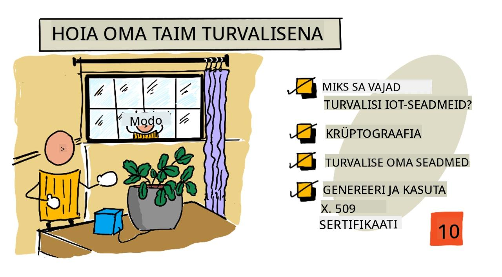
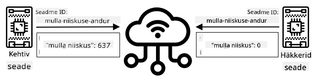
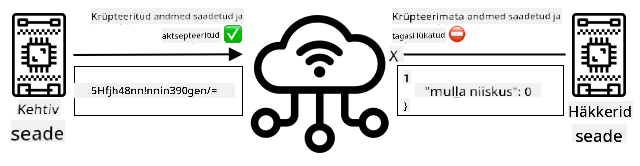
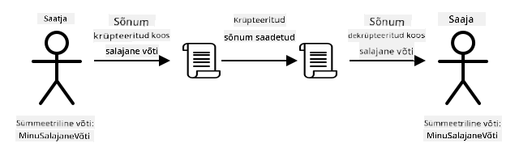
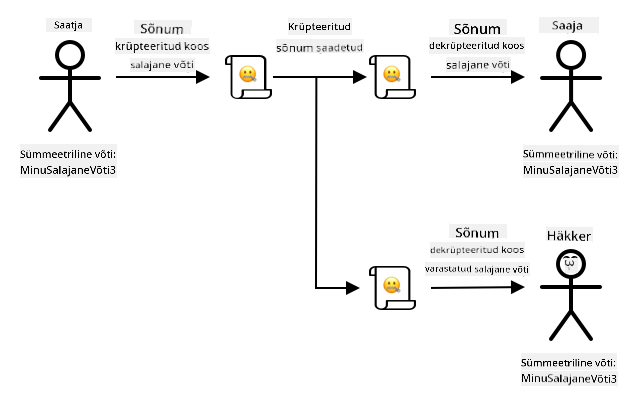
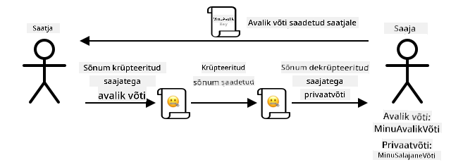
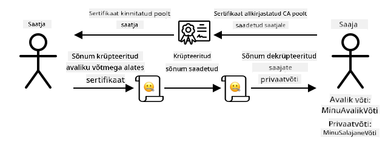

<!--
CO_OP_TRANSLATOR_METADATA:
{
  "original_hash": "81c437c568eee1b0dda1f04e88150d37",
  "translation_date": "2025-10-11T12:42:14+00:00",
  "source_file": "2-farm/lessons/6-keep-your-plant-secure/README.md",
  "language_code": "et"
}
-->
# Hoia oma taim turvalisena



> Visuaalne märkmik: [Nitya Narasimhan](https://github.com/nitya). Klõpsa pildil, et näha suuremat versiooni.

## Eel-loengu viktoriin

[Eel-loengu viktoriin](https://black-meadow-040d15503.1.azurestaticapps.net/quiz/19)

## Sissejuhatus

Viimastes tundides oled loonud IoT-seadme mulla jälgimiseks ja ühendanud selle pilvega. Aga mis juhtub, kui rivaalfarmeri palgatud häkkerid võtavad kontrolli sinu IoT-seadmete üle? Mis siis, kui nad saadavad kõrge mulla niiskuse näite, nii et sinu taimi ei kasteta, või lülitavad kastmissüsteemi pidevalt sisse, tappes taimed ülekastmisega ja tekitades sulle suuri veekulusid?

Selles õppetunnis õpid IoT-seadmete turvalisuse tagamist. Kuna see on projekti viimane tund, õpid ka, kuidas oma pilveressursse puhastada, et vähendada võimalikke kulusid.

Selles õppetunnis käsitleme:

* [Miks on vaja IoT-seadmeid turvata?](../../../../../2-farm/lessons/6-keep-your-plant-secure)
* [Krüptograafia](../../../../../2-farm/lessons/6-keep-your-plant-secure)
* [IoT-seadmete turvalisuse tagamine](../../../../../2-farm/lessons/6-keep-your-plant-secure)
* [X.509 sertifikaadi genereerimine ja kasutamine](../../../../../2-farm/lessons/6-keep-your-plant-secure)

> 🗑 See on projekti viimane tund, seega pärast õppetunni ja ülesande lõpetamist ära unusta oma pilveteenuseid puhastada. Teenuseid on vaja ülesande täitmiseks, seega veendu, et teed selle kõigepealt ära.
>
> Vajadusel vaata juhiseid [projekti puhastamise juhendist](../../../clean-up.md).

## Miks on vaja IoT-seadmeid turvata?

IoT-turvalisus tähendab, et ainult oodatud seadmed saavad ühenduda sinu pilve IoT-teenusega ja saata telemeetriat, ning ainult sinu pilveteenus saab saata käsklusi sinu seadmetele. IoT-andmed võivad olla isiklikud, sealhulgas meditsiinilised või intiimsed andmed, seega peab kogu rakendus arvestama turvalisusega, et vältida andmete lekkimist.

Kui sinu IoT-rakendus ei ole turvaline, on mitmeid riske:

* Võltsseade võib saata valeandmeid, põhjustades rakenduse valesid reaktsioone. Näiteks võivad nad saata pidevalt kõrge mulla niiskuse näite, mis tähendab, et kastmissüsteem ei lülitu kunagi sisse ja taimed surevad veepuuduse tõttu.
* Volitamata kasutajad võivad lugeda IoT-seadmete andmeid, sealhulgas isiklikke või ärikriitilisi andmeid.
* Häkkerid võivad saata käsklusi, et kontrollida seadet viisil, mis võib seadet või ühendatud riistvara kahjustada.
* IoT-seadme ühendamise kaudu võivad häkkerid pääseda täiendavatele võrkudele, et saada juurdepääs privaatsetele süsteemidele.
* Pahatahtlikud kasutajad võivad pääseda isikuandmetele ja kasutada neid väljapressimiseks.

Need on reaalsed olukorrad, mis juhtuvad pidevalt. Mõned näited toodi varasemates tundides, kuid siin on veel mõned:

* 2018. aastal kasutasid häkkerid avatud WiFi-ühendust kalapaagi termostaadil, et pääseda kasiino võrku ja varastada andmeid. [The Hacker News - Kasiino häkkimine läbi internetiga ühendatud kalapaagi termomeetri](https://thehackernews.com/2018/04/iot-hacking-thermometer.html)
* 2016. aastal käivitas Mirai Botnet teenusetõkestusrünnaku Dyni, internetiteenuse pakkuja vastu, võttes maha suure osa internetist. See botnet kasutas pahavara, et ühendada IoT-seadmetega nagu DVR-id ja kaamerad, mis kasutasid vaikimisi kasutajanimesid ja paroole, ning sealt käivitas rünnaku. [The Guardian - DDoS-rünnak, mis häiris internetti, oli ajaloo suurim omataoline, ütlevad eksperdid](https://www.theguardian.com/technology/2016/oct/26/ddos-attack-dyn-mirai-botnet)
* Spiral Toys'il oli nende CloudPets ühendatud mänguasjade kasutajate andmebaas avalikult internetis saadaval. [Troy Hunt - Andmed CloudPets ühendatud kaisukarudest lekkisid ja lunastati, paljastades laste häälsõnumeid](https://www.troyhunt.com/data-from-connected-cloudpets-teddy-bears-leaked-and-ransomed-exposing-kids-voice-messages/).
* Strava märgistas jooksjaid, keda sa möödusid, ja näitas nende marsruute, võimaldades võõrastel sisuliselt näha, kus sa elad. [Kim Komndo - Fitnessi rakendus võib viia võõra otse sinu kodu juurde — muuda seda seadet](https://www.komando.com/security-privacy/strava-fitness-app-privacy/755349/).

✅ Tee uurimistööd: Otsi rohkem näiteid IoT-häkkidest ja IoT-andmete lekkimistest, eriti isiklike esemete, nagu internetiga ühendatud hambaharjad või kaalud, puhul. Mõtle, millist mõju need häkkimised võivad ohvritele või klientidele avaldada.

> 💁 Turvalisus on tohutu teema, ja see õppetund puudutab ainult mõningaid põhitõdesid, mis on seotud seadme ühendamisega pilvega. Muud teemad, mida ei käsitleta, hõlmavad andmete muutuste jälgimist transiidil, seadmete otsest häkkimist või seadme konfiguratsioonide muutusi. IoT-häkkimine on nii suur oht, et on välja töötatud tööriistad nagu [Azure Defender for IoT](https://azure.microsoft.com/services/azure-defender-for-iot/?WT.mc_id=academic-17441-jabenn). Need tööriistad on sarnased viirusetõrje ja turvatööriistadega, mida võid oma arvutis kasutada, kuid on mõeldud väikestele, madala energiatarbega IoT-seadmetele.

## Krüptograafia

Kui seade ühendub IoT-teenusega, kasutab see ID-d enda tuvastamiseks. Probleem on selles, et seda ID-d saab kloonida - häkker võib seadistada pahatahtliku seadme, mis kasutab sama ID-d kui päris seade, kuid saadab valeandmeid.



Lahendus sellele probleemile on andmete muutmine krüpteeritud vormingusse, kasutades mingit väärtust, mida teavad ainult seade ja pilv. Seda protsessi nimetatakse *krüpteerimiseks*, ja väärtust, mida kasutatakse andmete krüpteerimiseks, nimetatakse *krüpteerimisvõtmeks*.



Pilveteenus saab seejärel andmed tagasi loetavasse vormingusse muuta, kasutades protsessi, mida nimetatakse *dekrüpteerimiseks*, kas sama krüpteerimisvõtme või *dekrüpteerimisvõtme* abil. Kui krüpteeritud sõnumit ei saa võtmega dekrüpteerida, on seade häkitud ja sõnum lükatakse tagasi.

Tehnikat, mida kasutatakse krüpteerimiseks ja dekrüpteerimiseks, nimetatakse *krüptograafiaks*.

### Varajane krüptograafia

Varasemad krüptograafia tüübid olid asendusšifrid, mis ulatuvad tagasi 3500 aasta taha. Asendusšifrid hõlmavad ühe tähe asendamist teisega. Näiteks [Caesari šifris](https://wikipedia.org/wiki/Caesar_cipher) nihutatakse tähestikku kindla arvu võrra, kusjuures ainult krüpteeritud sõnumi saatja ja kavandatud saaja teavad, mitu tähte nihutada.

[Vigenère'i šifris](https://wikipedia.org/wiki/Vigenère_cipher) viidi see edasi, kasutades sõnu teksti krüpteerimiseks, nii et iga algteksti täht nihutati erineva arvu võrra, mitte alati sama arvu võrra.

Krüptograafiat kasutati mitmesugustel eesmärkidel, näiteks potisegu retsepti kaitsmiseks muistses Mesopotaamias, salajaste armastuskirjade kirjutamiseks Indias või iidsete Egiptuse maagiliste loitsude saladuses hoidmiseks.

### Kaasaegne krüptograafia

Kaasaegne krüptograafia on palju arenenum, muutes selle varasemate meetoditega võrreldes raskemini murdmiseks. Kaasaegne krüptograafia kasutab keerulist matemaatikat andmete krüpteerimiseks, millel on liiga palju võimalikke võtmeid, et jõurünnakud oleksid võimalikud.

Krüptograafiat kasutatakse paljudel erinevatel viisidel turvaliseks suhtluseks. Kui loed seda lehte GitHubis, võid märgata, et veebisaidi aadress algab *HTTPS*-iga, mis tähendab, et suhtlus sinu brauseri ja GitHubi veebiserverite vahel on krüpteeritud. Kui keegi suudaks lugeda internetiliiklust sinu brauseri ja GitHubi vahel, ei saaks nad andmeid lugeda, kuna need on krüpteeritud. Sinu arvuti võib isegi krüpteerida kõik andmed kõvakettal, nii et kui keegi selle varastab, ei saa ta ilma sinu paroolita andmeid lugeda.

> 🎓 HTTPS tähistab HyperText Transfer Protocol **Secure**

Kahjuks ei ole kõik turvaline. Mõned seadmed ei ole üldse turvalised, teised on turvatud kergesti murdavate võtmetega või mõnikord isegi kõik sama tüüpi seadmed kasutavad sama võtit. On olnud juhtumeid väga isiklikest IoT-seadmetest, millel kõigil on sama parool, et nendega WiFi või Bluetoothi kaudu ühenduda. Kui saad ühenduse oma seadmega, saad ühenduse ka kellegi teise seadmega. Kui oled ühendatud, võid pääseda väga privaatsetele andmetele või kontrollida nende seadet.

> 💁 Hoolimata kaasaegse krüptograafia keerukusest ja väidetest, et krüpteeringu murdmine võib võtta miljardeid aastaid, on kvantarvutite tõus toonud kaasa võimaluse murda kõik teadaolevad krüpteeringud väga lühikese aja jooksul!

### Sümeetrilised ja asümeetrilised võtmed

Krüpteerimine jaguneb kahte tüüpi - sümeetriline ja asümeetriline.

**Sümeetriline** krüpteerimine kasutab sama võtit andmete krüpteerimiseks ja dekrüpteerimiseks. Nii saatja kui ka vastuvõtja peavad teadma sama võtit. See on kõige vähem turvaline tüüp, kuna võti tuleb kuidagi jagada. Et saatja saaks saata krüpteeritud sõnumi vastuvõtjale, võib saatja kõigepealt pidada vajalikuks saata vastuvõtjale võti.



Kui võti varastatakse transiidil või saatja või vastuvõtja häkitakse ja võti leitakse, saab krüpteeringu murda.



**Asümeetriline** krüpteerimine kasutab 2 võtit - krüpteerimisvõtit ja dekrüpteerimisvõtit, mida nimetatakse avaliku/privaatse võtme paariks. Avalikku võtit kasutatakse sõnumi krüpteerimiseks, kuid seda ei saa kasutada dekrüpteerimiseks, privaatset võtit kasutatakse sõnumi dekrüpteerimiseks, kuid seda ei saa kasutada krüpteerimiseks.



Vastuvõtja jagab oma avaliku võtme ja saatja kasutab seda sõnumi krüpteerimiseks. Kui sõnum on saadetud, dekrüpteerib vastuvõtja selle oma privaatse võtmega. Asümeetriline krüpteerimine on turvalisem, kuna privaatne võti hoitakse vastuvõtja poolt privaatsena ja seda ei jagata kunagi. Avaliku võtme võib saada igaüks, kuna seda saab kasutada ainult sõnumite krüpteerimiseks.

Sümeetriline krüpteerimine on kiirem kui asümeetriline krüpteerimine, asümeetriline on turvalisem. Mõned süsteemid kasutavad mõlemat - kasutades asümeetrilist krüpteerimist sümeetrilise võtme krüpteerimiseks ja jagamiseks, seejärel kasutades sümeetrilist võtit kõigi andmete krüpteerimiseks. See muudab sümeetrilise võtme jagamise saatja ja vastuvõtja vahel turvalisemaks ning andmete krüpteerimise ja dekrüpteerimise kiiremaks.

## IoT-seadmete turvalisuse tagamine

IoT-seadmeid saab turvata sümeetrilise või asümeetrilise krüpteerimise abil. Sümeetriline on lihtsam, kuid vähem turvaline.

### Sümeetrilised võtmed

Kui seadistasid oma IoT-seadme IoT Hubiga suhtlemiseks, kasutasid ühenduse stringi. Näidisühenduse string on:

```output
HostName=soil-moisture-sensor.azure-devices.net;DeviceId=soil-moisture-sensor;SharedAccessKey=Bhry+ind7kKEIDxubK61RiEHHRTrPl7HUow8cEm/mU0=
```

See ühenduse string koosneb kolmest osast, mis on eraldatud semikoolonitega, kus iga osa on võti ja väärtus:

| Võti | Väärtus | Kirjeldus |
| --- | ----- | ----------- |
| HostName | `soil-moisture-sensor.azure-devices.net` | IoT Hubi URL |
| DeviceId | `soil-moisture-sensor` | Seadme unikaalne ID |
| SharedAccessKey | `Bhry+ind7kKEIDxubK61RiEHHRTrPl7HUow8cEm/mU0=` | Sümeetriline võti, mida teavad nii seade kui ka IoT Hub |

Selle ühenduse stringi viimane osa, `SharedAccessKey`, on sümeetriline võti, mida teavad nii seade kui ka IoT Hub. Seda võtit ei saadeta kunagi seadme poolt pilvele ega pilve poolt seadmele. Selle asemel kasutatakse seda saadetud või vastuvõetud andmete krüpteerimiseks.

✅ Tee katse. Mis sa arvad, mis juhtub, kui muudad ühenduse stringi `SharedAccessKey` osa, kui ühendad oma IoT-seadme? Proovi järele.

Kui seade esimest korda ühendub, saadab see jagatud juurdepääsu allkirja (SAS) tokeni, mis koosneb IoT Hubi URL-ist, ajatemplitest, millal juurdepääsu allkiri aegub (tavaliselt 1 päev alates praegusest ajast), ja allkirjast. See allkiri koosneb URL-ist ja aegumisaegadest, mis on krüpteeritud ühenduse stringi jagatud juurdepääsu võtmega.

IoT Hub dekrüpteerib selle allkirja jagatud juurdepääsu võtmega ja kui dekrüpteeritud väärtus vastab URL-ile ja aegumisele, lubatakse seadmel ühenduda. Samuti kontrollib see, et praegune aeg oleks enne aegumist, et takistada pahatahtlikul seadmel pärisseadme SAS-tokeni püüdmist ja selle kasutamist.

See on elegantne viis saatja seadme õigsuse kontrollimiseks. Saates osa teadaolevatest andmetest nii krüpteerimata kui ka krüpteeritud kujul, saab server kontrollida seadet, veendudes, et kui ta krüpteeritud andmed dekrüpteerib, vastab tulemus saadetud krüpteerimata versioonile. Kui see vastab, siis on nii saatjal kui ka vastuvõtjal sama sümeetriline krüpteerimisvõti.
> 💁 Tänu aegumistähtajale peab teie IoT-seade teadma täpset aega, mida tavaliselt loetakse [NTP](https://wikipedia.org/wiki/Network_Time_Protocol) serverist. Kui aeg pole täpne, siis ühendus ebaõnnestub.

Pärast ühenduse loomist krüpteeritakse kogu IoT Hubi ja seadme vahel edastatav andmestik jagatud juurdepääsuvõtmega.

✅ Mis teie arvates juhtub, kui mitu seadet jagavad sama ühenduse stringi?

> 💁 On halb turvatava hoida seda võtit koodis. Kui häkker saab teie lähtekoodi, saab ta ka teie võtme. Samuti on keerulisem koodi välja anda, kuna iga seadme jaoks tuleks uuendatud võtmega kood uuesti kompileerida. Parem on laadida see võti riistvaralise turvamooduli kaudu – kiip IoT-seadmes, mis salvestab krüpteeritud väärtusi, mida teie kood saab lugeda.
>
> IoT õppimisel on sageli lihtsam panna võti koodi, nagu tegite varasemas õppetükis, kuid peate tagama, et seda võtit ei salvestata avalikku lähtekoodi kontrolli.

Seadmetel on 2 võtit ja 2 vastavat ühenduse stringi. See võimaldab teil võtmeid pöörata – vahetada ühelt võtmel teisele, kui esimene kompromiteeritakse, ja genereerida esimene võti uuesti.

### X.509 sertifikaadid

Kui kasutate asümmeetrilist krüpteerimist avaliku/privaatse võtme paariga, peate oma avaliku võtme edastama kõigile, kes soovivad teile andmeid saata. Probleem on selles, kuidas saab teie võtme saaja olla kindel, et see on tegelikult teie avalik võti, mitte keegi teine, kes teeskleb teid? Selle asemel, et pakkuda võtit, saate pakkuda oma avalikku võtit sertifikaadi sees, mida on kontrollinud usaldusväärne kolmas osapool, mida nimetatakse X.509 sertifikaadiks.

X.509 sertifikaadid on digitaalsed dokumendid, mis sisaldavad avaliku/privaatse võtme paari avalikku võtit. Need väljastatakse tavaliselt ühe usaldusväärse organisatsiooni poolt, mida nimetatakse [sertifitseerimisasutusteks](https://wikipedia.org/wiki/Certificate_authority) (CA-d), ja CA digitaalselt allkirjastab need, et näidata, et võti on kehtiv ja pärineb teilt. Te usaldate sertifikaati ja et avalik võti pärineb isikult, kelle sertifikaat väidab, et see pärineb, kuna usaldate CA-d, sarnaselt sellele, kuidas usaldaksite passi või juhiluba, kuna usaldate seda väljastavat riiki. Sertifikaadid maksavad raha, seega saate ka ise allkirjastada, st luua ise sertifikaadi, mille olete ise allkirjastanud testimise eesmärgil.

> 💁 Te ei tohiks kunagi kasutada ise allkirjastatud sertifikaati tootmisversioonis.

Need sertifikaadid sisaldavad mitmeid välju, sealhulgas teavet selle kohta, kellelt avalik võti pärineb, CA üksikasju, kes selle väljastas, kui kaua see kehtib, ja avalikku võtit ennast. Enne sertifikaadi kasutamist on hea tava kontrollida, kas selle on allkirjastanud algne CA.

✅ Täieliku loendi sertifikaadi väljadest leiate [Microsofti X.509 avaliku võtme sertifikaatide mõistmise juhendist](https://docs.microsoft.com/azure/iot-hub/tutorial-x509-certificates?WT.mc_id=academic-17441-jabenn#certificate-fields).

X.509 sertifikaate kasutades on nii saatjal kui ka saajal oma avalikud ja privaatsed võtmed, samuti X.509 sertifikaadid, mis sisaldavad avalikku võtit. Nad vahetavad kuidagi X.509 sertifikaate, kasutades üksteise avalikke võtmeid andmete krüpteerimiseks, mida nad saadavad, ja oma privaatset võtit andmete dekrüpteerimiseks, mida nad vastu võtavad.



Üks suur eelis X.509 sertifikaatide kasutamisel on see, et neid saab jagada seadmete vahel. Saate luua ühe sertifikaadi, laadida selle IoT Hubi ja kasutada seda kõigi oma seadmete jaoks. Iga seade peab siis teadma ainult privaatset võtit, et dekrüpteerida sõnumeid, mida ta IoT Hubilt saab.

Sertifikaat, mida teie seade kasutab sõnumite krüpteerimiseks, mida ta IoT Hubile saadab, on Microsofti poolt avaldatud. See on sama sertifikaat, mida kasutavad paljud Azure'i teenused, ja see on mõnikord SDK-desse sisse ehitatud.

> 💁 Pidage meeles, et avalik võti on lihtsalt see – avalik. Azure'i avalikku võtit saab kasutada ainult Azure'ile saadetavate andmete krüpteerimiseks, mitte nende dekrüpteerimiseks, seega saab seda jagada kõikjal, sealhulgas lähtekoodis. Näiteks näete seda [Azure IoT C SDK lähtekoodis](https://github.com/Azure/azure-iot-sdk-c/blob/master/certs/certs.c).

✅ X.509 sertifikaatidega kaasneb palju erialatermineid. Mõnede terminite definitsioone, millega võite kokku puutuda, leiate [Microsofti X.509 sertifikaatide terminoloogia juhendist](https://techcommunity.microsoft.com/t5/internet-of-things/the-layman-s-guide-to-x-509-certificate-jargon/ba-p/2203540?WT.mc_id=academic-17441-jabenn).

## X.509 sertifikaadi genereerimine ja kasutamine

X.509 sertifikaadi genereerimise sammud on:

1. Loo avaliku/privaatse võtme paar. Üks laialdaselt kasutatav algoritm avaliku/privaatse võtme paari genereerimiseks on [Rivest–Shamir–Adleman](https://wikipedia.org/wiki/RSA_(cryptosystem))(RSA).

1. Esita avalik võti koos seotud andmetega allkirjastamiseks, kas CA poolt või ise allkirjastades.

Azure CLI-l on käsud uue seadme identiteedi loomiseks IoT Hubis, avaliku/privaatse võtme paari automaatseks genereerimiseks ja ise allkirjastatud sertifikaadi loomiseks.

> 💁 Kui soovite näha samme üksikasjalikult, mitte kasutada Azure CLI-d, leiate need [Microsofti IoT Hubi dokumentatsioonist OpenSSL-i kasutamise juhendis ise allkirjastatud sertifikaatide loomiseks](https://docs.microsoft.com/azure/iot-hub/tutorial-x509-self-sign?WT.mc_id=academic-17441-jabenn).

### Ülesanne - loo seadme identiteet X.509 sertifikaadi abil

1. Käivitage järgmine käsk, et registreerida uus seadme identiteet, genereerides automaatselt võtmed ja sertifikaadid:

    ```sh
    az iot hub device-identity create --device-id soil-moisture-sensor-x509 \
                                      --am x509_thumbprint \
                                      --output-dir . \
                                      --hub-name <hub_name>
    ```

    Asenda `<hub_name>` nimega, mida kasutasite oma IoT Hubi jaoks.

    See loob seadme ID-ga `soil-moisture-sensor-x509`, et eristada seda seadme identiteedist, mille lõite eelmises õppetükis. See käsk loob ka 2 faili praeguses kataloogis:

    * `soil-moisture-sensor-x509-key.pem` - see fail sisaldab seadme privaatvõtit.
    * `soil-moisture-sensor-x509-cert.pem` - see on seadme X.509 sertifikaadi fail.

    Hoidke need failid turvaliselt! Privaatvõtme faili ei tohiks salvestada avalikku lähtekoodi kontrolli.

### Ülesanne - kasuta X.509 sertifikaati oma seadme koodis

Töötage läbi vastav juhend, et ühendada oma IoT-seade pilvega, kasutades X.509 sertifikaati:

* [Arduino - Wio Terminal](wio-terminal-x509.md)
* [Üheplaadi arvuti - Raspberry Pi/virtuaalne IoT-seade](single-board-computer-x509.md)

---

## 🚀 Väljakutse

Azure'i teenuste, nagu Ressursigrupid ja IoT Hubid, loomiseks, haldamiseks ja kustutamiseks on mitu võimalust. Üks viis on [Azure Portal](https://portal.azure.com?WT.mc_id=academic-17441-jabenn) – veebipõhine liides, mis pakub GUI-d Azure'i teenuste haldamiseks.

Minge [portal.azure.com](https://portal.azure.com?WT.mc_id=academic-17441-jabenn) ja uurige portaali. Vaadake, kas suudate luua IoT Hubi portaali kaudu ja seejärel selle kustutada.

**Vihje** - teenuseid portaali kaudu luues ei pea te Ressursigruppi eelnevalt looma, seda saab luua teenuse loomise ajal. Veenduge, et kustutate selle, kui olete lõpetanud!

Leiate palju dokumentatsiooni, õpetusi ja juhendeid Azure'i portaali kohta [Azure'i portaali dokumentatsioonist](https://docs.microsoft.com/azure/azure-portal/?WT.mc_id=academic-17441-jabenn).

## Loengu järgne viktoriin

[Loengu järgne viktoriin](https://black-meadow-040d15503.1.azurestaticapps.net/quiz/20)

## Ülevaade ja iseseisev õppimine

* Lugege krüptograafia ajalugu [Wikipedia krüptograafia ajaloo lehelt](https://wikipedia.org/wiki/History_of_cryptography).
* Lugege X.509 sertifikaatide kohta [Wikipedia X.509 lehelt](https://wikipedia.org/wiki/X.509).

## Ülesanne

[Loo uus IoT-seade](assignment.md)

---

**Lahtiütlus**:  
See dokument on tõlgitud, kasutades AI tõlketeenust [Co-op Translator](https://github.com/Azure/co-op-translator). Kuigi püüame tagada täpsust, palun arvestage, et automaatsed tõlked võivad sisaldada vigu või ebatäpsusi. Algne dokument selle algses keeles tuleks lugeda autoriteetseks allikaks. Olulise teabe puhul on soovitatav kasutada professionaalset inimtõlget. Me ei vastuta selle tõlke kasutamisest tulenevate arusaamatuste või valede tõlgenduste eest.