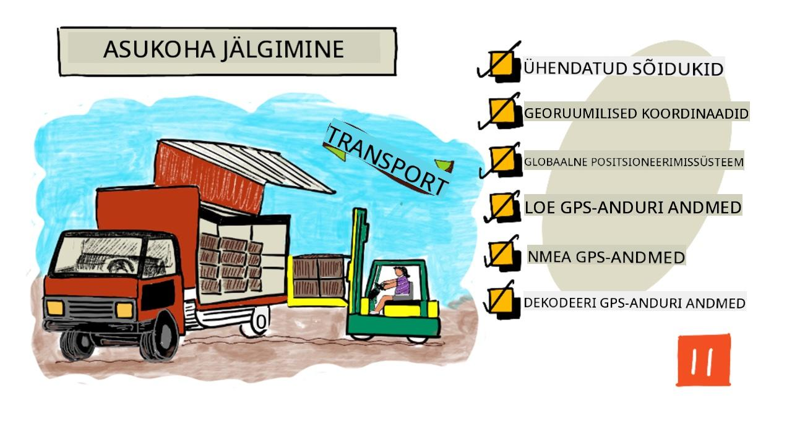
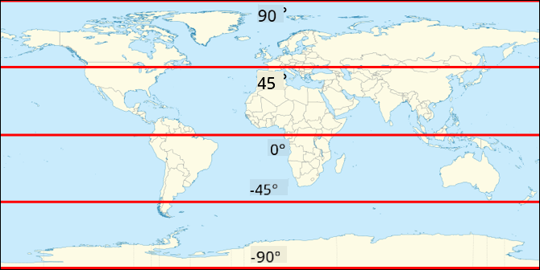
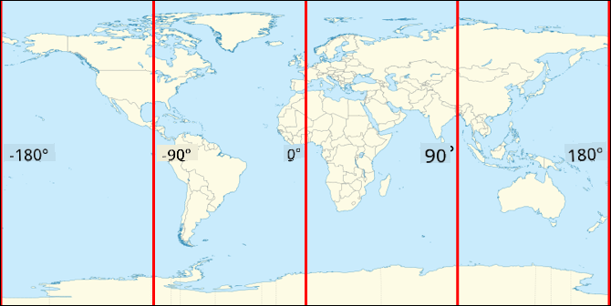
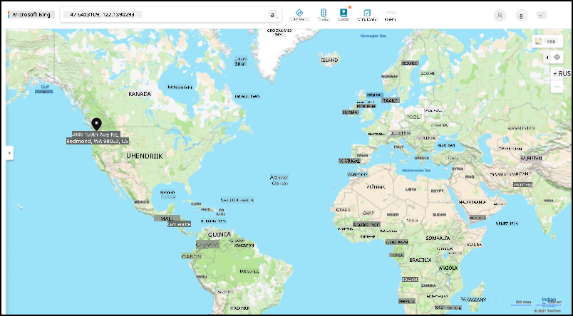
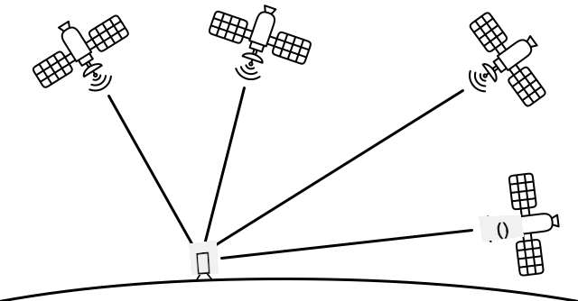

<!--
CO_OP_TRANSLATOR_METADATA:
{
  "original_hash": "52ed2bd997d08040f79a1a6ef2bac958",
  "translation_date": "2025-10-11T11:58:12+00:00",
  "source_file": "3-transport/lessons/1-location-tracking/README.md",
  "language_code": "et"
}
-->
# Asukoha jälgimine

> Visuaal autorilt [Nitya Narasimhan](https://github.com/nitya). Klõpsa pildil, et näha suuremat versiooni.

## Eel-loengu viktoriin

[Eel-loengu viktoriin](https://black-meadow-040d15503.1.azurestaticapps.net/quiz/21)

## Sissejuhatus

Toidu jõudmine farmerilt tarbijani hõlmab toodete kastide laadimist veoautodele, laevadele, lennukitele või muudele transpordivahenditele ning nende toimetamist sihtkohta – kas otse kliendile või keskusesse või lattu töötlemiseks. Kogu protsess farmist tarbijani on osa *tarneahelast*. Allolev video Arizona State University W. P. Carey School of Business'ist selgitab tarneahela ideed ja selle haldamist üksikasjalikumalt.

> 🎥 Klõpsa ülaloleval pildil, et vaadata videot

IoT-seadmete lisamine võib oluliselt parandada teie tarneahelat, võimaldades hallata, kus esemed asuvad, paremini planeerida transporti ja kaupade käsitlemist ning kiiremini reageerida probleemidele.

Veoautode või muude sõidukite pargi haldamisel on kasulik teada, kus iga sõiduk teatud ajahetkel asub. Sõidukitele saab paigaldada GPS-andureid, mis saadavad nende asukoha IoT-süsteemidesse, võimaldades omanikel määrata nende asukohta, näha läbitud marsruuti ja teada, millal nad sihtkohta jõuavad. Enamik sõidukeid töötab väljaspool WiFi leviala, seega kasutavad nad sellise andmete saatmiseks mobiilsidevõrke. Mõnikord on GPS-andur integreeritud keerukamatesse IoT-seadmetesse, nagu elektroonilised logiraamatud. Need seadmed jälgivad, kui kaua veoauto on olnud teel, et tagada juhtide vastavus kohalikele tööaegade seadustele.

Selles õppetunnis õpid, kuidas jälgida sõiduki asukohta, kasutades globaalset positsioneerimissüsteemi (GPS) andurit.

Selles õppetunnis käsitleme:

* [Ühendatud sõidukid](../../../../../3-transport/lessons/1-location-tracking)
* [Georuumilised koordinaadid](../../../../../3-transport/lessons/1-location-tracking)
* [Globaalne positsioneerimissüsteem (GPS)](../../../../../3-transport/lessons/1-location-tracking)
* [GPS-anduri andmete lugemine](../../../../../3-transport/lessons/1-location-tracking)
* [NMEA GPS-andmed](../../../../../3-transport/lessons/1-location-tracking)
* [GPS-anduri andmete dekodeerimine](../../../../../3-transport/lessons/1-location-tracking)

## Ühendatud sõidukid

IoT muudab kaupade transportimise viisi, luues *ühendatud sõidukite* pargid. Need sõidukid on ühendatud kesksete IT-süsteemidega, mis edastavad teavet nende asukoha ja muude andurite andmete kohta. Ühendatud sõidukite pargil on mitmeid eeliseid:

* Asukoha jälgimine – saate määrata sõiduki asukoha igal ajahetkel, võimaldades:

  * Saada teateid, kui sõiduk on sihtkohta jõudmas, et valmistada meeskond mahalaadimiseks
  * Leida varastatud sõidukeid
  * Kombineerida asukoha- ja marsruudiandmeid liiklusprobleemidega, et võimaldada sõidukite marsruudi muutmist reisi keskel
  * Täita maksunõudeid. Mõned riigid võtavad sõidukitelt tasu avalikel teedel läbitud kilomeetrite eest (näiteks [Uus-Meremaa RUC](https://www.nzta.govt.nz/vehicles/licensing-rego/road-user-charges/)), seega avalikel teedel vs erateedel sõitmise teadmine muudab maksude arvutamise lihtsamaks.
  * Teada, kuhu saata hooldusmeeskonnad rikke korral

* Juhi telemeetria – võimalus tagada, et juhid järgivad kiirusepiiranguid, kurvivad sobiva kiirusega, pidurdavad varakult ja tõhusalt ning sõidavad ohutult. Ühendatud sõidukitel võivad olla ka kaamerad, mis salvestavad juhtumeid. See võib olla seotud kindlustusega, pakkudes headele juhtidele madalamaid hindu.

* Juhi tööaegade järgimine – tagades, et juhid sõidavad ainult seadusega lubatud tundide jooksul, lähtudes mootori sisse- ja väljalülitamise aegadest.

Neid eeliseid saab kombineerida – näiteks kombineerides juhi tööaegade järgimist asukoha jälgimisega, et muuta marsruuti, kui juht ei jõua sihtkohta lubatud sõidutundide jooksul. Neid saab kombineerida ka muude sõidukispetsiifiliste telemeetriaandmetega, näiteks temperatuuriga temperatuurikontrolliga veoautodes, võimaldades sõidukeid ümber suunata, kui nende praegune marsruut tähendaks, et kaupu ei saa hoida sobival temperatuuril.

> 🎓 Logistika on kaupade transportimise protsess ühest kohast teise, näiteks farmist supermarketisse läbi ühe või mitme lao. Farmer pakib tomatikastid, mis laaditakse veoautole, toimetatakse kesklaosse ja pannakse teisele veoautole, mis võib sisaldada erinevat tüüpi toodete segu, mis seejärel toimetatakse supermarketisse.

Sõidukite jälgimise põhikomponent on GPS – andurid, mis suudavad määrata oma asukoha kõikjal Maal. Selles õppetunnis õpid, kuidas kasutada GPS-andurit, alustades sellest, kuidas määratleda asukohta Maal.

## Georuumilised koordinaadid

Georuumilisi koordinaate kasutatakse punktide määratlemiseks Maa pinnal, sarnaselt sellele, kuidas koordinaate saab kasutada pikslite joonistamiseks arvutiekraanil või piste asukoha määramiseks ristpistes. Ühe punkti jaoks on teil koordinaatide paar. Näiteks Microsofti kampus Redmondis, Washingtonis, USA-s asub koordinaatidel 47.6423109, -122.1390293.

### Laius- ja pikkuskraadid

Maa on sfäär – kolmemõõtmeline ring. Seetõttu määratakse punktid, jagades selle 360 kraadiks, sama nagu ringide geomeetrias. Laiuskraad mõõdab kraadide arvu põhjast lõunasse, pikkuskraad mõõdab kraadide arvu idast läände.

> 💁 Keegi ei tea täpselt, miks ringid jagatakse 360 kraadiks. [Kraad (nurk) Wikipedia leht](https://wikipedia.org/wiki/Degree_(angle)) käsitleb mõningaid võimalikke põhjuseid.

Laiuskraadi mõõdetakse joontega, mis ümbritsevad Maad ja kulgevad paralleelselt ekvaatoriga, jagades põhjapoolkera ja lõunapoolkera 90° osadeks. Ekvaator on 0°, põhjapoolus on 90°, tuntud ka kui 90° põhja, ja lõunapoolus on -90°, ehk 90° lõuna.

Pikkuskraadi mõõdetakse kraadide arvuna idast ja läänest. Pikkuskraadi 0° alguspunkti nimetatakse *nullmeridiaaniks* ja see määrati 1884. aastal joonena, mis kulgeb põhjapoolusest lõunapooluseni läbi [Briti Kuningliku Observatooriumi Greenwichis, Inglismaal](https://wikipedia.org/wiki/Royal_Observatory,_Greenwich).

> 🎓 Meridiaan on kujuteldav sirgjoon, mis kulgeb põhjapoolusest lõunapooluseni, moodustades poolringi.

Pikkuskraadi mõõtmiseks mõõdetakse kraadide arv ekvaatoril nullmeridiaanist meridiaanini, mis läbib seda punkti. Pikkuskraad ulatub -180° (180° lääne) kaudu 0° nullmeridiaanil kuni 180° (180° ida). 180° ja -180° viitavad samale punktile, antimeridiaanile ehk 180. meridiaanile. See on meridiaan, mis asub nullmeridiaani vastasküljel Maal.

> 💁 Antimeridiaani ei tohi segi ajada rahvusvahelise kuupäevajoonega, mis asub ligikaudu samas kohas, kuid ei ole sirgjoon ja varieerub geopoliitiliste piiride järgi.

✅ Uuri välja: Proovi leida oma praeguse asukoha laius- ja pikkuskraadid.

### Kraadid, minutid ja sekundid vs kümnendkraadid

Traditsiooniliselt mõõdeti laius- ja pikkuskraadi kraade seksagesimaalses süsteemis ehk baasis-60, numbrisüsteemis, mida kasutasid iidsed babüloonlased, kes tegid esimesed aja ja kauguse mõõtmised ja salvestused. Sa kasutad seksagesimaalset süsteemi tõenäoliselt iga päev, ilma et seda märkaksid – jagades tunnid 60 minutiks ja minutid 60 sekundiks.

Pikkus- ja laiuskraadi mõõdetakse kraadides, minutites ja sekundites, kus üks minut on 1/60 kraadi ja üks sekund on 1/60 minutit.

Näiteks ekvaatoril:

* 1° laiuskraadi on **111,3 kilomeetrit**
* 1 minut laiuskraadi on 111,3/60 = **1,855 kilomeetrit**
* 1 sekund laiuskraadi on 1,855/60 = **0,031 kilomeetrit**

Minuti sümbol on ühekordne jutumärk, sekundi sümbol on kahekordne jutumärk. Näiteks 2 kraadi, 17 minutit ja 43 sekundit kirjutatakse 2°17'43". Sekundite osad antakse kümnendkohtadena, näiteks pool sekundit on 0°0'0.5".

Arvutid ei tööta baasis-60, seega antakse need koordinaadid GPS-andmetes enamasti kümnendkraadidena. Näiteks 2°17'43" on 2.295277. Kraadisümbolit tavaliselt ei kasutata.

Punkti koordinaadid antakse alati kujul `laiuskraad, pikkuskraad`, seega varasem näide Microsofti kampusest koordinaatidel 47.6423109,-122.117198 sisaldab:

* Laiuskraadi 47.6423109 (47.6423109 kraadi põhja ekvaatorist)
* Pikkuskraadi -122.1390293 (122.1390293 kraadi lääne nullmeridiaanist).

## Globaalne positsioneerimissüsteem (GPS)

GPS-süsteemid kasutavad mitmeid Maa orbiidil olevaid satelliite, et määrata teie asukoht. Tõenäoliselt olete GPS-süsteeme kasutanud, seda isegi märkamata – näiteks oma asukoha leidmiseks telefonis kaardirakenduses nagu Apple Maps või Google Maps, või et näha, kus teie sõit asub rakenduses nagu Uber või Lyft, või satelliitnavigatsiooni (sat-nav) kasutamisel autos.

> 🎓 Satelliidid "satelliitnavigatsioonis" on GPS-satelliidid!

GPS-süsteemid töötavad nii, et mitmed satelliidid saadavad signaali, mis sisaldab iga satelliidi praegust asukohta ja täpset ajatemplit. Need signaalid saadetakse raadiosageduste kaudu ja tuvastatakse GPS-anduri antenni abil. GPS-andur tuvastab need signaalid ja kasutades praegust aega mõõdab, kui kaua signaali jõudmine satelliidilt andurini kestis. Kuna raadiosageduste kiirus on konstantne, saab GPS-andur kasutada saadetud ajatemplit, et arvutada, kui kaugel andur satelliidist asub. Kombineerides vähemalt 3 satelliidi andmed saadetud asukohtadega, suudab GPS-andur määrata oma asukoha Maal.

> 💁 GPS-andurid vajavad antenne raadiosageduste tuvastamiseks. Veoautodes ja autodes sisseehitatud GPS-antenne paigutatakse hea signaali saamiseks tavaliselt esiklaasile või katusele. Kui kasutate eraldi GPS-süsteemi, näiteks nutitelefoni või IoT-seadet, peate tagama, et GPS-süsteemi või telefoni sisseehitatud antennil oleks selge vaade taevasse, näiteks esiklaasil.

GPS-satelliidid tiirlevad ümber Maa, mitte ei ole fikseeritud punktis anduri kohal, seega sisaldavad asukohaandmed ka kõrgust merepinnast lisaks laius- ja pikkuskraadidele.

GPS-il oli varem USA sõjaväe kehtestatud täpsuspiirang, mis piiras täpsust umbes 5 meetrini. See piirang eemaldati 2000. aastal, võimaldades täpsust kuni 30 sentimeetrit. Sellise täpsuse saavutamine ei ole alati võimalik signaalide häirete tõttu.

✅ Kui teil on nutitelefon, avage kaardirakendus ja vaadake, kui täpne on teie asukoht. Võib kuluda veidi aega, kuni telefon tuvastab mitu satelliiti, et saada täpsem asukoht.

> 💁 Satelliidid sisaldavad aatomkellasid, mis on äärmiselt täpsed, kuid need nihkuvad 38 mikrosekundit (0.0000038 sekundit) päevas võrreldes Maa aatomkelladega, kuna aeg aeglustub kiiruse suurenedes, nagu ennustas Einstein oma erirelatiivsuse ja üldrelatiivsuse teooriates – satelliidid liiguvad kiiremini kui Maa pöörlemine. See nihkumine on kasutatud erirelatiivsuse ja üldrelatiivsuse ennustuste tõestamiseks ning GPS-süsteemide kujundamisel tuleb seda arvesse võtta. Aeg kulgeb GPS-satelliidil sõna otseses mõttes aeglasemalt.

GPS-süsteeme on arendanud ja kasutusele võtnud mitmed riigid ja poliitilised liidud, sealhulgas USA, Venemaa, Jaapan, India, EL ja Hiina. Kaasaegsed GPS-andurid suudavad ühenduda enamiku nende süsteemidega, et saada kiiremaid ja täpsemaid tulemusi.

> 🎓 Iga süsteemi satelliitide rühmi nimetatakse konstellatsioonideks.

## GPS-anduri andmete lugemine

Enamik GPS-andureid saadab GPS-andmeid UART-i kaudu.

> ⚠️ UART-i käsitleti [projekti 2, õppetund 2](../../../2-farm/lessons/2-detect-soil-moisture/README.md#universal-asynchronous-receiver-transmitter-uart). Vajadusel vaadake seda õppetundi uuesti.

Saate kasutada GPS-andurit oma IoT-seadmes, et saada GPS-andmeid.

### Ülesanne – ühendage GPS-andur ja lugege GPS-andmeid
Töötage läbi vastav juhend, et lugeda GPS-andmeid oma IoT-seadmega:

* [Arduino - Wio Terminal](wio-terminal-gps-sensor.md)
* [Üheplaatarvuti - Raspberry Pi](pi-gps-sensor.md)
* [Üheplaatarvuti - Virtuaalne seade](virtual-device-gps-sensor.md)

## NMEA GPS-andmed

Kui käivitasite oma koodi, nägite tõenäoliselt väljundis midagi, mis võib tunduda segasena. Tegelikult on see standardne GPS-andmestik, millel on kindel tähendus.

GPS-sensorid edastavad andmeid NMEA-sõnumite kaudu, kasutades NMEA 0183 standardit. NMEA on lühend [National Marine Electronics Association](https://www.nmea.org) (Riiklik Meretehnika Assotsiatsioon), USA-s asuvast kaubandusorganisatsioonist, mis kehtestab standardid meretehnika vaheliseks suhtluseks.

> 💁 See standard on patenteeritud ja maksab vähemalt 2000 USA dollarit, kuid piisavalt teavet selle kohta on avalikus domeenis, et enamik standardist on lahti muugitud ja seda saab kasutada avatud lähtekoodiga ja muus mitteärilises koodis.

Need sõnumid on tekstipõhised. Iga sõnum koosneb *lausest*, mis algab `$` märgiga, millele järgneb 2 märki, mis näitavad sõnumi allikat (nt GP USA GPS-süsteemi jaoks, GN GLONASS-i, Venemaa GPS-süsteemi jaoks) ja 3 märki, mis näitavad sõnumi tüüpi. Ülejäänud sõnum koosneb komadega eraldatud väljadest, mis lõppevad uue rea märgiga.

Mõned sõnumitüübid, mida võib vastu võtta, on:

| Tüüp | Kirjeldus |
| ---- | ----------- |
| GGA | GPS-i fikseeritud andmed, sealhulgas GPS-sensori laiuskraad, pikkuskraad ja kõrgus, samuti satelliitide arv, mida kasutatakse selle fikseeritud asukoha arvutamiseks. |
| ZDA | Praegune kuupäev ja kellaaeg, sealhulgas kohalik ajavöönd |
| GSV | Üksikasjad nähtavate satelliitide kohta - määratletud kui satelliidid, mille signaale GPS-sensor suudab tuvastada |

> 💁 GPS-andmed sisaldavad ajatempleid, seega saab teie IoT-seade vajadusel GPS-sensorilt aega, selle asemel et tugineda NTP-serverile või sisemisele reaalaja kellale.

GGA-sõnum sisaldab praegust asukohta vormingus `(dd)dmm.mmmm`, koos ühe tähemärgiga, mis näitab suunda. Vormingus `d` tähistab kraade, `m` minuteid ja sekundid on minutite kümnendmurruna. Näiteks 2°17'43" oleks 217.716666667 - 2 kraadi, 17.716666667 minutit.

Suunda tähistav tähemärk võib olla `N` või `S` laiuskraadi jaoks, et näidata põhja või lõunat, ja `E` või `W` pikkuskraadi jaoks, et näidata ida või läänt. Näiteks laiuskraad 2°17'43" oleks suunatähega `N`, -2°17'43" oleks suunatähega `S`.

Näide - NMEA lause `$GNGGA,020604.001,4738.538654,N,12208.341758,W,1,3,,164.7,M,-17.1,M,,*67`

* Laiuskraadi osa on `4738.538654,N`, mis teisendub 47.6423109-ks kümnendkraadides. `4738.538654` on 47.6423109 ja suund on `N` (põhi), seega on see positiivne laiuskraad.

* Pikkuskraadi osa on `12208.341758,W`, mis teisendub -122.1390293-ks kümnendkraadides. `12208.341758` on 122.1390293° ja suund on `W` (lääs), seega on see negatiivne pikkuskraad.

## GPS-sensori andmete dekodeerimine

Toores NMEA-andmete kasutamise asemel on parem need dekodeerida kasulikumasse vormingusse. On mitmeid avatud lähtekoodiga teeke, mida saate kasutada, et aidata toorest NMEA-sõnumitest kasulikke andmeid välja võtta.

### Ülesanne - GPS-sensori andmete dekodeerimine

Töötage läbi vastav juhend, et dekodeerida GPS-sensori andmeid oma IoT-seadmega:

* [Arduino - Wio Terminal](wio-terminal-gps-decode.md)
* [Üheplaatarvuti - Raspberry Pi/Virtuaalne IoT-seade](single-board-computer-gps-decode.md)

---

## 🚀 Väljakutse

Kirjutage oma NMEA dekooder! Kas saate kirjutada oma dekooderi, et NMEA lausetest laius- ja pikkuskraadi välja võtta, selle asemel et tugineda kolmanda osapoole teekidele?

## Loengu järgne viktoriin

[Loengu järgne viktoriin](https://black-meadow-040d15503.1.azurestaticapps.net/quiz/22)

## Ülevaade ja iseseisev õppimine

* Lugege rohkem geograafiliste koordinaatide kohta [Geograafiliste koordinaatide süsteemi lehelt Wikipedias](https://wikipedia.org/wiki/Geographic_coordinate_system).
* Uurige teisi taevakehade algmeridiaane peale Maa [Algmeridiaani lehelt Wikipedias](https://wikipedia.org/wiki/Prime_meridian#Prime_meridian_on_other_planetary_bodies).
* Uurige erinevaid GPS-süsteeme, mida on välja töötanud erinevad maailma valitsused ja poliitilised liidud, nagu EL, Jaapan, Venemaa, India ja USA.

## Ülesanne

[Uurige teisi GPS-andmeid](assignment.md)

---

**Lahtiütlus**:  
See dokument on tõlgitud AI tõlketeenuse [Co-op Translator](https://github.com/Azure/co-op-translator) abil. Kuigi püüame tagada täpsust, palume arvestada, et automaatsed tõlked võivad sisaldada vigu või ebatäpsusi. Algne dokument selle algses keeles tuleks pidada autoriteetseks allikaks. Olulise teabe puhul soovitame kasutada professionaalset inimtõlget. Me ei vastuta selle tõlke kasutamisest tulenevate arusaamatuste või valesti tõlgenduste eest.