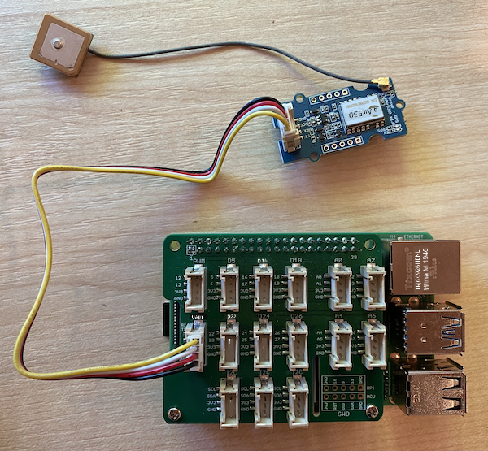

<!--
CO_OP_TRANSLATOR_METADATA:
{
  "original_hash": "3b2448c7ab4e9673e77e35a50c5e350d",
  "translation_date": "2025-10-11T11:59:21+00:00",
  "source_file": "3-transport/lessons/1-location-tracking/pi-gps-sensor.md",
  "language_code": "et"
}
-->
# Loe GPS-andmeid - Raspberry Pi

Selles õppetunni osas lisate Raspberry Pile GPS-sensori ja loete sellest väärtusi.

## Riistvara

Raspberry Pi vajab GPS-sensorit.

Sensor, mida kasutate, on [Grove GPS Air530 sensor](https://www.seeedstudio.com/Grove-GPS-Air530-p-4584.html). See sensor saab ühenduda mitme GPS-süsteemiga, et tagada kiire ja täpne asukoha määramine. Sensor koosneb kahest osast - sensori elektroonikast ja välisest antennist, mis on ühendatud õhukese juhtmega, et satelliitidelt raadiolaineid vastu võtta.

See on UART-sensor, mis edastab GPS-andmeid UART-i kaudu.

## Ühendage GPS-sensor

Grove GPS-sensorit saab ühendada Raspberry Piga.

### Ülesanne - ühendage GPS-sensor

Ühendage GPS-sensor.


1. Sisestage Grove-kaabli üks ots GPS-sensori pistikusse. Kaabel läheb sisse ainult ühes suunas.

1. Kui Raspberry Pi on välja lülitatud, ühendage Grove-kaabli teine ots Grove Base hatisse, UART-pistikusse, mis on tähistatud **UART**. See pistik asub keskmises reas, SD-kaardi pesa lähedal, USB-portide ja Etherneti pesa vastaspoolel.

    

1. Paigutage GPS-sensor nii, et ühendatud antennil oleks nähtavus taeva suunas - ideaalis avatud akna lähedal või väljas. Selgem signaal on kergemini saadaval, kui antenni ees pole takistusi.

## Programmeerige GPS-sensor

Nüüd saab Raspberry Pi programmeerida kasutama ühendatud GPS-sensorit.

### Ülesanne - programmeerige GPS-sensor

Programmeerige seade.

1. Lülitage Pi sisse ja oodake, kuni see käivitub.

1. GPS-sensoril on 2 LED-i - sinine LED, mis vilgub andmete edastamisel, ja roheline LED, mis vilgub iga sekund, kui satelliitidelt andmeid vastu võetakse. Veenduge, et sinine LED vilgub, kui Pi sisse lülitate. Mõne minuti pärast hakkab roheline LED vilkuma - kui ei, peate võib-olla antenni asukohta muutma.

1. Käivitage VS Code, kas otse Pi peal või ühenduge Remote SSH laienduse kaudu.

    > ⚠️ Vajadusel saate viidata [juhistele VS Code'i seadistamiseks ja käivitamiseks õppetunnis 1](../../../1-getting-started/lessons/1-introduction-to-iot/pi.md).

1. Uuematel Raspberry Pi versioonidel, mis toetavad Bluetoothi, on konflikt Bluetoothi jaoks kasutatava jadapordi ja Grove UART-pordi jadapordi vahel. Selle lahendamiseks tehke järgmist:

    1. VS Code'i terminalist redigeerige faili `/boot/config.txt` kasutades `nano`, sisseehitatud terminali tekstiredaktorit, järgmise käsuga:

        ```sh
        sudo nano /boot/config.txt
        ```

        > Seda faili ei saa VS Code'is redigeerida, kuna vajate `sudo` õigusi, kõrgendatud luba. VS Code ei tööta selle loaga.

    1. Kasutage kursoriklahve, et liikuda faili lõppu, seejärel kopeerige allolev kood ja kleepige see faili lõppu:

        ```ini
        dtoverlay=pi3-miniuart-bt
        dtoverlay=pi3-disable-bt
        enable_uart=1
        ```

        Kleepimiseks kasutage oma seadme tavalisi klaviatuuri otseteid (`Ctrl+v` Windowsis, Linuxis või Raspberry Pi OS-is, `Cmd+v` macOS-is).

    1. Salvestage fail ja väljuge nanost, vajutades `Ctrl+x`. Vajutage `y`, kui küsitakse, kas soovite muudetud puhvri salvestada, ja vajutage `enter`, et kinnitada, et soovite faili `/boot/config.txt` üle kirjutada.

        > Kui teete vea, saate väljuda ilma salvestamata ja korrata neid samme.

    1. Redigeerige faili `/boot/cmdline.txt` nanos järgmise käsuga:

        ```sh
        sudo nano /boot/cmdline.txt
        ```

    1. Selles failis on mitmeid võtme/väärtuse paare, mis on eraldatud tühikutega. Eemaldage kõik võtme `console` võtme/väärtuse paarid. Need näevad tõenäoliselt välja umbes sellised:

        ```output
        console=serial0,115200 console=tty1 
        ```

        Kursoriklahvide abil saate liikuda nende kirjeteni ja kustutada need tavaliste `del` või `backspace` klahvidega.

        Näiteks, kui teie algne fail näeb välja selline:

        ```output
        console=serial0,115200 console=tty1 root=PARTUUID=058e2867-02 rootfstype=ext4 elevator=deadline fsck.repair=yes rootwait
        ```

        Uus versioon näeb välja selline:

        ```output
        root=PARTUUID=058e2867-02 rootfstype=ext4 elevator=deadline fsck.repair=yes rootwait
        ```

    1. Järgige ülaltoodud samme, et salvestada fail ja väljuda nanost.

    1. Taaskäivitage oma Pi, seejärel ühenduge uuesti VS Code'iga, kui Pi on taaskäivitatud.

1. Terminalist looge `pi` kasutaja kodukataloogi uus kaust nimega `gps-sensor`. Looge selles kaustas fail nimega `app.py`.

1. Avage see kaust VS Code'is.

1. GPS-moodul saadab UART-andmeid jadapordi kaudu. Installige `pyserial` Pip-pakett, et suhelda jadapordiga oma Python-koodist:

    ```sh
    pip3 install pyserial
    ```

1. Lisage oma `app.py` faili järgmine kood:

    ```python
    import time
    import serial
    
    serial = serial.Serial('/dev/ttyAMA0', 9600, timeout=1)
    serial.reset_input_buffer()
    serial.flush()
    
    def print_gps_data(line):
        print(line.rstrip())
    
    while True:
        line = serial.readline().decode('utf-8')
    
        while len(line) > 0:
            print_gps_data(line)
            line = serial.readline().decode('utf-8')
    
        time.sleep(1)
    ```

    See kood impordib `serial` mooduli `pyserial` Pip-paketist. Seejärel ühendub see jadaportiga `/dev/ttyAMA0` - see on Grove Pi Base Hati UART-pordi jadapordi aadress. Seejärel kustutab see kõik olemasolevad andmed sellest jadaportist.

    Järgmisena määratletakse funktsioon nimega `print_gps_data`, mis prindib konsoolile rea, mis sellele edastatakse.

    Seejärel kood kordab lõputult, lugedes igas tsüklis jadaportist nii palju tekstiridu kui võimalik. See kutsub iga rea jaoks funktsiooni `print_gps_data`.

    Kui kõik andmed on loetud, jääb tsükkel üheks sekundiks magama ja proovib uuesti.

1. Käivitage see kood. Näete GPS-sensori toorväljundit, mis näeb välja umbes selline:

    ```output
    $GNGGA,020604.001,4738.538654,N,12208.341758,W,1,3,,164.7,M,-17.1,M,,*67
    $GPGSA,A,1,,,,,,,,,,,,,,,*1E
    $BDGSA,A,1,,,,,,,,,,,,,,,*0F
    $GPGSV,1,1,00*79
    $BDGSV,1,1,00*68
    ```

    > Kui saate ühe järgmistest vigadest, kui peatate ja taaskäivitate oma koodi, lisage `try - except` plokk oma while-tsüklisse.

      ```output
      UnicodeDecodeError: 'utf-8' codec can't decode byte 0x93 in position 0: invalid start byte
      UnicodeDecodeError: 'utf-8' codec can't decode byte 0xf1 in position 0: invalid continuation byte
      ```

    ```python
    while True:
        try:
            line = serial.readline().decode('utf-8')
              
            while len(line) > 0:
                print_gps_data()
                line = serial.readline().decode('utf-8')
      
        # There's a random chance the first byte being read is part way through a character.
        # Read another full line and continue.

        except UnicodeDecodeError:
            line = serial.readline().decode('utf-8')

    time.sleep(1)
    ```

> 💁 Selle koodi leiate kaustast [code-gps/pi](../../../../../3-transport/lessons/1-location-tracking/code-gps/pi).

😀 Teie GPS-sensori programm oli edukas!

---

**Lahtiütlus**:  
See dokument on tõlgitud, kasutades AI tõlketeenust [Co-op Translator](https://github.com/Azure/co-op-translator). Kuigi püüame tagada täpsust, palume arvestada, et automaatsed tõlked võivad sisaldada vigu või ebatäpsusi. Algne dokument selle algkeeles tuleks lugeda autoriteetseks allikaks. Olulise teabe puhul soovitame kasutada professionaalset inimtõlget. Me ei vastuta selle tõlke kasutamisest tulenevate arusaamatuste või valede tõlgenduste eest.