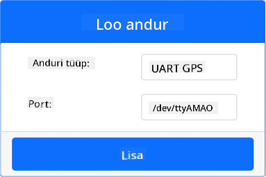
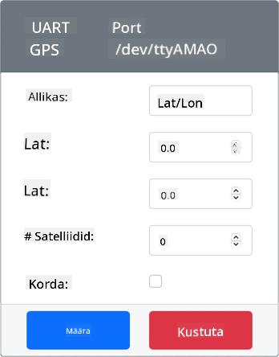
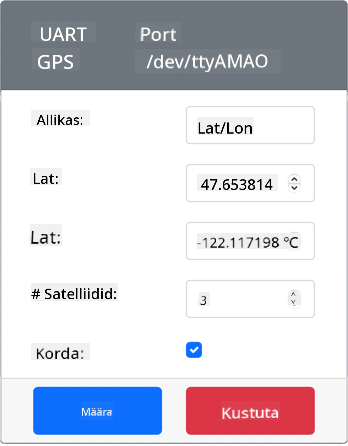
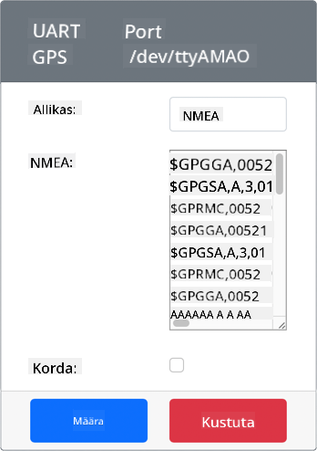
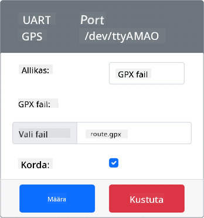

<!--
CO_OP_TRANSLATOR_METADATA:
{
  "original_hash": "64f18a8f8aaa1fef5e7320e0992d8b3a",
  "translation_date": "2025-10-11T12:00:12+00:00",
  "source_file": "3-transport/lessons/1-location-tracking/virtual-device-gps-sensor.md",
  "language_code": "et"
}
-->
# Loe GPS-andmeid - Virtuaalne IoT-riistvara

Selles õppetunni osas lisate oma virtuaalsele IoT-seadmele GPS-anduri ja loete selle väärtusi.

## Virtuaalne riistvara

Virtuaalne IoT-seade kasutab simuleeritud GPS-andurit, mis on juurdepääsetav UART-i kaudu seeriapordi abil.

Füüsilisel GPS-anduril on antenn, mis võtab vastu raadiosignaale GPS-satelliitidelt ja teisendab GPS-signaalid GPS-andmeteks. Virtuaalne versioon simuleerib seda, võimaldades teil kas määrata laius- ja pikkuskraadi, saata toor-NMEA lauseid või üles laadida GPX-faili mitme asukohaga, mida saab järjestikku tagastada.

> 🎓 NMEA lauseid käsitletakse hiljem selles õppetunnis

### Lisage andur CounterFit-i

Virtuaalse GPS-anduri kasutamiseks peate selle CounterFit rakendusse lisama.

#### Ülesanne - lisage andur CounterFit-i

Lisage GPS-andur CounterFit rakendusse.

1. Looge oma arvutis uus Python-rakendus kaustas `gps-sensor`, millel on üks fail nimega `app.py` ja Python-i virtuaalne keskkond, ning lisage CounterFit pip-paketid.

    > ⚠️ Vajadusel saate viidata [juhistele CounterFit Python-projekti loomise ja seadistamise kohta õppetunnis 1](../../../1-getting-started/lessons/1-introduction-to-iot/virtual-device.md).

1. Installige täiendav Pip-pakett, et paigaldada CounterFit shim, mis suudab suhelda UART-põhiste anduritega seeriapordi kaudu. Veenduge, et installite selle terminalist, kus virtuaalne keskkond on aktiveeritud.

    ```sh
    pip install counterfit-shims-serial
    ```

1. Veenduge, et CounterFit veebirakendus töötab.

1. Looge GPS-andur:

    1. *Sensors* paneelil *Create sensor* kastis avage *Sensor type* rippmenüü ja valige *UART GPS*.

    1. Jätke *Port* väärtuseks */dev/ttyAMA0*.

    1. Valige **Add** nupp, et luua GPS-andur pordil `/dev/ttyAMA0`.

    

    GPS-andur luuakse ja ilmub andurite loendisse.

    

## Programmeerige GPS-andur

Virtuaalne IoT-seade saab nüüd programmeerida virtuaalset GPS-andurit kasutama.

### Ülesanne - programmeerige GPS-andur

Programmeeri GPS-anduri rakendus.

1. Veenduge, et `gps-sensor` rakendus on VS Code'is avatud.

1. Avage `app.py` fail.

1. Lisage `app.py` faili algusesse järgmine kood, et ühendada rakendus CounterFit-iga:

    ```python
    from counterfit_connection import CounterFitConnection
    CounterFitConnection.init('127.0.0.1', 5000)
    ```

1. Lisage sellele alla järgmine kood, et importida vajalikud teegid, sealhulgas CounterFit seeriapordi teek:

    ```python
    import time
    import counterfit_shims_serial
    
    serial = counterfit_shims_serial.Serial('/dev/ttyAMA0')
    ```

    See kood impordib `serial` mooduli `counterfit_shims_serial` Pip-paketist. Seejärel ühendatakse `/dev/ttyAMA0` seeriapordiga - see on seeriapordi aadress, mida virtuaalne GPS-andur kasutab oma UART-pordi jaoks.

1. Lisage sellele alla järgmine kood, et lugeda seeriapordist ja kuvada väärtused konsoolis:

    ```python
    def print_gps_data(line):
        print(line.rstrip())
    
    while True:
        line = serial.readline().decode('utf-8')
    
        while len(line) > 0:
            print_gps_data(line)
            line = serial.readline().decode('utf-8')
    
        time.sleep(1)
    ```

    Defineeritakse funktsioon `print_gps_data`, mis kuvab konsoolis edasiantud rea.

    Seejärel kood tsüklib lõputult, lugedes igas tsüklis seeriapordist nii palju tekstiridu kui võimalik. Iga rea jaoks kutsutakse `print_gps_data` funktsiooni.

    Pärast kõigi andmete lugemist tsükkel magab 1 sekundi ja proovib uuesti.

1. Käivitage see kood, veendudes, et kasutate teist terminali kui see, kus CounterFit rakendus töötab, et CounterFit rakendus jääks tööle.

1. CounterFit rakenduses muutke GPS-anduri väärtust. Seda saab teha ühel järgmistest viisidest:

    * Määrake **Source** väärtuseks `Lat/Lon` ja määrake konkreetne laiuskraad, pikkuskraad ja satelliitide arv, mida GPS-fiksi saamiseks kasutatakse. See väärtus saadetakse ainult üks kord, seega kontrollige **Repeat** kasti, et andmed korduksid iga sekundi järel.

      

    * Määrake **Source** väärtuseks `NMEA` ja lisage mõned NMEA laused tekstikasti. Kõik need väärtused saadetakse, kusjuures iga uue GGA (asukoha fikseerimise) lause lugemise vahel on 1-sekundiline viivitus.

      

      Võite kasutada tööriista nagu [nmeagen.org](https://www.nmeagen.org), et genereerida neid lauseid kaardil joonistades. Need väärtused saadetakse ainult üks kord, seega kontrollige **Repeat** kasti, et andmed korduksid üks sekund pärast nende kõigi saatmist.

    * Määrake **Source** väärtuseks GPX-fail ja laadige üles GPX-fail rajakohtadega. GPX-faile saab alla laadida mitmetelt populaarsetelt kaardistamis- ja matkamissaitidelt, nagu [AllTrails](https://www.alltrails.com/). Need failid sisaldavad mitmeid GPS-asukohti rajana ja GPS-andur tagastab iga uue asukoha 1-sekundiliste intervallidega.

      

      Need väärtused saadetakse ainult üks kord, seega kontrollige **Repeat** kasti, et andmed korduksid üks sekund pärast nende kõigi saatmist.

    Kui olete GPS-seaded konfigureerinud, valige **Set** nupp, et need väärtused andurile kinnitada.

1. Näete GPS-anduri toorväljundit, mis näeb välja umbes selline:

    ```output
    $GNGGA,020604.001,4738.538654,N,12208.341758,W,1,3,,164.7,M,-17.1,M,,*67
    $GNGGA,020604.001,4738.538654,N,12208.341758,W,1,3,,164.7,M,-17.1,M,,*67
    ```

> 💁 Selle koodi leiate [code-gps/virtual-device](../../../../../3-transport/lessons/1-location-tracking/code-gps/virtual-device) kaustast.

😀 Teie GPS-anduri programm oli edukas!

---

**Lahtiütlus**:  
See dokument on tõlgitud AI tõlketeenuse [Co-op Translator](https://github.com/Azure/co-op-translator) abil. Kuigi püüame tagada täpsust, palume arvestada, et automaatsed tõlked võivad sisaldada vigu või ebatäpsusi. Algne dokument selle algses keeles tuleks pidada autoriteetseks allikaks. Olulise teabe puhul soovitame kasutada professionaalset inimtõlget. Me ei vastuta selle tõlke kasutamisest tulenevate arusaamatuste või valesti tõlgenduste eest.