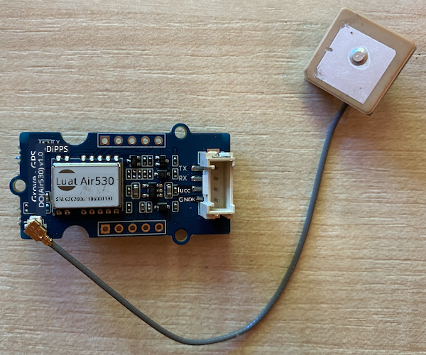
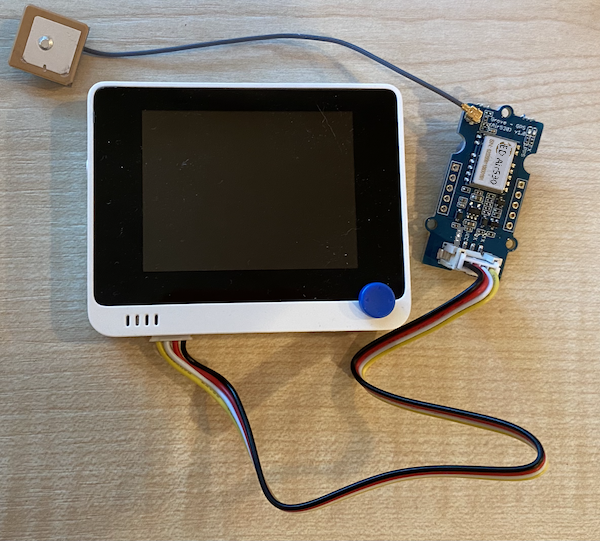

<!--
CO_OP_TRANSLATOR_METADATA:
{
  "original_hash": "da6ae0a795cf06be33d23ca5b8493fc8",
  "translation_date": "2025-10-11T11:57:07+00:00",
  "source_file": "3-transport/lessons/1-location-tracking/wio-terminal-gps-sensor.md",
  "language_code": "et"
}
-->
# Loe GPS-andmeid - Wio Terminal

Selles õppetunni osas lisate Wio Terminalile GPS-sensori ja loete sellelt väärtusi.

## Riistvara

Wio Terminal vajab GPS-sensorit.

Sensor, mida kasutate, on [Grove GPS Air530 sensor](https://www.seeedstudio.com/Grove-GPS-Air530-p-4584.html). See sensor suudab ühenduda mitme GPS-süsteemiga, et saada kiire ja täpne asukoha määramine. Sensor koosneb kahest osast - sensori elektroonikast ja välisest antennist, mis on ühendatud õhukese juhtmega, et satelliitidelt raadiolaineid vastu võtta.

See on UART-sensor, mis edastab GPS-andmeid UART-i kaudu.

### Ühendage GPS-sensor

Grove GPS-sensorit saab ühendada Wio Terminaliga.

#### Ülesanne - ühendage GPS-sensor

Ühendage GPS-sensor.



1. Sisestage Grove-kaabli üks ots GPS-sensori pistikusse. Kaabel läheb sisse ainult ühes suunas.

1. Kui Wio Terminal on arvutist või muust toiteallikast lahti ühendatud, ühendage Grove-kaabli teine ots Wio Terminali vasakpoolse Grove-pistikuga, vaadates ekraani. See pistik asub toitenupu lähedal.

    

1. Asetage GPS-sensor nii, et kinnitatud antennil oleks nähtavus taeva suunas - ideaalis avatud akna lähedal või väljas. Selgem signaal on kergemini saadav, kui antenni ees pole takistusi.

1. Nüüd saate Wio Terminali arvutiga ühendada.

1. GPS-sensoril on 2 LED-i - sinine LED, mis vilgub andmete edastamisel, ja roheline LED, mis vilgub iga sekund, kui satelliitidelt andmeid vastu võetakse. Veenduge, et sinine LED vilgub, kui Wio Terminal sisse lülitate. Mõne minuti pärast hakkab vilkuma roheline LED - kui ei, peate võib-olla antenni asukohta muutma.

## Programmeerige GPS-sensor

Nüüd saab Wio Terminali programmeerida kasutama ühendatud GPS-sensorit.

### Ülesanne - programmeerige GPS-sensor

Programmeerige seade.

1. Looge uus Wio Terminali projekt, kasutades PlatformIO-d. Nimetage see projektiks `gps-sensor`. Lisage kood `setup` funktsiooni, et konfigureerida serial port.

1. Lisage järgmine include-direktiiv `main.cpp` faili ülaossa. See sisaldab päisefaili, mis sisaldab funktsioone vasakpoolse Grove-pordi UART-i jaoks konfigureerimiseks.

    ```cpp
    #include <wiring_private.h>
    ```

1. Lisage selle alla järgmine koodirida, et deklareerida serial port ühendus UART-pordiga:

    ```cpp
    static Uart Serial3(&sercom3, PIN_WIRE_SCL, PIN_WIRE_SDA, SERCOM_RX_PAD_1, UART_TX_PAD_0);
    ```

1. Peate lisama koodi, et suunata mõned sisemised signaalikäsitlejad sellele serial portile. Lisage järgmine kood `Serial3` deklaratsiooni alla:

    ```cpp
    void SERCOM3_0_Handler()
    {
        Serial3.IrqHandler();
    }
    
    void SERCOM3_1_Handler()
    {
        Serial3.IrqHandler();
    }
    
    void SERCOM3_2_Handler()
    {
        Serial3.IrqHandler();
    }
    
    void SERCOM3_3_Handler()
    {
        Serial3.IrqHandler();
    }
    ```

1. `setup` funktsioonis, kus `Serial` port on konfigureeritud, konfigureerige UART serial port järgmise koodiga:

    ```cpp
    Serial3.begin(9600);

    while (!Serial3)
        ; // Wait for Serial3 to be ready

    delay(1000);
    ```

1. Lisage selle koodi alla `setup` funktsioonis järgmine kood, et ühendada Grove pin serial portiga:

    ```cpp
    pinPeripheral(PIN_WIRE_SCL, PIO_SERCOM_ALT);
    ```

1. Lisage järgmine funktsioon enne `loop` funktsiooni, et saata GPS-andmeid serial monitorile:

    ```cpp
    void printGPSData()
    {
        Serial.println(Serial3.readStringUntil('\n'));
    }
    ```

1. Lisage `loop` funktsiooni järgmine kood, et lugeda UART serial portist ja printida väljund serial monitorile:

    ```cpp
    while (Serial3.available() > 0)
    {
        printGPSData();
    }
    
    delay(1000);
    ```

    See kood loeb UART serial portist. Funktsioon `readStringUntil` loeb kuni lõpetaja märgini, antud juhul uue reani. See loeb terve NMEA lause (NMEA laused lõppevad uue rea märgiga). Kuni UART serial portist saab andmeid lugeda, loetakse need ja saadetakse serial monitorile funktsiooni `printGPSData` kaudu. Kui enam andmeid lugeda ei saa, viivitab `loop` 1 sekundi (1,000ms).

1. Koostage ja laadige kood Wio Terminali.

1. Kui kood on üles laaditud, saate GPS-andmeid jälgida serial monitori kaudu.

    ```output
    > Executing task: platformio device monitor <
    
    --- Available filters and text transformations: colorize, debug, default, direct, hexlify, log2file, nocontrol, printable, send_on_enter, time
    --- More details at http://bit.ly/pio-monitor-filters
    --- Miniterm on /dev/cu.usbmodem1201  9600,8,N,1 ---
    --- Quit: Ctrl+C | Menu: Ctrl+T | Help: Ctrl+T followed by Ctrl+H ---
    $GNGGA,020604.001,4738.538654,N,12208.341758,W,1,3,,164.7,M,-17.1,M,,*67
    $GPGSA,A,1,,,,,,,,,,,,,,,*1E
    $BDGSA,A,1,,,,,,,,,,,,,,,*0F
    $GPGSV,1,1,00*79
    $BDGSV,1,1,00*68
    ```

> 💁 Selle koodi leiate kaustast [code-gps/wio-terminal](../../../../../3-transport/lessons/1-location-tracking/code-gps/wio-terminal).

😀 Teie GPS-sensori programm õnnestus!

---

**Lahtiütlus**:  
See dokument on tõlgitud AI tõlketeenuse [Co-op Translator](https://github.com/Azure/co-op-translator) abil. Kuigi püüame tagada täpsust, palume arvestada, et automaatsed tõlked võivad sisaldada vigu või ebatäpsusi. Algne dokument selle algses keeles tuleks pidada autoriteetseks allikaks. Olulise teabe puhul soovitame kasutada professionaalset inimtõlget. Me ei vastuta selle tõlke kasutamisest tulenevate arusaamatuste või valesti tõlgenduste eest.