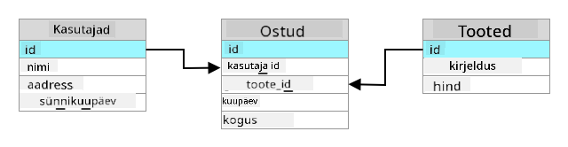
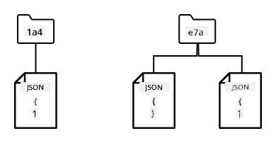
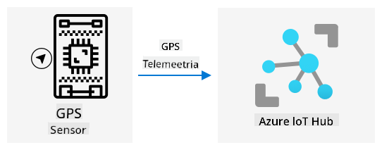
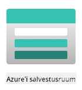
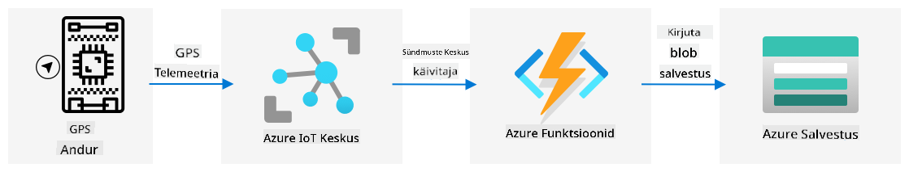

<!--
CO_OP_TRANSLATOR_METADATA:
{
  "original_hash": "e345843ccfeb7261d81500d19c64d476",
  "translation_date": "2025-10-11T12:04:37+00:00",
  "source_file": "3-transport/lessons/2-store-location-data/README.md",
  "language_code": "et"
}
-->
# Poe asukohaandmed


> Visandmärkmed: [Nitya Narasimhan](https://github.com/nitya). Klõpsake pildil, et näha suuremat versiooni.

## Eelloengu viktoriin

[Eelloengu viktoriin](https://black-meadow-040d15503.1.azurestaticapps.net/quiz/23)

## Sissejuhatus

Eelmises õppetunnis õppisite, kuidas kasutada GPS-andurit asukohaandmete kogumiseks. Selleks, et visualiseerida toiduga koormatud veoauto asukohta ja selle teekonda, tuleb andmed saata pilves asuvasse IoT-teenusesse ja seejärel kusagil salvestada.

Selles õppetunnis õpite erinevaid viise IoT-andmete salvestamiseks ning kuidas salvestada andmeid oma IoT-teenusest serverivaba koodi abil.

Selles õppetunnis käsitleme:

* [Struktureeritud ja struktureerimata andmed](../../../../../3-transport/lessons/2-store-location-data)
* [GPS-andmete saatmine IoT Hubi](../../../../../3-transport/lessons/2-store-location-data)
* [Kuumad, soojad ja külmad teed](../../../../../3-transport/lessons/2-store-location-data)
* [GPS-sündmuste käsitlemine serverivaba koodi abil](../../../../../3-transport/lessons/2-store-location-data)
* [Azure Storage Accounts](../../../../../3-transport/lessons/2-store-location-data)
* [Serverivaba koodi ühendamine salvestusega](../../../../../3-transport/lessons/2-store-location-data)

## Struktureeritud ja struktureerimata andmed

Arvutisüsteemid töötlevad andmeid, mis võivad olla väga erineva kuju ja suurusega. Need võivad ulatuda üksikutest numbritest suurte tekstimahudeni, videote ja piltideni ning IoT-andmeteni. Andmed jagunevad tavaliselt kahte kategooriasse - *struktureeritud* andmed ja *struktureerimata* andmed.

* **Struktureeritud andmed** on hästi määratletud, jäiga struktuuriga andmed, mis tavaliselt vastavad tabelitele ja nendevahelistele seostele. Näiteks inimese andmed, sealhulgas nimi, sünniaeg ja aadress.

* **Struktureerimata andmed** on andmed, millel puudub hästi määratletud, jäik struktuur ja mis võivad sageli struktuuri muuta. Näiteks dokumendid, nagu kirjutatud tekstid või arvutustabelid.

✅ Uurige: Kas oskate mõelda veel mõnele näitele struktureeritud ja struktureerimata andmetest?

> 💁 On olemas ka poolstruktureeritud andmed, mis on struktureeritud, kuid ei sobi fikseeritud tabelitesse.

IoT-andmeid peetakse tavaliselt struktureerimata andmeteks.

Kujutage ette, et lisate IoT-seadmeid suure kommertsfarmi sõidukiparki. Võiksite kasutada erinevaid seadmeid erinevat tüüpi sõidukite jaoks. Näiteks:

* Põllutöömasinate, nagu traktorite puhul, soovite GPS-andmeid, et tagada nende töö õigetel põldudel.
* Toiduainete ladudesse transportivate veokite puhul soovite GPS-andmeid, samuti kiiruse ja kiirenduse andmeid, et tagada ohutu sõitmine, ning juhi identiteedi ja tööaja andmeid, et järgida kohalikke tööseadusi.
* Külmutusveokite puhul soovite ka temperatuuriandmeid, et tagada toiduainete säilimine õiges temperatuuris.

Need andmed võivad pidevalt muutuda. Näiteks, kui IoT-seade asub veoki kabiinis, võivad saadetavad andmed muutuda vastavalt haagise tüübile, näiteks saates temperatuuriandmeid ainult külmutushaagise kasutamisel.

✅ Milliseid muid IoT-andmeid võiks koguda? Mõelge veokite koormatele ja hooldusandmetele.

Need andmed varieeruvad sõidukiti, kuid kõik saadetakse samasse IoT-teenusesse töötlemiseks. IoT-teenus peab suutma töödelda neid struktureerimata andmeid, salvestades neid viisil, mis võimaldab otsingut või analüüsi, kuid töötab erinevate andmestruktuuridega.

### SQL vs NoSQL salvestus

Andmebaasid on teenused, mis võimaldavad andmeid salvestada ja päringuid teha. Andmebaasid jagunevad kahte tüüpi - SQL ja NoSQL.

#### SQL andmebaasid

Esimesed andmebaasid olid relatsioonilised andmebaasid (RDBMS), mida tuntakse ka SQL-andmebaasidena, kuna need kasutavad struktureeritud päringukeelt (SQL) andmete lisamiseks, eemaldamiseks, uuendamiseks või pärimiseks. Need andmebaasid koosnevad skeemist - hästi määratletud tabelite kogumist, mis sarnanevad arvutustabelitega. Iga tabel sisaldab mitmeid nimega veerge. Andmete sisestamisel lisate tabelisse rea, pannes väärtused veergudesse. See hoiab andmed väga jäigas struktuuris - kuigi veerge võib jätta tühjaks, tuleb uue veeru lisamiseks andmebaasi muuta, täites olemasolevate ridade väärtused. Need andmebaasid on relatsioonilised - üks tabel võib olla seotud teisega.



Näiteks, kui salvestate kasutaja isiklikke andmeid tabelisse, oleks igal kasutajal mingi sisemine unikaalne ID, mida kasutatakse tabelis, mis sisaldab kasutaja nime ja aadressi. Kui soovite salvestada selle kasutaja kohta muid andmeid, näiteks tema oste, teises tabelis, oleks uues tabelis üks veerg selle kasutaja ID jaoks. Kui otsite kasutajat, saate tema ID abil hankida isiklikud andmed ühest tabelist ja ostud teisest.

SQL-andmebaasid sobivad ideaalselt struktureeritud andmete salvestamiseks ja tagamiseks, et andmed vastavad skeemile.

✅ Kui te pole varem SQL-i kasutanud, võtke hetk, et lugeda selle kohta [SQL-i lehelt Wikipedias](https://wikipedia.org/wiki/SQL).

Mõned tuntud SQL-andmebaasid on Microsoft SQL Server, MySQL ja PostgreSQL.

✅ Uurige: Lugege mõne neist SQL-andmebaasidest ja nende võimalustest.

#### NoSQL andmebaasid

NoSQL-andmebaasid on nimetatud NoSQL-iks, kuna neil puudub SQL-andmebaaside jäik struktuur. Neid tuntakse ka dokumentide andmebaasidena, kuna need suudavad salvestada struktureerimata andmeid, näiteks dokumente.

> 💁 Hoolimata nende nimest, võimaldavad mõned NoSQL-andmebaasid kasutada SQL-i andmete pärimiseks.



NoSQL-andmebaasidel puudub eelnevalt määratletud skeem, mis piiraks andmete salvestamist; selle asemel saate sisestada mis tahes struktureerimata andmeid, tavaliselt JSON-dokumentidena. Need dokumendid saab korraldada kaustadesse, sarnaselt failidele teie arvutis. Iga dokument võib sisaldada erinevaid välju võrreldes teiste dokumentidega - näiteks kui salvestate IoT-andmeid oma farmisõidukitest, võivad mõned sisaldada kiirendus- ja kiirusandmeid, teised aga haagise temperatuuriandmeid. Kui lisate uue veokitüübi, näiteks sisseehitatud kaaludega veoki, mis jälgib veetava toodangu kaalu, võib teie IoT-seade lisada selle uue välja ja see salvestatakse ilma andmebaasi muutmata.

Mõned tuntud NoSQL-andmebaasid on Azure CosmosDB, MongoDB ja CouchDB.

✅ Uurige: Lugege mõne neist NoSQL-andmebaasidest ja nende võimalustest.

Selles õppetunnis kasutate NoSQL-salvestust IoT-andmete salvestamiseks.

## GPS-andmete saatmine IoT Hubi

Eelmises õppetunnis kogusite GPS-andmeid GPS-andurilt, mis oli ühendatud teie IoT-seadmega. IoT-andmete pilves salvestamiseks peate need saatma IoT-teenusesse. Jällegi kasutate Azure IoT Hubi, sama IoT-pilveteenust, mida kasutasite eelmises projektis.



### Ülesanne - GPS-andmete saatmine IoT Hubi

1. Looge uus IoT Hub, kasutades tasuta taset.

    > ⚠️ Vajadusel saate viidata [juhistele IoT Hubi loomiseks projektist 2, õppetund 4](../../../2-farm/lessons/4-migrate-your-plant-to-the-cloud/README.md#create-an-iot-service-in-the-cloud).

    Looge uus ressursigrupp. Nimetage uus ressursigrupp `gps-sensor` ja uus IoT Hub unikaalse nimega, mis põhineb `gps-sensor`-il, näiteks `gps-sensor-<teie nimi>`.

    > 💁 Kui teil on endiselt IoT Hub eelmisest projektist, saate seda uuesti kasutada. Pidage meeles kasutada selle IoT Hubi nime ja ressursigrupi nime, milles see asub, kui loote muid teenuseid.

1. Lisage IoT Hubi uus seade. Nimetage see seade `gps-sensor`. Hankige seadme ühenduse string.

1. Uuendage oma seadme koodi, et saata GPS-andmed uude IoT Hubi, kasutades eelmises etapis saadud seadme ühenduse stringi.

    > ⚠️ Vajadusel saate viidata [juhistele seadme ühendamiseks IoT-teenusega projektist 2, õppetund 4](../../../2-farm/lessons/4-migrate-your-plant-to-the-cloud/README.md#connect-your-device-to-the-iot-service).

1. Saatke GPS-andmed JSON-vormingus järgmiselt:

    ```json
    {
        "gps" :
        {
            "lat" : <latitude>,
            "lon" : <longitude>
        }
    }
    ```

1. Saatke GPS-andmeid iga minut, et mitte ületada oma igapäevast sõnumite limiiti.

Kui kasutate Wio Terminali, pidage meeles lisada kõik vajalikud teegid ja seadistada aeg NTP-serveri abil. Teie kood peab samuti tagama, et see on lugenud kõik andmed jadapordist enne GPS-asukoha saatmist, kasutades eelmise õppetunni olemasolevat koodi. Kasutage JSON-dokumendi koostamiseks järgmist koodi:

```cpp
DynamicJsonDocument doc(1024);
doc["gps"]["lat"] = gps.location.lat();
doc["gps"]["lon"] = gps.location.lng();
```

Kui kasutate virtuaalset IoT-seadet, pidage meeles installida kõik vajalikud teegid virtuaalse keskkonna abil.

Nii Raspberry Pi kui ka virtuaalse IoT-seadme puhul kasutage eelmise õppetunni olemasolevat koodi, et saada laius- ja pikkuskraadi väärtused, ning saatke need õiges JSON-vormingus järgmise koodiga:

```python
message_json = { "gps" : { "lat":lat, "lon":lon } }
print("Sending telemetry", message_json)
message = Message(json.dumps(message_json))
```

> 💁 Selle koodi leiate kaustast [code/wio-terminal](../../../../../3-transport/lessons/2-store-location-data/code/wio-terminal), [code/pi](../../../../../3-transport/lessons/2-store-location-data/code/pi) või [code/virtual-device](../../../../../3-transport/lessons/2-store-location-data/code/virtual-device).

Käivitage oma seadme kood ja veenduge, et sõnumid voolavad IoT Hubi, kasutades CLI käsku `az iot hub monitor-events`.

## Kuumad, soojad ja külmad teed

IoT-seadmest pilve voolavaid andmeid ei töödelda alati reaalajas. Mõned andmed vajavad reaalajas töötlemist, teised andmed võivad olla töödeldud lühikese aja jooksul ja teised andmed võivad olla töödeldud palju hiljem. Andmete voolu erinevatesse teenustesse, mis töötlevad andmeid erinevatel aegadel, nimetatakse kuumadeks, soojadeks ja külmadeks teedeks.

### Kuum tee

Kuum tee viitab andmetele, mida tuleb töödelda reaalajas või peaaegu reaalajas. Kuuma tee andmeid kasutaksite hoiatuste jaoks, näiteks teavitused, et sõiduk läheneb depoole või et külmutusveoki temperatuur on liiga kõrge.

Kuuma tee andmete kasutamiseks reageeriks teie kood sündmustele kohe, kui need teie pilveteenustesse jõuavad.

### Soe tee

Soe tee viitab andmetele, mida saab töödelda lühikese aja jooksul pärast vastuvõtmist, näiteks aruandluseks või lühiajalisteks analüüsideks. Sooja tee andmeid kasutaksite igapäevaste aruannete jaoks sõiduki läbisõidu kohta, kasutades eelmise päeva andmeid.

Sooja tee andmed salvestatakse kohe pärast pilveteenusesse jõudmist mingisugusesse kiiresti ligipääsetavasse salvestusse.

### Külm tee

Külm tee viitab ajaloolistele andmetele, mis salvestatakse pikaajaliselt ja mida saab töödelda vajadusel. Näiteks võiksite kasutada külma tee andmeid, et saada aastaaruandeid sõidukite läbisõidu kohta või analüüsida marsruute, et leida kõige optimaalsem marsruut kütusekulude vähendamiseks.

Külma tee andmed salvestatakse andmeladudesse - andmebaasidesse, mis on mõeldud suurte muutumatute andmemahtude salvestamiseks ja mida saab kiiresti ja lihtsalt pärida. Tavaliselt oleks teie pilverakenduses regulaarne töö, mis käivituks iga päev, nädal või kuu, et liigutada andmeid sooja tee salvestusest andmelattu.

✅ Mõelge andmetele, mida olete seni nendes õppetundides kogunud. Kas need on kuuma, sooja või külma tee andmed?

## GPS-sündmuste käsitlemine serverivaba koodi abil

Kui andmed voolavad teie IoT Hubi, saate kirjutada serverivaba koodi, et kuulata sündmusi, mis avaldatakse Event-Hubiga ühilduval lõpp-punktil. See on soe tee - need andmed salvestatakse ja neid kasutatakse järgmises õppetunnis teekonna aruandluseks.


### Ülesanne - GPS-sündmuste käsitlemine serverivaba koodi abil

1. Looge Azure Functions rakendus, kasutades Azure Functions CLI-d. Kasutage Python runtime'i ja looge see kausta nimega `gps-trigger`, kasutades sama nime ka Functions App projekti nimeks. Veenduge, et loote selle jaoks virtuaalse keskkonna.

    > ⚠️ Vajadusel saate viidata [juhistele Azure Functions projekti loomiseks projektist 2, õppetund 5](../../../2-farm/lessons/5-migrate-application-to-the-cloud/README.md#create-a-serverless-application).

1. Lisage IoT Hubi sündmuste päästik, mis kasutab IoT Hubi Event Hubiga ühilduvat lõpp-punkti.
> ⚠️ Võid vajadusel viidata [juhistele IoT Hubi sündmuse käivitaja loomiseks projektist 2, õppetund 5](../../../2-farm/lessons/5-migrate-application-to-the-cloud/README.md#create-an-iot-hub-event-trigger).

1. Määra Event Hubi ühilduva lõpp-punkti ühenduse string `local.settings.json` failis ja kasuta selle kirje võtit `function.json` failis.

1. Kasuta Azurite rakendust kohaliku salvestuse emulaatorina.

1. Käivita oma funktsioonirakendus, et veenduda, et see saab sündmusi sinu GPS-seadmest. Veendu, et sinu IoT-seade töötab ja saadab GPS-andmeid.

    ```output
    Python EventHub trigger processed an event: {"gps": {"lat": 47.73481, "lon": -122.25701}}
    ```

## Azure'i salvestuskontod



Azure'i salvestuskontod on üldotstarbeline salvestusteenus, mis võimaldab andmeid salvestada mitmel erineval viisil. Sa saad andmeid salvestada blobidena, järjekordades, tabelites või failidena – ja seda kõike samaaegselt.

### Blob-salvestus

Sõna *Blob* tähendab binaarseid suuri objekte, kuid on muutunud terminiks igasuguse struktureerimata andmete kohta. Blob-salvestusse saab salvestada igasuguseid andmeid, alates IoT-andmeid sisaldavatest JSON-dokumentidest kuni piltide ja filmifailideni. Blob-salvestusel on *konteinerite* kontseptsioon – nimelised "ämbrid", kuhu saab andmeid salvestada, sarnaselt relatsioonilise andmebaasi tabelitele. Need konteinerid võivad sisaldada ühte või mitut kausta blobide salvestamiseks ning iga kaust võib sisaldada teisi kaustu, sarnaselt failide salvestamisele arvuti kõvakettal.

Selles õppetunnis kasutad blob-salvestust IoT-andmete salvestamiseks.

✅ Tee veidi uurimistööd: Loe [Azure Blob Storage](https://docs.microsoft.com/azure/storage/blobs/storage-blobs-overview?WT.mc_id=academic-17441-jabenn) kohta.

### Tabelisalvestus

Tabelisalvestus võimaldab salvestada poolstruktureeritud andmeid. Tabelisalvestus on tegelikult NoSQL-andmebaas, mis ei nõua ette määratud tabelite komplekti, kuid on mõeldud andmete salvestamiseks ühes või mitmes tabelis, kus iga rida määratletakse unikaalsete võtmetega.

✅ Tee veidi uurimistööd: Loe [Azure Table Storage](https://docs.microsoft.com/azure/storage/tables/table-storage-overview?WT.mc_id=academic-17441-jabenn) kohta.

### Järjekordade salvestus

Järjekordade salvestus võimaldab salvestada kuni 64KB suuruseid sõnumeid järjekorda. Sa saad lisada sõnumeid järjekorra lõppu ja lugeda neid järjekorra algusest. Järjekorrad salvestavad sõnumeid määramata ajaks, kuni salvestusruumi jätkub, võimaldades sõnumeid pikaajaliselt säilitada ja lugeda neid vajadusel. Näiteks, kui soovid igakuist tööülesannet GPS-andmete töötlemiseks, võid lisada andmeid järjekorda iga päev kuu jooksul ja seejärel kuu lõpus kõik sõnumid korraga töödelda.

✅ Tee veidi uurimistööd: Loe [Azure Queue Storage](https://docs.microsoft.com/azure/storage/queues/storage-queues-introduction?WT.mc_id=academic-17441-jabenn) kohta.

### Failisalvestus

Failisalvestus tähendab failide salvestamist pilves, kus rakendused või seadmed saavad ühenduda tööstusstandardite protokollide abil. Sa saad kirjutada faile failisalvestusse ja seejärel monteerida selle draivina oma arvutis või Macis.

✅ Tee veidi uurimistööd: Loe [Azure File Storage](https://docs.microsoft.com/azure/storage/files/storage-files-introduction?WT.mc_id=academic-17441-jabenn) kohta.

## Ühenda oma serverivaba kood salvestusega

Sinu funktsioonirakendus peab nüüd ühenduma blob-salvestusega, et salvestada IoT Hubi sõnumeid. Selleks on kaks võimalust:

* Funktsiooni koodi sees, ühenduda blob-salvestusega kasutades blob-salvestuse Python SDK-d ja kirjutada andmed blobidena.
* Kasutada väljundfunktsiooni sidumist, et siduda funktsiooni tagastusväärtus blob-salvestusega ja salvestada blob automaatselt.

Selles õppetunnis kasutad Python SDK-d, et näha, kuidas blob-salvestusega suhelda.



Andmed salvestatakse JSON-blobina järgmises formaadis:

```json
{
    "device_id": <device_id>,
    "timestamp" : <time>,
    "gps" :
    {
        "lat" : <latitude>,
        "lon" : <longitude>
    }
}
```

### Ülesanne - ühenda oma serverivaba kood salvestusega

1. Loo Azure'i salvestuskonto. Nimi võiks olla midagi sellist nagu `gps<su nimi>`.

    > ⚠️ Võid vajadusel viidata [juhistele salvestuskonto loomiseks projektist 2, õppetund 5](../../../2-farm/lessons/5-migrate-application-to-the-cloud/README.md#task---create-the-cloud-resources).

    Kui sul on eelmise projekti salvestuskonto alles, võid seda uuesti kasutada.

    > 💁 Sa saad kasutada sama salvestuskontot, et hiljem selles õppetunnis oma Azure Functions rakendus juurutada.

1. Käivita järgmine käsk, et saada salvestuskonto ühenduse string:

    ```sh
    az storage account show-connection-string --output table \
                                              --name <storage_name>
    ```

    Asenda `<storage_name>` salvestuskonto nimega, mille lõid eelmises etapis.

1. Lisa uus kirje `local.settings.json` failis oma salvestuskonto ühenduse stringi jaoks, kasutades eelmise sammu väärtust. Nimi võiks olla `STORAGE_CONNECTION_STRING`.

1. Lisa järgmine `requirements.txt` faili, et paigaldada Azure'i salvestuse Pip-paketid:

    ```sh
    azure-storage-blob
    ```

    Paigalda paketid sellest failist oma virtuaalsesse keskkonda.

    > Kui saad vea, uuenda oma Pip-versioon virtuaalses keskkonnas viimasele versioonile järgmise käsuga ja proovi uuesti:
    >
    > ```sh
    > pip install --upgrade pip
    > ```

1. Lisa `iot-hub-trigger` kausta `__init__.py` faili järgmised import-lauseid:

    ```python
    import json
    import os
    import uuid
    from azure.storage.blob import BlobServiceClient, PublicAccess
    ```

    `json` süsteemimoodulit kasutatakse JSON-i lugemiseks ja kirjutamiseks, `os` süsteemimoodulit kasutatakse ühenduse stringi lugemiseks, `uuid` süsteemimoodulit kasutatakse GPS-lugemise unikaalse ID loomiseks.

    `azure.storage.blob` pakett sisaldab Python SDK-d blob-salvestusega töötamiseks.

1. Lisa enne `main` meetodit järgmine abifunktsioon:

    ```python
    def get_or_create_container(name):
        connection_str = os.environ['STORAGE_CONNECTION_STRING']
        blob_service_client = BlobServiceClient.from_connection_string(connection_str)
    
        for container in blob_service_client.list_containers():
            if container.name == name:
                return blob_service_client.get_container_client(container.name)
        
        return blob_service_client.create_container(name, public_access=PublicAccess.Container)
    ```

    Python blob SDK-l ei ole abimeetodit konteineri loomiseks, kui seda ei eksisteeri. See kood laadib ühenduse stringi `local.settings.json` failist (või rakenduse seadistustest, kui see on pilve juurutatud), seejärel loob `BlobServiceClient` klassi, et suhelda blob-salvestuskontoga. Seejärel otsib see kõigi blob-salvestuskonto konteinerite hulgast, kas leidub konteiner antud nimega – kui leiab, tagastab see `ContainerClient` klassi, mis saab konteineriga suhelda, et luua blobid. Kui ei leia, luuakse uus konteiner ja tagastatakse kliendi klass uue konteineri jaoks.

    Kui uus konteiner luuakse, antakse avalik juurdepääs konteineris olevate blobide päringuteks. Seda kasutatakse järgmises õppetunnis GPS-andmete visualiseerimiseks kaardil.

1. Erinevalt mulla niiskusest, tahame selle koodiga salvestada iga sündmuse, seega lisa järgmine kood `for event in events:` tsükli sees `main` funktsioonis, logimise lause all:

    ```python
    device_id = event.iothub_metadata['connection-device-id']
    blob_name = f'{device_id}/{str(uuid.uuid1())}.json'
    ```

    See kood võtab seadme ID sündmuse metaandmetest ja kasutab seda blob-nime loomiseks. Blobid saab salvestada kaustadesse ja seadme ID-d kasutatakse kausta nimeks, nii et iga seadme GPS-sündmused salvestatakse ühte kausta. Blob-nimi koosneb sellest kaustast, millele järgneb dokumendi nimi, eraldatud kaldkriipsudega, sarnaselt Linuxi ja macOS-i radadele (sarnane ka Windowsile, kuid Windows kasutab tagurpidi kaldkriipsusid). Dokumendi nimi on unikaalne ID, mis on genereeritud Python `uuid` mooduli abil, failitüübiga `json`.

    Näiteks seadme ID `gps-sensor` puhul võib blob-nimi olla `gps-sensor/a9487ac2-b9cf-11eb-b5cd-1e00621e3648.json`.

1. Lisa järgmine kood selle alla:

    ```python
    container_client = get_or_create_container('gps-data')
    blob = container_client.get_blob_client(blob_name)
    ```

    See kood võtab konteineri kliendi `get_or_create_container` abiklassi abil ja seejärel blob-kliendi objekti blob-nime abil. Need blob-kliendid võivad viidata olemasolevatele blobidele või, nagu antud juhul, uutele blobidele.

1. Lisa järgmine kood pärast seda:

    ```python
    event_body = json.loads(event.get_body().decode('utf-8'))
    blob_body = {
        'device_id' : device_id,
        'timestamp' : event.iothub_metadata['enqueuedtime'],
        'gps': event_body['gps']
    }
    ```

    See koostab blob-sisu, mis kirjutatakse blob-salvestusse. See on JSON-dokument, mis sisaldab seadme ID-d, aega, millal telemeetria IoT Hubi saadeti, ja GPS-koordinaate telemeetriast.

    > 💁 Oluline on kasutada sõnumi järjekorda pandud aega, mitte praegust aega, et saada sõnumi saatmise aeg. Sõnum võib hubis oodata, kuni Functions rakendus tööle hakkab.

1. Lisa järgmine kood selle alla:

    ```python
    logging.info(f'Writing blob to {blob_name} - {blob_body}')
    blob.upload_blob(json.dumps(blob_body).encode('utf-8'))
    ```

    See kood logib, et blob on kirjutamisel koos selle detailidega, ja seejärel laadib blob-sisu uue blobina üles.

1. Käivita Functions rakendus. Näed, kuidas blobid kirjutatakse kõigi GPS-sündmuste jaoks väljundis:

    ```output
    [2021-05-21T01:31:14.325Z] Python EventHub trigger processed an event: {"gps": {"lat": 47.73092, "lon": -122.26206}}
    ...
    [2021-05-21T01:31:14.351Z] Writing blob to gps-sensor/4b6089fe-ba8d-11eb-bc7b-1e00621e3648.json - {'device_id': 'gps-sensor', 'timestamp': '2021-05-21T00:57:53.878Z', 'gps': {'lat': 47.73092, 'lon': -122.26206}}
    ```

    > 💁 Veendu, et IoT Hubi sündmuste monitor ei tööta samal ajal.

> 💁 Selle koodi leiad [code/functions](../../../../../3-transport/lessons/2-store-location-data/code/functions) kaustast.

### Ülesanne - kontrolli üleslaaditud blobisid

1. Blobide vaatamiseks saad kasutada kas [Azure Storage Explorer](https://azure.microsoft.com/features/storage-explorer/?WT.mc_id=academic-17441-jabenn), tasuta tööriista, mis võimaldab salvestuskontosid vaadata ja hallata, või CLI-d.

    1. CLI kasutamiseks vajad esmalt konto võtit. Käivita järgmine käsk, et saada see võti:

        ```sh
        az storage account keys list --output table \
                                     --account-name <storage_name>
        ```

        Asenda `<storage_name>` salvestuskonto nimega.

        Kopeeri `key1` väärtus.

    1. Käivita järgmine käsk, et loetleda konteineri blobid:

        ```sh
        az storage blob list --container-name gps-data \
                             --output table \
                             --account-name <storage_name> \
                             --account-key <key1>
        ```

        Asenda `<storage_name>` salvestuskonto nimega ja `<key1>` väärtusega, mille kopeerisid eelmisest sammust.

        See loetleb kõik konteineri blobid:

        ```output
        Name                                                  Blob Type    Blob Tier    Length    Content Type              Last Modified              Snapshot
        ----------------------------------------------------  -----------  -----------  --------  ------------------------  -------------------------  ----------
        gps-sensor/1810d55e-b9cf-11eb-9f5b-1e00621e3648.json  BlockBlob    Hot          45        application/octet-stream  2021-05-21T00:54:27+00:00
        gps-sensor/18293e46-b9cf-11eb-9f5b-1e00621e3648.json  BlockBlob    Hot          45        application/octet-stream  2021-05-21T00:54:28+00:00
        gps-sensor/1844549c-b9cf-11eb-9f5b-1e00621e3648.json  BlockBlob    Hot          45        application/octet-stream  2021-05-21T00:54:28+00:00
        gps-sensor/1894d714-b9cf-11eb-9f5b-1e00621e3648.json  BlockBlob    Hot          45        application/octet-stream  2021-05-21T00:54:28+00:00
        ```

    1. Laadi üks blob alla järgmise käsuga:

        ```sh
        az storage blob download --container-name gps-data \
                                 --account-name <storage_name> \
                                 --account-key <key1> \
                                 --name <blob_name> \
                                 --file <file_name>
        ```

        Asenda `<storage_name>` salvestuskonto nimega ja `<key1>` väärtusega, mille kopeerisid eelmisest sammust.

        Asenda `<blob_name>` täisnimega `Name` veerust eelmise sammu väljundis, sealhulgas kausta nimega. Asenda `<file_name>` kohaliku faili nimega, kuhu blob salvestada.

    Kui blob on alla laaditud, saad avada JSON-faili VS Code'is ja näed blobis GPS-asukoha detaile:

    ```json
    {"device_id": "gps-sensor", "timestamp": "2021-05-21T00:57:53.878Z", "gps": {"lat": 47.73092, "lon": -122.26206}}
    ```

### Ülesanne - juuruta oma Functions rakendus pilve

Kui sinu Functions rakendus töötab, saad selle pilve juurutada.

1. Loo uus Azure Functions rakendus, kasutades salvestuskontot, mille lõid varem. Nimi võiks olla midagi sellist nagu `gps-sensor-` ja lisa lõppu unikaalne identifikaator, näiteks juhuslikud sõnad või sinu nimi.

    > ⚠️ Võid vajadusel viidata [juhistele Functions rakenduse loomiseks projektist 2, õppetund 5](../../../2-farm/lessons/5-migrate-application-to-the-cloud/README.md#task---create-the-cloud-resources).

1. Laadi `IOT_HUB_CONNECTION_STRING` ja `STORAGE_CONNECTION_STRING` väärtused rakenduse seadistustesse.

    > ⚠️ Võid vajadusel viidata [juhistele rakenduse seadistuste üleslaadimiseks projektist 2, õppetund 5](../../../2-farm/lessons/5-migrate-application-to-the-cloud/README.md#task---upload-your-application-settings).

1. Juuruta oma kohalik Functions rakendus pilve.

    > ⚠️ Võid vajadusel viidata [juhistele Functions rakenduse juurutamiseks projektist 2, õppetund 5](../../../2-farm/lessons/5-migrate-application-to-the-cloud/README.md#task---deploy-your-functions-app-to-the-cloud).

---

## 🚀 Väljakutse

GPS-andmed ei ole täpsed ja tuvastatud asukohad võivad olla mõne meetri võrra nihkes, eriti tunnelites ja kõrgete hoonete piirkonnas.

Mõtle, kuidas satelliitnavigatsioon võiks seda probleemi lahendada? Milliseid andmeid sinu sat-nav omab, mis võimaldaks paremaid ennustusi sinu asukoha kohta?

## Loengu järgne viktoriin

[Loengu järgne viktoriin](https://black-meadow-040d15503.1.azurestaticapps.net/quiz/24)

## Ülevaade ja iseseisev õppimine

* Loe struktureeritud andmete kohta [Wikipedia andmemudeli lehelt](https://wikipedia.org/wiki/Data_model).
* Loe poolstruktureeritud andmete kohta [Wikipedia poolstruktureeritud andmete lehelt](https://wikipedia.org/wiki/Semi-structured_data).
* Loe struktureerimata andmete kohta [Wikipedia struktureerimata andmete lehelt](https://wikipedia.org/wiki/Unstructured_data).
* Lisateavet Azure Storage'i ja erinevate salvestustüüpide kohta leiate [Azure Storage'i dokumentatsioonist](https://docs.microsoft.com/azure/storage/?WT.mc_id=academic-17441-jabenn)

## Ülesanne

[Uurige funktsiooni sidumisi](assignment.md)

---

**Lahtiütlus**:  
See dokument on tõlgitud AI tõlketeenuse [Co-op Translator](https://github.com/Azure/co-op-translator) abil. Kuigi püüame tagada täpsust, palume arvestada, et automaatsed tõlked võivad sisaldada vigu või ebatäpsusi. Algne dokument selle algses keeles tuleks pidada autoriteetseks allikaks. Olulise teabe puhul soovitame kasutada professionaalset inimtõlget. Me ei vastuta selle tõlke kasutamisest tulenevate arusaamatuste või valesti tõlgenduste eest.