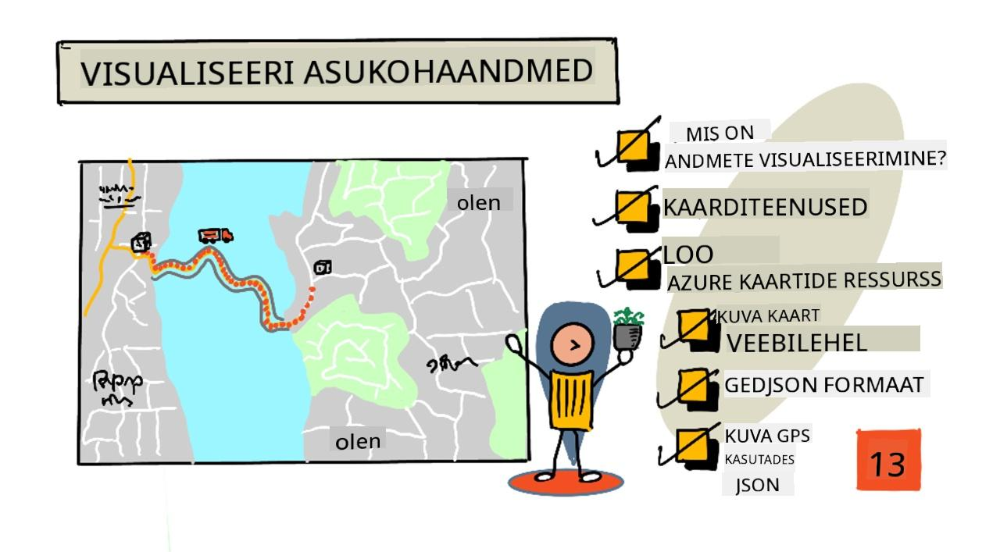
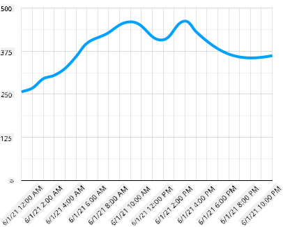
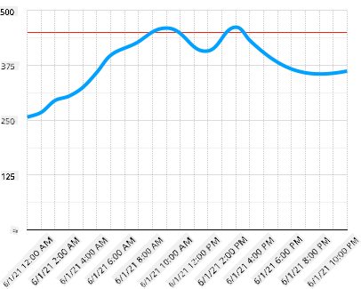
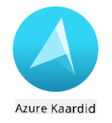
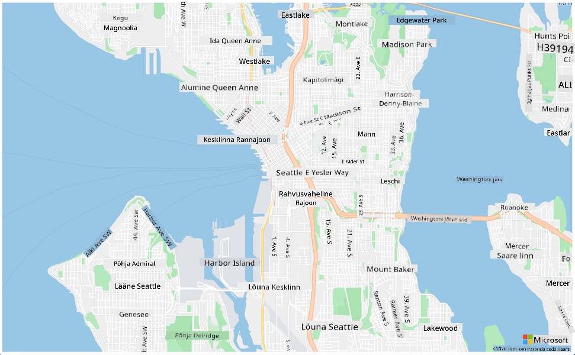

<!--
CO_OP_TRANSLATOR_METADATA:
{
  "original_hash": "9095c61445c2bca7245ef9b59a186a11",
  "translation_date": "2025-10-11T12:01:57+00:00",
  "source_file": "3-transport/lessons/3-visualize-location-data/README.md",
  "language_code": "et"
}
-->
# Visualiseeri asukohaandmeid



> Visuaalne ülevaade: [Nitya Narasimhan](https://github.com/nitya). Klõpsa pildil, et näha suuremat versiooni.

See video annab ülevaate Azure Mapsist koos IoT-ga, teenusest, mida käsitletakse selles õppetunnis.

[](https://www.youtube.com/watch?v=P5i2GFTtb2s)

> 🎥 Klõpsa ülaloleval pildil, et vaadata videot

## Eel-loengu viktoriin

[Eel-loengu viktoriin](https://black-meadow-040d15503.1.azurestaticapps.net/quiz/25)

## Sissejuhatus

Eelmises õppetunnis õppisid, kuidas saada GPS-andmeid oma sensoritelt ja salvestada need pilve salvestuskonteinerisse serverivaba koodi abil. Nüüd avastad, kuidas visualiseerida neid punkte Azure'i kaardil. Õpid, kuidas luua veebilehel kaarti, tutvud GeoJSON-andmeformaadiga ja kuidas seda kasutada kõigi salvestatud GPS-punktide kaardile kandmiseks.

Selles õppetunnis käsitleme:

* [Mis on andmete visualiseerimine](../../../../../3-transport/lessons/3-visualize-location-data)
* [Kaarditeenused](../../../../../3-transport/lessons/3-visualize-location-data)
* [Azure Maps ressursi loomine](../../../../../3-transport/lessons/3-visualize-location-data)
* [Kaardi kuvamine veebilehel](../../../../../3-transport/lessons/3-visualize-location-data)
* [GeoJSON formaat](../../../../../3-transport/lessons/3-visualize-location-data)
* [GPS-andmete kaardile kandmine GeoJSON-i abil](../../../../../3-transport/lessons/3-visualize-location-data)

> 💁 Selles õppetunnis kasutatakse veidi HTML-i ja JavaScripti. Kui soovid rohkem õppida veebiarenduse kohta HTML-i ja JavaScripti abil, vaata [Veebiarendus algajatele](https://github.com/microsoft/Web-Dev-For-Beginners).

## Mis on andmete visualiseerimine

Andmete visualiseerimine, nagu nimigi viitab, seisneb andmete kujutamises viisil, mis muudab need inimestele kergemini mõistetavaks. Tavaliselt seostatakse seda diagrammide ja graafikutega, kuid see hõlmab igasugust andmete pildilist esitamist, mis aitab inimestel andmeid paremini mõista ja otsuseid teha.

Lihtsa näitena - farmiprojektis salvestasid mulla niiskuse näidud. Tabel mulla niiskuse andmetega, mis on salvestatud iga tunni kohta 1. juunil 2021, võib välja näha järgmine:

| Kuupäev          | Näit    |
| ---------------- | ------: |
| 01/06/2021 00:00 |     257 |
| 01/06/2021 01:00 |     268 |
| 01/06/2021 02:00 |     295 |
| 01/06/2021 03:00 |     305 |
| 01/06/2021 04:00 |     325 |
| 01/06/2021 05:00 |     359 |
| 01/06/2021 06:00 |     398 |
| 01/06/2021 07:00 |     410 |
| 01/06/2021 08:00 |     429 |
| 01/06/2021 09:00 |     451 |
| 01/06/2021 10:00 |     460 |
| 01/06/2021 11:00 |     452 |
| 01/06/2021 12:00 |     420 |
| 01/06/2021 13:00 |     408 |
| 01/06/2021 14:00 |     431 |
| 01/06/2021 15:00 |     462 |
| 01/06/2021 16:00 |     432 |
| 01/06/2021 17:00 |     402 |
| 01/06/2021 18:00 |     387 |
| 01/06/2021 19:00 |     360 |
| 01/06/2021 20:00 |     358 |
| 01/06/2021 21:00 |     354 |
| 01/06/2021 22:00 |     356 |
| 01/06/2021 23:00 |     362 |

Inimesena võib sellise andmestiku mõistmine olla keeruline. See on lihtsalt numbrite sein ilma tähenduseta. Esimese sammuna selle andmestiku visualiseerimiseks saab selle kujutada joondiagrammil:



Seda saab veelgi täiustada, lisades joone, mis näitab, millal automaatne kastmissüsteem käivitati mulla niiskuse näidu 450 juures:



See diagramm näitab kiiresti mitte ainult mulla niiskuse tasemeid, vaid ka punkte, kus kastmissüsteem käivitati.

Diagrammid ei ole ainus vahend andmete visualiseerimiseks. IoT-seadmed, mis jälgivad ilma, võivad kasutada veebirakendusi või mobiilirakendusi, et visualiseerida ilmastikutingimusi sümbolite abil, näiteks pilvesümbol pilvise ilma jaoks, vihmapilv vihmase ilma jaoks jne. Andmete visualiseerimiseks on palju erinevaid viise, mõned tõsised, mõned lõbusad.

✅ Mõtle viisidele, kuidas oled näinud andmeid visualiseerituna. Millised meetodid on olnud kõige selgemad ja võimaldanud sul otsuseid kõige kiiremini teha?

Parimad visualiseeringud võimaldavad inimestel otsuseid kiiresti teha. Näiteks tööstusmasinate erinevate näitude sein täis mõõdikuid on raske mõista, kuid vilkuv punane tuli, kui midagi läheb valesti, võimaldab inimesel otsuse teha. Mõnikord on parim visualiseerimine vilkuv tuli!

GPS-andmetega töötamisel võib kõige selgem visualiseerimine olla andmete kaardile kandmine. Näiteks kaardil, mis näitab kohaletoimetamise veoautosid, saavad töötajad töötlemisettevõttes näha, millal autod saabuvad. Kui see kaart näitab rohkem kui lihtsalt veoautode pilte nende praegustes asukohtades, vaid annab aimu veoauto sisust, saavad töötajad tehases vastavalt planeerida - kui nad näevad lähedal külmutusveoautot, teavad nad, et peavad valmistama ruumi külmikus.

## Kaarditeenused

Kaartidega töötamine on huvitav ülesanne ja valikuid on palju, näiteks Bing Maps, Leaflet, Open Street Maps ja Google Maps. Selles õppetunnis õpid tundma [Azure Maps](https://azure.microsoft.com/services/azure-maps/?WT.mc_id=academic-17441-jabenn) ja kuidas need saavad kuvada sinu GPS-andmeid.



Azure Maps on "georuumiliste teenuste ja SDK-de kogum, mis kasutab värskeid kaardiandmeid, et pakkuda geograafilist konteksti veebirakendustele ja mobiilirakendustele." Arendajatele pakutakse tööriistu, et luua kauneid, interaktiivseid kaarte, mis suudavad teha asju nagu soovitada liiklusmarsruute, anda teavet liiklusõnnetuste kohta, siseruumide navigeerimine, otsinguvõimalused, kõrgusteave, ilmateenused ja palju muud.

✅ Katseta mõningaid [kaardikoodi näiteid](https://docs.microsoft.com/samples/browse?WT.mc_id=academic-17441-jabenn&products=azure-maps)

Kaardid saab kuvada tühja lõuendina, plaatidena, satelliidipiltidena, satelliidipiltidena koos teedega, erinevat tüüpi halltoonidega kaartidena, reljeefiga kaartidena, öövaate kaartidena ja kõrge kontrastsusega kaartidena. Reaalajas uuendusi kaartidel saab integreerida [Azure Event Gridiga](https://azure.microsoft.com/services/event-grid/?WT.mc_id=academic-17441-jabenn). Kaardi käitumist ja välimust saab kontrollida, lubades erinevaid juhtnuppe, mis võimaldavad kaardil reageerida sündmustele nagu näpistamine, lohistamine ja klõpsamine. Kaardi välimuse kontrollimiseks saab lisada kihte, mis sisaldavad mulli, jooni, polügoone, kuumakaarte ja palju muud. Millist kaardistiili rakendada, sõltub valitud SDK-st.

Azure Maps API-dele pääseb ligi, kasutades selle [REST API-d](https://docs.microsoft.com/javascript/api/azure-maps-rest/?WT.mc_id=academic-17441-jabenn&view=azure-maps-typescript-latest), [veebi SDK-d](https://docs.microsoft.com/azure/azure-maps/how-to-use-map-control?WT.mc_id=academic-17441-jabenn) või, kui ehitad mobiilirakendust, selle [Android SDK-d](https://docs.microsoft.com/azure/azure-maps/how-to-use-android-map-control-library?WT.mc_id=academic-17441-jabenn&pivots=programming-language-java-android).

Selles õppetunnis kasutad veebi SDK-d, et joonistada kaart ja kuvada oma sensori GPS-asukoha rada.

## Azure Maps ressursi loomine

Esimene samm on luua Azure Maps konto.

### Ülesanne - Azure Maps ressursi loomine

1. Käivita järgmine käsk oma terminalis või käsureal, et luua Azure Maps ressurss oma `gps-sensor` ressursigrupis:

    ```sh
    az maps account create --name gps-sensor \
                           --resource-group gps-sensor \
                           --accept-tos \
                           --sku S1
    ```

    See loob Azure Maps ressursi nimega `gps-sensor`. Kasutatav tase on `S1`, mis on tasuline tase, mis sisaldab mitmesuguseid funktsioone, kuid pakub heldet hulka tasuta kõnesid.

    > 💁 Azure Mapsi kasutamise kulude nägemiseks vaata [Azure Maps hinnakujunduse lehte](https://azure.microsoft.com/pricing/details/azure-maps/?WT.mc_id=academic-17441-jabenn).

1. Sul on vaja API-võtit kaardiresursi jaoks. Kasuta järgmist käsku, et saada see võti:

    ```sh
    az maps account keys list --name gps-sensor \
                              --resource-group gps-sensor \
                              --output table
    ```

    Kopeeri `PrimaryKey` väärtus.

## Kaardi kuvamine veebilehel

Nüüd saad astuda järgmise sammu, mis on kaardi kuvamine veebilehel. Kasutame ainult ühte `html` faili sinu väikese veebirakenduse jaoks; pea meeles, et tootmis- või meeskonnakeskkonnas on sinu veebirakendusel tõenäoliselt rohkem liikuvaid osi!

### Ülesanne - kaardi kuvamine veebilehel

1. Loo fail nimega index.html kaustas kuskil oma kohalikus arvutis. Lisa HTML-märgendid kaardi hoidmiseks:

    ```html
    <html>
    <head>
        <style>
            #myMap {
                width:100%;
                height:100%;
            }
        </style>
    </head>
    
    <body onload="init()">
        <div id="myMap"></div>
    </body>
    </html>
    ```

    Kaart laaditakse `myMap` `div`-i. Mõned stiilid võimaldavad sellel ulatuda lehe laiuse ja kõrguseni.

    > 🎓 `div` on veebilehe sektsioon, mida saab nimetada ja stiilida.

1. Ava `<head>` märgendi all väline stiilileht, et kontrollida kaardi kuvamist, ja väline skript veebi SDK-st, et hallata selle käitumist:

    ```html
    <link rel="stylesheet" href="https://atlas.microsoft.com/sdk/javascript/mapcontrol/2/atlas.min.css" type="text/css" />
    <script src="https://atlas.microsoft.com/sdk/javascript/mapcontrol/2/atlas.min.js"></script>
    ```

    See stiilileht sisaldab seadeid, kuidas kaart välja näeb, ja skriptifail sisaldab koodi kaardi laadimiseks. Selle koodi lisamine on sarnane C++ päisefailide lisamise või Python moodulite importimisega.

1. Lisa selle skripti alla skriptiplokk kaardi käivitamiseks.

    ```javascript
    <script type='text/javascript'>
        function init() {
            var map = new atlas.Map('myMap', {
                center: [-122.26473, 47.73444],
                zoom: 12,
                authOptions: {
                    authType: "subscriptionKey",
                    subscriptionKey: "<subscription_key>",

                }
            });
        }
    </script>
    ```

    Asenda `<subscription_key>` oma Azure Maps konto API-võtmega.

    Kui avad oma `index.html` lehe veebibrauseris, peaksid nägema kaarti, mis on keskendunud Seattle'i piirkonnale.

    

    ✅ Katseta suumi ja keskpunkti parameetreid, et muuta oma kaardi kuvamist. Saad lisada erinevaid koordinaate, mis vastavad sinu andmete laius- ja pikkuskraadile, et kaarti ümber keskendada.

> 💁 Parem viis veebirakendustega kohapeal töötamiseks on installida [http-server](https://www.npmjs.com/package/http-server). Sul on vaja [node.js](https://nodejs.org/) ja [npm](https://www.npmjs.com/) installitud enne selle tööriista kasutamist. Kui need tööriistad on installitud, saad navigeerida oma `index.html` faili asukohta ja sisestada `http-server`. Veebirakendus avaneb kohalikul veebiserveril [http://127.0.0.1:8080/](http://127.0.0.1:8080/).

## GeoJSON formaat

Nüüd, kui sul on oma veebirakendus paigas ja kaart kuvatakse, pead oma salvestuskontolt GPS-andmed välja võtma ja kuvama need markerite kihina kaardi peal. Enne seda vaatame [GeoJSON](https://wikipedia.org/wiki/GeoJSON) formaati, mida Azure Maps nõuab.

[GeoJSON](https://geojson.org/) on avatud standardiga JSON-spetsifikatsioon, millel on eriline vorming, mis on mõeldud geograafiliste andmete käsitlemiseks. Saad sellest õppida, testides näidisandmeid [geojson.io](https://geojson.io) abil, mis on samuti kasulik tööriist GeoJSON-failide silumiseks.

Näidis GeoJSON andmed näevad välja sellised:

```json
{
  "type": "FeatureCollection",
  "features": [
    {
      "type": "Feature",
      "geometry": {
        "type": "Point",
        "coordinates": [
          -2.10237979888916,
          57.164918677004714
        ]
      }
    }
  ]
}
```

Eriti huvitav on see, kuidas andmed on pesastatud `Feature`-na `FeatureCollection`-i sees. Selle objekti sees on `geometry` koos `coordinates`, mis näitavad laius- ja pikkuskraadi.

✅ GeoJSON-i koostamisel jälgi tähelepanelikult `latitude` ja `longitude` järjekorda objektis, vastasel juhul ei ilmu sinu punktid õigetesse kohtadesse! GeoJSON eeldab andmeid järjekorras `lon,lat` punktide jaoks, mitte `lat,lon`.
`Geometry` võib olla erinevat tüüpi, näiteks üksik punkt või polügoon. Selles näites on tegemist punktiga, millel on määratud kaks koordinaati: pikkuskraad ja laiuskraad.

✅ Azure Maps toetab standardset GeoJSON-i ning mõningaid [laiendatud funktsioone](https://docs.microsoft.com/azure/azure-maps/extend-geojson?WT.mc_id=academic-17441-jabenn), sealhulgas võimalust joonistada ringe ja muid geomeetrilisi kujundeid.

## GPS-andmete kaardile kuvamine GeoJSON-i abil

Nüüd olete valmis tarbima andmeid salvestusest, mille lõite eelmises õppetükis. Meeldetuletuseks: andmed on salvestatud mitme failina blob-salvestuses, seega peate failid alla laadima ja neid töötlema, et Azure Maps saaks andmeid kasutada.

### Ülesanne - seadista salvestus veebilehelt juurdepääsuks

Kui teete salvestusele päringu, et andmeid hankida, võite üllatusega näha oma brauseri konsoolis ilmnevaid vigu. See juhtub, kuna peate seadistama [CORS-i](https://developer.mozilla.org/docs/Web/HTTP/CORS) õigused, et lubada välistel veebirakendustel teie andmeid lugeda.

> 🎓 CORS tähendab "Cross-Origin Resource Sharing" ja tavaliselt tuleb see Azure'is turvakaalutlustel selgesõnaliselt seadistada. See takistab ootamatutel saitidel teie andmetele juurdepääsu.

1. Käivitage järgmine käsk, et CORS lubada:

    ```sh
    az storage cors add --methods GET \
                        --origins "*" \
                        --services b \
                        --account-name <storage_name> \
                        --account-key <key1>
    ```

    Asendage `<storage_name>` oma salvestuskonto nimega. Asendage `<key1>` oma salvestuskonto võtmega.

    See käsk lubab igal veebisaidil (metamärk `*` tähendab kõiki) teha *GET*-päringu, st andmeid hankida, teie salvestuskontolt. `--services b` tähendab, et see seadistus rakendatakse ainult blobidele.

### Ülesanne - GPS-andmete laadimine salvestusest

1. Asendage `init` funktsiooni kogu sisu järgmise koodiga:

    ```javascript
    fetch("https://<storage_name>.blob.core.windows.net/gps-data/?restype=container&comp=list")
        .then(response => response.text())
        .then(str => new window.DOMParser().parseFromString(str, "text/xml"))
        .then(xml => {
            let blobList = Array.from(xml.querySelectorAll("Url"));
                blobList.forEach(async blobUrl => {
                    loadJSON(blobUrl.innerHTML)                
        });
    })
    .then( response => {
        map = new atlas.Map('myMap', {
            center: [-122.26473, 47.73444],
            zoom: 14,
            authOptions: {
                authType: "subscriptionKey",
                subscriptionKey: "<subscription_key>",
    
            }
        });
        map.events.add('ready', function () {
            var source = new atlas.source.DataSource();
            map.sources.add(source);
            map.layers.add(new atlas.layer.BubbleLayer(source));
            source.add(features);
        })
    })
    ```

    Asendage `<storage_name>` oma salvestuskonto nimega. Asendage `<subscription_key>` oma Azure Mapsi API-võtmega.

    Siin toimub mitu asja. Esiteks, kood hangib teie GPS-andmed blob-konteinerist, kasutades URL-i, mis on koostatud teie salvestuskonto nime abil. See URL hangib `gps-data`, mis näitab, et ressursi tüüp on konteiner (`restype=container`), ja loetleb teavet kõigi blobide kohta. See loend ei tagasta blobide sisu, kuid tagastab URL-i iga blobi kohta, mida saab kasutada blobi andmete laadimiseks.

    > 💁 Saate selle URL-i sisestada oma brauserisse, et näha kõigi konteineri blobide üksikasju. Igal üksusel on `Url` atribuut, mida saate samuti brauseris avada, et näha blobi sisu.

    See kood laadib seejärel iga blobi, kutsudes `loadJSON` funktsiooni, mille loome järgmisena. Seejärel luuakse kaardikontroll ja lisatakse kood `ready` sündmusele. See sündmus käivitatakse, kui kaart kuvatakse veebilehel.

    `Ready` sündmus loob Azure Mapsi andmeallika - konteineri, mis sisaldab GeoJSON-andmeid, mida hiljem täiendatakse. See andmeallikas kasutatakse mullikihi loomiseks - see tähendab, et kaardile kuvatakse ringid, mis on keskendatud iga GeoJSON-i punkti ümber.

1. Lisage `loadJSON` funktsioon oma skriptiplokki, `init` funktsiooni alla:

    ```javascript
    var map, features;

    function loadJSON(file) {
        var xhr = new XMLHttpRequest();
        features = [];
        xhr.onreadystatechange = function () {
            if (xhr.readyState === XMLHttpRequest.DONE) {
                if (xhr.status === 200) {
                    gps = JSON.parse(xhr.responseText)
                    features.push(
                        new atlas.data.Feature(new atlas.data.Point([parseFloat(gps.gps.lon), parseFloat(gps.gps.lat)]))
                    )
                }
            }
        };
        xhr.open("GET", file, true);
        xhr.send();
    }    
    ```

    Seda funktsiooni kutsub fetch-rutiin, et JSON-andmeid läbi töötada ja need pikkus- ja laiuskraadide koordinaatidena GeoJSON-ina lugemiseks teisendada.
    Kui andmed on töödeldud, määratakse need GeoJSON-i `Feature` osana. Kaart algatatakse ja väikesed mullid ilmuvad teekonna ümber, mida teie andmed kaardil kujutavad:

1. Laadige HTML-leht oma brauserisse. See laadib kaardi, seejärel laadib kõik GPS-andmed salvestusest ja kuvab need kaardil.

    

> 💁 Selle koodi leiate [koodi](../../../../../3-transport/lessons/3-visualize-location-data/code) kaustast.

---

## 🚀 Väljakutse

On tore kuvada staatilisi andmeid kaardil markeritena. Kas saate täiustada seda veebirakendust, et lisada animatsioon ja näidata markerite teekonda aja jooksul, kasutades ajatemplit sisaldavaid JSON-faile? Siin on [mõned näited](https://azuremapscodesamples.azurewebsites.net/) animatsiooni kasutamisest kaartidel.

## Loengu järgne viktoriin

[Loengu järgne viktoriin](https://black-meadow-040d15503.1.azurestaticapps.net/quiz/26)

## Ülevaade ja iseseisev õppimine

Azure Maps on eriti kasulik IoT-seadmetega töötamisel.

* Uurige mõningaid kasutusvõimalusi [Azure Mapsi dokumentatsioonist Microsofti lehel](https://docs.microsoft.com/azure/azure-maps/tutorial-iot-hub-maps?WT.mc_id=academic-17441-jabenn).
* Süvendage oma teadmisi kaardistamise ja teekonnapunktide kohta [Azure Mapsi esimese teekonna leidmise rakenduse loomise iseseisva õppe mooduliga Microsoft Learnis](https://docs.microsoft.com/learn/modules/create-your-first-app-with-azure-maps/?WT.mc_id=academic-17441-jabenn).

## Ülesanne

[Paigaldage oma rakendus](assignment.md)

---

**Lahtiütlus**:  
See dokument on tõlgitud, kasutades AI tõlketeenust [Co-op Translator](https://github.com/Azure/co-op-translator). Kuigi püüame tagada täpsust, palun arvestage, et automaatsed tõlked võivad sisaldada vigu või ebatäpsusi. Algne dokument selle algses keeles tuleks lugeda autoriteetseks allikaks. Olulise teabe puhul on soovitatav kasutada professionaalset inimtõlget. Me ei vastuta selle tõlke kasutamisest tulenevate arusaamatuste või valede tõlgenduste eest.