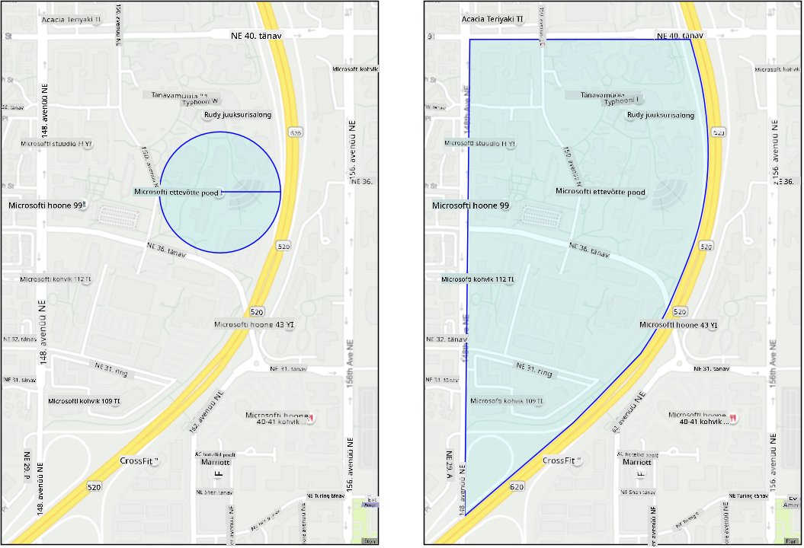
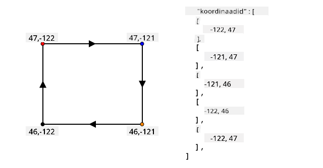
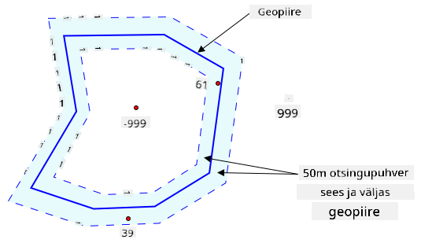
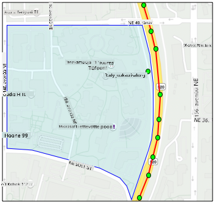
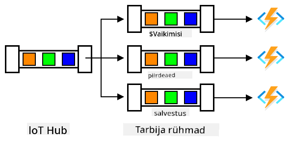

<!--
CO_OP_TRANSLATOR_METADATA:
{
  "original_hash": "078ae664c7b686bf069545e9a5fc95b2",
  "translation_date": "2025-10-11T11:55:25+00:00",
  "source_file": "3-transport/lessons/4-geofences/README.md",
  "language_code": "et"
}
-->
# Geopiirded


> Visuaal autorilt [Nitya Narasimhan](https://github.com/nitya). Klõpsa pildil, et näha suuremat versiooni.

See video annab ülevaate geopiiridest ja nende kasutamisest Azure Mapsis, teemadest, mida käsitletakse selles õppetunnis:

[](https://www.youtube.com/watch?v=nsrgYhaYNVY)

> 🎥 Klõpsa ülaloleval pildil, et vaadata videot

## Eeltest

[Eeltest](https://black-meadow-040d15503.1.azurestaticapps.net/quiz/27)

## Sissejuhatus

Viimase kolme õppetunni jooksul olete kasutanud IoT-d, et jälgida veoautosid, mis transpordivad teie farmist toodangut töötlemiskeskusesse. Olete kogunud GPS-andmeid, saatnud need pilve salvestamiseks ja visualiseerinud kaardil. Järgmine samm teie tarneahela efektiivsuse suurendamiseks on saada teavitus, kui veoauto on töötlemiskeskusele lähenemas, et mahalaadimismeeskond saaks olla valmis tõstukite ja muu varustusega kohe, kui sõiduk saabub. Nii saab mahalaadimine toimuda kiiresti ja te ei pea maksma veoauto ja juhi ooteaja eest.

Selles õppetunnis õpite geopiirdeid - määratletud geograafilisi piirkondi, nagu ala, mis jääb töötlemiskeskusest 2 km kaugusele, ja kuidas testida, kas GPS-koordinaadid jäävad geopiirde sisse või väljapoole, et näha, kas teie GPS-sensor on piirkonda jõudnud või sealt lahkunud.

Selles õppetunnis käsitleme:

* [Mis on geopiirded](../../../../../3-transport/lessons/4-geofences)
* [Geopiirde määratlemine](../../../../../3-transport/lessons/4-geofences)
* [Punktide testimine geopiirde vastu](../../../../../3-transport/lessons/4-geofences)
* [Geopiirete kasutamine serverivabas koodis](../../../../../3-transport/lessons/4-geofences)

> 🗑 See on selle projekti viimane õppetund, nii et pärast õppetunni ja ülesande lõpetamist ärge unustage oma pilveteenuseid puhastada. Teenuseid on vaja ülesande täitmiseks, seega veenduge, et olete selle esmalt lõpetanud.
>
> Vajadusel vaadake juhiseid [projekti puhastamise juhendist](../../../clean-up.md).

## Mis on geopiirded

Geopiire on virtuaalne perimeeter reaalse maailma geograafilise piirkonna jaoks. Geopiirded võivad olla ringid, mis on määratletud punktina ja raadiusena (näiteks 100m laiune ring hoone ümber), või polügoonid, mis katavad ala, nagu koolitsoon, linnapiirid või ülikooli või kontori kampus.



> 💁 Võimalik, et olete juba geopiirdeid kasutanud seda teadvustamata. Kui olete seadnud meeldetuletuse iOS-i meeldetuletuste rakenduses või Google Keepis asukoha põhjal, olete kasutanud geopiiret. Need rakendused loovad geopiirde antud asukoha põhjal ja teavitavad teid, kui teie telefon siseneb geopiirdesse.

Geopiirdeid on mitmel põhjusel kasulik kasutada, et teada saada, kas sõiduk on geopiirde sees või väljas:

* Mahalaadimise ettevalmistus - teavitus, et sõiduk on kohale jõudnud, võimaldab meeskonnal olla valmis sõidukit maha laadima, vähendades sõiduki ooteaega. See võimaldab juhil teha päevas rohkem tarnet vähem ooteajaga.
* Maksude järgimine - mõned riigid, nagu Uus-Meremaa, võtavad diiselautodelt teekasutustasu sõiduki kaalu alusel ainult avalikel teedel sõitmise eest. Geopiirdeid kasutades saab jälgida läbitud kilomeetreid avalikel teedel võrreldes erateedega, näiteks farmides või metsaraie aladel.
* Varguse jälgimine - kui sõiduk peaks jääma teatud piirkonda, näiteks farmi, ja lahkub geopiirdest, võib see olla varastatud.
* Asukoha järgimine - mõnes töökoha, farmi või tehase osas võib teatud sõidukitel olla keelatud liikuda, näiteks hoida kunstväetisi ja pestitsiide vedavaid sõidukeid eemal orgaanilist toodangut kasvatavatest põldudest. Kui geopiire on ületatud, on sõiduk väljaspool nõuetele vastavust ja juhti saab teavitada.

✅ Kas suudate mõelda teistele geopiirete kasutusviisidele?

Azure Maps, teenus, mida kasutasite eelmises õppetunnis GPS-andmete visualiseerimiseks, võimaldab teil määratleda geopiirdeid ja testida, kas punkt on geopiirde sees või väljas.

## Geopiirde määratlemine

Geopiirded määratletakse GeoJSON-i abil, samamoodi nagu punktid, mis lisati kaardile eelmises õppetunnis. Sel juhul ei ole tegemist `Point` väärtuste `FeatureCollection`-iga, vaid `Polygon`-i `FeatureCollection`-iga.

```json
{
   "type": "FeatureCollection",
   "features": [
     {
       "type": "Feature",
       "geometry": {
         "type": "Polygon",
         "coordinates": [
           [
             [
               -122.13393688201903,
               47.63829579223815
             ],
             [
               -122.13389128446579,
               47.63782047131512
             ],
             [
               -122.13240802288054,
               47.63783312249837
             ],
             [
               -122.13238388299942,
               47.63829037035086
             ],
             [
               -122.13393688201903,
               47.63829579223815
             ]
           ]
         ]
       },
       "properties": {
         "geometryId": "1"
       }
     }
   ]
}
```

Iga polügooni punkt määratletakse pikkus- ja laiuskraadi paarina massiivis ning need punktid on massiivis, mis on määratud `coordinates`-ina. Eelmises õppetunnis oli `Point`-i `coordinates` massiiv, mis sisaldas kahte väärtust, laius- ja pikkuskraadi, `Polygon`-i puhul on see massiiv massiividest, mis sisaldavad kahte väärtust, pikkus- ja laiuskraadi.

> 💁 Pea meeles, GeoJSON kasutab punktide jaoks `pikkuskraad, laiuskraad`, mitte `laiuskraad, pikkuskraad`.

Polügooni koordinaatide massiivis on alati üks kirje rohkem kui polügooni punktide arv, kus viimane kirje on sama mis esimene, sulgedes polügooni. Näiteks ristküliku puhul oleks 5 punkti.



Ülaloleval pildil on ristkülik. Polügooni koordinaadid algavad vasakult ülevalt 47,-122, liiguvad paremale 47,-121, siis alla 46,-121, siis vasakule 46,-122 ja lõpuks tagasi alguspunkti 47,-122. See annab polügoonile 5 punkti - vasak ülemine, parem ülemine, parem alumine, vasak alumine ja vasak ülemine, et see sulgeda.

✅ Proovi luua GeoJSON-polügoon oma kodu või kooli ümber. Kasuta tööriista nagu [GeoJSON.io](https://geojson.io/).

### Ülesanne - geopiirde määratlemine

Geopiirde kasutamiseks Azure Mapsis tuleb see esmalt üles laadida teie Azure Mapsi kontole. Kui see on üles laaditud, saate unikaalse ID, mida saate kasutada punkti testimiseks geopiirde vastu. Geopiirete üleslaadimiseks Azure Mapsi peate kasutama kaardi veebirakenduse API-d. Azure Mapsi veebirakenduse API-d saab kutsuda tööriista nimega [curl](https://curl.se) abil.

> 🎓 Curl on käsurea tööriist, millega saab teha päringuid veebipunktide vastu.

1. Kui kasutate Linuxi, macOS-i või Windows 10 uuemat versiooni, on curl tõenäoliselt juba installitud. Kontrollige seda, käivitades terminalis või käsureal järgmise käsu:

    ```sh
    curl --version
    ```

    Kui te ei näe curl-i versiooniteavet, peate selle installima [curl-i allalaadimislehelt](https://curl.se/download.html).

    > 💁 Kui olete kogenud Postmani kasutaja, võite soovi korral kasutada seda.

1. Looge GeoJSON-fail, mis sisaldab polügooni. Testite seda oma GPS-sensoriga, seega looge polügoon oma praeguse asukoha ümber. Saate selle luua käsitsi, redigeerides ülaltoodud GeoJSON-i näidet, või kasutada tööriista nagu [GeoJSON.io](https://geojson.io/).

    GeoJSON peab sisaldama `FeatureCollection`-i, mis sisaldab `Feature`-it, mille `geometry` tüüp on `Polygon`.

    Samuti **PEATE** lisama `properties`-elemendi samal tasemel kui `geometry`-element, ja see peab sisaldama `geometryId`-d:

    ```json
    "properties": {
        "geometryId": "1"
    }
    ```

    Kui kasutate [GeoJSON.io](https://geojson.io/), peate selle elemendi käsitsi lisama tühja `properties`-elemendi juurde, kas pärast JSON-faili allalaadimist või rakenduse JSON-redaktoris.

    See `geometryId` peab olema selles failis unikaalne. Võite üles laadida mitu geopiiret mitme `Feature`-ina `FeatureCollection`-is samas GeoJSON-failis, kui igaühel on erinev `geometryId`. Polügoonidel võib olla sama `geometryId`, kui need on üles laaditud erinevast failist erineval ajal.

1. Salvestage see fail nimega `geofence.json` ja navigeerige terminalis või konsoolis selle salvestuskohta.

1. Käivitage järgmine curl-käsk GeoFence'i loomiseks:

    ```sh
    curl --request POST 'https://atlas.microsoft.com/mapData/upload?api-version=1.0&dataFormat=geojson&subscription-key=<subscription_key>' \
         --header 'Content-Type: application/json' \
         --include \
         --data @geofence.json
    ```

    Asendage `<subscription_key>` URL-is oma Azure Mapsi konto API-võtmega.

    URL-i kasutatakse kaardiandmete üleslaadimiseks `https://atlas.microsoft.com/mapData/upload` API kaudu. Päring sisaldab `api-version`-parameetrit, et määrata, millist Azure Mapsi API-d kasutada; see võimaldab API-l aja jooksul muutuda, säilitades samal ajal tagurpidi ühilduvuse. Üleslaaditava andmeformaadi tüüp on määratud `geojson`.

    See käivitab POST-päringu üleslaadimise API-le ja tagastab vastuse päiste loendi, mis sisaldab päist nimega `location`.

    ```output
    content-type: application/json
    location: https://us.atlas.microsoft.com/mapData/operations/1560ced6-3a80-46f2-84b2-5b1531820eab?api-version=1.0
    x-ms-azuremaps-region: West US 2
    x-content-type-options: nosniff
    strict-transport-security: max-age=31536000; includeSubDomains
    x-cache: CONFIG_NOCACHE
    date: Sat, 22 May 2021 21:34:57 GMT
    content-length: 0
    ```

    > 🎓 Veebipunkti kutsumisel saate päringule parameetreid edastada, lisades `?`, millele järgneb võtme-väärtuse paarid kujul `key=value`, eraldades võtme-väärtuse paarid `&`-ga.

1. Azure Maps ei töötle seda kohe, seega peate kontrollima, kas üleslaadimistaotlus on lõpetatud, kasutades `location`-päises antud URL-i. Tehke GET-päring sellele asukohale, et näha olekut. Peate lisama oma tellimuse võtme `location`-URL-i lõppu, lisades `&subscription-key=<subscription_key>` URL-i lõppu, asendades `<subscription_key>` oma Azure Mapsi konto API-võtmega. Käivitage järgmine käsk:

    ```sh
    curl --request GET '<location>&subscription-key=<subscription_key>'
    ```

    Asendage `<location>` `location`-päise väärtusega ja `<subscription_key>` oma Azure Mapsi konto API-võtmega.

1. Kontrollige vastuses `status` väärtust. Kui see ei ole `Succeeded`, oodake minut ja proovige uuesti.

1. Kui olek tuleb tagasi kui `Succeeded`, vaadake vastusest `resourceLocation`-i. See sisaldab üksikasju GeoJSON-objekti unikaalse ID (tuntud kui UDID) kohta. UDID on väärtus pärast `metadata/`, kuid ei sisalda `api-version`. Näiteks kui `resourceLocation` oli:

    ```json
    {
      "resourceLocation": "https://us.atlas.microsoft.com/mapData/metadata/7c3776eb-da87-4c52-ae83-caadf980323a?api-version=1.0"
    }
    ```

    Siis oleks UDID `7c3776eb-da87-4c52-ae83-caadf980323a`.

    Hoidke selle UDID-i koopia, kuna vajate seda geopiirde testimiseks.

## Punktide testimine geopiirde vastu

Kui polügoon on Azure Mapsi üles laaditud, saate testida punkti, et näha, kas see on geopiirde sees või väljas. Seda tehakse veebirakenduse API-päringu abil, edastades geopiirde UDID-i ja testitava punkti laius- ja pikkuskraadi.

Selle päringu tegemisel saate edastada ka väärtuse nimega `searchBuffer`. See määrab, kui täpne peaks olema tulemuste tagastamine. Põhjus on selles, et GPS ei ole täiuslikult täpne ja mõnikord võivad asukohad olla meetrite võrra ebatäpsed. Otsingupuhvri vaikeväärtus on 50m, kuid saate määrata väärtusi vahemikus 0m kuni 500m.

Kui API-päringust tagastatakse tulemused, on üks osa tulemusest `distance`, mis mõõdetakse geopiirde serva lähima punktini, positiivse väärtusega, kui punkt on geopiirde väljas, ja negatiivsega, kui see on sees. Kui see kaugus on väiksem kui otsingupuhver, tagastatakse tegelik kaugus meetrites, vastasel juhul on väärtus 999 või -999. 999 tähendab, et punkt on geopiirde väljas rohkem kui otsingupuhvri võrra, -999 tähendab, et see on geopiirde sees rohkem kui otsingupuhvri võrra.



Ülaloleval pildil on geopiire koos 50m otsingupuhvriga.

* Punkt geopiirde keskel, hästi otsingupuhvri sees, on kaugusega **-999**
* Punkt hästi otsingupuhvri väljas on kaugusega **999**
* Punkt geopiirde sees ja otsingupuhvri sees, 6m kaugusel geopiirdest, on kaugusega **6m**
* Punkt geopiirde väljas ja otsingupuhvri sees, 39m kaugusel geopiirdest, on kaugusega **39m**

Oluline on teada kaugust geopiirde servani ja kombineerida see muu teabega, nagu teised GPS-i näidud, kiirus ja teede andmed, kui tehakse otsuseid sõiduki asukoha põhjal.

Näiteks kujutage ette GPS-i näiteid, mis näitavad, et sõiduk sõidab mööda teed, mis kulgeb geopiirde kõrval. Kui üksik GPS-i väärtus on ebatäpne ja paigutab sõiduki geopiirde sisse, kuigi seal ei ole sõidukile juurdepääsu, siis võib selle ignoreerida.


Ülaloleval pildil on geopiire, mis katab osa Microsofti kampusest. Punane joon näitab veoauto liikumist mööda 520 maanteed, kus ringid tähistavad GPS-i lugemisi. Enamik neist on täpsed ja jäävad 520 maantee piiridesse, kuid üks ebatäpne lugemine asub geopiirde sees. See lugemine ei saa olla õige – ei ole teid, mille kaudu veoauto saaks äkitselt 520 maanteelt kampusele pöörata ja siis tagasi 520 maanteele. Geopiirde kontrollimiseks mõeldud kood peab arvestama varasemaid lugemisi enne, kui tegutseb geopiirde testi tulemuste põhjal.

✅ Milliseid lisanduvaid andmeid oleks vaja kontrollida, et GPS-i lugemist saaks pidada korrektseks?

### Ülesanne - punktide testimine geopiirde vastu

1. Alusta veebirakenduse API päringu URL-i koostamisest. Formaat on järgmine:

    ```output
    https://atlas.microsoft.com/spatial/geofence/json?api-version=1.0&deviceId=gps-sensor&subscription-key=<subscription-key>&udid=<UDID>&lat=<lat>&lon=<lon>
    ```

    Asenda `<subscription_key>` oma Azure Mapsi konto API võtmega.

    Asenda `<UDID>` geopiirde UDID-ga, mis saadi eelmisest ülesandest.

    Asenda `<lat>` ja `<lon>` testitava punkti laius- ja pikkuskraadiga.

    See URL kasutab `https://atlas.microsoft.com/spatial/geofence/json` API-d, et pärida GeoJSON-i abil määratletud geopiiret. See sihib `1.0` API versiooni. `deviceId` parameeter on kohustuslik ja peaks olema seadme nimi, millelt laius- ja pikkuskraad pärinevad.

    Vaikimisi otsingupuhver on 50m, mida saab muuta, lisades täiendava parameetri `searchBuffer=<distance>`, kus `<distance>` on otsingupuhvri kaugus meetrites, vahemikus 0 kuni 500.

1. Kasuta curl-i, et teha GET-päring sellele URL-ile:

    ```sh
    curl --request GET '<URL>'
    ```

    > 💁 Kui saad vastuseks `BadRequest` koodiga vea:
    >
    > ```output
    > Invalid GeoJSON: All feature properties should contain a geometryId, which is used for identifying the geofence.
    > ```
    >
    > siis sinu GeoJSON-ist puudub `properties` sektsioon koos `geometryId`-ga. Pead GeoJSON-i parandama ja kordama ülaltoodud samme, et uuesti üles laadida ja saada uus UDID.

1. Vastus sisaldab `geometries` loendit, kus iga GeoJSON-is määratletud polügooni kohta on üks geomeetria. Igal geomeetrial on 3 huvipakkuvat välja: `distance`, `nearestLat` ja `nearestLon`.

    ```output
    {
        "geometries": [
            {
                "deviceId": "gps-sensor",
                "udId": "7c3776eb-da87-4c52-ae83-caadf980323a",
                "geometryId": "1",
                "distance": 999.0,
                "nearestLat": 47.645875,
                "nearestLon": -122.142713
            }
        ],
        "expiredGeofenceGeometryId": [],
        "invalidPeriodGeofenceGeometryId": []
    }
    ```

    * `nearestLat` ja `nearestLon` on geopiirde serva punkti laius- ja pikkuskraad, mis on testitavale asukohale kõige lähemal.

    * `distance` on kaugus testitavast asukohast geopiirde serva lähimasse punkti. Negatiivsed väärtused tähendavad, et punkt on geopiirde sees, positiivsed väljaspool. See väärtus on väiksem kui 50 (vaikimisi otsingupuhver) või 999.

1. Korda seda mitu korda asukohtadega, mis asuvad geopiirde sees ja väljas.

## Geopiirete kasutamine serverivabas koodis

Nüüd saad lisada uue triggeri oma Functions rakendusse, et testida IoT Hubi GPS-i sündmuse andmeid geopiirde vastu.

### Tarbijarühmad

Nagu mäletad eelmistest õppetundidest, võimaldab IoT Hub taasesitada sündmusi, mis on hubi poolt vastu võetud, kuid mitte töödeldud. Aga mis juhtub, kui ühendatakse mitu triggerit? Kuidas teab süsteem, millised sündmused on töödeldud?

Vastus on, et see ei tea! Selle asemel saad määratleda mitu eraldi ühendust, et lugeda sündmusi, ja igaüks neist saab hallata lugemata sõnumite taasesitamist. Neid nimetatakse *tarbijarühmadeks*. Kui ühendad lõpp-punktiga, saad määrata, millise tarbijarühmaga soovid ühenduda. Iga rakenduse komponent ühendub erineva tarbijarühmaga.



Teoreetiliselt saab iga tarbijarühmaga ühendada kuni 5 rakendust, ja kõik saavad sõnumeid, kui need saabuvad. Parim praktika on, et iga tarbijarühma kasutaks ainult üks rakendus, et vältida sõnumite dubleerimist ja tagada, et taaskäivitamisel töödeldakse kõik järjekorras olevad sõnumid korrektselt. Näiteks, kui käivitad oma Functions rakenduse lokaalselt ja pilves samaaegselt, töötlevad mõlemad sõnumeid, mis viib dubleeritud blobide salvestamiseni salvestuskontole.

Kui vaatad IoT Hub triggeri `function.json` faili, mille lõid varasemas õppetunnis, näed tarbijarühma sündmuste hubi triggeri sidumise sektsioonis:

```json
"consumerGroup": "$Default"
```

Kui lood IoT Hubi, saad vaikimisi loodud `$Default` tarbijarühma. Kui soovid lisada täiendava triggeri, saad selle lisada uue tarbijarühma abil.

> 💁 Selles õppetunnis kasutad geopiirde testimiseks erinevat funktsiooni kui GPS-i andmete salvestamiseks. See näitab, kuidas kasutada tarbijarühmi ja eraldada koodi, et muuta see loetavamaks ja arusaadavamaks. Tootmisrakenduses on palju viise, kuidas seda arhitektuuriliselt lahendada – panna mõlemad ühte funktsiooni, kasutada salvestuskonto triggerit, et käivitada funktsioon geopiirde kontrollimiseks, või kasutada mitut funktsiooni. Ei ole ühte "õiget viisi", see sõltub sinu rakenduse ülejäänud osadest ja vajadustest.

### Ülesanne - loo uus tarbijarühm

1. Käivita järgmine käsk, et luua uus tarbijarühm nimega `geofence` oma IoT Hubi jaoks:

    ```sh
    az iot hub consumer-group create --name geofence \
                                     --hub-name <hub_name>
    ```

    Asenda `<hub_name>` nimega, mida kasutasid oma IoT Hubi jaoks.

1. Kui soovid näha kõiki tarbijarühmi oma IoT Hubi jaoks, käivita järgmine käsk:

    ```sh
    az iot hub consumer-group list --output table \
                                   --hub-name <hub_name>
    ```

    Asenda `<hub_name>` nimega, mida kasutasid oma IoT Hubi jaoks. See loetleb kõik tarbijarühmad.

    ```output
    Name      ResourceGroup
    --------  ---------------
    $Default  gps-sensor
    geofence  gps-sensor
    ```

> 💁 Kui käivitasid IoT Hubi sündmuste monitori varasemas õppetunnis, see ühendas `$Default` tarbijarühmaga. Seetõttu ei saa käivitada sündmuste monitori ja sündmuste triggerit samaaegselt. Kui soovid käivitada mõlemad, saad kasutada teisi tarbijarühmi kõigi oma Functions rakenduste jaoks ja hoida `$Default` sündmuste monitori jaoks.

### Ülesanne - loo uus IoT Hub trigger

1. Lisa uus IoT Hubi sündmuste trigger oma `gps-trigger` funktsiooni rakendusse, mille lõid varasemas õppetunnis. Nimeta see funktsioon `geofence-trigger`.

    > ⚠️ Viited [IoT Hubi sündmuste triggeri loomise juhistele projektist 2, õppetund 5](../../../2-farm/lessons/5-migrate-application-to-the-cloud/README.md#create-an-iot-hub-event-trigger).

1. Konfigureeri IoT Hubi ühenduse string `function.json` failis. `local.settings.json` jagatakse kõigi triggerite vahel Functions rakenduses.

1. Uuenda `consumerGroup` väärtust `function.json` failis, et viidata uuele `geofence` tarbijarühmale:

    ```json
    "consumerGroup": "geofence"
    ```

1. Sul on vaja oma Azure Mapsi konto tellimusvõtit selles triggeris, seega lisa uus kirje `local.settings.json` faili nimega `MAPS_KEY`.

1. Käivita Functions rakendus, et veenduda, et see ühendub ja töötleb sõnumeid. Varasemast õppetunnist pärit `iot-hub-trigger` käivitub samuti ja laadib blobid salvestusse.

    > GPS-i lugemiste dubleerimise vältimiseks blobide salvestuses saad peatada Functions rakenduse, mis sul pilves töötab. Selleks kasuta järgmist käsku:
    >
    > ```sh
    > az functionapp stop --resource-group gps-sensor \
    >                     --name <functions_app_name>
    > ```
    >
    > Asenda `<functions_app_name>` nimega, mida kasutasid oma Functions rakenduse jaoks.
    >
    > Saad selle hiljem uuesti käivitada järgmise käsuga:
    >
    > ```sh
    > az functionapp start --resource-group gps-sensor \
    >                     --name <functions_app_name>
    > ```
    >
    > Asenda `<functions_app_name>` nimega, mida kasutasid oma Functions rakenduse jaoks.

### Ülesanne - testi geopiiret triggerist

Varasemas õppetunnis kasutasid curl-i, et pärida geopiiret ja kontrollida, kas punkt asub sees või väljas. Saad teha sarnase veebipäringu oma triggeri sees.

1. Geopiirde pärimiseks vajad selle UDID-d. Lisa uus kirje `local.settings.json` faili nimega `GEOFENCE_UDID` selle väärtusega.

1. Ava `__init__.py` fail uues `geofence-trigger` triggeris.

1. Lisa järgmine import faili algusesse:

    ```python
    import json
    import os
    import requests
    ```

    `requests` pakett võimaldab teha veebirakenduse API päringuid. Azure Mapsil ei ole Python SDK-d, seega pead tegema veebirakenduse API päringuid, et seda Python koodist kasutada.

1. Lisa järgmised 2 rida `main` meetodi algusesse, et saada Mapsi tellimusvõti:

    ```python
    maps_key = os.environ['MAPS_KEY']
    geofence_udid = os.environ['GEOFENCE_UDID']    
    ```

1. `for event in events` tsükli sees lisa järgmine kood, et saada iga sündmuse laius- ja pikkuskraad:

    ```python
    event_body = json.loads(event.get_body().decode('utf-8'))
    lat = event_body['gps']['lat']
    lon = event_body['gps']['lon']
    ```

    See kood teisendab sündmuse keha JSON-i sõnastikuks ja eraldab `lat` ja `lon` `gps` väljast.

1. `requests` kasutamisel, selle asemel et koostada pikk URL nagu curl-iga, saad kasutada ainult URL-i osa ja edastada parameetrid sõnastikuna. Lisa järgmine kood, et määratleda URL ja konfigureerida parameetrid:

    ```python
    url = 'https://atlas.microsoft.com/spatial/geofence/json'

    params = {
        'api-version': 1.0,
        'deviceId': 'gps-sensor',
        'subscription-key': maps_key,
        'udid' : geofence_udid,
        'lat' : lat,
        'lon' : lon
    }
    ```

    `params` sõnastiku elemendid vastavad võtme-väärtuse paaridele, mida kasutasid veebirakenduse API päringus curl-i kaudu.

1. Lisa järgmised koodiread, et teha veebirakenduse API päring:

    ```python
    response = requests.get(url, params=params)
    response_body = json.loads(response.text)
    ```

    See kutsub URL-i parameetritega ja saab vastuseks vastuse objekti.

1. Lisa sellele alla järgmine kood:

    ```python
    distance = response_body['geometries'][0]['distance']

    if distance == 999:
        logging.info('Point is outside geofence')
    elif distance > 0:
        logging.info(f'Point is just outside geofence by a distance of {distance}m')
    elif distance == -999:
        logging.info(f'Point is inside geofence')
    else:
        logging.info(f'Point is just inside geofence by a distance of {distance}m')
    ```

    See kood eeldab ühte geomeetriat ja eraldab kauguse sellest ühest geomeetriast. Seejärel logib erinevaid sõnumeid sõltuvalt kaugusest.

1. Käivita see kood. Logi väljundis näed, kas GPS-i koordinaadid asuvad geopiirde sees või väljas, koos kaugusega, kui punkt on 50m raadiuses. Proovi seda koodi erinevate geopiiretega, lähtudes GPS-i sensori asukohast, proovi sensori liigutamist (näiteks mobiiltelefoni WiFi kaudu või virtuaalse IoT seadme erinevate koordinaatidega), et näha muutusi.

1. Kui oled valmis, laadi see kood üles oma Functions rakendusse pilves. Ära unusta uusi rakenduse seadeid üles laadida.

    > ⚠️ Viited [rakenduse seadete üleslaadimise juhistele projektist 2, õppetund 5](../../../2-farm/lessons/5-migrate-application-to-the-cloud/README.md#task---upload-your-application-settings).

    > ⚠️ Viited [Functions rakenduse üleslaadimise juhistele projektist 2, õppetund 5](../../../2-farm/lessons/5-migrate-application-to-the-cloud/README.md#task---deploy-your-functions-app-to-the-cloud).

> 💁 Selle koodi leiad [code/functions](../../../../../3-transport/lessons/4-geofences/code/functions) kaustast.

---

## 🚀 Väljakutse

Selles õppetunnis lisasid ühe geopiirde, kasutades GeoJSON faili ühe polügooniga. Saad üles laadida mitu polügooni korraga, kui neil on `properties` sektsioonis erinevad `geometryId` väärtused.

Proovi üles laadida GeoJSON fail mitme polügooniga ja kohanda oma koodi, et leida, millisele polügoonile GPS-i koordinaadid on kõige lähemal või milles need asuvad.

## Loengu järgne viktoriin

[Loengu järgne viktoriin](https://black-meadow-040d15503.1.azurestaticapps.net/quiz/28)

## Ülevaade ja iseseisev õppimine

* Loe rohkem geopiirete ja nende kasutusjuhtude kohta [Geopiirete lehelt Wikipedias](https://en.wikipedia.org/wiki/Geo-fence).
* Loe rohkem Azure Mapsi geopiirete API kohta [Microsoft Azure Maps Spatial - Get Geofence dokumentatsioonist](https://docs.microsoft.com/rest/api/maps/spatial/getgeofence?WT.mc_id=academic-17441-jabenn).
* Loe rohkem tarbijarühmade kohta [Azure Event Hubi funktsioonide ja terminoloogia dokumentatsioonist Microsofti lehel](https://docs.microsoft.com/azure/event-hubs/event-hubs-features?WT.mc_id=academic-17441-jabenn#event-consumers).

## Ülesanne

[Saada teavitusi Twilio abil](assignment.md)

---

**Lahtiütlus**:  
See dokument on tõlgitud AI tõlketeenuse [Co-op Translator](https://github.com/Azure/co-op-translator) abil. Kuigi püüame tagada täpsust, palume arvestada, et automaatsed tõlked võivad sisaldada vigu või ebatäpsusi. Algne dokument selle algses keeles tuleks pidada autoriteetseks allikaks. Olulise teabe puhul soovitame kasutada professionaalset inimtõlget. Me ei vastuta selle tõlke kasutamisest tulenevate arusaamatuste või valesti tõlgenduste eest.