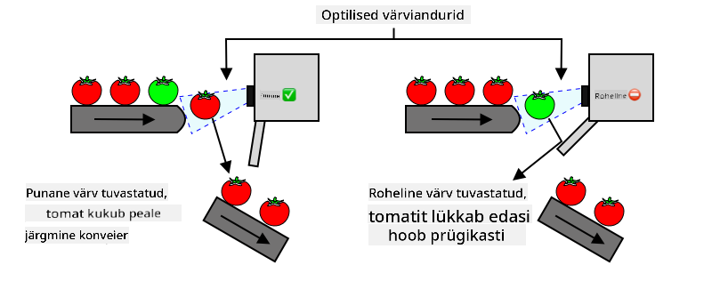
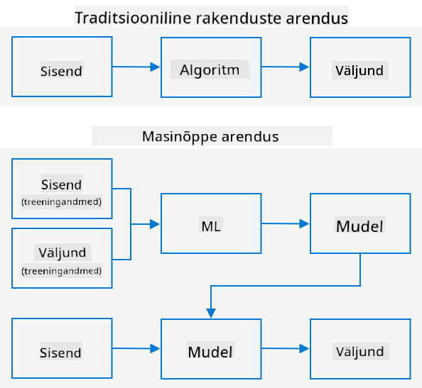
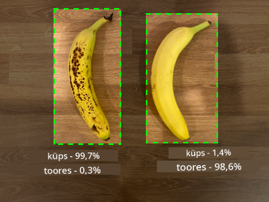
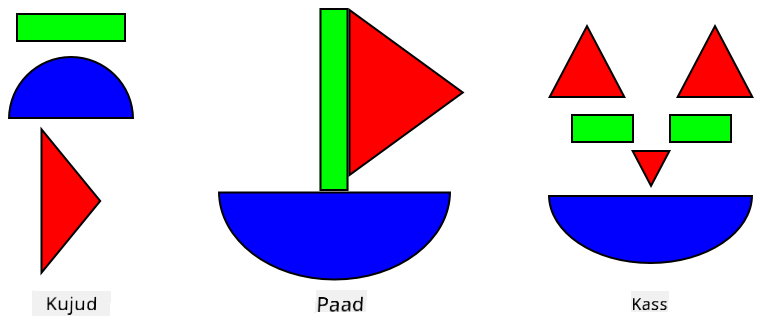
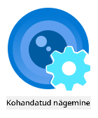
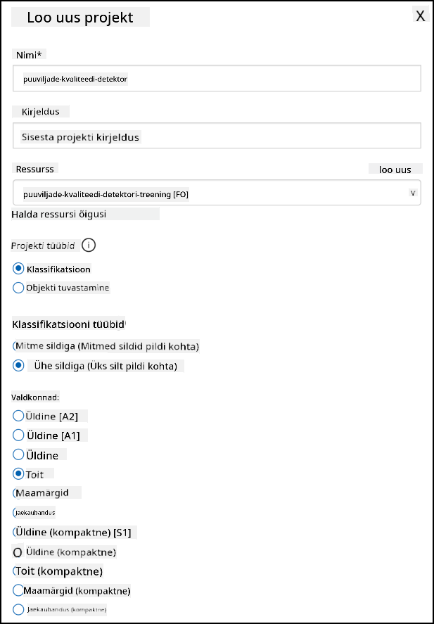
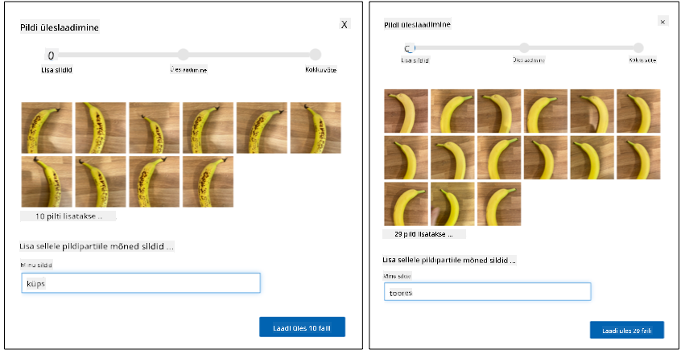
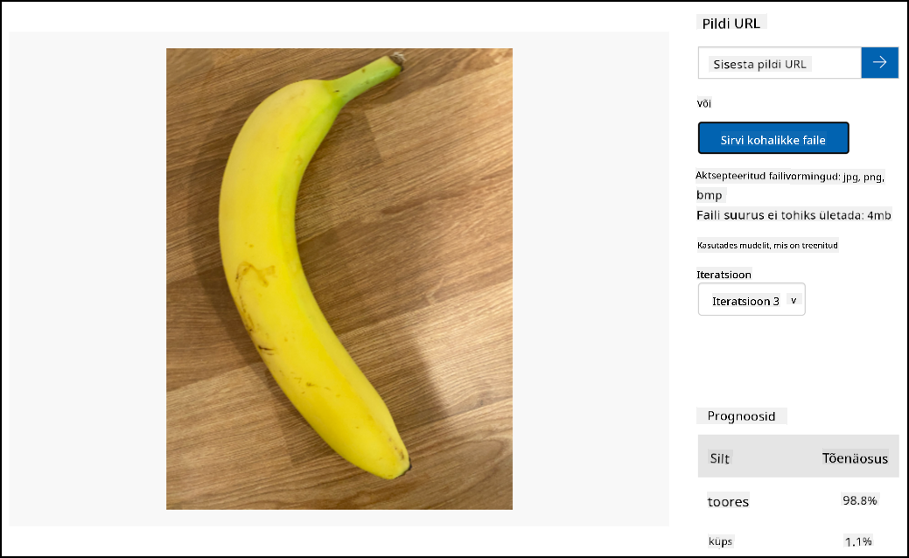

<!--
CO_OP_TRANSLATOR_METADATA:
{
  "original_hash": "f5e63c916d2dd97d58be12aaf76bd9f1",
  "translation_date": "2025-10-11T11:49:30+00:00",
  "source_file": "4-manufacturing/lessons/1-train-fruit-detector/README.md",
  "language_code": "et"
}
-->
# Treeni puuviljade kvaliteedi tuvastajat


> Visuaalne ülevaade: [Nitya Narasimhan](https://github.com/nitya). Klõpsa pildil, et näha suuremat versiooni.

See video annab ülevaate Azure Custom Vision teenusest, mida käsitletakse selles õppetunnis.

[](https://www.youtube.com/watch?v=TETcDLJlWR4)

> 🎥 Klõpsa ülaloleval pildil, et vaadata videot

## Eel-loengu viktoriin

[Eel-loengu viktoriin](https://black-meadow-040d15503.1.azurestaticapps.net/quiz/29)

## Sissejuhatus

Tehisintellekti (AI) ja masinõppe (ML) hiljutine tõus pakub tänapäeva arendajatele laia valikut võimalusi. ML-mudeleid saab treenida, et tuvastada erinevaid asju piltidel, sealhulgas tooreid puuvilju, ja seda saab kasutada IoT-seadmetes, et aidata saaki sorteerida kas koristamise ajal või töötlemisel tehastes või ladudes.

Selles õppetunnis õpid pildiklassifikatsiooni - ML-mudelite kasutamist erinevate objektide piltide eristamiseks. Õpid, kuidas treenida pildiklassifikaatorit, et eristada head ja halba puuvilja, olgu see siis liiga toore, üleküpsenud, muljutud või mädanenud.

Selles õppetunnis käsitleme:

* [AI ja ML kasutamine toidu sorteerimiseks](../../../../../4-manufacturing/lessons/1-train-fruit-detector)
* [Pildiklassifikatsioon masinõppe abil](../../../../../4-manufacturing/lessons/1-train-fruit-detector)
* [Pildiklassifikaatori treenimine](../../../../../4-manufacturing/lessons/1-train-fruit-detector)
* [Pildiklassifikaatori testimine](../../../../../4-manufacturing/lessons/1-train-fruit-detector)
* [Pildiklassifikaatori uuesti treenimine](../../../../../4-manufacturing/lessons/1-train-fruit-detector)

## AI ja ML kasutamine toidu sorteerimiseks

Maailma rahvastiku toitmine on keeruline, eriti hinnaga, mis teeb toidu kõigile taskukohaseks. Üks suurimaid kulusid on tööjõud, mistõttu pöörduvad põllumehed üha enam automatiseerimise ja IoT-tööriistade poole, et vähendada tööjõukulusid. Käsitsi koristamine on töömahukas (ja sageli füüsiliselt kurnav töö) ning seda asendatakse masinatega, eriti rikkamates riikides. Kuigi masinate kasutamine koristamiseks on odavam, on sellel ka miinus - võime sorteerida toitu koristamise ajal.

Kõik saagid ei küpse ühtlaselt. Näiteks tomatitel võib viinapuul olla veel rohelisi vilju, kui enamik on koristamiseks valmis. Kuigi nende varajane koristamine on raiskamine, on põllumehele odavam ja lihtsam koristada kõik masinatega ja hiljem toored viljad ära visata.

✅ Vaata erinevaid puuvilju või köögivilju, kas sinu koduaias, põldudel või poodides. Kas need on kõik ühesuguse küpsusastmega või näed variatsioone?

Automatiseeritud koristamise tõus viis toodangu sorteerimise koristamisest tehasesse. Toit liikus pikkadel konveierlintidel, kus meeskonnad korjasid toodangust välja kõik, mis ei vastanud kvaliteedistandarditele. Kuigi koristamine oli masinate abil odavam, oli toidu käsitsi sorteerimine endiselt kulukas.



Järgmine arenguetapp oli masinate kasutamine sorteerimiseks, kas koristusmasinates või töötlemisettevõtetes. Esimese põlvkonna masinad kasutasid optilisi sensoreid värvide tuvastamiseks, juhtides aktuaatoreid, mis lükkasid rohelised tomatid kangide või õhupuhangutega jäätmekasti, jättes punased tomatid konveierlintide võrgustikul edasi liikuma.

Selles videos tuvastatakse tomatite kukkumisel ühelt konveierilt teisele rohelised tomatid ja lükatakse kangide abil jäätmekasti.

✅ Millised tingimused peaksid olema tehases või põllul, et need optilised sensorid töötaksid korrektselt?

Viimased arengud sorteerimismasinate valdkonnas kasutavad AI-d ja ML-i, kasutades mudeleid, mis on treenitud eristama head toodangut halvast, mitte ainult ilmsete värvierinevuste, nagu rohelised tomatid vs punased, vaid ka peenemate välimuse erinevuste järgi, mis võivad viidata haigustele või muljumistele.

## Pildiklassifikatsioon masinõppe abil

Traditsiooniline programmeerimine seisneb andmete võtmises, algoritmi rakendamises ja väljundi saamisel. Näiteks eelmises projektis kasutasid sa GPS-koordinaate ja geopiiret, rakendasid Azure Mapsi pakutud algoritmi ja said tulemuseks, kas punkt oli geopiire sees või väljas. Sisestad rohkem andmeid, saad rohkem väljundeid.



Masinõpe pöörab selle ümber - alustad andmetest ja teadaolevatest väljunditest ning masinõppe algoritm õpib andmetest. Seejärel saad kasutada treenitud algoritmi, mida nimetatakse *masinõppe mudeliks* või *mudeliks*, sisestada uusi andmeid ja saada uusi väljundeid.

> 🎓 Masinõppe algoritmi õppimisprotsessi andmetest nimetatakse *treenimiseks*. Sisendid ja teadaolevad väljundid on *treeningandmed*.

Näiteks võid anda mudelile miljoneid pilte toorestest banaanidest sisendtreeningandmetena, kus treeningväljundiks on `toore`, ja miljoneid küpsete banaanide pilte treeningandmetena, kus väljundiks on `küps`. ML-algoritm loob selle põhjal mudeli. Seejärel annad mudelile uue pildi banaanist ja see ennustab, kas uus pilt on küps või toore banaan.

> 🎓 ML-mudelite tulemusi nimetatakse *ennustusteks*.



ML-mudelid ei anna binaarset vastust, vaid tõenäosusi. Näiteks võib mudelile anda pildi banaanist ja see ennustab `küps` 99.7% ja `toore` 0.3%. Sinu kood valib parima ennustuse ja otsustab, et banaan on küps.

ML-mudelit, mida kasutatakse selliste piltide tuvastamiseks, nimetatakse *pildiklassifikaatoriks* - sellele antakse märgistatud pildid ja see klassifitseerib uusi pilte nende märgiste põhjal.

> 💁 See on lihtsustatud selgitus ja on palju teisi viise mudelite treenimiseks, mis ei vaja alati märgistatud väljundeid, näiteks juhendamata õppimine. Kui soovid ML-ist rohkem teada saada, vaata [ML algajatele, 24 õppetunni õppekava masinõppest](https://aka.ms/ML-beginners).

## Pildiklassifikaatori treenimine

Eduka pildiklassifikaatori treenimiseks on vaja miljoneid pilte. Selgub, et kui sul on pildiklassifikaator, mis on treenitud miljonite või miljardite erinevate piltide põhjal, saad seda uuesti kasutada ja uuesti treenida väikese pildikomplektiga ning saavutada suurepäraseid tulemusi, kasutades protsessi, mida nimetatakse *ülekandeõppeks*.

> 🎓 Ülekandeõpe on protsess, kus olemasoleva ML-mudeli õpe kantakse üle uuele mudelile, mis põhineb uutel andmetel.

Kui pildiklassifikaator on treenitud laia valiku piltide jaoks, on selle sisemised mehhanismid suurepärased kujundite, värvide ja mustrite tuvastamisel. Ülekandeõpe võimaldab mudelil kasutada juba õpitud kujundite tuvastamist ja rakendada seda uute piltide tuvastamiseks.



Seda võib võrrelda laste kujundiraamatutega, kus kui suudad tuvastada poolringi, ristküliku ja kolmnurga, suudad tuvastada purjepaadi või kassi sõltuvalt nende kujundite konfiguratsioonist. Pildiklassifikaator suudab tuvastada kujundeid ja ülekandeõpe õpetab sellele, milline kombinatsioon moodustab paadi või kassi - või küpse banaani.

Selleks on olemas lai valik tööriistu, sealhulgas pilvepõhised teenused, mis aitavad sul mudelit treenida ja seejärel kasutada seda veebipõhiste API-de kaudu.

> 💁 Nende mudelite treenimine nõuab palju arvutusvõimsust, tavaliselt graafikaprotsessorite (GPU-de) abil. Sama spetsiaalne riistvara, mis teeb Xboxi mängud visuaalselt hämmastavaks, saab kasutada ka masinõppe mudelite treenimiseks. Pilve kasutades saad rentida aega võimsatel arvutitel, millel on GPU-d, et treenida neid mudeleid, saades vajaliku arvutusvõimsuse ainult ajaks, mil seda vajad.

## Custom Vision

Custom Vision on pilvepõhine tööriist pildiklassifikaatorite treenimiseks. See võimaldab treenida klassifikaatorit, kasutades ainult väikest hulka pilte. Sa saad pilte üles laadida veebipõhise portaali, veebipõhise API või SDK kaudu, andes igale pildile *märgise*, mis klassifitseerib selle pildi. Seejärel treenid mudelit ja testid seda, et näha, kui hästi see toimib. Kui oled mudeliga rahul, saad avaldada selle versioone, mida saab kasutada veebipõhise API või SDK kaudu.



> 💁 Custom Vision mudelit saab treenida vaid 5 pildiga klassifikatsiooni kohta, kuid rohkem on parem. Saad paremaid tulemusi vähemalt 30 pildiga.

Custom Vision on osa Microsofti AI-tööriistade valikust, mida nimetatakse Cognitive Services. Need on AI-tööriistad, mida saab kasutada kas ilma treenimiseta või väikese treenimisega. Need hõlmavad kõnetuvastust ja tõlkimist, keele mõistmist ja pildianalüüsi. Need on saadaval tasuta tasemega teenustena Azure'is.

> 💁 Tasuta tase on enam kui piisav mudeli loomiseks, treenimiseks ja arendustööks kasutamiseks. Tasuta taseme piirangute kohta saad lugeda [Custom Vision piirangute ja kvootide lehelt Microsofti dokumentatsioonis](https://docs.microsoft.com/azure/cognitive-services/custom-vision-service/limits-and-quotas?WT.mc_id=academic-17441-jabenn).

### Ülesanne - loo Cognitive Services ressurss

Custom Visioni kasutamiseks pead esmalt looma Azure'is kaks Cognitive Services ressurssi Azure CLI abil, ühe Custom Vision treenimiseks ja teise Custom Vision ennustamiseks.

1. Loo selle projekti jaoks Resource Group nimega `fruit-quality-detector`.

1. Kasuta järgmist käsku, et luua tasuta Custom Vision treenimisressurss:

    ```sh
    az cognitiveservices account create --name fruit-quality-detector-training \
                                        --resource-group fruit-quality-detector \
                                        --kind CustomVision.Training \
                                        --sku F0 \
                                        --yes \
                                        --location <location>
    ```

    Asenda `<location>` asukohaga, mida kasutasid Resource Groupi loomisel.

    See loob Resource Groupis Custom Vision treenimisressursi. Selle nimi on `fruit-quality-detector-training` ja see kasutab `F0` SKU-d, mis on tasuta tase. `--yes` valik tähendab, et nõustud Cognitive Services tingimustega.

> 💁 Kasuta `S0` SKU-d, kui sul on juba tasuta konto, mis kasutab mõnda Cognitive Services teenust.

1. Kasuta järgmist käsku, et luua tasuta Custom Vision ennustamisressurss:

    ```sh
    az cognitiveservices account create --name fruit-quality-detector-prediction \
                                        --resource-group fruit-quality-detector \
                                        --kind CustomVision.Prediction \
                                        --sku F0 \
                                        --yes \
                                        --location <location>
    ```

    Asenda `<location>` asukohaga, mida kasutasid Resource Groupi loomisel.

    See loob Resource Groupis Custom Vision ennustamisressursi. Selle nimi on `fruit-quality-detector-prediction` ja see kasutab `F0` SKU-d, mis on tasuta tase. `--yes` valik tähendab, et nõustud Cognitive Services tingimustega.

### Ülesanne - loo pildiklassifikaatori projekt

1. Ava Custom Vision portaal aadressil [CustomVision.ai](https://customvision.ai) ja logi sisse Microsofti kontoga, mida kasutasid Azure'i konto jaoks.

1. Järgi [Microsofti dokumentatsiooni juhendit pildiklassifikaatori loomise kiirjuhendi jaotises "Loo uus projekt"](https://docs.microsoft.com/azure/cognitive-services/custom-vision-service/getting-started-build-a-classifier?WT.mc_id=academic-17441-jabenn#create-a-new-project), et luua uus Custom Vision projekt. Kasutajaliides võib muutuda ja need dokumendid on alati kõige ajakohasem viide.

    Nimeta oma projekt `fruit-quality-detector`.

    Projekti loomisel kasuta kindlasti varem loodud `fruit-quality-detector-training` ressurssi. Kasuta *Classification* projekti tüüpi, *Multiclass* klassifikatsiooni tüüpi ja *Food* domeeni.

    

✅ Võta aega, et uurida Custom Vision kasutajaliidest oma pildiklassifikaatori jaoks.

### Ülesanne - treeni oma pildiklassifikaatori projekt

Pildiklassifikaatori treenimiseks on sul vaja mitmeid pilte puuviljadest, nii head kui halva kvaliteediga, mida märgistada headeks ja halbadeks, näiteks küps ja üleküpsenud banaan.

> 💁 Need klassifikaatorid suudavad klassifitseerida pilte kõigest, nii et kui sul pole erineva kvaliteediga puuvilju käepärast, võid kasutada kahte erinevat tüüpi puuvilju või kasse ja koeri!

Ideaalis peaks iga pilt olema ainult puuviljast, kas ühtlase taustaga või mitmekesise taustaga. Veendu, et taustal pole midagi, mis oleks spetsiifiline küpsete vs toorete puuviljade jaoks.
> 💁 Oluline on, et iga sildi jaoks ei oleks konkreetseid taustu ega konkreetseid esemeid, mis pole seotud klassifitseeritava objektiga, vastasel juhul võib klassifikaator lihtsalt klassifitseerida tausta põhjal. Näiteks oli nahavähi klassifikaator, mida treeniti nii normaalsete kui ka vähkkasvajate sünnimärkide põhjal, kusjuures vähkkasvajate sünnimärkide kõrval olid alati joonlauad, et mõõta nende suurust. Selgus, et klassifikaator oli peaaegu 100% täpne joonlaudade tuvastamisel piltidel, mitte vähkkasvajate sünnimärkide tuvastamisel.

Pildiklassifikaatorid töötavad väga madala resolutsiooniga. Näiteks Custom Vision suudab treenimiseks ja ennustamiseks kasutada pilte kuni 10240x10240, kuid treenib ja käitab mudelit piltidega suuruses 227x227. Suuremad pildid vähendatakse sellele suurusele, seega veendu, et klassifitseeritav objekt võtaks pildil suure osa, vastasel juhul võib see väiksemas pildis klassifikaatori jaoks liiga väike olla.

1. Kogu pilte oma klassifikaatori jaoks. Sul on vaja vähemalt 5 pilti iga sildi jaoks, et klassifikaatorit treenida, kuid mida rohkem, seda parem. Sul on vaja ka mõningaid lisapilte klassifikaatori testimiseks. Need pildid peaksid olema sama objekti erinevad pildid. Näiteks:

    * Kasutades 2 küpset banaani, tee mõlemast mõned pildid erinevate nurkade alt, tehes vähemalt 7 pilti (5 treenimiseks, 2 testimiseks), kuid ideaalis rohkem.

        

    * Korda sama protsessi 2 toore banaaniga.

    Sul peaks olema vähemalt 10 treeningpilti, vähemalt 5 küpset ja 5 toorest, ning 4 testimispilti, 2 küpset ja 2 toorest. Pildid peaksid olema png- või jpeg-formaadis, väiksemad kui 6MB. Kui teed need näiteks iPhone'iga, võivad need olla kõrge resolutsiooniga HEIC-pildid, mis tuleb konverteerida ja võib-olla ka vähendada. Mida rohkem pilte, seda parem, ja küpsete ja toorete piltide arv peaks olema sarnane.

    Kui sul pole nii küpseid kui ka tooreid vilju, võid kasutada erinevaid vilju või mis tahes kahte objekti, mis sul saadaval on. Samuti leiad näidispilte [images](../../../../../4-manufacturing/lessons/1-train-fruit-detector/images) kaustast küpsete ja toorete banaanide kohta, mida saad kasutada.

1. Järgi [piltide üleslaadimise ja sildistamise juhiseid Microsofti dokumentatsioonis](https://docs.microsoft.com/azure/cognitive-services/custom-vision-service/getting-started-build-a-classifier?WT.mc_id=academic-17441-jabenn#upload-and-tag-images), et laadida üles oma treeningpildid. Sildista küpsed viljad kui `ripe` ja toored viljad kui `unripe`.

    

1. Järgi [klassifikaatori treenimise juhiseid Microsofti dokumentatsioonis](https://docs.microsoft.com/azure/cognitive-services/custom-vision-service/getting-started-build-a-classifier?WT.mc_id=academic-17441-jabenn#train-the-classifier), et treenida pildiklassifikaatorit oma üleslaaditud piltidega.

    Sul on võimalus valida treeningtüüp. Vali **Quick Training**.

Klassifikaator hakkab treenima. Treeningu lõpetamine võtab paar minutit.

> 🍌 Kui otsustad treeningu ajal oma vilju süüa, veendu, et sul oleks piisavalt pilte testimiseks!

## Testi oma pildiklassifikaatorit

Kui klassifikaator on treenitud, saad seda testida, andes sellele uue pildi klassifitseerimiseks.

### Ülesanne - testi oma pildiklassifikaatorit

1. Järgi [oma mudeli testimise juhiseid Microsofti dokumentatsioonis](https://docs.microsoft.com/azure/cognitive-services/custom-vision-service/test-your-model?WT.mc_id=academic-17441-jabenn#test-your-model), et testida oma pildiklassifikaatorit. Kasuta testimispilte, mille varem tegid, mitte treeningpilte.

    

1. Proovi kõiki testimispilte, mis sul on, ja jälgi tõenäosusi.

## Treeni oma pildiklassifikaatorit uuesti

Kui testid oma klassifikaatorit, ei pruugi see anda oodatud tulemusi. Pildiklassifikaatorid kasutavad masinõpet, et teha ennustusi selle kohta, mis pildil on, tuginedes tõenäosustele, et teatud pildi omadused vastavad konkreetsele sildile. See ei mõista, mis pildil on – see ei tea, mis on banaan ega mõista, mis teeb banaanist banaani, mitte paadi. Saad oma klassifikaatorit parandada, treenides seda uuesti piltidega, mille puhul see eksib.

Iga kord, kui teed ennustuse kiirtesti valiku abil, salvestatakse pilt ja tulemused. Saad neid pilte kasutada oma mudeli uuesti treenimiseks.

### Ülesanne - treeni oma pildiklassifikaatorit uuesti

1. Järgi [ennustatud pildi treeninguks kasutamise juhiseid Microsofti dokumentatsioonis](https://docs.microsoft.com/azure/cognitive-services/custom-vision-service/test-your-model?WT.mc_id=academic-17441-jabenn#use-the-predicted-image-for-training), et treenida oma mudelit uuesti, kasutades iga pildi jaoks õiget silti.

1. Kui mudel on uuesti treenitud, testi seda uute piltidega.

---

## 🚀 Väljakutse

Mis sa arvad, mis juhtuks, kui kasutaksid mudeliga, mis on treenitud banaanide peal, pilti maasikast, täispuhutavast banaanist, inimesest banaanikostüümis või isegi kollasest multifilmitegelasest, näiteks Simpsonitest?

Proovi järele ja vaata, millised ennustused tulevad. Saad katsetamiseks pilte otsida [Bingi pildiotsingust](https://www.bing.com/images/trending).

## Loengu-järgne viktoriin

[Loengu-järgne viktoriin](https://black-meadow-040d15503.1.azurestaticapps.net/quiz/30)

## Ülevaade ja iseseisev õppimine

* Kui treenisid oma klassifikaatorit, nägid *Precision*, *Recall* ja *AP* väärtusi, mis hindavad loodud mudelit. Loe, mida need väärtused tähendavad, kasutades [klassifikaatori hindamise juhiseid Microsofti dokumentatsioonis](https://docs.microsoft.com/azure/cognitive-services/custom-vision-service/getting-started-build-a-classifier?WT.mc_id=academic-17441-jabenn#evaluate-the-classifier).
* Loe, kuidas oma klassifikaatorit parandada, kasutades [Custom Vision mudeli parandamise juhiseid Microsofti dokumentatsioonis](https://docs.microsoft.com/azure/cognitive-services/custom-vision-service/getting-started-improving-your-classifier?WT.mc_id=academic-17441-jabenn).

## Ülesanne

[Treeni oma klassifikaatorit mitme vilja ja köögivilja jaoks](assignment.md)

---

**Lahtiütlus**:  
See dokument on tõlgitud AI tõlketeenuse [Co-op Translator](https://github.com/Azure/co-op-translator) abil. Kuigi püüame tagada täpsust, palume arvestada, et automaatsed tõlked võivad sisaldada vigu või ebatäpsusi. Algne dokument selle algses keeles tuleks pidada autoriteetseks allikaks. Olulise teabe puhul soovitame kasutada professionaalset inimtõlget. Me ei vastuta selle tõlke kasutamisest tulenevate arusaamatuste või valesti tõlgenduste eest.