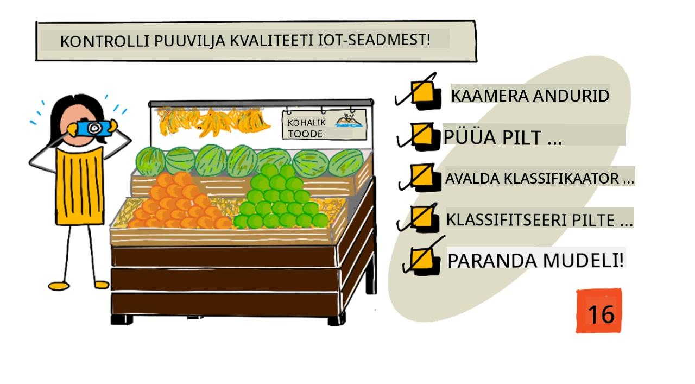
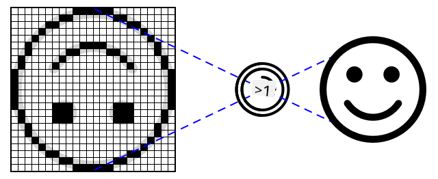
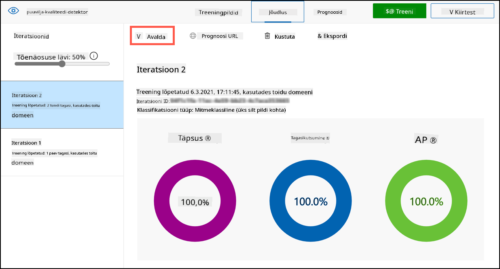
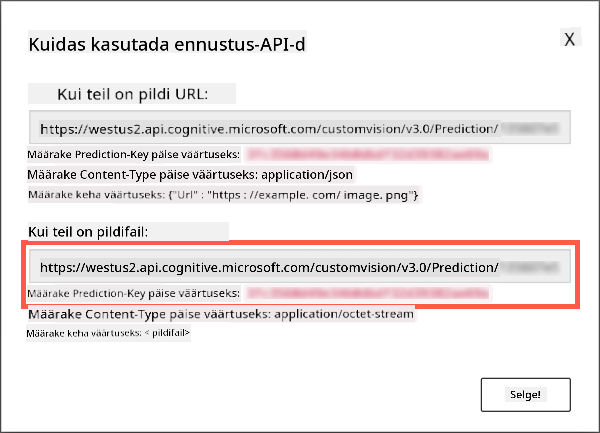

<!--
CO_OP_TRANSLATOR_METADATA:
{
  "original_hash": "557f4ee96b752e0651d2e6e74aa6bd14",
  "translation_date": "2025-10-11T11:46:55+00:00",
  "source_file": "4-manufacturing/lessons/2-check-fruit-from-device/README.md",
  "language_code": "et"
}
-->
# Kontrolli puuviljade kvaliteeti IoT-seadmest



> Sketš: [Nitya Narasimhan](https://github.com/nitya). Klõpsa pildil, et näha suuremat versiooni.

## Loengu-eelne viktoriin

[Loengu-eelne viktoriin](https://black-meadow-040d15503.1.azurestaticapps.net/quiz/31)

## Sissejuhatus

Eelmises õppetunnis õppisite pildiklassifikaatoreid ja kuidas neid treenida, et tuvastada häid ja halbu puuvilju. Selleks, et kasutada seda pildiklassifikaatorit IoT-rakenduses, peate olema võimeline jäädvustama pilti kaamera abil ja saatma selle pilve klassifitseerimiseks.

Selles õppetunnis õpite kaamerasensoreid tundma ja kuidas neid kasutada IoT-seadmega pildi jäädvustamiseks. Samuti õpite, kuidas kutsuda pildiklassifikaatorit oma IoT-seadmest.

Selles õppetunnis käsitleme:

* [Kaamerasensorid](../../../../../4-manufacturing/lessons/2-check-fruit-from-device)
* [Pildi jäädvustamine IoT-seadmega](../../../../../4-manufacturing/lessons/2-check-fruit-from-device)
* [Pildiklassifikaatori avaldamine](../../../../../4-manufacturing/lessons/2-check-fruit-from-device)
* [Piltide klassifitseerimine IoT-seadmest](../../../../../4-manufacturing/lessons/2-check-fruit-from-device)
* [Mudeli täiustamine](../../../../../4-manufacturing/lessons/2-check-fruit-from-device)

## Kaamerasensorid

Kaamerasensorid, nagu nimigi ütleb, on kaamerad, mida saab ühendada IoT-seadmega. Need võivad teha nii üksikuid pilte kui ka salvestada voogedastusega videot. Mõned tagastavad toorpildi andmeid, teised aga tihendavad pildiandmed pildifailiks, näiteks JPEG või PNG. Tavaliselt on IoT-seadmetega töötavad kaamerad palju väiksemad ja madalama resolutsiooniga, kui te olete harjunud, kuid on olemas ka kõrge resolutsiooniga kaameraid, mis võivad konkureerida tippklassi telefonidega. Saadaval on erinevaid vahetatavaid läätsi, mitme kaamera seadistusi, infrapuna termokaameraid või UV-kaameraid.



Enamik kaamerasensoreid kasutab pildisensoreid, kus iga piksel on fotodiood. Lääts fokuseerib pildi pildisensorile ja tuhanded või miljonid fotodioodid tuvastavad igaühele langeva valguse ning salvestavad selle pikslite andmetena.

> 💁 Läätsed pööravad pildid tagurpidi, kaamerasensor pöörab pildi seejärel õigeks. Sama toimub ka teie silmades - see, mida näete, tuvastatakse tagurpidi teie silma tagaosas ja teie aju korrigeerib selle.

> 🎓 Pildisensorit tuntakse kui aktiivse piksli sensorit (APS) ja kõige populaarsem APS-tüüp on täiendava metallioksiid-pooljuhtide sensor ehk CMOS. Võib-olla olete kuulnud terminit CMOS-sensor, mida kasutatakse kaamerasensorite kohta.

Kaamerasensorid on digitaalsed sensorid, mis saadavad pildiandmeid digitaalselt, tavaliselt raamatukogu abil, mis pakub suhtlust. Kaamerad ühenduvad protokollide, nagu SPI, abil, et võimaldada neil saata suuri andmemahtusid - pildid on oluliselt suuremad kui üksikud numbrid, näiteks temperatuurisensorist.

✅ Millised on pildi suuruse piirangud IoT-seadmetes? Mõelge eriti mikrokontrolleri riistvara piirangutele.

## Pildi jäädvustamine IoT-seadmega

Te saate kasutada oma IoT-seadet pildi jäädvustamiseks ja selle klassifitseerimiseks.

### Ülesanne - pildi jäädvustamine IoT-seadmega

Järgige vastavat juhendit, et jäädvustada pilt oma IoT-seadmega:

* [Arduino - Wio Terminal](wio-terminal-camera.md)
* [Üheplaadiarvuti - Raspberry Pi](pi-camera.md)
* [Üheplaadiarvuti - Virtuaalne seade](virtual-device-camera.md)

## Pildiklassifikaatori avaldamine

Eelmises õppetunnis treenisite oma pildiklassifikaatorit. Enne kui saate seda oma IoT-seadmest kasutada, peate mudeli avaldama.

### Mudeli iteratsioonid

Kui teie mudel eelmises õppetunnis treenis, võisite märgata, et **Performance** vahekaart näitab külje peal iteratsioone. Kui treenisite mudelit esimest korda, nägite *Iteration 1*. Kui täiustasite mudelit ennustuspiltide abil, nägite *Iteration 2*.

Iga kord, kui treenite mudelit, saate uue iteratsiooni. See on viis jälgida erinevaid mudeli versioone, mis on treenitud erinevate andmekogumite põhjal. Kui teete **Quick Test**, on olemas rippmenüü, mille abil saate valida iteratsiooni ja võrrelda tulemusi mitme iteratsiooni vahel.

Kui olete iteratsiooniga rahul, saate selle avaldada, et see oleks kättesaadav välistele rakendustele. Nii saate avaldatud versiooni, mida teie seadmed kasutavad, ja samal ajal töötada uue versiooni kallal mitme iteratsiooni jooksul, avaldades selle alles siis, kui olete sellega rahul.

### Ülesanne - iteratsiooni avaldamine

Iteratsioone avaldatakse Custom Vision portaalist.

1. Avage Custom Vision portaal aadressil [CustomVision.ai](https://customvision.ai) ja logige sisse, kui te pole seda juba avanud. Seejärel avage oma `fruit-quality-detector` projekt.

1. Valige ülemistest valikutest **Performance** vahekaart.

1. Valige külje pealt *Iterations* loendist viimane iteratsioon.

1. Valige iteratsiooni jaoks **Publish** nupp.

    

1. *Publish Model* dialoogis määrake *Prediction resource* väärtuseks `fruit-quality-detector-prediction` ressurss, mille lõite eelmises õppetunnis. Jätke nimi `Iteration2` ja valige **Publish** nupp.

1. Kui avaldamine on lõpule viidud, valige **Prediction URL** nupp. See näitab ennustuse API üksikasju, mida vajate mudeli kutsumiseks oma IoT-seadmest. Alumine sektsioon on märgistatud *If you have an image file* ja see on vajalik teave. Kopeerige kuvatav URL, mis näeb välja umbes selline:

    ```output
    https://<location>.api.cognitive.microsoft.com/customvision/v3.0/Prediction/<id>/classify/iterations/Iteration2/image
    ```

    Kus `<location>` on asukoht, mida kasutasite oma Custom Vision ressursi loomisel, ja `<id>` on pikk ID, mis koosneb tähtedest ja numbritest.

    Samuti kopeerige *Prediction-Key* väärtus. See on turvaline võti, mida peate mudeli kutsumisel edastama. Ainult rakendused, mis edastavad selle võtme, saavad mudelit kasutada, kõik teised rakendused lükatakse tagasi.

    

✅ Kui uus iteratsioon avaldatakse, on sellel erinev nimi. Kuidas arvate, et muudaksite iteratsiooni, mida IoT-seade kasutab?

## Piltide klassifitseerimine IoT-seadmest

Nüüd saate kasutada neid ühenduse üksikasju, et kutsuda pildiklassifikaatorit oma IoT-seadmest.

### Ülesanne - piltide klassifitseerimine IoT-seadmest

Järgige vastavat juhendit, et klassifitseerida pilte oma IoT-seadme abil:

* [Arduino - Wio Terminal](wio-terminal-classify-image.md)
* [Üheplaadiarvuti - Raspberry Pi/Virtuaalne IoT-seade](single-board-computer-classify-image.md)

## Mudeli täiustamine

Võite avastada, et tulemused, mida saate kaameraga ühendatud IoT-seadmest, ei vasta ootustele. Ennustused ei pruugi alati olla nii täpsed kui arvutist üles laaditud piltide puhul. See on tingitud sellest, et mudel treeniti erinevate andmete põhjal kui need, mida kasutatakse ennustamiseks.

Parimate tulemuste saavutamiseks pildiklassifikaatoriga soovite treenida mudelit piltidega, mis on võimalikult sarnased ennustamiseks kasutatavate piltidega. Kui kasutasite oma telefoni kaamerat piltide jäädvustamiseks treenimiseks, on näiteks pildikvaliteet, teravus ja värvid erinevad IoT-seadmega ühendatud kaamerast.


Ülaltoodud pildil on vasakpoolne banaanipilt tehtud Raspberry Pi kaameraga, parempoolne aga sama banaani pilt samas kohas iPhone'iga. Kvaliteedis on märgatav erinevus - iPhone'i pilt on teravam, heledamate värvide ja suurema kontrastsusega.

✅ Mis veel võiks põhjustada, et IoT-seadme jäädvustatud pildid annavad valesid ennustusi? Mõelge keskkonnale, kus IoT-seadet võidakse kasutada, millised tegurid võivad mõjutada jäädvustatud pilti?

Mudeli täiustamiseks saate selle uuesti treenida, kasutades IoT-seadmest jäädvustatud pilte.

### Ülesanne - mudeli täiustamine

1. Klassifitseerige mitu küpse ja toore puuvilja pilti oma IoT-seadme abil.

1. Custom Vision portaalis treenige mudel uuesti, kasutades *Predictions* vahekaardil olevaid pilte.

    > ⚠️ Vajadusel saate viidata [juhistele oma klassifikaatori uuesti treenimiseks 1. õppetunnis](../1-train-fruit-detector/README.md#retrain-your-image-classifier).

1. Kui teie pildid erinevad oluliselt algselt treenimiseks kasutatud piltidest, saate kõik algsed pildid kustutada, valides need *Training Images* vahekaardil ja vajutades **Delete** nuppu. Pildi valimiseks liigutage kursor selle kohale ja ilmub linnuke, valige see, et pilt valida või tühistada.

1. Treenige mudeli uus iteratsioon ja avaldage see ülaltoodud sammude abil.

1. Uuendage oma koodis lõpp-punkti URL ja käivitage rakendus uuesti.

1. Korrake neid samme, kuni olete ennustuste tulemustega rahul.

---

## 🚀 Väljakutse

Kui palju mõjutab pildi resolutsioon või valgustus ennustust?

Proovige muuta oma seadme koodis piltide resolutsiooni ja vaadake, kas see mõjutab piltide kvaliteeti. Proovige ka valgustust muuta.

Kui loote tooteseadme, mida müüa farmidele või tehastele, kuidas tagaksite, et see annaks alati järjepidevaid tulemusi?

## Loengu-järgne viktoriin

[Loengu-järgne viktoriin](https://black-meadow-040d15503.1.azurestaticapps.net/quiz/32)

## Ülevaade ja iseseisev õppimine

Treenasite oma Custom Vision mudelit portaali abil. See eeldab, et pildid on saadaval - ja reaalses maailmas ei pruugi teil olla treeningandmeid, mis vastavad sellele, mida teie seadme kaamera jäädvustab. Sellest saab mööda minna, treenides otse oma seadmest, kasutades treeningu API-d, et treenida mudelit IoT-seadmest jäädvustatud piltide abil.

* Lugege treeningu API kohta [Custom Vision SDK kiirkäivituse juhendist](https://docs.microsoft.com/azure/cognitive-services/custom-vision-service/quickstarts/image-classification?WT.mc_id=academic-17441-jabenn&tabs=visual-studio&pivots=programming-language-python)

## Ülesanne

[Reageeri klassifitseerimise tulemustele](assignment.md)

---

**Lahtiütlus**:  
See dokument on tõlgitud AI tõlketeenuse [Co-op Translator](https://github.com/Azure/co-op-translator) abil. Kuigi püüame tagada täpsust, palume arvestada, et automaatsed tõlked võivad sisaldada vigu või ebatäpsusi. Algne dokument selle algses keeles tuleks pidada autoriteetseks allikaks. Olulise teabe puhul soovitame kasutada professionaalset inimtõlget. Me ei vastuta selle tõlke kasutamisest tulenevate arusaamatuste või valesti tõlgenduste eest.