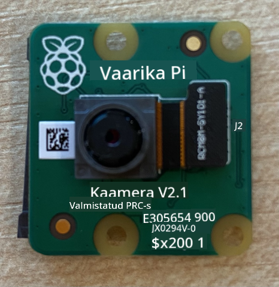
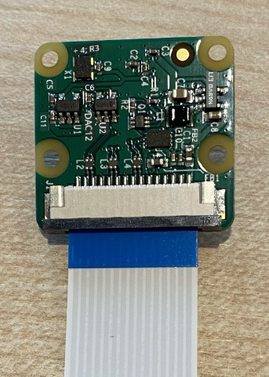
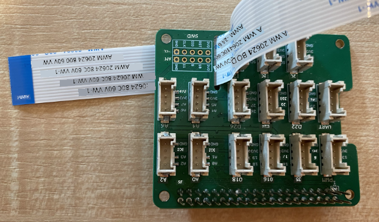

<!--
CO_OP_TRANSLATOR_METADATA:
{
  "original_hash": "c677667095f6133eee418c7e53615d05",
  "translation_date": "2025-10-11T11:44:19+00:00",
  "source_file": "4-manufacturing/lessons/2-check-fruit-from-device/pi-camera.md",
  "language_code": "et"
}
-->
# Pildi jäädvustamine - Raspberry Pi

Selles õppetunni osas lisate Raspberry Pi-le kaamerasensori ja loete sellest pilte.

## Riistvara

Raspberry Pi vajab kaamerat.

Kaamera, mida kasutate, on [Raspberry Pi kaameramoodul](https://www.raspberrypi.org/products/camera-module-v2/). See kaamera on loodud töötama Raspberry Pi-ga ja ühendub spetsiaalse pistiku kaudu Pi-le.

> 💁 See kaamera kasutab [Camera Serial Interface'i, protokolli Mobile Industry Processor Interface Alliance'ist](https://wikipedia.org/wiki/Camera_Serial_Interface), tuntud kui MIPI-CSI. See on spetsiaalne protokoll piltide edastamiseks.

## Kaamera ühendamine

Kaamera saab Raspberry Pi-ga ühendada lintkaabli abil.

### Ülesanne - kaamera ühendamine



1. Lülitage Pi välja.

1. Ühendage kaameraga kaasas olev lintkaabel kaameraga. Selleks tõmmake õrnalt hoidikus olevat musta plastklambrit, nii et see veidi välja tuleks, ja libistage kaabel pistikusse, sinine külg objektiivist eemale, metallist kontaktid objektiivi poole. Kui kaabel on täielikult sees, lükake must plastklamber tagasi oma kohale.

    Animatsiooni, mis näitab, kuidas klambrit avada ja kaablit sisestada, leiate [Raspberry Pi kaameramooduli dokumentatsioonist](https://projects.raspberrypi.org/en/projects/getting-started-with-picamera/2).

    

1. Eemaldage Grove Base Hat Pi-lt.

1. Viige lintkaabel läbi Grove Base Hat kaamera ava. Veenduge, et kaabli sinine külg oleks suunatud analoogportide **A0**, **A1** jne poole.

    

1. Sisestage lintkaabel Pi kaamerapistikusse. Tõmmake jälle must plastklamber üles, sisestage kaabel ja lükake klamber tagasi. Kaabli sinine külg peaks olema suunatud USB- ja Ethernet-pistikute poole.

    

1. Paigaldage Grove Base Hat tagasi.

## Kaamera programmeerimine

Nüüd saab Raspberry Pi kaamerat programmeerida, kasutades [PiCamera](https://pypi.org/project/picamera/) Python'i teeki.

### Ülesanne - pärandkaamera režiimi lubamine

Kahjuks muutus Raspberry Pi OS Bullseye väljaandega kaamera tarkvara, mis tuli operatsioonisüsteemiga kaasa, ja vaikimisi PiCamera enam ei tööta. Töös on asendus nimega PiCamera2, kuid see pole veel kasutamiseks valmis.

Praegu saate oma Pi seadistada pärandkaamera režiimi, et PiCamera töötaks. Kaamera pistik on vaikimisi keelatud, kuid pärandkaamera tarkvara lubamine aktiveerib pistiku automaatselt.

1. Lülitage Pi sisse ja oodake, kuni see käivitub.

1. Käivitage VS Code, kas otse Pi-l või ühendage Remote SSH laienduse kaudu.

1. Käivitage terminalis järgmised käsud:

    ```sh
    sudo raspi-config nonint do_legacy 0
    sudo reboot
    ```

    See lülitab sisse pärandkaamera tarkvara ja taaskäivitab Pi, et muudatus jõustuks.

1. Oodake, kuni Pi taaskäivitub, ja käivitage VS Code uuesti.

### Ülesanne - kaamera programmeerimine

Programmeerige seade.

1. Looge terminalis `pi` kasutaja kodukataloogi uus kaust nimega `fruit-quality-detector`. Looge selles kaustas fail nimega `app.py`.

1. Avage see kaust VS Code'is.

1. Kaameraga suhtlemiseks saate kasutada PiCamera Python'i teeki. Installige selle jaoks Pip pakett järgmise käsuga:

    ```sh
    pip3 install picamera
    ```

1. Lisage oma `app.py` faili järgmine kood:

    ```python
    import io
    import time
    from picamera import PiCamera
    ```

    See kood impordib vajalikud teegid, sealhulgas `PiCamera` teegi.

1. Lisage sellele koodile alljärgnev, et kaamera initsialiseerida:

    ```python
    camera = PiCamera()
    camera.resolution = (640, 480)
    camera.rotation = 0
    
    time.sleep(2)
    ```

    See kood loob PiCamera objekti ja määrab resolutsiooniks 640x480. Kuigi toetatud on ka kõrgemad resolutsioonid (kuni 3280x2464), töötab pildiklassifikaator palju väiksemate piltidega (227x227), seega pole vaja jäädvustada ja saata suuremaid pilte.

    Rida `camera.rotation = 0` määrab pildi pööramise. Lintkaabel tuleb kaamera alt, kuid kui teie kaamera on pööratud, et hõlbustada objekti suunamist, mida soovite klassifitseerida, saate seda rida muuta vastavalt pöördenurkadele.

    

    Näiteks, kui riputate lintkaabli üle millegi nii, et see on kaamera ülaosas, määrake pööramine väärtuseks 180:

    ```python
    camera.rotation = 180
    ```

    Kaamera käivitumine võtab paar sekundit, seetõttu on lisatud rida `time.sleep(2)`.

1. Lisage sellele koodile alljärgnev, et jäädvustada pilt binaarandmetena:

    ```python
    image = io.BytesIO()
    camera.capture(image, 'jpeg')
    image.seek(0)
    ```

    See kood loob `BytesIO` objekti binaarandmete salvestamiseks. Pilt loetakse kaamerast JPEG-failina ja salvestatakse sellesse objekti. Sellel objektil on positsiooniindikaator, mis näitab, kus andmetes ollakse, et vajadusel saaks rohkem andmeid lõppu kirjutada, seega rida `image.seek(0)` viib positsiooni tagasi algusesse, et hiljem saaks kõiki andmeid lugeda.

1. Lisage sellele alljärgnev, et salvestada pilt faili:

    ```python
    with open('image.jpg', 'wb') as image_file:
        image_file.write(image.read())
    ```

    See kood avab faili nimega `image.jpg` kirjutamiseks, loeb kõik andmed `BytesIO` objektist ja kirjutab need faili.

    > 💁 Pilti saab jäädvustada otse faili, mitte `BytesIO` objekti, andes faili nime `camera.capture` käsule. Põhjus, miks kasutatakse `BytesIO` objekti, on see, et hiljem selles õppetunnis saate pildi saata oma pildiklassifikaatorile.

1. Suunake kaamera millelegi ja käivitage see kood.

1. Pilt jäädvustatakse ja salvestatakse `image.jpg` nimega praegusesse kausta. Näete seda faili VS Code'i failihalduris. Valige fail, et pilti vaadata. Kui see vajab pööramist, uuendage rida `camera.rotation = 0` vastavalt ja tehke uus pilt.

> 💁 Selle koodi leiate kaustast [code-camera/pi](../../../../../4-manufacturing/lessons/2-check-fruit-from-device/code-camera/pi).

😀 Teie kaameraprogramm õnnestus!

---

**Lahtiütlus**:  
See dokument on tõlgitud AI tõlketeenuse [Co-op Translator](https://github.com/Azure/co-op-translator) abil. Kuigi püüame tagada täpsust, palume arvestada, et automaatsed tõlked võivad sisaldada vigu või ebatäpsusi. Algne dokument selle algses keeles tuleks pidada autoriteetseks allikaks. Olulise teabe puhul soovitame kasutada professionaalset inimtõlget. Me ei vastuta selle tõlke kasutamisest tulenevate arusaamatuste või valesti tõlgenduste eest.