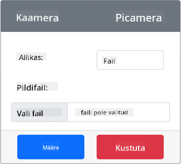
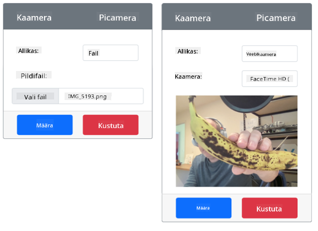

<!--
CO_OP_TRANSLATOR_METADATA:
{
  "original_hash": "3ba7150ffc4a6999f6c3cfb4906ec7df",
  "translation_date": "2025-10-11T11:44:55+00:00",
  "source_file": "4-manufacturing/lessons/2-check-fruit-from-device/virtual-device-camera.md",
  "language_code": "et"
}
-->
# Pildi jäädvustamine - Virtuaalne IoT-seade

Selles õppetüki osas lisate oma virtuaalsele IoT-seadmele kaamerasensori ja loete sellest pilte.

## Riistvara

Virtuaalne IoT-seade kasutab simuleeritud kaamerat, mis saadab kas pilte failidest või teie veebikaamerast.

### Kaamera lisamine CounterFit-i

Virtuaalse kaamera kasutamiseks peate selle CounterFit rakendusse lisama.

#### Ülesanne - kaamera lisamine CounterFit-i

Lisage kaamera CounterFit rakendusse.

1. Looge oma arvutis uus Python-rakendus kaustas `fruit-quality-detector`, millel on üks fail nimega `app.py` ja Python-i virtuaalne keskkond, ning lisage CounterFit pip-paketid.

    > ⚠️ Vajadusel saate viidata [juhistele CounterFit Python-projekti loomise ja seadistamise kohta 1. õppetükis](../../../1-getting-started/lessons/1-introduction-to-iot/virtual-device.md).

1. Installige täiendav Pip-pakett, et lisada CounterFit shim, mis suudab suhelda kaamerasensoritega, simuleerides mõningaid [Picamera Pip-paketi](https://pypi.org/project/picamera/) funktsioone. Veenduge, et installite selle terminalist, kus virtuaalne keskkond on aktiveeritud.

    ```sh
    pip install counterfit-shims-picamera
    ```

1. Veenduge, et CounterFit veebirakendus töötab.

1. Looge kaamera:

    1. *Sensors* paneelil *Create sensor* kastis valige rippmenüüst *Sensor type* ja valige *Camera*.

    1. Määrake *Name* väärtuseks `Picamera`.

    1. Valige **Add** nupp, et kaamera luua.

    

    Kaamera luuakse ja ilmub sensorite loendisse.

    

## Kaamera programmeerimine

Virtuaalset IoT-seadet saab nüüd programmeerida kasutama virtuaalset kaamerat.

### Ülesanne - kaamera programmeerimine

Programmeerige seade.

1. Veenduge, et `fruit-quality-detector` rakendus on VS Code'is avatud.

1. Avage fail `app.py`.

1. Lisage `app.py` faili algusesse järgmine kood, et ühendada rakendus CounterFit-iga:

    ```python
    from counterfit_connection import CounterFitConnection
    CounterFitConnection.init('127.0.0.1', 5000)
    ```

1. Lisage järgmine kood oma `app.py` faili:

    ```python
    import io
    from counterfit_shims_picamera import PiCamera
    ```

    See kood impordib mõned vajalikud teegid, sealhulgas `PiCamera` klassi counterfit_shims_picamera teegist.

1. Lisage sellele alla järgmine kood kaamera initsialiseerimiseks:

    ```python
    camera = PiCamera()
    camera.resolution = (640, 480)
    camera.rotation = 0
    ```

    See kood loob PiCamera objekti ja seab resolutsiooniks 640x480. Kuigi toetatakse ka kõrgemaid resolutsioone, töötab pildiklassifikaator palju väiksemate piltidega (227x227), seega pole vaja jäädvustada ja saata suuremaid pilte.

    Rida `camera.rotation = 0` määrab pildi pööramise kraadides. Kui peate veebikaamera või faili pilti pöörama, seadke see vastavalt. Näiteks, kui soovite muuta veebikaamera horisontaalrežiimis banaanipildi vertikaalseks, seadke `camera.rotation = 90`.

1. Lisage sellele alla järgmine kood, et jäädvustada pilt binaarandmetena:

    ```python
    image = io.BytesIO()
    camera.capture(image, 'jpeg')
    image.seek(0)
    ```

    See kood loob `BytesIO` objekti binaarandmete salvestamiseks. Pilt loetakse kaamerast JPEG-failina ja salvestatakse sellesse objekti. Sellel objektil on positsiooniindikaator, mis näitab, kus andmetes ollakse, et vajadusel saaks rohkem andmeid lõppu kirjutada, seega liigutab rida `image.seek(0)` selle positsiooni tagasi algusesse, et hiljem saaks kõik andmed lugeda.

1. Lisage sellele alla järgmine kood, et salvestada pilt faili:

    ```python
    with open('image.jpg', 'wb') as image_file:
        image_file.write(image.read())
    ```

    See kood avab faili nimega `image.jpg` kirjutamiseks, loeb kõik andmed `BytesIO` objektist ja kirjutab need faili.

    > 💁 Võite jäädvustada pildi otse faili, mitte `BytesIO` objekti, andes faili nime `camera.capture` käsule. Põhjus, miks kasutatakse `BytesIO` objekti, on see, et hiljem selles õppetükis saate pildi saata oma pildiklassifikaatorile.

1. Konfigureerige pilt, mida CounterFit kaamera jäädvustab. Võite määrata *Source* väärtuseks *File* ja üles laadida pildifaili või määrata *Source* väärtuseks *WebCam*, et pilte jäädvustataks teie veebikaamerast. Veenduge, et valite **Set** nupu pärast pildi valimist või veebikaamera seadistamist.

    

1. Pilt jäädvustatakse ja salvestatakse failina `image.jpg` praeguses kaustas. Näete seda faili VS Code'i failihalduris. Valige fail, et pilti vaadata. Kui see vajab pööramist, uuendage rida `camera.rotation = 0` vastavalt ja tehke uus pilt.

> 💁 Selle koodi leiate kaustast [code-camera/virtual-iot-device](../../../../../4-manufacturing/lessons/2-check-fruit-from-device/code-camera/virtual-iot-device).

😀 Teie kaameraprogramm töötas edukalt!

---

**Lahtiütlus**:  
See dokument on tõlgitud AI tõlketeenuse [Co-op Translator](https://github.com/Azure/co-op-translator) abil. Kuigi püüame tagada täpsust, palume arvestada, et automaatsed tõlked võivad sisaldada vigu või ebatäpsusi. Algne dokument selle algses keeles tuleks pidada autoriteetseks allikaks. Olulise teabe puhul soovitame kasutada professionaalset inimtõlget. Me ei vastuta selle tõlke kasutamisest tulenevate arusaamatuste või valesti tõlgenduste eest.