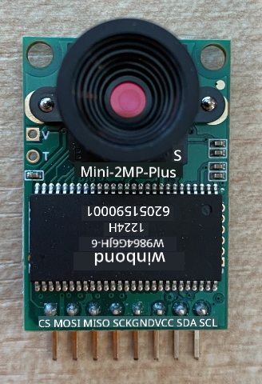
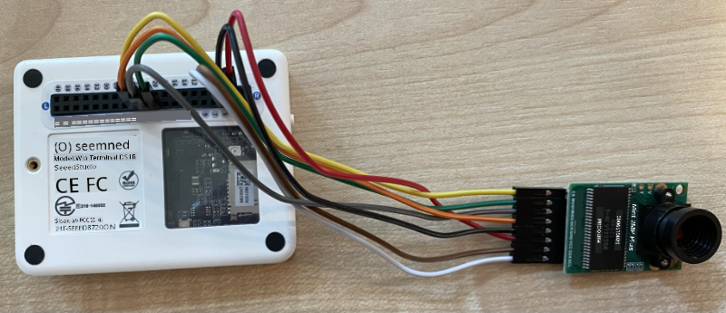

<!--
CO_OP_TRANSLATOR_METADATA:
{
  "original_hash": "160be8c0f558687f6686dca64f10f739",
  "translation_date": "2025-10-11T11:45:50+00:00",
  "source_file": "4-manufacturing/lessons/2-check-fruit-from-device/wio-terminal-camera.md",
  "language_code": "et"
}
-->
# Pildi jäädvustamine - Wio Terminal

Selles õppetunni osas lisate oma Wio Terminalile kaamera ja jäädvustate sellest pilte.

## Riistvara

Wio Terminal vajab kaamerat.

Kaamera, mida kasutate, on [ArduCam Mini 2MP Plus](https://www.arducam.com/product/arducam-2mp-spi-camera-b0067-arduino/). See on 2-megapiksline kaamera, mis põhineb OV2640 pildisensoril. Kaamera suhtleb SPI-liidese kaudu, et pilte jäädvustada, ja kasutab I<sup>2</sup>C-d sensori seadistamiseks.

## Kaamera ühendamine

ArduCamil ei ole Grove-pesa, selle asemel ühendatakse see nii SPI kui ka I<sup>2</sup>C siini kaudu GPIO-pistikute abil Wio Terminaliga.

### Ülesanne - kaamera ühendamine

Ühendage kaamera.



1. ArduCami alumised pistikud tuleb ühendada Wio Terminali GPIO-pistikutesse. Õigete pistikute leidmise hõlbustamiseks kinnitage Wio Terminaliga kaasas olev GPIO-pistiku kleebis pistikute ümber:

    

1. Kasutades hüppajajuhtmeid, tehke järgmised ühendused:

    | ArduCAM pin | Wio Terminal pin | Kirjeldus                               |
    | ----------- | ---------------- | --------------------------------------- |
    | CS          | 24 (SPI_CS)      | SPI Chip Select                         |
    | MOSI        | 19 (SPI_MOSI)    | SPI kontrolleri väljund, perifeeria sisend |
    | MISO        | 21 (SPI_MISO)    | SPI kontrolleri sisend, perifeeria väljund |
    | SCK         | 23 (SPI_SCLK)    | SPI Serial Clock                        |
    | GND         | 6 (GND)          | Maa - 0V                                |
    | VCC         | 4 (5V)           | 5V toiteallikas                         |
    | SDA         | 3 (I2C1_SDA)     | I<sup>2</sup>C Serial Data              |
    | SCL         | 5 (I2C1_SCL)     | I<sup>2</sup>C Serial Clock             |

    

    GND ja VCC ühendused tagavad ArduCamile 5V toiteallika. See töötab 5V juures, erinevalt Grove sensoritest, mis töötavad 3V juures. See toide tuleb otse USB-C ühendusest, mis seadet toidab.

    > 💁 SPI-ühenduse puhul kasutavad ArduCami ja Wio Terminali pistikute nimed koodis endiselt vana nimetamise konventsiooni. Selle õppetunni juhised kasutavad uut nimetamise konventsiooni, välja arvatud juhul, kui pistikute nimed on koodis kasutusel.

1. Nüüd saate Wio Terminali oma arvutiga ühendada.

## Seadme programmeerimine kaameraga ühendamiseks

Wio Terminali saab nüüd programmeerida kasutama ühendatud ArduCAM kaamerat.

### Ülesanne - seadme programmeerimine kaameraga ühendamiseks

1. Looge täiesti uus Wio Terminali projekt, kasutades PlatformIO-d. Nimetage see projektiks `fruit-quality-detector`. Lisage koodi `setup` funktsiooni, et seadistada serial port.

1. Lisage kood WiFi-ühenduse loomiseks, kasutades oma WiFi mandaate failis `config.h`. Ärge unustage lisada vajalikud teegid faili `platformio.ini`.

1. ArduCam teek ei ole saadaval Arduino teegina, mida saab installida `platformio.ini` failist. Selle asemel tuleb see installida nende GitHubi lehelt. Selle saate kas:

    * Kloonides repo aadressilt [https://github.com/ArduCAM/Arduino.git](https://github.com/ArduCAM/Arduino.git)
    * Minnes GitHubi lehele [github.com/ArduCAM/Arduino](https://github.com/ArduCAM/Arduino) ja laadides koodi alla zip-failina **Code** nupu alt

1. Teil on vaja ainult `ArduCAM` kausta sellest koodist. Kopeerige kogu kaust oma projekti `lib` kausta.

    > ⚠️ Kogu kaust tuleb kopeerida, nii et kood asub `lib/ArduCam`. Ärge kopeerige ainult `ArduCam` kausta sisu `lib` kausta, kopeerige kogu kaust.

1. ArduCam teegi kood töötab mitut tüüpi kaameratega. Kaamera tüüp, mida soovite kasutada, konfigureeritakse kompilaatori lippude abil - see hoiab teegi võimalikult väikese, eemaldades koodi kaameratele, mida te ei kasuta. Teegi konfigureerimiseks OV2640 kaamera jaoks lisage järgmine `platformio.ini` faili lõppu:

    ```ini
    build_flags =
        -DARDUCAM_SHIELD_V2
        -DOV2640_CAM
    ```

    See määrab kaks kompilaatori lippu:

      * `ARDUCAM_SHIELD_V2`, et teek teaks, et kaamera on Arduino plaadil, mida tuntakse kui shield.
      * `OV2640_CAM`, et teek sisaldaks ainult koodi OV2640 kaamera jaoks.

1. Lisage `src` kausta päisefail nimega `camera.h`. See sisaldab koodi kaameraga suhtlemiseks. Lisage sellele failile järgmine kood:

    ```cpp
    #pragma once
    
    #include <ArduCAM.h>
    #include <Wire.h>
    
    class Camera
    {
    public:
        Camera(int format, int image_size) : _arducam(OV2640, PIN_SPI_SS)
        {
            _format = format;
            _image_size = image_size;
        }
    
        bool init()
        {
            // Reset the CPLD
            _arducam.write_reg(0x07, 0x80);
            delay(100);
    
            _arducam.write_reg(0x07, 0x00);
            delay(100);
    
            // Check if the ArduCAM SPI bus is OK
            _arducam.write_reg(ARDUCHIP_TEST1, 0x55);
            if (_arducam.read_reg(ARDUCHIP_TEST1) != 0x55)
            {
                return false;
            }
                
            // Change MCU mode
            _arducam.set_mode(MCU2LCD_MODE);
    
            uint8_t vid, pid;
    
            // Check if the camera module type is OV2640
            _arducam.wrSensorReg8_8(0xff, 0x01);
            _arducam.rdSensorReg8_8(OV2640_CHIPID_HIGH, &vid);
            _arducam.rdSensorReg8_8(OV2640_CHIPID_LOW, &pid);
            if ((vid != 0x26) && ((pid != 0x41) || (pid != 0x42)))
            {
                return false;
            }
            
            _arducam.set_format(_format);
            _arducam.InitCAM();
            _arducam.OV2640_set_JPEG_size(_image_size);
            _arducam.OV2640_set_Light_Mode(Auto);
            _arducam.OV2640_set_Special_effects(Normal);
            delay(1000);
    
            return true;
        }
    
        void startCapture()
        {
            _arducam.flush_fifo();
            _arducam.clear_fifo_flag();
            _arducam.start_capture();
        }
    
        bool captureReady()
        {
            return _arducam.get_bit(ARDUCHIP_TRIG, CAP_DONE_MASK);
        }
    
        bool readImageToBuffer(byte **buffer, uint32_t &buffer_length)
        {
            if (!captureReady()) return false;
    
            // Get the image file length
            uint32_t length = _arducam.read_fifo_length();
            buffer_length = length;
    
            if (length >= MAX_FIFO_SIZE)
            {
                return false;
            }
            if (length == 0)
            {
                return false;
            }
    
            // create the buffer
            byte *buf = new byte[length];
    
            uint8_t temp = 0, temp_last = 0;
            int i = 0;
            uint32_t buffer_pos = 0;
            bool is_header = false;
    
            _arducam.CS_LOW();
            _arducam.set_fifo_burst();
            
            while (length--)
            {
                temp_last = temp;
                temp = SPI.transfer(0x00);
                //Read JPEG data from FIFO
                if ((temp == 0xD9) && (temp_last == 0xFF)) //If find the end ,break while,
                {
                    buf[buffer_pos] = temp;
    
                    buffer_pos++;
                    i++;
                    
                    _arducam.CS_HIGH();
                }
                if (is_header == true)
                {
                    //Write image data to buffer if not full
                    if (i < 256)
                    {
                        buf[buffer_pos] = temp;
                        buffer_pos++;
                        i++;
                    }
                    else
                    {
                        _arducam.CS_HIGH();
    
                        i = 0;
                        buf[buffer_pos] = temp;
    
                        buffer_pos++;
                        i++;
    
                        _arducam.CS_LOW();
                        _arducam.set_fifo_burst();
                    }
                }
                else if ((temp == 0xD8) & (temp_last == 0xFF))
                {
                    is_header = true;
    
                    buf[buffer_pos] = temp_last;
                    buffer_pos++;
                    i++;
    
                    buf[buffer_pos] = temp;
                    buffer_pos++;
                    i++;
                }
            }
            
            _arducam.clear_fifo_flag();
    
            _arducam.set_format(_format);
            _arducam.InitCAM();
            _arducam.OV2640_set_JPEG_size(_image_size);
    
            // return the buffer
            *buffer = buf;
        }
    
    private:
        ArduCAM _arducam;
        int _format;
        int _image_size;
    };
    ```

    See on madala taseme kood, mis konfigureerib kaamera, kasutades ArduCam teeke, ja eraldab pildid vajadusel SPI siini kaudu. See kood on väga spetsiifiline ArduCamile, nii et te ei pea praegu muretsema, kuidas see töötab.

1. Lisage `main.cpp` failis järgmine kood teiste `include` avalduste alla, et lisada see uus fail ja luua kaamera klassi eksemplar:

    ```cpp
    #include "camera.h"

    Camera camera = Camera(JPEG, OV2640_640x480);
    ```

    See loob `Camera`, mis salvestab pildid JPEG-vormingus resolutsiooniga 640x480. Kuigi toetatakse kõrgemaid resolutsioone (kuni 3280x2464), töötab pildiklassifikaator palju väiksemate piltidega (227x227), seega pole vaja jäädvustada ja saata suuremaid pilte.

1. Lisage sellele koodile järgmine funktsioon kaamera seadistamiseks:

    ```cpp
    void setupCamera()
    {
        pinMode(PIN_SPI_SS, OUTPUT);
        digitalWrite(PIN_SPI_SS, HIGH);
    
        Wire.begin();
        SPI.begin();
    
        if (!camera.init())
        {
            Serial.println("Error setting up the camera!");
        }
    }
    ```

    See `setupCamera` funktsioon alustab SPI chip select pin (`PIN_SPI_SS`) seadistamist kõrgeks, muutes Wio Terminali SPI kontrolleriks. Seejärel käivitab see I<sup>2</sup>C ja SPI siinid. Lõpuks algatab see kaamera klassi, mis konfigureerib kaamera sensori seaded ja tagab, et kõik on õigesti ühendatud.

1. Kutsuge see funktsioon `setup` funktsiooni lõpus:

    ```cpp
    setupCamera();
    ```

1. Koostage ja laadige see kood üles ning kontrollige serial monitori väljundit. Kui näete `Error setting up the camera!`, kontrollige juhtmeid, et veenduda, et kõik kaablid ühendavad õiged ArduCami pistikud õigete GPIO-pistikutega Wio Terminalis ja kõik hüppajajuhtmed on korralikult paigas.

## Pildi jäädvustamine

Wio Terminali saab nüüd programmeerida jäädvustama pilti, kui nuppu vajutatakse.

### Ülesanne - pildi jäädvustamine

1. Mikroprotsessorid käitavad teie koodi pidevalt, seega pole lihtne käivitada midagi, näiteks foto tegemist, ilma sensorile reageerimata. Wio Terminalil on nupud, seega saab kaamera seadistada ühe nupu vajutamisega käivituma. Lisage järgmine kood `setup` funktsiooni lõppu, et konfigureerida C nupp (üks kolmest nupust ülaosas, kõige lähemal toitelülitile).

    

    ```cpp
    pinMode(WIO_KEY_C, INPUT_PULLUP);
    ```

    `INPUT_PULLUP` režiim sisuliselt pöörab sisendi. Näiteks tavaliselt saadaks nupp madala signaali, kui seda ei vajutata, ja kõrge signaali, kui seda vajutatakse. Kui see on seadistatud `INPUT_PULLUP`, saadavad nad kõrge signaali, kui neid ei vajutata, ja madala signaali, kui neid vajutatakse.

1. Lisage tühi funktsioon, mis reageerib nupu vajutamisele enne `loop` funktsiooni:

    ```cpp
    void buttonPressed()
    {
        
    }
    ```

1. Kutsuge see funktsioon `loop` meetodis, kui nuppu vajutatakse:

    ```cpp
    void loop()
    {
        if (digitalRead(WIO_KEY_C) == LOW)
        {
            buttonPressed();
            delay(2000);
        }
    
        delay(200);
    }
    ```

    See kood kontrollib, kas nuppu vajutatakse. Kui nuppu vajutatakse, kutsutakse `buttonPressed` funktsioon ja tsükkel viivitab 2 sekundit. See annab aega nupu vabastamiseks, et pikk vajutus ei registreeruks kaks korda.

    > 💁 Wio Terminali nupp on seadistatud `INPUT_PULLUP`, seega saadab kõrge signaali, kui seda ei vajutata, ja madala signaali, kui seda vajutatakse.

1. Lisage `buttonPressed` funktsioonile järgmine kood:

    ```cpp
    camera.startCapture();
 
    while (!camera.captureReady())
        delay(100);

    Serial.println("Image captured");

    byte *buffer;
    uint32_t length;

    if (camera.readImageToBuffer(&buffer, length))
    {
        Serial.print("Image read to buffer with length ");
        Serial.println(length);

        delete(buffer);
    }
    ```

    See kood alustab kaamera jäädvustamist, kutsudes `startCapture`. Kaamera riistvara ei tööta nii, et andmed tagastatakse, kui neid küsitakse, selle asemel saadate juhise jäädvustamise alustamiseks ja kaamera töötab taustal, et jäädvustada pilt, teisendada see JPEG-ks ja salvestada see kaamera kohalikku puhvrit. `captureReady` kutse kontrollib, kas pildi jäädvustamine on lõppenud.

    Kui jäädvustamine on lõppenud, kopeeritakse pildid kaamera puhvrist kohalikku puhvrit (baitide massiiv) `readImageToBuffer` kutsega. Puhvri pikkus saadetakse seejärel serial monitorile.

1. Koostage ja laadige see kood üles ning kontrollige serial monitori väljundit. Iga kord, kui vajutate C nuppu, jäädvustatakse pilt ja näete pildi suurust serial monitoril.

    ```output
    Connecting to WiFi..
    Connected!
    Image captured
    Image read to buffer with length 9224
    Image captured
    Image read to buffer with length 11272
    ```

    Erinevatel piltidel on erinevad suurused. Need on tihendatud JPEG-vormingus ja JPEG-faili suurus antud resolutsiooni jaoks sõltub sellest, mis pildil on.

> 💁 Selle koodi leiate kaustast [code-camera/wio-terminal](../../../../../4-manufacturing/lessons/2-check-fruit-from-device/code-camera/wio-terminal).

😀 Olete edukalt jäädvustanud pilte oma Wio Terminaliga.

## Valikuline - kaamera piltide kontrollimine SD-kaardi abil

Lihtsaim viis näha kaamera jäädvustatud pilte on kirjutada need Wio Terminali SD-kaardile ja seejärel vaadata neid oma arvutis. Tehke see samm, kui teil on vaba microSD kaart ja microSD kaardi pesa arvutis või adapter.

Wio Terminal toetab ainult kuni 16GB suuruseid microSD kaarte. Kui teil on suurem SD kaart, siis see ei tööta.

### Ülesanne - kaamera piltide kontrollimine SD-kaardi abil

1. Vormindage microSD kaart FAT32 või exFAT vormingusse, kasutades vastavaid rakendusi oma arvutis (Disk Utility macOS-is, File Explorer Windowsis või käsurea tööriistad Linuxis).

1. Sisestage microSD kaart pesasse, mis asub otse toitelüliti all. Veenduge, et see on täielikult sees, kuni see klõpsab ja jääb paigale. Võite vajada küünt või õhukest tööriista selle surumiseks.

1. Lisage järgmised `include` avaldused `main.cpp` faili algusesse:

    ```cpp
    #include "SD/Seeed_SD.h"
    #include <Seeed_FS.h>
    ```

1. Lisage järgmine funktsioon enne `setup` funktsiooni:

    ```cpp
    void setupSDCard()
    {
        while (!SD.begin(SDCARD_SS_PIN, SDCARD_SPI))
        {
            Serial.println("SD Card Error");
        }
    }
    ```

    See konfigureerib SD kaardi, kasutades SPI siini.

1. Kutsuge see `setup` funktsioonist:

    ```cpp
    setupSDCard();
    ```

1. Lisage järgmine kood `buttonPressed` funktsiooni kohale:

    ```cpp
    int fileNum = 1;

    void saveToSDCard(byte *buffer, uint32_t length)
    {
        char buff[16];
        sprintf(buff, "%d.jpg", fileNum);
        fileNum++;
    
        File outFile = SD.open(buff, FILE_WRITE );
        outFile.write(buffer, length);
        outFile.close();

        Serial.print("Image written to file ");
        Serial.println(buff);
    }
    ```

    See määratleb globaalse muutuja failide loendamiseks. Seda kasutatakse pildifailide nimede jaoks, et mitu pilti saaks jäädvustada järjestikuste failinimedega - `1.jpg`, `2.jpg` ja nii edasi.

    Seejärel määratleb `saveToSDCard` funktsiooni, mis võtab baitide andmepuhvri ja puhvri pikkuse. Failinimi luuakse, kasutades failide loendurit, ja failide loendurit suurendatakse järgmise faili jaoks. Puhvri binaarandmed kirjutatakse seejärel faili.

1. Kutsuge `saveToSDCard` funktsioon `buttonPressed` funktsioonist. Kutse peaks olema **enne**, kui puhver kustutatakse:

    ```cpp
    Serial.print("Image read to buffer with length ");
    Serial.println(length);

    saveToSDCard(buffer, length);
    
    delete(buffer);
    ```

1. Koostage ja laadige see kood üles ning kontrollige serial monitori väljundit. Iga kord, kui vajutate C nuppu, jäädvustatakse pilt ja salvestatakse SD kaardile.

    ```output
    Connecting to WiFi..
    Connected!
    Image captured
    Image read to buffer with length 16392
    Image written to file 1.jpg
    Image captured
    Image read to buffer with length 14344
    Image written to file 2.jpg
    ```

1. Lülitage microSD kaart välja ja eemaldage see, vajutades seda kergelt sisse ja vabastades, ning see hüppab välja. Võite vajada õhukest tööriista selleks. Ühendage microSD kaart oma arvutiga, et pilte vaadata.

    

    > 💁 Kaamera valge tasakaalu kohandamiseks võib kuluda paar pilti. Näete seda piltide värvi põhjal, esimesed paar pilti võivad olla värvilt ebatäpsed. Selle ümber saab töötada, muutes koodi nii, et `setup` funktsioonis jäädvustatakse paar pilti, mida ignoreeritakse.

---

**Lahtiütlus**:  
See dokument on tõlgitud, kasutades AI tõlketeenust [Co-op Translator](https://github.com/Azure/co-op-translator). Kuigi püüame tagada täpsust, palun arvestage, et automaatsed tõlked võivad sisaldada vigu või ebatäpsusi. Algne dokument selle algses keeles tuleks lugeda autoriteetseks allikaks. Olulise teabe puhul on soovitatav kasutada professionaalset inimtõlget. Me ei vastuta selle tõlke kasutamisest tulenevate arusaamatuste või valede tõlgenduste eest.