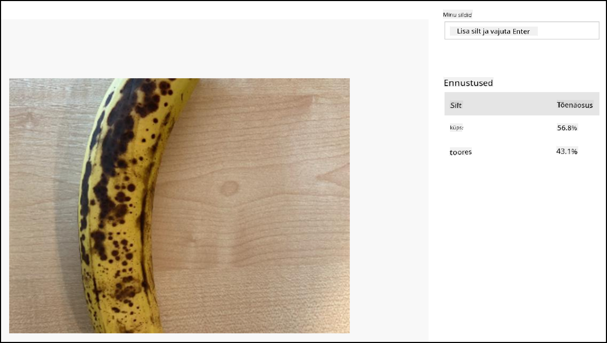

<!--
CO_OP_TRANSLATOR_METADATA:
{
  "original_hash": "32a1f23e7834fbe7715da8c4ebb450b9",
  "translation_date": "2025-10-11T11:47:40+00:00",
  "source_file": "4-manufacturing/lessons/2-check-fruit-from-device/wio-terminal-classify-image.md",
  "language_code": "et"
}
-->
# Klassifitseeri pilt - Wio Terminal

Selles õppetunni osas saadad kaameraga jäädvustatud pildi Custom Vision teenusele, et see klassifitseerida.

## Pildi klassifitseerimine

Custom Vision teenusel on REST API, mida saab kasutada Wio Terminali kaudu piltide klassifitseerimiseks. See REST API on ligipääsetav HTTPS-ühenduse kaudu - turvaline HTTP-ühendus.

HTTPS-lõpp-punktidega suhtlemisel peab kliendikood küsima juurdepääsetavalt serverilt avaliku võtme sertifikaadi ja kasutama seda saadetava liikluse krüpteerimiseks. Sinu veebibrauser teeb seda automaatselt, kuid mikrokontrollerid mitte. Sa pead selle sertifikaadi käsitsi hankima ja kasutama seda turvalise ühenduse loomiseks REST API-ga. Need sertifikaadid ei muutu, seega saab sertifikaadi koodi kõvaks kirjutada.

Need sertifikaadid sisaldavad avalikke võtmeid ja neid ei ole vaja turvaliselt hoida. Sa võid neid kasutada oma lähtekoodis ja jagada avalikult näiteks GitHubis.

### Ülesanne - seadista SSL klient

1. Ava `fruit-quality-detector` rakenduse projekt, kui see pole veel avatud.

1. Ava `config.h` päisefail ja lisa järgmine:

    ```cpp
    const char *CERTIFICATE =
        "-----BEGIN CERTIFICATE-----\r\n"
        "MIIF8zCCBNugAwIBAgIQAueRcfuAIek/4tmDg0xQwDANBgkqhkiG9w0BAQwFADBh\r\n"
        "MQswCQYDVQQGEwJVUzEVMBMGA1UEChMMRGlnaUNlcnQgSW5jMRkwFwYDVQQLExB3\r\n"
        "d3cuZGlnaWNlcnQuY29tMSAwHgYDVQQDExdEaWdpQ2VydCBHbG9iYWwgUm9vdCBH\r\n"
        "MjAeFw0yMDA3MjkxMjMwMDBaFw0yNDA2MjcyMzU5NTlaMFkxCzAJBgNVBAYTAlVT\r\n"
        "MR4wHAYDVQQKExVNaWNyb3NvZnQgQ29ycG9yYXRpb24xKjAoBgNVBAMTIU1pY3Jv\r\n"
        "c29mdCBBenVyZSBUTFMgSXNzdWluZyBDQSAwNjCCAiIwDQYJKoZIhvcNAQEBBQAD\r\n"
        "ggIPADCCAgoCggIBALVGARl56bx3KBUSGuPc4H5uoNFkFH4e7pvTCxRi4j/+z+Xb\r\n"
        "wjEz+5CipDOqjx9/jWjskL5dk7PaQkzItidsAAnDCW1leZBOIi68Lff1bjTeZgMY\r\n"
        "iwdRd3Y39b/lcGpiuP2d23W95YHkMMT8IlWosYIX0f4kYb62rphyfnAjYb/4Od99\r\n"
        "ThnhlAxGtfvSbXcBVIKCYfZgqRvV+5lReUnd1aNjRYVzPOoifgSx2fRyy1+pO1Uz\r\n"
        "aMMNnIOE71bVYW0A1hr19w7kOb0KkJXoALTDDj1ukUEDqQuBfBxReL5mXiu1O7WG\r\n"
        "0vltg0VZ/SZzctBsdBlx1BkmWYBW261KZgBivrql5ELTKKd8qgtHcLQA5fl6JB0Q\r\n"
        "gs5XDaWehN86Gps5JW8ArjGtjcWAIP+X8CQaWfaCnuRm6Bk/03PQWhgdi84qwA0s\r\n"
        "sRfFJwHUPTNSnE8EiGVk2frt0u8PG1pwSQsFuNJfcYIHEv1vOzP7uEOuDydsmCjh\r\n"
        "lxuoK2n5/2aVR3BMTu+p4+gl8alXoBycyLmj3J/PUgqD8SL5fTCUegGsdia/Sa60\r\n"
        "N2oV7vQ17wjMN+LXa2rjj/b4ZlZgXVojDmAjDwIRdDUujQu0RVsJqFLMzSIHpp2C\r\n"
        "Zp7mIoLrySay2YYBu7SiNwL95X6He2kS8eefBBHjzwW/9FxGqry57i71c2cDAgMB\r\n"
        "AAGjggGtMIIBqTAdBgNVHQ4EFgQU1cFnOsKjnfR3UltZEjgp5lVou6UwHwYDVR0j\r\n"
        "BBgwFoAUTiJUIBiV5uNu5g/6+rkS7QYXjzkwDgYDVR0PAQH/BAQDAgGGMB0GA1Ud\r\n"
        "JQQWMBQGCCsGAQUFBwMBBggrBgEFBQcDAjASBgNVHRMBAf8ECDAGAQH/AgEAMHYG\r\n"
        "CCsGAQUFBwEBBGowaDAkBggrBgEFBQcwAYYYaHR0cDovL29jc3AuZGlnaWNlcnQu\r\n"
        "Y29tMEAGCCsGAQUFBzAChjRodHRwOi8vY2FjZXJ0cy5kaWdpY2VydC5jb20vRGln\r\n"
        "aUNlcnRHbG9iYWxSb290RzIuY3J0MHsGA1UdHwR0MHIwN6A1oDOGMWh0dHA6Ly9j\r\n"
        "cmwzLmRpZ2ljZXJ0LmNvbS9EaWdpQ2VydEdsb2JhbFJvb3RHMi5jcmwwN6A1oDOG\r\n"
        "MWh0dHA6Ly9jcmw0LmRpZ2ljZXJ0LmNvbS9EaWdpQ2VydEdsb2JhbFJvb3RHMi5j\r\n"
        "cmwwHQYDVR0gBBYwFDAIBgZngQwBAgEwCAYGZ4EMAQICMBAGCSsGAQQBgjcVAQQD\r\n"
        "AgEAMA0GCSqGSIb3DQEBDAUAA4IBAQB2oWc93fB8esci/8esixj++N22meiGDjgF\r\n"
        "+rA2LUK5IOQOgcUSTGKSqF9lYfAxPjrqPjDCUPHCURv+26ad5P/BYtXtbmtxJWu+\r\n"
        "cS5BhMDPPeG3oPZwXRHBJFAkY4O4AF7RIAAUW6EzDflUoDHKv83zOiPfYGcpHc9s\r\n"
        "kxAInCedk7QSgXvMARjjOqdakor21DTmNIUotxo8kHv5hwRlGhBJwps6fEVi1Bt0\r\n"
        "trpM/3wYxlr473WSPUFZPgP1j519kLpWOJ8z09wxay+Br29irPcBYv0GMXlHqThy\r\n"
        "8y4m/HyTQeI2IMvMrQnwqPpY+rLIXyviI2vLoI+4xKE4Rn38ZZ8m\r\n"
        "-----END CERTIFICATE-----\r\n";
    ```

    See on *Microsoft Azure DigiCert Global Root G2 sertifikaat* - üks sertifikaatidest, mida paljud Azure teenused üle maailma kasutavad.

    > 💁 Selleks, et näha, et see on õige sertifikaat, käivita järgmine käsk macOS-is või Linuxis. Kui kasutad Windowsi, saad seda käsku käivitada [Windows Subsystem for Linux (WSL)](https://docs.microsoft.com/windows/wsl/?WT.mc_id=academic-17441-jabenn) abil:
    >
    > ```sh
    > openssl s_client -showcerts -verify 5 -connect api.cognitive.microsoft.com:443
    > ```
    >
    > Väljundis kuvatakse DigiCert Global Root G2 sertifikaat.

1. Ava `main.cpp` ja lisa järgmine include-direktiiv:

    ```cpp
    #include <WiFiClientSecure.h>
    ```

1. Include-direktiivide alla deklareeri `WifiClientSecure` eksemplar:

    ```cpp
    WiFiClientSecure client;
    ```

    See klass sisaldab koodi, et suhelda veebipunktidega HTTPS-i kaudu.

1. `connectWiFi` meetodis määra WiFiClientSecure kasutama DigiCert Global Root G2 sertifikaati:

    ```cpp
    client.setCACert(CERTIFICATE);
    ```

### Ülesanne - pildi klassifitseerimine

1. Lisa järgmine rida `lib_deps` loendisse `platformio.ini` failis:

    ```ini
    bblanchon/ArduinoJson @ 6.17.3
    ```

    See impordib [ArduinoJson](https://arduinojson.org), Arduino JSON teegi, mida kasutatakse REST API vastuse dekodeerimiseks.

1. Lisa `config.h` faili konstandid Custom Vision teenuse ennustuse URL-i ja võtme jaoks:

    ```cpp
    const char *PREDICTION_URL = "<PREDICTION_URL>";
    const char *PREDICTION_KEY = "<PREDICTION_KEY>";
    ```

    Asenda `<PREDICTION_URL>` Custom Visioni ennustuse URL-iga. Asenda `<PREDICTION_KEY>` ennustuse võtmega.

1. Lisa `main.cpp` faili include-direktiiv ArduinoJson teegi jaoks:

    ```cpp
    #include <ArduinoJSON.h>
    ```

1. Lisa järgmine funktsioon `main.cpp` faili, `buttonPressed` funktsiooni kohale.

    ```cpp
    void classifyImage(byte *buffer, uint32_t length)
    {
        HTTPClient httpClient;
        httpClient.begin(client, PREDICTION_URL);
        httpClient.addHeader("Content-Type", "application/octet-stream");
        httpClient.addHeader("Prediction-Key", PREDICTION_KEY);
    
        int httpResponseCode = httpClient.POST(buffer, length);
    
        if (httpResponseCode == 200)
        {
            String result = httpClient.getString();
    
            DynamicJsonDocument doc(1024);
            deserializeJson(doc, result.c_str());
    
            JsonObject obj = doc.as<JsonObject>();
            JsonArray predictions = obj["predictions"].as<JsonArray>();
    
            for(JsonVariant prediction : predictions) 
            {
                String tag = prediction["tagName"].as<String>();
                float probability = prediction["probability"].as<float>();
    
                char buff[32];
                sprintf(buff, "%s:\t%.2f%%", tag.c_str(), probability * 100.0);
                Serial.println(buff);
            }
        }
    
        httpClient.end();
    }
    ```

    See kood alustab `HTTPClient` deklareerimisega - klass, mis sisaldab meetodeid REST API-dega suhtlemiseks. Seejärel ühendab klienti ennustuse URL-iga, kasutades `WiFiClientSecure` eksemplari, mis on seadistatud Azure'i avaliku võtmega.

    Kui ühendus on loodud, saadab see päised - teave eelseisva päringu kohta, mis tehakse REST API vastu. Päis `Content-Type` näitab, et API-kõne saadab toorandmeid, päis `Prediction-Key` edastab Custom Visioni ennustuse võtme.

    Seejärel tehakse HTTP kliendile POST-päring, laadides üles baitide massiivi. See sisaldab kaameraga jäädvustatud JPEG-pilti, kui seda funktsiooni kutsutakse.

    > 💁 POST-päringud on mõeldud andmete saatmiseks ja vastuse saamiseks. On ka teisi päringutüüpe, näiteks GET-päringud, mis toovad andmeid. GET-päringuid kasutab sinu veebibrauser veebilehtede laadimiseks.

    POST-päring tagastab vastuse olekukoodi. Need on hästi määratletud väärtused, kus 200 tähendab **OK** - POST-päring õnnestus.

    > 💁 Kõiki vastuse olekukoodide loetelu leiad [HTTP olekukoodide loendist Wikipedias](https://wikipedia.org/wiki/List_of_HTTP_status_codes)

    Kui tagastatakse 200, loetakse tulemus HTTP kliendist. See on tekstivastus REST API-st, mis sisaldab ennustuse tulemusi JSON-dokumendina. JSON on järgmises formaadis:

    ```jSON
    {
        "id":"45d614d3-7d6f-47e9-8fa2-04f237366a16",
        "project":"135607e5-efac-4855-8afb-c93af3380531",
        "iteration":"04f1c1fa-11ec-4e59-bb23-4c7aca353665",
        "created":"2021-06-10T17:58:58.959Z",
        "predictions":[
            {
                "probability":0.5582016,
                "tagId":"05a432ea-9718-4098-b14f-5f0688149d64",
                "tagName":"ripe"
            },
            {
                "probability":0.44179836,
                "tagId":"bb091037-16e5-418e-a9ea-31c6a2920f17",
                "tagName":"unripe"
            }
        ]
    }
    ```

    Oluline osa siin on `predictions` massiiv. See sisaldab ennustusi, kus iga sildi kohta on üks kirje, mis sisaldab sildi nime ja tõenäosust. Tagastatud tõenäosused on ujukomaarvud vahemikus 0-1, kus 0 tähendab 0% tõenäosust sildiga sobitumiseks ja 1 tähendab 100% tõenäosust.

    > 💁 Pildiklassifikaatorid tagastavad protsendid kõigi kasutatud siltide kohta. Igal sildil on tõenäosus, et pilt vastab sellele sildile.

    See JSON dekodeeritakse ja iga sildi tõenäosused saadetakse seeriamonitorile.

1. `buttonPressed` funktsioonis asenda SD-kaardile salvestamise kood `classifyImage` funktsiooni kutsumisega või lisa see pärast pildi salvestamist, kuid **enne** puhvri kustutamist:

    ```cpp
    classifyImage(buffer, length);
    ```

    > 💁 Kui asendad SD-kaardile salvestamise koodi, saad oma koodi puhastada, eemaldades `setupSDCard` ja `saveToSDCard` funktsioonid.

1. Laadi üles ja käivita oma kood. Suuna kaamera mõnele puuviljale ja vajuta C-nuppu. Näed väljundit seeriamonitoril:

    ```output
    Connecting to WiFi..
    Connected!
    Image captured
    Image read to buffer with length 8200
    ripe:   56.84%
    unripe: 43.16%
    ```

    Saad näha tehtud pilti ja neid väärtusi Custom Visioni **Predictions** vahekaardil.

    

> 💁 Selle koodi leiad kaustast [code-classify/wio-terminal](../../../../../4-manufacturing/lessons/2-check-fruit-from-device/code-classify/wio-terminal).

😀 Sinu puuviljade kvaliteedi klassifitseerimise programm oli edukas!

---

**Lahtiütlus**:  
See dokument on tõlgitud AI tõlketeenuse [Co-op Translator](https://github.com/Azure/co-op-translator) abil. Kuigi püüame tagada täpsust, palume arvestada, et automaatsed tõlked võivad sisaldada vigu või ebatäpsusi. Algne dokument selle algses keeles tuleks pidada autoriteetseks allikaks. Olulise teabe puhul soovitame kasutada professionaalset inimtõlget. Me ei vastuta selle tõlke kasutamisest tulenevate arusaamatuste või valesti tõlgenduste eest.