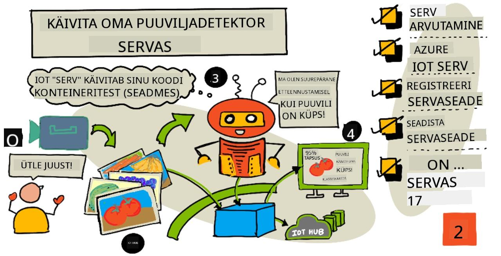
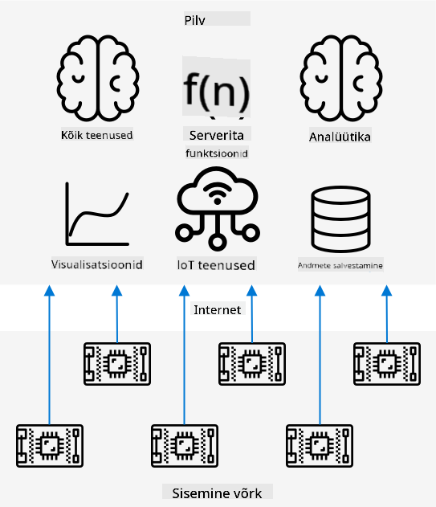
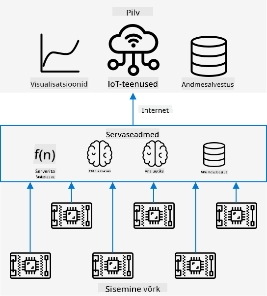
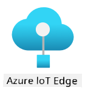
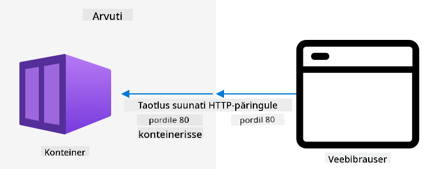
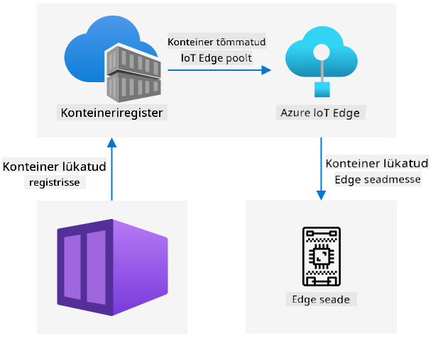

<!--
CO_OP_TRANSLATOR_METADATA:
{
  "original_hash": "2625af24587465c5547ae33d6cc000a5",
  "translation_date": "2025-10-11T11:42:03+00:00",
  "source_file": "4-manufacturing/lessons/3-run-fruit-detector-edge/README.md",
  "language_code": "et"
}
-->
# Käivita oma puuviljatuvastaja servas



> Visuaalne ülevaade: [Nitya Narasimhan](https://github.com/nitya). Klõpsa pildil, et näha suuremat versiooni.

See video annab ülevaate pildiklassifikaatorite käitamisest IoT-seadmetes, mis on selle õppetunni teema.

[](https://www.youtube.com/watch?v=_K5fqGLO8us)

## Eelloengu viktoriin

[Eelloengu viktoriin](https://black-meadow-040d15503.1.azurestaticapps.net/quiz/33)

## Sissejuhatus

Eelmises õppetunnis kasutasid sa oma pildiklassifikaatorit, et tuvastada küpsed ja toored puuviljad, saates IoT-seadme kaameraga tehtud pilte interneti kaudu pilveteenusesse. Sellised päringud võtavad aega, maksavad raha ja sõltuvalt kasutatava pildimaterjali tüübist võivad tekitada privaatsusprobleeme.

Selles õppetunnis õpid, kuidas käitada masinõppe (ML) mudeleid servas – IoT-seadmetes, mis töötavad sinu enda võrgus, mitte pilves. Sa õpid serva- ja pilvearvutuse eeliseid ja puudusi, kuidas oma AI-mudelit serva juurutada ning kuidas sellele IoT-seadmest ligi pääseda.

Selles õppetunnis käsitleme:

* [Serva-arvutus](../../../../../4-manufacturing/lessons/3-run-fruit-detector-edge)
* [Azure IoT Edge](../../../../../4-manufacturing/lessons/3-run-fruit-detector-edge)
* [IoT Edge seadme registreerimine](../../../../../4-manufacturing/lessons/3-run-fruit-detector-edge)
* [IoT Edge seadme seadistamine](../../../../../4-manufacturing/lessons/3-run-fruit-detector-edge)
* [Mudeli eksportimine](../../../../../4-manufacturing/lessons/3-run-fruit-detector-edge)
* [Konteineri ettevalmistamine juurutamiseks](../../../../../4-manufacturing/lessons/3-run-fruit-detector-edge)
* [Konteineri juurutamine](../../../../../4-manufacturing/lessons/3-run-fruit-detector-edge)
* [IoT Edge seadme kasutamine](../../../../../4-manufacturing/lessons/3-run-fruit-detector-edge)

## Serva-arvutus

Serva-arvutus tähendab IoT-andmete töötlemist võimalikult lähedal andmete genereerimise kohale. Selle asemel, et andmeid pilves töödelda, viiakse töötlemine pilve serva – sinu sisemisse võrku.



Senistes õppetundides kogusid seadmed andmeid ja saatsid need pilve analüüsimiseks, kus käitati serverivabasid funktsioone või AI-mudeleid.



Serva-arvutus tähendab, et osa pilveteenustest viiakse pilvest välja ja arvutitesse, mis töötavad samas võrgus kui IoT-seadmed, suheldes pilvega ainult vajadusel. Näiteks saab servaseadmetes käitada AI-mudeleid, et analüüsida puuviljade küpsust, ja saata pilve ainult analüüsitulemused, nagu küpsete ja toorete puuviljade arv.

✅ Mõtle IoT-rakendustele, mida oled seni loonud. Millised osad neist võiksid olla serva viidud?

### Eelised

Serva-arvutuse eelised on:

1. **Kiirus** – serva-arvutus sobib ajakriitiliste andmete jaoks, kuna toimingud tehakse samas võrgus kui seade, mitte interneti kaudu. See võimaldab suuremat kiirust, kuna sisemised võrgud võivad töötada oluliselt kiiremini kui internetiühendused, andmete liikudes palju lühemat vahemaad.

    > 💁 Kuigi internetiühendustes kasutatakse optilisi kaableid, mis võimaldavad andmetel liikuda valguse kiirusel, võib andmete liikumine pilveteenuse pakkujateni võtta aega. Näiteks kui sa saadad andmeid Euroopast USA pilveteenustesse, kulub vähemalt 28 ms, et andmed ületaksid Atlandi ookeani optilises kaablis, rääkimata ajast, mis kulub andmete saatmiseks kaablisse, elektriliste signaalide muundamiseks valgussignaalideks ja tagasi teisel pool, ning pilveteenuse pakkujani jõudmiseks.

    Serva-arvutus nõuab ka vähem võrguühendust, vähendades riski, et andmed aeglustuvad internetiühenduse piiratud ribalaiuse tõttu.

1. **Kaugjuurdepääs** – serva-arvutus töötab ka siis, kui ühenduvus on piiratud või puudub, või kui ühenduvus on liiga kallis pidevaks kasutamiseks. Näiteks humanitaarabi katastroofipiirkondades, kus infrastruktuur on piiratud, või arengumaades.

1. **Madalamad kulud** – andmete kogumine, salvestamine, analüüs ja toimingute käivitamine servaseadmes vähendab pilveteenuste kasutamist, mis võib vähendada IoT-rakenduse üldkulusid. Viimasel ajal on kasvanud serva-arvutuseks mõeldud seadmete, nagu AI kiirenduspaneelid (nt [Jetson Nano NVIDIA-lt](https://developer.nvidia.com/embedded/jetson-nano-developer-kit)), populaarsus, mis suudavad käitada AI-töökoormusi GPU-põhise riistvaraga seadmetes, mis maksavad alla 100 USA dollari.

1. **Privaatsus ja turvalisus** – serva-arvutusega jäävad andmed sinu võrku ega laadi üles pilve. See on sageli eelistatud tundliku ja isiklikult tuvastatava teabe puhul, eriti kuna andmeid ei pea pärast analüüsi salvestama, mis vähendab oluliselt andmelekkete riski. Näited hõlmavad meditsiinilisi andmeid ja turvakaamerate salvestusi.

1. **Ebaturvaliste seadmete haldamine** – kui sul on seadmeid, millel on teadaolevad turvavead ja mida sa ei soovi otse võrku või internetti ühendada, siis saad need ühendada eraldi võrku, mis on ühendatud IoT Edge väravaseadmega. See servaseade võib seejärel olla ühendatud sinu laiemasse võrku või internetti ja hallata andmevooge edasi-tagasi.

1. **Toetus ühilduvatele seadmetele** – kui sul on seadmeid, mis ei saa IoT Hubiga ühenduda, näiteks seadmed, mis saavad ühenduda ainult HTTP-ühenduste kaudu või seadmed, millel on ainult Bluetooth-ühendus, saad kasutada IoT Edge seadet väravaseadmena, mis edastab sõnumeid IoT Hubi.

✅ Tee uurimistööd: Millised muud eelised võivad serva-arvutusel olla?

### Puudused

Serva-arvutusel on ka puudusi, kus pilv võib olla eelistatud valik:

1. **Mastaapsus ja paindlikkus** – pilvearvutus saab reaalajas kohanduda võrgu- ja andmevajadustega, lisades või vähendades servereid ja muid ressursse. Rohkem servaarvuteid lisamiseks tuleb seadmeid käsitsi lisada.

1. **Usaldusväärsus ja vastupidavus** – pilvearvutus pakub mitut serverit sageli mitmes asukohas, et tagada varundamine ja katastroofide taastamine. Sama taseme varundamise saavutamiseks servas on vaja suuri investeeringuid ja palju konfiguratsioonitööd.

1. **Hooldus** – pilveteenuse pakkujad pakuvad süsteemi hooldust ja uuendusi.

✅ Tee uurimistööd: Millised muud puudused võivad serva-arvutusel olla?

Puudused on tegelikult pilve kasutamise eeliste vastandid – sa pead ise neid seadmeid ehitama ja haldama, selle asemel et tugineda pilveteenuse pakkujate ekspertteadmistele ja mastaapsusele.

Mõned riskid on serva-arvutuse olemuse tõttu leevendatud. Näiteks kui sul on servaseade, mis töötab tehases ja kogub andmeid masinatelt, ei pea sa mõtlema mõnele katastroofide taastamise stsenaariumile. Kui tehasele kaob vool, siis ei vaja sa varundusseadet, kuna masinad, mis genereerivad andmeid, mida servaseade töötleb, jäävad samuti vooluta.

IoT-süsteemide puhul soovid sageli kasutada pilve- ja serva-arvutuse kombinatsiooni, kasutades iga teenust vastavalt süsteemi, klientide ja hooldajate vajadustele.

## Azure IoT Edge



Azure IoT Edge on teenus, mis aitab sul viia töökoormused pilvest serva. Sa seadistad seadme servaseadmeks ja pilvest saad sellele servaseadmele koodi juurutada. See võimaldab sul kombineerida pilve ja serva võimalusi.

> 🎓 *Töökoormused* on termin, mis viitab igale teenusele, mis teeb mingit tööd, näiteks AI-mudelid, rakendused või serverivabad funktsioonid.

Näiteks saad treenida pildiklassifikaatori pilves ja seejärel juurutada selle servaseadmesse pilve kaudu. Sinu IoT-seade saadab seejärel pilte servaseadmele klassifitseerimiseks, mitte interneti kaudu. Kui vajad mudeli uut iteratsiooni, saad selle pilves treenida ja kasutada IoT Edge'i, et mudel servaseadmes uuendada.

> 🎓 Tarkvara, mis IoT Edge'ile juurutatakse, nimetatakse *mooduliteks*. Vaikimisi käitab IoT Edge mooduleid, mis suhtlevad IoT Hubiga, nagu `edgeAgent` ja `edgeHub` moodulid. Kui sa juurutad pildiklassifikaatori, juurutatakse see täiendava moodulina.

IoT Edge on IoT Hubi sisse ehitatud, nii et saad servaseadmeid hallata sama teenusega, mida kasutaksid IoT-seadmete haldamiseks, sama turvalisuse tasemega.

IoT Edge käitab koodi *konteineritest* – iseseisvatest rakendustest, mis töötavad eraldatult ülejäänud rakendustest sinu arvutis. Kui sa käitad konteinerit, toimib see nagu eraldi arvuti sinu arvutis, oma tarkvara, teenuste ja rakendustega. Enamasti ei saa konteinerid sinu arvutis midagi juurde pääseda, kui sa ei otsusta jagada näiteks kausta konteineriga. Konteiner avab teenused avatud pordi kaudu, millele saab ligi pääseda või võrku avada.



Näiteks saad konteineris käitada veebisaiti, mis töötab pordil 80, vaikimisi HTTP-port, ja seejärel avada selle oma arvutis samuti pordil 80.

✅ Tee uurimistööd: Loe konteinerite ja teenuste, nagu Docker või Moby, kohta.

Sa saad kasutada Custom Visioni, et alla laadida pildiklassifikaatoreid ja juurutada neid konteineritena, kas otse seadmesse või IoT Edge'i kaudu. Kui need töötavad konteineris, saab neile ligi pääseda sama REST API kaudu nagu pilveversioonile, kuid lõpp-punkt viitab servaseadmele, mis käitab konteinerit.

## IoT Edge seadme registreerimine

IoT Edge seadme kasutamiseks tuleb see IoT Hubis registreerida.

### Ülesanne – IoT Edge seadme registreerimine

1. Loo IoT Hub ressursigrupis `fruit-quality-detector`. Anna sellele unikaalne nimi, mis põhineb `fruit-quality-detector`-il.

1. Registreeri IoT Edge seade nimega `fruit-quality-detector-edge` oma IoT Hubis. Selleks kasutatav käsk on sarnane käsuga, mida kasutati mitte-servaseadme registreerimiseks, välja arvatud `--edge-enabled` lipu lisamine.

    ```sh
    az iot hub device-identity create --edge-enabled \
                                      --device-id fruit-quality-detector-edge \
                                      --hub-name <hub_name>
    ```

    Asenda `<hub_name>` oma IoT Hubi nimega.

1. Hangi oma seadme ühenduse string, kasutades järgmist käsku:

    ```sh
    az iot hub device-identity connection-string show --device-id fruit-quality-detector-edge \
                                                      --output table \
                                                      --hub-name <hub_name>
    ```

    Asenda `<hub_name>` oma IoT Hubi nimega.

    Kopeeri ühenduse string, mis kuvatakse väljundis.

## IoT Edge seadme seadistamine

Kui oled servaseadme registreerimise oma IoT Hubis loonud, saad servaseadme seadistada.

### Ülesanne – IoT Edge Runtime'i installimine ja käivitamine

**IoT Edge Runtime käitab ainult Linuxi konteinerid.** Seda saab käitada Linuxis või Windowsis, kasutades Linuxi virtuaalmasinaid.

* Kui kasutad Raspberry Pi-d oma IoT-seadmena, siis see töötab toetatud Linuxi versiooniga ja saab hostida IoT Edge Runtime'i. Järgi [Azure IoT Edge'i installimise juhendit Linuxile Microsofti dokumentatsioonis](https://docs.microsoft.com/azure/iot-edge/how-to-install-iot-edge?WT.mc_id=academic-17441-jabenn), et installida IoT Edge ja seadistada ühenduse string.

    > 💁 Pea meeles, et Raspberry Pi OS on Debian Linuxi variant.

* Kui sa ei kasuta Raspberry Pi-d, kuid sul on Linuxi arvuti, saad käitada IoT Edge Runtime'i. Järgi [Azure IoT Edge'i installimise juhendit Linuxile Microsofti dokumentatsioonis](https://docs.microsoft.com/azure/iot-edge/how-to-install-iot-edge?WT.mc_id=academic-17441-jabenn), et installida IoT Edge ja seadistada ühenduse string.

* Kui kasutad Windowsi, saad IoT Edge Runtime'i installida Linuxi virtuaalmasinasse, järgides [IoT Edge'i mooduli juurutamise kiirjuhendi sektsiooni Microsofti dokumentatsioonis](https://docs.microsoft.com/azure/iot-edge/quickstart?WT.mc_id=academic-17441-jabenn#install-and-start-the-iot-edge-runtime). Peatu, kui jõuad sektsiooni *Mooduli juurutamine*.

* Kui kasutad macOS-i, saad luua pilves virtuaalmasina (VM), mida kasutada oma IoT Edge seadmena. Need on arvutid, mida saad pilves luua ja interneti kaudu kasutada. Sa saad luua Linuxi VM-i, millel on IoT Edge installitud. Järgi [virtuaalmasina loomise juhendit, mis käitab IoT Edge'i](vm-iotedge.md), et saada juhiseid selle tegemiseks.

## Mudeli eksportimine

Et käitada klassifikaatorit servas, tuleb see Custom Visionist eksportida. Custom Vision suudab genereerida kahte tüüpi mudeleid – standardmudeleid ja kompaktmudeleid. Kompaktmudelid kasutavad erinevaid tehnikaid, et vähendada mudeli suurust, muutes selle piisavalt väikeseks, et seda saaks alla laadida ja IoT-seadmetes juurutada.
Kui lõite pildiklassifikaatori, kasutasite *Toidu* domeeni, mis on mudeli versioon, mis on optimeeritud toidupiltide treenimiseks. Custom Visionis saate oma projekti domeeni muuta, kasutades oma treeningandmeid uue domeeniga uue mudeli treenimiseks. Kõik Custom Visioni toetatud domeenid on saadaval nii standard- kui ka kompaktversioonidena.

### Ülesanne - treeni oma mudelit, kasutades Toidu (kompakt) domeeni

1. Avage Custom Vision portaal aadressil [CustomVision.ai](https://customvision.ai) ja logige sisse, kui te pole seda juba avanud. Seejärel avage oma projekt `fruit-quality-detector`.

1. Valige **Seaded** nupp (⚙ ikoon).

1. Valige *Domeenid* loendist *Toit (kompakt)*.

1. Veenduge, et jaotises *Ekspordi võimalused* oleks valitud *Põhiplatvormid (Tensorflow, CoreML, ONNX, ...)*.

1. Klõpsake Seadete lehe allosas **Salvesta muudatused**.

1. Treenige mudel uuesti, klõpsates **Treeni** nuppu ja valides *Kiirtreening*.

### Ülesanne - ekspordi oma mudel

Kui mudel on treenitud, tuleb see eksportida konteinerina.

1. Valige **Tulemuslikkus** vahekaart ja leidke oma viimane iteratsioon, mis treeniti kompaktsel domeenil.

1. Klõpsake ülaosas **Ekspordi** nuppu.

1. Valige **DockerFile**, seejärel valige versioon, mis sobib teie servaseadmega:

    * Kui kasutate IoT Edge'i Linuxi arvutis, Windowsi arvutis või virtuaalmasinas, valige *Linux* versioon.
    * Kui kasutate IoT Edge'i Raspberry Pi peal, valige *ARM (Raspberry Pi 3)* versioon.

    > 🎓 Docker on üks populaarsemaid tööriistu konteinerite haldamiseks ja DockerFile on juhiste kogum, kuidas konteinerit seadistada.

1. Valige **Ekspordi**, et lasta Custom Visionil luua vastavad failid, seejärel klõpsake **Laadi alla**, et need zip-failina alla laadida.

1. Salvestage failid oma arvutisse ja pakkige kaust lahti.

## Valmistage oma konteiner juurutamiseks ette



Kui olete oma mudeli alla laadinud, tuleb see ehitada konteineriks ja lükata konteineriregistrisse - veebipõhisesse asukohta, kus saate konteinerid salvestada. Seejärel saab IoT Edge konteineri registrist alla laadida ja teie seadmesse lükata.


Selles õppetükis kasutatav konteineriregister on Azure Container Registry. See ei ole tasuta teenus, seega raha säästmiseks veenduge, et [puhastate oma projekti](../../../clean-up.md), kui olete lõpetanud.

> 💁 Azure Container Registry kasutamise kulusid saate vaadata [Azure Container Registry hinnakujunduse lehelt](https://azure.microsoft.com/pricing/details/container-registry/?WT.mc_id=academic-17441-jabenn).

### Ülesanne - installige Docker

Klassifikaatori ehitamiseks ja juurutamiseks peate võib-olla installima [Docker](https://www.docker.com/).

Seda on vaja teha ainult siis, kui plaanite konteinerit ehitada teises seadmes kui see, kuhu installisite IoT Edge'i - IoT Edge'i installimise osana installitakse ka Docker.

1. Kui ehitate Docker konteinerit teises seadmes kui teie IoT Edge seade, järgige [Docker installimise lehel](https://www.docker.com/products/docker-desktop) toodud juhiseid, et installida Docker Desktop või Docker engine. Veenduge, et see töötab pärast installimist.

### Ülesanne - looge konteineriregistri ressurss

1. Käivitage oma terminalist või käsurealt järgmine käsk, et luua Azure Container Registry ressurss:

    ```sh
    az acr create --resource-group fruit-quality-detector \
                  --sku Basic \
                  --name <Container registry name>
    ```

    Asendage `<Container registry name>` unikaalse nimega oma konteineriregistrile, kasutades ainult tähti ja numbreid. Põhinege sellel `fruitqualitydetector`. See nimi muutub osaks URL-ist, mille kaudu pääseb konteineriregistrile ligi, seega peab see olema globaalselt unikaalne.

1. Logige Azure Container Registry'sse sisse järgmise käsuga:

    ```sh
    az acr login --name <Container registry name>
    ```

    Asendage `<Container registry name>` nimega, mida kasutasite oma konteineriregistri jaoks.

1. Lülitage konteineriregister administraatorirežiimi, et saaksite genereerida parooli, kasutades järgmist käsku:

    ```sh
    az acr update --admin-enabled true \
                 --name <Container registry name>
    ```

    Asendage `<Container registry name>` nimega, mida kasutasite oma konteineriregistri jaoks.

1. Genereerige oma konteineriregistri paroolid järgmise käsuga:

    ```sh
     az acr credential renew --password-name password \
                             --output table \
                             --name <Container registry name>
    ```

    Asendage `<Container registry name>` nimega, mida kasutasite oma konteineriregistri jaoks.

    Kopeerige `PASSWORD` väärtus, kuna vajate seda hiljem.

### Ülesanne - ehitage oma konteiner

Custom Visionist alla laaditud fail oli DockerFile, mis sisaldab juhiseid, kuidas konteinerit ehitada, koos rakenduskoodiga, mis töötab konteineri sees, et majutada teie kohandatud visioonimudelit ja REST API-d selle kutsumiseks. Saate kasutada Dockeri, et ehitada DockerFile'ist märgistatud konteiner ja seejärel lükata see oma konteineriregistrisse.

> 🎓 Konteineritele antakse silt, mis määratleb nende nime ja versiooni. Kui peate konteinerit uuendama, saate selle ehitada sama sildiga, kuid uuema versiooniga.

1. Avage oma terminal või käsurida ja liikuge lahti pakitud mudeli kausta, mille te Custom Visionist alla laadisite.

1. Käivitage järgmine käsk, et ehitada ja sildistada pilt:

    ```sh
    docker build --platform <platform> -t <Container registry name>.azurecr.io/classifier:v1 .
    ```

    Asendage `<platform>` platvormiga, millel see konteiner töötab. Kui kasutate IoT Edge'i Raspberry Pi peal, seadke see `linux/armhf`, vastasel juhul seadke see `linux/amd64`.

    > 💁 Kui käivitate selle käsu seadmest, kus te IoT Edge'i käitate, näiteks Raspberry Pi-st, võite jätta välja osa `--platform <platform>`, kuna see vaikimisi vastab praegusele platvormile.

    Asendage `<Container registry name>` nimega, mida kasutasite oma konteineriregistri jaoks.

    > 💁 Kui kasutate Linuxi või Raspberry Pi OS-i, peate võib-olla selle käsu käivitamiseks kasutama `sudo`.

    Docker ehitab pildi, konfigureerides kogu vajaliku tarkvara. Seejärel märgistatakse pilt kui `classifier:v1`.

    ```output
    ➜  d4ccc45da0bb478bad287128e1274c3c.DockerFile.Linux docker build --platform linux/amd64 -t  fruitqualitydetectorjimb.azurecr.io/classifier:v1 .
    [+] Building 102.4s (11/11) FINISHED
     => [internal] load build definition from Dockerfile
     => => transferring dockerfile: 131B
     => [internal] load .dockerignore
     => => transferring context: 2B
     => [internal] load metadata for docker.io/library/python:3.7-slim
     => [internal] load build context
     => => transferring context: 905B
     => [1/6] FROM docker.io/library/python:3.7-slim@sha256:b21b91c9618e951a8cbca5b696424fa5e820800a88b7e7afd66bba0441a764d6
     => => resolve docker.io/library/python:3.7-slim@sha256:b21b91c9618e951a8cbca5b696424fa5e820800a88b7e7afd66bba0441a764d6
     => => sha256:b4d181a07f8025e00e0cb28f1cc14613da2ce26450b80c54aea537fa93cf3bda 27.15MB / 27.15MB
     => => sha256:de8ecf497b753094723ccf9cea8a46076e7cb845f333df99a6f4f397c93c6ea9 2.77MB / 2.77MB
     => => sha256:707b80804672b7c5d8f21e37c8396f319151e1298d976186b4f3b76ead9f10c8 10.06MB / 10.06MB
     => => sha256:b21b91c9618e951a8cbca5b696424fa5e820800a88b7e7afd66bba0441a764d6 1.86kB / 1.86kB
     => => sha256:44073386687709c437586676b572ff45128ff1f1570153c2f727140d4a9accad 1.37kB / 1.37kB
     => => sha256:3d94f0f2ca798607808b771a7766f47ae62a26f820e871dd488baeccc69838d1 8.31kB / 8.31kB
     => => sha256:283715715396fd56d0e90355125fd4ec57b4f0773f306fcd5fa353b998beeb41 233B / 233B
     => => sha256:8353afd48f6b84c3603ea49d204bdcf2a1daada15f5d6cad9cc916e186610a9f 2.64MB / 2.64MB
     => => extracting sha256:b4d181a07f8025e00e0cb28f1cc14613da2ce26450b80c54aea537fa93cf3bda
     => => extracting sha256:de8ecf497b753094723ccf9cea8a46076e7cb845f333df99a6f4f397c93c6ea9
     => => extracting sha256:707b80804672b7c5d8f21e37c8396f319151e1298d976186b4f3b76ead9f10c8
     => => extracting sha256:283715715396fd56d0e90355125fd4ec57b4f0773f306fcd5fa353b998beeb41
     => => extracting sha256:8353afd48f6b84c3603ea49d204bdcf2a1daada15f5d6cad9cc916e186610a9f
     => [2/6] RUN pip install -U pip
     => [3/6] RUN pip install --no-cache-dir numpy~=1.17.5 tensorflow~=2.0.2 flask~=1.1.2 pillow~=7.2.0
     => [4/6] RUN pip install --no-cache-dir mscviplib==2.200731.16
     => [5/6] COPY app /app
     => [6/6] WORKDIR /app
     => exporting to image
     => => exporting layers
     => => writing image sha256:1846b6f134431f78507ba7c079358ed66d944c0e185ab53428276bd822400386
     => => naming to fruitqualitydetectorjimb.azurecr.io/classifier:v1
    ```

### Ülesanne - lükake oma konteiner konteineriregistrisse

1. Kasutage järgmist käsku, et lükata oma konteiner konteineriregistrisse:

    ```sh
    docker push <Container registry name>.azurecr.io/classifier:v1
    ```

    Asendage `<Container registry name>` nimega, mida kasutasite oma konteineriregistri jaoks.

    > 💁 Kui kasutate Linuxi, peate võib-olla selle käsu käivitamiseks kasutama `sudo`.

    Konteiner lükatakse konteineriregistrisse.

    ```output
    ➜  d4ccc45da0bb478bad287128e1274c3c.DockerFile.Linux docker push fruitqualitydetectorjimb.azurecr.io/classifier:v1
    The push refers to repository [fruitqualitydetectorjimb.azurecr.io/classifier]
    5f70bf18a086: Pushed 
    8a1ba9294a22: Pushed 
    56cf27184a76: Pushed 
    b32154f3f5dd: Pushed 
    36103e9a3104: Pushed 
    e2abb3cacca0: Pushed 
    4213fd357bbe: Pushed 
    7ea163ba4dce: Pushed 
    537313a13d90: Pushed 
    764055ebc9a7: Pushed 
    v1: digest: sha256:ea7894652e610de83a5a9e429618e763b8904284253f4fa0c9f65f0df3a5ded8 size: 2423
    ```

1. Veendumaks, et konteiner on lükatud, saate loetleda oma registris olevad konteinerid järgmise käsuga:

    ```sh
    az acr repository list --output table \
                           --name <Container registry name> 
    ```

    Asendage `<Container registry name>` nimega, mida kasutasite oma konteineriregistri jaoks.

    ```output
    ➜  d4ccc45da0bb478bad287128e1274c3c.DockerFile.Linux az acr repository list --name fruitqualitydetectorjimb --output table
    Result
    ----------
    classifier
    ```

    Näete väljundis oma klassifikaatorit.

## Juurutage oma konteiner

Nüüd saab teie konteineri juurutada teie IoT Edge seadmesse. Juurutamiseks peate määratlema juurutusmanifesti - JSON-dokumendi, mis loetleb moodulid, mis servaseadmesse juurutatakse.

### Ülesanne - looge juurutusmanifest

1. Looge oma arvutis uus fail nimega `deployment.json`.

1. Lisage sellesse faili järgmine sisu:

    ```json
    {
        "content": {
            "modulesContent": {
                "$edgeAgent": {
                    "properties.desired": {
                        "schemaVersion": "1.1",
                        "runtime": {
                            "type": "docker",
                            "settings": {
                                "minDockerVersion": "v1.25",
                                "loggingOptions": "",
                                "registryCredentials": {
                                    "ClassifierRegistry": {
                                        "username": "<Container registry name>",
                                        "password": "<Container registry password>",
                                        "address": "<Container registry name>.azurecr.io"
                                      }
                                }
                            }
                        },
                        "systemModules": {
                            "edgeAgent": {
                                "type": "docker",
                                "settings": {
                                    "image": "mcr.microsoft.com/azureiotedge-agent:1.1",
                                    "createOptions": "{}"
                                }
                            },
                            "edgeHub": {
                                "type": "docker",
                                "status": "running",
                                "restartPolicy": "always",
                                "settings": {
                                    "image": "mcr.microsoft.com/azureiotedge-hub:1.1",
                                    "createOptions": "{\"HostConfig\":{\"PortBindings\":{\"5671/tcp\":[{\"HostPort\":\"5671\"}],\"8883/tcp\":[{\"HostPort\":\"8883\"}],\"443/tcp\":[{\"HostPort\":\"443\"}]}}}"
                                }
                            }
                        },
                        "modules": {
                            "ImageClassifier": {
                                "version": "1.0",
                                "type": "docker",
                                "status": "running",
                                "restartPolicy": "always",
                                "settings": {
                                    "image": "<Container registry name>.azurecr.io/classifier:v1",
                                    "createOptions": "{\"ExposedPorts\": {\"80/tcp\": {}},\"HostConfig\": {\"PortBindings\": {\"80/tcp\": [{\"HostPort\": \"80\"}]}}}"
                                }
                            }
                        }
                    }
                },
                "$edgeHub": {
                    "properties.desired": {
                        "schemaVersion": "1.1",
                        "routes": {
                            "upstream": "FROM /messages/* INTO $upstream"
                        },
                        "storeAndForwardConfiguration": {
                            "timeToLiveSecs": 7200
                        }
                    }
                }
            }
        }
    }
    ```

    > 💁 Selle faili leiate kaustast [code-deployment/deployment](../../../../../4-manufacturing/lessons/3-run-fruit-detector-edge/code-deployment/deployment).

    Asendage kolm `ImageClassifier` mooduli ja `registryCredentials` jaotises olevat `<Container registry name>` oma konteineriregistri nimega.

    Asendage `registryCredentials` jaotises `<Container registry password>` oma konteineriregistri parooliga.

1. Käivitage kaustast, mis sisaldab teie juurutusmanifesti, järgmine käsk:

    ```sh
    az iot edge set-modules --device-id fruit-quality-detector-edge \
                            --content deployment.json \
                            --hub-name <hub_name>
    ```

    Asendage `<hub_name>` oma IoT Hubi nimega.

    Pildiklassifikaatori moodul juurutatakse teie servaseadmesse.

### Ülesanne - veenduge, et klassifikaator töötab

1. Ühendage IoT Edge seadmega:

    * Kui kasutate IoT Edge'i käitamiseks Raspberry Pi-d, ühendage ssh kaudu kas oma terminalist või VS Code'i kaug-SSH seansiga.
    * Kui käitate IoT Edge'i Linuxi konteineris Windowsis, järgige [juhendit eduka konfiguratsiooni kontrollimiseks](https://docs.microsoft.com/azure/iot-edge/how-to-install-iot-edge-on-windows?WT.mc_id=academic-17441-jabenn&view=iotedge-2018-06&tabs=powershell#verify-successful-configuration), et IoT Edge seadmega ühenduda.
    * Kui käitate IoT Edge'i virtuaalmasinas, saate masinasse SSH kaudu sisse logida, kasutades `adminUsername` ja `password`, mille määrasite VM-i loomisel, ning kasutades kas IP-aadressi või DNS-nime:

        ```sh
        ssh <adminUsername>@<IP address>
        ```

        Või:

        ```sh
        ssh <adminUsername>@<DNS Name>
        ```

        Sisestage parool, kui seda küsitakse.

1. Kui olete ühendatud, käivitage järgmine käsk, et saada IoT Edge moodulite loend:

    ```sh
    iotedge list
    ```

    > 💁 Võimalik, et peate selle käsu käivitamiseks kasutama `sudo`.

    Näete töötavaid mooduleid:

    ```output
    jim@fruit-quality-detector-jimb:~$ iotedge list
    NAME             STATUS           DESCRIPTION      CONFIG
    ImageClassifier  running          Up 42 minutes    fruitqualitydetectorjimb.azurecr.io/classifier:v1
    edgeAgent        running          Up 42 minutes    mcr.microsoft.com/azureiotedge-agent:1.1
    edgeHub          running          Up 42 minutes    mcr.microsoft.com/azureiotedge-hub:1.1
    ```

1. Kontrollige pildiklassifikaatori mooduli logisid järgmise käsuga:

    ```sh
    iotedge logs ImageClassifier
    ```

    > 💁 Võimalik, et peate selle käsu käivitamiseks kasutama `sudo`.

    ```output
    jim@fruit-quality-detector-jimb:~$ iotedge logs ImageClassifier
    2021-07-05 20:30:15.387144: I tensorflow/core/platform/cpu_feature_guard.cc:142] Your CPU supports instructions that this TensorFlow binary was not compiled to use: AVX2 FMA
    2021-07-05 20:30:15.392185: I tensorflow/core/platform/profile_utils/cpu_utils.cc:94] CPU Frequency: 2394450000 Hz
    2021-07-05 20:30:15.392712: I tensorflow/compiler/xla/service/service.cc:168] XLA service 0x55ed9ac83470 executing computations on platform Host. Devices:
    2021-07-05 20:30:15.392806: I tensorflow/compiler/xla/service/service.cc:175]   StreamExecutor device (0): Host, Default Version
    Loading model...Success!
    Loading labels...2 found. Success!
     * Serving Flask app "app" (lazy loading)
     * Environment: production
       WARNING: This is a development server. Do not use it in a production deployment.
       Use a production WSGI server instead.
     * Debug mode: off
     * Running on http://0.0.0.0:80/ (Press CTRL+C to quit)
    ```

### Ülesanne - testige pildiklassifikaatorit

1. Saate kasutada CURL-i, et testida pildiklassifikaatorit, kasutades IoT Edge agendi käitava arvuti IP-aadressi või hostinime. Leidke IP-aadress:

    * Kui olete samas masinas, kus IoT Edge töötab, saate hostinimena kasutada `localhost`.
    * Kui kasutate VM-i, saate kasutada kas VM-i IP-aadressi või DNS-nime.
    * Vastasel juhul saate IoT Edge'i käitava masina IP-aadressi teada saada järgmiselt:
      * Windows 10 puhul järgige [kuidas leida oma IP-aadressi juhendit](https://support.microsoft.com/windows/find-your-ip-address-f21a9bbc-c582-55cd-35e0-73431160a1b9?WT.mc_id=academic-17441-jabenn).
      * macOS-i puhul järgige [kuidas leida oma IP-aadressi Macis juhendit](https://www.hellotech.com/guide/for/how-to-find-ip-address-on-mac).
      * Linuxi puhul järgige jaotist privaatse IP-aadressi leidmise kohta [kuidas leida oma IP-aadressi Linuxis juhendist](https://opensource.com/article/18/5/how-find-ip-address-linux).

1. Saate konteinerit testida kohaliku failiga, käivitades järgmise curl-käsu:

    ```sh
    curl --location \
         --request POST 'http://<IP address or name>/image' \
         --header 'Content-Type: image/png' \
         --data-binary '@<file_Name>' 
    ```

    Asendage `<IP address or name>` IoT Edge'i käitava arvuti IP-aadressi või hostinimega. Asendage `<file_Name>` testitava faili nimega.

    Näete väljundis prognoositulemusi:

    ```output
    {
        "created": "2021-07-05T21:44:39.573181",
        "id": "",
        "iteration": "",
        "predictions": [
            {
                "boundingBox": null,
                "probability": 0.9995615482330322,
                "tagId": "",
                "tagName": "ripe"
            },
            {
                "boundingBox": null,
                "probability": 0.0004384400090202689,
                "tagId": "",
                "tagName": "unripe"
            }
        ],
        "project": ""
    }
    ```

    > 💁 Siin ei ole vaja esitada prognoosivõtit, kuna see ei kasuta Azure'i ressurssi. Selle asemel konfigureeritakse turvalisus sisemise võrgu põhjal, mitte avaliku lõpp-punkti ja API-võtme kasutamise kaudu.

## Kasutage oma IoT Edge seadet

Nüüd, kui teie pildiklassifikaator on juurutatud IoT Edge seadmesse, saate seda oma IoT seadmega kasutada.

### Ülesanne - kasutage oma IoT Edge seadet

Töötage läbi vastav juhend, et klassifitseerida pilte, kasutades IoT Edge klassifikaatorit:

* [Arduino - Wio Terminal](wio-terminal.md)
* [Üheplaadiarvuti - Raspberry Pi/virtuaalne IoT seade](single-board-computer.md)

### Mudeli uuesti treenimine

Üks puudus pildiklassifikaatorite käitamisel IoT Edge'il on see, et need ei ole ühendatud teie Custom Vision projektiga. Kui vaatate Custom Visioni **Prognoosid** vahekaarti, ei näe te pilte, mida klassifitseeriti Edge-põhise klassifikaatori abil.

See on ootuspärane käitumine - pilte ei saadeta pilve klassifitseerimiseks, seega ei ole need pilves saadaval. Üks IoT Edge'i kasutamise eeliseid on privaatsus, tagades, et pildid ei lahku teie võrgust, teine on võimalus töötada võrguühenduseta, ilma et oleks vaja pilte üles laadida, kui seadmel pole internetiühendust. Puuduseks on aga mudeli täiustamine - peate rakendama mõne muu viisi piltide salvestamiseks, mida saab käsitsi uuesti klassifitseerida, et pildiklassifikaatorit täiustada ja uuesti treenida.

✅ Mõelge viisidele, kuidas pilte üles laadida, et klassifikaatorit uuesti treenida.

---

## 🚀 Väljakutse

Tehisintellekti mudelite käitamine servaseadmetel võib olla kiirem kui pilves - võrguühendus on lühem. Samas võivad need olla aeglasemad, kuna mudelit käitav riistvara ei pruugi olla nii võimas kui pilves.

Tehke ajamõõtmisi ja võrrelge, kas kõne teie servaseadmele on kiirem või aeglasem kui kõne pilvele? Mõelge põhjustele, mis võivad seletada erinevust või selle puudumist. Uurige viise, kuidas tehisintellekti mudeleid servas kiiremini käitada, kasutades spetsiaalset riistvara.

## Loengu järgse viktoriini
[Loengu järgne viktoriin](https://black-meadow-040d15503.1.azurestaticapps.net/quiz/34)

## Ülevaade ja iseseisev õppimine

* Loe rohkem konteinerite kohta [OS-taseme virtualiseerimise lehelt Wikipedias](https://wikipedia.org/wiki/OS-level_virtualization)
* Loe rohkem servtöötluse kohta, keskendudes sellele, kuidas 5G aitab servtöötlust laiendada, artiklist [Mis on servtöötlus ja miks see oluline on? NetworkWorldis](https://www.networkworld.com/article/3224893/what-is-edge-computing-and-how-its-changing-the-network.html)
* Õpi rohkem tehisintellekti teenuste käitamisest IoT Edge'is, vaadates [õpi kasutama Azure IoT Edge'i eelvalmistatud AI-teenusel servas keele tuvastamiseks episoodi Learn Live'ist Microsoft Channel9-s](https://channel9.msdn.com/Shows/Learn-Live/Sharpen-Your-AI-Edge-Skills-Episode-4-Learn-How-to-Use-Azure-IoT-Edge-on-a-Pre-Built-AI-Service-on-t?WT.mc_id=academic-17441-jabenn)

## Ülesanne

[Käivita teised teenused servas](assignment.md)

---

**Lahtiütlus**:  
See dokument on tõlgitud AI tõlketeenuse [Co-op Translator](https://github.com/Azure/co-op-translator) abil. Kuigi püüame tagada täpsust, palume arvestada, et automaatsed tõlked võivad sisaldada vigu või ebatäpsusi. Algne dokument selle algses keeles tuleks pidada autoriteetseks allikaks. Olulise teabe puhul soovitame kasutada professionaalset inimtõlget. Me ei vastuta selle tõlke kasutamisest tulenevate arusaamatuste või valesti tõlgenduste eest.