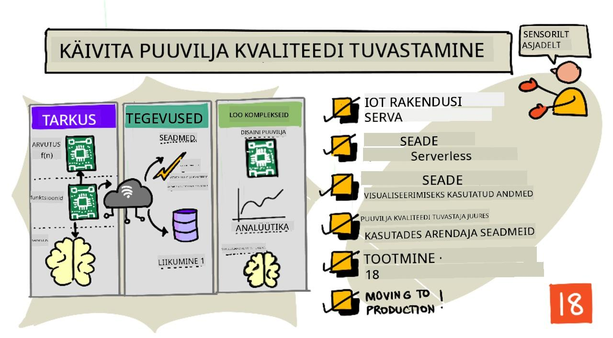
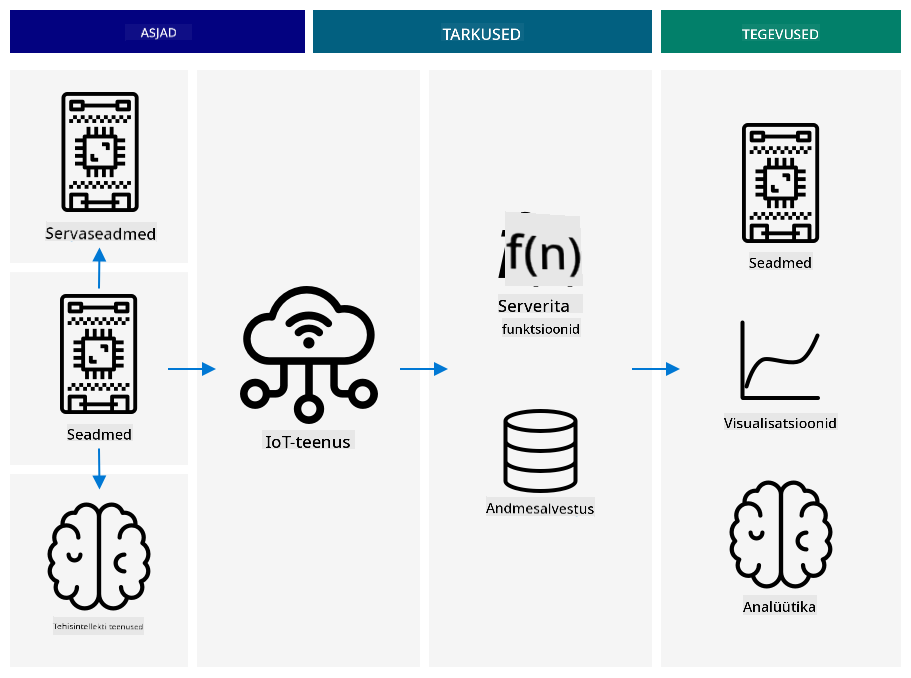
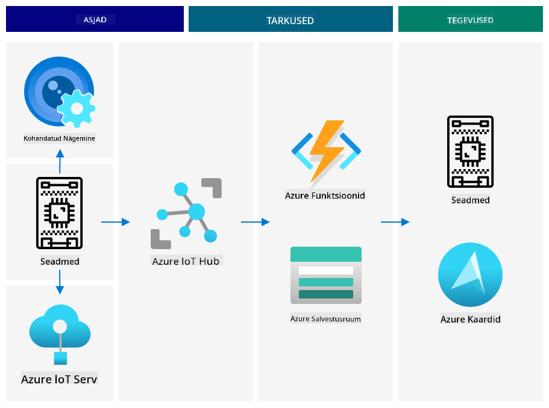
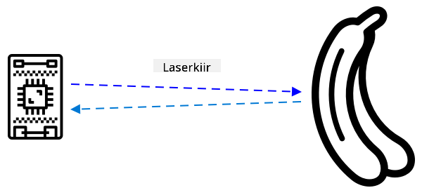
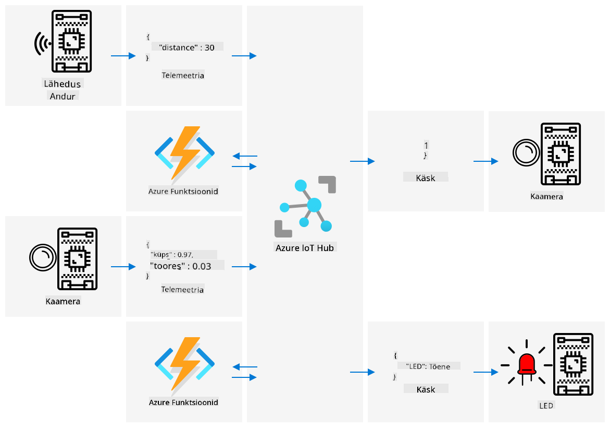

<!--
CO_OP_TRANSLATOR_METADATA:
{
  "original_hash": "f74f4ccb61f00e5f7e9f49c3ed416e36",
  "translation_date": "2025-10-11T11:51:57+00:00",
  "source_file": "4-manufacturing/lessons/4-trigger-fruit-detector/README.md",
  "language_code": "et"
}
-->
# Käivita puuviljade kvaliteedi tuvastamine sensori abil



> Visuaalne ülevaade: [Nitya Narasimhan](https://github.com/nitya). Klõpsa pildil, et näha suuremat versiooni.

## Eelloengu viktoriin

[Eelloengu viktoriin](https://black-meadow-040d15503.1.azurestaticapps.net/quiz/35)

## Sissejuhatus

IoT-rakendus ei ole lihtsalt üks seade, mis kogub andmeid ja saadab need pilve. Sageli on tegemist mitme seadmega, mis töötavad koos, et koguda andmeid füüsilisest maailmast sensorite abil, teha otsuseid nende andmete põhjal ja suhelda tagasi füüsilise maailmaga aktuaatorite või visualiseerimiste kaudu.

Selles õppetunnis õpid rohkem keerukate IoT-rakenduste arhitektuurist, mitme sensori ja pilveteenuse integreerimisest andmete analüüsimiseks ja salvestamiseks ning vastuse näitamisest aktuaatori kaudu. Õpid, kuidas arhitektuurida puuviljade kvaliteedikontrolli süsteemi prototüüpi, sealhulgas kasutada lähedussensoreid IoT-rakenduse käivitamiseks ja milline oleks selle prototüübi arhitektuur.

Selles õppetunnis käsitleme:

* [Keerukate IoT-rakenduste arhitektuur](../../../../../4-manufacturing/lessons/4-trigger-fruit-detector)
* [Puuviljade kvaliteedikontrolli süsteemi disain](../../../../../4-manufacturing/lessons/4-trigger-fruit-detector)
* [Puuviljade kvaliteedi kontrolli käivitamine sensorist](../../../../../4-manufacturing/lessons/4-trigger-fruit-detector)
* [Puuviljade kvaliteedi tuvastamiseks kasutatavad andmed](../../../../../4-manufacturing/lessons/4-trigger-fruit-detector)
* [Arendusseadmete kasutamine mitme IoT-seadme simuleerimiseks](../../../../../4-manufacturing/lessons/4-trigger-fruit-detector)
* [Üleminek tootmisele](../../../../../4-manufacturing/lessons/4-trigger-fruit-detector)

> 🗑 See on selle projekti viimane õppetund, nii et pärast õppetunni ja ülesande lõpetamist ärge unustage oma pilveteenuseid puhastada. Teenuseid on vaja ülesande täitmiseks, seega veenduge, et teete selle kõigepealt ära.
>
> Vajadusel vaadake juhiseid [projekti puhastamise juhendist](../../../clean-up.md).

## Keerukate IoT-rakenduste arhitektuur

IoT-rakendused koosnevad paljudest komponentidest, sealhulgas erinevatest seadmetest ja internetiteenustest.

IoT-rakendusi saab kirjeldada kui *asju* (seadmeid), mis saadavad andmeid, mis genereerivad *teadmisi*. Need *teadmised* loovad *tegevusi*, et parandada äri või protsessi. Näiteks mootor (asi), mis saadab temperatuuriandmeid. Neid andmeid kasutatakse mootori jõudluse hindamiseks (teadmine). Teadmist kasutatakse mootori hoolduskava proaktiivseks prioriteetide seadmiseks (tegevus).

* Erinevad asjad koguvad erinevaid andmeid.
* IoT-teenused annavad teadmisi nende andmete põhjal, mõnikord täiendades neid täiendavate allikate andmetega.
* Need teadmised juhivad tegevusi, sealhulgas aktuaatorite juhtimist seadmetes või andmete visualiseerimist.

### IoT arhitektuuri näidis



Ülaltoodud diagramm näitab IoT arhitektuuri näidist.

> 🎓 *Näidis arhitektuur* on näide arhitektuurist, mida saab kasutada uute süsteemide kavandamisel. Sel juhul, kui ehitaksite uut IoT-süsteemi, võite järgida näidis arhitektuuri, asendades oma seadmed ja teenused vastavalt vajadusele.

* **Asjad** on seadmed, mis koguvad andmeid sensoritest, võib-olla suheldes servateenustega, et neid andmeid tõlgendada, näiteks pildiklassifikaatoritega pildiandmete tõlgendamiseks. Seadmete andmed saadetakse IoT-teenusele.
* **Teadmised** pärinevad serverivabadest rakendustest või analüüsidest, mis tehakse salvestatud andmetel.
* **Tegevused** võivad olla käsklused, mis saadetakse seadmetele, või andmete visualiseerimine, mis võimaldab inimestel otsuseid teha.



Ülaltoodud diagramm näitab mõningaid komponente ja teenuseid, mida on seni õppetundides käsitletud, ja kuidas need IoT arhitektuuri näidises omavahel seotud on.

* **Asjad** - olete kirjutanud seadmekoodi, et koguda andmeid sensoritest ja analüüsida pilte Custom Visioni abil, mis töötab nii pilves kui servaseadmel. Need andmed saadeti IoT Hubi.
* **Teadmised** - olete kasutanud Azure Functions'i, et reageerida IoT Hubi saadetud sõnumitele, ja salvestanud andmeid hilisemaks analüüsiks Azure Storage'is.
* **Tegevused** - olete juhtinud aktuaatoreid pilves tehtud otsuste ja seadmetele saadetud käskude põhjal ning visualiseerinud andmeid Azure Mapsi abil.

✅ Mõelge teistele IoT-seadmetele, mida olete kasutanud, näiteks nutikodu seadmed. Millised on selle seadme ja tarkvara puhul asjad, teadmised ja tegevused?

Seda mustrit saab skaleerida nii suureks või väikeseks, kui vaja, lisades rohkem seadmeid ja teenuseid.

### Andmed ja turvalisus

Süsteemi arhitektuuri määratlemisel peate pidevalt arvestama andmete ja turvalisusega.

* Milliseid andmeid teie seade saadab ja vastu võtab?
* Kuidas peaks neid andmeid turvama ja kaitsma?
* Kuidas peaks seadme ja pilveteenuse juurdepääsu kontrollima?

✅ Mõelge oma IoT-seadmete andmete turvalisusele. Kui palju neist andmetest on isiklikud ja tuleks hoida privaatsena, nii edastamisel kui salvestamisel? Milliseid andmeid ei tohiks salvestada?

## Puuviljade kvaliteedikontrolli süsteemi disain

Võtame nüüd idee asjadest, teadmistest ja tegevustest ning rakendame seda meie puuviljade kvaliteedi tuvastamise süsteemile, et disainida suurem otsast lõpuni rakendus.

Kujutage ette, et teile on antud ülesanne ehitada puuviljade kvaliteedi tuvastamise süsteem, mida kasutatakse töötlemistehases. Puuviljad liiguvad konveierilindil, kus praegu töötajad kontrollivad puuvilju käsitsi ja eemaldavad kõik toored puuviljad. Kulude vähendamiseks soovib tehase omanik automatiseeritud süsteemi.

✅ Üks IoT (ja tehnoloogia üldiselt) tõusuga seotud suundumusi on see, et käsitsi tehtavad tööd asendatakse masinatega. Tehke uurimistööd: Kui palju töökohti hinnanguliselt kaob IoT tõttu? Kui palju uusi töökohti luuakse IoT-seadmete ehitamiseks?

Te peate ehitama süsteemi, kus puuviljad tuvastatakse nende saabumisel konveierilindile, neid pildistatakse ja kontrollitakse AI-mudeli abil, mis töötab servaseadmel. Tulemused saadetakse pilve salvestamiseks ja kui puuviljad on toored, antakse teade, et toored puuviljad saaks eemaldada.

|   |   |
| - | - |
| **Asjad** | Detektor puuviljade saabumise tuvastamiseks konveierilindil<br>Kaamera puuviljade pildistamiseks ja klassifitseerimiseks<br>Servaseade, mis käitab klassifikaatorit<br>Seade, mis teavitab toorest puuviljast |
| **Teadmised** | Otsus kontrollida puuviljade küpsust<br>Klassifikatsiooni tulemuste salvestamine<br>Määramine, kas on vaja teavitada toorest puuviljast |
| **Tegevused** | Käskluse saatmine seadmele puuviljade pildistamiseks ja pildiklassifikaatoriga kontrollimiseks<br>Käskluse saatmine seadmele, et teavitada toorest puuviljast |

### Rakenduse prototüüpimine


Ülaltoodud diagramm näitab selle prototüübi rakenduse arhitektuuri näidist.

* IoT-seade koos lähedussensoriga tuvastab puuviljade saabumise. See saadab pilve sõnumi, et puuviljad on tuvastatud.
* Pilves serverivaba rakendus saadab käskluse teisele seadmele, et teha foto ja klassifitseerida pilt.
* IoT-seade koos kaameraga teeb pildi ja saadab selle servaseadmel töötavale pildiklassifikaatorile. Tulemused saadetakse pilve.
* Pilves serverivaba rakendus salvestab selle teabe hilisemaks analüüsiks, et näha, kui suur protsent puuviljadest on toored. Kui puuviljad on toored, saadab see käskluse teisele IoT-seadmele, et teavitada tehase töötajaid toorest puuviljast LED-i kaudu.

> 💁 Kogu IoT-rakenduse võiks rakendada ühe seadmena, kus kogu loogika pildiklassifikatsiooni käivitamiseks ja LED-i juhtimiseks on sisse ehitatud. Seda võiks kasutada IoT Hubi ainult toorete puuviljade arvu jälgimiseks ja seadme konfigureerimiseks. Selles õppetunnis on see laiendatud, et demonstreerida suuremahuliste IoT-rakenduste kontseptsioone.

Prototüübi jaoks rakendate kõik selle ühe seadme peal. Kui kasutate mikrokontrollerit, siis kasutate pildiklassifikaatori käitamiseks eraldi servaseadet. Te olete juba õppinud enamikku asju, mida vajate selle ehitamiseks.

## Puuviljade kvaliteedi kontrolli käivitamine sensorist

IoT-seade vajab mingisugust käivitust, et näidata, millal puuviljad on valmis klassifitseerimiseks. Üks käivitusviis oleks mõõta, millal puuviljad on konveierilindil õiges asukohas, mõõtes kaugust sensorini.



Lähedussensoreid saab kasutada sensori ja objekti vahelise kauguse mõõtmiseks. Tavaliselt edastavad need elektromagnetilise kiirguse kiirt, näiteks laserkiirt või infrapunavalgust, ja tuvastavad kiirguse, mis põrkub objektist tagasi. Aeg, mis kulub laserkiire saatmisest kuni signaali tagasi põrkumiseni, võimaldab arvutada sensori kauguse objektist.

> 💁 Tõenäoliselt olete kasutanud lähedussensoreid, ilma et oleksite sellest teadlik. Enamik nutitelefone lülitab ekraani välja, kui hoiate neid kõrva ääres, et vältida kõne lõpetamist kogemata kõrvanibuga. See töötab lähedussensori abil, mis tuvastab objekti ekraani lähedal kõne ajal ja keelab puutetundlikkuse, kuni telefon on teatud kaugusel.

### Ülesanne - puuviljade kvaliteedi tuvastamise käivitamine kaugussensorist

Töötage läbi vastav juhend, et kasutada lähedussensorit objekti tuvastamiseks oma IoT-seadme abil:

* [Arduino - Wio Terminal](wio-terminal-proximity.md)
* [Üheplaadi arvuti - Raspberry Pi](pi-proximity.md)
* [Üheplaadi arvuti - Virtuaalne seade](virtual-device-proximity.md)

## Puuviljade kvaliteedi tuvastamiseks kasutatavad andmed

Puuviljade tuvastamise prototüüp sisaldab mitmeid komponente, mis suhtlevad omavahel.



* Lähedussensor, mis mõõdab puuvilja kaugust ja saadab selle IoT Hubi
* Käsklused kaamera juhtimiseks, mis tulevad IoT Hubist kaameraseadmesse
* Pildiklassifikatsiooni tulemused, mis saadetakse IoT Hubi
* Käsklused LED-i juhtimiseks, et teavitada toorest puuviljast, mis saadetakse IoT Hubist LED-seadmesse

On hea määratleda nende sõnumite struktuur ette, enne kui rakenduse ehitamist alustate.

> 💁 Peaaegu iga kogenud arendaja on mingil hetkel oma karjääri jooksul kulutanud tunde, päevi või isegi nädalaid vigade otsimisele, mis on põhjustatud erinevustest saadetud andmete ja oodatud andmete vahel.

Näiteks - kui saadate temperatuuriandmeid, kuidas määratleksite JSON-i? Võiksite kasutada välja nimega `temperature`, või kasutada levinud lühendit `temp`.

```json
{
    "temperature": 20.7
}
```

võrreldes:

```json
{
    "temp": 20.7
}
```

Samuti peate arvestama ühikuid - kas temperatuur on °C või °F? Kui mõõdate temperatuuri tarbijaseadmega ja nad muudavad ekraanil ühikuid, peate tagama, et pilve saadetud ühikud jäävad järjepidevaks.

✅ Tehke uurimistööd: Kuidas põhjustasid ühikuprobleemid 125 miljoni dollari suuruse Mars Climate Orbiteri katastroofi?

Mõelge puuviljade kvaliteedi tuvastamise andmetele. Kuidas määratleksite iga sõnumi? Kus analüüsiksite andmeid ja teeksite otsuseid, milliseid andmeid saata?

Näiteks - pildiklassifikatsiooni käivitamine lähedussensori abil. IoT-seade mõõdab kaugust, kuid kus tehakse otsus? Kas seade otsustab, et puuviljad on piisavalt lähedal, ja saadab sõnumi IoT Hubile, et käivitada klassifikatsioon? Või saadab see kaugusmõõtmised ja laseb IoT Hubil otsustada?

Sellistele küsimustele vastus on - see sõltub. Iga kasutusjuhtum on erinev, mistõttu IoT-arendajana peate mõistma ehitatavat süsteemi, kuidas seda kasutatakse ja milliseid andmeid tuvastatakse.

* Kui otsus tehakse IoT Hubis, peate saatma mitu kaugusmõõtmist.
* Kui saadate liiga palju sõnumeid, suurendab see IoT Hubi kulusid ja IoT-seadmete jaoks vajalikku ribalaiust (eriti tehases, kus on miljoneid seadmeid). See võib ka teie seadet aeglustada.
* Kui otsus tehakse seadmes, peate pakkuma viisi seadme konfigureerimiseks masina peenhäälestamiseks.

## Arendusseadmete kasutamine mitme IoT-seadme simuleerimiseks

Prototüübi ehitamiseks peate oma IoT arenduskomplekti kasutama mitme seadme simuleerimiseks, saates telemeetriat ja reageerides käsklustele.

### Mitme IoT-seadme simuleerimine Raspberry Pi või virtuaalse IoT-riistvara abil

Kui kasutate üheplaadi arvutit, nagu Raspberry Pi, saate korraga käitada mitut rakendust. See tähendab, et saate simuleerida mitut IoT-seadet, luues mitu rakendust, üks iga 'IoT-seadme' kohta. Näiteks saate iga seadme rakendada eraldi Python-failina ja käivitada need erinevates terminaliseanssides.

> 💁 Olge teadlik, et mõni riistvara ei tööta, kui seda kasutatakse mitme rakenduse poolt samaaegselt.

### Mitme seadme simuleerimine mikrokontrolleril

Mikrokontrolleritel on keerulisem simuleerida mitut seadet. Erinevalt üheplaadi arvutitest ei saa te korraga käitada mitut rakendust, peate kogu loogika kõigi eraldi IoT-seadmete jaoks lisama ühte rakendusse.

Mõned soovitused selle protsessi lihtsustamiseks:
* Loo iga IoT-seadme jaoks üks või mitu klassi – näiteks klassid nimega `DistanceSensor`, `ClassifierCamera`, `LEDController`. Igal klassil võivad olla oma `setup` ja `loop` meetodid, mida kutsub peamine `setup` ja `loop` funktsioon.
* Käskluste haldamine ühes kohas ja nende suunamine vastavasse seadme klassi vastavalt vajadusele.
* Peamises `loop` funktsioonis tuleb arvestada iga erineva seadme ajastust. Näiteks, kui üks seadme klass vajab töötlemist iga 10 sekundi järel ja teine iga 1 sekundi järel, siis kasuta peamises `loop` funktsioonis 1-sekundilist viivitust. Iga `loop` kutse käivitab vastava koodi seadmele, mis vajab töötlemist iga sekundi järel, ning kasuta loendurit, et lugeda iga tsüklit, töötledes teist seadet, kui loendur jõuab 10-ni (ja lähtestades loenduri pärast seda).

## Üleminek tootmisse

Prototüüp moodustab aluse lõplikule tootmissüsteemile. Mõned erinevused tootmisse liikumisel oleksid:

* Vastupidavad komponendid – riistvara, mis on loodud taluma müra, kuumust, vibratsiooni ja tehase stressi.
* Sisekommunikatsioonide kasutamine – mõned komponendid suhtleksid otse, vältides pilve kaudu suhtlemist, saates andmeid pilve ainult salvestamiseks. Kuidas seda tehakse, sõltub tehase seadistusest, kas otsekommunikatsiooni kaudu või osaliselt IoT-teenust servas käitades, kasutades gateway-seadet.
* Konfiguratsioonivalikud – iga tehas ja kasutusjuhtum on erinev, seega peab riistvara olema konfigureeritav. Näiteks võib lähedussensor vajada erinevate puuviljade tuvastamist erinevatel kaugustel. Selle asemel, et kaugust klassifikatsiooni käivitamiseks kõvakoodida, sooviksite, et see oleks konfigureeritav pilve kaudu, näiteks kasutades seadme kaksikut.
* Automaatne puuviljade eemaldamine – LED-i asemel, mis hoiatab, et puuvili on toore, eemaldaksid automaatsed seadmed selle.

✅ Tee veidi uurimistööd: Millistel muudel viisidel erinevad tootmisseadmed arendajakomplektidest?

---

## 🚀 Väljakutse

Selles tunnis õppisite mõningaid kontseptsioone, mida peate teadma IoT-süsteemi arhitektuuri loomisel. Mõelge tagasi varasematele projektidele. Kuidas need sobituvad ülaltoodud viitearhitektuuri?

Valige üks seni tehtud projektidest ja mõelge välja keerukama lahenduse disain, mis ühendab mitmeid võimekusi, mis ulatuvad projektides käsitletust kaugemale. Joonistage arhitektuur ja mõelge kõigile seadmetele ja teenustele, mida vajate.

Näiteks – sõidukite jälgimisseade, mis kombineerib GPS-i sensoritega, et jälgida näiteks temperatuurid külmutatud veokis, mootori sisse- ja väljalülitamise ajad ning juhi identiteeti. Millised seadmed on kaasatud, millised teenused on kaasatud, millised andmed edastatakse ning millised on turvalisuse ja privaatsuse kaalutlused?

## Loengu järgne viktoriin

[Loengu järgne viktoriin](https://black-meadow-040d15503.1.azurestaticapps.net/quiz/36)

## Ülevaade ja iseseisev õppimine

* Loe rohkem IoT arhitektuuri kohta [Azure IoT viitearhitektuuri dokumentatsioonist Microsofti lehel](https://docs.microsoft.com/azure/architecture/reference-architectures/iot?WT.mc_id=academic-17441-jabenn)
* Loe rohkem seadme kaksikute kohta [IoT Hubi dokumentatsioonist Microsofti lehel](https://docs.microsoft.com/azure/iot-hub/iot-hub-devguide-device-twins?WT.mc_id=academic-17441-jabenn)
* Loe OPC-UA kohta, mis on masin-masin kommunikatsiooniprotokoll tööstusautomaatikas, [OPC-UA Wikipedia lehelt](https://wikipedia.org/wiki/OPC_Unified_Architecture)

## Ülesanne

[Ehita puuviljade kvaliteedi detektor](assignment.md)

---

**Lahtiütlus**:  
See dokument on tõlgitud, kasutades AI tõlketeenust [Co-op Translator](https://github.com/Azure/co-op-translator). Kuigi püüame tagada täpsust, palun arvestage, et automaatsed tõlked võivad sisaldada vigu või ebatäpsusi. Algne dokument selle algses keeles tuleks lugeda autoriteetseks allikaks. Olulise teabe puhul on soovitatav kasutada professionaalset inimtõlget. Me ei vastuta selle tõlke kasutamisest tulenevate arusaamatuste või valede tõlgenduste eest.