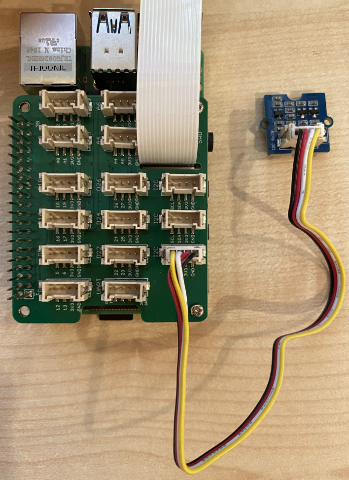

<!--
CO_OP_TRANSLATOR_METADATA:
{
  "original_hash": "6145a1d791731c8a9d0afd0a1bae5108",
  "translation_date": "2025-10-11T11:53:22+00:00",
  "source_file": "4-manufacturing/lessons/4-trigger-fruit-detector/pi-proximity.md",
  "language_code": "et"
}
-->
# Tuvasta lähedus - Raspberry Pi

Selles õppetunni osas lisad oma Raspberry Pi-le lähedusanduri ja loed sellest kauguse.

## Riistvara

Raspberry Pi vajab lähedusandurit.

Andur, mida kasutad, on [Grove Time of Flight kaugusandur](https://www.seeedstudio.com/Grove-Time-of-Flight-Distance-Sensor-VL53L0X.html). See andur kasutab lasermoodulit kauguse tuvastamiseks. Anduri ulatus on 10mm kuni 2000mm (1cm - 2m) ja see annab selles vahemikus üsna täpseid väärtusi, kusjuures kaugused üle 1000mm raporteeritakse kui 8109mm.

Laserkaugusmõõtja asub anduri tagaküljel, vastasküljel Grove pistikust.

See on I<sup>2</sup>C andur.

### Ühenda Time of Flight andur

Grove Time of Flight anduri saab ühendada Raspberry Pi-ga.

#### Ülesanne - ühenda Time of Flight andur

Ühenda Time of Flight andur.


1. Sisesta Grove kaabli üks ots Time of Flight anduri pistikusse. Kaabel läheb sisse ainult ühel viisil.

1. Kui Raspberry Pi on välja lülitatud, ühenda Grove kaabli teine ots ühega I<sup>2</sup>C pistikutest, mis on märgitud **I<sup>2</sup>C** Grove Base hatis, mis on ühendatud Pi-ga. Need pistikud asuvad alumises reas, vastasküljel GPIO pinidest ja kaamera kaabli pesast.



## Programmeeri Time of Flight andur

Nüüd saab Raspberry Pi programmeerida kasutama ühendatud Time of Flight andurit.

### Ülesanne - programmeeri Time of Flight andur

Programmeeri seade.

1. Lülita Pi sisse ja oota, kuni see käivitub.

1. Ava `fruit-quality-detector` kood VS Code'is, kas otse Pi-l või ühendudes Remote SSH laienduse kaudu.

1. Paigalda rpi-vl53l0x Pip pakett, Python pakett, mis suhtleb VL53L0X Time of Flight kaugusanduriga. Paigalda see järgmise pip käsuga:

    ```sh
    pip install rpi-vl53l0x
    ```

1. Loo selles projektis uus fail nimega `distance-sensor.py`.

    > 💁 Lihtne viis simuleerida mitut IoT seadet on teha igaüks eraldi Python failis ja käivitada need samal ajal.

1. Lisa sellele failile järgmine kood:

    ```python
    import time
    
    from grove.i2c import Bus
    from rpi_vl53l0x.vl53l0x import VL53L0X
    ```

    See impordib Grove I<sup>2</sup>C bussi teegi ja anduri teegi, mis on mõeldud Grove Time of Flight anduri põhiriistvarale.

1. Selle alla lisa järgmine kood, et pääseda andurile ligi:

    ```python
    distance_sensor = VL53L0X(bus = Bus().bus)
    distance_sensor.begin()    
    ```

    See kood deklareerib kaugusanduri, kasutades Grove I<sup>2</sup>C bussi, ja käivitab anduri.

1. Lõpuks lisa lõpmatu tsükkel, et lugeda kaugusi:

    ```python
    while True:
        distance_sensor.wait_ready()
        print(f'Distance = {distance_sensor.get_distance()} mm')
        time.sleep(1)
    ```

    See kood ootab, kuni andurilt on saadaval väärtus, ja prindib selle konsooli.

1. Käivita see kood.

    > 💁 Ära unusta, et see fail on nimega `distance-sensor.py`! Veendu, et käivitad selle Pythoniga, mitte `app.py`.

1. Näed konsoolis kaugusmõõtmisi. Aseta objektid anduri lähedale ja näed kaugusmõõtmist:

    ```output
    pi@raspberrypi:~/fruit-quality-detector $ python3 distance_sensor.py 
    Distance = 29 mm
    Distance = 28 mm
    Distance = 30 mm
    Distance = 151 mm
    ```

    Kaugusmõõtja asub anduri tagaküljel, seega veendu, et kasutad õiget külge kauguse mõõtmiseks.

    

> 💁 Selle koodi leiad [code-proximity/pi](../../../../../4-manufacturing/lessons/4-trigger-fruit-detector/code-proximity/pi) kaustast.

😀 Sinu lähedusanduri programm oli edukas!

---

**Lahtiütlus**:  
See dokument on tõlgitud AI tõlketeenuse [Co-op Translator](https://github.com/Azure/co-op-translator) abil. Kuigi püüame tagada täpsust, palume arvestada, et automaatsed tõlked võivad sisaldada vigu või ebatäpsusi. Algne dokument selle algses keeles tuleks pidada autoriteetseks allikaks. Olulise teabe puhul soovitame kasutada professionaalset inimtõlget. Me ei vastuta selle tõlke kasutamisest tulenevate arusaamatuste või valesti tõlgenduste eest.