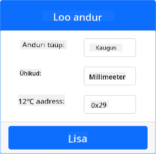
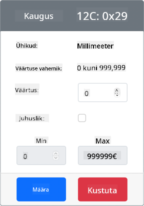

<!--
CO_OP_TRANSLATOR_METADATA:
{
  "original_hash": "7e9f05bdc50a40fd924b1d66934471bf",
  "translation_date": "2025-10-11T11:50:52+00:00",
  "source_file": "4-manufacturing/lessons/4-trigger-fruit-detector/virtual-device-proximity.md",
  "language_code": "et"
}
-->
# Tuvastage lähedus - Virtuaalne IoT riistvara

Selles õppetunni osas lisate oma virtuaalsele IoT-seadmele lähedusanduri ja loete sellest kaugust.

## Riistvara

Virtuaalne IoT-seade kasutab simuleeritud kaugusandurit.

Füüsilises IoT-seadmes kasutaksite kauguse tuvastamiseks laseriga mõõtemooduliga andurit.

### Lisage kaugusandur CounterFit-i

Virtuaalse kaugusanduri kasutamiseks peate selle CounterFit rakendusse lisama.

#### Ülesanne - lisage kaugusandur CounterFit-i

Lisage kaugusandur CounterFit rakendusse.

1. Avage VS Code'is `fruit-quality-detector` kood ja veenduge, et virtuaalne keskkond on aktiveeritud.

1. Installige täiendav Pip pakett, et lisada CounterFit shim, mis suudab kaugusanduritega suhelda, simuleerides [rpi-vl53l0x Pip paketti](https://pypi.org/project/rpi-vl53l0x/), Python paketti, mis suhtleb [VL53L0X lennuajaga kaugusanduriga](https://wiki.seeedstudio.com/Grove-Time_of_Flight_Distance_Sensor-VL53L0X/). Veenduge, et installite selle terminalist, kus virtuaalne keskkond on aktiveeritud.

    ```sh
    pip install counterfit-shims-rpi-vl53l0x
    ```

1. Veenduge, et CounterFit veebirakendus töötab.

1. Looge kaugusandur:

    1. *Sensors* paneelil *Create sensor* kastis avage *Sensor type* rippmenüü ja valige *Distance*.

    1. Jätke *Units* väärtuseks `Millimeter`.

    1. See andur on I<sup>2</sup>C andur, seega määrake aadressiks `0x29`. Kui kasutaksite füüsilist VL53L0X andurit, oleks see aadress kõvakoodiga määratud.

    1. Valige **Add** nupp, et luua kaugusandur.

    

    Kaugusandur luuakse ja ilmub andurite loendisse.

    

## Programmeerige kaugusandur

Virtuaalset IoT-seadet saab nüüd programmeerida, et kasutada simuleeritud kaugusandurit.

### Ülesanne - programmeerige lennuajaga andur

1. Looge `fruit-quality-detector` projektis uus fail nimega `distance-sensor.py`.

    > 💁 Lihtne viis simuleerida mitut IoT-seadet on teha igaüks eraldi Python failis ja käivitada need samaaegselt.

1. Alustage ühendust CounterFit-iga järgmise koodiga:

    ```python
    from counterfit_connection import CounterFitConnection
    CounterFitConnection.init('127.0.0.1', 5000)
    ```

1. Lisage sellele koodile järgmine osa:

    ```python
    import time
    
    from counterfit_shims_rpi_vl53l0x.vl53l0x import VL53L0X
    ```

    See impordib VL53L0X lennuajaga anduri jaoks mõeldud andurite teegi shim'i.

1. Lisage sellele koodile järgmine osa, et pääseda andurile ligi:

    ```python
    distance_sensor = VL53L0X()
    distance_sensor.begin()
    ```

    See kood deklareerib kaugusanduri ja käivitab selle.

1. Lõpuks lisage lõpmatu tsükkel, et lugeda kaugusi:

    ```python
    while True:
        distance_sensor.wait_ready()
        print(f'Distance = {distance_sensor.get_distance()} mm')
        time.sleep(1)
    ```

    See kood ootab, kuni andurilt on väärtus lugemiseks valmis, ja kuvab selle konsoolis.

1. Käivitage see kood.

    > 💁 Ärge unustage, et see fail on nimega `distance-sensor.py`! Veenduge, et käivitate selle Pythoniga, mitte `app.py`.

1. Näete konsoolis kaugusmõõtmisi. Muutke CounterFit-is väärtust, et näha selle muutumist, või kasutage juhuslikke väärtusi.

    ```output
    (.venv) ➜  fruit-quality-detector python distance-sensor.py 
    Distance = 37 mm
    Distance = 42 mm
    Distance = 29 mm
    ```

> 💁 Selle koodi leiate kaustast [code-proximity/virtual-iot-device](../../../../../4-manufacturing/lessons/4-trigger-fruit-detector/code-proximity/virtual-iot-device).

😀 Teie lähedusanduri programm oli edukas!

---

**Lahtiütlus**:  
See dokument on tõlgitud AI tõlketeenuse [Co-op Translator](https://github.com/Azure/co-op-translator) abil. Kuigi püüame tagada täpsust, palume arvestada, et automaatsed tõlked võivad sisaldada vigu või ebatäpsusi. Algne dokument selle algses keeles tuleks pidada autoriteetseks allikaks. Olulise teabe puhul soovitame kasutada professionaalset inimtõlget. Me ei vastuta selle tõlke kasutamisest tulenevate arusaamatuste või valesti tõlgenduste eest.