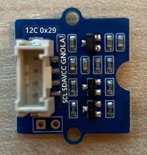

<!--
CO_OP_TRANSLATOR_METADATA:
{
  "original_hash": "288aebb0c59f7be1d2719b8f9660a313",
  "translation_date": "2025-10-11T11:52:55+00:00",
  "source_file": "4-manufacturing/lessons/4-trigger-fruit-detector/wio-terminal-proximity.md",
  "language_code": "et"
}
-->
# Tuvasta lähedus - Wio Terminal

Selles õppetüki osas lisad oma Wio Terminalile lähedusanduri ja loed selle abil kaugust.

## Riistvara

Wio Terminal vajab lähedusandurit.

Andur, mida kasutad, on [Grove Time of Flight kaugusandur](https://www.seeedstudio.com/Grove-Time-of-Flight-Distance-Sensor-VL53L0X.html). See andur kasutab kauguse tuvastamiseks laserit. Anduri ulatus on 10 mm kuni 2000 mm (1 cm - 2 m) ja see annab selle vahemiku väärtusi üsna täpselt, kusjuures kaugused üle 1000 mm raporteeritakse kui 8109 mm.

Laserkaugusmõõtja asub anduri tagaküljel, vastasküljel Grove-pistikule.

Tegemist on I<sup>2</sup>C anduriga.

### Ühenda Time of Flight andur

Grove Time of Flight anduri saab ühendada Wio Terminaliga.

#### Ülesanne - ühenda Time of Flight andur

Ühenda Time of Flight andur.



1. Sisesta ühe Grove-kaabli ots Time of Flight anduri pistikusse. See läheb sisse ainult ühes suunas.

1. Kui Wio Terminal ei ole arvutiga või muu toiteallikaga ühendatud, ühenda Grove-kaabli teine ots Wio Terminali vasakpoolse Grove-pistikuga, kui vaatad ekraani poole. See on pistik, mis asub toitenupule kõige lähemal. See on kombineeritud digitaalne ja I<sup>2</sup>C pistik.


1. Nüüd saad ühendada Wio Terminali oma arvutiga.

## Programmeeri Time of Flight andur

Nüüd saab Wio Terminali programmeerida kasutama ühendatud Time of Flight andurit.

### Ülesanne - programmeeri Time of Flight andur

1. Loo uus Wio Terminali projekt, kasutades PlatformIO-d. Nimeta see projekt `distance-sensor`. Lisa kood `setup` funktsiooni, et seadistada jadaport.

1. Lisa projekti `platformio.ini` faili sõltuvus Seeed Grove Time of Flight kaugusanduri teegist:

    ```ini
    lib_deps =
        seeed-studio/Grove Ranging sensor - VL53L0X @ ^1.1.1
    ```

1. Lisa `main.cpp` faili olemasolevate include-direktiivide alla järgmine kood, et deklareerida `Seeed_vl53l0x` klassi eksemplar, mis suhtleb Time of Flight anduriga:

    ```cpp
    #include "Seeed_vl53l0x.h"
    
    Seeed_vl53l0x VL53L0X;
    ```

1. Lisa järgmine kood `setup` funktsiooni lõppu, et andur initsialiseerida:

    ```cpp
    VL53L0X.VL53L0X_common_init();
    VL53L0X.VL53L0X_high_accuracy_ranging_init();
    ```

1. Lisa `loop` funktsiooni kood, mis loeb andurilt väärtuse:

    ```cpp
    VL53L0X_RangingMeasurementData_t RangingMeasurementData;
    memset(&RangingMeasurementData, 0, sizeof(VL53L0X_RangingMeasurementData_t));

    VL53L0X.PerformSingleRangingMeasurement(&RangingMeasurementData);
    ```

    See kood initsialiseerib andmestruktuuri, kuhu andmed loetakse, ja edastab selle `PerformSingleRangingMeasurement` meetodile, kus see täidetakse kaugusmõõtmise andmetega.

1. Kirjuta selle alla kaugusmõõtmise väärtus ja lisa 1-sekundiline viivitus:

    ```cpp
    Serial.print("Distance = ");
    Serial.print(RangingMeasurementData.RangeMilliMeter);
    Serial.println(" mm");

    delay(1000);
    ```

1. Koosta, laadi üles ja käivita see kood. Saad vaadata kaugusmõõtmisi jadamonitoris. Aseta objektid anduri lähedale ja näed kaugusmõõtmist:

    ```output
    Distance = 29 mm
    Distance = 28 mm
    Distance = 30 mm
    Distance = 151 mm
    ```

    Kaugusmõõtja asub anduri tagaküljel, seega veendu, et kasutad õiget külge kauguse mõõtmiseks.

    

> 💁 Selle koodi leiad kaustast [code-proximity/wio-terminal](../../../../../4-manufacturing/lessons/4-trigger-fruit-detector/code-proximity/wio-terminal).

😀 Sinu lähedusanduri programm õnnestus suurepäraselt!

---

**Lahtiütlus**:  
See dokument on tõlgitud AI tõlketeenuse [Co-op Translator](https://github.com/Azure/co-op-translator) abil. Kuigi püüame tagada täpsust, palume arvestada, et automaatsed tõlked võivad sisaldada vigu või ebatäpsusi. Algne dokument selle algses keeles tuleks pidada autoriteetseks allikaks. Olulise teabe puhul soovitame kasutada professionaalset inimtõlget. Me ei vastuta selle tõlke kasutamisest tulenevate arusaamatuste või valesti tõlgenduste eest.