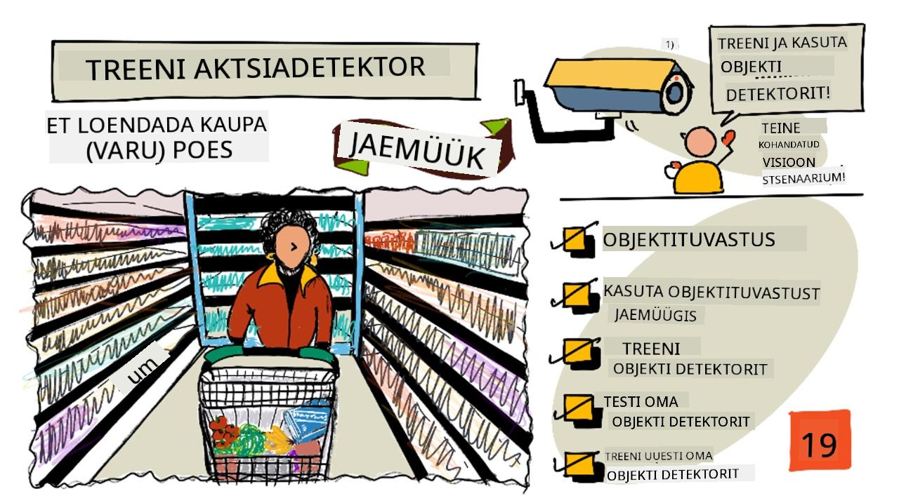
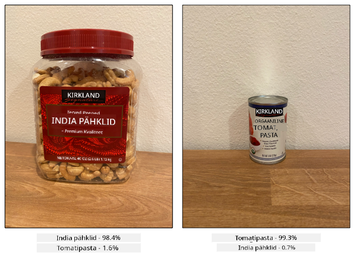
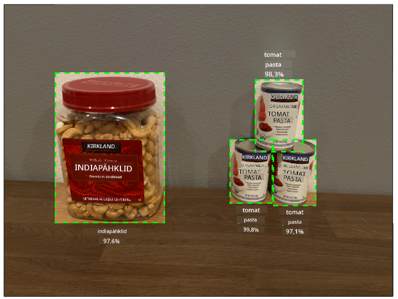
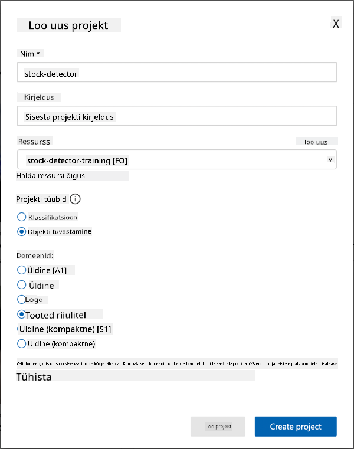
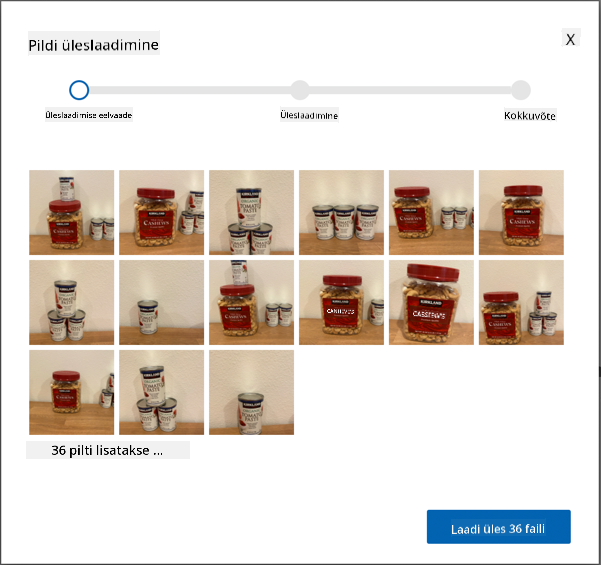
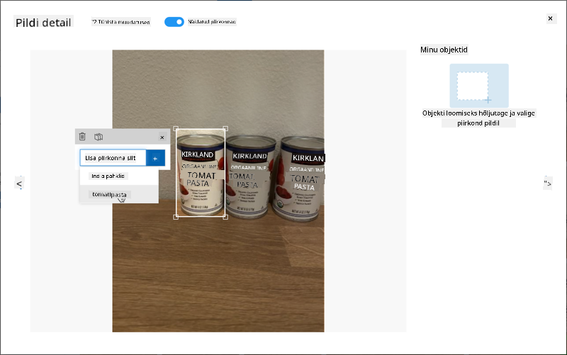
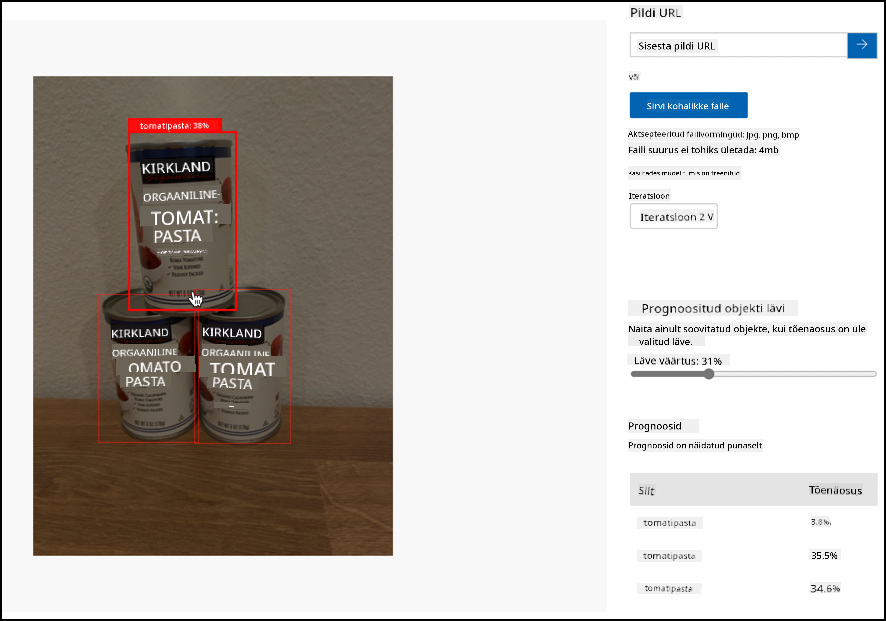

<!--
CO_OP_TRANSLATOR_METADATA:
{
  "original_hash": "8df310a42f902139a01417dacb1ffbef",
  "translation_date": "2025-10-11T12:52:20+00:00",
  "source_file": "5-retail/lessons/1-train-stock-detector/README.md",
  "language_code": "et"
}
-->
# Treeni varude detektorit

> Visuaalne ülevaade: [Nitya Narasimhan](https://github.com/nitya). Klõpsa pildil, et näha suuremat versiooni.

See video annab ülevaate objektide tuvastamisest Azure Custom Vision teenuse abil, mis on selle õppetunni teema.

> 🎥 Klõpsa ülaloleval pildil, et vaadata videot

## Eel-loengu viktoriin

[Eel-loengu viktoriin](https://black-meadow-040d15503.1.azurestaticapps.net/quiz/37)

## Sissejuhatus

Eelmises projektis kasutasite tehisintellekti, et treenida pildiklassifikaatorit – mudelit, mis suudab tuvastada, kas pilt sisaldab midagi, näiteks küpset või toorest vilja. Teine tehisintellekti mudel, mida saab piltidega kasutada, on objektide tuvastamine. Need mudelid ei klassifitseeri pilti siltide järgi, vaid on treenitud objekte ära tundma ja neid piltides leidma, tuvastades mitte ainult objekti olemasolu, vaid ka selle asukoha pildil. See võimaldab lugeda objekte piltidel.

Selles õppetunnis õpite objektide tuvastamist, sealhulgas selle kasutamist jaemüügis. Samuti õpite, kuidas treenida objektide detektorit pilves.

Selles õppetunnis käsitleme:

* [Objektide tuvastamine](../../../../../5-retail/lessons/1-train-stock-detector)
* [Objektide tuvastamine jaemüügis](../../../../../5-retail/lessons/1-train-stock-detector)
* [Objektide detektori treenimine](../../../../../5-retail/lessons/1-train-stock-detector)
* [Objektide detektori testimine](../../../../../5-retail/lessons/1-train-stock-detector)
* [Objektide detektori uuesti treenimine](../../../../../5-retail/lessons/1-train-stock-detector)

## Objektide tuvastamine

Objektide tuvastamine hõlmab objektide tuvastamist piltidel tehisintellekti abil. Erinevalt eelmises projektis treenitud pildiklassifikaatorist ei ole objektide tuvastamine seotud pildi parima sildi ennustamisega tervikuna, vaid ühe või mitme objekti leidmisega pildil.

### Objektide tuvastamine vs pildiklassifikatsioon

Pildiklassifikatsioon seisneb pildi tervikuna klassifitseerimises – millised on tõenäosused, et kogu pilt vastab igale sildile. Tagastatakse tõenäosused iga sildi kohta, mida mudeli treenimiseks kasutati.

Ülaltoodud näites klassifitseeritakse kaks pilti mudeli abil, mis on treenitud klassifitseerima india pähklite karpe või tomatipasta purke. Esimene pilt on india pähklite karp ja sellel on kaks tulemust pildiklassifikaatorist:

| Silt            | Tõenäosus |
| --------------- | --------: |
| `india pähklid` | 98.4%     |
| `tomatipasta`   | 1.6%      |

Teine pilt on tomatipasta purk ja tulemused on:

| Silt            | Tõenäosus |
| --------------- | --------: |
| `india pähklid` | 0.7%      |
| `tomatipasta`   | 99.3%     |

Võiksite kasutada neid väärtusi koos protsendilise lävega, et ennustada, mis pildil on. Aga mis juhtub, kui pilt sisaldab mitut tomatipasta purki või nii india pähkleid kui ka tomatipastat? Tulemused ei pruugi anda soovitud tulemust. Siin tuleb appi objektide tuvastamine.

Objektide tuvastamine hõlmab mudeli treenimist objektide äratundmiseks. Selle asemel, et anda mudelile pilte, mis sisaldavad objekti, ja öelda, et iga pilt on üks või teine silt, tõstate esile pildi osa, mis sisaldab konkreetset objekti, ja märgistate selle. Võite märgistada ühe objekti pildil või mitu. Nii õpib mudel ära tundma, milline objekt ise välja näeb, mitte ainult millised pildid, mis objekti sisaldavad, välja näevad.

Kui kasutate seda piltide ennustamiseks, ei saa te tagasi siltide ja protsentide loendit, vaid tuvastatud objektide loendi koos nende piirdekastide ja tõenäosusega, et objekt vastab määratud sildile.

> 🎓 *Piirdekastid* on kastid objekti ümber.

Ülaltoodud pilt sisaldab nii india pähklite karpi kui ka kolme tomatipasta purki. Objektide detektor tuvastas india pähklid, tagastades piirdekasti, mis sisaldab india pähkleid koos protsendilise tõenäosusega, et piirdekast sisaldab objekti, antud juhul 97.6%. Objektide detektor tuvastas ka kolm tomatipasta purki ja annab kolm eraldi piirdekasti, üks iga tuvastatud purgi kohta, ning igaühel on protsendiline tõenäosus, et piirdekast sisaldab tomatipasta purki.

✅ Mõelge erinevatele stsenaariumidele, kus võiksite kasutada pildipõhiseid tehisintellekti mudeleid. Millised vajaksid klassifikatsiooni ja millised objektide tuvastamist?

### Kuidas objektide tuvastamine töötab

Objektide tuvastamine kasutab keerulisi masinõppe mudeleid. Need mudelid töötavad, jagades pildi mitmeks lahtriks ja kontrollides, kas piirdekasti keskpunkt on pildi keskpunkt, mis vastab ühele mudeli treenimiseks kasutatud pildile. Võite mõelda sellele kui pildiklassifikaatori käivitamisele pildi erinevates osades, et otsida vasteid.

> 💁 See on drastiline lihtsustus. Objektide tuvastamiseks on palju tehnikaid, ja nende kohta saate rohkem lugeda [Wikipedia objektide tuvastamise lehelt](https://wikipedia.org/wiki/Object_detection).

Objektide tuvastamiseks on mitmeid erinevaid mudeleid. Üks eriti kuulus mudel on [YOLO (You only look once)](https://pjreddie.com/darknet/yolo/), mis on uskumatult kiire ja suudab tuvastada 20 erinevat objekti klassi, nagu inimesed, koerad, pudelid ja autod.

✅ Lugege YOLO mudeli kohta aadressil [pjreddie.com/darknet/yolo/](https://pjreddie.com/darknet/yolo/)

Objektide tuvastamise mudeleid saab uuesti treenida, kasutades ülekandeõpet, et tuvastada kohandatud objekte.

## Objektide tuvastamine jaemüügis

Objektide tuvastamisel on jaemüügis mitmeid kasutusvõimalusi. Mõned neist on:

* **Varude kontroll ja loendamine** – tuvastamine, kui riiulitel on vähe kaupa. Kui varud on liiga madalad, saab töötajatele või robotitele saata teateid riiulite täiendamiseks.
* **Maskide tuvastamine** – poodides, kus on maskipoliitika rahvatervise sündmuste ajal, saab objektide tuvastamine tuvastada inimesi maskidega ja ilma.
* **Automaatne arveldamine** – tuvastamine, milliseid esemeid riiulitelt võetakse, ja klientide vastav arveldamine.
* **Ohtude tuvastamine** – tuvastamine, kui põrandal on katkiseid esemeid või lekkinud vedelikke, ja koristusmeeskondade teavitamine.

✅ Tehke veidi uurimistööd: Millised on veel objektide tuvastamise kasutusvõimalused jaemüügis?

## Objektide detektori treenimine

Objektide detektorit saab treenida Custom Visioni abil, sarnaselt sellele, kuidas treenisite pildiklassifikaatorit.

### Ülesanne – looge objektide detektor

1. Looge selle projekti jaoks ressursigrupp nimega `stock-detector`.

1. Looge tasuta Custom Vision treenimisressurss ja tasuta Custom Vision ennustusressurss `stock-detector` ressursigrupis. Nimetage need `stock-detector-training` ja `stock-detector-prediction`.

    > 💁 Teil võib olla ainult üks tasuta treenimis- ja ennustusressurss, seega veenduge, et olete varasemate õppetundide projekti puhastanud.

    > ⚠️ Vajadusel saate viidata [juhistele treenimis- ja ennustusressursside loomiseks projektist 4, õppetund 1](../../../4-manufacturing/lessons/1-train-fruit-detector/README.md#task---create-a-cognitive-services-resource).

1. Käivitage Custom Vision portaal aadressil [CustomVision.ai](https://customvision.ai) ja logige sisse Microsofti kontoga, mida kasutasite oma Azure'i konto jaoks.

1. Järgige [Microsofti dokumentatsiooni kiirjuhendi "Objektide detektori loomine" jaotist](https://docs.microsoft.com/azure/cognitive-services/custom-vision-service/get-started-build-detector?WT.mc_id=academic-17441-jabenn#create-a-new-project), et luua uus Custom Vision projekt. Kasutage alati kõige ajakohasemaid dokumente, kuna kasutajaliides võib muutuda.

    Nimetage oma projekt `stock-detector`.

    Projekti loomisel veenduge, et kasutate varem loodud `stock-detector-training` ressurssi. Kasutage *Object Detection* projekti tüüpi ja *Products on Shelves* domeeni.

    

    ✅ *Products on Shelves* domeen on spetsiaalselt suunatud varude tuvastamiseks poe riiulitel. Lugege rohkem erinevate domeenide kohta [Microsofti dokumentatsiooni domeeni valimise jaotisest](https://docs.microsoft.com/azure/cognitive-services/custom-vision-service/select-domain?WT.mc_id=academic-17441-jabenn#object-detection).

✅ Võtke aega, et uurida Custom Vision kasutajaliidest oma objektide detektori jaoks.

### Ülesanne – treenige oma objektide detektorit

Mudeli treenimiseks vajate pilte, mis sisaldavad tuvastatavaid objekte.

1. Koguge pilte, mis sisaldavad tuvastatavat objekti. Teil on vaja vähemalt 15 pilti, mis sisaldavad iga tuvastatavat objekti erinevatest nurkadest ja erinevates valgustingimustes, kuid mida rohkem, seda parem. See objektide detektor kasutab *Products on Shelves* domeeni, seega proovige paigutada objektid nii, nagu need oleksid poe riiulil. Teil on vaja ka mõningaid pilte mudeli testimiseks. Kui tuvastate rohkem kui ühe objekti, vajate testimiseks pilte, mis sisaldavad kõiki objekte.

    > 💁 Pildid, mis sisaldavad mitut erinevat objekti, arvestatakse 15 pildi miinimumi hulka kõigi pildil olevate objektide jaoks.

    Teie pildid peaksid olema png või jpeg formaadis, väiksemad kui 6MB. Kui loote need näiteks iPhone'iga, võivad need olla kõrge eraldusvõimega HEIC-pildid, mis tuleb konverteerida ja võib-olla vähendada. Mida rohkem pilte, seda parem, ja teil peaks olema sarnane arv küpseid ja tooreid objekte.

    Mudel on mõeldud toodete jaoks riiulitel, seega proovige teha fotod objektidest riiulitel.

    Näidispilte, mida saate kasutada, leiate [piltide](../../../../../5-retail/lessons/1-train-stock-detector/images) kaustast, kus on india pähklid ja tomatipasta.

1. Järgige [Microsofti dokumentatsiooni kiirjuhendi "Piltide üleslaadimine ja märgistamine" jaotist](https://docs.microsoft.com/azure/cognitive-services/custom-vision-service/get-started-build-detector?WT.mc_id=academic-17441-jabenn#upload-and-tag-images), et laadida üles oma treeningpildid. Looge asjakohased sildid sõltuvalt tuvastatavate objektide tüübist.

    

    Kui joonistate objektide piirdekaste, hoidke need tihedalt objekti ümber. Kõigi piltide kontuuride joonistamine võib võtta aega, kuid tööriist tuvastab, mida ta arvab olevat piirdekastid, muutes selle kiiremaks.

    

    > 💁 Kui teil on iga objekti jaoks rohkem kui 15 pilti, saate treenida pärast 15 pilti ja kasutada **Suggested tags** funktsiooni. See kasutab treenitud mudelit objektide tuvastamiseks märgistamata pildil. Seejärel saate tuvastatud objektid kinnitada või tagasi lükata ja piirdekastid uuesti joonistada. See võib säästa *palju* aega.

1. Järgige [Microsofti dokumentatsiooni kiirjuhendi "Detektori treenimine" jaotist](https://docs.microsoft.com/azure/cognitive-services/custom-vision-service/get-started-build-detector?WT.mc_id=academic-17441-jabenn#train-the-detector), et treenida objektide detektorit oma märgistatud piltide põhjal.

    Teile antakse valik treeningtüübi osas. Valige **Quick Training**.

Objektide detektor hakkab treenima. Treenimine võtab paar minutit.

## Testige oma objektide detektorit

Kui teie objektide detektor on treenitud, saate seda testida, andes sellele uusi pilte, et tuvastada objekte.

### Ülesanne – testige oma objektide detektorit

1. Kasutage **Quick Test** nuppu, et üles laadida testimispildid ja kontrollida, kas objektid tuvastatakse. Kasutage varem loodud testimispilte, mitte treeningpilte.

    

1. Proovige kõiki testimispilte, mis teil on, ja jälgige tõenäosusi.

## Treenige oma objektide detektorit uuesti

Kui testite oma objektide detektorit, ei pruugi see anda oodatud tulemusi, nagu ka pildiklassifikaatoritega eelmises projektis. Saate oma objektide detektorit parandada, treenides seda uuesti piltidega, mille puhul see eksib.

Iga kord, kui teete ennustuse kiirtesti valiku abil, salvestatakse pilt ja tulemused. Saate kasutada neid pilte oma mudeli uuesti treenimiseks.

1. Kasutage **Predictions** vahekaarti, et leida testimiseks kasutatud pildid.

1. Kinnitage kõik täpsed tuvastused, kustutage valed ja lisage puuduolevad objektid.

1. Treenige mudel uuesti ja testige seda uuesti.

---

## 🚀 Väljakutse
Mis juhtub, kui kasutate objektidetektorit sarnaste välimustega esemete puhul, näiteks sama brändi tomatipasta ja hakitud tomatite purkide puhul?

Kui teil on sarnase välimusega esemeid, katsetage neid, lisades nende pilte oma objektidetektorisse.

## Loengu järgne viktoriin

[Loengu järgne viktoriin](https://black-meadow-040d15503.1.azurestaticapps.net/quiz/38)

## Ülevaade ja iseseisev õppimine

* Kui treenisite oma objektidetektorit, nägite *Täpsuse* (Precision), *Leidmise* (Recall) ja *mAP* väärtusi, mis hindavad loodud mudelit. Lugege, mida need väärtused tähendavad, kasutades [Microsofti dokumentatsiooni kiirjuhendi "Ehita objektidetektor" hindamise sektsiooni](https://docs.microsoft.com/azure/cognitive-services/custom-vision-service/get-started-build-detector?WT.mc_id=academic-17441-jabenn#evaluate-the-detector).
* Lugege rohkem objektituvastuse kohta [Wikipedia objektituvastuse lehelt](https://wikipedia.org/wiki/Object_detection).

## Ülesanne

[Võrdle domeene](assignment.md)

---

**Lahtiütlus**:  
See dokument on tõlgitud AI tõlketeenuse [Co-op Translator](https://github.com/Azure/co-op-translator) abil. Kuigi püüame tagada täpsust, palume arvestada, et automaatsed tõlked võivad sisaldada vigu või ebatäpsusi. Algne dokument selle algses keeles tuleks pidada autoriteetseks allikaks. Olulise teabe puhul soovitame kasutada professionaalset inimtõlget. Me ei vastuta selle tõlke kasutamisest tulenevate arusaamatuste või valesti tõlgenduste eest.