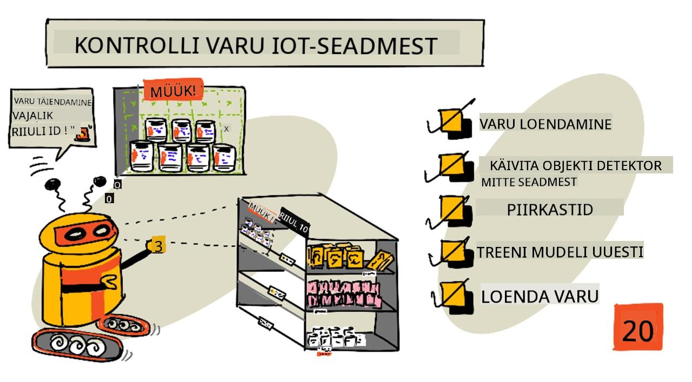
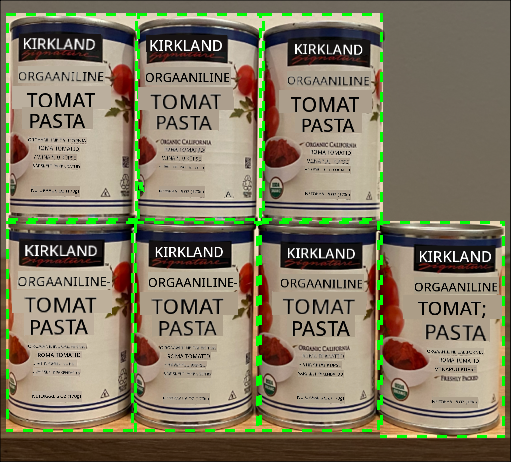
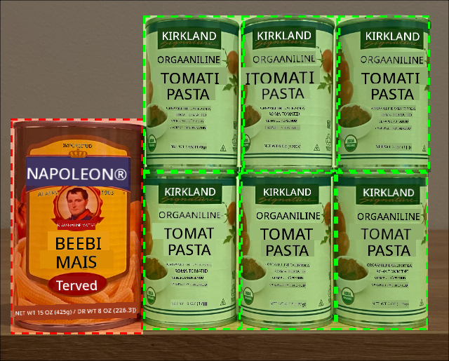
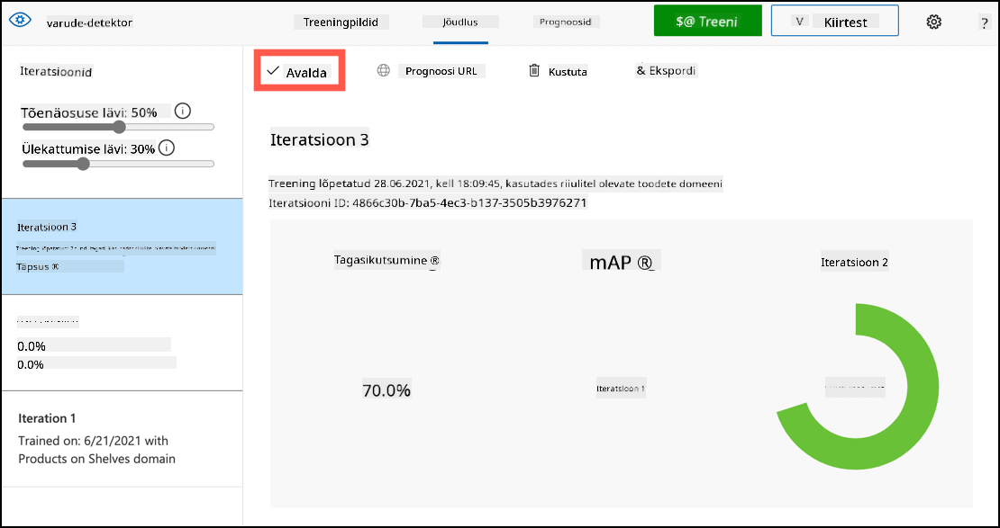
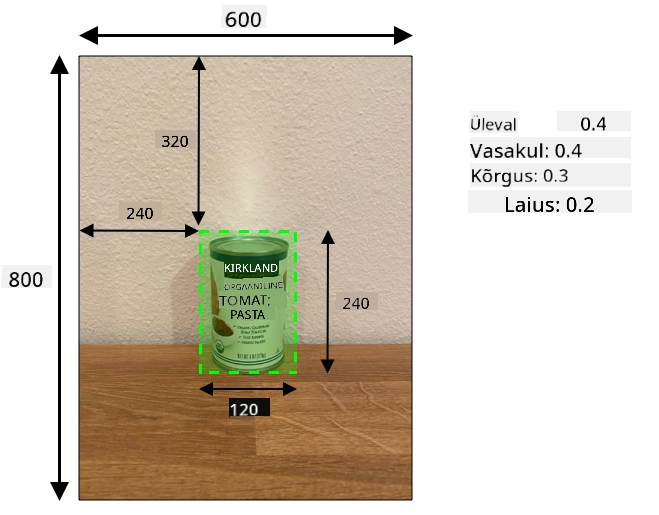
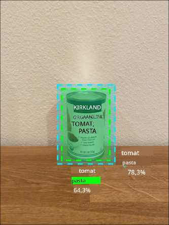

<!--
CO_OP_TRANSLATOR_METADATA:
{
  "original_hash": "1c9e5fa8b7be726c75a97232b1e41c97",
  "translation_date": "2025-10-11T12:49:59+00:00",
  "source_file": "5-retail/lessons/2-check-stock-device/README.md",
  "language_code": "et"
}
-->
# Kontrolli laoseisu IoT-seadmest



> Visandmärkmed: [Nitya Narasimhan](https://github.com/nitya). Klõpsa pildil, et näha suuremat versiooni.

## Eelloengu viktoriin

[Eelloengu viktoriin](https://black-meadow-040d15503.1.azurestaticapps.net/quiz/39)

## Sissejuhatus

Eelmises õppetunnis õppisite objektituvastuse erinevaid kasutusviise jaemüügis. Samuti õppisite, kuidas treenida objektidetektorit laoseisu tuvastamiseks. Selles õppetunnis õpite, kuidas kasutada oma IoT-seadmest objektidetektorit laoseisu loendamiseks.

Selles õppetunnis käsitleme:

* [Laoseisu loendamine](../../../../../5-retail/lessons/2-check-stock-device)
* [Kutsu oma objektidetektorit IoT-seadmest](../../../../../5-retail/lessons/2-check-stock-device)
* [Piiravad kastid](../../../../../5-retail/lessons/2-check-stock-device)
* [Mudeli uuesti treenimine](../../../../../5-retail/lessons/2-check-stock-device)
* [Laoseisu loendamine](../../../../../5-retail/lessons/2-check-stock-device)

> 🗑 See on selle projekti viimane õppetund, nii et pärast õppetunni ja ülesande lõpetamist ärge unustage pilveteenuseid puhastada. Teenuseid on vaja ülesande täitmiseks, seega veenduge, et teete selle kõigepealt ära.
>
> Vajadusel vaadake juhiseid [projekti puhastamise juhendist](../../../clean-up.md).

## Laoseisu loendamine

Objektidetektoreid saab kasutada laoseisu kontrollimiseks, kas loendades laoseisu või veendudes, et laoseis on seal, kus see peaks olema. Kaameratega IoT-seadmeid saab paigutada kogu kauplusesse, et jälgida laoseisu, alustades kuumadest kohtadest, kus esemete täiendamine on oluline, näiteks piirkondades, kus hoitakse väikest arvu kõrge väärtusega esemeid.

Näiteks, kui kaamera on suunatud riiulitele, mis mahutavad 8 purki tomatipastat, ja objektidetektor tuvastab ainult 7 purki, siis üks on puudu ja vajab täiendamist.



Ülaltoodud pildil on objektidetektor tuvastanud 7 purki tomatipastat riiulil, mis mahutab 8 purki. IoT-seade ei saa mitte ainult saata teavitust täiendamise vajadusest, vaid võib anda ka vihje puuduva eseme asukoha kohta, mis on oluline, kui kasutate riiulite täiendamiseks roboteid.

> 💁 Sõltuvalt kauplusest ja eseme populaarsusest ei pruugi täiendamine toimuda, kui ainult üks purk on puudu. Teil oleks vaja algoritmi, mis määrab, millal täiendamine toimub, lähtudes teie toodetest, klientidest ja muudest kriteeriumidest.

✅ Millistes muudes olukordades võiksid kombineerida objektituvastust ja roboteid?

Mõnikord võib riiulitel olla vale laoseis. See võib olla inimlik eksitus täiendamisel või klientide otsuse muutmine ostu osas ja eseme tagasipanek esimesse saadaval olevasse kohta. Kui tegemist on mitte rikneva esemega, näiteks konserveeritud kaupadega, on see tülikas. Kui tegemist on rikneva esemega, näiteks külmutatud või jahutatud kaupadega, võib see tähendada, et toodet ei saa enam müüa, kuna võib olla võimatu kindlaks teha, kui kaua ese oli sügavkülmast väljas.

Objektituvastust saab kasutada ootamatute esemete tuvastamiseks, teavitades taas inimest või robotit, et ese tagastataks niipea, kui see tuvastatakse.



Ülaltoodud pildil on tomatipasta riiulile pandud beebimaisi purk. Objektidetektor on selle tuvastanud, võimaldades IoT-seadmel teavitada inimest või robotit, et purk tagastataks õigesse asukohta.

## Kutsu oma objektidetektorit IoT-seadmest

Eelmises õppetunnis treenitud objektidetektorit saab kutsuda IoT-seadmest.

### Ülesanne - avalda oma objektidetektori iteratsioon

Iteratsioone avaldatakse Custom Vision portaalist.

1. Käivitage Custom Vision portaal aadressil [CustomVision.ai](https://customvision.ai) ja logige sisse, kui te pole seda juba avanud. Seejärel avage oma `stock-detector` projekt.

1. Valige ülemistest valikutest **Performance** vahekaart.

1. Valige külgmenüüst *Iterations* loendist viimane iteratsioon.

1. Valige iteratsiooni **Publish** nupp.

    

1. *Publish Model* dialoogis määrake *Prediction resource* väärtuseks `stock-detector-prediction` ressurss, mille lõite eelmises õppetunnis. Jätke nimi `Iteration2` ja valige **Publish** nupp.

1. Kui iteratsioon on avaldatud, valige **Prediction URL** nupp. See kuvab ennustuse API üksikasjad, mida vajate mudeli kutsumiseks IoT-seadmest. Alumine osa on märgistatud *If you have an image file*, ja see on vajalik teave. Kopeerige kuvatud URL, mis näeb välja umbes selline:

    ```output
    https://<location>.api.cognitive.microsoft.com/customvision/v3.0/Prediction/<id>/detect/iterations/Iteration2/image
    ```

    Kus `<location>` on asukoht, mida kasutasite oma Custom Vision ressursi loomisel, ja `<id>` on pikk ID, mis koosneb tähtedest ja numbritest.

    Samuti kopeerige *Prediction-Key* väärtus. See on turvaline võti, mida peate mudeli kutsumisel edastama. Ainult rakendused, mis edastavad selle võtme, saavad mudelit kasutada, kõik muud rakendused lükatakse tagasi.

    

✅ Kui uus iteratsioon avaldatakse, on sellel erinev nimi. Kuidas arvate, et saaksite muuta iteratsiooni, mida IoT-seade kasutab?

### Ülesanne - kutsu oma objektidetektorit IoT-seadmest

Järgige allolevat asjakohast juhendit, et kasutada objektidetektorit oma IoT-seadmest:

* [Arduino - Wio Terminal](wio-terminal-object-detector.md)
* [Üheplaadi arvuti - Raspberry Pi/virtuaalne seade](single-board-computer-object-detector.md)

## Piiravad kastid

Kui kasutate objektidetektorit, saate tagasi mitte ainult tuvastatud objektid koos nende siltide ja tõenäosustega, vaid ka objektide piiravad kastid. Need määratlevad, kus objektidetektor tuvastas objekti antud tõenäosusega.

> 💁 Piirav kast on kast, mis määratleb ala, mis sisaldab tuvastatud objekti, kast, mis määratleb objekti piiri.

Ennustuse tulemused **Predictions** vahekaardil Custom Visionis näitavad piiravaid kaste pildil, mis saadeti ennustamiseks.


Ülaltoodud pildil tuvastati 4 purki tomatipastat. Tulemuste osas on iga tuvastatud objekti jaoks pildile lisatud punane ruut, mis näitab pildi piiravat kasti.

✅ Avage ennustused Custom Visionis ja vaadake piiravaid kaste.

Piiravad kastid määratletakse 4 väärtusega - top, left, height ja width. Need väärtused on skaalal 0-1, mis esindavad positsioone pildi suuruse protsendina. Alguspunkt (0,0 positsioon) on pildi vasak ülemine nurk, seega top väärtus on kaugus ülevalt ja piirava kasti põhi on top pluss height.



Ülaltoodud pilt on 600 pikslit lai ja 800 pikslit kõrge. Piirav kast algab 320 pikslit allpool, andes top koordinaadiks 0.4 (800 x 0.4 = 320). Vasakult algab piirav kast 240 pikslit üle, andes left koordinaadiks 0.4 (600 x 0.4 = 240). Piirava kasti kõrgus on 240 pikslit, andes height väärtuseks 0.3 (800 x 0.3 = 240). Piirava kasti laius on 120 pikslit, andes width väärtuseks 0.2 (600 x 0.2 = 120).

| Koordinaat | Väärtus |
| ---------- | ----: |
| Top        | 0.4   |
| Left       | 0.4   |
| Height     | 0.3   |
| Width      | 0.2   |

Protsendiväärtuste kasutamine skaalal 0-1 tähendab, et olenemata pildi suurusest algab piirav kast 0.4 kaugusel ülevalt ja vasakult ning on 0.3 kõrgusest ja 0.2 laiusest.

Piiravaid kaste saab kasutada koos tõenäosustega, et hinnata, kui täpne tuvastus on. Näiteks võib objektidetektor tuvastada mitu objekti, mis kattuvad, näiteks tuvastades ühe purgi teise sees. Teie kood võiks vaadata piiravaid kaste, mõista, et see on võimatu, ja ignoreerida kõiki objekte, millel on märkimisväärne kattumine teiste objektidega.



Ülaltoodud näites näitab üks piirav kast ennustatud tomatipasta purki tõenäosusega 78.3%. Teine piirav kast on veidi väiksem ja asub esimese piirava kasti sees tõenäosusega 64.3%. Teie kood võib kontrollida piiravaid kaste, näha, et need kattuvad täielikult, ja ignoreerida madalama tõenäosusega tuvastust, kuna pole võimalik, et üks purk on teise sees.

✅ Kas suudate mõelda olukorrale, kus on õigustatud tuvastada üks objekt teise sees?

## Mudeli uuesti treenimine

Nagu pildiklassifikaatori puhul, saate oma mudelit uuesti treenida, kasutades IoT-seadmest kogutud andmeid. Nende reaalse maailma andmete kasutamine tagab, et teie mudel töötab hästi, kui seda kasutatakse IoT-seadmest.

Erinevalt pildiklassifikaatorist ei saa te lihtsalt pilti sildistada. Selle asemel peate üle vaatama iga mudeli tuvastatud piirava kasti. Kui kast on vale asja ümber, tuleb see kustutada, kui see on vales kohas, tuleb seda kohandada.

### Ülesanne - mudeli uuesti treenimine

1. Veenduge, et olete IoT-seadmest kogunud mitmesuguseid pilte.

1. **Predictions** vahekaardilt valige pilt. Näete punaseid kaste, mis näitavad tuvastatud objektide piiravaid kaste.

1. Töötage läbi iga piirav kast. Valige see kõigepealt ja näete hüpikakent, mis näitab silti. Kasutage piirava kasti nurkades olevaid käepidemeid, et vajadusel suurust kohandada. Kui silt on vale, eemaldage see **X** nupuga ja lisage õige silt. Kui piirav kast ei sisalda objekti, kustutage see prügikasti nupuga.

1. Sulgege redaktor, kui olete valmis, ja pilt liigub **Predictions** vahekaardilt **Training Images** vahekaardile. Korrake protsessi kõigi ennustuste puhul.

1. Kasutage **Train** nuppu, et oma mudelit uuesti treenida. Kui see on treenitud, avaldage iteratsioon ja värskendage oma IoT-seadet, et kasutada uue iteratsiooni URL-i.

1. Paigaldage oma kood uuesti ja testige oma IoT-seadet.

## Laoseisu loendamine

Kombineerides tuvastatud objektide arvu ja piiravaid kaste, saate loendada laoseisu riiulil.

### Ülesanne - laoseisu loendamine

Järgige allolevat asjakohast juhendit, et loendada laoseisu, kasutades IoT-seadmest objektidetektori tulemusi:

* [Arduino - Wio Terminal](wio-terminal-count-stock.md)
* [Üheplaadi arvuti - Raspberry Pi/virtuaalne seade](single-board-computer-count-stock.md)

---

## 🚀 Väljakutse

Kas suudate tuvastada vale laoseisu? Treenige oma mudelit mitme objekti peal, seejärel värskendage oma rakendust, et teavitada teid, kui tuvastatakse vale laoseis.

Võib-olla viige see veelgi kaugemale ja tuvastage kõrvuti asetsev laoseis samal riiulil ning vaadake, kas midagi on valesse kohta pandud, määratledes piiravate kastide piirid.

## Järelloengu viktoriin

[Järelloengu viktoriin](https://black-meadow-040d15503.1.azurestaticapps.net/quiz/40)

## Ülevaade ja iseseisev õppimine

* Lisateave, kuidas arhitektuurida otsast lõpuni laoseisu tuvastamise süsteemi, leiate [Microsoft Docs'i juhendist "Out of stock detection at the edge"](https://docs.microsoft.com/hybrid/app-solutions/pattern-out-of-stock-at-edge?WT.mc_id=academic-17441-jabenn).
* Õppige muid viise, kuidas luua otsast lõpuni jaemüügilahendusi, kombineerides erinevaid IoT- ja pilveteenuseid, vaadates [YouTube'i videot "Behind the scenes of a retail solution - Hands On!"](https://www.youtube.com/watch?v=m3Pc300x2Mw).

## Ülesanne

[Kasutage oma objektidetektorit servas](assignment.md)

---

**Lahtiütlus**:  
See dokument on tõlgitud AI tõlketeenuse [Co-op Translator](https://github.com/Azure/co-op-translator) abil. Kuigi püüame tagada täpsust, palume arvestada, et automaatsed tõlked võivad sisaldada vigu või ebatäpsusi. Algne dokument selle algses keeles tuleks pidada autoriteetseks allikaks. Olulise teabe puhul soovitame kasutada professionaalset inimtõlget. Me ei vastuta selle tõlke kasutamisest tulenevate arusaamatuste või valesti tõlgenduste eest.