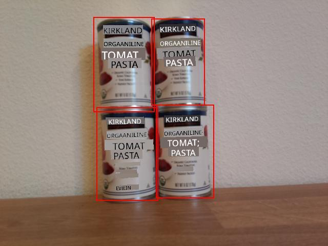

<!--
CO_OP_TRANSLATOR_METADATA:
{
  "original_hash": "9c4320311c0f2c1884a6a21265d98a51",
  "translation_date": "2025-10-11T12:49:04+00:00",
  "source_file": "5-retail/lessons/2-check-stock-device/single-board-computer-count-stock.md",
  "language_code": "et"
}
-->
# Loenda varusid oma IoT-seadmest - Virtuaalne IoT-riistvara ja Raspberry Pi

Ennustuste ja nende piirdekastide kombinatsiooni saab kasutada varude loendamiseks pildil.

## Näita piirdekaste

Kasulikuks silumiseks saate mitte ainult piirdekastid välja printida, vaid ka need joonistada pildile, mis salvestati kettale pildi jäädvustamisel.

### Ülesanne - prindi piirdekastid

1. Veendu, et projekt `stock-counter` on avatud VS Code'is ja virtuaalne keskkond on aktiveeritud, kui kasutad virtuaalset IoT-seadet.

1. Muuda `print`-lause `for`-tsüklis järgnevaks, et piirdekastid konsooli printida:

    ```python
    print(f'{prediction.tag_name}:\t{prediction.probability * 100:.2f}%\t{prediction.bounding_box}')
    ```

1. Käivita rakendus, suunates kaamera riiulil olevatele varudele. Piirdekastid prinditakse konsooli, kus vasak, ülemine, laius ja kõrgus väärtused jäävad vahemikku 0-1.

    ```output
    pi@raspberrypi:~/stock-counter $ python3 app.py 
    tomato paste:   33.42%  {'additional_properties': {}, 'left': 0.3455171, 'top': 0.09916268, 'width': 0.14175442, 'height': 0.29405564}
    tomato paste:   34.41%  {'additional_properties': {}, 'left': 0.48283678, 'top': 0.10242918, 'width': 0.11782813, 'height': 0.27467814}
    tomato paste:   31.25%  {'additional_properties': {}, 'left': 0.4923783, 'top': 0.35007596, 'width': 0.13668466, 'height': 0.28304994}
    tomato paste:   31.05%  {'additional_properties': {}, 'left': 0.36416405, 'top': 0.37494493, 'width': 0.14024884, 'height': 0.26880276}
    ```

### Ülesanne - joonista piirdekastid pildile

1. Pip-paketti [Pillow](https://pypi.org/project/Pillow/) saab kasutada piltidele joonistamiseks. Installi see järgmise käsuga:

    ```sh
    pip3 install pillow
    ```

    Kui kasutad virtuaalset IoT-seadet, veendu, et käivitad selle aktiveeritud virtuaalses keskkonnas.

1. Lisa järgmine import-lause `app.py` faili algusesse:

    ```python
    from PIL import Image, ImageDraw, ImageColor
    ```

    See impordib koodi, mis on vajalik pildi redigeerimiseks.

1. Lisa järgmine kood `app.py` faili lõppu:

    ```python
    with Image.open('image.jpg') as im:
        draw = ImageDraw.Draw(im)
    
        for prediction in predictions:
            scale_left = prediction.bounding_box.left
            scale_top = prediction.bounding_box.top
            scale_right = prediction.bounding_box.left + prediction.bounding_box.width
            scale_bottom = prediction.bounding_box.top + prediction.bounding_box.height
            
            left = scale_left * im.width
            top = scale_top * im.height
            right = scale_right * im.width
            bottom = scale_bottom * im.height
    
            draw.rectangle([left, top, right, bottom], outline=ImageColor.getrgb('red'), width=2)
    
        im.save('image.jpg')
    ```

    See kood avab varem salvestatud pildi redigeerimiseks. Seejärel tsüklis ennustuste kaudu saadakse piirdekastid ja arvutatakse alumine parempoolne koordinaat, kasutades piirdekasti väärtusi vahemikus 0-1. Need väärtused teisendatakse pildikoordinaatideks, korrutades vastava pildi mõõtmega. Näiteks, kui vasak väärtus oli 0.5 pildil, mis oli 600 pikslit lai, siis see teisendatakse 300-ks (0.5 x 600 = 300).

    Iga piirdekast joonistatakse pildile punase joonega. Lõpuks salvestatakse redigeeritud pilt, kirjutades üle algse pildi.

1. Käivita rakendus, suunates kaamera riiulil olevatele varudele. Näed `image.jpg` faili VS Code'i failihalduris ja saad selle valida, et näha piirdekaste.

    

## Loenda varusid

Ülaltoodud pildil on piirdekastidel väike kattuvus. Kui see kattuvus oleks palju suurem, siis piirdekastid võivad viidata samale objektile. Objektide korrektseks loendamiseks tuleb ignoreerida kaste, millel on märkimisväärne kattuvus.

### Ülesanne - loenda varusid, ignoreerides kattuvust

1. Pip-paketti [Shapely](https://pypi.org/project/Shapely/) saab kasutada kattuvuse arvutamiseks. Kui kasutad Raspberry Pi-d, pead esmalt installima teegi sõltuvuse:

    ```sh
    sudo apt install libgeos-dev
    ```

1. Installi Shapely Pip-pakett:

    ```sh
    pip3 install shapely
    ```

    Kui kasutad virtuaalset IoT-seadet, veendu, et käivitad selle aktiveeritud virtuaalses keskkonnas.

1. Lisa järgmine import-lause `app.py` faili algusesse:

    ```python
    from shapely.geometry import Polygon
    ```

    See impordib koodi, mis on vajalik polügoonide loomiseks kattuvuse arvutamiseks.

1. Lisa järgmine kood piirdekastide joonistamise koodi kohale:

    ```python
    overlap_threshold = 0.20
    ```

    See määratleb protsentuaalse kattuvuse, mille korral piirdekastid loetakse samaks objektiks. 0.20 määratleb 20% kattuvuse.

1. Shapely abil kattuvuse arvutamiseks tuleb piirdekastid teisendada Shapely polügoonideks. Lisa järgmine funktsioon selleks:

    ```python
    def create_polygon(prediction):
        scale_left = prediction.bounding_box.left
        scale_top = prediction.bounding_box.top
        scale_right = prediction.bounding_box.left + prediction.bounding_box.width
        scale_bottom = prediction.bounding_box.top + prediction.bounding_box.height
    
        return Polygon([(scale_left, scale_top), (scale_right, scale_top), (scale_right, scale_bottom), (scale_left, scale_bottom)])
    ```

    See loob polügooni, kasutades ennustuse piirdekasti.

1. Kattuvate objektide eemaldamise loogika hõlmab kõigi piirdekastide võrdlemist ja kui mõni ennustuste paaril on piirdekastid, mis kattuvad rohkem kui määratud lävi, kustutatakse üks ennustus. Kõigi ennustuste võrdlemiseks võrreldakse ennustust 1 ennustustega 2, 3, 4 jne, seejärel ennustust 2 ennustustega 3, 4 jne. Järgmine kood teeb seda:

    ```python
    to_delete = []

    for i in range(0, len(predictions)):
        polygon_1 = create_polygon(predictions[i])
    
        for j in range(i+1, len(predictions)):
            polygon_2 = create_polygon(predictions[j])
            overlap = polygon_1.intersection(polygon_2).area

            smallest_area = min(polygon_1.area, polygon_2.area)
    
            if overlap > (overlap_threshold * smallest_area):
                to_delete.append(predictions[i])
                break
    
    for d in to_delete:
        predictions.remove(d)

    print(f'Counted {len(predictions)} stock items')
    ```

    Kattuvus arvutatakse Shapely `Polygon.intersection` meetodiga, mis tagastab polügooni, millel on kattuvus. Ala arvutatakse seejärel sellest polügoonist. Kattuvuse lävi ei ole absoluutväärtus, vaid peab olema protsent piirdekastist, seega leitakse väikseim piirdekast ja kattuvuse lävi kasutatakse arvutamiseks, milline ala kattuvus võib olla, et mitte ületada väikseima piirdekasti protsentuaalset kattuvuse läve. Kui kattuvus ületab seda, märgitakse ennustus kustutamiseks.

    Kui ennustus on märgitud kustutamiseks, ei pea seda enam kontrollima, seega sisemine tsükkel katkestatakse, et kontrollida järgmist ennustust. Sa ei saa loendist esemeid kustutada, kui seda läbi käid, seega lisatakse piirdekastid, mis kattuvad rohkem kui lävi, `to_delete` loendisse ja kustutatakse lõpuks.

    Lõpuks prinditakse varude arv konsooli. See võiks seejärel saata IoT-teenusesse, et hoiatada, kui varude tase on madal. Kogu see kood on enne piirdekastide joonistamist, seega näed genereeritud piltidel ennustusi ilma kattuvusteta.

    > 💁 See on väga lihtsustatud viis kattuvuste eemaldamiseks, kustutades lihtsalt esimese kattuva paari. Tootmiskoodis sooviksid siia lisada rohkem loogikat, näiteks arvestada kattuvusi mitme objekti vahel või kui üks piirdekast on teise sees.

1. Käivita rakendus, suunates kaamera riiulil olevatele varudele. Väljund näitab piirdekastide arvu, mille kattuvus ei ületa läve. Proovi muuta `overlap_threshold` väärtust, et näha, kuidas ennustusi ignoreeritakse.

> 💁 Selle koodi leiad kaustast [code-count/pi](../../../../../5-retail/lessons/2-check-stock-device/code-count/pi) või [code-count/virtual-iot-device](../../../../../5-retail/lessons/2-check-stock-device/code-count/virtual-iot-device).

😀 Sinu varude loendamise programm oli edukas!

---

**Lahtiütlus**:  
See dokument on tõlgitud, kasutades AI tõlketeenust [Co-op Translator](https://github.com/Azure/co-op-translator). Kuigi püüame tagada täpsust, palume arvestada, et automaatsed tõlked võivad sisaldada vigu või ebatäpsusi. Algne dokument selle algses keeles tuleks lugeda autoriteetseks allikaks. Olulise teabe puhul soovitame kasutada professionaalset inimtõlget. Me ei vastuta selle tõlke kasutamisest tulenevate arusaamatuste või valede tõlgenduste eest.