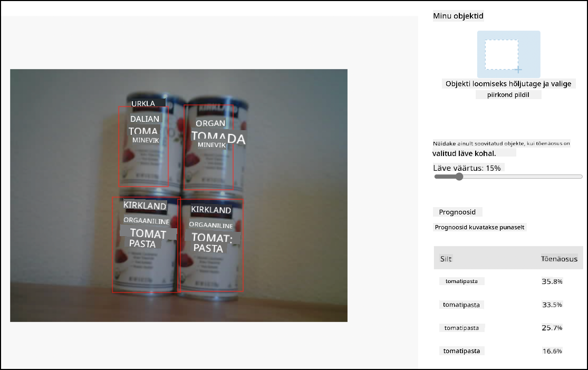

<!--
CO_OP_TRANSLATOR_METADATA:
{
  "original_hash": "4cf1421420a6fab9ab4f2c391bd523b7",
  "translation_date": "2025-10-11T12:50:46+00:00",
  "source_file": "5-retail/lessons/2-check-stock-device/wio-terminal-object-detector.md",
  "language_code": "et"
}
-->
# Kutsu oma objektidetektorit IoT-seadmest - Wio Terminal

Kui sinu objektidetektor on avaldatud, saab seda kasutada IoT-seadmest.

## Kopeeri pildiklassifitseerimise projekt

Enamik sinu laoseisu detektori koodist on sama, mis pildiklassifitseerija, mille lõid eelmises õppetükis.

### Ülesanne - kopeeri pildiklassifitseerimise projekt

1. Ühenda oma ArduCam Wio Terminaliga, järgides samme [tootmisprojekti 2. õppetükist](../../../4-manufacturing/lessons/2-check-fruit-from-device/wio-terminal-camera.md#task---connect-the-camera).

    Võid ka kaamera fikseerida ühte kindlasse asendisse, näiteks riputades kaabli üle kasti või purgi, või kinnitades kaamera kasti külge kahepoolse teibiga.

1. Loo täiesti uus Wio Terminali projekt, kasutades PlatformIO-d. Nimeta see projekt `stock-counter`.

1. Korda samme [tootmisprojekti 2. õppetükist](../../../4-manufacturing/lessons/2-check-fruit-from-device/README.md#task---capture-an-image-using-an-iot-device), et kaamerast pilte jäädvustada.

1. Korda samme [tootmisprojekti 2. õppetükist](../../../4-manufacturing/lessons/2-check-fruit-from-device/README.md#task---classify-images-from-your-iot-device), et kutsuda pildiklassifitseerijat. Enamik sellest koodist kasutatakse uuesti objektide tuvastamiseks.

## Muuda kood klassifitseerijast objektidetektoriks

Kood, mida kasutasid piltide klassifitseerimiseks, on väga sarnane koodile, mis tuvastab objekte. Peamine erinevus on URL, mida kutsutakse (saadud Custom Visionist), ja kõne tulemused.

### Ülesanne - muuda kood klassifitseerijast objektidetektoriks

1. Lisa järgmine include-direktiiv `main.cpp` faili algusesse:

    ```cpp
    #include <vector>
    ```

1. Nimeta funktsioon `classifyImage` ümber `detectStock`, nii funktsiooni nimi kui ka kõne `buttonPressed` funktsioonis.

1. Deklareeri `detectStock` funktsiooni kohal lävend, et filtreerida välja tuvastused, mille tõenäosus on madal:

    ```cpp
    const float threshold = 0.3f;
    ```

    Erinevalt pildiklassifitseerijast, mis tagastab ainult ühe tulemuse iga sildi kohta, tagastab objektidetektor mitu tulemust, seega tuleb madala tõenäosusega tulemused välja filtreerida.

1. Deklareeri `detectStock` funktsiooni kohal funktsioon ennustuste töötlemiseks:

    ```cpp
    void processPredictions(std::vector<JsonVariant> &predictions)
    {
        for(JsonVariant prediction : predictions)
        {
            String tag = prediction["tagName"].as<String>();
            float probability = prediction["probability"].as<float>();
    
            char buff[32];
            sprintf(buff, "%s:\t%.2f%%", tag.c_str(), probability * 100.0);
            Serial.println(buff);
        }
    }
    ```

    See võtab ennustuste loendi ja prindib need seeriamonitorile.

1. Asenda `detectStock` funktsioonis ennustuste läbikäimise tsükli sisu järgmisega:

    ```cpp
    std::vector<JsonVariant> passed_predictions;

    for(JsonVariant prediction : predictions) 
    {
        float probability = prediction["probability"].as<float>();
        if (probability > threshold)
        {
            passed_predictions.push_back(prediction);
        }
    }

    processPredictions(passed_predictions);
    ```

    See tsükkel käib läbi ennustused, võrreldes tõenäosust lävendiga. Kõik ennustused, mille tõenäosus on kõrgem kui lävend, lisatakse `list`-i ja edastatakse `processPredictions` funktsioonile.

1. Laadi üles ja käivita oma kood. Suuna kaamera riiulil olevatele objektidele ja vajuta C-nuppu. Näed väljundit seeriamonitoril:

    ```output
    Connecting to WiFi..
    Connected!
    Image captured
    Image read to buffer with length 17416
    tomato paste:   35.84%
    tomato paste:   35.87%
    tomato paste:   34.11%
    tomato paste:   35.16%
    ```

    > 💁 Võid vajadusel kohandada `threshold` väärtust, et see sobiks sinu piltidega.

    Näed tehtud pilti ja neid väärtusi **Predictions** vahekaardil Custom Visionis.

    

> 💁 Selle koodi leiad [code-detect/wio-terminal](../../../../../5-retail/lessons/2-check-stock-device/code-detect/wio-terminal) kaustast.

😀 Sinu laoseisu loendamise programm oli edukas!

---

**Lahtiütlus**:  
See dokument on tõlgitud AI tõlketeenuse [Co-op Translator](https://github.com/Azure/co-op-translator) abil. Kuigi püüame tagada täpsust, palume arvestada, et automaatsed tõlked võivad sisaldada vigu või ebatäpsusi. Algne dokument selle algses keeles tuleks pidada autoriteetseks allikaks. Olulise teabe puhul soovitame kasutada professionaalset inimtõlget. Me ei vastuta selle tõlke kasutamisest tulenevate arusaamatuste või valesti tõlgenduste eest.