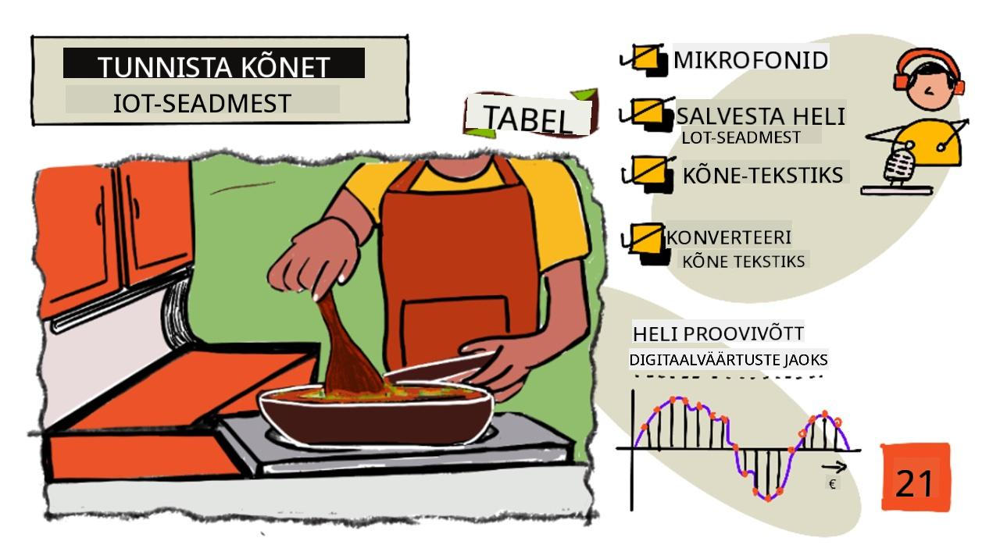
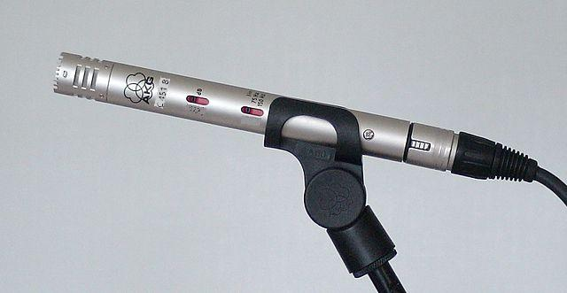
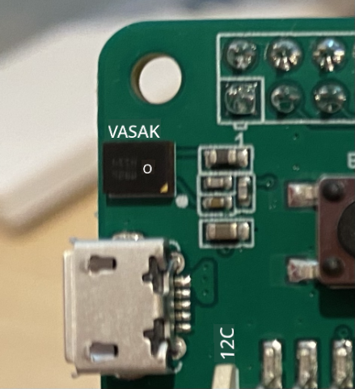
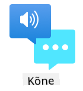

<!--
CO_OP_TRANSLATOR_METADATA:
{
  "original_hash": "6d6aa1be033625d201a190fc9c5cbfb4",
  "translation_date": "2025-10-11T12:21:14+00:00",
  "source_file": "6-consumer/lessons/1-speech-recognition/README.md",
  "language_code": "et"
}
-->
# Tuvasta kõne IoT-seadmega



> Visuaal autorilt [Nitya Narasimhan](https://github.com/nitya). Klõpsa pildil, et näha suuremat versiooni.

See video annab ülevaate Azure kõneteenusest, mis on selle õppetunni teema:

[](https://www.youtube.com/watch?v=iW0Fw0l3mrA)

> 🎥 Klõpsa ülaloleval pildil, et vaadata videot

## Eel-loengu viktoriin

[Eel-loengu viktoriin](https://black-meadow-040d15503.1.azurestaticapps.net/quiz/41)

## Sissejuhatus

'Alexa, pane 12-minutiline taimer'

'Alexa, mis on taimeri staatus?'

'Alexa, pane 8-minutiline taimer nimega auruta brokkoli'

Nutikad seadmed muutuvad üha levinumaks. Mitte ainult nutikõlaritena nagu HomePodid, Echod ja Google Home'id, vaid ka meie telefonides, kellades, valgustites ja termostaatides.

> 💁 Mul on kodus vähemalt 19 seadet, millel on häälassistendid, ja see on ainult nende seadmete arv, millest ma teadlik olen!

Hääljuhtimine suurendab ligipääsetavust, võimaldades piiratud liikumisvõimega inimestel seadmetega suhelda. Olgu tegemist püsiva puudega, näiteks käte puudumisega sünnist saati, ajutise puudega, nagu murtud käed, või olukorraga, kus käed on täis poekotte või väikeseid lapsi – võimalus juhtida oma kodu hääle abil, mitte kätega, avab ligipääsu uue maailma. Hüüdes 'Hei Siri, sulge mu garaažiuks' samal ajal, kui tegeled mähkmevahetuse ja rahutu väikelapsega, võib olla väike, kuid tõhus elukvaliteedi parandamine.

Üks populaarsemaid häälassistentide kasutusviise on taimerite seadmine, eriti köögitaimerite. Võimalus seada mitu taimerit ainult hääle abil on köögis suureks abiks – ei ole vaja katkestada taina sõtkumist, supi segamist ega puhastada käsi, et kasutada füüsilist taimerit.

Selles õppetunnis õpid, kuidas lisada IoT-seadmetele kõnetuvastust. Sa õpid mikrofone kui sensoreid, kuidas salvestada heli mikrofonist, mis on ühendatud IoT-seadmega, ja kuidas kasutada AI-d kuuldud heli tekstiks muutmiseks. Selle projekti käigus ehitad nutika köögitaimeri, mis suudab hääle abil seada taimerid mitmes keeles.

Selles õppetunnis käsitleme:

* [Mikrofonid](../../../../../6-consumer/lessons/1-speech-recognition)
* [Heli salvestamine IoT-seadmest](../../../../../6-consumer/lessons/1-speech-recognition)
* [Kõne tekstiks](../../../../../6-consumer/lessons/1-speech-recognition)
* [Kõne tekstiks muutmine](../../../../../6-consumer/lessons/1-speech-recognition)

## Mikrofonid

Mikrofonid on analoogsensorid, mis muudavad helilained elektrisignaalideks. Õhu vibratsioon põhjustab mikrofoni komponentide väikeseid liikumisi, mis omakorda tekitavad elektrisignaalides väikeseid muutusi. Need muutused võimendatakse, et luua elektriline väljund.

### Mikrofoni tüübid

Mikrofonid on saadaval mitmesugustes tüüpides:

* Dünaamilised - Dünaamilistel mikrofonidel on magnet, mis on kinnitatud liikuva membraani külge, mis liigub traadikeerises, tekitades elektrivoolu. See on vastupidine enamikele kõlaritele, mis kasutavad elektrivoolu magneti liigutamiseks traadikeerises, liigutades membraani heli loomiseks. See tähendab, et kõlareid saab kasutada dünaamiliste mikrofonidena ja dünaamilisi mikrofone saab kasutada kõlaritena. Seadmetes nagu interkomid, kus kasutaja kas kuulab või räägib, kuid mitte mõlemat korraga, võib üks seade toimida nii kõlari kui mikrofonina.

    Dünaamilised mikrofonid ei vaja töötamiseks voolu, elektrisignaal tekib täielikult mikrofonist.

    

* Lintmikrofonid - Lintmikrofonid on sarnased dünaamiliste mikrofonidega, kuid neil on membraani asemel metalllint. See lint liigub magnetväljas, tekitades elektrivoolu. Nagu dünaamilised mikrofonid, ei vaja lintmikrofonid töötamiseks voolu.

    

* Kondensaator - Kondensaator mikrofonidel on õhuke metallmembraan ja fikseeritud metallist tagaplaat. Elektrit rakendatakse mõlemale ja kui membraan vibreerib, muutub plaatide vaheline staatiline laeng, tekitades signaali. Kondensaator mikrofonid vajavad töötamiseks voolu – seda nimetatakse *fantoomtoiteks*.

    

* MEMS - Mikroelektromehaanilised süsteemid mikrofonid ehk MEMS mikrofonid on mikrofonid kiibil. Neil on rõhutundlik membraan, mis on söövitatud räni kiibile, ja need töötavad sarnaselt kondensaator mikrofoniga. Need mikrofonid võivad olla väga väikesed ja integreeritud vooluringidesse.

    

    Ülaloleval pildil on kiip, millel on märgistus **LEFT**, MEMS mikrofon, mille membraan on vähem kui millimeeter lai.

✅ Tee uurimistööd: Millised mikrofonid on sinu ümber – kas arvutis, telefonis, peakomplektis või muudes seadmetes? Mis tüüpi mikrofonid need on?

### Digitaalne heli

Heli on analoogsignaal, mis kannab väga peeneteralist teavet. Selle signaali digitaalseks muutmiseks tuleb heli proovida tuhandeid kordi sekundis.

> 🎓 Proovimine tähendab heli signaali muutmist digitaalseks väärtuseks, mis esindab signaali antud ajahetkel.


Digitaalset heli proovitakse impulsskoodmodulatsiooni ehk PCM-i abil. PCM hõlmab signaali pinge lugemist ja selle pinge lähima diskreetse väärtuse valimist määratletud suuruse järgi.

> 💁 PCM-i võib mõelda kui sensori versiooni impulsslaiusmodulatsioonist ehk PWM-ist (PWM-i käsitleti [algprojekti 3. õppetunnis](../../../1-getting-started/lessons/3-sensors-and-actuators/README.md#pulse-width-modulation)). PCM hõlmab analoogsignaali muutmist digitaalseks, PWM hõlmab digitaalsignaali muutmist analoogiks.

Näiteks enamik voogedastusmuusikateenuseid pakub 16-bitist või 24-bitist heli. See tähendab, et nad muudavad pinge väärtuseks, mis sobib 16-bitise täisarvu või 24-bitise täisarvu vahemikku. 16-bitine heli sobib väärtuseks vahemikus -32,768 kuni 32,767, 24-bitine vahemikus −8,388,608 kuni 8,388,607. Mida rohkem bitte, seda lähemal on proov sellele, mida meie kõrvad tegelikult kuulevad.

> 💁 Võib-olla oled kuulnud 8-bitisest helist, mida sageli nimetatakse LoFi-ks. See on heli, mida proovitakse ainult 8-bitise täpsusega, vahemikus -128 kuni 127. Esimene arvutiheli oli piiratud 8-bitise täpsusega riistvarapiirangute tõttu, mistõttu seda nähakse sageli retro mängudes.

Need proovid tehakse tuhandeid kordi sekundis, kasutades hästi määratletud proovivõtu sagedusi, mida mõõdetakse kHz-des (tuhandeid lugemisi sekundis). Voogedastusmuusikateenused kasutavad enamiku heli jaoks 48 kHz, kuid mõned 'kaotuseta' helid kasutavad kuni 96 kHz või isegi 192 kHz. Mida kõrgem proovivõtu sagedus, seda lähemal on heli originaalile, kuni teatud piirini. On arutelu, kas inimesed suudavad eristada üle 48 kHz sagedusi.

✅ Tee uurimistööd: Kui kasutad voogedastusmuusikateenust, siis millist proovivõtu sagedust ja suurust see kasutab? Kui kasutad CD-sid, siis milline on CD-heli proovivõtu sagedus ja suurus?

Heliandmete jaoks on mitmeid erinevaid formaate. Tõenäoliselt oled kuulnud mp3-failidest – heliandmetest, mis on tihendatud, et muuta need väiksemaks ilma kvaliteeti kaotamata. Tihendamata heli salvestatakse sageli WAV-failina – see on fail, millel on 44 baiti päiseinfot, millele järgneb toorheliandmed. Päis sisaldab teavet, nagu proovivõtu sagedus (näiteks 16000 16 kHz jaoks) ja proovivõtu suurus (16 16-bitise jaoks) ning kanalite arv. Pärast päist sisaldab WAV-fail toorheliandmeid.

> 🎓 Kanalid viitavad sellele, kui palju erinevaid helivooge heli moodustavad. Näiteks stereoheli puhul, kus on vasak ja parem kanal, oleks 2 kanalit. Kodukino süsteemi 7.1 ruumilise heli puhul oleks see 8 kanalit.

### Heliandmete suurus

Heliandmed on suhteliselt suured. Näiteks tihendamata 16-bitise heli salvestamine 16 kHz juures (piisav sagedus kõne tekstiks mudeli jaoks) võtab iga sekundi kohta 32 KB andmeid:

* 16-bitine tähendab 2 baiti proovi kohta (1 bait on 8 bitti).
* 16 kHz tähendab 16 000 proovi sekundis.
* 16 000 x 2 baiti = 32 000 baiti sekundis.

See võib tunduda väike andmehulk, kuid kui kasutad mikrokontrollerit piiratud mäluga, võib see olla palju. Näiteks Wio Terminalil on 192 KB mälu, mis peab salvestama programmi koodi ja muutujad. Isegi kui sinu programmikood oleks väga väike, ei saaks sa salvestada rohkem kui 5 sekundit heli.

Mikrokontrollerid saavad juurde pääseda täiendavale salvestusruumile, näiteks SD-kaartidele või välkmälule. Kui ehitad IoT-seadet, mis salvestab heli, pead tagama, et sul on lisamälu, ja et sinu kood kirjutab mikrofonist salvestatud heli otse sellele mälule. Kui saadad heli pilve, pead voogedastama salvestusest veebipäringusse. Nii väldid mälu otsa saamist, püüdes hoida kogu heliandmete plokki korraga mälus.

## Heli salvestamine IoT-seadmest

Sinu IoT-seade saab olla ühendatud mikrofoniga, et salvestada heli, mis on valmis tekstiks muutmiseks. Samuti saab see olla ühendatud kõlaritega, et heli väljundit anda. Hilisemates õppetundides kasutatakse seda helitagasiside andmiseks, kuid kõlarite seadistamine on kasulik juba praegu, et testida mikrofoni.

### Ülesanne - mikrofonide ja kõlarite seadistamine

Tee läbi vastav juhend, et seadistada mikrofon ja kõlarid oma IoT-seadmele:

* [Arduino - Wio Terminal](wio-terminal-microphone.md)
* [Üheplaadiarvuti - Raspberry Pi](pi-microphone.md)
* [Üheplaadiarvuti - Virtuaalne seade](virtual-device-microphone.md)

### Ülesanne - heli salvestamine

Tee läbi vastav juhend, et salvestada heli oma IoT-seadmel:

* [Arduino - Wio Terminal](wio-terminal-audio.md)
* [Üheplaadiarvuti - Raspberry Pi](pi-audio.md)
* [Üheplaadiarvuti - Virtuaalne seade](virtual-device-audio.md)

## Kõne tekstiks

Kõne tekstiks muutmine ehk kõnetuvastus hõlmab AI kasutamist, et muuta helisignaali sõnad tekstiks.

### Kõnetuvastusmudelid

Kõne tekstiks muutmiseks rühmitatakse helisignaali proovid ja sisestatakse masinõppe mudelisse, mis põhineb korduvatel närvivõrkudel (RNN). See on masinõppe mudeli tüüp, mis suudab kasutada varasemaid andmeid, et teha otsuseid sissetulevate andmete kohta. Näiteks võib RNN tuvastada ühe heliproovide ploki kui heli 'Hel' ja kui see saab teise, mis tema arvates on heli 'lo', saab see kombineerida selle eelmise heliga, leida, et 'Hello' on kehtiv sõna, ja valida selle tulemuseks.

ML-mudelid aktsepteerivad alati sama suurusega andmeid iga kord. Pildiklassifikaator, mille ehitasid varasemas õppetunnis, muudab pildid fikseeritud suuruseks ja töötleb neid. Sama kehtib kõnemudelite kohta – need peavad töötlema fikseeritud suurusega helitükke. Kõnemudelid peavad suutma kombineerida mitme ennustuse tulemusi, et saada vastus, võimaldades eristada 'Hi' ja 'Highway' või 'flock' ja 'floccinaucinihilipilification'.

Kõnemudelid on piisavalt arenenud, et mõista konteksti ja parandada tuvastatud sõnu, kui rohkem helisid töödeldakse. Näiteks kui ütled "Ma läksin poodi, et osta kaks banaani ja üks õun ka", kasutaksid sa kolme sõna, mis kõlavad samamoodi, kuid on kirjutatud erinevalt – to, two ja too. Kõnemudelid suudavad konteksti mõista ja kasutada sõna õiget kirjapilti.

> 💁 Mõned kõneteenused võimaldavad kohandamist, et töötada paremini mürarikkas keskkonnas, nagu tehased, või tööstuspetsiifiliste sõnadega, nagu keemilised nimed. Need kohandused treenitakse, pakkudes näidisheli ja transkriptsiooni, ning töötavad ülekandeõppe abil, samamoodi nagu treenisid pildiklassifikaatorit, kasutades ainult mõnda pilti varasemas õppetunnis.

### Privaatsus

Kui kasutad kõne tekstiks muutmist tarbijale mõeldud IoT-seadmes, on privaatsus äärmiselt oluline. Need seadmed kuulavad heli pidevalt, seega tarbijana ei soovi sa, et kõik, mida ütled, saadetaks pilve ja muudetaks tekstiks. See mitte ainult ei kulutaks palju interneti ribalaiust, vaid sellel on ka suured privaatsusprobleemid, eriti kui mõned nutikate seadmete tootjad valivad juhuslikult heli, et [inimesed saaksid seda võrrelda loodud tekstiga, et aidata nende mudelit parandada](https://www.theverge.com/2019/4/10/18305378/amazon-alexa-ai-voice-assistant-annotation-listen-private-recordings).
Sa soovid, et sinu nutiseade saadaks heli pilve töötlemiseks ainult siis, kui sa seda kasutad, mitte siis, kui see kuuleb heli sinu kodus – heli, mis võib sisaldada privaatseid koosolekuid või intiimseid vestlusi. Enamik nutiseadmeid töötab *äratussõna* abil, mis on võtmefraas nagu "Alexa", "Hey Siri" või "OK Google", mis paneb seadme "ärkama" ja kuulama, mida sa ütled, kuni see tuvastab kõnepausi, mis näitab, et oled seadmega rääkimise lõpetanud.

> 🎓 Äratussõna tuvastamist nimetatakse ka *märksõna tuvastamiseks* või *märksõna äratundmiseks*.

Need äratussõnad tuvastatakse seadmes, mitte pilves. Nutiseadmetel on väikesed AI-mudelid, mis töötavad seadmes ja kuulavad äratussõna, ning kui see tuvastatakse, hakkavad nad heli pilve voogedastama, et seda ära tunda. Need mudelid on väga spetsialiseeritud ja kuulavad ainult äratussõna.

> 💁 Mõned tehnoloogiaettevõtted lisavad oma seadmetele rohkem privaatsust ja teevad osa kõne tekstiks konversioonist seadmes. Apple teatas, et nende 2021. aasta iOS-i ja macOS-i uuenduste osana toetavad nad kõne tekstiks konversiooni seadmes ja suudavad käsitleda paljusid päringuid ilma pilve kasutamata. See on võimalik tänu võimsatele protsessoritele nende seadmetes, mis suudavad käitada ML-mudeleid.

✅ Millised on sinu arvates privaatsuse ja eetika aspektid, mis kaasnevad pilve saadetud heli salvestamisega? Kas seda heli peaks salvestama ja kui jah, siis kuidas? Kas arvad, et salvestiste kasutamine õiguskaitseorganite jaoks on hea kompromiss privaatsuse kaotuse vastu?

Äratussõna tuvastamine kasutab tavaliselt tehnikat nimega TinyML, mis tähendab ML-mudelite kohandamist nii, et need töötaksid mikroprotsessoritel. Need mudelid on väikese suurusega ja tarbivad väga vähe energiat.

Et vältida äratussõna mudeli treenimise ja kasutamise keerukust, kasutab nutikas taimer, mida sa selles õppetükis ehitad, nuppu kõnetuvastuse aktiveerimiseks.

> 💁 Kui soovid proovida äratussõna tuvastamise mudeli loomist, mis töötab Wio Terminalil või Raspberry Pi-l, vaata seda [Edge Impulse'i juhendit "Vastamine sinu häälele"](https://docs.edgeimpulse.com/docs/responding-to-your-voice). Kui soovid seda teha oma arvutis, võid proovida [Microsofti dokumentatsiooni kiirjuhendit "Custom Keyword"](https://docs.microsoft.com/azure/cognitive-services/speech-service/keyword-recognition-overview?WT.mc_id=academic-17441-jabenn).

## Kõne tekstiks konverteerimine



Sarnaselt varasemas projektis tehtud pildiklassifikatsioonile on olemas eelnevalt loodud AI-teenused, mis suudavad võtta kõne helifailina ja konverteerida selle tekstiks. Üks selline teenus on Kõneteenus, mis on osa Cognitive Services'ist – eelnevalt loodud AI-teenustest, mida saad oma rakendustes kasutada.

### Ülesanne - konfigureeri kõne AI-ressurss

1. Loo selle projekti jaoks ressursigrupp nimega `smart-timer`.

1. Kasuta järgmist käsku, et luua tasuta kõneressurss:

    ```sh
    az cognitiveservices account create --name smart-timer \
                                        --resource-group smart-timer \
                                        --kind SpeechServices \
                                        --sku F0 \
                                        --yes \
                                        --location <location>
    ```

    Asenda `<location>` asukohaga, mida kasutasid ressursigrupi loomisel.

1. Sul on vaja API-võtit, et pääseda kõneressursile oma koodist. Käivita järgmine käsk, et saada võti:

    ```sh
    az cognitiveservices account keys list --name smart-timer \
                                           --resource-group smart-timer \
                                           --output table
    ```

    Kopeeri üks võtmetest.

### Ülesanne - konverteeri kõne tekstiks

Tee läbi vastav juhend, et konverteerida kõne tekstiks oma IoT-seadmes:

* [Arduino - Wio Terminal](wio-terminal-speech-to-text.md)
* [Üheplaadiarvuti - Raspberry Pi](pi-speech-to-text.md)
* [Üheplaadiarvuti - Virtuaalne seade](virtual-device-speech-to-text.md)

---

## 🚀 Väljakutse

Kõnetuvastus on eksisteerinud juba pikka aega ja pidevalt paranenud. Uuri praeguseid võimekusi ja võrdle, kuidas need on aja jooksul arenenud, sealhulgas kui täpsed on masintranskriptsioonid võrreldes inimeste omadega.

Mida arvad, milline on kõnetuvastuse tulevik?

## Loengu järgne viktoriin

[Loengu järgne viktoriin](https://black-meadow-040d15503.1.azurestaticapps.net/quiz/42)

## Ülevaade ja iseseisev õppimine

* Loe erinevatest mikrofonitüüpidest ja nende tööpõhimõtetest artiklist [Mis vahe on dünaamilistel ja kondensaatormikrofonidel Musician's HQ-s](https://musicianshq.com/whats-the-difference-between-dynamic-and-condenser-microphones/).
* Loe rohkem Cognitive Services kõneteenuse kohta [Microsofti dokumentatsioonist](https://docs.microsoft.com/azure/cognitive-services/speech-service/?WT.mc_id=academic-17441-jabenn).
* Loe märksõna tuvastamise kohta [Microsofti dokumentatsioonist](https://docs.microsoft.com/azure/cognitive-services/speech-service/keyword-recognition-overview?WT.mc_id=academic-17441-jabenn).

## Ülesanne

[](assignment.md)

---

**Lahtiütlus**:  
See dokument on tõlgitud AI tõlketeenuse [Co-op Translator](https://github.com/Azure/co-op-translator) abil. Kuigi püüame tagada täpsust, palume arvestada, et automaatsed tõlked võivad sisaldada vigu või ebatäpsusi. Algne dokument selle algses keeles tuleks pidada autoriteetseks allikaks. Olulise teabe puhul soovitame kasutada professionaalset inimtõlget. Me ei vastuta selle tõlke kasutamisest tulenevate arusaamatuste või valesti tõlgenduste eest.