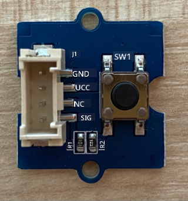

<!--
CO_OP_TRANSLATOR_METADATA:
{
  "original_hash": "0ac0afcfb40cb5970ef4cb74f01c32e9",
  "translation_date": "2025-10-11T12:24:07+00:00",
  "source_file": "6-consumer/lessons/1-speech-recognition/pi-audio.md",
  "language_code": "et"
}
-->
# Salvestage heli - Raspberry Pi

Selles õppetunni osas kirjutate koodi, et salvestada heli oma Raspberry Pi-ga. Helisalvestust juhitakse nupu abil.

## Riistvara

Raspberry Pi vajab nuppu, et juhtida helisalvestust.

Nupp, mida kasutate, on Grove nupp. See on digitaalne sensor, mis lülitab signaali sisse või välja. Need nupud saab seadistada saatma kõrget signaali, kui nuppu vajutatakse, ja madalat, kui seda ei vajutata, või madalat, kui vajutatakse, ja kõrget, kui ei vajutata.

Kui kasutate ReSpeaker 2-Mics Pi HAT-i mikrofonina, siis pole vaja nuppu ühendada, kuna sellel HAT-il on nupp juba olemas. Jätkake järgmise jaotisega.

### Ühendage nupp

Nuppu saab ühendada Grove base hat-iga.

#### Ülesanne - ühendage nupp



1. Sisestage Grove kaabli üks ots nupumooduli pistikusse. See läheb sisse ainult ühel viisil.

1. Kui Raspberry Pi on välja lülitatud, ühendage Grove kaabli teine ots Grove Base hat-i digitaalse pistikuga, mis on märgitud **D5**. See pistik on GPIO pin-ide kõrval olevate pistikute reas vasakult teine.


## Helisalvestus

Mikrofonist heli salvestamiseks saate kasutada Python koodi.

### Ülesanne - salvestage heli

1. Lülitage Pi sisse ja oodake, kuni see käivitub.

1. Käivitage VS Code, kas otse Pi-l või ühendage Remote SSH laienduse kaudu.

1. PyAudio Pip pakett sisaldab funktsioone heli salvestamiseks ja taasesitamiseks. See pakett sõltub mõnest heliraamatukogust, mis tuleb esmalt installida. Käivitage terminalis järgmised käsud, et need installida:

    ```sh
    sudo apt update
    sudo apt install libportaudio0 libportaudio2 libportaudiocpp0 portaudio19-dev libasound2-plugins --yes 
    ```

1. Installige PyAudio Pip pakett.

    ```sh
    pip3 install pyaudio
    ```

1. Looge uus kaust nimega `smart-timer` ja lisage sellele kaustale fail nimega `app.py`.

1. Lisage faili algusesse järgmised impordid:

    ```python
    import io
    import pyaudio
    import time
    import wave
    
    from grove.factory import Factory
    ```

    See impordib `pyaudio` mooduli, mõned standardse Python moodulid WAV-failide käsitlemiseks ja `grove.factory` mooduli, et importida `Factory`, mis loob nupuklassi.

1. Lisage selle alla kood Grove nupu loomiseks.

    Kui kasutate ReSpeaker 2-Mics Pi HAT-i, kasutage järgmist koodi:

    ```python
    # The button on the ReSpeaker 2-Mics Pi HAT
    button = Factory.getButton("GPIO-LOW", 17)
    ```

    See loob nupu pordil **D17**, millele on ühendatud ReSpeaker 2-Mics Pi HAT-i nupp. See nupp on seadistatud saatma madalat signaali, kui seda vajutatakse.

    Kui te ei kasuta ReSpeaker 2-Mics Pi HAT-i ja kasutate Grove nuppu, mis on ühendatud base hat-iga, kasutage seda koodi.

    ```python
    button = Factory.getButton("GPIO-HIGH", 5)
    ```

    See loob nupu pordil **D5**, mis on seadistatud saatma kõrget signaali, kui seda vajutatakse.

1. Lisage selle alla PyAudio klassi eksemplar, et hallata heli:

    ```python
    audio = pyaudio.PyAudio()
    ```

1. Määrake mikrofonile ja kõlarile riistvarakaardi number. See on kaardi number, mille leidsite, kui käivitasite `arecord -l` ja `aplay -l` varem selles õppetunnis.

    ```python
    microphone_card_number = <microphone card number>
    speaker_card_number = <speaker card number>
    ```

    Asendage `<microphone card number>` oma mikrofoni kaardi numbriga.

    Asendage `<speaker card number>` oma kõlari kaardi numbriga, sama numbriga, mille määrasite `alsa.conf` failis.

1. Määrake selle alla helisalvestuse ja taasesituse jaoks kasutatav näidissagedus. Võimalik, et peate seda muutma sõltuvalt kasutatavast riistvarast.

    ```python
    rate = 48000 #48KHz
    ```

    Kui saate hiljem koodi käivitamisel näidissageduse vigu, muutke see väärtus `44100` või `16000`. Mida suurem väärtus, seda parem heli kvaliteet.

1. Looge selle alla uus funktsioon nimega `capture_audio`. Seda kutsutakse mikrofonist heli salvestamiseks:

    ```python
    def capture_audio():
    ```

1. Lisage selle funktsiooni sisse järgmine kood heli salvestamiseks:

    ```python
    stream = audio.open(format = pyaudio.paInt16,
                        rate = rate,
                        channels = 1, 
                        input_device_index = microphone_card_number,
                        input = True,
                        frames_per_buffer = 4096)

    frames = []

    while button.is_pressed():
        frames.append(stream.read(4096))

    stream.stop_stream()
    stream.close()
    ```

    See kood avab PyAudio objekti abil helisisendi voo. See voog salvestab heli mikrofonist sagedusel 16KHz, salvestades selle 4096-baidistes puhvrites.

    Kood kordab tsüklit, kuni Grove nuppu vajutatakse, lugedes iga kord need 4096-baidised puhvrid massiivi.

    > 💁 Lisateavet `open` meetodile edastatavate valikute kohta leiate [PyAudio dokumentatsioonist](https://people.csail.mit.edu/hubert/pyaudio/docs/).

    Kui nupp vabastatakse, voog peatatakse ja suletakse.

1. Lisage selle funktsiooni lõppu järgmine kood:

    ```python
    wav_buffer = io.BytesIO()
    with wave.open(wav_buffer, 'wb') as wavefile:
        wavefile.setnchannels(1)
        wavefile.setsampwidth(audio.get_sample_size(pyaudio.paInt16))
        wavefile.setframerate(rate)
        wavefile.writeframes(b''.join(frames))
        wav_buffer.seek(0)

    return wav_buffer
    ```

    See kood loob binaarse puhvri ja kirjutab kogu salvestatud heli sellesse kui [WAV-fail](https://wikipedia.org/wiki/WAV). See on standardne viis tihendamata heli faili kirjutamiseks. See puhver tagastatakse.

1. Lisage järgmine `play_audio` funktsioon, et taasesitada helipuhvrit:

    ```python
    def play_audio(buffer):
        stream = audio.open(format = pyaudio.paInt16,
                            rate = rate,
                            channels = 1,
                            output_device_index = speaker_card_number,
                            output = True)
    
        with wave.open(buffer, 'rb') as wf:
            data = wf.readframes(4096)
    
            while len(data) > 0:
                stream.write(data)
                data = wf.readframes(4096)
    
            stream.close()
    ```

    See funktsioon avab teise helivoo, seekord väljundiks - heli taasesitamiseks. See kasutab samu seadeid nagu sisendvoog. Puhver avatakse WAV-failina ja kirjutatakse väljundvoogu 4096-baidistes tükkides, taasesitades heli. Voog suletakse.

1. Lisage järgmine kood `capture_audio` funktsiooni alla, et tsüklitada, kuni nuppu vajutatakse. Kui nuppu vajutatakse, salvestatakse heli ja seejärel taasesitatakse.

    ```python
    while True:
        while not button.is_pressed():
            time.sleep(.1)
        
        buffer = capture_audio()
        play_audio(buffer)
    ```

1. Käivitage kood. Vajutage nuppu ja rääkige mikrofoni. Vabastage nupp, kui olete valmis, ja kuulete salvestust.

    Võite saada mõned ALSA vead, kui PyAudio eksemplar luuakse. See on tingitud Pi konfiguratsioonist heliseadmete jaoks, mida teil pole. Võite neid vigu ignoreerida.

    ```output
    pi@raspberrypi:~/smart-timer $ python3 app.py 
    ALSA lib pcm.c:2565:(snd_pcm_open_noupdate) Unknown PCM cards.pcm.front
    ALSA lib pcm.c:2565:(snd_pcm_open_noupdate) Unknown PCM cards.pcm.rear
    ALSA lib pcm.c:2565:(snd_pcm_open_noupdate) Unknown PCM cards.pcm.center_lfe
    ALSA lib pcm.c:2565:(snd_pcm_open_noupdate) Unknown PCM cards.pcm.side
    ```

    Kui saate järgmise vea:

    ```output
    OSError: [Errno -9997] Invalid sample rate
    ```

    siis muutke `rate` väärtuseks kas 44100 või 16000.

> 💁 Selle koodi leiate kaustast [code-record/pi](../../../../../6-consumer/lessons/1-speech-recognition/code-record/pi).

😀 Teie helisalvestusprogramm oli edukas!

---

**Lahtiütlus**:  
See dokument on tõlgitud AI tõlketeenuse [Co-op Translator](https://github.com/Azure/co-op-translator) abil. Kuigi püüame tagada täpsust, palume arvestada, et automaatsed tõlked võivad sisaldada vigu või ebatäpsusi. Algne dokument selle algses keeles tuleks pidada autoriteetseks allikaks. Olulise teabe puhul soovitame kasutada professionaalset inimtõlget. Me ei vastuta selle tõlke kasutamisest tulenevate arusaamatuste või valesti tõlgenduste eest.