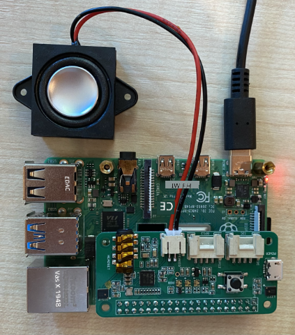

<!--
CO_OP_TRANSLATOR_METADATA:
{
  "original_hash": "7e45d884493c5222348b43fbc4481b6a",
  "translation_date": "2025-10-11T12:22:52+00:00",
  "source_file": "6-consumer/lessons/1-speech-recognition/pi-microphone.md",
  "language_code": "et"
}
-->
# Konfigureeri mikrofon ja kõlarid - Raspberry Pi

Selles õppetunni osas lisad oma Raspberry Pile mikrofoni ja kõlarid.

## Riistvara

Raspberry Pi vajab mikrofoni.

Pi-l ei ole sisseehitatud mikrofoni, seega pead lisama välise mikrofoni. Selleks on mitmeid võimalusi:

* USB mikrofon
* USB peakomplekt
* USB kõik-ühes konverentsiseade
* USB audioadapter ja mikrofon 3,5 mm pistikuga
* [ReSpeaker 2-Mics Pi HAT](https://www.seeedstudio.com/ReSpeaker-2-Mics-Pi-HAT.html)

> 💁 Bluetooth mikrofonid ei ole Raspberry Pi-ga täielikult toetatud, seega kui sul on Bluetooth mikrofon või peakomplekt, võib esineda probleeme sidumise või heli salvestamisega.

Raspberry Pi-l on 3,5 mm kõrvaklappide pesa. Seda saab kasutada kõrvaklappide, peakomplekti või kõlari ühendamiseks. Kõlareid saab lisada ka järgmistel viisidel:

* HDMI heli monitori või televiisori kaudu
* USB kõlarid
* USB peakomplekt
* USB kõik-ühes konverentsiseade
* [ReSpeaker 2-Mics Pi HAT](https://www.seeedstudio.com/ReSpeaker-2-Mics-Pi-HAT.html) koos kõlariga, mis on ühendatud kas 3,5 mm pistikuga või JST porti

## Ühenda ja konfigureeri mikrofon ja kõlarid

Mikrofon ja kõlarid tuleb ühendada ja konfigureerida.

### Ülesanne - ühenda ja konfigureeri mikrofon

1. Ühenda mikrofon sobiva meetodi abil. Näiteks ühenda see ühe USB-pordi kaudu.

1. Kui kasutad ReSpeaker 2-Mics Pi HAT-i, võid eemaldada Grove baashati ja paigaldada ReSpeaker hatti selle asemele.

    

    Sul on hiljem õppetunnis vaja Grove nuppu, kuid see on selle hatti sisse ehitatud, seega Grove baashatti ei ole vaja.

    Kui hatt on paigaldatud, tuleb installida mõned draiverid. Vaata draiverite installimise juhiseid [Seeed algusjuhendist](https://wiki.seeedstudio.com/ReSpeaker_2_Mics_Pi_HAT_Raspberry/#getting-started).

    > ⚠️ Juhised kasutavad `git`-i, et kloonida repositoorium. Kui sul ei ole `git` oma Pi-le installitud, saad selle installida, käivitades järgmise käsu:
    >
    > ```sh
    > sudo apt install git --yes
    > ```

1. Käivita oma terminalis järgmine käsk kas Pi-l või ühendatuna VS Code'i ja kaug-SSH sessiooni kaudu, et näha teavet ühendatud mikrofoni kohta:

    ```sh
    arecord -l
    ```

    Näed nimekirja ühendatud mikrofonidest. See näeb välja umbes selline:

    ```output
    pi@raspberrypi:~ $ arecord -l
    **** List of CAPTURE Hardware Devices ****
    card 1: M0 [eMeet M0], device 0: USB Audio [USB Audio]
      Subdevices: 1/1
      Subdevice #0: subdevice #0
    ```

    Kui sul on ainult üks mikrofon, peaks nimekirjas olema ainult üks kirje. Mikrofonide konfigureerimine Linuxis võib olla keeruline, seega on kõige lihtsam kasutada ainult ühte mikrofoni ja eemaldada kõik teised.

    Pane kaardi number kirja, kuna seda on hiljem vaja. Ülaltoodud väljundis on kaardi number 1.

### Ülesanne - ühenda ja konfigureeri kõlar

1. Ühenda kõlarid sobiva meetodi abil.

1. Käivita oma terminalis järgmine käsk kas Pi-l või ühendatuna VS Code'i ja kaug-SSH sessiooni kaudu, et näha teavet ühendatud kõlarite kohta:

    ```sh
    aplay -l
    ```

    Näed nimekirja ühendatud kõlaritest. See näeb välja umbes selline:

    ```output
    pi@raspberrypi:~ $ aplay -l
    **** List of PLAYBACK Hardware Devices ****
    card 0: Headphones [bcm2835 Headphones], device 0: bcm2835 Headphones [bcm2835 Headphones]
      Subdevices: 8/8
      Subdevice #0: subdevice #0
      Subdevice #1: subdevice #1
      Subdevice #2: subdevice #2
      Subdevice #3: subdevice #3
      Subdevice #4: subdevice #4
      Subdevice #5: subdevice #5
      Subdevice #6: subdevice #6
      Subdevice #7: subdevice #7
    card 1: M0 [eMeet M0], device 0: USB Audio [USB Audio]
      Subdevices: 1/1
      Subdevice #0: subdevice #0
    ```

    Alati näed `card 0: Headphones`, kuna see on sisseehitatud kõrvaklappide pesa. Kui oled lisanud täiendavaid kõlareid, näiteks USB kõlari, näed seda samuti nimekirjas.

1. Kui kasutad täiendavat kõlarit, mitte sisseehitatud kõrvaklappide pesaga ühendatud kõlarit või kõrvaklappe, pead selle seadistama vaikimisi kasutatavaks. Selleks käivita järgmine käsk:

    ```sh
    sudo nano /usr/share/alsa/alsa.conf
    ```

    See avab konfiguratsioonifaili `nano`-s, terminalipõhises tekstiredaktoris. Kerige alla, kasutades klaviatuuri nooleklahve, kuni leiate järgmise rea:

    ```output
    defaults.pcm.card 0
    ```

    Muuda väärtus `0` kaardi numbriks, mida soovid kasutada nimekirjast, mis tuli tagasi `aplay -l` käsu käivitamisel. Näiteks ülaltoodud väljundis on teine helikaart nimega `card 1: M0 [eMeet M0], device 0: USB Audio [USB Audio]`, kasutades kaarti 1. Selle kasutamiseks uuendaksin rea järgmiselt:

    ```output
    defaults.pcm.card 1
    ```

    Määra see väärtus sobivale kaardi numbrile. Saad liikuda numbrini, kasutades klaviatuuri nooleklahve, seejärel kustutada ja sisestada uus number nagu tavaliselt tekstifailide redigeerimisel.

1. Salvesta muudatused ja sulge fail, vajutades `Ctrl+x`. Vajuta `y`, et salvestada fail, seejärel `return`, et valida faili nimi.

### Ülesanne - testi mikrofoni ja kõlarit

1. Käivita järgmine käsk, et salvestada 5 sekundit heli mikrofoni kaudu:

    ```sh
    arecord --format=S16_LE --duration=5 --rate=16000 --file-type=wav out.wav
    ```

    Selle käsu töötamise ajal tee mikrofoni kaudu müra, näiteks räägi, laula, beatboxi, mängi instrumenti või tee midagi muud, mis sulle meeldib.

1. Pärast 5 sekundit salvestamine peatub. Käivita järgmine käsk, et heli tagasi mängida:

    ```sh
    aplay --format=S16_LE --rate=16000 out.wav
    ```

    Kuulad heli, mida mängitakse tagasi kõlarite kaudu. Reguleeri kõlari väljundheli vastavalt vajadusele.

1. Kui pead reguleerima sisseehitatud mikrofoni pesa helitugevust või mikrofoni võimendust, saad kasutada `alsamixer` utiliiti. Selle utiliidi kohta saad rohkem lugeda [Linuxi alsamixer manuaalilehelt](https://linux.die.net/man/1/alsamixer).

1. Kui saad veateateid heli tagasi mängimisel, kontrolli kaarti, mille määrasid `defaults.pcm.card` väärtuseks `alsa.conf` failis.

---

**Lahtiütlus**:  
See dokument on tõlgitud AI tõlketeenuse [Co-op Translator](https://github.com/Azure/co-op-translator) abil. Kuigi püüame tagada täpsust, palume arvestada, et automaatsed tõlked võivad sisaldada vigu või ebatäpsusi. Algne dokument selle algses keeles tuleks pidada autoriteetseks allikaks. Olulise teabe puhul soovitame kasutada professionaalset inimtõlget. Me ei vastuta selle tõlke kasutamisest tulenevate arusaamatuste või valesti tõlgenduste eest.