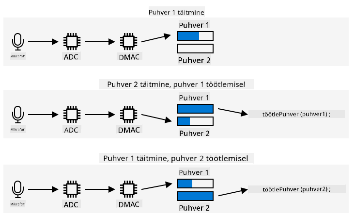

<!--
CO_OP_TRANSLATOR_METADATA:
{
  "original_hash": "2f336726b9410e97c3aaed76cc89b0d8",
  "translation_date": "2025-10-11T12:18:00+00:00",
  "source_file": "6-consumer/lessons/1-speech-recognition/wio-terminal-audio.md",
  "language_code": "et"
}
-->
# Heli salvestamine - Wio Terminal

Selles õppetüki osas kirjutad koodi, et salvestada heli oma Wio Terminaliga. Heli salvestamist juhitakse ühe Wio Terminali ülemise nupu abil.

## Programmeeri seade heli salvestamiseks

Heli saab mikrofonist salvestada C++ koodi abil. Wio Terminalil on ainult 192KB RAM-i, mis ei ole piisav rohkem kui paari sekundi heli salvestamiseks. Sellel on aga 4MB välkmälu, mida saab selle asemel kasutada, salvestades heli välkmällu.

Sisseehitatud mikrofon salvestab analoogsignaali, mis muundatakse digitaalseks signaaliks, mida Wio Terminal saab kasutada. Heli salvestamisel tuleb andmed salvestada õigel ajal - näiteks 16 kHz heli salvestamiseks tuleb heli salvestada täpselt 16 000 korda sekundis, võrdsete intervallidega iga proovi vahel. Selle asemel, et lasta oma koodil seda teha, saad kasutada otsemälujuurdepääsu kontrollerit (DMAC). See on vooluring, mis suudab signaali kuskilt kinni püüda ja kirjutada mällu, ilma et see katkestaks protsessoril töötavat koodi.

✅ Loe rohkem DMA kohta [Wikipedia otsemälujuurdepääsu lehelt](https://wikipedia.org/wiki/Direct_memory_access).



DMAC suudab salvestada heli ADC-st kindlate intervallidega, näiteks 16 000 korda sekundis 16 kHz heli jaoks. See saab kirjutada need salvestatud andmed eelnevalt eraldatud mälupuhvrisse ja kui see on täis, teeb see andmed koodile kättesaadavaks töötlemiseks. Selle mälu kasutamine võib heli salvestamist edasi lükata, kuid saad seadistada mitu puhvrit. DMAC kirjutab puhvrit 1, siis kui see on täis, teavitab see sinu koodi puhvri 1 töötlemiseks, samal ajal kui DMAC kirjutab puhvrit 2. Kui puhver 2 on täis, teavitab see sinu koodi ja läheb tagasi puhvri 1 kirjutamisele. Nii kaua, kui töötled iga puhvrit kiiremini, kui kulub ühe täitmiseks, ei kaota sa andmeid.

Kui iga puhver on salvestatud, saab selle kirjutada välkmällu. Välkmälu tuleb kirjutada määratud aadressidele, täpsustades, kuhu ja kui palju kirjutada, sarnaselt baitide massiivi värskendamisele mälus. Välkmälul on granulaarsus, mis tähendab, et kustutamis- ja kirjutamistoimingud sõltuvad mitte ainult kindlast suurusest, vaid ka selle suurusega joondamisest. Näiteks kui granulaarsus on 4096 baiti ja sa taotled kustutamist aadressil 4200, võib see kustutada kõik andmed aadresside 4096 kuni 8192 vahel. See tähendab, et kui kirjutad helisalvestuse andmeid välkmällu, peab see olema õige suurusega tükkidena.

### Ülesanne - konfigureeri välkmälu

1. Loo uus Wio Terminali projekt, kasutades PlatformIO-d. Nimeta see projekt `smart-timer`. Lisa kood `setup` funktsiooni, et konfigureerida seeriaport.

1. Lisa järgmised teegisõltuvused `platformio.ini` faili, et saada juurdepääs välkmälule:

    ```ini
    lib_deps =
        seeed-studio/Seeed Arduino FS @ 2.1.1
        seeed-studio/Seeed Arduino SFUD @ 2.0.2
    ```

1. Ava `main.cpp` fail ja lisa järgmine include-direktiiv välkmälu teegi jaoks faili algusesse:

    ```cpp
    #include <sfud.h>
    #include <SPI.h>
    ```

    > 🎓 SFUD tähistab Serial Flash Universal Driver-it, mis on loodud töötama kõigi välkmälu kiipidega.

1. Lisa `setup` funktsiooni järgmine kood, et seadistada välkmälu teek:

    ```cpp
    while (!(sfud_init() == SFUD_SUCCESS))
        ;

    sfud_qspi_fast_read_enable(sfud_get_device(SFUD_W25Q32_DEVICE_INDEX), 2);
    ```

    See tsükkel töötab seni, kuni SFUD teek on initsialiseeritud, seejärel lülitatakse sisse kiire lugemine. Sisseehitatud välkmälu saab kasutada Queued Serial Peripheral Interface (QSPI) abil, mis on teatud tüüpi SPI kontroller, mis võimaldab pidevat juurdepääsu järjekorra kaudu minimaalse protsessori kasutusega. See muudab välkmälu lugemise ja kirjutamise kiiremaks.

1. Loo uus fail `src` kausta nimega `flash_writer.h`.

1. Lisa faili algusesse järgmine:

    ```cpp
    #pragma once

    #include <Arduino.h>
    #include <sfud.h>
    ```

    See sisaldab vajalikke päisefaile, sealhulgas SFUD teegi päisefaili, et suhelda välkmäluga.

1. Defineeri selles uues päisefailis klass nimega `FlashWriter`:

    ```cpp
    class FlashWriter
    {
    public:
    
    private:
    };
    ```

1. Lisa `private` sektsiooni järgmine kood:

    ```cpp
    byte *_sfudBuffer;
    size_t _sfudBufferSize;
    size_t _sfudBufferPos;
    size_t _sfudBufferWritePos;

    const sfud_flash *_flash;
    ```

    See määratleb mõned väljad puhvri jaoks, mida kasutatakse andmete salvestamiseks enne nende kirjutamist välkmällu. Seal on baitide massiiv `_sfudBuffer`, kuhu andmeid kirjutatakse, ja kui see on täis, kirjutatakse andmed välkmällu. Väli `_sfudBufferPos` salvestab praeguse asukoha, kuhu sellesse puhvrit kirjutada, ja `_sfudBufferWritePos` salvestab asukoha välkmälus, kuhu kirjutada. `_flash` on osuti välkmälule, kuhu kirjutada - mõnel mikrokontrolleril on mitu välkmälu kiipi.

1. Lisa järgmine meetod `public` sektsiooni, et seda klassi initsialiseerida:

    ```cpp
    void init()
    {
        _flash = sfud_get_device_table() + 0;
        _sfudBufferSize = _flash->chip.erase_gran;
        _sfudBuffer = new byte[_sfudBufferSize];
        _sfudBufferPos = 0;
        _sfudBufferWritePos = 0;
    }
    ```

    See konfigureerib Wio Terminali välkmälu kirjutamiseks ja seadistab puhvri vastavalt välkmälu granulaarsusele. See on `init` meetodis, mitte konstruktoris, kuna see tuleb kutsuda pärast välkmälu seadistamist `setup` funktsioonis.

1. Lisa järgmine kood `public` sektsiooni:

    ```cpp
    void writeSfudBuffer(byte b)
    {
        _sfudBuffer[_sfudBufferPos++] = b;
        if (_sfudBufferPos == _sfudBufferSize)
        {
            sfud_erase_write(_flash, _sfudBufferWritePos, _sfudBufferSize, _sfudBuffer);
            _sfudBufferWritePos += _sfudBufferSize;
            _sfudBufferPos = 0;
        }
    }

    void writeSfudBuffer(byte *b, size_t len)
    {
        for (size_t i = 0; i < len; ++i)
        {
            writeSfudBuffer(b[i]);
        }
    }

    void flushSfudBuffer()
    {
        if (_sfudBufferPos > 0)
        {
            sfud_erase_write(_flash, _sfudBufferWritePos, _sfudBufferSize, _sfudBuffer);
            _sfudBufferWritePos += _sfudBufferSize;
            _sfudBufferPos = 0;
        }
    }
    ```

    See kood määratleb meetodid baitide kirjutamiseks välkmälu süsteemi. See töötab, kirjutades mälupuhvrisse, mis on välkmälu jaoks õige suurusega, ja kui see on täis, kirjutatakse see välkmällu, kustutades kõik olemasolevad andmed selles asukohas. Samuti on olemas meetod `flushSfudBuffer`, et kirjutada mittetäielik puhver, kuna salvestatud andmed ei ole täpselt granulaarsuse kordne, nii et andmete lõpposa tuleb kirjutada.

    > 💁 Andmete lõpposa kirjutab täiendavaid soovimatuid andmeid, kuid see on okei, kuna loetakse ainult vajalikke andmeid.

### Ülesanne - heli salvestamise seadistamine

1. Loo uus fail `src` kausta nimega `config.h`.

1. Lisa faili algusesse järgmine:

    ```cpp
    #pragma once

    #define RATE 16000
    #define SAMPLE_LENGTH_SECONDS 4
    #define SAMPLES RATE * SAMPLE_LENGTH_SECONDS
    #define BUFFER_SIZE (SAMPLES * 2) + 44
    #define ADC_BUF_LEN 1600
    ```

    See kood määratleb mõned konstandid heli salvestamiseks.

    | Konstandid            | Väärtus | Kirjeldus |
    | --------------------- | -----: | - |
    | RATE                  | 16000  | Heli näidissagedus. 16 000 on 16 kHz |
    | SAMPLE_LENGTH_SECONDS | 4      | Salvestatava heli pikkus. See on seatud 4 sekundile. Pikema heli salvestamiseks suurenda seda väärtust. |
    | SAMPLES               | 64000  | Salvestatavate helinäidiste koguarv. Määratud näidissagedus * sekundite arv |
    | BUFFER_SIZE           | 128044 | Heli puhvri suurus salvestamiseks. Heli salvestatakse WAV-failina, mis on 44 baiti päist ja 128 000 baiti helidatat (iga näidis on 2 baiti) |
    | ADC_BUF_LEN           | 1600   | Puhvrite suurus, mida kasutatakse heli salvestamiseks DMAC-iga |

    > 💁 Kui leiad, et 4 sekundit on taimeri taotlemiseks liiga lühike, saad suurendada väärtust `SAMPLE_LENGTH_SECONDS` ja kõik teised väärtused arvutatakse ümber.

1. Loo uus fail `src` kausta nimega `mic.h`.

1. Lisa faili algusesse järgmine:

    ```cpp
    #pragma once

    #include <Arduino.h>

    #include "config.h"
    #include "flash_writer.h"
    ```

    See sisaldab vajalikke päisefaile, sealhulgas `config.h` ja `FlashWriter` päisefaile.

1. Lisa järgmine, et defineerida `Mic` klass, mis suudab mikrofonist salvestada:

    ```cpp
    class Mic
    {
    public:
        Mic()
        {
            _isRecording = false;
            _isRecordingReady = false;
        }
    
        void startRecording()
        {
            _isRecording = true;
            _isRecordingReady = false;
        }
    
        bool isRecording()
        {
            return _isRecording;
        }
    
        bool isRecordingReady()
        {
            return _isRecordingReady;
        }
    
    private:
        volatile bool _isRecording;
        volatile bool _isRecordingReady;
        FlashWriter _writer;
    };
    
    Mic mic;
    ```

    Sellel klassil on praegu ainult paar välja, et jälgida, kas salvestamine on alanud ja kas salvestus on valmis kasutamiseks. Kui DMAC on seadistatud, kirjutab see pidevalt mälupuhvritesse, seega `_isRecording` lipp määrab, kas neid tuleks töödelda või ignoreerida. `_isRecordingReady` lipp seatakse, kui vajalikud 4 sekundit heli on salvestatud. Väli `_writer` kasutatakse helisalvestuse andmete salvestamiseks välkmällu.

    Seejärel deklareeritakse globaalne muutuja `Mic` klassi eksemplari jaoks.

1. Lisa järgmine kood `private` sektsiooni `Mic` klassis:

    ```cpp
    typedef struct
    {
        uint16_t btctrl;
        uint16_t btcnt;
        uint32_t srcaddr;
        uint32_t dstaddr;
        uint32_t descaddr;
    } dmacdescriptor;

    // Globals - DMA and ADC
    volatile dmacdescriptor _wrb[DMAC_CH_NUM] __attribute__((aligned(16)));
    dmacdescriptor _descriptor_section[DMAC_CH_NUM] __attribute__((aligned(16)));
    dmacdescriptor _descriptor __attribute__((aligned(16)));

    void configureDmaAdc()
    {
        // Configure DMA to sample from ADC at a regular interval (triggered by timer/counter)
        DMAC->BASEADDR.reg = (uint32_t)_descriptor_section;                    // Specify the location of the descriptors
        DMAC->WRBADDR.reg = (uint32_t)_wrb;                                    // Specify the location of the write back descriptors
        DMAC->CTRL.reg = DMAC_CTRL_DMAENABLE | DMAC_CTRL_LVLEN(0xf);           // Enable the DMAC peripheral
        DMAC->Channel[1].CHCTRLA.reg = DMAC_CHCTRLA_TRIGSRC(TC5_DMAC_ID_OVF) | // Set DMAC to trigger on TC5 timer overflow
                                        DMAC_CHCTRLA_TRIGACT_BURST;             // DMAC burst transfer

        _descriptor.descaddr = (uint32_t)&_descriptor_section[1];                    // Set up a circular descriptor
        _descriptor.srcaddr = (uint32_t)&ADC1->RESULT.reg;                           // Take the result from the ADC0 RESULT register
        _descriptor.dstaddr = (uint32_t)_adc_buf_0 + sizeof(uint16_t) * ADC_BUF_LEN; // Place it in the adc_buf_0 array
        _descriptor.btcnt = ADC_BUF_LEN;                                             // Beat count
        _descriptor.btctrl = DMAC_BTCTRL_BEATSIZE_HWORD |                            // Beat size is HWORD (16-bits)
                                DMAC_BTCTRL_DSTINC |                                    // Increment the destination address
                                DMAC_BTCTRL_VALID |                                     // Descriptor is valid
                                DMAC_BTCTRL_BLOCKACT_SUSPEND;                           // Suspend DMAC channel 0 after block transfer
        memcpy(&_descriptor_section[0], &_descriptor, sizeof(_descriptor));          // Copy the descriptor to the descriptor section

        _descriptor.descaddr = (uint32_t)&_descriptor_section[0];                    // Set up a circular descriptor
        _descriptor.srcaddr = (uint32_t)&ADC1->RESULT.reg;                           // Take the result from the ADC0 RESULT register
        _descriptor.dstaddr = (uint32_t)_adc_buf_1 + sizeof(uint16_t) * ADC_BUF_LEN; // Place it in the adc_buf_1 array
        _descriptor.btcnt = ADC_BUF_LEN;                                             // Beat count
        _descriptor.btctrl = DMAC_BTCTRL_BEATSIZE_HWORD |                            // Beat size is HWORD (16-bits)
                                DMAC_BTCTRL_DSTINC |                                    // Increment the destination address
                                DMAC_BTCTRL_VALID |                                     // Descriptor is valid
                                DMAC_BTCTRL_BLOCKACT_SUSPEND;                           // Suspend DMAC channel 0 after block transfer
        memcpy(&_descriptor_section[1], &_descriptor, sizeof(_descriptor));          // Copy the descriptor to the descriptor section

        // Configure NVIC
        NVIC_SetPriority(DMAC_1_IRQn, 0); // Set the Nested Vector Interrupt Controller (NVIC) priority for DMAC1 to 0 (highest)
        NVIC_EnableIRQ(DMAC_1_IRQn);      // Connect DMAC1 to Nested Vector Interrupt Controller (NVIC)

        // Activate the suspend (SUSP) interrupt on DMAC channel 1
        DMAC->Channel[1].CHINTENSET.reg = DMAC_CHINTENSET_SUSP;

        // Configure ADC
        ADC1->INPUTCTRL.bit.MUXPOS = ADC_INPUTCTRL_MUXPOS_AIN12_Val; // Set the analog input to ADC0/AIN2 (PB08 - A4 on Metro M4)
        while (ADC1->SYNCBUSY.bit.INPUTCTRL)
            ;                              // Wait for synchronization
        ADC1->SAMPCTRL.bit.SAMPLEN = 0x00; // Set max Sampling Time Length to half divided ADC clock pulse (2.66us)
        while (ADC1->SYNCBUSY.bit.SAMPCTRL)
            ;                                         // Wait for synchronization
        ADC1->CTRLA.reg = ADC_CTRLA_PRESCALER_DIV128; // Divide Clock ADC GCLK by 128 (48MHz/128 = 375kHz)
        ADC1->CTRLB.reg = ADC_CTRLB_RESSEL_12BIT |    // Set ADC resolution to 12 bits
                            ADC_CTRLB_FREERUN;          // Set ADC to free run mode
        while (ADC1->SYNCBUSY.bit.CTRLB)
            ;                       // Wait for synchronization
        ADC1->CTRLA.bit.ENABLE = 1; // Enable the ADC
        while (ADC1->SYNCBUSY.bit.ENABLE)
            ;                       // Wait for synchronization
        ADC1->SWTRIG.bit.START = 1; // Initiate a software trigger to start an ADC conversion
        while (ADC1->SYNCBUSY.bit.SWTRIG)
            ; // Wait for synchronization

        // Enable DMA channel 1
        DMAC->Channel[1].CHCTRLA.bit.ENABLE = 1;

        // Configure Timer/Counter 5
        GCLK->PCHCTRL[TC5_GCLK_ID].reg = GCLK_PCHCTRL_CHEN |     // Enable peripheral channel for TC5
                                            GCLK_PCHCTRL_GEN_GCLK1; // Connect generic clock 0 at 48MHz

        TC5->COUNT16.WAVE.reg = TC_WAVE_WAVEGEN_MFRQ; // Set TC5 to Match Frequency (MFRQ) mode
        TC5->COUNT16.CC[0].reg = 3000 - 1;            // Set the trigger to 16 kHz: (4Mhz / 16000) - 1
        while (TC5->COUNT16.SYNCBUSY.bit.CC0)
            ; // Wait for synchronization

        // Start Timer/Counter 5
        TC5->COUNT16.CTRLA.bit.ENABLE = 1; // Enable the TC5 timer
        while (TC5->COUNT16.SYNCBUSY.bit.ENABLE)
            ; // Wait for synchronization
    }

    uint16_t _adc_buf_0[ADC_BUF_LEN];
    uint16_t _adc_buf_1[ADC_BUF_LEN];
    ```

    See kood määratleb meetodi `configureDmaAdc`, mis konfigureerib DMAC-i, ühendades selle ADC-ga ja seades selle täitma kahte erinevat vahelduvat puhvrit, `_adc_buf_0` ja `_adc_buf_1`.

    > 💁 Üks mikrokontrolleri arenduse puudusi on riistvaraga suhtlemiseks vajaliku koodi keerukus, kuna sinu kood töötab väga madalal tasemel, suheldes otse riistvaraga. See kood on keerulisem kui see, mida kirjutaksid üheplaadiarvuti või lauaarvuti jaoks, kuna puudub operatsioonisüsteem, mis aitaks. Siiski on saadaval mõned teegid, mis võivad seda lihtsustada, kuid keerukus jääb.

1. Lisa selle koodi alla järgmine:

    ```cpp
    // WAV files have a header. This struct defines that header
    struct wavFileHeader
    {
        char riff[4];         /* "RIFF"                                  */
        long flength;         /* file length in bytes                    */
        char wave[4];         /* "WAVE"                                  */
        char fmt[4];          /* "fmt "                                  */
        long chunk_size;      /* size of FMT chunk in bytes (usually 16) */
        short format_tag;     /* 1=PCM, 257=Mu-Law, 258=A-Law, 259=ADPCM */
        short num_chans;      /* 1=mono, 2=stereo                        */
        long srate;           /* Sampling rate in samples per second     */
        long bytes_per_sec;   /* bytes per second = srate*bytes_per_samp */
        short bytes_per_samp; /* 2=16-bit mono, 4=16-bit stereo          */
        short bits_per_samp;  /* Number of bits per sample               */
        char data[4];         /* "data"                                  */
        long dlength;         /* data length in bytes (filelength - 44)  */
    };

    void initBufferHeader()
    {
        wavFileHeader wavh;

        strncpy(wavh.riff, "RIFF", 4);
        strncpy(wavh.wave, "WAVE", 4);
        strncpy(wavh.fmt, "fmt ", 4);
        strncpy(wavh.data, "data", 4);

        wavh.chunk_size = 16;
        wavh.format_tag = 1; // PCM
        wavh.num_chans = 1;  // mono
        wavh.srate = RATE;
        wavh.bytes_per_sec = (RATE * 1 * 16 * 1) / 8;
        wavh.bytes_per_samp = 2;
        wavh.bits_per_samp = 16;
        wavh.dlength = RATE * 2 * 1 * 16 / 2;
        wavh.flength = wavh.dlength + 44;

        _writer.writeSfudBuffer((byte *)&wavh, 44);
    }
    ```

    See kood määratleb WAV-päise struktuurina, mis võtab 44 baiti mälu. See kirjutab sinna üksikasjad helifaili sageduse, suuruse ja kanalite arvu kohta. See päis kirjutatakse seejärel välkmällu.

1. Selle koodi alla lisa järgmine, et deklareerida meetod, mida kutsutakse, kui helipuhvrid on töötlemiseks valmis:

    ```cpp
    void audioCallback(uint16_t *buf, uint32_t buf_len)
    {
        static uint32_t idx = 44;

        if (_isRecording)
        {
            for (uint32_t i = 0; i < buf_len; i++)
            {
                int16_t audio_value = ((int16_t)buf[i] - 2048) * 16;

                _writer.writeSfudBuffer(audio_value & 0xFF);
                _writer.writeSfudBuffer((audio_value >> 8) & 0xFF);
            }

            idx += buf_len;
                
            if (idx >= BUFFER_SIZE)
            {
                _writer.flushSfudBuffer();
                idx = 44;
                _isRecording = false;
                _isRecordingReady = true;
            }
        }
    }
    ```

    Helipuhvrid on 16-bitiste täisarvude massiivid, mis sisaldavad ADC-st saadud heli. ADC tagastab 12-bitised allkirjastamata väärtused (0-1023), seega tuleb need teisendada 16-bitisteks allkirjastatud väärtusteks ja seejärel teisendada kaheks baitiks, et neid saaks salvestada toorandmetena.

    Need baidid kirjutatakse välkmälu puhvritesse. Kirjutamine algab indeksist 44 - see on nihe 44 baidist, mis kirjutati WAV-faili päisena. Kui kõik vajalikud helipikkuse andmed on salvestatud, kirjutatakse ülejäänud andmed välkmällu.

1. Lisa `Mic` klassi `public` sektsiooni järgmine kood:

    ```cpp
    void dmaHandler()
    {
        static uint8_t count = 0;

        if (DMAC->Channel[1].CHINTFLAG.bit.SUSP)
        {
            DMAC->Channel[1].CHCTRLB.reg = DMAC_CHCTRLB_CMD_RESUME;
            DMAC->Channel[1].CHINTFLAG.bit.SUSP = 1;

            if (count)
            {
                audioCallback(_adc_buf_0, ADC_BUF_LEN);
            }
            else
            {
                audioCallback(_adc_buf_1, ADC_BUF_LEN);
            }

            count = (count + 1) % 2;
        }
    }
    ```

    See kood kutsutakse DMAC-i poolt, et öelda sinu koodile puhvrite töötlemiseks. See kontrollib, kas on andmeid töötlemiseks, ja kutsub `audioCallback` meetodit vastava puhvri jaoks.

1. Klassi väliselt, pärast `Mic mic;` deklaratsiooni, lisa järgmine kood:

    ```cpp
    void DMAC_1_Handler()
    {
        mic.dmaHandler();
    }
    ```

    `DMAC_1_Handler` kutsutakse DMAC-i poolt, kui puhvrite töötlemiseks on valmis. See funktsioon leitakse nime järgi, seega peab see lihtsalt olemas olema, et seda saaks kutsuda.

1. Lisa järgmised kaks meetodit `Mic` klassi `public` sektsiooni:

    ```cpp
    void init()
    {
        analogReference(AR_INTERNAL2V23);

        _writer.init();

        initBufferHeader();
        configureDmaAdc();
    }

    void reset()
    {
        _isRecordingReady = false;
        _isRecording = false;

        _writer.reset();

        initBufferHeader();
    }
    ```

    `init` meetod sisaldab koodi `Mic` klassi initsialiseerimiseks. See meetod seab mikrofoni pinni jaoks õige pinge, seadistab välkmälu kirjutaja, kirjutab WAV-faili päise ja konfigureerib DMAC-i. `reset` meetod lähtestab välkmälu ja kirjutab päise uuesti pärast seda, kui heli on salvestatud ja kasutatud.

### Ülesanne - heli salvestamine

1. Lisa `main.cpp` faili include-direktiiv `mic.h` päisefaili jaoks:

    ```cpp
    #include "mic.h"
    ```

1. Lisa `setup` funktsiooni C-nupu initsialiseerimine. Heli salvestamine algab, kui seda nuppu vajutatakse, ja kestab 4 sekundit:

    ```cpp
    pinMode(WIO_KEY_C, INPUT_PULLUP);
    ```

1. Lisa selle alla mikrofoni initsialiseerimine, seejärel prindi konsoolile teade, et heli on valmis salvestamiseks:

    ```cpp
    mic.init();

    Serial.println("Ready.");
    ```

1. Lisa `loop` funktsiooni kohale funktsiooni deklaratsioon salvestatud heli töötlemiseks. Praegu see ei tee midagi, kuid hiljem selles õppetükis saadab see kõne teksti teisendamiseks:

    ```cpp
    void processAudio()
    {
    
    }
    ```

1. Lisa järgmine kood `loop` funktsiooni:

    ```cpp
    void loop()
    {
        if (digitalRead(WIO_KEY_C) == LOW && !mic.isRecording())
        {
            Serial.println("Starting recording...");
            mic.startRecording();
        }
    
        if (!mic.isRecording() && mic.isRecordingReady())
        {
            Serial.println("Finished recording");
    
            processAudio();
    
            mic.reset();
        }
    }
    ```

    See kood kontrollib C-nuppu ja kui see on vajutatud ning salvestamine pole veel alanud, siis seatakse `Mic` klassi `_isRecording` väli väärtusele true. See põhjustab `Mic` klassi `audioCallback` meetodi salvestama heli, kuni 4 sekundit on salvestatud. Kui 4 sekundit heli on salvestatud, seatakse `_isRecording` väli väärtusele false ja `_isRecordingReady` väli väärtusele true. Seda kontrollitakse seejärel `loop` funktsioonis ja kui see on true, kutsutakse `processAudio` funktsiooni, seejärel lähtestatakse `mic` klass.

1. Koosta see kood, laadi see oma Wio Terminali ja testi seda seeriamonitori kaudu. Vajuta C-nuppu (vasakpoolne nupp, mis on kõige lähemal toitelülitile) ja räägi. Salvestatakse 4 sekundit heli.

    ```output
    --- Available filters and text transformations: colorize, debug, default, direct, hexlify, log2file, nocontrol, printable, send_on_enter, time
    --- More details at http://bit.ly/pio-monitor-filters
    --- Miniterm on /dev/cu.usbmodem1101  9600,8,N,1 ---
    --- Quit: Ctrl+C | Menu: Ctrl+T | Help: Ctrl+T followed by Ctrl+H ---
    Ready.
    Starting recording...
    Finished recording
    ```

> 💁 Selle koodi leiad kaustast [code-record/wio-terminal](../../../../../6-consumer/lessons/1-speech-recognition/code-record/wio-terminal).

😀 Sinu helisalvestusprogramm õnnestus!

---

**Vastutusest loobumine**:  
See dokument on tõlgitud AI tõlketeenuse [Co-op Translator](https://github.com/Azure/co-op-translator) abil. Kuigi püüame tagada täpsust, palume arvestada, et automaatsed tõlked võivad sisaldada vigu või ebatäpsusi. Algne dokument selle algses keeles tuleks pidada autoriteetseks allikaks. Olulise teabe puhul soovitame kasutada professionaalset inimtõlget. Me ei vastuta arusaamatuste või valesti tõlgenduste eest, mis võivad tuleneda selle tõlke kasutamisest.