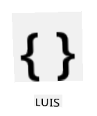
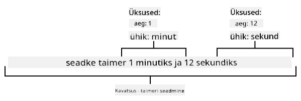
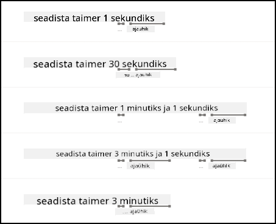

<!--
CO_OP_TRANSLATOR_METADATA:
{
  "original_hash": "6f4ba69d77f16c4a5110623a96a215c3",
  "translation_date": "2025-10-11T12:12:09+00:00",
  "source_file": "6-consumer/lessons/2-language-understanding/README.md",
  "language_code": "et"
}
-->
# Mõista keelt


> Visuaalne märkmik: [Nitya Narasimhan](https://github.com/nitya). Klõpsa pildil, et näha suuremat versiooni.

## Eel-loengu viktoriin

[Eel-loengu viktoriin](https://black-meadow-040d15503.1.azurestaticapps.net/quiz/43)

## Sissejuhatus

Eelmises õppetunnis muundasid kõne tekstiks. Selleks, et seda kasutada nutika taimeri programmeerimiseks, peab sinu kood mõistma, mida öeldi. Võid eeldada, et kasutaja ütleb kindla fraasi, näiteks "Sea 3-minutiline taimer", ja analüüsida seda väljendit, et määrata taimeri kestus. Kuid see pole eriti kasutajasõbralik. Kui kasutaja ütleks "Sea taimer 3 minutiks", mõistaksid sina ja mina, mida ta tähendab, kuid sinu kood ei mõistaks, kuna see ootaks kindlat fraasi.

Siin tulebki mängu keele mõistmine, kasutades AI-mudeleid teksti tõlgendamiseks ja vajalike detailide tagastamiseks. Näiteks suudaks mudel mõista nii "Sea 3-minutiline taimer" kui ka "Sea taimer 3 minutiks" ja tuvastada, et on vaja taimerit 3 minutiks.

Selles õppetunnis õpid keele mõistmise mudeleid, nende loomist, treenimist ja kasutamist oma koodis.

Selles õppetunnis käsitleme:

* [Keele mõistmine](../../../../../6-consumer/lessons/2-language-understanding)
* [Keele mõistmise mudeli loomine](../../../../../6-consumer/lessons/2-language-understanding)
* [Intentsioonid ja entiteedid](../../../../../6-consumer/lessons/2-language-understanding)
* [Keele mõistmise mudeli kasutamine](../../../../../6-consumer/lessons/2-language-understanding)

## Keele mõistmine

Inimesed on kasutanud keelt suhtlemiseks sadu tuhandeid aastaid. Me suhtleme sõnade, helide või tegevuste kaudu ja mõistame, mida öeldakse – nii sõnade, helide või tegevuste tähendust kui ka nende konteksti. Me mõistame siirust ja sarkasmi, mis võimaldab samadel sõnadel tähendada erinevaid asju sõltuvalt meie hääletoonist.

✅ Mõtle hiljutistele vestlustele, mida oled pidanud. Kui palju sellest vestlusest oleks arvutile raske mõista, kuna see vajab konteksti?

Keele mõistmine, mida nimetatakse ka loomuliku keele mõistmiseks, on osa tehisintellekti valdkonnast, mida nimetatakse loomuliku keele töötlemiseks (NLP). See tegeleb lugemisoskusega, püüdes mõista sõnade või lausetega seotud detaile. Kui kasutad hääleassistenti, nagu Alexa või Siri, oled kasutanud keele mõistmise teenuseid. Need on taustal töötavad AI-teenused, mis muundavad "Alexa, mängi Taylor Swifti uusimat albumit" minu tütreks, kes tantsib elutoas oma lemmikmuusika saatel.

> 💁 Arvutid, hoolimata kõigist oma edusammudest, on endiselt kaugel tekstist tõelise arusaamise saavutamisest. Kui räägime arvutite keele mõistmisest, ei pea me silmas midagi kaugeltki nii arenenud kui inimestevaheline suhtlus, vaid pigem mõningate sõnade võtmedetailide väljavõtmist.

Inimestena mõistame keelt ilma sellele eriti mõtlemata. Kui ma paluksin teisel inimesel "mängida Taylor Swifti uusimat albumit", siis ta teaks instinktiivselt, mida ma mõtlen. Arvuti jaoks on see keerulisem. See peaks võtma sõnad, mis on muundatud kõnest tekstiks, ja tuvastama järgmised infokillud:

* Tuleb mängida muusikat
* Muusika on artistilt Taylor Swift
* Konkreetne muusika on terve album mitme järjestikuse looga
* Taylor Swiftil on palju albumeid, seega tuleb need järjestada kronoloogiliselt ja valida kõige hiljuti avaldatud album

✅ Mõtle mõnele teisele lausele, mida oled öelnud, kui oled midagi palunud, näiteks kohvi tellimine või pereliikmelt millegi ulatamine. Proovi lahti võtta, millist infot arvuti peaks lause mõistmiseks välja võtma.

Keele mõistmise mudelid on AI-mudelid, mis on treenitud teatud detailide väljavõtmiseks keelest ja seejärel treenitud konkreetsete ülesannete jaoks, kasutades ülekandeõpet, samamoodi nagu treenisid Custom Vision mudelit väikese pildikomplektiga. Võid võtta mudeli ja treenida seda tekstiga, mida soovid, et see mõistaks.

## Keele mõistmise mudeli loomine



Saad luua keele mõistmise mudeleid, kasutades LUIS-i, Microsofti keele mõistmise teenust, mis on osa Cognitive Services'ist.

### Ülesanne – autoriseerimisressursi loomine

LUIS-i kasutamiseks pead looma autoriseerimisressursi.

1. Kasuta järgmist käsku, et luua autoriseerimisressurss oma `smart-timer` ressursigrupis:

    ```python
    az cognitiveservices account create --name smart-timer-luis-authoring \
                                        --resource-group smart-timer \
                                        --kind LUIS.Authoring \
                                        --sku F0 \
                                        --yes \
                                        --location <location>
    ```

    Asenda `<location>` asukohaga, mida kasutasid ressursigrupi loomisel.

    > ⚠️ LUIS pole saadaval kõigis piirkondades, seega kui saad järgmise vea:
    >
    > ```output
    > InvalidApiSetId: The account type 'LUIS.Authoring' is either invalid or unavailable in given region.
    > ```
    >
    > vali teine piirkond.

    See loob tasuta taseme LUIS autoriseerimisressursi.

### Ülesanne – keele mõistmise rakenduse loomine

1. Ava LUIS portaal [luis.ai](https://luis.ai?WT.mc_id=academic-17441-jabenn) oma brauseris ja logi sisse sama kontoga, mida oled kasutanud Azure'is.

1. Järgi dialoogi juhiseid, et valida oma Azure'i tellimus, seejärel vali just loodud `smart-timer-luis-authoring` ressurss.

1. *Conversation apps* loendist vali **New app** nupp, et luua uus rakendus. Nimetage uus rakendus `smart-timer` ja seadke *Culture* oma keelele.

    > 💁 Seal on väli ennustamisressursi jaoks. Võid luua teise ressursi ainult ennustamiseks, kuid tasuta autoriseerimisressurss võimaldab 1000 ennustust kuus, mis peaks olema arendamiseks piisav, seega võid selle tühjaks jätta.

1. Loe läbi juhend, mis ilmub pärast rakenduse loomist, et saada ülevaade sammudest, mida pead keele mõistmise mudeli treenimiseks tegema. Sulge juhend, kui oled valmis.

## Intentsioonid ja entiteedid

Keele mõistmine põhineb *intentsioonidel* ja *entiteetidel*. Intentsioonid on sõnade eesmärk, näiteks muusika mängimine, taimeri seadmine või toidu tellimine. Entiteedid on see, millele intentsioon viitab, näiteks album, taimeri kestus või toidu tüüp. Igal lausel, mida mudel tõlgendab, peaks olema vähemalt üks intentsioon ja valikuliselt üks või mitu entiteeti.

Mõned näited:

| Lause                                              | Intentsioon      | Entiteedid                                 |
| -------------------------------------------------- | ---------------- | ------------------------------------------ |
| "Mängi Taylor Swifti uusimat albumit"              | *mängi muusikat* | *Taylor Swifti uusim album*                |
| "Sea 3-minutiline taimer"                          | *sea taimer*     | *3 minutit*                                |
| "Tühista minu taimer"                              | *tühista taimer* | Puudub                                     |
| "Tellin 3 suurt ananassipitsat ja ühe Caesari salati" | *telli toit*     | *3 suurt ananassipitsat*, *Caesari salat*  |

✅ Võta laused, millele varem mõtlesid, ja mõtle, mis oleks intentsioon ja entiteedid nendes lausetes.

LUIS-i treenimiseks määrad esmalt entiteedid. Need võivad olla kindel loend termineid või õpitud tekstist. Näiteks võid pakkuda kindla loendi menüüs olevatest toitudest koos variatsioonidega (või sünonüümidega) iga sõna jaoks, nagu *baklažaan* ja *aubergine* kui *aubergine* variatsioonid. LUIS-il on ka eelnevalt loodud entiteedid, mida saab kasutada, näiteks numbrid ja asukohad.

Taimeri seadmiseks võiksid olla kaks entiteeti: üks ajaühiku jaoks (minutid või sekundid) ja teine minutite või sekundite arvuks. Iga ühik võiks sisaldada mitmeid variatsioone, et katta nii ainsuse kui mitmuse vormid – näiteks minut ja minutid.

Kui entiteedid on määratud, lood intentsioonid. Need õpitakse mudeli poolt näidislauseid kasutades (mida nimetatakse *ütlusteks*). Näiteks intentsiooni *sea taimer* jaoks võiksid näidislauseid olla:

* `sea 1-sekundiline taimer`
* `sea taimer 1 minutiks ja 12 sekundiks`
* `sea taimer 3 minutiks`
* `sea 9-minutiline ja 30-sekundiline taimer`

Seejärel ütled LUIS-ile, millised osad nendest lausetest vastavad entiteetidele:



Lause `sea taimer 1 minutiks ja 12 sekundiks` intentsioon on `sea taimer`. Sellel on ka 2 entiteeti, millel on 2 väärtust:

|            | aeg | ühik   |
| ---------- | ---: | ------ |
| 1 minut    | 1    | minut  |
| 12 sekundit| 12   | sekund |

Hea mudeli treenimiseks on vaja mitmesuguseid näidislauseid, et katta erinevaid viise, kuidas keegi võiks sama asja küsida.

> 💁 Nagu iga AI-mudeli puhul, mida rohkem ja täpsemat andmeid treenimiseks kasutad, seda parem mudel.

✅ Mõtle erinevatele viisidele, kuidas võiksid sama asja küsida ja eeldada, et inimene mõistab.

### Ülesanne – entiteetide lisamine keele mõistmise mudelisse

Taimeri jaoks pead lisama 2 entiteeti – ühe ajaühiku jaoks (minutid või sekundid) ja ühe minutite või sekundite arvu jaoks.

LUIS portaali kasutamise juhised leiad [Microsofti dokumentatsioonist: Quickstart: Build your app in LUIS portal](https://docs.microsoft.com/azure/cognitive-services/luis/luis-get-started-create-app?WT.mc_id=academic-17441-jabenn).

1. LUIS portaalis vali *Entities* vahekaart ja lisa *number* eelnevalt loodud entiteet, valides **Add prebuilt entity** nupu ja valides loendist *number*.

1. Loo uus entiteet ajaühiku jaoks, kasutades **Create** nuppu. Nimetage entiteet `time unit` ja seadke tüüp *List*. Lisage väärtused `minute` ja `second` *Normalized values* loendisse, lisades ainsuse ja mitmuse vormid *synonyms* loendisse. Vajutage `return` pärast iga sünonüümi lisamist, et lisada see loendisse.

    | Normaliseeritud väärtus | Sünonüümid        |
    | ----------------------- | ----------------- |
    | minut                  | minut, minutid    |
    | sekund                 | sekund, sekundid  |

### Ülesanne – intentsioonide lisamine keele mõistmise mudelisse

1. *Intents* vahekaardilt vali **Create** nupp, et luua uus intentsioon. Nimetage intentsioon `set timer`.

1. Näidetes sisestage erinevaid viise taimeri seadmiseks, kasutades nii minuteid, sekundeid kui ka minuteid ja sekundeid koos. Näited võiksid olla:

    * `sea 1-sekundiline taimer`
    * `sea 4-minutiline taimer`
    * `sea neljaminutiline ja kuuesekundiline taimer`
    * `sea 9-minutiline ja 30-sekundiline taimer`
    * `sea taimer 1 minutiks ja 12 sekundiks`
    * `sea taimer 3 minutiks`
    * `sea taimer 3 minutiks ja 1 sekundiks`
    * `sea taimer kolmeks minutiks ja üheks sekundiks`
    * `sea taimer 1 minutiks ja 1 sekundiks`
    * `sea taimer 30 sekundiks`
    * `sea taimer 1 sekundiks`

    Segage numbreid sõnade ja numbriliste väärtustena, et mudel õpiks mõlemat käsitlema.

1. Kui sisestate iga näite, hakkab LUIS tuvastama entiteete ja allajoonima ning märgistama kõik, mida ta leiab.

    

### Ülesanne – mudeli treenimine ja testimine

1. Kui entiteedid ja intentsioonid on konfigureeritud, saate mudelit treenida, kasutades **Train** nuppu ülemises menüüs. Valige see nupp ja mudel peaks treenima mõne sekundi jooksul. Nupp on treenimise ajal hall ja aktiveeritakse uuesti, kui treenimine on lõpetatud.

1. Valige **Test** nupp ülemisest menüüst, et testida keele mõistmise mudelit. Sisestage tekst, näiteks `sea taimer 5 minutiks ja 4 sekundiks`, ja vajutage return. Lause ilmub tekstikasti alla, kuhu selle sisestasite, ja selle all kuvatakse *top intent*, ehk intentsioon, mis tuvastati kõige suurema tõenäosusega. See peaks olema `set timer`. Intentsiooni nimi on järgitud tõenäosusega, et tuvastatud intentsioon oli õige.

1. Valige **Inspect** valik, et näha tulemuste jaotust. Näete kõige kõrgema skooriga intentsiooni koos selle protsentuaalse tõenäosusega, samuti tuvastatud entiteetide loendeid.

1. Sulgege *Test* paneel, kui olete testimise lõpetanud.

### Ülesanne – mudeli avaldamine

Selle mudeli kasutamiseks koodist peate selle avaldama. LUIS-ist avaldamisel saate avaldada kas testimiseks mõeldud lavastuskeskkonda või täieliku väljalaske jaoks mõeldud tootmiskeskkonda. Selles õppetunnis sobib lavastuskeskkond.

1. LUIS portaalis valige **Publish** nupp ülemisest menüüst.

1. Veenduge, et *Staging slot* on valitud, ja valige **Done**. Näete teavitust, kui rakendus on avaldatud.
1. Seda saab testida, kasutades curl-i. Curl-käsu koostamiseks on vaja kolme väärtust - lõpp-punkti, rakenduse ID-d (App ID) ja API-võtit. Need väärtused leiate **MANAGE** vahekaardilt, mille saab valida ülemisest menüüst.

    1. *Settings* sektsioonist kopeerige App ID.

    1. *Azure Resources* sektsioonist valige *Authoring Resource* ja kopeerige *Primary Key* ning *Endpoint URL*.

1. Käivitage järgmine curl-käsk oma käsureal või terminalis:

    ```sh
    curl "<endpoint url>/luis/prediction/v3.0/apps/<app id>/slots/staging/predict" \
          --request GET \
          --get \
          --data "subscription-key=<primary key>" \
          --data "verbose=false" \
          --data "show-all-intents=true" \
          --data-urlencode "query=<sentence>"
    ```

    Asendage `<endpoint url>` *Azure Resources* sektsioonist saadud Endpoint URL-iga.

    Asendage `<app id>` *Settings* sektsioonist saadud App ID-ga.

    Asendage `<primary key>` *Azure Resources* sektsioonist saadud Primary Key-ga.

    Asendage `<sentence>` lausega, mida soovite testida.

1. Selle käsu tulemusena saadakse JSON-dokument, mis sisaldab päringu üksikasju, parimat intenti ja loetelu entiteetidest, mis on jaotatud tüüpide järgi.

    ```JSON
    {
        "query": "set a timer for 45 minutes and 12 seconds",
        "prediction": {
            "topIntent": "set timer",
            "intents": {
                "set timer": {
                    "score": 0.97031575
                },
                "None": {
                    "score": 0.02205793
                }
            },
            "entities": {
                "number": [
                    45,
                    12
                ],
                "time-unit": [
                    [
                        "minute"
                    ],
                    [
                        "second"
                    ]
                ]
            }
        }
    }
    ```

    Ülaltoodud JSON pärineb päringust `set a timer for 45 minutes and 12 seconds`:

    * `set timer` oli parim intent tõenäosusega 97%.
    * Tuvastati kaks *number* entiteeti: `45` ja `12`.
    * Tuvastati kaks *time-unit* entiteeti: `minute` ja `second`.

## Keelemõistmise mudeli kasutamine

Kui LUIS-mudel on avaldatud, saab seda koodist kutsuda. Eelnevates õppetundides olete kasutanud IoT Hubi pilveteenustega suhtlemiseks, telemeetria saatmiseks ja käskude kuulamiseks. See on väga asünkroonne - kui telemeetria on saadetud, ei oota teie kood vastust, ja kui pilveteenus on maas, ei saa te sellest teada.

Nutika taimeri jaoks soovime kohest vastust, et saaksime kasutajale öelda, et taimer on seadistatud, või hoiatada, et pilveteenused pole saadaval. Selleks kutsub meie IoT-seade otse veebipunkti, mitte ei tugine IoT Hubile.

LUIS-i otsekutsumise asemel IoT-seadmest saate kasutada serverivaba koodi teistsuguse käivitaja abil - HTTP-käivitaja. See võimaldab teie funktsioonirakendusel kuulata REST-päringuid ja neile vastata. See funktsioon toimib REST-lõpp-punktina, mida teie seade saab kutsuda.

> 💁 Kuigi LUIS-i saab otse IoT-seadmest kutsuda, on parem kasutada midagi serverivaba koodi sarnast. Nii saate LUIS-i rakendust, mida kutsute, hõlpsalt muuta, näiteks kui treenite parema mudeli või mudeli teises keeles. Sel juhul peate värskendama ainult pilvekoodi, mitte uuesti juurutama koodi potentsiaalselt tuhandetele või miljonitele IoT-seadmetele.

### Ülesanne - loo serverivaba funktsioonirakendus

1. Loo Azure Functions rakendus nimega `smart-timer-trigger` ja ava see VS Code'is.

1. Lisa sellele rakendusele HTTP-käivitaja nimega `speech-trigger`, kasutades järgmist käsku VS Code terminalis:

    ```sh
    func new --name text-to-timer --template "HTTP trigger"
    ```

    See loob HTTP-käivitaja nimega `text-to-timer`.

1. Testi HTTP-käivitajat, käivitades funktsioonirakenduse. Kui see töötab, kuvatakse lõpp-punkt väljundis:

    ```output
    Functions:
    
            text-to-timer: [GET,POST] http://localhost:7071/api/text-to-timer
    ```

    Testi seda, laadides [http://localhost:7071/api/text-to-timer](http://localhost:7071/api/text-to-timer) URL-i oma brauseris.

    ```output
    This HTTP triggered function executed successfully. Pass a name in the query string or in the request body for a personalized response.
    ```

### Ülesanne - kasuta keelemõistmise mudelit

1. LUIS-i SDK on saadaval Pip-paketi kaudu. Lisa järgmine rida `requirements.txt` faili, et lisada sõltuvus sellest paketist:

    ```sh
    azure-cognitiveservices-language-luis
    ```

1. Veendu, et VS Code terminalis oleks virtuaalne keskkond aktiveeritud, ja käivita järgmine käsk Pip-pakettide installimiseks:

    ```sh
    pip install -r requirements.txt
    ```

    > 💁 Kui saad veateateid, võib olla vajalik Pip-i uuendamine järgmise käsuga:
    >
    > ```sh
    > pip install --upgrade pip
    > ```

1. Lisa uued kirjed `local.settings.json` faili oma LUIS API-võtme, Endpoint URL-i ja App ID jaoks, mis on saadud LUIS portaali **MANAGE** vahekaardilt:

    ```JSON
    "LUIS_KEY": "<primary key>",
    "LUIS_ENDPOINT_URL": "<endpoint url>",
    "LUIS_APP_ID": "<app id>"
    ```

    Asendage `<endpoint url>` *Azure Resources* sektsioonist saadud Endpoint URL-iga **MANAGE** vahekaardil. See on `https://<location>.api.cognitive.microsoft.com/`.

    Asendage `<app id>` *Settings* sektsioonist saadud App ID-ga **MANAGE** vahekaardil.

    Asendage `<primary key>` *Azure Resources* sektsioonist saadud Primary Key-ga **MANAGE** vahekaardil.

1. Lisa järgmised impordid `__init__.py` faili:

    ```python
    import json
    import os
    from azure.cognitiveservices.language.luis.runtime import LUISRuntimeClient
    from msrest.authentication import CognitiveServicesCredentials
    ```

    See impordib mõned süsteemiraamatukogud, samuti raamatukogud LUIS-iga suhtlemiseks.

1. Kustuta `main` meetodi sisu ja lisa järgmine kood:

    ```python
    luis_key = os.environ['LUIS_KEY']
    endpoint_url = os.environ['LUIS_ENDPOINT_URL']
    app_id = os.environ['LUIS_APP_ID']
    
    credentials = CognitiveServicesCredentials(luis_key)
    client = LUISRuntimeClient(endpoint=endpoint_url, credentials=credentials)
    ```

    See laadib väärtused, mille lisasite `local.settings.json` faili oma LUIS rakenduse jaoks, loob volituste objekti teie API-võtmega ja seejärel LUIS kliendi objekti, et suhelda teie LUIS rakendusega.

1. Seda HTTP-käivitajat kutsutakse, edastades mõistetava teksti JSON-ina, kus tekst on omaduses `text`. Järgmine kood eraldab väärtuse HTTP-päringu kehast ja logib selle konsooli. Lisa see kood `main` funktsiooni:

    ```python
    req_body = req.get_json()
    text = req_body['text']
    logging.info(f'Request - {text}')
    ```

1. Ennustusi küsitakse LUIS-ilt, saates ennustuspäringu - JSON-dokumendi, mis sisaldab ennustatavat teksti. Loo see järgmise koodiga:

    ```python
    prediction_request = { 'query' : text }
    ```

1. See päring saadetakse LUIS-ile, kasutades rakenduse avaldatud etappi:

    ```python
    prediction_response = client.prediction.get_slot_prediction(app_id, 'Staging', prediction_request)
    ```

1. Ennustuse vastus sisaldab parimat intenti - intenti, millel on kõrgeim ennustusskoor, koos entiteetidega. Kui parim intent on `set timer`, saab entiteetidest lugeda taimeri jaoks vajaliku aja:

    ```python
    if prediction_response.prediction.top_intent == 'set timer':
        numbers = prediction_response.prediction.entities['number']
        time_units = prediction_response.prediction.entities['time unit']
        total_seconds = 0
    ```

    `number` entiteedid on numbrite massiiv. Näiteks kui öelda *"Set a four minute 17 second timer."*, siis `number` massiiv sisaldab 2 täisarvu - 4 ja 17.

    `time unit` entiteedid on stringide massiivide massiiv, kus iga ajaühik on stringide massiiv massiivi sees. Näiteks kui öelda *"Set a four minute 17 second timer."*, siis `time unit` massiiv sisaldab 2 massiivi, milles on üks väärtus - `['minute']` ja `['second']`.

    Nende entiteetide JSON-versioon *"Set a four minute 17 second timer."* jaoks on:

    ```json
    {
        "number": [4, 17],
        "time unit": [
            ["minute"],
            ["second"]
        ]
    }
    ```

    See kood määratleb ka loenduri taimeri koguaaja jaoks sekundites. See täidetakse entiteetide väärtustega.

1. Entiteedid pole omavahel seotud, kuid me saame teha mõned eeldused nende kohta. Need on järjestatud vastavalt räägitud järjekorrale, seega saab massiivi positsiooni kasutada, et määrata, milline number vastab millisele ajaühikule. Näiteks:

    * *"Set a 30 second timer"* - siin on üks number, `30`, ja üks ajaühik, `second`, seega üks number vastab ühele ajaühikule.
    * *"Set a 2 minute and 30 second timer"* - siin on kaks numbrit, `2` ja `30`, ning kaks ajaühikut, `minute` ja `second`, seega esimene number vastab esimesele ajaühikule (2 minutit) ja teine number teisele ajaühikule (30 sekundit).

    Järgmine kood loeb `number` entiteetide elementide arvu ja kasutab seda, et eraldada esimene element igast massiivist, seejärel teine ja nii edasi. Lisa see `if` ploki sisse.

    ```python
    for i in range(0, len(numbers)):
        number = numbers[i]
        time_unit = time_units[i][0]
    ```

    *"Set a four minute 17 second timer."* jaoks toimub tsükkel kaks korda, andes järgmised väärtused:

    | tsükli arv | `number` | `time_unit` |
    | ---------: | -------: | ----------- |
    | 0          | 4        | minute      |
    | 1          | 17       | second      |

1. Selle tsükli sees kasuta numbrit ja ajaühikut, et arvutada taimeri koguaeg, lisades 60 sekundit iga minuti kohta ja sekundite arvu iga sekundi kohta.

    ```python
    if time_unit == 'minute':
        total_seconds += number * 60
    else:
        total_seconds += number
    ```

1. Väljaspool seda entiteetide tsüklit logi taimeri koguaeg:

    ```python
    logging.info(f'Timer required for {total_seconds} seconds')
    ```

1. Sekundite arv tuleb funktsioonist tagastada HTTP-vastusena. Lisa `if` ploki lõppu järgmine:

    ```python
    payload = {
        'seconds': total_seconds
    }
    return func.HttpResponse(json.dumps(payload), status_code=200)
    ```

    See kood loob koorma, mis sisaldab taimeri koguarvu sekundites, teisendab selle JSON-stringiks ja tagastab selle HTTP-tulemusega, mille olekukood on 200, mis tähendab, et kõne oli edukas.

1. Lõpuks, väljaspool `if` plokki, käsitle juhtumit, kus intenti ei tuvastatud, tagastades veakoodi:

    ```python
    return func.HttpResponse(status_code=404)
    ```

    404 on olekukood *not found*.

1. Käivita funktsioonirakendus ja testi seda curl-i abil.

    ```sh
    curl --request POST 'http://localhost:7071/api/text-to-timer' \
         --header 'Content-Type: application/json' \
         --include \
         --data '{"text":"<text>"}'
    ```

    Asendage `<text>` oma päringu tekstiga, näiteks `set a 2 minutes 27 second timer`.

    Näete funktsioonirakenduse väljundis järgmist:

    ```output
    Functions:

            text-to-timer: [GET,POST] http://localhost:7071/api/text-to-timer
    
    For detailed output, run func with --verbose flag.
    [2021-06-26T19:45:14.502Z] Worker process started and initialized.
    [2021-06-26T19:45:19.338Z] Host lock lease acquired by instance ID '000000000000000000000000951CAE4E'.
    [2021-06-26T19:45:52.059Z] Executing 'Functions.text-to-timer' (Reason='This function was programmatically called via the host APIs.', Id=f68bfb90-30e4-47a5-99da-126b66218e81)
    [2021-06-26T19:45:53.577Z] Timer required for 147 seconds
    [2021-06-26T19:45:53.746Z] Executed 'Functions.text-to-timer' (Succeeded, Id=f68bfb90-30e4-47a5-99da-126b66218e81, Duration=1750ms)
    ```

    Curl-kõne tagastab järgmise:

    ```output
    HTTP/1.1 200 OK
    Date: Tue, 29 Jun 2021 01:14:11 GMT
    Content-Type: text/plain; charset=utf-8
    Server: Kestrel
    Transfer-Encoding: chunked
    
    {"seconds": 147}
    ```

    Taimeri sekundite arv on `"seconds"` väärtuses.

> 💁 Selle koodi leiate [code/functions](../../../../../6-consumer/lessons/2-language-understanding/code/functions) kaustast.

### Ülesanne - tee oma funktsioon IoT-seadmele kättesaadavaks

1. Selleks, et teie IoT-seade saaks kutsuda teie REST-lõpp-punkti, peab see teadma URL-i. Kui te sellele varem ligi pääsesite, kasutasite `localhost`, mis on otsetee REST-lõpp-punktide juurde pääsemiseks teie kohalikus masinas. Et võimaldada IoT-seadmel sellele ligi pääseda, peate kas avaldama selle pilves või hankima oma IP-aadressi, et sellele kohapeal ligi pääseda.

    > ⚠️ Kui kasutate Wio Terminali, on lihtsam käivitada funktsioonirakendus kohapeal, kuna seal on sõltuvusi raamatukogudest, mis tähendab, et te ei saa funktsioonirakendust juurutada samamoodi nagu varem. Käivitage funktsioonirakendus kohapeal ja pääsege sellele ligi oma arvuti IP-aadressi kaudu. Kui soovite siiski pilves juurutada, antakse hilisemas õppetunnis teavet selle kohta, kuidas seda teha.

    * Avaldage funktsioonirakendus - järgige varasemates õppetundides antud juhiseid, et avaldada oma funktsioonirakendus pilves. Kui see on avaldatud, on URL `https://<APP_NAME>.azurewebsites.net/api/text-to-timer`, kus `<APP_NAME>` on teie funktsioonirakenduse nimi. Veenduge, et avaldate ka oma kohalikud seaded.

      HTTP-käivitajatega töötades on need vaikimisi turvatud funktsioonirakenduse võtmega. Selle võtme saamiseks käivitage järgmine käsk:

      ```sh
      az functionapp keys list --resource-group smart-timer \
                               --name <APP_NAME>                               
      ```

      Kopeerige `default` kirje väärtus `functionKeys` sektsioonist.

      ```output
      {
        "functionKeys": {
          "default": "sQO1LQaeK9N1qYD6SXeb/TctCmwQEkToLJU6Dw8TthNeUH8VA45hlA=="
        },
        "masterKey": "RSKOAIlyvvQEQt9dfpabJT018scaLpQu9p1poHIMCxx5LYrIQZyQ/g==",
        "systemKeys": {}
      }
      ```

      See võti tuleb lisada URL-i päringupärametrina, nii et lõplik URL on `https://<APP_NAME>.azurewebsites.net/api/text-to-timer?code=<FUNCTION_KEY>`, kus `<APP_NAME>` on teie funktsioonirakenduse nimi ja `<FUNCTION_KEY>` on teie vaikimisi funktsioonivõti.

      > 💁 HTTP-käivitaja autoriseerimise tüüpi saab muuta `authlevel` seadistusega `function.json` failis. Selle kohta saate rohkem lugeda [Microsofti dokumentatsiooni Azure Functions HTTP-käivitaja konfiguratsiooni sektsioonist](https://docs.microsoft.com/azure/azure-functions/functions-bindings-http-webhook-trigger?WT.mc_id=academic-17441-jabenn&tabs=python#configuration).

    * Käivitage funktsioonirakendus kohapeal ja pääsege sellele ligi IP-aadressi kaudu - saate oma arvuti IP-aadressi kohalikus võrgus ja kasutage seda URL-i koostamiseks.

      Leidke oma IP-aadress:

      * Windows 10-s järgige [IP-aadressi leidmise juhendit](https://support.microsoft.com/windows/find-your-ip-address-f21a9bbc-c582-55cd-35e0-73431160a1b9?WT.mc_id=academic-17441-jabenn).
      * macOS-is järgige [kuidas leida IP-aadressi Macis juhendit](https://www.hellotech.com/guide/for/how-to-find-ip-address-on-mac).
      * Linuxis järgige [kuidas leida IP-aadressi Linuxis juhendi](https://opensource.com/article/18/5/how-find-ip-address-linux) privaatse IP-aadressi leidmise sektsiooni.

      Kui olete oma IP-aadressi leidnud, saate funktsioonile ligi `http://<IP_ADDRESS>:7071/api/text-to-timer`, kus `<IP_ADDRESS>` on teie IP-aadress, näiteks `http://192.168.1.10:7071/api/text-to-timer`.

      > 💁 Pange tähele, et see kasutab porti 7071, seega pärast IP-aadressi peate lisama `:7071`.
> 💁 See töötab ainult siis, kui sinu IoT-seade on samas võrgus sinu arvutiga.

1. Testi lõpp-punkti, pääsedes sellele ligi curl-i abil.

---

## 🚀 Väljakutse

On palju erinevaid viise, kuidas taotleda sama asja, näiteks taimeri seadistamist. Mõtle erinevatele viisidele, kuidas seda teha, ja kasuta neid näiteid oma LUIS-i rakenduses. Testi neid, et näha, kui hästi sinu mudel suudab toime tulla mitmesuguste taimeri taotlemise viisidega.

## Loengu järgne viktoriin

[Loengu järgne viktoriin](https://black-meadow-040d15503.1.azurestaticapps.net/quiz/44)

## Ülevaade ja iseseisev õppimine

* Loe rohkem LUIS-i ja selle võimaluste kohta [Language Understanding (LUIS) dokumentatsiooni lehelt Microsofti dokumentatsioonis](https://docs.microsoft.com/azure/cognitive-services/luis/?WT.mc_id=academic-17441-jabenn)
* Loe rohkem loomuliku keele mõistmise kohta [loomuliku keele mõistmise lehelt Wikipedias](https://wikipedia.org/wiki/Natural-language_understanding)
* Loe rohkem HTTP päästikute kohta [Azure Functions HTTP päästiku dokumentatsiooni lehelt Microsofti dokumentatsioonis](https://docs.microsoft.com/azure/azure-functions/functions-bindings-http-webhook-trigger?WT.mc_id=academic-17441-jabenn&tabs=python)

## Ülesanne

[Tühista taimer](assignment.md)

---

**Lahtiütlus**:  
See dokument on tõlgitud AI tõlketeenuse [Co-op Translator](https://github.com/Azure/co-op-translator) abil. Kuigi püüame tagada täpsust, palume arvestada, et automaatsed tõlked võivad sisaldada vigu või ebatäpsusi. Algne dokument selle algses keeles tuleks pidada autoriteetseks allikaks. Olulise teabe puhul soovitame kasutada professionaalset inimtõlget. Me ei vastuta selle tõlke kasutamisest tulenevate arusaamatuste või valesti tõlgenduste eest.