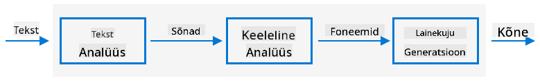

<!--
CO_OP_TRANSLATOR_METADATA:
{
  "original_hash": "b73fe10ec6b580fba2affb6f6e0a5c4d",
  "translation_date": "2025-10-11T12:08:28+00:00",
  "source_file": "6-consumer/lessons/3-spoken-feedback/README.md",
  "language_code": "et"
}
-->
# Sea taimer ja anna kõne tagasisidet


> Visuaal autorilt [Nitya Narasimhan](https://github.com/nitya). Klõpsa pildil, et näha suuremat versiooni.

## Eel-loengu viktoriin

[Eel-loengu viktoriin](https://black-meadow-040d15503.1.azurestaticapps.net/quiz/45)

## Sissejuhatus

Nutikad assistendid ei ole ühepoolse suhtluse seadmed. Sa räägid nendega ja nad vastavad:

"Alexa, sea 3-minutiline taimer"

"Olgu, sinu taimer on seatud 3 minutiks"

Viimases kahes õppetunnis õppisid, kuidas kõnest luua tekst ja seejärel tekstist taimeri seadistamise päringut tuvastada. Selles õppetunnis õpid, kuidas seadistada taimer IoT-seadmel, vastates kasutajale kõne kaudu, kinnitades taimeri seadistamist ja teavitades, kui taimer on lõppenud.

Selles õppetunnis käsitleme:

* [Teksti teisendamine kõneks](../../../../../6-consumer/lessons/3-spoken-feedback)
* [Taimeri seadistamine](../../../../../6-consumer/lessons/3-spoken-feedback)
* [Teksti teisendamine kõneks](../../../../../6-consumer/lessons/3-spoken-feedback)

## Teksti teisendamine kõneks

Teksti teisendamine kõneks tähendab teksti muutmist heliks, mis sisaldab sõnu kõneldud kujul. Põhimõte seisneb sõnade jaotamises nende koostisosadeks (fonemideks) ning nende helide ühendamises, kas eelnevalt salvestatud helide või AI-mudelite abil genereeritud helide kaudu.



Teksti kõneks süsteemid koosnevad tavaliselt kolmest etapist:

* Teksti analüüs
* Keeleline analüüs
* Helivormi genereerimine

### Teksti analüüs

Teksti analüüs hõlmab antud teksti töötlemist ja selle muutmist sõnadeks, mida saab kõneks teisendada. Näiteks "Tere maailm" puhul ei ole teksti analüüsi vaja, kuna need kaks sõna saab otse kõneks muuta. Kui aga tekstiks on "1234", tuleb see kontekstist sõltuvalt muuta kas "Tuhat kakssada kolmkümmend neli" või "Üks, kaks, kolm, neli". Näiteks "Mul on 1234 õuna" puhul oleks see "Tuhat kakssada kolmkümmend neli", kuid "Laps luges 1234" puhul "Üks, kaks, kolm, neli".

Sõnade loomine varieerub mitte ainult keele, vaid ka selle keele piirkonna järgi. Näiteks Ameerika inglise keeles on 120 "One hundred twenty", Briti inglise keeles aga "One hundred and twenty", kus "and" lisatakse sadade järel.

✅ Mõned muud näited, mis vajavad teksti analüüsi, hõlmavad "in" kui tolli lühendit ja "st" kui pühaku või tänava lühendit. Kas oskad oma keeles tuua näiteid sõnadest, mis on kontekstita mitmetähenduslikud?

Kui sõnad on määratletud, saadetakse need keeleliseks analüüsiks.

### Keeleline analüüs

Keeleline analüüs jaotab sõnad fonemideks. Fonemid sõltuvad mitte ainult kasutatud tähtedest, vaid ka teistest sõna tähtedest. Näiteks inglise keeles on 'a' heli sõnades 'car' ja 'care' erinev. Inglise keeles on 26 tähestiku tähe jaoks 44 erinevat fonemi, millest mõned jagatakse erinevate tähtede vahel, näiteks sama fonem sõnade 'circle' ja 'serpent' alguses.

✅ Uuri: Millised on sinu keele fonemid?

Kui sõnad on muudetud fonemideks, vajavad need täiendavat teavet intonatsiooni jaoks, kohandades tooni või kestust sõltuvalt kontekstist. Näiteks inglise keeles saab kõrgendatud tooniga muuta lause küsimuseks, tõstes viimase sõna tooni.

Näiteks - lause "Sul on õun" on väide, mis ütleb, et sul on õun. Kui tooni tõsta lõpus, tõstes sõna "õun" tooni, muutub see küsimuseks "Sul on õun?", küsides, kas sul on õun. Keeleline analüüs peab kasutama küsimärki lõpus, et otsustada tooni tõstmist.

Kui fonemid on genereeritud, saadetakse need helivormi genereerimiseks, et luua heliväljund.

### Helivormi genereerimine

Esimesed elektroonilised teksti kõneks süsteemid kasutasid iga fonemi jaoks ühte helisalvestust, mis viis väga monotoonsete, robotilaadsete häälteni. Keeleline analüüs genereeris fonemid, need laaditi helide andmebaasist ja ühendati, et luua heli.

✅ Uuri: Leia helisalvestusi varajastest kõnesünteesi süsteemidest. Võrdle neid kaasaegsete kõnesünteesi süsteemidega, nagu nutikates assistentides kasutatavad.

Kaasaegsem helivormi genereerimine kasutab ML-mudeleid, mis on ehitatud süvaõppe abil (väga suured närvivõrgud, mis toimivad sarnaselt ajurakkudele), et luua loomulikuma kõlaga hääli, mis võivad olla eristamatud inimhäältest.

> 💁 Mõned neist ML-mudelitest saab ümber treenida, et kõlada nagu päris inimesed. See tähendab, et hääle kasutamine turvasüsteemina, mida pangad üha enam proovivad, ei ole enam hea idee, kuna igaüks, kellel on mõneminutiline salvestus sinu häälest, saab sind jäljendada.

Need suured ML-mudelid treenitakse, et kombineerida kõik kolm sammu end-to-end kõnesünteesijateks.

## Taimeri seadistamine

Taimeri seadistamiseks peab sinu IoT-seade kutsuma serverless-koodi abil loodud REST-lõpp-punkti ja kasutama saadud sekundite arvu taimeri seadistamiseks.

### Ülesanne - kutsu serverless-funktsiooni, et saada taimeri aeg

Järgi vastavat juhendit, et kutsuda REST-lõpp-punkti oma IoT-seadmest ja seadistada taimer vajalikuks ajaks:

* [Arduino - Wio Terminal](wio-terminal-set-timer.md)
* [Üheplaadiarvuti - Raspberry Pi/virtuaalne IoT-seade](single-board-computer-set-timer.md)

## Teksti teisendamine kõneks

Sama kõneteenust, mida kasutasid kõne tekstiks teisendamiseks, saab kasutada teksti tagasi kõneks teisendamiseks, mida saab esitada IoT-seadme kõlari kaudu. Tekst, mida soovitakse teisendada, saadetakse kõneteenusele koos vajaliku helitüübiga (näiteks näidissagedus) ja tagastatakse binaarandmed, mis sisaldavad heli.

Selle päringu saatmisel kasutatakse *Kõnesünteesi märgistuskeelt* (SSML), XML-põhist märgistuskeelt kõnesünteesi rakenduste jaoks. See määratleb mitte ainult teksti, mida tuleb teisendada, vaid ka teksti keele, kasutatava hääle ja võib isegi määratleda kiiruse, helitugevuse ja tooni mõne või kõigi sõnade jaoks tekstis.

Näiteks see SSML määratleb päringu, et teisendada tekst "Sinu 3-minutiline ja 5-sekundiline taimer on seatud" kõneks, kasutades Briti inglise häält nimega `en-GB-MiaNeural`.

```xml
<speak version='1.0' xml:lang='en-GB'>
    <voice xml:lang='en-GB' name='en-GB-MiaNeural'>
        Your 3 minute 5 second time has been set
    </voice>
</speak>
```

> 💁 Enamikul teksti kõneks süsteemidel on mitu häält erinevate keelte jaoks, asjakohaste aktsentidega, nagu Briti inglise hääl inglise aktsendiga ja Uus-Meremaa inglise hääl Uus-Meremaa aktsendiga.

### Ülesanne - teksti teisendamine kõneks

Tee läbi vastav juhend, et teisendada tekst kõneks oma IoT-seadme abil:

* [Arduino - Wio Terminal](wio-terminal-text-to-speech.md)
* [Üheplaadiarvuti - Raspberry Pi](pi-text-to-speech.md)
* [Üheplaadiarvuti - Virtuaalne seade](virtual-device-text-to-speech.md)

---

## 🚀 Väljakutse

SSML võimaldab muuta, kuidas sõnu kõneldakse, näiteks lisades rõhku teatud sõnadele, lisades pause või muutes tooni. Proovi mõnda neist, saates oma IoT-seadmest erinevat SSML-i ja võrreldes väljundit. Saad rohkem lugeda SSML-i kohta, sealhulgas kuidas muuta sõnade kõnelemise viisi, [Kõnesünteesi märgistuskeele (SSML) versioon 1.1 spetsifikatsioonist World Wide Web konsortsiumilt](https://www.w3.org/TR/speech-synthesis11/).

## Pärast loengu viktoriin

[Pärast loengu viktoriin](https://black-meadow-040d15503.1.azurestaticapps.net/quiz/46)

## Ülevaade ja iseseisev õppimine

* Loe rohkem kõnesünteesi kohta [kõnesünteesi lehelt Wikipedias](https://wikipedia.org/wiki/Speech_synthesis)
* Loe rohkem, kuidas kurjategijad kasutavad kõnesünteesi raha varastamiseks, [võltsitud hääled aitavad küberkurjategijatel raha varastada artiklist BBC uudistes](https://www.bbc.com/news/technology-48908736)
* Uuri rohkem riske, mis tekivad häälnäitlejatele nende hääle sünteesitud versioonidest, [artiklist Vice'is TikToki kohtuasja kohta, mis toob esile, kuidas AI kahjustab häälnäitlejaid](https://www.vice.com/en/article/z3xqwj/this-tiktok-lawsuit-is-highlighting-how-ai-is-screwing-over-voice-actors)

## Ülesanne

[Tühista taimer](assignment.md)

---

**Lahtiütlus**:  
See dokument on tõlgitud AI tõlketeenuse [Co-op Translator](https://github.com/Azure/co-op-translator) abil. Kuigi püüame tagada täpsust, palume arvestada, et automaatsed tõlked võivad sisaldada vigu või ebatäpsusi. Algne dokument selle algses keeles tuleks pidada autoriteetseks allikaks. Olulise teabe puhul soovitame kasutada professionaalset inimtõlget. Me ei vastuta selle tõlke kasutamisest tulenevate arusaamatuste või valesti tõlgenduste eest.