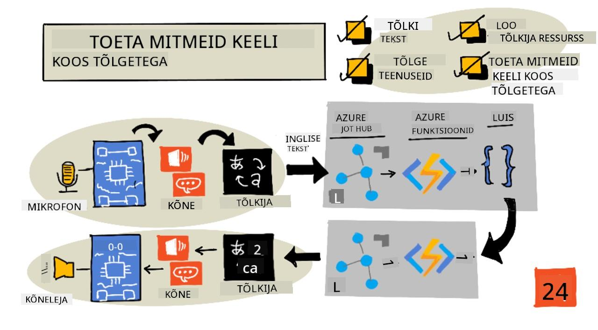
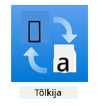
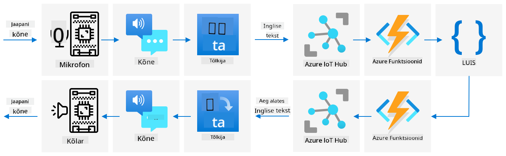

<!--
CO_OP_TRANSLATOR_METADATA:
{
  "original_hash": "c16de27b0074abe81d6a8bad5e5b1a6b",
  "translation_date": "2025-10-11T12:15:19+00:00",
  "source_file": "6-consumer/lessons/4-multiple-language-support/README.md",
  "language_code": "et"
}
-->
# Toeta mitut keelt



> Visandmärkmed: [Nitya Narasimhan](https://github.com/nitya). Klõpsa pildil, et näha suuremat versiooni.

See video annab ülevaate Azure'i kõneteenustest, käsitledes kõne tekstiks ja teksti kõneks teisendamist varasemates õppetundides, samuti kõne tõlkimist, mis on selle õppetunni teema:

[](https://www.youtube.com/watch?v=h6xbpMPSGEA)

> 🎥 Klõpsa ülaloleval pildil, et vaadata videot

## Eel-loengu viktoriin

[Eel-loengu viktoriin](https://black-meadow-040d15503.1.azurestaticapps.net/quiz/47)

## Sissejuhatus

Viimase kolme õppetunni jooksul õppisite, kuidas teisendada kõnet tekstiks, mõista keelt ja teisendada teksti kõneks, kõik AI abil. Üks teine inimkommunikatsiooni valdkond, kus AI saab aidata, on keele tõlkimine – ühe keele teisendamine teiseks, näiteks inglise keelest prantsuse keelde.

Selles õppetunnis õpite, kuidas kasutada AI-d teksti tõlkimiseks, võimaldades teie nutikal taimeril suhelda kasutajatega mitmes keeles.

Selles õppetunnis käsitleme:

* [Teksti tõlkimine](../../../../../6-consumer/lessons/4-multiple-language-support)
* [Tõlketeenused](../../../../../6-consumer/lessons/4-multiple-language-support)
* [Tõlkija ressursi loomine](../../../../../6-consumer/lessons/4-multiple-language-support)
* [Mitme keele toetamine rakendustes tõlgete abil](../../../../../6-consumer/lessons/4-multiple-language-support)
* [Teksti tõlkimine AI-teenuse abil](../../../../../6-consumer/lessons/4-multiple-language-support)

> 🗑 See on selle projekti viimane õppetund, nii et pärast õppetunni ja ülesande lõpetamist ärge unustage oma pilveteenuseid puhastada. Teenuseid on vaja ülesande täitmiseks, seega veenduge, et teete selle kõigepealt ära.
>
> Vajadusel vaadake juhiseid [projekti puhastamise juhendist](../../../clean-up.md).

## Teksti tõlkimine

Teksti tõlkimine on olnud arvutiteaduse probleem, mida on uuritud üle 70 aasta, ja alles nüüd, tänu AI ja arvutusvõimsuse edusammudele, on see lähedal lahendamisele tasemel, mis on peaaegu sama hea kui inimtõlkijad.

> 💁 Selle algus ulatub veelgi kaugemale, [Al-Kindi](https://wikipedia.org/wiki/Al-Kindi) juurde, 9. sajandi araabia krüptograafi, kes töötas välja keele tõlkimise tehnikaid.

### Masintõlked

Teksti tõlkimine algas tehnoloogiaga, mida tuntakse masintõlke (MT) nime all, mis suudab tõlkida erinevate keelepaaride vahel. MT töötab, asendades ühe keele sõnad teise keele sõnadega, lisades tehnikaid, et valida õigeid viise fraaside või lauseosade tõlkimiseks, kui lihtne sõna-sõnalt tõlge ei ole mõistlik.

> 🎓 Kui tõlkijad toetavad tõlkimist ühe keele ja teise vahel, nimetatakse neid *keelepaarideks*. Erinevad tööriistad toetavad erinevaid keelepaare, ja need ei pruugi olla täielikud. Näiteks võib tõlkija toetada inglise keelt hispaania keelde kui keelepaari ja hispaania keelt itaalia keelde kui keelepaari, kuid mitte inglise keelt itaalia keelde.

Näiteks "Hello world" tõlkimine inglise keelest prantsuse keelde saab toimuda asendamise teel – "Bonjour" "Hello" asemel ja "le monde" "world" asemel, mis viib õige tõlkeni "Bonjour le monde".

Asendused ei tööta, kui erinevad keeled kasutavad sama asja ütlemiseks erinevaid viise. Näiteks ingliskeelne lause "My name is Jim" tõlgitakse prantsuse keelde kui "Je m'appelle Jim" – sõna-sõnalt "Ma kutsun end Jimiks". "Je" on prantsuse keeles "mina", "moi" on "mind", kuid see liidetakse tegusõnaga, kuna see algab täishäälikuga, seega muutub "m'", "appelle" tähendab "kutsuma" ja "Jim" ei tõlgita, kuna see on nimi, mitte sõna, mida saab tõlkida. Sõnade järjekord muutub samuti probleemiks – lihtne asendus "Je m'appelle Jim" muutub "I myself call Jim", mis on inglise keeles erineva sõnajärjekorraga.

> 💁 Mõningaid sõnu ei tõlgita kunagi – minu nimi on Jim, olenemata sellest, millist keelt kasutatakse minu tutvustamiseks. Kui tõlgitakse keelde, mis kasutab erinevat tähestikku või erinevaid tähti erinevate helide jaoks, siis sõnu saab *translitereerida*, valides tähti või märke, mis annavad sobiva heli, et kõlada nagu antud sõna.

Idioomid on samuti tõlkimisel probleemiks. Need on fraasid, millel on mõistetav tähendus, mis erineb sõnade otsesest tõlgendusest. Näiteks inglise keeles idioom "I've got ants in my pants" ei viita sõna-sõnalt sellele, et sipelgad on riietes, vaid rahutusele. Kui tõlkida see saksa keelde, segaks see kuulajat, kuna saksa versioon on "Mul on kimalased tagumikus".

> 💁 Erinevad piirkonnad lisavad erinevaid keerukusi. Idioomi "ants in your pants" puhul viitab Ameerika inglise keeles "pants" välisriietele, Briti inglise keeles aga aluspesule.

✅ Kui räägid mitut keelt, mõtle mõnele fraasile, mis ei tõlgi otse.

Masintõlkesüsteemid tuginevad suurtele reeglite andmebaasidele, mis kirjeldavad, kuidas tõlkida teatud fraase ja idioome, koos statistiliste meetoditega, et valida sobivaid tõlkeid võimalike valikute hulgast. Need statistilised meetodid kasutavad tohutuid andmebaase, mis sisaldavad inimeste poolt mitmesse keelde tõlgitud teoseid, et valida kõige tõenäolisem tõlge, tehnikat nimetatakse *statistiliseks masintõlkeks*. Paljud neist kasutavad keele vahepealseid esitusviise, võimaldades ühte keelt tõlkida vahepealsesse, seejärel vahepealsest teise keelde. Sel viisil lisatakse rohkem keeli, tõlkides vahepealsesse ja vahepealsest, mitte kõigisse teistesse keeltesse.

### Neuraalsed tõlked

Neuraalsed tõlked kasutavad AI võimsust tõlkimiseks, tavaliselt tõlkides terveid lauseid ühe mudeli abil. Need mudelid on treenitud tohutute andmekogumite abil, mis on inimeste poolt tõlgitud, näiteks veebilehed, raamatud ja ÜRO dokumentatsioon.

Neuraalsed tõlkemudelid on tavaliselt väiksemad kui masintõlkemudelid, kuna need ei vaja tohutuid fraaside ja idioomide andmebaase. Kaasaegsed AI-teenused, mis pakuvad tõlkeid, segavad sageli mitut tehnikat, kombineerides statistilist masintõlget ja neuraalset tõlget.

Ükski keelepaar ei ole 1:1 tõlgitav. Erinevad tõlkemudelid annavad veidi erinevaid tulemusi, sõltuvalt mudeli treenimiseks kasutatud andmetest. Tõlked ei ole alati sümmeetrilised – kui tõlkida lause ühest keelest teise, siis tagasi esimesse keelde, võib tulemus olla veidi erinev lause.

✅ Proovi erinevaid veebitõlkijaid, nagu [Bing Translate](https://www.bing.com/translator), [Google Translate](https://translate.google.com) või Apple'i tõlkeäpp. Võrdle mõne lause tõlgitud versioone. Proovi ka tõlkida ühes ja seejärel tõlkida tagasi teises.

## Tõlketeenused

On mitmeid AI-teenuseid, mida saab kasutada rakendustes kõne ja teksti tõlkimiseks.

### Cognitive services kõneteenus


Kõneteenus, mida olete kasutanud viimastes õppetundides, sisaldab tõlkimisvõimalusi kõnetuvastuseks. Kui tuvastate kõnet, saate taotleda mitte ainult kõne teksti samas keeles, vaid ka teistes keeltes.

> 💁 See on saadaval ainult kõne SDK-st, REST API-l ei ole sisseehitatud tõlkeid.

### Cognitive services Translator teenus



Translator teenus on spetsiaalne tõlketeenus, mis suudab tõlkida teksti ühest keelest ühte või mitmesse sihtkeelde. Lisaks tõlkimisele toetab see laia valikut lisafunktsioone, sealhulgas roppuste maskeerimist. Samuti võimaldab see pakkuda konkreetset tõlget teatud sõna või lause jaoks, et töötada terminitega, mida ei soovita tõlkida, või millel on konkreetne tuntud tõlge.

Näiteks kui tõlkida lause "Mul on Raspberry Pi", viidates üheplaadi arvutile, teise keelde, näiteks prantsuse keelde, sooviksite nime "Raspberry Pi" säilitada muutumatuna ja mitte tõlkida, andes "J’ai un Raspberry Pi" asemel "J’ai une pi aux framboises".

## Tõlkija ressursi loomine

Selle õppetunni jaoks vajate Translator ressurssi. Kasutate REST API-d teksti tõlkimiseks.

### Ülesanne – tõlkija ressursi loomine

1. Käivitage oma terminalis või käsureal järgmine käsk, et luua tõlkija ressurss oma `smart-timer` ressursigrupis.

    ```sh
    az cognitiveservices account create --name smart-timer-translator \
                                        --resource-group smart-timer \
                                        --kind TextTranslation \
                                        --sku F0 \
                                        --yes \
                                        --location <location>
    ```

    Asendage `<location>` asukohaga, mida kasutasite ressursigrupi loomisel.

1. Hankige tõlketeenuse võti:

    ```sh
    az cognitiveservices account keys list --name smart-timer-translator \
                                           --resource-group smart-timer \
                                           --output table
    ```

    Kopeerige üks võtmetest.

## Mitme keele toetamine rakendustes tõlgete abil

Ideaalis peaks teie kogu rakendus mõistma võimalikult palju erinevaid keeli, alates kõne kuulamisest kuni keele mõistmiseni ja vastamiseni kõnega. See on palju tööd, seega tõlketeenused võivad kiirendada rakenduse valmimise aega.



Kujutage ette, et ehitate nutikat taimerit, mis kasutab inglise keelt algusest lõpuni, mõistes räägitud inglise keelt ja teisendades selle tekstiks, töötades keele mõistmisega inglise keeles, koostades vastuseid inglise keeles ja vastates inglise kõnega. Kui soovite lisada jaapani keele toe, võite alustada jaapani keele kõne tõlkimisest inglise keele tekstiks, hoida rakenduse tuuma samana ja seejärel tõlkida vastuse teksti jaapani keelde enne vastuse kõneks muutmist. See võimaldaks teil kiiresti lisada jaapani keele toe ja hiljem laiendada täieliku jaapani keele toe pakkumiseks.

> 💁 Masintõlke kasutamise miinus on see, et erinevad keeled ja kultuurid väljendavad samu asju erinevalt, seega tõlge ei pruugi vastata ootustele.

Masintõlked avavad ka võimalusi rakendustele ja seadmetele, mis suudavad kasutajate loodud sisu tõlkida selle loomise ajal. Ulmekirjanduses esinevad sageli "universaalsed tõlkijad", seadmed, mis tõlgivad võõrkeeli (tavaliselt) ameerika inglise keelde. Need seadmed on vähem ulme ja rohkem teaduslik fakt, kui jätta kõrvale võõrkeelte osa. Juba on olemas rakendusi ja seadmeid, mis pakuvad reaalajas kõne ja kirjutatud teksti tõlkimist, kasutades kõne- ja tõlketeenuste kombinatsioone.

Üks näide on [Microsoft Translator](https://www.microsoft.com/translator/apps/?WT.mc_id=academic-17441-jabenn) mobiilirakendus, mida demonstreeritakse selles videos:

[](https://www.youtube.com/watch?v=16yAGeP2FuM)

> 🎥 Klõpsa ülaloleval pildil, et vaadata videot

Kujutage ette, et teil on selline seade, eriti reisides või suheldes inimestega, kelle keelt te ei oska. Automaatsete tõlkeseadmete olemasolu lennujaamades või haiglates pakuks väga vajalikku ligipääsetavuse parandamist.

✅ Tehke uurimistööd: Kas on olemas kaubanduslikult saadaval tõlke IoT-seadmeid? Aga tõlkefunktsioonid, mis on sisse ehitatud nutiseadmetesse?

> 👽 Kuigi tõelisi universaalseid tõlkijaid, mis võimaldaksid meil rääkida tulnukatega, ei ole, [Microsoft Translator toetab klingoni keelt](https://www.microsoft.com/translator/blog/2013/05/14/announcing-klingon-for-bing-translator/?WT.mc_id=academic-17441-jabenn). Qapla’!

## Teksti tõlkimine AI-teenuse abil

Saate kasutada AI-teenust, et lisada see tõlkefunktsioon oma nutikale taimerile.

### Ülesanne – teksti tõlkimine AI-teenuse abil

Töötage läbi vastav juhend, et tõlkida teksti oma IoT-seadmes:

* [Arduino - Wio Terminal](wio-terminal-translate-speech.md)
* [Üheplaadi arvuti - Raspberry Pi](pi-translate-speech.md)
* [Üheplaadi arvuti - Virtuaalne seade](virtual-device-translate-speech.md)

---

## 🚀 Väljakutse

Kuidas saavad masintõlked kasu tuua teistele IoT-rakendustele peale nutiseadmete? Mõelge erinevatele viisidele, kuidas tõlked võivad aidata, mitte ainult räägitud sõnade, vaid ka teksti puhul.

## Pärast loengut viktoriin

[Pärast loengut viktoriin](https://black-meadow-040d15503.1.azurestaticapps.net/quiz/48)

## Ülevaade ja iseseisev õppimine

* Lugege masintõlke kohta rohkem [masintõlke Wikipedia lehelt](https://wikipedia.org/wiki/Machine_translation)
* Lugege neuraalse masintõlke kohta rohkem [neuraalse masintõlke Wikipedia lehelt](https://wikipedia.org/wiki/Neural_machine_translation)
* Vaadake Microsofti kõneteenuste toetatud keelte loendit [Microsoft Docs'i kõneteenuse keele ja hääle toe dokumentatsioonist](https://docs.microsoft.com/azure/cognitive-services/speech-service/language-support?WT.mc_id=academic-17441-jabenn)

## Ülesanne

[Ehitage universaalne tõlkija](assignment.md)

---

**Lahtiütlus**:  
See dokument on tõlgitud AI tõlketeenuse [Co-op Translator](https://github.com/Azure/co-op-translator) abil. Kuigi püüame tagada täpsust, palume arvestada, et automaatsed tõlked võivad sisaldada vigu või ebatäpsusi. Algne dokument selle algses keeles tuleks pidada autoriteetseks allikaks. Olulise teabe puhul soovitame kasutada professionaalset inimtõlget. Me ei vastuta selle tõlke kasutamisest tulenevate arusaamatuste või valesti tõlgenduste eest.