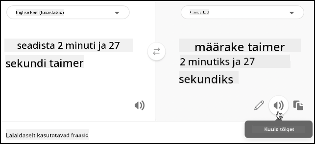

<!--
CO_OP_TRANSLATOR_METADATA:
{
  "original_hash": "d620a470d9dd8614d99824832978360a",
  "translation_date": "2025-10-11T12:16:14+00:00",
  "source_file": "6-consumer/lessons/4-multiple-language-support/virtual-device-translate-speech.md",
  "language_code": "et"
}
-->
# Kõne tõlkimine - Virtuaalne IoT-seade

Selles õppetüki osas kirjutad koodi, mis tõlgib kõne tekstiks kasutades kõneteenust, seejärel tõlgib teksti Translator-teenuse abil ja lõpuks genereerib kõneldava vastuse.

## Kasuta kõneteenust kõne tõlkimiseks

Kõneteenus suudab mitte ainult teisendada kõne tekstiks samas keeles, vaid ka tõlkida tulemuse teistesse keeltesse.

### Ülesanne - kasuta kõneteenust kõne tõlkimiseks

1. Ava projekt `smart-timer` VS Code'is ja veendu, et virtuaalne keskkond on terminalis laaditud.

1. Lisa järgmised import-lauseid olemasolevate importide alla:

    ```python
    from azure.cognitiveservices import speech
    from azure.cognitiveservices.speech.translation import SpeechTranslationConfig, TranslationRecognizer
    import requests
    ```

   See impordib klassid, mida kasutatakse kõne tõlkimiseks, ja `requests` teegi, mida kasutatakse hiljem Translator-teenuse API-kõne tegemiseks.

1. Sinu nutikas taimer kasutab kahte keelt - serveri keelt, mida kasutati LUIS-i treenimiseks (sama keelt kasutatakse ka kasutajale suunatud sõnumite koostamiseks), ja kasutaja räägitavat keelt. Uuenda muutujat `language`, et see vastaks kasutaja räägitavale keelele, ja lisa uus muutuja `server_language`, mis tähistab LUIS-i treenimiseks kasutatud keelt:

    ```python
    language = '<user language>'
    server_language = '<server language>'
    ```

   Asenda `<user language>` selle keele lokaadi nimega, milles sa räägid, näiteks `fr-FR` prantsuse keele jaoks või `zn-HK` kantoni keele jaoks.

   Asenda `<server language>` lokaadi nimega, mida kasutati LUIS-i treenimiseks.

   Toetatud keelte ja nende lokaadi nimede loendi leiad [Microsofti dokumentatsioonist keelte ja häälte toe kohta](https://docs.microsoft.com/azure/cognitive-services/speech-service/language-support?WT.mc_id=academic-17441-jabenn#speech-to-text).

   > 💁 Kui sa ei räägi mitut keelt, võid kasutada teenuseid nagu [Bing Translate](https://www.bing.com/translator) või [Google Translate](https://translate.google.com), et tõlkida oma eelistatud keelest mõnda teise keelde. Need teenused suudavad mängida ka tõlgitud teksti heli. Ole teadlik, et kõnetuvastaja võib ignoreerida osa sinu seadme heliväljundist, seega võib sul vaja minna lisaseadet tõlgitud teksti esitamiseks.
   >
   > Näiteks, kui treenid LUIS-i inglise keeles, kuid soovid kasutada prantsuse keelt kasutaja keelena, võid tõlkida lauseid nagu "set a 2 minute and 27 second timer" inglise keelest prantsuse keelde kasutades Bing Translate'i, seejärel kasutada **Kuula tõlget** nuppu, et rääkida tõlge mikrofoni.
   >
   > 

1. Asenda `recognizer_config` ja `recognizer` deklaratsioonid järgmisega:

    ```python
    translation_config = SpeechTranslationConfig(subscription=speech_api_key,
                                                 region=location,
                                                 speech_recognition_language=language,
                                                 target_languages=(language, server_language))
    
    recognizer = TranslationRecognizer(translation_config=translation_config)
    ```

   See loob tõlke konfiguratsiooni, et tuvastada kõne kasutaja keeles ja luua tõlked kasutaja ja serveri keeles. Seejärel kasutab see konfiguratsiooni tõlkija-tuvastaja loomiseks - kõnetuvastaja, mis suudab tõlkida kõnetuvastuse tulemuse mitmesse keelde.

   > 💁 Algne keel tuleb määrata `target_languages` hulka, vastasel juhul ei saa tõlkeid.

1. Uuenda funktsiooni `recognized`, asendades kogu funktsiooni sisu järgmisega:

    ```python
    if args.result.reason == speech.ResultReason.TranslatedSpeech:
        language_match = next(l for l in args.result.translations if server_language.lower().startswith(l.lower()))
        text = args.result.translations[language_match]
        if (len(text) > 0):
            print(f'Translated text: {text}')
    
            message = Message(json.dumps({ 'speech': text }))
            device_client.send_message(message)
    ```

   See kood kontrollib, kas tuvastatud sündmus käivitati, kuna kõne tõlgiti (see sündmus võib käivituda ka muudel juhtudel, näiteks kui kõne tuvastati, kuid ei tõlgitud). Kui kõne tõlgiti, leiab see tõlke sõnastikus `args.result.translations`, mis vastab serveri keelele.

   Sõnastik `args.result.translations` on indekseeritud lokaadi keele osa järgi, mitte kogu lokaadi järgi. Näiteks, kui taotled tõlget prantsuse keelde `fr-FR`, sisaldab sõnastik kirjet `fr`, mitte `fr-FR`.

   Tõlgitud tekst saadetakse seejärel IoT Hubi.

1. Käivita see kood, et testida tõlkeid. Veendu, et sinu funktsioonirakendus töötab, ja taotle taimerit kasutaja keeles, kas siis ise seda keelt rääkides või tõlkerakendust kasutades.

    ```output
    (.venv) ➜  smart-timer python app.py
    Connecting
    Connected
    Translated text: Set a timer of 2 minutes and 27 seconds.
    ```

## Tõlgi tekst Translator-teenuse abil

Kõneteenus ei toeta teksti tõlkimist tagasi kõneks, selle asemel saad kasutada Translator-teenust teksti tõlkimiseks. Sellel teenusel on REST API, mida saad kasutada teksti tõlkimiseks.

### Ülesanne - kasuta Translator-ressurssi teksti tõlkimiseks

1. Lisa Translator API võti `speech_api_key` alla:

    ```python
    translator_api_key = '<key>'
    ```

   Asenda `<key>` oma Translator-teenuse ressursi API võtmega.

1. Defineeri funktsiooni `say` kohal funktsioon `translate_text`, mis tõlgib teksti serveri keelest kasutaja keelde:

    ```python
    def translate_text(text):
    ```

1. Selle funktsiooni sees määra REST API kõne URL ja päised:

    ```python
    url = f'https://api.cognitive.microsofttranslator.com/translate?api-version=3.0'

    headers = {
        'Ocp-Apim-Subscription-Key': translator_api_key,
        'Ocp-Apim-Subscription-Region': location,
        'Content-type': 'application/json'
    }
    ```

   Selle API URL ei ole asukohaspetsiifiline, selle asemel edastatakse asukoht päises. API võtit kasutatakse otse, seega erinevalt kõneteenusest ei ole vaja hankida juurdepääsuluba tokeni väljastaja API-st.

1. Määra selle all API kõne parameetrid ja keha:

    ```python
    params = {
        'from': server_language,
        'to': language
    }

    body = [{
        'text' : text
    }]
    ```

   `params` määrab API kõne parameetrid, edastades lähte- ja sihtkeeled. See kõne tõlgib teksti lähtekeelest sihtkeelde.

   `body` sisaldab tõlgitavat teksti. See on massiiv, kuna sama kõnega saab tõlkida mitu tekstilõiku.

1. Tee REST API kõne ja saa vastus:

    ```python
    response = requests.post(url, headers=headers, params=params, json=body)
    ```

   Tagastatav vastus on JSON-massiiv, mille esimene element sisaldab tõlkeid. See element sisaldab massiivi kõigi kehas edastatud elementide tõlgetega.

    ```json
    [
        {
            "translations": [
                {
                    "text": "Chronométrant votre minuterie de 2 minutes 27 secondes.",
                    "to": "fr"
                }
            ]
        }
    ]
    ```

1. Tagasta esimese tõlke esimese elemendi `text` omadus:

    ```python
    return response.json()[0]['translations'][0]['text']
    ```

1. Uuenda funktsiooni `say`, et tõlkida öeldav tekst enne SSML-i genereerimist:

    ```python
    print('Original:', text)
    text = translate_text(text)
    print('Translated:', text)
    ```

   See kood prindib ka algse ja tõlgitud teksti konsooli.

1. Käivita oma kood. Veendu, et sinu funktsioonirakendus töötab, ja taotle taimerit kasutaja keeles, kas siis ise seda keelt rääkides või tõlkerakendust kasutades.

    ```output
    (.venv) ➜  smart-timer python app.py
    Connecting
    Connected
    Translated text: Set a timer of 2 minutes and 27 seconds.
    Original: 2 minute 27 second timer started.
    Translated: 2 minute 27 seconde minute a commencé.
    Original: Times up on your 2 minute 27 second timer.
    Translated: Chronométrant votre minuterie de 2 minutes 27 secondes.
    ```

   > 💁 Erinevate keelte erinevate väljendusviiside tõttu võid saada tõlkeid, mis erinevad veidi näidetest, mida andsid LUIS-ile. Kui see juhtub, lisa LUIS-ile rohkem näiteid, treeni mudel uuesti ja avalda see uuesti.

> 💁 Selle koodi leiad kaustast [code/virtual-iot-device](../../../../../6-consumer/lessons/4-multiple-language-support/code/virtual-iot-device).

😀 Sinu mitmekeelne taimeriprogramm oli edukas!

---

**Lahtiütlus**:  
See dokument on tõlgitud tehisintellekti tõlketeenuse [Co-op Translator](https://github.com/Azure/co-op-translator) abil. Kuigi püüame tagada tõlke täpsuse, palume arvestada, et automaatsed tõlked võivad sisaldada vigu või ebatäpsusi. Algne dokument selle algses keeles tuleks lugeda autoriteetseks allikaks. Olulise teabe puhul soovitame kasutada professionaalset inimtõlget. Me ei vastuta selle tõlke kasutamisest tulenevate arusaamatuste või valede tõlgenduste eest.