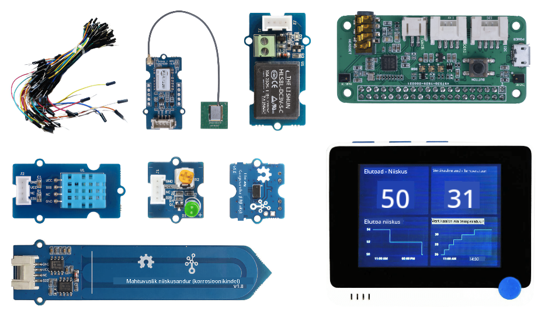
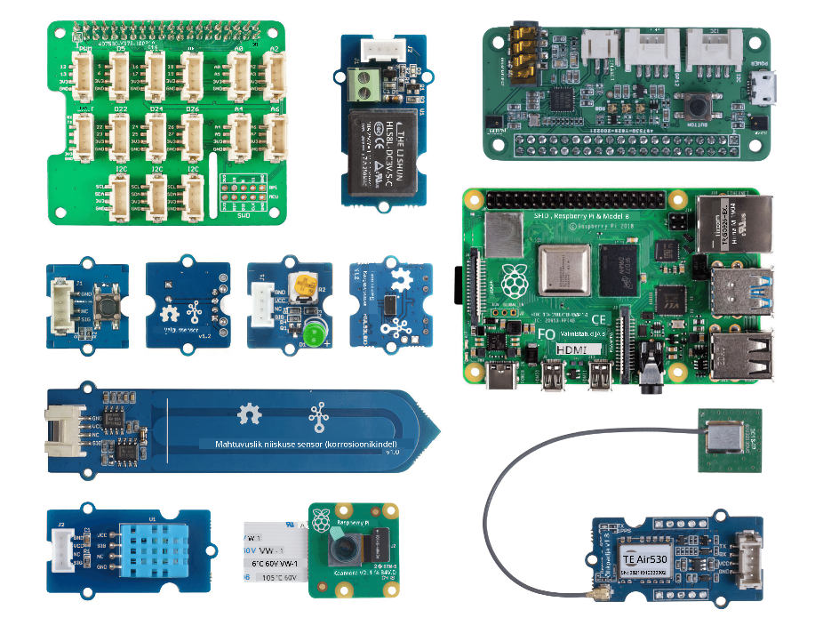

<!--
CO_OP_TRANSLATOR_METADATA:
{
  "original_hash": "3dce18fab38adf93ff30b8c221b1eec5",
  "translation_date": "2025-10-11T11:17:08+00:00",
  "source_file": "hardware.md",
  "language_code": "et"
}
-->
# Riistvara

IoT-i **T** tähistab **Things** ehk asju, mis suhtlevad meid ümbritseva maailmaga. Iga projekt põhineb reaalsel riistvaral, mis on kättesaadav nii õpilastele kui ka hobitegijatele. Meil on kaks valikut IoT-riistvara osas, sõltuvalt isiklikest eelistustest, programmeerimiskeele teadmistest või eelistustest, õpieesmärkidest ja saadavusest. Lisaks oleme pakkunud ka "virtuaalse riistvara" versiooni neile, kellel pole riistvarale ligipääsu või kes soovivad enne ostu rohkem õppida.

> 💁 IoT-riistvara ostmine pole ülesannete täitmiseks vajalik. Kõik saab teha virtuaalse IoT-riistvara abil.

Füüsilise riistvara valikud on Arduino või Raspberry Pi. Igal platvormil on oma plussid ja miinused, mida käsitletakse ühes esimestest tundidest. Kui sa pole veel otsustanud, millist riistvaraplatvormi kasutada, siis saad üle vaadata [esimese projekti teise tunni](./1-getting-started/lessons/2-deeper-dive/README.md), et otsustada, milline platvorm sind kõige rohkem huvitab.

Konkreetne riistvara on valitud selleks, et vähendada tundide ja ülesannete keerukust. Kuigi muud riistvarad võivad töötada, ei saa me garanteerida, et kõik ülesanded on sinu seadmel toetatud ilma täiendava riistvarata. Näiteks paljudel Arduino seadmetel pole WiFi-ühendust, mis on vajalik pilvega ühenduse loomiseks – Wio terminal valiti, kuna sellel on sisseehitatud WiFi.

Sul on vaja ka mõningaid mitte-tehnilisi esemeid, nagu muld või potitaim ning puu- või köögiviljad.

## Komplektide ostmine

Seeed Studios on lahkelt teinud kogu riistvara kättesaadavaks lihtsasti ostetavate komplektidena:

### Arduino - Wio Terminal

**[IoT algajatele koos Seeediga ja Microsoftiga - Wio Terminal Starter Kit](https://www.seeedstudio.com/IoT-for-beginners-with-Seeed-and-Microsoft-Wio-Terminal-Starter-Kit-p-5006.html)**

### Raspberry Pi

**[IoT algajatele koos Seeediga ja Microsoftiga - Raspberry Pi 4 Starter Kit](https://www.seeedstudio.com/IoT-for-beginners-with-Seeed-and-Microsoft-Raspberry-Pi-Starter-Kit-p-5004.html)**

## Arduino

Kogu Arduino seadme kood on kirjutatud C++ keeles. Kõigi ülesannete täitmiseks on sul vaja järgmist:

### Arduino riistvara

* [Wio Terminal](https://www.seeedstudio.com/Wio-Terminal-p-4509.html)
* *Valikuline* - USB-C kaabel või USB-A to USB-C adapter. Wio terminalil on USB-C port ja komplektis on USB-C to USB-A kaabel. Kui sinu arvutil või Macil on ainult USB-C pordid, siis vajad USB-C kaablit või USB-A to USB-C adapterit.

### Arduino spetsiifilised sensorid ja aktuaatorid

Need on spetsiifilised Wio terminali Arduino seadmele ega ole asjakohased Raspberry Pi kasutamisel.

* [ArduCam Mini 2MP Plus - OV2640](https://www.arducam.com/product/arducam-2mp-spi-camera-b0067-arduino/)
* [ReSpeaker 2-Mics Pi HAT](https://www.seeedstudio.com/ReSpeaker-2-Mics-Pi-HAT.html)
* [Breadboard Jumper Wires](https://www.seeedstudio.com/Breadboard-Jumper-Wire-Pack-241mm-200mm-160mm-117m-p-234.html)
* Kõrvaklapid või muu kõlar 3,5 mm pistikuga või JST kõlar, näiteks:
  * [Mono Enclosed Speaker - 2W 6 Ohm](https://www.seeedstudio.com/Mono-Enclosed-Speaker-2W-6-Ohm-p-2832.html)
* microSD kaart 16GB või vähem, koos ühendusadapteriga, kui sinu arvutil pole sisseehitatud kaardilugejat. **MÄRKUS** - Wio Terminal toetab ainult kuni 16GB SD-kaarte, suuremaid mahtusid ei toetata.

## Raspberry Pi

Kogu Raspberry Pi seadme kood on kirjutatud Pythonis. Kõigi ülesannete täitmiseks on sul vaja järgmist:

### Raspberry Pi riistvara

* [Raspberry Pi](https://www.raspberrypi.org/products/raspberry-pi-4-model-b/)
  > 💁 Pi 2B ja uuemad versioonid peaksid töötama nende tundide ülesannetega. Kui plaanid VS Code'i otse Pi peal käivitada, siis on vaja Pi 4, millel on vähemalt 2GB RAM-i. Kui plaanid Pi-le kaugjuurdepääsu, siis sobib iga Pi 2B ja uuem.
* microSD kaart (Raspberry Pi komplektid võivad sisaldada microSD kaarti), koos ühendusadapteriga, kui sinu arvutil pole sisseehitatud kaardilugejat.
* USB toiteallikas (Raspberry Pi 4 komplektid võivad sisaldada toiteallikat). Kui kasutad Raspberry Pi 4, siis vajad USB-C toiteallikat, varasemad seadmed vajavad micro-USB toiteallikat.

### Raspberry Pi spetsiifilised sensorid ja aktuaatorid

Need on spetsiifilised Raspberry Pi kasutamisel ega ole asjakohased Arduino seadme puhul.

* [Grove Pi base hat](https://www.seeedstudio.com/Grove-Base-Hat-for-Raspberry-Pi.html)
* [Raspberry Pi kaameramoodul](https://www.raspberrypi.org/products/camera-module-v2/)
* Mikrofon ja kõlar:

  Kasuta ühte järgmistest (või samaväärset):
  * Mis tahes USB mikrofon koos USB kõlariga või kõlar 3,5 mm pistikuga, või HDMI audio väljund, kui Raspberry Pi on ühendatud monitori või teleriga, millel on kõlarid
  * Mis tahes USB peakomplekt sisseehitatud mikrofoniga
  * [ReSpeaker 2-Mics Pi HAT](https://www.seeedstudio.com/ReSpeaker-2-Mics-Pi-HAT.html) koos
    * Kõrvaklapid või muu kõlar 3,5 mm pistikuga või JST kõlar, näiteks:
    * [Mono Enclosed Speaker - 2W 6 Ohm](https://www.seeedstudio.com/Mono-Enclosed-Speaker-2W-6-Ohm-p-2832.html)
  * [USB Speakerphone](https://www.amazon.com/USB-Speakerphone-Conference-Business-Microphones/dp/B07Q3D7F8S/ref=sr_1_1?dchild=1&keywords=m0&qid=1614647389&sr=8-1)
* [Grove valgussensor](https://www.seeedstudio.com/Grove-Light-Sensor-v1-2-LS06-S-phototransistor.html)
* [Grove nupp](https://www.seeedstudio.com/Grove-Button.html)

## Sensorid ja aktuaatorid

Enamik sensoreid ja aktuaatoreid, mida on vaja, kasutatakse nii Arduino kui ka Raspberry Pi õpiteekondades:

* [Grove LED](https://www.seeedstudio.com/Grove-LED-Pack-p-4364.html) x 2
* [Grove niiskuse ja temperatuuri sensor](https://www.seeedstudio.com/Grove-Temperature-Humidity-Sensor-DHT11.html)
* [Grove maapinna niiskuse sensor](https://www.seeedstudio.com/Grove-Capacitive-Moisture-Sensor-Corrosion-Resistant.html)
* [Grove relee](https://www.seeedstudio.com/Grove-Relay.html)
* [Grove GPS (Air530)](https://www.seeedstudio.com/Grove-GPS-Air530-p-4584.html)
* [Grove kauguse sensor](https://www.seeedstudio.com/Grove-Time-of-Flight-Distance-Sensor-VL53L0X.html)

## Valikuline riistvara

Automaatse kastmise tunnid töötavad relee abil. Valikuliselt saab selle relee ühendada USB-toitega veepumbaga, kasutades allpool loetletud riistvara.

* [6V veepump](https://www.seeedstudio.com/6V-Mini-Water-Pump-p-1945.html)
* [USB terminal](https://www.adafruit.com/product/3628)
* Silikoonvoolikud
* Punased ja mustad juhtmed
* Väike lapik kruvikeeraja

## Virtuaalne riistvara

Virtuaalse riistvara teekond pakub sensorite ja aktuaatorite simulaatoreid, mis on rakendatud Pythonis. Sõltuvalt sinu riistvara saadavusest saad seda käivitada oma tavapärasel arendusseadmel, nagu Mac või PC, või Raspberry Pi peal, simuleerides ainult riistvara, mida sul pole. Näiteks, kui sul on Raspberry Pi kaamera, kuid mitte Grove sensorid, saad virtuaalse seadme koodi käivitada oma Pi peal, simuleerides Grove sensoreid, kuid kasutades füüsilist kaamerat.

Virtuaalne riistvara kasutab [CounterFit projekti](https://github.com/CounterFit-IoT/CounterFit).

Nende tundide täitmiseks on sul vaja veebikaamerat, mikrofoni ja heliväljundit, nagu kõlarid või kõrvaklapid. Need võivad olla sisseehitatud või välised ning peavad olema konfigureeritud töötama sinu operatsioonisüsteemiga ja olema kättesaadavad kõigile rakendustele.

---

**Lahtiütlus**:  
See dokument on tõlgitud AI tõlketeenuse [Co-op Translator](https://github.com/Azure/co-op-translator) abil. Kuigi püüame tagada täpsust, palume arvestada, et automaatsed tõlked võivad sisaldada vigu või ebatäpsusi. Algne dokument selle algses keeles tuleks pidada autoriteetseks allikaks. Olulise teabe puhul soovitame kasutada professionaalset inimtõlget. Me ei vastuta selle tõlke kasutamisest tulenevate arusaamatuste või valesti tõlgenduste eest.