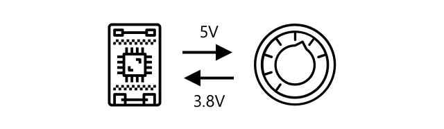
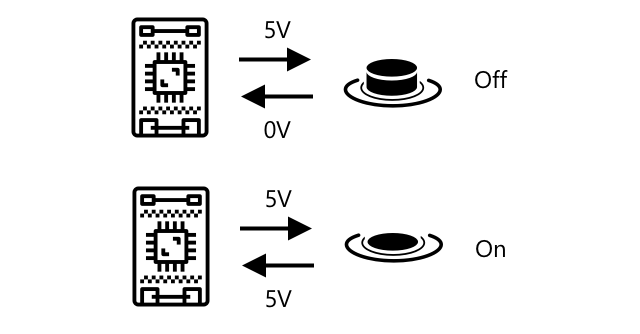

<!--
CO_OP_TRANSLATOR_METADATA:
{
  "original_hash": "e9ee00eb5fc55922a73762acc542166b",
  "translation_date": "2025-08-25T22:04:38+00:00",
  "source_file": "1-getting-started/lessons/3-sensors-and-actuators/README.md",
  "language_code": "fa"
}
-->
# تعامل با دنیای فیزیکی با حسگرها و عملگرها


> اسکچ‌نوت توسط [نیتیا ناراسیمهان](https://github.com/nitya). برای مشاهده نسخه بزرگ‌تر روی تصویر کلیک کنید.

این درس به عنوان بخشی از [سری Hello IoT](https://youtube.com/playlist?list=PLmsFUfdnGr3xRts0TIwyaHyQuHaNQcb6-) از [Microsoft Reactor](https://developer.microsoft.com/reactor/?WT.mc_id=academic-17441-jabenn) تدریس شده است. این درس در قالب دو ویدیو ارائه شده است - یک درس یک ساعته و یک جلسه پرسش و پاسخ یک ساعته که به بخش‌های مختلف درس پرداخته و به سوالات پاسخ می‌دهد.

[](https://youtu.be/Lqalu1v6aF4)

[](https://youtu.be/qR3ekcMlLWA)

> 🎥 برای مشاهده ویدیوها روی تصاویر بالا کلیک کنید

## آزمون پیش از درس

[آزمون پیش از درس](https://black-meadow-040d15503.1.azurestaticapps.net/quiz/5)

## مقدمه

این درس دو مفهوم مهم برای دستگاه‌های IoT شما را معرفی می‌کند - حسگرها و عملگرها. همچنین به صورت عملی با هر دو کار خواهید کرد، یک حسگر نور به پروژه IoT خود اضافه می‌کنید و سپس یک LED را که با سطح نور کنترل می‌شود، اضافه می‌کنید و عملاً یک چراغ شب می‌سازید.

در این درس به موارد زیر خواهیم پرداخت:

* [حسگرها چیستند؟](../../../../../1-getting-started/lessons/3-sensors-and-actuators)
* [استفاده از حسگر](../../../../../1-getting-started/lessons/3-sensors-and-actuators)
* [انواع حسگرها](../../../../../1-getting-started/lessons/3-sensors-and-actuators)
* [عملگرها چیستند؟](../../../../../1-getting-started/lessons/3-sensors-and-actuators)
* [استفاده از عملگر](../../../../../1-getting-started/lessons/3-sensors-and-actuators)
* [انواع عملگرها](../../../../../1-getting-started/lessons/3-sensors-and-actuators)

## حسگرها چیستند؟

حسگرها دستگاه‌های سخت‌افزاری هستند که دنیای فیزیکی را حس می‌کنند - یعنی یک یا چند ویژگی اطراف خود را اندازه‌گیری کرده و اطلاعات را به یک دستگاه IoT ارسال می‌کنند. حسگرها طیف وسیعی از دستگاه‌ها را پوشش می‌دهند زیرا چیزهای زیادی وجود دارد که می‌توان اندازه‌گیری کرد، از ویژگی‌های طبیعی مانند دمای هوا تا تعاملات فیزیکی مانند حرکت.

برخی از حسگرهای رایج عبارتند از:

* حسگرهای دما - این حسگرها دمای هوا یا دمای محیطی که در آن قرار دارند را حس می‌کنند. برای علاقه‌مندان و توسعه‌دهندگان، این حسگرها اغلب با فشار هوا و رطوبت در یک حسگر ترکیب می‌شوند.
* دکمه‌ها - این حسگرها زمانی که فشار داده شوند را حس می‌کنند.
* حسگرهای نور - این حسگرها سطح نور را تشخیص می‌دهند و می‌توانند برای رنگ‌های خاص، نور UV، نور IR یا نور مرئی عمومی باشند.
* دوربین‌ها - این حسگرها نمای بصری از جهان را با گرفتن عکس یا پخش ویدیو حس می‌کنند.
* شتاب‌سنج‌ها - این حسگرها حرکت در چندین جهت را حس می‌کنند.
* میکروفون‌ها - این حسگرها صدا را حس می‌کنند، چه سطح کلی صدا یا صدای جهت‌دار.

✅ تحقیق کنید. تلفن همراه شما چه حسگرهایی دارد؟

تمام حسگرها یک ویژگی مشترک دارند - آن‌ها هر چیزی که حس می‌کنند را به یک سیگنال الکتریکی تبدیل می‌کنند که توسط دستگاه IoT قابل تفسیر است. نحوه تفسیر این سیگنال الکتریکی به حسگر و همچنین پروتکل ارتباطی مورد استفاده برای ارتباط با دستگاه IoT بستگی دارد.

## استفاده از حسگر

راهنمای مربوطه را دنبال کنید تا یک حسگر به دستگاه IoT خود اضافه کنید:

* [Arduino - Wio Terminal](wio-terminal-sensor.md)
* [کامپیوتر تک‌برد - Raspberry Pi](pi-sensor.md)
* [کامپیوتر تک‌برد - دستگاه مجازی](virtual-device-sensor.md)

## انواع حسگرها

حسگرها یا آنالوگ هستند یا دیجیتال.

### حسگرهای آنالوگ

برخی از ساده‌ترین حسگرها، حسگرهای آنالوگ هستند. این حسگرها ولتاژی را از دستگاه IoT دریافت می‌کنند، اجزای حسگر این ولتاژ را تنظیم می‌کنند و ولتاژی که از حسگر بازمی‌گردد اندازه‌گیری می‌شود تا مقدار حسگر را ارائه دهد.

> 🎓 ولتاژ معیاری است برای اندازه‌گیری میزان فشار برای حرکت برق از یک مکان به مکان دیگر، مانند حرکت از ترمینال مثبت یک باتری به ترمینال منفی. برای مثال، یک باتری استاندارد AA دارای ولتاژ ۱.۵ ولت (V نماد ولت است) است و می‌تواند برق را با نیروی ۱.۵ ولت از ترمینال مثبت خود به ترمینال منفی منتقل کند. سخت‌افزارهای الکتریکی مختلف به ولتاژهای مختلفی برای کار نیاز دارند، برای مثال، یک LED می‌تواند با ولتاژ بین ۲-۳ ولت روشن شود، اما یک لامپ رشته‌ای ۱۰۰ وات به ۲۴۰ ولت نیاز دارد. می‌توانید اطلاعات بیشتری درباره ولتاژ در [صفحه ولتاژ در ویکی‌پدیا](https://wikipedia.org/wiki/Voltage) بخوانید.

یک مثال از این نوع حسگرها، پتانسیومتر است. این یک دکمه چرخشی است که می‌توانید آن را بین دو موقعیت بچرخانید و حسگر میزان چرخش را اندازه‌گیری می‌کند.



دستگاه IoT یک سیگنال الکتریکی را با ولتاژی مانند ۵ ولت (۵V) به پتانسیومتر ارسال می‌کند. هنگامی که پتانسیومتر تنظیم می‌شود، ولتاژی که از طرف دیگر خارج می‌شود تغییر می‌کند. تصور کنید یک پتانسیومتر دارید که به عنوان یک دکمه از ۰ تا [۱۱](https://wikipedia.org/wiki/Up_to_eleven) برچسب‌گذاری شده است، مانند یک دکمه تنظیم صدا روی یک تقویت‌کننده. وقتی پتانسیومتر در حالت کاملاً خاموش (۰) باشد، ۰ ولت (۰V) خارج می‌شود. وقتی در حالت کاملاً روشن (۱۱) باشد، ۵ ولت (۵V) خارج می‌شود.

> 🎓 این یک ساده‌سازی است، و می‌توانید اطلاعات بیشتری درباره پتانسیومترها و مقاومت‌های متغیر در [صفحه پتانسیومتر در ویکی‌پدیا](https://wikipedia.org/wiki/Potentiometer) بخوانید.

ولتاژی که از حسگر خارج می‌شود توسط دستگاه IoT خوانده می‌شود و دستگاه می‌تواند به آن پاسخ دهد. بسته به حسگر، این ولتاژ می‌تواند یک مقدار دلخواه باشد یا به یک واحد استاندارد نگاشت شود. برای مثال، یک حسگر دمای آنالوگ مبتنی بر [ترمیستور](https://wikipedia.org/wiki/Thermistor) مقاومت خود را بسته به دما تغییر می‌دهد. ولتاژ خروجی سپس می‌تواند با محاسبات در کد به دما در کلوین و به طور متناسب به °C یا °F تبدیل شود.

✅ به نظر شما چه اتفاقی می‌افتد اگر حسگر ولتاژی بالاتر از ولتاژ ارسال شده بازگرداند (برای مثال از یک منبع تغذیه خارجی)؟ ⛔️ این را آزمایش نکنید.

#### تبدیل آنالوگ به دیجیتال

دستگاه‌های IoT دیجیتال هستند - آن‌ها نمی‌توانند با مقادیر آنالوگ کار کنند، فقط با ۰ و ۱ کار می‌کنند. این بدان معناست که مقادیر حسگرهای آنالوگ باید به یک سیگنال دیجیتال تبدیل شوند تا بتوانند پردازش شوند. بسیاری از دستگاه‌های IoT دارای مبدل‌های آنالوگ به دیجیتال (ADCs) هستند تا ورودی‌های آنالوگ را به نمایش‌های دیجیتال مقدارشان تبدیل کنند. حسگرها همچنین می‌توانند از طریق یک برد اتصال با ADC کار کنند. برای مثال، در اکوسیستم Seeed Grove با Raspberry Pi، حسگرهای آنالوگ به پورت‌های خاصی روی یک 'hat' که روی Pi قرار دارد و به پین‌های GPIO Pi متصل است، وصل می‌شوند و این hat دارای یک ADC است که ولتاژ را به یک سیگنال دیجیتال تبدیل می‌کند که می‌تواند از پین‌های GPIO Pi ارسال شود.

تصور کنید یک حسگر نور آنالوگ دارید که به یک دستگاه IoT متصل است که از ۳.۳ ولت استفاده می‌کند و مقدار ۱ ولت را بازمی‌گرداند. این ۱ ولت در دنیای دیجیتال معنایی ندارد، بنابراین باید تبدیل شود. ولتاژ با استفاده از یک مقیاس بسته به دستگاه و حسگر به یک مقدار آنالوگ تبدیل می‌شود. یک مثال حسگر نور Seeed Grove است که مقادیر بین ۰ تا ۱۰۲۳ را خروجی می‌دهد. برای این حسگر که با ۳.۳ ولت کار می‌کند، خروجی ۱ ولت یک مقدار ۳۰۰ خواهد بود. یک دستگاه IoT نمی‌تواند با ۳۰۰ به عنوان یک مقدار آنالوگ کار کند، بنابراین مقدار به `0000000100101100`، نمایش باینری ۳۰۰ توسط hat Grove تبدیل می‌شود. این سپس توسط دستگاه IoT پردازش می‌شود.

✅ اگر با باینری آشنا نیستید، کمی تحقیق کنید تا یاد بگیرید چگونه اعداد با ۰ و ۱ نمایش داده می‌شوند. [درس مقدمه‌ای به باینری در BBC Bitesize](https://www.bbc.co.uk/bitesize/guides/zwsbwmn/revision/1) مکان خوبی برای شروع است.

از دیدگاه کدنویسی، همه این‌ها معمولاً توسط کتابخانه‌هایی که با حسگرها ارائه می‌شوند مدیریت می‌شود، بنابراین نیازی نیست خودتان نگران این تبدیل باشید. برای حسگر نور Grove می‌توانید از کتابخانه پایتون استفاده کنید و ویژگی `light` را فراخوانی کنید، یا از کتابخانه Arduino استفاده کنید و `analogRead` را فراخوانی کنید تا مقدار ۳۰۰ را دریافت کنید.

### حسگرهای دیجیتال

حسگرهای دیجیتال، مانند حسگرهای آنالوگ، دنیای اطراف خود را با استفاده از تغییرات در ولتاژ الکتریکی حس می‌کنند. تفاوت این است که آن‌ها یک سیگنال دیجیتال خروجی می‌دهند، یا با اندازه‌گیری فقط دو حالت یا با استفاده از یک ADC داخلی. حسگرهای دیجیتال به طور فزاینده‌ای رایج می‌شوند تا نیاز به استفاده از ADC در یک برد اتصال یا خود دستگاه IoT را از بین ببرند.

ساده‌ترین حسگر دیجیتال یک دکمه یا سوئیچ است. این یک حسگر با دو حالت است، روشن یا خاموش.



پین‌های دستگاه‌های IoT مانند پین‌های GPIO می‌توانند این سیگنال را مستقیماً به عنوان ۰ یا ۱ اندازه‌گیری کنند. اگر ولتاژ ارسال شده همان ولتاژ بازگشتی باشد، مقدار خوانده شده ۱ است، در غیر این صورت مقدار خوانده شده ۰ است. نیازی به تبدیل سیگنال نیست، فقط می‌تواند ۱ یا ۰ باشد.

> 💁 ولتاژها هرگز دقیق نیستند، به ویژه اینکه اجزای حسگر مقداری مقاومت دارند، بنابراین معمولاً یک تحمل وجود دارد. برای مثال، پین‌های GPIO روی Raspberry Pi با ۳.۳ ولت کار می‌کنند و یک سیگنال بازگشتی بالای ۱.۸ ولت را به عنوان ۱ و زیر ۱.۸ ولت را به عنوان ۰ می‌خوانند.

* ۳.۳ ولت وارد دکمه می‌شود. دکمه خاموش است، بنابراین ۰ ولت خارج می‌شود و مقدار ۰ را می‌دهد.
* ۳.۳ ولت وارد دکمه می‌شود. دکمه روشن است، بنابراین ۳.۳ ولت خارج می‌شود و مقدار ۱ را می‌دهد.

حسگرهای دیجیتال پیشرفته‌تر مقادیر آنالوگ را می‌خوانند، سپس آن‌ها را با استفاده از ADCهای داخلی به سیگنال‌های دیجیتال تبدیل می‌کنند. برای مثال، یک حسگر دمای دیجیتال همچنان از یک ترموکوپل به همان شیوه حسگر آنالوگ استفاده می‌کند و همچنان تغییر ولتاژ ناشی از مقاومت ترموکوپل در دمای فعلی را اندازه‌گیری می‌کند. به جای بازگرداندن یک مقدار آنالوگ و تکیه بر دستگاه یا برد اتصال برای تبدیل به یک سیگنال دیجیتال، یک ADC داخلی در حسگر مقدار را تبدیل کرده و آن را به صورت مجموعه‌ای از ۰ و ۱ به دستگاه IoT ارسال می‌کند. این ۰ و ۱‌ها به همان شیوه سیگنال دیجیتال برای یک دکمه ارسال می‌شوند، با ۱ به عنوان ولتاژ کامل و ۰ به عنوان ۰ ولت.


ارسال داده‌های دیجیتال به حسگرها اجازه می‌دهد پیچیده‌تر شوند و داده‌های دقیق‌تر، حتی داده‌های رمزگذاری شده برای حسگرهای ایمن ارسال کنند. یک مثال دوربین است. این یک حسگر است که یک تصویر را ضبط کرده و آن را به صورت داده‌های دیجیتال حاوی آن تصویر، معمولاً در قالب فشرده مانند JPEG، ارسال می‌کند تا توسط دستگاه IoT خوانده شود. حتی می‌تواند ویدیو را با ضبط تصاویر و ارسال یا تصویر کامل فریم به فریم یا یک جریان ویدیویی فشرده پخش کند.

## عملگرها چیستند؟

عملگرها برعکس حسگرها هستند - آن‌ها یک سیگنال الکتریکی از دستگاه IoT شما را به یک تعامل با دنیای فیزیکی تبدیل می‌کنند، مانند انتشار نور یا صدا، یا حرکت یک موتور.

برخی از عملگرهای رایج عبارتند از:

* LED - این‌ها هنگام روشن شدن نور منتشر می‌کنند.
* بلندگو - این‌ها بر اساس سیگنال ارسال شده به آن‌ها صدا منتشر می‌کنند، از یک زنگ ساده تا یک بلندگوی صوتی که می‌تواند موسیقی پخش کند.
* موتور پله‌ای - این‌ها یک سیگنال را به مقدار مشخصی چرخش تبدیل می‌کنند، مانند چرخاندن یک دکمه به اندازه ۹۰ درجه.
* رله - این‌ها سوئیچ‌هایی هستند که می‌توانند با یک سیگنال الکتریکی روشن یا خاموش شوند. آن‌ها اجازه می‌دهند یک ولتاژ کوچک از دستگاه IoT یک ولتاژ بزرگ‌تر را روشن کند.
* صفحه‌نمایش‌ها - این‌ها عملگرهای پیچیده‌تر هستند و اطلاعات را روی یک نمایشگر چند بخشی نشان می‌دهند. صفحه‌نمایش‌ها از نمایشگرهای LED ساده تا مانیتورهای ویدیویی با وضوح بالا متغیر هستند.

✅ تحقیق کنید. تلفن همراه شما چه عملگرهایی دارد؟

## استفاده از عملگر

راهنمای مربوطه را دنبال کنید تا یک عملگر به دستگاه IoT خود اضافه کنید که توسط حسگر کنترل شود تا یک چراغ شب IoT بسازید. این چراغ سطح نور را از حسگر نور جمع‌آوری کرده و از یک عملگر به شکل LED برای انتشار نور زمانی که سطح نور تشخیص داده شده خیلی کم است استفاده می‌کند.


* [Arduino - Wio Terminal](wio-terminal-actuator.md)
* [کامپیوتر تک‌برد - Raspberry Pi](pi-actuator.md)
* [کامپیوتر تک‌برد - دستگاه مجازی](virtual-device-actuator.md)

## انواع عملگرها

مانند حسگرها، عملگرها یا آنالوگ هستند یا دیجیتال.

### عملگرهای آنالوگ

عملگرهای آنالوگ یک سیگنال آنالوگ را گرفته و آن را به نوعی تعامل تبدیل می‌کنند، جایی که تعامل بر اساس ولتاژ ارائه شده تغییر می‌کند.

یک مثال چراغ قابل تنظیم است، مانند چراغ‌هایی که ممکن است در خانه خود داشته باشید. مقدار ولتاژ ارائه شده به چراغ تعیین می‌کند که چقدر روشن باشد.


مانند حسگرها، دستگاه‌های واقعی اینترنت اشیا (IoT) با سیگنال‌های دیجیتال کار می‌کنند، نه آنالوگ. این بدان معناست که برای ارسال یک سیگنال آنالوگ، دستگاه اینترنت اشیا نیاز به یک مبدل دیجیتال به آنالوگ (DAC) دارد، یا به‌صورت مستقیم روی دستگاه اینترنت اشیا یا روی یک برد اتصال. این مبدل، 0 و 1‌های دستگاه اینترنت اشیا را به ولتاژ آنالوگ تبدیل می‌کند که عملگر بتواند از آن استفاده کند.

✅ به نظر شما چه اتفاقی می‌افتد اگر دستگاه اینترنت اشیا ولتاژی بالاتر از حد تحمل عملگر ارسال کند؟  
⛔️ این را آزمایش نکنید.

#### مدولاسیون عرض پالس

گزینه دیگری برای تبدیل سیگنال‌های دیجیتال از دستگاه اینترنت اشیا به سیگنال آنالوگ، مدولاسیون عرض پالس (PWM) است. این روش شامل ارسال تعداد زیادی پالس دیجیتال کوتاه است که به‌عنوان یک سیگنال آنالوگ عمل می‌کنند.

برای مثال، می‌توانید از PWM برای کنترل سرعت یک موتور استفاده کنید.

تصور کنید که یک موتور را با منبع تغذیه 5 ولت کنترل می‌کنید. شما یک پالس کوتاه به موتور خود ارسال می‌کنید، ولتاژ را به حالت بالا (5 ولت) برای دو صدم ثانیه (0.02 ثانیه) تغییر می‌دهید. در این مدت، موتور شما می‌تواند یک دهم چرخش، یا 36 درجه بچرخد. سپس سیگنال برای دو صدم ثانیه (0.02 ثانیه) متوقف می‌شود و یک سیگنال پایین (0 ولت) ارسال می‌شود. هر چرخه روشن و خاموش 0.04 ثانیه طول می‌کشد. چرخه سپس تکرار می‌شود.


این بدان معناست که در یک ثانیه شما 25 پالس 5 ولتی 0.02 ثانیه‌ای دارید که موتور را می‌چرخاند، هرکدام با 0.02 ثانیه توقف 0 ولتی که موتور را نمی‌چرخاند. هر پالس موتور را یک دهم چرخش می‌چرخاند، به این معنا که موتور در هر ثانیه 2.5 چرخش کامل انجام می‌دهد. شما از یک سیگنال دیجیتال برای چرخاندن موتور با سرعت 2.5 چرخش در ثانیه یا 150 [دور در دقیقه](https://wikipedia.org/wiki/Revolutions_per_minute) استفاده کرده‌اید (یک واحد غیر استاندارد برای اندازه‌گیری سرعت چرخشی).

```output
25 pulses per second x 0.1 rotations per pulse = 2.5 rotations per second
2.5 rotations per second x 60 seconds in a minute = 150rpm
```

> 🎓 وقتی یک سیگنال PWM برای نیمی از زمان روشن و برای نیمی خاموش باشد، به آن [چرخه وظیفه 50٪](https://wikipedia.org/wiki/Duty_cycle) گفته می‌شود. چرخه‌های وظیفه به‌عنوان درصد زمانی که سیگنال در حالت روشن نسبت به حالت خاموش است اندازه‌گیری می‌شوند.


شما می‌توانید سرعت موتور را با تغییر اندازه پالس‌ها تغییر دهید. برای مثال، با همان موتور می‌توانید زمان چرخه را در 0.04 ثانیه نگه دارید، با پالس روشن که به نصف کاهش یافته (0.01 ثانیه) و پالس خاموش که به 0.03 ثانیه افزایش یافته است. شما همان تعداد پالس در هر ثانیه (25) دارید، اما هر پالس روشن نصف طول دارد. یک پالس نصف طول فقط موتور را یک بیستم چرخش می‌چرخاند، و با 25 پالس در ثانیه، موتور 1.25 چرخش در ثانیه یا 75 دور در دقیقه انجام می‌دهد. با تغییر سرعت پالس یک سیگنال دیجیتال، سرعت یک موتور آنالوگ را نصف کرده‌اید.

```output
25 pulses per second x 0.05 rotations per pulse = 1.25 rotations per second
1.25 rotations per second x 60 seconds in a minute = 75rpm
```

✅ چگونه می‌توانید چرخش موتور را روان نگه دارید، به‌ویژه در سرعت‌های پایین؟ آیا از تعداد کمی پالس‌های بلند با توقف‌های طولانی استفاده می‌کنید یا تعداد زیادی پالس‌های بسیار کوتاه با توقف‌های بسیار کوتاه؟

> 💁 برخی حسگرها نیز از PWM برای تبدیل سیگنال‌های آنالوگ به دیجیتال استفاده می‌کنند.

> 🎓 می‌توانید اطلاعات بیشتری درباره مدولاسیون عرض پالس در [صفحه مدولاسیون عرض پالس در ویکی‌پدیا](https://wikipedia.org/wiki/Pulse-width_modulation) بخوانید.

### عملگرهای دیجیتال

عملگرهای دیجیتال، مانند حسگرهای دیجیتال، یا دو حالت دارند که با ولتاژ بالا یا پایین کنترل می‌شوند یا یک DAC داخلی دارند که می‌تواند یک سیگنال دیجیتال را به آنالوگ تبدیل کند.

یک عملگر دیجیتال ساده، LED است. وقتی یک دستگاه سیگنال دیجیتال 1 ارسال می‌کند، یک ولتاژ بالا ارسال می‌شود که LED را روشن می‌کند. وقتی یک سیگنال دیجیتال 0 ارسال می‌شود، ولتاژ به 0 ولت کاهش می‌یابد و LED خاموش می‌شود.


✅ چه عملگرهای ساده دو حالته دیگری می‌توانید تصور کنید؟ یک مثال، سلونوئید است که یک آهنربای الکتریکی است که می‌تواند فعال شود تا کارهایی مانند حرکت دادن یک قفل درب برای قفل کردن یا باز کردن درب انجام دهد.

عملگرهای دیجیتال پیشرفته‌تر، مانند صفحه‌نمایش‌ها، نیاز دارند که داده‌های دیجیتال در قالب‌های خاصی ارسال شوند. آن‌ها معمولاً با کتابخانه‌هایی ارائه می‌شوند که ارسال داده‌های صحیح برای کنترل آن‌ها را آسان‌تر می‌کند.

---

## 🚀 چالش

چالش در دو درس گذشته این بود که تا جایی که می‌توانید دستگاه‌های اینترنت اشیا را که در خانه، مدرسه یا محل کارتان وجود دارند فهرست کنید و تصمیم بگیرید که آیا آن‌ها بر اساس میکروکنترلرها یا کامپیوترهای تک‌برد ساخته شده‌اند، یا حتی ترکیبی از هر دو.

برای هر دستگاهی که فهرست کرده‌اید، چه حسگرها و عملگرهایی به آن‌ها متصل هستند؟ هدف هر حسگر و عملگر متصل به این دستگاه‌ها چیست؟

## آزمون پس از درس

[آزمون پس از درس](https://black-meadow-040d15503.1.azurestaticapps.net/quiz/6)

## مرور و مطالعه شخصی

* درباره برق و مدارها در [ThingLearn](http://thinglearn.jenlooper.com/curriculum/) مطالعه کنید.  
* درباره انواع مختلف حسگرهای دما در [راهنمای حسگرهای دما در Seeed Studios](https://www.seeedstudio.com/blog/2019/10/14/temperature-sensors-for-arduino-projects/) مطالعه کنید.  
* درباره LED‌ها در [صفحه LED در ویکی‌پدیا](https://wikipedia.org/wiki/Light-emitting_diode) مطالعه کنید.  

## تکلیف

[تحقیق درباره حسگرها و عملگرها](assignment.md)  

**سلب مسئولیت**:  
این سند با استفاده از سرویس ترجمه هوش مصنوعی [Co-op Translator](https://github.com/Azure/co-op-translator) ترجمه شده است. در حالی که ما تلاش می‌کنیم دقت را حفظ کنیم، لطفاً توجه داشته باشید که ترجمه‌های خودکار ممکن است شامل خطاها یا نادرستی‌ها باشند. سند اصلی به زبان اصلی آن باید به عنوان منبع معتبر در نظر گرفته شود. برای اطلاعات حساس، توصیه می‌شود از ترجمه حرفه‌ای انسانی استفاده کنید. ما مسئولیتی در قبال سوء تفاهم‌ها یا تفسیرهای نادرست ناشی از استفاده از این ترجمه نداریم.