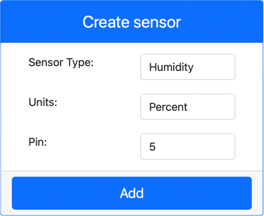

<!--
CO_OP_TRANSLATOR_METADATA:
{
  "original_hash": "70e5a428b607cd5a9a4f422c2a4df03d",
  "translation_date": "2025-08-25T21:21:40+00:00",
  "source_file": "2-farm/lessons/1-predict-plant-growth/virtual-device-temp.md",
  "language_code": "fa"
}
-->
# اندازه‌گیری دما - سخت‌افزار مجازی اینترنت اشیا

در این بخش از درس، شما یک حسگر دما به دستگاه اینترنت اشیای مجازی خود اضافه خواهید کرد.

## سخت‌افزار مجازی

دستگاه اینترنت اشیای مجازی از یک حسگر شبیه‌سازی‌شده Grove Digital Humidity and Temperature استفاده خواهد کرد. این کار باعث می‌شود این آزمایش مشابه استفاده از Raspberry Pi با حسگر فیزیکی Grove DHT11 باشد.

این حسگر ترکیبی از یک **حسگر دما** و یک **حسگر رطوبت** است، اما در این آزمایش شما فقط به بخش حسگر دما علاقه‌مند هستید. در یک دستگاه فیزیکی اینترنت اشیا، حسگر دما معمولاً یک [ترمیستور](https://wikipedia.org/wiki/Thermistor) است که دما را با حس کردن تغییر مقاومت در اثر تغییر دما اندازه‌گیری می‌کند. حسگرهای دما معمولاً حسگرهای دیجیتالی هستند که مقاومت اندازه‌گیری‌شده را به دمایی در درجه سانتی‌گراد (یا کلوین، یا فارنهایت) تبدیل می‌کنند.

### افزودن حسگرها به CounterFit

برای استفاده از حسگر مجازی رطوبت و دما، باید دو حسگر را به برنامه CounterFit اضافه کنید.

#### وظیفه - افزودن حسگرها به CounterFit

حسگرهای رطوبت و دما را به برنامه CounterFit اضافه کنید.

1. یک برنامه پایتون جدید در رایانه خود در پوشه‌ای به نام `temperature-sensor` ایجاد کنید که شامل یک فایل به نام `app.py` و یک محیط مجازی پایتون باشد، و بسته‌های pip مربوط به CounterFit را اضافه کنید.

    > ⚠️ می‌توانید به [دستورالعمل‌های ایجاد و تنظیم پروژه پایتون CounterFit در درس 1 در صورت نیاز](../../../1-getting-started/lessons/1-introduction-to-iot/virtual-device.md) مراجعه کنید.

1. یک بسته pip اضافی نصب کنید تا یک شیم CounterFit برای حسگر DHT11 نصب شود. مطمئن شوید که این کار را از یک ترمینال با محیط مجازی فعال انجام می‌دهید.

    ```sh
    pip install counterfit-shims-seeed-python-dht
    ```

1. مطمئن شوید که برنامه وب CounterFit در حال اجرا است.

1. یک حسگر رطوبت ایجاد کنید:

    1. در بخش *Create sensor* در پنل *Sensors*، از منوی کشویی *Sensor type* گزینه *Humidity* را انتخاب کنید.

    1. گزینه *Units* را روی *Percentage* بگذارید.

    1. مطمئن شوید که *Pin* روی مقدار *5* تنظیم شده است.

    1. دکمه **Add** را انتخاب کنید تا حسگر رطوبت روی پین 5 ایجاد شود.

    

    حسگر رطوبت ایجاد شده و در لیست حسگرها ظاهر خواهد شد.

    

1. یک حسگر دما ایجاد کنید:

    1. در بخش *Create sensor* در پنل *Sensors*، از منوی کشویی *Sensor type* گزینه *Temperature* را انتخاب کنید.

    1. گزینه *Units* را روی *Celsius* بگذارید.

    1. مطمئن شوید که *Pin* روی مقدار *6* تنظیم شده است.

    1. دکمه **Add** را انتخاب کنید تا حسگر دما روی پین 6 ایجاد شود.

    

    حسگر دما ایجاد شده و در لیست حسگرها ظاهر خواهد شد.

    

## برنامه‌نویسی برنامه حسگر دما

اکنون می‌توانید برنامه حسگر دما را با استفاده از حسگرهای CounterFit برنامه‌نویسی کنید.

### وظیفه - برنامه‌نویسی برنامه حسگر دما

برنامه حسگر دما را برنامه‌نویسی کنید.

1. مطمئن شوید که برنامه `temperature-sensor` در VS Code باز است.

1. فایل `app.py` را باز کنید.

1. کد زیر را به ابتدای فایل `app.py` اضافه کنید تا برنامه به CounterFit متصل شود:

    ```python
    from counterfit_connection import CounterFitConnection
    CounterFitConnection.init('127.0.0.1', 5000)
    ```

1. کد زیر را به فایل `app.py` اضافه کنید تا کتابخانه‌های مورد نیاز وارد شوند:

    ```python
    import time
    from counterfit_shims_seeed_python_dht import DHT
    ```

    دستور `from seeed_dht import DHT` کلاس حسگر `DHT` را وارد می‌کند تا با استفاده از شیم موجود در ماژول `counterfit_shims_seeed_python_dht` با حسگر دمای مجازی Grove تعامل داشته باشد.

1. کد زیر را بعد از کد بالا اضافه کنید تا یک نمونه از کلاس مدیریت حسگر مجازی رطوبت و دما ایجاد شود:

    ```python
    sensor = DHT("11", 5)
    ```

    این کد یک نمونه از کلاس `DHT` را اعلام می‌کند که حسگر **رطوبت دیجیتال** و **دما** مجازی را مدیریت می‌کند. پارامتر اول به کد می‌گوید که حسگر مورد استفاده یک حسگر مجازی *DHT11* است. پارامتر دوم به کد می‌گوید که حسگر به پورت `5` متصل است.

    > 💁 CounterFit این حسگر ترکیبی رطوبت و دما را با اتصال به دو حسگر شبیه‌سازی می‌کند: یک حسگر رطوبت روی پین مشخص‌شده هنگام ایجاد کلاس `DHT` و یک حسگر دما که روی پین بعدی اجرا می‌شود. اگر حسگر رطوبت روی پین 5 باشد، شیم انتظار دارد حسگر دما روی پین 6 باشد.

1. یک حلقه بی‌نهایت بعد از کد بالا اضافه کنید تا مقدار حسگر دما را بخواند و در کنسول چاپ کند:

    ```python
    while True:
        _, temp = sensor.read()
        print(f'Temperature {temp}°C')
    ```

    فراخوانی `sensor.read()` یک تاپل شامل رطوبت و دما را برمی‌گرداند. شما فقط به مقدار دما نیاز دارید، بنابراین رطوبت نادیده گرفته می‌شود. سپس مقدار دما در کنسول چاپ می‌شود.

1. یک توقف کوتاه ده‌ثانیه‌ای در انتهای حلقه اضافه کنید، زیرا نیازی نیست سطح دما به‌طور مداوم بررسی شود. توقف باعث کاهش مصرف انرژی دستگاه می‌شود.

    ```python
    time.sleep(10)
    ```

1. از ترمینال VS Code با محیط مجازی فعال، دستور زیر را اجرا کنید تا برنامه پایتون خود را اجرا کنید:

    ```sh
    python app.py
    ```

1. از برنامه CounterFit، مقدار حسگر دما را که توسط برنامه خوانده می‌شود تغییر دهید. می‌توانید این کار را به یکی از دو روش زیر انجام دهید:

    * یک عدد در کادر *Value* برای حسگر دما وارد کنید، سپس دکمه **Set** را انتخاب کنید. عددی که وارد می‌کنید مقدار بازگشتی حسگر خواهد بود.

    * گزینه *Random* را علامت بزنید و مقادیر *Min* و *Max* را وارد کنید، سپس دکمه **Set** را انتخاب کنید. هر بار که حسگر مقداری را می‌خواند، یک عدد تصادفی بین *Min* و *Max* خواهد بود.

    باید مقادیر تنظیم‌شده را در کنسول مشاهده کنید. مقدار *Value* یا تنظیمات *Random* را تغییر دهید تا تغییر مقدار را مشاهده کنید.

    ```output
    (.venv) ➜  temperature-sensor python app.py
    Temperature 28.25°C
    Temperature 30.71°C
    Temperature 25.17°C
    ```

> 💁 می‌توانید این کد را در پوشه [code-temperature/virtual-device](../../../../../2-farm/lessons/1-predict-plant-growth/code-temperature/virtual-device) پیدا کنید.

😀 برنامه حسگر دمای شما موفقیت‌آمیز بود!

**سلب مسئولیت**:  
این سند با استفاده از سرویس ترجمه هوش مصنوعی [Co-op Translator](https://github.com/Azure/co-op-translator) ترجمه شده است. در حالی که ما تلاش می‌کنیم دقت را حفظ کنیم، لطفاً توجه داشته باشید که ترجمه‌های خودکار ممکن است شامل خطاها یا نادرستی‌ها باشند. سند اصلی به زبان اصلی آن باید به عنوان منبع معتبر در نظر گرفته شود. برای اطلاعات حساس، توصیه می‌شود از ترجمه انسانی حرفه‌ای استفاده کنید. ما مسئولیتی در قبال سوء تفاهم‌ها یا تفسیرهای نادرست ناشی از استفاده از این ترجمه نداریم.