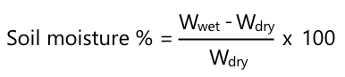

<!--
CO_OP_TRANSLATOR_METADATA:
{
  "original_hash": "506d21b544d5de47406c89ad496a21cd",
  "translation_date": "2025-08-25T21:40:19+00:00",
  "source_file": "2-farm/lessons/2-detect-soil-moisture/assignment.md",
  "language_code": "fa"
}
-->
# کالیبره کردن حسگر خود

## دستورالعمل‌ها

در این درس، شما مقادیر حسگر رطوبت خاک را جمع‌آوری کردید که به صورت اعداد بین 0 تا 1023 اندازه‌گیری می‌شوند. برای تبدیل این مقادیر به خوانش‌های واقعی رطوبت خاک، باید حسگر خود را کالیبره کنید. این کار را می‌توانید با گرفتن خوانش‌هایی از نمونه‌های خاک و سپس محاسبه محتوای رطوبت خاک به روش وزنی انجام دهید.

برای به دست آوردن داده‌های مورد نیاز، باید این مراحل را چندین بار با خاک‌هایی با میزان رطوبت متفاوت تکرار کنید.

1. با استفاده از حسگر رطوبت خاک، یک خوانش رطوبت خاک بگیرید. این مقدار را یادداشت کنید.

1. یک نمونه خاک بردارید و وزن آن را اندازه‌گیری کنید. این وزن را یادداشت کنید.

1. خاک را خشک کنید - بهترین روش استفاده از یک فر گرم با دمای 110 درجه سانتی‌گراد (230 درجه فارنهایت) برای چند ساعت است. همچنین می‌توانید این کار را زیر نور خورشید یا در یک مکان گرم و خشک انجام دهید تا خاک کاملاً خشک شود. خاک باید پودری و نرم شود.

    > 💁 در آزمایشگاه، برای دقیق‌ترین نتایج، خاک را به مدت 48 تا 72 ساعت در فر خشک کنید. اگر در مدرسه شما فرهای خشک‌کن وجود دارد، ببینید آیا می‌توانید از آنها برای مدت طولانی‌تر استفاده کنید. هرچه مدت زمان خشک کردن بیشتر باشد، نمونه خشک‌تر و نتایج دقیق‌تر خواهد بود.

1. دوباره وزن خاک را اندازه‌گیری کنید.

    > 🔥 اگر خاک را در فر خشک کرده‌اید، مطمئن شوید که ابتدا خنک شده باشد!

رطوبت خاک به روش وزنی به صورت زیر محاسبه می‌شود:

* W  
- وزن خاک مرطوب  
* W  
- وزن خاک خشک  

برای مثال، فرض کنید یک نمونه خاک دارید که وزن آن در حالت مرطوب 212 گرم و در حالت خشک 197 گرم است.

* W = 212g  
* W = 197g  
* 212 - 197 = 15  
* 15 / 197 = 0.076  
* 0.076 * 100 = 7.6%  

در این مثال، خاک دارای رطوبت وزنی 7.6% است.

پس از اینکه خوانش‌های حداقل 3 نمونه را به دست آوردید، یک نمودار از درصد رطوبت خاک نسبت به خوانش حسگر رطوبت خاک رسم کنید و یک خط بهترین برازش برای نقاط اضافه کنید. سپس می‌توانید از این نمودار برای محاسبه محتوای رطوبت خاک به روش وزنی برای یک خوانش حسگر خاص استفاده کنید.

## معیار ارزیابی

| معیار | عالی | قابل قبول | نیاز به بهبود |
| -------- | --------- | -------- | ----------------- |
| جمع‌آوری داده‌های کالیبراسیون | حداقل 3 نمونه کالیبراسیون جمع‌آوری شود | حداقل 2 نمونه کالیبراسیون جمع‌آوری شود | حداقل 1 نمونه کالیبراسیون جمع‌آوری شود |
| انجام خوانش کالیبره شده | نمودار کالیبراسیون با موفقیت رسم شود و خوانش حسگر به محتوای رطوبت خاک به روش وزنی تبدیل شود | نمودار کالیبراسیون با موفقیت رسم شود | قادر به رسم نمودار نیست |

**سلب مسئولیت**:  
این سند با استفاده از سرویس ترجمه هوش مصنوعی [Co-op Translator](https://github.com/Azure/co-op-translator) ترجمه شده است. در حالی که ما تلاش می‌کنیم دقت را حفظ کنیم، لطفاً توجه داشته باشید که ترجمه‌های خودکار ممکن است شامل خطاها یا نادرستی‌ها باشند. سند اصلی به زبان اصلی آن باید به عنوان منبع معتبر در نظر گرفته شود. برای اطلاعات حساس، توصیه می‌شود از ترجمه حرفه‌ای انسانی استفاده کنید. ما مسئولیتی در قبال سوء تفاهم‌ها یا تفسیرهای نادرست ناشی از استفاده از این ترجمه نداریم.