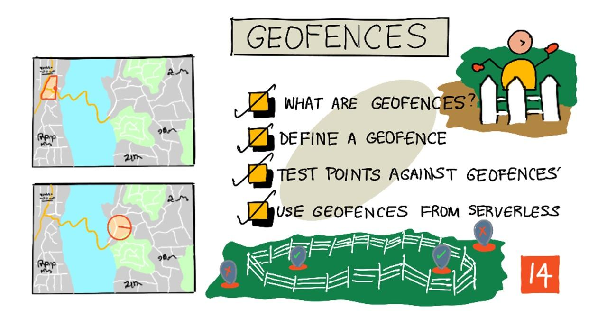
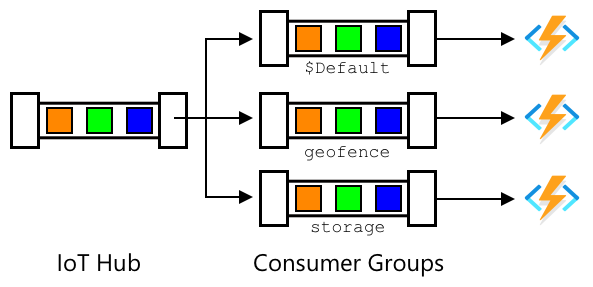

<!--
CO_OP_TRANSLATOR_METADATA:
{
  "original_hash": "078ae664c7b686bf069545e9a5fc95b2",
  "translation_date": "2025-08-25T22:54:49+00:00",
  "source_file": "3-transport/lessons/4-geofences/README.md",
  "language_code": "fa"
}
-->
# حصارهای جغرافیایی



> اسکچ‌نوت توسط [نیتیا ناراسیمهان](https://github.com/nitya). برای مشاهده نسخه بزرگ‌تر روی تصویر کلیک کنید.

این ویدیو نمای کلی از حصارهای جغرافیایی و نحوه استفاده از آنها در Azure Maps را ارائه می‌دهد، موضوعاتی که در این درس پوشش داده خواهند شد:

[](https://www.youtube.com/watch?v=nsrgYhaYNVY)

> 🎥 برای مشاهده ویدیو روی تصویر بالا کلیک کنید

## آزمون پیش از درس

[آزمون پیش از درس](https://black-meadow-040d15503.1.azurestaticapps.net/quiz/27)

## مقدمه

در سه درس گذشته، شما از اینترنت اشیا (IoT) برای ردیابی کامیون‌هایی که محصولات شما را از مزرعه به مرکز پردازش حمل می‌کنند استفاده کرده‌اید. داده‌های GPS را جمع‌آوری کرده، به فضای ابری ارسال کرده و آنها را روی نقشه نمایش داده‌اید. گام بعدی برای افزایش کارایی زنجیره تأمین شما این است که هنگامی که یک کامیون در آستانه رسیدن به مرکز پردازش است، هشدار دریافت کنید تا تیم تخلیه بتواند با لیفتراک‌ها و تجهیزات دیگر آماده باشد و به محض رسیدن وسیله نقلیه، تخلیه سریع انجام شود. به این ترتیب، زمان انتظار کامیون و راننده کاهش می‌یابد.

در این درس، شما درباره حصارهای جغرافیایی یاد خواهید گرفت - مناطق جغرافیایی تعریف‌شده مانند منطقه‌ای در فاصله ۲ کیلومتری از مرکز پردازش - و نحوه آزمایش اینکه آیا مختصات GPS داخل یا خارج یک حصار جغرافیایی قرار دارند، تا بتوانید ببینید آیا حسگر GPS شما وارد یا خارج یک منطقه شده است.

در این درس موارد زیر را پوشش خواهیم داد:

* [حصارهای جغرافیایی چیستند](../../../../../3-transport/lessons/4-geofences)
* [تعریف یک حصار جغرافیایی](../../../../../3-transport/lessons/4-geofences)
* [آزمایش نقاط در برابر یک حصار جغرافیایی](../../../../../3-transport/lessons/4-geofences)
* [استفاده از حصارهای جغرافیایی در کد بدون سرور](../../../../../3-transport/lessons/4-geofences)

> 🗑 این آخرین درس در این پروژه است، بنابراین پس از تکمیل این درس و تکلیف، فراموش نکنید که خدمات ابری خود را پاک کنید. شما برای تکمیل تکلیف به این خدمات نیاز دارید، بنابراین ابتدا مطمئن شوید که تکلیف را کامل کرده‌اید.
>
> در صورت نیاز، به [راهنمای پاکسازی پروژه](../../../clean-up.md) مراجعه کنید.

## حصارهای جغرافیایی چیستند

حصار جغرافیایی یک محیط مجازی برای یک منطقه جغرافیایی واقعی است. حصارهای جغرافیایی می‌توانند دایره‌هایی باشند که به عنوان یک نقطه و شعاع تعریف شده‌اند (برای مثال یک دایره به عرض ۱۰۰ متر اطراف یک ساختمان)، یا یک چندضلعی که منطقه‌ای مانند محدوده مدرسه، مرزهای شهری، یا پردیس دانشگاه یا دفتر را پوشش می‌دهد.


> 💁 ممکن است قبلاً بدون اینکه بدانید از حصارهای جغرافیایی استفاده کرده باشید. اگر با استفاده از اپلیکیشن یادآوری iOS یا Google Keep بر اساس یک مکان یادآوری تنظیم کرده‌اید، از حصار جغرافیایی استفاده کرده‌اید. این اپلیکیشن‌ها بر اساس مکان داده‌شده یک حصار جغرافیایی تنظیم می‌کنند و هنگامی که تلفن شما وارد حصار جغرافیایی می‌شود، به شما هشدار می‌دهند.

دلایل زیادی وجود دارد که بخواهید بدانید یک وسیله نقلیه داخل یا خارج یک حصار جغرافیایی است:

* آماده‌سازی برای تخلیه - دریافت یک اعلان که وسیله نقلیه به محل رسیده است به تیم اجازه می‌دهد تا برای تخلیه وسیله نقلیه آماده شوند، زمان انتظار وسیله نقلیه را کاهش دهند. این می‌تواند به راننده اجازه دهد در یک روز تحویل‌های بیشتری انجام دهد.
* رعایت مالیات - برخی کشورها، مانند نیوزیلند، مالیات جاده‌ای برای وسایل نقلیه دیزلی بر اساس وزن وسیله نقلیه فقط هنگام رانندگی در جاده‌های عمومی دریافت می‌کنند. استفاده از حصارهای جغرافیایی به شما امکان می‌دهد مسافت طی‌شده در جاده‌های عمومی را در مقابل جاده‌های خصوصی در مکان‌هایی مانند مزارع یا مناطق جنگلی ردیابی کنید.
* نظارت بر سرقت - اگر وسیله نقلیه باید فقط در یک منطقه خاص مانند یک مزرعه باقی بماند و از حصار جغرافیایی خارج شود، ممکن است دزدیده شده باشد.
* رعایت مکان - برخی قسمت‌های یک سایت کاری، مزرعه یا کارخانه ممکن است برای وسایل نقلیه خاص ممنوع باشد، مانند دور نگه داشتن وسایل نقلیه حامل کودهای مصنوعی و آفت‌کش‌ها از مزارع تولید محصولات ارگانیک. اگر یک حصار جغرافیایی وارد شود، وسیله نقلیه خارج از رعایت قوانین است و می‌توان به راننده اطلاع داد.

✅ آیا می‌توانید به کاربردهای دیگری برای حصارهای جغرافیایی فکر کنید؟

Azure Maps، سرویسی که در درس قبلی برای نمایش داده‌های GPS استفاده کردید، به شما امکان می‌دهد حصارهای جغرافیایی تعریف کنید و سپس آزمایش کنید که آیا یک نقطه داخل یا خارج حصار جغرافیایی است.

## تعریف یک حصار جغرافیایی

حصارهای جغرافیایی با استفاده از GeoJSON تعریف می‌شوند، همانطور که نقاطی که در درس قبلی به نقشه اضافه شدند. در این مورد، به جای اینکه یک `FeatureCollection` از مقادیر `Point` باشد، یک `FeatureCollection` شامل یک `Polygon` است.

```json
{
   "type": "FeatureCollection",
   "features": [
     {
       "type": "Feature",
       "geometry": {
         "type": "Polygon",
         "coordinates": [
           [
             [
               -122.13393688201903,
               47.63829579223815
             ],
             [
               -122.13389128446579,
               47.63782047131512
             ],
             [
               -122.13240802288054,
               47.63783312249837
             ],
             [
               -122.13238388299942,
               47.63829037035086
             ],
             [
               -122.13393688201903,
               47.63829579223815
             ]
           ]
         ]
       },
       "properties": {
         "geometryId": "1"
       }
     }
   ]
}
```

هر نقطه روی چندضلعی به عنوان یک جفت طول و عرض جغرافیایی در یک آرایه تعریف شده است، و این نقاط در یک آرایه قرار دارند که به عنوان `coordinates` تنظیم شده است. در یک `Point` در درس قبلی، `coordinates` یک آرایه شامل ۲ مقدار، عرض و طول جغرافیایی بود، برای یک `Polygon` این یک آرایه از آرایه‌ها شامل ۲ مقدار، طول و عرض جغرافیایی است.

> 💁 به یاد داشته باشید، GeoJSON از `طول، عرض جغرافیایی` برای نقاط استفاده می‌کند، نه `عرض، طول جغرافیایی`

آرایه مختصات چندضلعی همیشه یک ورودی بیشتر از تعداد نقاط روی چندضلعی دارد، با ورودی آخر که همان نقطه اول است، چندضلعی را می‌بندد. برای مثال، برای یک مستطیل ۵ نقطه وجود خواهد داشت.


در تصویر بالا، یک مستطیل وجود دارد. مختصات چندضلعی از گوشه بالا-چپ در ۴۷،-۱۲۲ شروع می‌شود، سپس به راست به ۴۷،-۱۲۱ حرکت می‌کند، سپس به پایین به ۴۶،-۱۲۱، سپس به چپ به ۴۶،-۱۲۲، سپس به نقطه شروع در ۴۷،-۱۲۲ بازمی‌گردد. این به چندضلعی ۵ نقطه می‌دهد - بالا-چپ، بالا-راست، پایین-راست، پایین-چپ، سپس بالا-چپ برای بستن آن.

✅ سعی کنید یک چندضلعی GeoJSON اطراف خانه یا مدرسه خود ایجاد کنید. از ابزاری مانند [GeoJSON.io](https://geojson.io/) استفاده کنید.

### وظیفه - تعریف یک حصار جغرافیایی

برای استفاده از یک حصار جغرافیایی در Azure Maps، ابتدا باید به حساب Azure Maps شما آپلود شود. پس از آپلود، یک شناسه منحصر به فرد دریافت خواهید کرد که می‌توانید از آن برای آزمایش یک نقطه در برابر حصار جغرافیایی استفاده کنید. برای آپلود حصارهای جغرافیایی به Azure Maps، باید از API وب نقشه‌ها استفاده کنید. شما می‌توانید API وب Azure Maps را با استفاده از ابزاری به نام [curl](https://curl.se) فراخوانی کنید.

> 🎓 Curl یک ابزار خط فرمان برای انجام درخواست‌ها به نقاط پایانی وب است

1. اگر از لینوکس، macOS، یا نسخه اخیر ویندوز ۱۰ استفاده می‌کنید، احتمالاً curl از قبل نصب شده است. دستور زیر را از ترمینال یا خط فرمان خود اجرا کنید تا بررسی کنید:

    ```sh
    curl --version
    ```

    اگر اطلاعات نسخه curl را مشاهده نکردید، باید آن را از [صفحه دانلود curl](https://curl.se/download.html) نصب کنید.

    > 💁 اگر با Postman تجربه دارید، می‌توانید به جای آن از این ابزار استفاده کنید.

1. یک فایل GeoJSON حاوی یک چندضلعی ایجاد کنید. شما این فایل را با استفاده از حسگر GPS خود آزمایش خواهید کرد، بنابراین یک چندضلعی اطراف مکان فعلی خود ایجاد کنید. می‌توانید یکی را به صورت دستی با ویرایش مثال GeoJSON داده‌شده در بالا ایجاد کنید، یا از ابزاری مانند [GeoJSON.io](https://geojson.io/) استفاده کنید.

    GeoJSON باید شامل یک `FeatureCollection` باشد که شامل یک `Feature` با یک `geometry` از نوع `Polygon` است.

    شما **باید** همچنین یک عنصر `properties` در همان سطح عنصر `geometry` اضافه کنید، و این باید شامل یک `geometryId` باشد:

    ```json
    "properties": {
        "geometryId": "1"
    }
    ```

    اگر از [GeoJSON.io](https://geojson.io/) استفاده می‌کنید، باید این آیتم را به صورت دستی به عنصر خالی `properties` اضافه کنید، یا پس از دانلود فایل JSON، یا در ویرایشگر JSON در اپلیکیشن.

    این `geometryId` باید در این فایل منحصر به فرد باشد. شما می‌توانید چندین حصار جغرافیایی را به عنوان چندین `Feature` در `FeatureCollection` در همان فایل GeoJSON آپلود کنید، به شرطی که هر کدام یک `geometryId` متفاوت داشته باشند. چندضلعی‌ها می‌توانند همان `geometryId` را داشته باشند اگر از یک فایل متفاوت در زمان متفاوت آپلود شوند.

1. این فایل را به نام `geofence.json` ذخیره کنید و در ترمینال یا کنسول خود به محل ذخیره آن بروید.

1. دستور curl زیر را برای ایجاد حصار جغرافیایی اجرا کنید:

    ```sh
    curl --request POST 'https://atlas.microsoft.com/mapData/upload?api-version=1.0&dataFormat=geojson&subscription-key=<subscription_key>' \
         --header 'Content-Type: application/json' \
         --include \
         --data @geofence.json
    ```

    `<subscription_key>` را در URL با کلید API حساب Azure Maps خود جایگزین کنید.

    URL برای آپلود داده‌های نقشه از طریق API `https://atlas.microsoft.com/mapData/upload` استفاده می‌شود. این فراخوانی شامل یک پارامتر `api-version` برای مشخص کردن نسخه API Azure Maps است، این برای اجازه تغییر API در طول زمان اما حفظ سازگاری با نسخه‌های قبلی است. فرمت داده‌ای که آپلود می‌شود به `geojson` تنظیم شده است.

    این درخواست POST را به API آپلود اجرا می‌کند و لیستی از هدرهای پاسخ را بازمی‌گرداند که شامل یک هدر به نام `location` است.

    ```output
    content-type: application/json
    location: https://us.atlas.microsoft.com/mapData/operations/1560ced6-3a80-46f2-84b2-5b1531820eab?api-version=1.0
    x-ms-azuremaps-region: West US 2
    x-content-type-options: nosniff
    strict-transport-security: max-age=31536000; includeSubDomains
    x-cache: CONFIG_NOCACHE
    date: Sat, 22 May 2021 21:34:57 GMT
    content-length: 0
    ```

    > 🎓 هنگام فراخوانی یک نقطه پایانی وب، می‌توانید پارامترها را با افزودن `?` و سپس جفت‌های کلید-مقدار به صورت `key=value`، جدا کردن جفت‌های کلید-مقدار با `&`، به فراخوانی اضافه کنید.

1. Azure Maps این را بلافاصله پردازش نمی‌کند، بنابراین باید بررسی کنید که آیا درخواست آپلود به پایان رسیده است یا خیر، با استفاده از URL داده‌شده در هدر `location`. یک درخواست GET به این مکان انجام دهید تا وضعیت را ببینید. شما باید کلید اشتراک خود را به انتهای URL `location` اضافه کنید، با افزودن `&subscription-key=<subscription_key>` به انتها، `<subscription_key>` را با کلید API حساب Azure Maps خود جایگزین کنید. دستور زیر را اجرا کنید:

    ```sh
    curl --request GET '<location>&subscription-key=<subscription_key>'
    ```

    `<location>` را با مقدار هدر `location` و `<subscription_key>` را با کلید API حساب Azure Maps خود جایگزین کنید.

1. مقدار `status` در پاسخ را بررسی کنید. اگر `Succeeded` نیست، یک دقیقه صبر کنید و دوباره امتحان کنید.

1. هنگامی که وضعیت به صورت `Succeeded` بازمی‌گردد، به `resourceLocation` از پاسخ نگاه کنید. این شامل جزئیات شناسه منحصر به فرد (UDID) برای شیء GeoJSON است. UDID مقداری است که بعد از `metadata/` قرار دارد و شامل `api-version` نمی‌شود. برای مثال، اگر `resourceLocation` به صورت زیر بود:

    ```json
    {
      "resourceLocation": "https://us.atlas.microsoft.com/mapData/metadata/7c3776eb-da87-4c52-ae83-caadf980323a?api-version=1.0"
    }
    ```

    سپس UDID به صورت `7c3776eb-da87-4c52-ae83-caadf980323a` خواهد بود.

    یک نسخه از این UDID را نگه دارید زیرا برای آزمایش حصار جغرافیایی به آن نیاز خواهید داشت.

## آزمایش نقاط در برابر یک حصار جغرافیایی

پس از آپلود چندضلعی به Azure Maps، می‌توانید یک نقطه را آزمایش کنید تا ببینید آیا داخل یا خارج حصار جغرافیایی است. این کار را با انجام یک درخواست API وب، ارسال UDID حصار جغرافیایی و عرض و طول جغرافیایی نقطه برای آزمایش انجام می‌دهید.

هنگام انجام این درخواست، می‌توانید مقداری به نام `searchBuffer` را نیز ارسال کنید. این مقدار به API Maps می‌گوید که چقدر دقیق باشد هنگام بازگرداندن نتایج. دلیل این امر این است که GPS کاملاً دقیق نیست و گاهی اوقات مکان‌ها می‌توانند چند متر یا بیشتر خارج باشند. مقدار پیش‌فرض برای search buffer برابر با ۵۰ متر است، اما می‌توانید مقادیر بین ۰ متر تا ۵۰۰ متر تنظیم کنید.

هنگام بازگرداندن نتایج از فراخوانی API، یکی از بخش‌های نتیجه یک `distance` است که به نزدیک‌ترین نقطه روی لبه حصار جغرافیایی اندازه‌گیری شده است، با مقدار مثبت اگر نقطه خارج حصار جغرافیایی باشد، و مقدار منفی اگر داخل حصار جغرافیایی باشد. اگر این فاصله کمتر از search buffer باشد، فاصله واقعی به متر بازگردانده می‌شود، در غیر این صورت مقدار ۹۹۹ یا -۹۹۹ بازگردانده می‌شود. ۹۹۹ به این معنی است که نقطه خارج حصار جغرافیایی است و بیش از search buffer فاصله دارد، -۹۹۹ به این معنی است که نقطه داخل حصار جغرافیایی است و بیش از search buffer فاصله دارد.


در تصویر بالا، حصار جغرافیایی یک search buffer ۵۰ متری دارد.

* یک نقطه در مرکز حصار جغرافیایی، کاملاً داخل search buffer دارای فاصله **-۹۹۹** است.
* یک نقطه کاملاً خارج search buffer دارای فاصله **۹۹۹** است.
* یک نقطه داخل حصار جغرافیایی و داخل search buffer، ۶ متر از حصار جغرافیایی فاصله دارد، دارای فاصله **۶ متر** است.
* یک نقطه خارج حصار جغرافیایی و داخل search buffer، ۳۹ متر از حصار جغرافیایی فاصله دارد، دارای فاصله **۳۹ متر** است.

مهم است که فاصله تا لبه حصار جغرافیایی را بدانید و این را با اطلاعات دیگر مانند قرائت‌های دیگر GPS، سرعت و داده‌های جاده ترکیب کنید هنگام تصمیم‌گیری بر اساس مکان وسیله نقلیه.

برای مثال، تصور کنید قرائت‌های GPS نشان می‌دهند که یک وسیله نقلیه در حال رانندگی در امتداد جاده‌ای است که در نهایت در کنار یک حصار جغرافیایی قرار دارد. اگر یک مقدار GPS منفرد نادرست باشد و وسیله نقلیه را داخل حصار جغرافیایی قرار دهد، با وجود اینکه دسترسی وسایل نقلیه وجود ندارد، می‌توان آن را نادیده گرفت.


در تصویر بالا، یک محدوده جغرافیایی (Geofence) بر روی بخشی از پردیس مایکروسافت قرار دارد. خط قرمز نشان‌دهنده حرکت یک کامیون در امتداد بزرگراه 520 است، و دایره‌ها نشان‌دهنده داده‌های GPS هستند. بیشتر این داده‌ها دقیق بوده و در امتداد بزرگراه 520 قرار دارند، اما یک داده نادرست در داخل محدوده جغرافیایی ثبت شده است. این داده نمی‌تواند درست باشد - هیچ جاده‌ای وجود ندارد که کامیون بتواند ناگهان از بزرگراه 520 به داخل پردیس منحرف شود و سپس دوباره به بزرگراه 520 بازگردد. کدی که این محدوده جغرافیایی را بررسی می‌کند، باید داده‌های قبلی را در نظر بگیرد قبل از اینکه بر اساس نتایج آزمایش محدوده جغرافیایی عمل کند.

✅ چه داده‌های اضافی نیاز دارید تا بررسی کنید که آیا یک داده GPS می‌تواند صحیح در نظر گرفته شود؟

### وظیفه - آزمایش نقاط در برابر یک محدوده جغرافیایی

1. ابتدا URL مربوط به پرس‌وجوی API وب را بسازید. فرمت آن به صورت زیر است:

    ```output
    https://atlas.microsoft.com/spatial/geofence/json?api-version=1.0&deviceId=gps-sensor&subscription-key=<subscription-key>&udid=<UDID>&lat=<lat>&lon=<lon>
    ```

    مقدار `<subscription_key>` را با کلید API حساب Azure Maps خود جایگزین کنید.

    مقدار `<UDID>` را با UDID محدوده جغرافیایی از وظیفه قبلی جایگزین کنید.

    مقدار `<lat>` و `<lon>` را با عرض و طول جغرافیایی که می‌خواهید آزمایش کنید جایگزین کنید.

    این URL از API `https://atlas.microsoft.com/spatial/geofence/json` برای پرس‌وجوی یک محدوده جغرافیایی تعریف‌شده با استفاده از GeoJSON استفاده می‌کند. این API نسخه `1.0` را هدف قرار می‌دهد. پارامتر `deviceId` الزامی است و باید نام دستگاهی باشد که عرض و طول جغرافیایی از آن گرفته شده است.

    بافر جستجوی پیش‌فرض 50 متر است و می‌توانید این مقدار را با اضافه کردن پارامتر اضافی `searchBuffer=<distance>` تغییر دهید و `<distance>` را به فاصله بافر جستجو بر حسب متر (از 0 تا 500) تنظیم کنید.

1. از curl برای ارسال درخواست GET به این URL استفاده کنید:

    ```sh
    curl --request GET '<URL>'
    ```

    > 💁 اگر کد پاسخ `BadRequest` دریافت کردید، با خطای زیر:
    >
    > ```output
    > Invalid GeoJSON: All feature properties should contain a geometryId, which is used for identifying the geofence.
    > ```
    >
    > این بدان معناست که GeoJSON شما بخش `properties` با `geometryId` را ندارد. باید GeoJSON خود را اصلاح کنید، سپس مراحل بالا را تکرار کرده و یک UDID جدید دریافت کنید.

1. پاسخ شامل لیستی از `geometries` خواهد بود، یکی برای هر چندضلعی تعریف‌شده در GeoJSON که برای ایجاد محدوده جغرافیایی استفاده شده است. هر geometry دارای 3 فیلد مهم است: `distance`، `nearestLat` و `nearestLon`.

    ```output
    {
        "geometries": [
            {
                "deviceId": "gps-sensor",
                "udId": "7c3776eb-da87-4c52-ae83-caadf980323a",
                "geometryId": "1",
                "distance": 999.0,
                "nearestLat": 47.645875,
                "nearestLon": -122.142713
            }
        ],
        "expiredGeofenceGeometryId": [],
        "invalidPeriodGeofenceGeometryId": []
    }
    ```

    * `nearestLat` و `nearestLon` عرض و طول جغرافیایی نقطه‌ای در لبه محدوده جغرافیایی هستند که نزدیک‌ترین نقطه به مکان آزمایش‌شده است.

    * `distance` فاصله مکان آزمایش‌شده تا نزدیک‌ترین نقطه در لبه محدوده جغرافیایی است. اعداد منفی به معنای داخل محدوده جغرافیایی و اعداد مثبت به معنای خارج از آن هستند. این مقدار کمتر از 50 (بافر جستجوی پیش‌فرض) یا 999 خواهد بود.

1. این مراحل را چندین بار با مکان‌های داخل و خارج از محدوده جغرافیایی تکرار کنید.

## استفاده از محدوده‌های جغرافیایی در کد بدون سرور

اکنون می‌توانید یک تریگر جدید به برنامه Functions خود اضافه کنید تا داده‌های GPS رویداد IoT Hub را در برابر محدوده جغرافیایی آزمایش کنید.

### گروه‌های مصرف‌کننده

همان‌طور که از درس‌های قبلی به یاد دارید، IoT Hub به شما اجازه می‌دهد رویدادهایی را که توسط هاب دریافت شده اما پردازش نشده‌اند، دوباره پخش کنید. اما اگر چندین تریگر متصل شوند چه اتفاقی می‌افتد؟ چگونه می‌داند کدام یک از رویدادها پردازش شده‌اند؟

پاسخ این است که نمی‌تواند! در عوض، می‌توانید چندین اتصال جداگانه برای خواندن رویدادها تعریف کنید و هر کدام می‌توانند مدیریت بازپخش پیام‌های خوانده‌نشده را انجام دهند. این‌ها به عنوان *گروه‌های مصرف‌کننده* شناخته می‌شوند. وقتی به نقطه پایانی متصل می‌شوید، می‌توانید مشخص کنید که به کدام گروه مصرف‌کننده می‌خواهید متصل شوید. هر جزء از برنامه شما به یک گروه مصرف‌کننده متفاوت متصل خواهد شد.



در تئوری، حداکثر 5 برنامه می‌توانند به هر گروه مصرف‌کننده متصل شوند و همه آن‌ها پیام‌ها را هنگام رسیدن دریافت خواهند کرد. بهترین روش این است که فقط یک برنامه به هر گروه مصرف‌کننده دسترسی داشته باشد تا از پردازش تکراری پیام‌ها جلوگیری شود و اطمینان حاصل شود که هنگام راه‌اندازی مجدد، همه پیام‌های صف‌شده به درستی پردازش می‌شوند. برای مثال، اگر برنامه Functions خود را به صورت محلی اجرا کنید و همچنین آن را در فضای ابری اجرا کنید، هر دو پیام‌ها را پردازش می‌کنند که منجر به ذخیره‌سازی تکراری در حساب ذخیره‌سازی می‌شود.

اگر فایل `function.json` مربوط به تریگر IoT Hub که در درس قبلی ایجاد کردید را بررسی کنید، گروه مصرف‌کننده را در بخش اتصال تریگر Event Hub خواهید دید:

```json
"consumerGroup": "$Default"
```

وقتی یک IoT Hub ایجاد می‌کنید، گروه مصرف‌کننده `$Default` به طور پیش‌فرض ایجاد می‌شود. اگر بخواهید یک تریگر اضافی اضافه کنید، می‌توانید این کار را با استفاده از یک گروه مصرف‌کننده جدید انجام دهید.

> 💁 در این درس، از یک تابع متفاوت برای آزمایش محدوده جغرافیایی نسبت به تابعی که برای ذخیره داده‌های GPS استفاده می‌شود، استفاده خواهید کرد. این کار برای نشان دادن نحوه استفاده از گروه‌های مصرف‌کننده و جدا کردن کد برای خوانایی و درک بهتر انجام می‌شود. در یک برنامه تولیدی، روش‌های مختلفی برای طراحی این کار وجود دارد - قرار دادن هر دو در یک تابع، استفاده از تریگر در حساب ذخیره‌سازی برای اجرای یک تابع برای بررسی محدوده جغرافیایی، یا استفاده از چندین تابع. هیچ "روش درست" وجود ندارد، این بستگی به بقیه برنامه و نیازهای شما دارد.

### وظیفه - ایجاد یک گروه مصرف‌کننده جدید

1. دستور زیر را برای ایجاد یک گروه مصرف‌کننده جدید به نام `geofence` برای IoT Hub خود اجرا کنید:

    ```sh
    az iot hub consumer-group create --name geofence \
                                     --hub-name <hub_name>
    ```

    مقدار `<hub_name>` را با نامی که برای IoT Hub خود استفاده کرده‌اید جایگزین کنید.

1. اگر می‌خواهید همه گروه‌های مصرف‌کننده برای یک IoT Hub را ببینید، دستور زیر را اجرا کنید:

    ```sh
    az iot hub consumer-group list --output table \
                                   --hub-name <hub_name>
    ```

    مقدار `<hub_name>` را با نامی که برای IoT Hub خود استفاده کرده‌اید جایگزین کنید. این دستور همه گروه‌های مصرف‌کننده را لیست می‌کند.

    ```output
    Name      ResourceGroup
    --------  ---------------
    $Default  gps-sensor
    geofence  gps-sensor
    ```

> 💁 وقتی در درس قبلی مانیتور رویداد IoT Hub را اجرا کردید، به گروه مصرف‌کننده `$Default` متصل شد. به همین دلیل نمی‌توانید مانیتور رویداد و یک تریگر رویداد را همزمان اجرا کنید. اگر می‌خواهید هر دو را اجرا کنید، می‌توانید از گروه‌های مصرف‌کننده دیگر برای همه برنامه‌های تابع خود استفاده کنید و `$Default` را برای مانیتور رویداد نگه دارید.

### وظیفه - ایجاد یک تریگر جدید IoT Hub

1. یک تریگر رویداد IoT Hub جدید به برنامه `gps-trigger` که در درس قبلی ایجاد کردید اضافه کنید. این تابع را `geofence-trigger` بنامید.

    > ⚠️ می‌توانید به [دستورالعمل‌های ایجاد یک تریگر رویداد IoT Hub از پروژه 2، درس 5 در صورت نیاز مراجعه کنید](../../../2-farm/lessons/5-migrate-application-to-the-cloud/README.md#create-an-iot-hub-event-trigger).

1. رشته اتصال IoT Hub را در فایل `function.json` پیکربندی کنید. فایل `local.settings.json` بین همه تریگرها در برنامه Function به اشتراک گذاشته می‌شود.

1. مقدار `consumerGroup` را در فایل `function.json` به گروه مصرف‌کننده جدید `geofence` تغییر دهید:

    ```json
    "consumerGroup": "geofence"
    ```

1. برای استفاده از کلید اشتراک Azure Maps در این تریگر، یک ورودی جدید به فایل `local.settings.json` با نام `MAPS_KEY` اضافه کنید.

1. برنامه Functions را اجرا کنید تا مطمئن شوید که به درستی متصل شده و پیام‌ها را پردازش می‌کند. تریگر `iot-hub-trigger` از درس قبلی نیز اجرا شده و بلوک‌ها را در ذخیره‌سازی آپلود می‌کند.

    > برای جلوگیری از خواندن تکراری داده‌های GPS در ذخیره‌سازی بلوک، می‌توانید برنامه Functions خود را که در فضای ابری اجرا می‌شود متوقف کنید. برای انجام این کار، از دستور زیر استفاده کنید:
    >
    > ```sh
    > az functionapp stop --resource-group gps-sensor \
    >                     --name <functions_app_name>
    > ```
    >
    > مقدار `<functions_app_name>` را با نامی که برای برنامه Functions خود استفاده کرده‌اید جایگزین کنید.
    >
    > می‌توانید بعداً آن را با دستور زیر دوباره راه‌اندازی کنید:
    >
    > ```sh
    > az functionapp start --resource-group gps-sensor \
    >                     --name <functions_app_name>
    > ```
    >
    > مقدار `<functions_app_name>` را با نامی که برای برنامه Functions خود استفاده کرده‌اید جایگزین کنید.

### وظیفه - آزمایش محدوده جغرافیایی از تریگر

در اوایل این درس، از curl برای پرس‌وجوی یک محدوده جغرافیایی استفاده کردید تا ببینید آیا یک نقطه داخل یا خارج از آن قرار دارد. می‌توانید یک درخواست وب مشابه از داخل تریگر خود ارسال کنید.

1. برای پرس‌وجوی محدوده جغرافیایی، به UDID آن نیاز دارید. یک ورودی جدید به فایل `local.settings.json` با نام `GEOFENCE_UDID` و این مقدار اضافه کنید.

1. فایل `__init__.py` را از تریگر جدید `geofence-trigger` باز کنید.

1. وارد کردن زیر را به بالای فایل اضافه کنید:

    ```python
    import json
    import os
    import requests
    ```

    بسته `requests` به شما امکان می‌دهد درخواست‌های API وب ارسال کنید. Azure Maps یک SDK برای پایتون ندارد، بنابراین باید از طریق درخواست‌های وب از آن استفاده کنید.

1. دو خط زیر را به ابتدای متد `main` اضافه کنید تا کلید اشتراک Maps را دریافت کنید:

    ```python
    maps_key = os.environ['MAPS_KEY']
    geofence_udid = os.environ['GEOFENCE_UDID']    
    ```

1. داخل حلقه `for event in events`، کد زیر را برای دریافت عرض و طول جغرافیایی از هر رویداد اضافه کنید:

    ```python
    event_body = json.loads(event.get_body().decode('utf-8'))
    lat = event_body['gps']['lat']
    lon = event_body['gps']['lon']
    ```

    این کد JSON از بدنه رویداد را به یک دیکشنری تبدیل می‌کند و سپس `lat` و `lon` را از فیلد `gps` استخراج می‌کند.

1. هنگام استفاده از `requests`، به جای ساختن یک URL طولانی همان‌طور که با curl انجام دادید، می‌توانید فقط از بخش URL استفاده کنید و پارامترها را به صورت یک دیکشنری ارسال کنید. کد زیر را برای تعریف URL و پیکربندی پارامترها اضافه کنید:

    ```python
    url = 'https://atlas.microsoft.com/spatial/geofence/json'

    params = {
        'api-version': 1.0,
        'deviceId': 'gps-sensor',
        'subscription-key': maps_key,
        'udid' : geofence_udid,
        'lat' : lat,
        'lon' : lon
    }
    ```

    آیتم‌های دیکشنری `params` با کلید-مقدارهایی که هنگام فراخوانی API وب از طریق curl استفاده کردید مطابقت دارند.

1. خطوط کد زیر را برای فراخوانی API وب اضافه کنید:

    ```python
    response = requests.get(url, params=params)
    response_body = json.loads(response.text)
    ```

    این کد URL را با پارامترها فراخوانی کرده و یک شیء پاسخ دریافت می‌کند.

1. کد زیر را در زیر این بخش اضافه کنید:

    ```python
    distance = response_body['geometries'][0]['distance']

    if distance == 999:
        logging.info('Point is outside geofence')
    elif distance > 0:
        logging.info(f'Point is just outside geofence by a distance of {distance}m')
    elif distance == -999:
        logging.info(f'Point is inside geofence')
    else:
        logging.info(f'Point is just inside geofence by a distance of {distance}m')
    ```

    این کد فرض می‌کند که یک geometry وجود دارد و فاصله را از آن استخراج می‌کند. سپس بر اساس فاصله، پیام‌های مختلفی را ثبت می‌کند.

1. این کد را اجرا کنید. در خروجی لاگ خواهید دید که آیا مختصات GPS داخل یا خارج از محدوده جغرافیایی هستند، همراه با فاصله اگر نقطه در محدوده 50 متری باشد. این کد را با محدوده‌های جغرافیایی مختلف بر اساس مکان حسگر GPS خود امتحان کنید، حسگر را جابه‌جا کنید (برای مثال با اتصال به WiFi از یک تلفن همراه، یا با مختصات مختلف روی دستگاه IoT مجازی) تا تغییرات را مشاهده کنید.

1. وقتی آماده شدید، این کد را به برنامه Functions خود در فضای ابری مستقر کنید. فراموش نکنید که تنظیمات برنامه جدید را مستقر کنید.

    > ⚠️ می‌توانید به [دستورالعمل‌های آپلود تنظیمات برنامه از پروژه 2، درس 5 در صورت نیاز مراجعه کنید](../../../2-farm/lessons/5-migrate-application-to-the-cloud/README.md#task---upload-your-application-settings).

    > ⚠️ می‌توانید به [دستورالعمل‌های استقرار برنامه Functions خود از پروژه 2، درس 5 در صورت نیاز مراجعه کنید](../../../2-farm/lessons/5-migrate-application-to-the-cloud/README.md#task---deploy-your-functions-app-to-the-cloud).

> 💁 می‌توانید این کد را در پوشه [code/functions](../../../../../3-transport/lessons/4-geofences/code/functions) پیدا کنید.

---

## 🚀 چالش

در این درس، یک محدوده جغرافیایی با استفاده از یک فایل GeoJSON با یک چندضلعی اضافه کردید. می‌توانید چندضلعی‌های متعددی را به طور همزمان آپلود کنید، به شرطی که مقادیر `geometryId` در بخش `properties` متفاوت باشند.

سعی کنید یک فایل GeoJSON با چندین چندضلعی آپلود کنید و کد خود را تنظیم کنید تا مشخص کند کدام چندضلعی به مختصات GPS نزدیک‌تر است یا در آن قرار دارد.

## آزمون پس از درس

[آزمون پس از درس](https://black-meadow-040d15503.1.azurestaticapps.net/quiz/28)

## مرور و مطالعه شخصی

* درباره محدوده‌های جغرافیایی و برخی از موارد استفاده آن‌ها در [صفحه Geofencing در ویکی‌پدیا](https://en.wikipedia.org/wiki/Geo-fence) بیشتر بخوانید.
* درباره API محدوده جغرافیایی Azure Maps در [مستندات Microsoft Azure Maps Spatial - Get Geofence](https://docs.microsoft.com/rest/api/maps/spatial/getgeofence?WT.mc_id=academic-17441-jabenn) بیشتر بخوانید.
* درباره گروه‌های مصرف‌کننده در [ویژگی‌ها و اصطلاحات در Azure Event Hubs - مستندات مصرف‌کنندگان رویداد در Microsoft Docs](https://docs.microsoft.com/azure/event-hubs/event-hubs-features?WT.mc_id=academic-17441-jabenn#event-consumers) بیشتر بخوانید.

## تکلیف

[ارسال اعلان‌ها با استفاده از Twilio](assignment.md)

**سلب مسئولیت**:  
این سند با استفاده از سرویس ترجمه هوش مصنوعی [Co-op Translator](https://github.com/Azure/co-op-translator) ترجمه شده است. در حالی که ما تلاش می‌کنیم دقت را حفظ کنیم، لطفاً توجه داشته باشید که ترجمه‌های خودکار ممکن است شامل خطاها یا نادرستی‌ها باشند. سند اصلی به زبان اصلی آن باید به عنوان منبع معتبر در نظر گرفته شود. برای اطلاعات حساس، توصیه می‌شود از ترجمه انسانی حرفه‌ای استفاده کنید. ما مسئولیتی در قبال سوء تفاهم‌ها یا تفسیرهای نادرست ناشی از استفاده از این ترجمه نداریم.