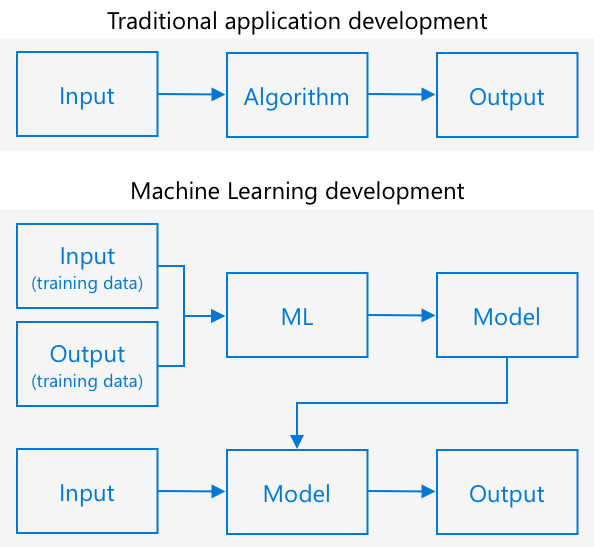

<!--
CO_OP_TRANSLATOR_METADATA:
{
  "original_hash": "f5e63c916d2dd97d58be12aaf76bd9f1",
  "translation_date": "2025-08-25T20:54:34+00:00",
  "source_file": "4-manufacturing/lessons/1-train-fruit-detector/README.md",
  "language_code": "fa"
}
-->
# آموزش ساخت یک تشخیص‌دهنده کیفیت میوه


> اسکچ‌نوت توسط [نیتیا ناراسیمهان](https://github.com/nitya). برای مشاهده نسخه بزرگ‌تر روی تصویر کلیک کنید.

این ویدیو نمای کلی از سرویس Azure Custom Vision را ارائه می‌دهد، سرویسی که در این درس پوشش داده خواهد شد.

[](https://www.youtube.com/watch?v=TETcDLJlWR4)

> 🎥 برای مشاهده ویدیو روی تصویر بالا کلیک کنید

## آزمون پیش از درس

[آزمون پیش از درس](https://black-meadow-040d15503.1.azurestaticapps.net/quiz/29)

## مقدمه

افزایش اخیر در هوش مصنوعی (AI) و یادگیری ماشین (ML) قابلیت‌های گسترده‌ای را در اختیار توسعه‌دهندگان امروزی قرار داده است. مدل‌های یادگیری ماشین می‌توانند برای شناسایی موارد مختلف در تصاویر آموزش داده شوند، از جمله میوه‌های نارس، و این قابلیت می‌تواند در دستگاه‌های اینترنت اشیا (IoT) برای کمک به دسته‌بندی محصولات، چه در زمان برداشت و چه در فرآوری در کارخانه‌ها یا انبارها، استفاده شود.

در این درس، شما با طبقه‌بندی تصاویر آشنا خواهید شد - استفاده از مدل‌های یادگیری ماشین برای تمایز بین تصاویر مختلف. شما یاد خواهید گرفت که چگونه یک طبقه‌بند تصویر را آموزش دهید تا بتواند بین میوه‌های خوب و بد، نارس یا بیش از حد رسیده، ضربه‌خورده یا فاسد تمایز قائل شود.

در این درس موارد زیر را پوشش خواهیم داد:

* [استفاده از AI و ML برای دسته‌بندی مواد غذایی](../../../../../4-manufacturing/lessons/1-train-fruit-detector)
* [طبقه‌بندی تصاویر با استفاده از یادگیری ماشین](../../../../../4-manufacturing/lessons/1-train-fruit-detector)
* [آموزش یک طبقه‌بند تصویر](../../../../../4-manufacturing/lessons/1-train-fruit-detector)
* [آزمایش طبقه‌بند تصویر](../../../../../4-manufacturing/lessons/1-train-fruit-detector)
* [آموزش مجدد طبقه‌بند تصویر](../../../../../4-manufacturing/lessons/1-train-fruit-detector)

## استفاده از AI و ML برای دسته‌بندی مواد غذایی

تغذیه جمعیت جهانی دشوار است، به‌ویژه با قیمتی که غذا را برای همه مقرون‌به‌صرفه کند. یکی از بزرگ‌ترین هزینه‌ها، نیروی کار است، بنابراین کشاورزان به طور فزاینده‌ای به سمت اتوماسیون و ابزارهایی مانند IoT برای کاهش هزینه‌های نیروی کار خود روی آورده‌اند. برداشت دستی کار سخت و طاقت‌فرسایی است و در کشورهای ثروتمند بیشتر با ماشین‌آلات جایگزین شده است. با وجود صرفه‌جویی در هزینه‌های برداشت با ماشین‌آلات، یک نقطه ضعف وجود دارد - توانایی دسته‌بندی مواد غذایی در زمان برداشت.

همه محصولات به طور یکنواخت نمی‌رسند. به عنوان مثال، گوجه‌فرنگی‌ها ممکن است هنوز برخی میوه‌های سبز روی بوته داشته باشند در حالی که بیشتر آن‌ها آماده برداشت هستند. اگرچه برداشت زودهنگام این میوه‌ها هدر دادن است، اما برای کشاورز ارزان‌تر و آسان‌تر است که همه چیز را با ماشین‌آلات برداشت کند و بعداً محصولات نارس را دور بریزد.

✅ به میوه‌ها یا سبزیجات مختلف نگاه کنید، چه در مزارع یا باغ‌های اطراف شما یا در فروشگاه‌ها. آیا همه آن‌ها به یک اندازه رسیده‌اند یا تفاوت‌هایی مشاهده می‌کنید؟

افزایش برداشت خودکار، دسته‌بندی محصولات را از زمان برداشت به کارخانه منتقل کرد. مواد غذایی روی نوارهای نقاله طولانی حرکت می‌کردند و تیم‌هایی از افراد محصولات را بررسی کرده و هر چیزی که کیفیت لازم را نداشت حذف می‌کردند. برداشت به لطف ماشین‌آلات ارزان‌تر شد، اما هنوز هزینه‌ای برای دسته‌بندی دستی مواد غذایی وجود داشت.


تکامل بعدی استفاده از ماشین‌ها برای دسته‌بندی بود، چه در داخل دستگاه برداشت یا در کارخانه‌های فرآوری. نسل اول این ماشین‌ها از حسگرهای نوری برای تشخیص رنگ‌ها استفاده می‌کردند و با کنترل عملگرها، گوجه‌فرنگی‌های سبز را با اهرم‌ها یا پف‌های هوا به داخل سطل زباله پرتاب می‌کردند و گوجه‌فرنگی‌های قرمز را به مسیر نوار نقاله ادامه می‌دادند.

در این ویدیو، همان‌طور که گوجه‌فرنگی‌ها از یک نوار نقاله به دیگری می‌افتند، گوجه‌فرنگی‌های سبز شناسایی شده و با اهرم‌ها به داخل سطل پرتاب می‌شوند.

✅ چه شرایطی در کارخانه یا مزرعه برای عملکرد صحیح این حسگرهای نوری لازم است؟

تکامل‌های اخیر این ماشین‌های دسته‌بندی از AI و ML بهره می‌برند، با استفاده از مدل‌هایی که برای تمایز بین محصولات خوب و بد آموزش داده شده‌اند، نه فقط بر اساس تفاوت‌های واضح رنگی مانند گوجه‌فرنگی‌های سبز در مقابل قرمز، بلکه بر اساس تفاوت‌های ظریف‌تر در ظاهر که می‌تواند نشان‌دهنده بیماری یا ضربه‌خوردگی باشد.

## طبقه‌بندی تصاویر با استفاده از یادگیری ماشین

برنامه‌نویسی سنتی جایی است که شما داده‌ها را می‌گیرید، یک الگوریتم را روی داده‌ها اعمال می‌کنید و خروجی دریافت می‌کنید. به عنوان مثال، در پروژه قبلی شما مختصات GPS و یک محدوده جغرافیایی را گرفتید، الگوریتمی که توسط Azure Maps ارائه شده بود را اعمال کردید و نتیجه‌ای دریافت کردید که آیا نقطه داخل یا خارج از محدوده جغرافیایی است. شما داده‌های بیشتری وارد می‌کنید، خروجی بیشتری دریافت می‌کنید.



یادگیری ماشین این فرآیند را معکوس می‌کند - شما با داده‌ها و خروجی‌های شناخته‌شده شروع می‌کنید و الگوریتم یادگیری ماشین از داده‌ها یاد می‌گیرد. سپس می‌توانید این الگوریتم آموزش‌دیده، که به آن *مدل یادگیری ماشین* یا *مدل* گفته می‌شود، را بگیرید و داده‌های جدید وارد کنید و خروجی جدید دریافت کنید.

> 🎓 فرآیند یادگیری الگوریتم یادگیری ماشین از داده‌ها *آموزش* نامیده می‌شود. ورودی‌ها و خروجی‌های شناخته‌شده *داده‌های آموزشی* نامیده می‌شوند.

به عنوان مثال، شما می‌توانید به یک مدل میلیون‌ها تصویر از موزهای نارس به عنوان داده‌های آموزشی ورودی بدهید، با خروجی آموزشی تنظیم‌شده به `نارس`، و میلیون‌ها تصویر از موزهای رسیده به عنوان داده‌های آموزشی با خروجی تنظیم‌شده به `رسیده`. الگوریتم یادگیری ماشین سپس یک مدل بر اساس این داده‌ها ایجاد می‌کند. سپس شما یک تصویر جدید از یک موز به این مدل می‌دهید و مدل پیش‌بینی می‌کند که آیا تصویر جدید یک موز رسیده است یا نارس.

> 🎓 نتایج مدل‌های یادگیری ماشین *پیش‌بینی* نامیده می‌شوند.


مدل‌های یادگیری ماشین پاسخ‌های دودویی نمی‌دهند، بلکه احتمال‌ها را ارائه می‌دهند. به عنوان مثال، یک مدل ممکن است یک تصویر از موز دریافت کند و پیش‌بینی کند `رسیده` با 99.7% و `نارس` با 0.3%. کد شما سپس بهترین پیش‌بینی را انتخاب کرده و تصمیم می‌گیرد که موز رسیده است.

مدل یادگیری ماشین که برای شناسایی تصاویر مانند این استفاده می‌شود، *طبقه‌بند تصویر* نامیده می‌شود - این مدل تصاویر برچسب‌گذاری‌شده دریافت می‌کند و سپس تصاویر جدید را بر اساس این برچسب‌ها طبقه‌بندی می‌کند.

> 💁 این یک ساده‌سازی است، و روش‌های دیگری برای آموزش مدل‌ها وجود دارد که همیشه به خروجی‌های برچسب‌گذاری‌شده نیاز ندارند، مانند یادگیری بدون نظارت. اگر می‌خواهید بیشتر درباره یادگیری ماشین بدانید، به [یادگیری ماشین برای مبتدیان، یک برنامه درسی 24 درس درباره یادگیری ماشین](https://aka.ms/ML-beginners) مراجعه کنید.

## آموزش یک طبقه‌بند تصویر

برای آموزش موفقیت‌آمیز یک طبقه‌بند تصویر، شما به میلیون‌ها تصویر نیاز دارید. همان‌طور که مشخص است، وقتی یک طبقه‌بند تصویر بر اساس میلیون‌ها یا میلیاردها تصویر مختلف آموزش داده شود، می‌توانید از آن استفاده مجدد کنید و با استفاده از مجموعه کوچکی از تصاویر آن را دوباره آموزش دهید و نتایج عالی بگیرید، با استفاده از فرآیندی به نام *یادگیری انتقالی*.

> 🎓 یادگیری انتقالی فرآیندی است که در آن یادگیری از یک مدل یادگیری ماشین موجود به یک مدل جدید بر اساس داده‌های جدید منتقل می‌شود.

وقتی یک طبقه‌بند تصویر برای طیف گسترده‌ای از تصاویر آموزش داده شود، ساختار داخلی آن در شناسایی اشکال، رنگ‌ها و الگوها بسیار خوب عمل می‌کند. یادگیری انتقالی به مدل اجازه می‌دهد تا از آنچه قبلاً در شناسایی اجزای تصویر یاد گرفته است استفاده کند و از آن برای شناسایی تصاویر جدید بهره ببرد.


می‌توانید این فرآیند را مانند کتاب‌های شکل کودکان تصور کنید، جایی که وقتی بتوانید یک نیم‌دایره، یک مستطیل و یک مثلث را شناسایی کنید، می‌توانید یک قایق بادبانی یا یک گربه را بسته به پیکربندی این اشکال شناسایی کنید. طبقه‌بند تصویر می‌تواند اشکال را شناسایی کند و یادگیری انتقالی به آن آموزش می‌دهد که چه ترکیبی یک قایق یا یک گربه - یا یک موز رسیده - را تشکیل می‌دهد.

ابزارهای متنوعی وجود دارند که می‌توانند به شما در انجام این کار کمک کنند، از جمله خدمات مبتنی بر ابر که می‌توانند به شما در آموزش مدل و سپس استفاده از آن از طریق APIهای وب کمک کنند.

> 💁 آموزش این مدل‌ها به قدرت محاسباتی زیادی نیاز دارد، معمولاً از طریق واحدهای پردازش گرافیکی یا GPUها. همان سخت‌افزار تخصصی که بازی‌های Xbox شما را شگفت‌انگیز می‌کند، می‌تواند برای آموزش مدل‌های یادگیری ماشین نیز استفاده شود. با استفاده از ابر، می‌توانید زمان استفاده از کامپیوترهای قدرتمند با GPUها را اجاره کنید تا این مدل‌ها را آموزش دهید و فقط برای زمانی که به قدرت محاسباتی نیاز دارید، هزینه کنید.

## Custom Vision

Custom Vision یک ابزار مبتنی بر ابر برای آموزش طبقه‌بندهای تصویر است. این ابزار به شما امکان می‌دهد با استفاده از تعداد کمی تصویر یک طبقه‌بند را آموزش دهید. شما می‌توانید تصاویر را از طریق یک پورتال وب، API وب یا SDK آپلود کنید و به هر تصویر یک *برچسب* بدهید که طبقه‌بندی آن تصویر را مشخص می‌کند. سپس مدل را آموزش می‌دهید و آن را آزمایش می‌کنید تا ببینید چقدر خوب عمل می‌کند. وقتی از مدل راضی شدید، می‌توانید نسخه‌هایی از آن را منتشر کنید که از طریق API وب یا SDK قابل دسترسی باشند.


> 💁 شما می‌توانید یک مدل Custom Vision را با حداقل 5 تصویر برای هر طبقه‌بندی آموزش دهید، اما تعداد بیشتر بهتر است. با حداقل 30 تصویر می‌توانید نتایج بهتری بگیرید.

Custom Vision بخشی از مجموعه ابزارهای AI مایکروسافت به نام Cognitive Services است. این ابزارهای AI می‌توانند بدون نیاز به آموزش یا با مقدار کمی آموزش استفاده شوند. این ابزارها شامل تشخیص و ترجمه گفتار، درک زبان و تحلیل تصویر هستند. این خدمات با یک سطح رایگان به عنوان سرویس‌های Azure در دسترس هستند.

> 💁 سطح رایگان برای ایجاد یک مدل، آموزش آن و سپس استفاده از آن برای کارهای توسعه کافی است. می‌توانید درباره محدودیت‌های سطح رایگان در [صفحه محدودیت‌ها و سهمیه‌های Custom Vision در مستندات مایکروسافت](https://docs.microsoft.com/azure/cognitive-services/custom-vision-service/limits-and-quotas?WT.mc_id=academic-17441-jabenn) مطالعه کنید.

### وظیفه - ایجاد یک منبع Cognitive Services

برای استفاده از Custom Vision، ابتدا باید دو منبع Cognitive Services در Azure ایجاد کنید، یکی برای آموزش Custom Vision و دیگری برای پیش‌بینی Custom Vision.

1. یک گروه منابع برای این پروژه با نام `fruit-quality-detector` ایجاد کنید.

1. از دستور زیر برای ایجاد یک منبع آموزش Custom Vision رایگان استفاده کنید:

    ```sh
    az cognitiveservices account create --name fruit-quality-detector-training \
                                        --resource-group fruit-quality-detector \
                                        --kind CustomVision.Training \
                                        --sku F0 \
                                        --yes \
                                        --location <location>
    ```

    `<location>` را با مکانی که هنگام ایجاد گروه منابع استفاده کردید جایگزین کنید.

    این دستور یک منبع آموزش Custom Vision در گروه منابع شما ایجاد می‌کند. این منبع با نام `fruit-quality-detector-training` و با استفاده از SKU `F0` که سطح رایگان است ایجاد خواهد شد. گزینه `--yes` به این معناست که شما با شرایط و ضوابط خدمات Cognitive Services موافق هستید.

> 💁 از SKU `S0` استفاده کنید اگر قبلاً یک حساب رایگان با استفاده از هر یک از خدمات Cognitive Services دارید.

1. از دستور زیر برای ایجاد یک منبع پیش‌بینی Custom Vision رایگان استفاده کنید:

    ```sh
    az cognitiveservices account create --name fruit-quality-detector-prediction \
                                        --resource-group fruit-quality-detector \
                                        --kind CustomVision.Prediction \
                                        --sku F0 \
                                        --yes \
                                        --location <location>
    ```

    `<location>` را با مکانی که هنگام ایجاد گروه منابع استفاده کردید جایگزین کنید.

    این دستور یک منبع پیش‌بینی Custom Vision در گروه منابع شما ایجاد می‌کند. این منبع با نام `fruit-quality-detector-prediction` و با استفاده از SKU `F0` که سطح رایگان است ایجاد خواهد شد. گزینه `--yes` به این معناست که شما با شرایط و ضوابط خدمات Cognitive Services موافق هستید.

### وظیفه - ایجاد یک پروژه طبقه‌بند تصویر

1. پورتال Custom Vision را در [CustomVision.ai](https://customvision.ai) باز کنید و با حساب مایکروسافت خود که برای حساب Azure استفاده کرده‌اید وارد شوید.

1. بخش [ایجاد یک پروژه جدید در سریع‌العمل ساخت طبقه‌بند در مستندات مایکروسافت](https://docs.microsoft.com/azure/cognitive-services/custom-vision-service/getting-started-build-a-classifier?WT.mc_id=academic-17441-jabenn#create-a-new-project) را دنبال کنید تا یک پروژه Custom Vision جدید ایجاد کنید. رابط کاربری ممکن است تغییر کند و این مستندات همیشه به‌روزترین مرجع هستند.

    پروژه خود را `fruit-quality-detector` نام‌گذاری کنید.

    هنگام ایجاد پروژه، مطمئن شوید که از منبع `fruit-quality-detector-training` که قبلاً ایجاد کرده‌اید استفاده می‌کنید. از نوع پروژه *Classification*، نوع طبقه‌بندی *Multiclass* و دامنه *Food* استفاده کنید.

    

✅ زمانی را برای بررسی رابط کاربری Custom Vision برای طبقه‌بند تصویر خود اختصاص دهید.

### وظیفه - آموزش پروژه طبقه‌بند تصویر

برای آموزش یک طبقه‌بند تصویر، شما به تصاویر متعددی از میوه‌ها، هم با کیفیت خوب و هم با کیفیت بد نیاز دارید تا آن‌ها را به عنوان خوب و بد برچسب‌گذاری کنید، مانند یک موز رسیده و یک موز بیش از حد رسیده.
💁 این دسته‌بندها می‌توانند تصاویر هر چیزی را طبقه‌بندی کنند، بنابراین اگر میوه‌هایی با کیفیت‌های مختلف در دسترس ندارید، می‌توانید از دو نوع مختلف میوه یا گربه‌ها و سگ‌ها استفاده کنید!
هر تصویر باید فقط میوه باشد، با پس‌زمینه‌ای یکسان یا مجموعه‌ای متنوع از پس‌زمینه‌ها. مطمئن شوید که هیچ چیزی در پس‌زمینه وجود ندارد که به طور خاص نشان‌دهنده میوه رسیده یا نارس باشد.

> 💁 مهم است که پس‌زمینه‌های خاص یا آیتم‌های خاصی که به برچسب مرتبط نیستند در هر تصویر وجود نداشته باشند، زیرا در غیر این صورت، دسته‌بند ممکن است فقط بر اساس پس‌زمینه دسته‌بندی کند. یک دسته‌بند برای سرطان پوست وجود داشت که بر اساس خال‌های طبیعی و سرطانی آموزش داده شده بود، و خال‌های سرطانی همگی دارای خط‌کش‌هایی برای اندازه‌گیری بودند. مشخص شد که دسته‌بند تقریباً ۱۰۰٪ دقیق در شناسایی خط‌کش‌ها در تصاویر بود، نه خال‌های سرطانی.

دسته‌بندهای تصویر با وضوح بسیار پایین اجرا می‌شوند. به عنوان مثال، Custom Vision می‌تواند تصاویر آموزشی و پیش‌بینی را تا اندازه ۱۰۲۴۰x۱۰۲۴۰ بپذیرد، اما مدل را بر روی تصاویر با اندازه ۲۲۷x۲۲۷ آموزش داده و اجرا می‌کند. تصاویر بزرگ‌تر به این اندازه کوچک می‌شوند، بنابراین مطمئن شوید که چیزی که دسته‌بندی می‌کنید بخش بزرگی از تصویر را اشغال کرده باشد، در غیر این صورت ممکن است در تصویر کوچک‌تر مورد استفاده دسته‌بند، خیلی کوچک باشد.

1. تصاویر مورد نیاز برای دسته‌بند خود را جمع‌آوری کنید. برای آموزش دسته‌بند حداقل به ۵ تصویر برای هر برچسب نیاز دارید، اما هرچه بیشتر بهتر. همچنین به چند تصویر اضافی برای آزمایش دسته‌بند نیاز دارید. این تصاویر باید همگی تصاویر متفاوتی از یک چیز باشند. به عنوان مثال:

    * با استفاده از ۲ موز رسیده، از هر کدام چند عکس از زوایای مختلف بگیرید، حداقل ۷ عکس (۵ برای آموزش، ۲ برای آزمایش)، اما ترجیحاً بیشتر.

        

    * همین فرآیند را برای ۲ موز نارس تکرار کنید.

    شما باید حداقل ۱۰ تصویر آموزشی داشته باشید، حداقل ۵ تصویر رسیده و ۵ تصویر نارس، و ۴ تصویر آزمایشی، ۲ تصویر رسیده و ۲ تصویر نارس. تصاویر شما باید png یا jpeg باشند و کمتر از ۶MB باشند. اگر آنها را با آیفون ایجاد کنید، ممکن است تصاویر HEIC با وضوح بالا باشند، بنابراین باید تبدیل و احتمالاً کوچک شوند. هرچه تصاویر بیشتر باشد بهتر است، و باید تعداد مشابهی از تصاویر رسیده و نارس داشته باشید.

    اگر میوه‌های رسیده و نارس ندارید، می‌توانید از میوه‌های مختلف یا هر دو شیء موجود استفاده کنید. همچنین می‌توانید برخی تصاویر نمونه از موزهای رسیده و نارس را در پوشه [images](../../../../../4-manufacturing/lessons/1-train-fruit-detector/images) پیدا کنید که می‌توانید استفاده کنید.

1. بخش [آپلود و برچسب‌گذاری تصاویر در سریع‌العمل ساخت دسته‌بند در مستندات مایکروسافت](https://docs.microsoft.com/azure/cognitive-services/custom-vision-service/getting-started-build-a-classifier?WT.mc_id=academic-17441-jabenn#upload-and-tag-images) را دنبال کنید تا تصاویر آموزشی خود را آپلود کنید. میوه رسیده را با برچسب `ripe` و میوه نارس را با برچسب `unripe` برچسب‌گذاری کنید.

    

1. بخش [آموزش دسته‌بند در سریع‌العمل ساخت دسته‌بند در مستندات مایکروسافت](https://docs.microsoft.com/azure/cognitive-services/custom-vision-service/getting-started-build-a-classifier?WT.mc_id=academic-17441-jabenn#train-the-classifier) را دنبال کنید تا دسته‌بند تصویر را بر اساس تصاویر آپلود شده خود آموزش دهید.

    شما گزینه‌ای برای نوع آموزش خواهید داشت. **آموزش سریع** را انتخاب کنید.

دسته‌بند سپس آموزش داده خواهد شد. چند دقیقه طول می‌کشد تا آموزش کامل شود.

> 🍌 اگر تصمیم گرفتید میوه خود را در حالی که دسته‌بند در حال آموزش است بخورید، مطمئن شوید که ابتدا تصاویر کافی برای آزمایش دارید!

## آزمایش دسته‌بند تصویر خود

پس از آموزش دسته‌بند، می‌توانید آن را با دادن یک تصویر جدید برای دسته‌بندی آزمایش کنید.

### وظیفه - آزمایش دسته‌بند تصویر خود

1. بخش [آزمایش مدل خود در مستندات مایکروسافت](https://docs.microsoft.com/azure/cognitive-services/custom-vision-service/test-your-model?WT.mc_id=academic-17441-jabenn#test-your-model) را دنبال کنید تا دسته‌بند تصویر خود را آزمایش کنید. از تصاویر آزمایشی که قبلاً ایجاد کرده‌اید استفاده کنید، نه هیچ‌یک از تصاویر مورد استفاده برای آموزش.

    

1. تمام تصاویر آزمایشی که در دسترس دارید را امتحان کنید و احتمالات را مشاهده کنید.

## آموزش مجدد دسته‌بند تصویر خود

هنگامی که دسته‌بند خود را آزمایش می‌کنید، ممکن است نتایجی که انتظار دارید را ارائه ندهد. دسته‌بندهای تصویر از یادگیری ماشین برای پیش‌بینی اینکه چه چیزی در یک تصویر وجود دارد استفاده می‌کنند، بر اساس احتمالاتی که ویژگی‌های خاصی از یک تصویر به این معنا هستند که با یک برچسب خاص مطابقت دارد. دسته‌بند نمی‌فهمد که چه چیزی در تصویر است - نمی‌داند موز چیست یا نمی‌فهمد چه چیزی موز را از قایق متمایز می‌کند. شما می‌توانید دسته‌بند خود را با آموزش مجدد آن با تصاویری که اشتباه پیش‌بینی می‌کند، بهبود دهید.

هر بار که با استفاده از گزینه آزمایش سریع پیش‌بینی می‌کنید، تصویر و نتایج ذخیره می‌شوند. شما می‌توانید از این تصاویر برای آموزش مجدد مدل خود استفاده کنید.

### وظیفه - آموزش مجدد دسته‌بند تصویر خود

1. بخش [استفاده از تصویر پیش‌بینی شده برای آموزش در مستندات مایکروسافت](https://docs.microsoft.com/azure/cognitive-services/custom-vision-service/test-your-model?WT.mc_id=academic-17441-jabenn#use-the-predicted-image-for-training) را دنبال کنید تا مدل خود را با استفاده از برچسب صحیح برای هر تصویر آموزش مجدد دهید.

1. پس از آموزش مجدد مدل خود، آن را با تصاویر جدید آزمایش کنید.

---

## 🚀 چالش

به نظر شما چه اتفاقی می‌افتد اگر از تصویری از یک توت‌فرنگی با مدلی که بر اساس موزها آموزش داده شده استفاده کنید، یا تصویری از یک موز بادی، یا شخصی در لباس موز، یا حتی یک شخصیت کارتونی زرد مانند کسی از سیمپسون‌ها؟

آن را امتحان کنید و ببینید پیش‌بینی‌ها چیست. می‌توانید تصاویر مورد نظر را با استفاده از [جستجوی تصویر بینگ](https://www.bing.com/images/trending) پیدا کنید.

## آزمون پس از درس

[آزمون پس از درس](https://black-meadow-040d15503.1.azurestaticapps.net/quiz/30)

## مرور و مطالعه شخصی

* هنگامی که دسته‌بند خود را آموزش دادید، مقادیر *Precision*، *Recall* و *AP* را مشاهده کردید که مدل ایجاد شده را ارزیابی می‌کنند. درباره این مقادیر با استفاده از بخش [ارزیابی دسته‌بند در سریع‌العمل ساخت دسته‌بند در مستندات مایکروسافت](https://docs.microsoft.com/azure/cognitive-services/custom-vision-service/getting-started-build-a-classifier?WT.mc_id=academic-17441-jabenn#evaluate-the-classifier) مطالعه کنید.
* درباره نحوه بهبود دسته‌بند خود از [نحوه بهبود مدل Custom Vision در مستندات مایکروسافت](https://docs.microsoft.com/azure/cognitive-services/custom-vision-service/getting-started-improving-your-classifier?WT.mc_id=academic-17441-jabenn) مطالعه کنید.

## تکلیف

[دسته‌بند خود را برای میوه‌ها و سبزیجات مختلف آموزش دهید](assignment.md)

**سلب مسئولیت**:  
این سند با استفاده از سرویس ترجمه هوش مصنوعی [Co-op Translator](https://github.com/Azure/co-op-translator) ترجمه شده است. در حالی که ما تلاش می‌کنیم دقت را حفظ کنیم، لطفاً توجه داشته باشید که ترجمه‌های خودکار ممکن است شامل خطاها یا نادرستی‌ها باشند. سند اصلی به زبان اصلی آن باید به عنوان منبع معتبر در نظر گرفته شود. برای اطلاعات حساس، توصیه می‌شود از ترجمه انسانی حرفه‌ای استفاده کنید. ما مسئولیتی در قبال سوء تفاهم‌ها یا تفسیرهای نادرست ناشی از استفاده از این ترجمه نداریم.