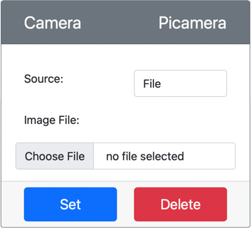

<!--
CO_OP_TRANSLATOR_METADATA:
{
  "original_hash": "3ba7150ffc4a6999f6c3cfb4906ec7df",
  "translation_date": "2025-08-25T21:01:28+00:00",
  "source_file": "4-manufacturing/lessons/2-check-fruit-from-device/virtual-device-camera.md",
  "language_code": "fa"
}
-->
# گرفتن تصویر - سخت‌افزار مجازی IoT

در این بخش از درس، شما یک حسگر دوربین به دستگاه IoT مجازی خود اضافه می‌کنید و تصاویر را از آن می‌خوانید.

## سخت‌افزار

دستگاه IoT مجازی از یک دوربین شبیه‌سازی‌شده استفاده می‌کند که یا تصاویر را از فایل‌ها ارسال می‌کند یا از وب‌کم شما.

### افزودن دوربین به CounterFit

برای استفاده از یک دوربین مجازی، باید یکی را به برنامه CounterFit اضافه کنید.

#### وظیفه - افزودن دوربین به CounterFit

دوربین را به برنامه CounterFit اضافه کنید.

1. یک برنامه پایتون جدید در رایانه خود در پوشه‌ای به نام `fruit-quality-detector` با یک فایل به نام `app.py` و یک محیط مجازی پایتون ایجاد کنید و بسته‌های pip مربوط به CounterFit را اضافه کنید.

    > ⚠️ می‌توانید به [دستورالعمل‌های ایجاد و تنظیم یک پروژه پایتون CounterFit در درس 1 در صورت نیاز مراجعه کنید](../../../1-getting-started/lessons/1-introduction-to-iot/virtual-device.md).

1. یک بسته pip اضافی نصب کنید تا یک شیم CounterFit نصب شود که بتواند با شبیه‌سازی برخی از [بسته pip مربوط به Picamera](https://pypi.org/project/picamera/) با حسگرهای دوربین ارتباط برقرار کند. مطمئن شوید که این کار را از یک ترمینال با محیط مجازی فعال انجام می‌دهید.

    ```sh
    pip install counterfit-shims-picamera
    ```

1. مطمئن شوید که برنامه وب CounterFit در حال اجرا است.

1. یک دوربین ایجاد کنید:

    1. در کادر *Create sensor* در پنل *Sensors*، از منوی کشویی *Sensor type* گزینه *Camera* را انتخاب کنید.

    1. مقدار *Name* را به `Picamera` تنظیم کنید.

    1. دکمه **Add** را برای ایجاد دوربین انتخاب کنید.

    

    دوربین ایجاد شده و در لیست حسگرها ظاهر می‌شود.

    

## برنامه‌نویسی دوربین

اکنون می‌توانید دستگاه IoT مجازی را برای استفاده از دوربین مجازی برنامه‌نویسی کنید.

### وظیفه - برنامه‌نویسی دوربین

دستگاه را برنامه‌نویسی کنید.

1. مطمئن شوید که برنامه `fruit-quality-detector` در VS Code باز است.

1. فایل `app.py` را باز کنید.

1. کد زیر را به بالای فایل `app.py` اضافه کنید تا برنامه به CounterFit متصل شود:

    ```python
    from counterfit_connection import CounterFitConnection
    CounterFitConnection.init('127.0.0.1', 5000)
    ```

1. کد زیر را به فایل `app.py` خود اضافه کنید:

    ```python
    import io
    from counterfit_shims_picamera import PiCamera
    ```

    این کد برخی از کتابخانه‌های موردنیاز، از جمله کلاس `PiCamera` از کتابخانه counterfit_shims_picamera را وارد می‌کند.

1. کد زیر را در ادامه اضافه کنید تا دوربین را مقداردهی اولیه کنید:

    ```python
    camera = PiCamera()
    camera.resolution = (640, 480)
    camera.rotation = 0
    ```

    این کد یک شیء PiCamera ایجاد می‌کند و وضوح تصویر را به 640x480 تنظیم می‌کند. اگرچه وضوح‌های بالاتر پشتیبانی می‌شوند، اما طبقه‌بندی‌کننده تصویر روی تصاویر بسیار کوچک‌تر (227x227) کار می‌کند، بنابراین نیازی به گرفتن و ارسال تصاویر بزرگ‌تر نیست.

    خط `camera.rotation = 0` چرخش تصویر را بر حسب درجه تنظیم می‌کند. اگر نیاز به چرخاندن تصویر از وب‌کم یا فایل دارید، این مقدار را به‌طور مناسب تنظیم کنید. برای مثال، اگر می‌خواهید تصویر یک موز در حالت افقی وب‌کم را به حالت عمودی تغییر دهید، مقدار `camera.rotation = 90` را تنظیم کنید.

1. کد زیر را اضافه کنید تا تصویر را به‌صورت داده‌های باینری ذخیره کنید:

    ```python
    image = io.BytesIO()
    camera.capture(image, 'jpeg')
    image.seek(0)
    ```

    این کد یک شیء `BytesIO` برای ذخیره داده‌های باینری ایجاد می‌کند. تصویر به‌صورت یک فایل JPEG از دوربین خوانده شده و در این شیء ذخیره می‌شود. این شیء دارای یک نشانگر موقعیت است که مشخص می‌کند در کجای داده قرار دارد تا در صورت نیاز داده‌های بیشتری به انتها اضافه شود، بنابراین خط `image.seek(0)` این موقعیت را به ابتدای داده بازمی‌گرداند تا تمام داده‌ها بعداً قابل خواندن باشند.

1. در ادامه، کد زیر را اضافه کنید تا تصویر را در یک فایل ذخیره کنید:

    ```python
    with open('image.jpg', 'wb') as image_file:
        image_file.write(image.read())
    ```

    این کد یک فایل به نام `image.jpg` را برای نوشتن باز می‌کند، سپس تمام داده‌ها را از شیء `BytesIO` خوانده و در فایل می‌نویسد.

    > 💁 شما می‌توانید تصویر را مستقیماً در یک فایل به‌جای یک شیء `BytesIO` ذخیره کنید، با ارسال نام فایل به فراخوانی `camera.capture`. دلیل استفاده از شیء `BytesIO` این است که در ادامه این درس می‌توانید تصویر را به طبقه‌بندی‌کننده تصویر خود ارسال کنید.

1. تصویری که دوربین در CounterFit می‌گیرد را پیکربندی کنید. می‌توانید *Source* را به *File* تنظیم کنید، سپس یک فایل تصویر آپلود کنید، یا *Source* را به *WebCam* تنظیم کنید و تصاویر از وب‌کم شما گرفته شوند. مطمئن شوید که پس از انتخاب تصویر یا وب‌کم، دکمه **Set** را انتخاب کنید.

    

1. یک تصویر گرفته شده و به‌عنوان `image.jpg` در پوشه فعلی ذخیره می‌شود. این فایل را در کاوشگر VS Code خواهید دید. فایل را انتخاب کنید تا تصویر را مشاهده کنید. اگر نیاز به چرخش دارد، خط `camera.rotation = 0` را به‌طور مناسب به‌روزرسانی کنید و دوباره عکس بگیرید.

> 💁 می‌توانید این کد را در پوشه [code-camera/virtual-iot-device](../../../../../4-manufacturing/lessons/2-check-fruit-from-device/code-camera/virtual-iot-device) پیدا کنید.

😀 برنامه دوربین شما با موفقیت انجام شد!

**سلب مسئولیت**:  
این سند با استفاده از سرویس ترجمه هوش مصنوعی [Co-op Translator](https://github.com/Azure/co-op-translator) ترجمه شده است. در حالی که ما تلاش می‌کنیم دقت را حفظ کنیم، لطفاً توجه داشته باشید که ترجمه‌های خودکار ممکن است شامل خطاها یا نادرستی‌ها باشند. سند اصلی به زبان اصلی آن باید به عنوان منبع معتبر در نظر گرفته شود. برای اطلاعات حیاتی، توصیه می‌شود از ترجمه حرفه‌ای انسانی استفاده کنید. ما مسئولیتی در قبال سوء تفاهم‌ها یا تفسیرهای نادرست ناشی از استفاده از این ترجمه نداریم.