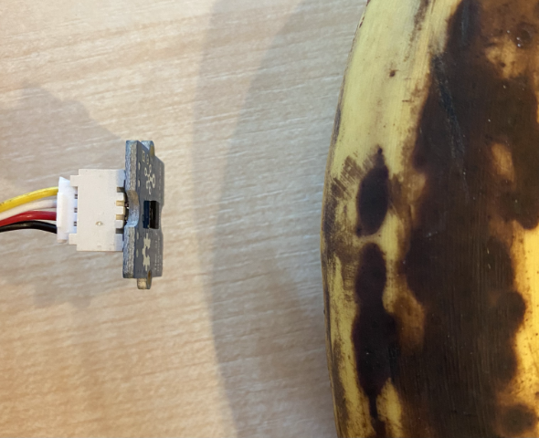

<!--
CO_OP_TRANSLATOR_METADATA:
{
  "original_hash": "6145a1d791731c8a9d0afd0a1bae5108",
  "translation_date": "2025-08-25T21:13:16+00:00",
  "source_file": "4-manufacturing/lessons/4-trigger-fruit-detector/pi-proximity.md",
  "language_code": "fa"
}
-->
# تشخیص نزدیکی - رزبری پای

در این بخش از درس، شما یک حسگر نزدیکی به رزبری پای خود اضافه می‌کنید و فاصله را از آن می‌خوانید.

## سخت‌افزار

رزبری پای نیاز به یک حسگر نزدیکی دارد.

حسگری که استفاده می‌کنید [حسگر فاصله Grove Time of Flight](https://www.seeedstudio.com/Grove-Time-of-Flight-Distance-Sensor-VL53L0X.html) است. این حسگر از یک ماژول اندازه‌گیری لیزری برای تشخیص فاصله استفاده می‌کند. این حسگر دارای محدوده‌ای از 10 میلی‌متر تا 2000 میلی‌متر (1 سانتی‌متر - 2 متر) است و مقادیر را در این محدوده با دقت نسبتاً خوبی گزارش می‌دهد، با این حال فاصله‌های بالای 1000 میلی‌متر به صورت 8109 میلی‌متر گزارش می‌شوند.

ردیاب لیزری در پشت حسگر قرار دارد، در سمت مخالف سوکت Grove.

این یک حسگر I²C است.

### اتصال حسگر Time of Flight

حسگر Time of Flight Grove را می‌توان به رزبری پای متصل کرد.

#### وظیفه - اتصال حسگر Time of Flight

حسگر Time of Flight را متصل کنید.


1. یک سر کابل Grove را به سوکت روی حسگر Time of Flight وارد کنید. این کابل فقط به یک جهت وارد می‌شود.

1. با خاموش بودن رزبری پای، سر دیگر کابل Grove را به یکی از سوکت‌های I²C که با **I²C** علامت‌گذاری شده‌اند، روی Grove Base Hat متصل به پای وصل کنید. این سوکت‌ها در ردیف پایین قرار دارند، در سمت مخالف پین‌های GPIO و کنار شکاف کابل دوربین.


## برنامه‌نویسی حسگر Time of Flight

اکنون می‌توان رزبری پای را برای استفاده از حسگر Time of Flight متصل شده برنامه‌نویسی کرد.

### وظیفه - برنامه‌نویسی حسگر Time of Flight

دستگاه را برنامه‌نویسی کنید.

1. رزبری پای را روشن کنید و منتظر بمانید تا بوت شود.

1. کد `fruit-quality-detector` را در VS Code باز کنید، یا مستقیماً روی پای یا از طریق افزونه Remote SSH متصل شوید.

1. بسته rpi-vl53l0x Pip را نصب کنید، یک بسته پایتون که با حسگر فاصله VL53L0X تعامل دارد. آن را با استفاده از این دستور pip نصب کنید:

    ```sh
    pip install rpi-vl53l0x
    ```

1. یک فایل جدید در این پروژه به نام `distance-sensor.py` ایجاد کنید.

    > 💁 یک روش آسان برای شبیه‌سازی چندین دستگاه IoT این است که هر کدام را در یک فایل پایتون جداگانه قرار دهید و سپس آنها را به طور همزمان اجرا کنید.

1. کد زیر را به این فایل اضافه کنید:

    ```python
    import time
    
    from grove.i2c import Bus
    from rpi_vl53l0x.vl53l0x import VL53L0X
    ```

    این کد کتابخانه Grove I²C bus و یک کتابخانه حسگر برای سخت‌افزار اصلی حسگر داخلی Grove Time of Flight را وارد می‌کند.

1. در زیر این کد، کد زیر را برای دسترسی به حسگر اضافه کنید:

    ```python
    distance_sensor = VL53L0X(bus = Bus().bus)
    distance_sensor.begin()    
    ```

    این کد یک حسگر فاصله را با استفاده از Grove I²C bus اعلام می‌کند و سپس حسگر را راه‌اندازی می‌کند.

1. در نهایت، یک حلقه بی‌نهایت برای خواندن فاصله‌ها اضافه کنید:

    ```python
    while True:
        distance_sensor.wait_ready()
        print(f'Distance = {distance_sensor.get_distance()} mm')
        time.sleep(1)
    ```

    این کد منتظر می‌ماند تا یک مقدار آماده خواندن از حسگر باشد و سپس آن را در کنسول چاپ می‌کند.

1. این کد را اجرا کنید.

    > 💁 فراموش نکنید که این فایل به نام `distance-sensor.py` است! مطمئن شوید که آن را با پایتون اجرا می‌کنید، نه `app.py`.

1. شما اندازه‌گیری‌های فاصله را در کنسول مشاهده خواهید کرد. اشیاء را نزدیک حسگر قرار دهید و اندازه‌گیری فاصله را مشاهده کنید:

    ```output
    pi@raspberrypi:~/fruit-quality-detector $ python3 distance_sensor.py 
    Distance = 29 mm
    Distance = 28 mm
    Distance = 30 mm
    Distance = 151 mm
    ```

    ردیاب فاصله در پشت حسگر قرار دارد، بنابراین هنگام اندازه‌گیری فاصله مطمئن شوید که از سمت درست استفاده می‌کنید.

    

> 💁 شما می‌توانید این کد را در پوشه [code-proximity/pi](../../../../../4-manufacturing/lessons/4-trigger-fruit-detector/code-proximity/pi) پیدا کنید.

😀 برنامه حسگر نزدیکی شما موفقیت‌آمیز بود!

**سلب مسئولیت**:  
این سند با استفاده از سرویس ترجمه هوش مصنوعی [Co-op Translator](https://github.com/Azure/co-op-translator) ترجمه شده است. در حالی که ما تلاش می‌کنیم دقت را حفظ کنیم، لطفاً توجه داشته باشید که ترجمه‌های خودکار ممکن است شامل خطاها یا نادرستی‌ها باشند. سند اصلی به زبان اصلی آن باید به عنوان منبع معتبر در نظر گرفته شود. برای اطلاعات حساس، ترجمه حرفه‌ای انسانی توصیه می‌شود. ما مسئولیتی در قبال سوء تفاهم‌ها یا تفسیرهای نادرست ناشی از استفاده از این ترجمه نداریم.