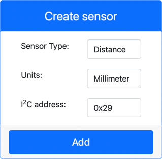

<!--
CO_OP_TRANSLATOR_METADATA:
{
  "original_hash": "7e9f05bdc50a40fd924b1d66934471bf",
  "translation_date": "2025-08-25T21:14:39+00:00",
  "source_file": "4-manufacturing/lessons/4-trigger-fruit-detector/virtual-device-proximity.md",
  "language_code": "fa"
}
-->
# تشخیص نزدیکی - سخت‌افزار مجازی IoT

در این بخش از درس، شما یک حسگر نزدیکی به دستگاه IoT مجازی خود اضافه می‌کنید و فاصله را از آن می‌خوانید.

## سخت‌افزار

دستگاه IoT مجازی از یک حسگر فاصله شبیه‌سازی‌شده استفاده خواهد کرد.

در یک دستگاه IoT فیزیکی، شما از حسگری با ماژول اندازه‌گیری لیزری برای تشخیص فاصله استفاده می‌کنید.

### افزودن حسگر فاصله به CounterFit

برای استفاده از یک حسگر فاصله مجازی، باید یکی را به برنامه CounterFit اضافه کنید.

#### وظیفه - افزودن حسگر فاصله به CounterFit

حسگر فاصله را به برنامه CounterFit اضافه کنید.

1. کد `fruit-quality-detector` را در VS Code باز کنید و مطمئن شوید که محیط مجازی فعال شده است.

1. یک بسته اضافی Pip نصب کنید تا یک CounterFit shim نصب شود که بتواند با حسگرهای فاصله از طریق شبیه‌سازی بسته [rpi-vl53l0x Pip](https://pypi.org/project/rpi-vl53l0x/) ارتباط برقرار کند، یک بسته پایتون که با [حسگر فاصله VL53L0X](https://wiki.seeedstudio.com/Grove-Time_of_Flight_Distance_Sensor-VL53L0X/) تعامل دارد. مطمئن شوید که این را از یک ترمینال با محیط مجازی فعال نصب می‌کنید.

    ```sh
    pip install counterfit-shims-rpi-vl53l0x
    ```

1. مطمئن شوید که برنامه وب CounterFit در حال اجرا است.

1. یک حسگر فاصله ایجاد کنید:

    1. در جعبه *Create sensor* در پنل *Sensors*، جعبه *Sensor type* را باز کنید و *Distance* را انتخاب کنید.

    1. *Units* را به `Millimeter` بگذارید.

    1. این حسگر یک حسگر I2C است، بنابراین آدرس را به `0x29` تنظیم کنید. اگر از یک حسگر فیزیکی VL53L0X استفاده می‌کردید، این آدرس به صورت پیش‌فرض تنظیم شده بود.

    1. دکمه **Add** را انتخاب کنید تا حسگر فاصله ایجاد شود.

    

    حسگر فاصله ایجاد خواهد شد و در لیست حسگرها ظاهر می‌شود.

    

## برنامه‌نویسی حسگر فاصله

اکنون دستگاه IoT مجازی می‌تواند برای استفاده از حسگر فاصله شبیه‌سازی‌شده برنامه‌ریزی شود.

### وظیفه - برنامه‌نویسی حسگر زمان پرواز

1. یک فایل جدید در پروژه `fruit-quality-detector` به نام `distance-sensor.py` ایجاد کنید.

    > 💁 یک روش آسان برای شبیه‌سازی چندین دستگاه IoT این است که هر کدام را در یک فایل پایتون جداگانه انجام دهید و سپس آنها را به طور همزمان اجرا کنید.

1. یک اتصال به CounterFit با کد زیر شروع کنید:

    ```python
    from counterfit_connection import CounterFitConnection
    CounterFitConnection.init('127.0.0.1', 5000)
    ```

1. کد زیر را در زیر این اضافه کنید:

    ```python
    import time
    
    from counterfit_shims_rpi_vl53l0x.vl53l0x import VL53L0X
    ```

    این کتابخانه شبیه‌سازی حسگر VL53L0X را وارد می‌کند.

1. در زیر این، کد زیر را برای دسترسی به حسگر اضافه کنید:

    ```python
    distance_sensor = VL53L0X()
    distance_sensor.begin()
    ```

    این کد یک حسگر فاصله را اعلام می‌کند و سپس حسگر را شروع می‌کند.

1. در نهایت، یک حلقه بی‌نهایت برای خواندن فاصله‌ها اضافه کنید:

    ```python
    while True:
        distance_sensor.wait_ready()
        print(f'Distance = {distance_sensor.get_distance()} mm')
        time.sleep(1)
    ```

    این کد منتظر می‌ماند تا یک مقدار آماده خواندن از حسگر باشد و سپس آن را در کنسول چاپ می‌کند.

1. این کد را اجرا کنید.

    > 💁 فراموش نکنید که این فایل `distance-sensor.py` نام دارد! مطمئن شوید که آن را از طریق Python اجرا می‌کنید، نه `app.py`.

1. شما اندازه‌گیری‌های فاصله را در کنسول مشاهده خواهید کرد. مقدار را در CounterFit تغییر دهید تا این مقدار تغییر کند یا از مقادیر تصادفی استفاده کنید.

    ```output
    (.venv) ➜  fruit-quality-detector python distance-sensor.py 
    Distance = 37 mm
    Distance = 42 mm
    Distance = 29 mm
    ```

> 💁 شما می‌توانید این کد را در پوشه [code-proximity/virtual-iot-device](../../../../../4-manufacturing/lessons/4-trigger-fruit-detector/code-proximity/virtual-iot-device) پیدا کنید.

😀 برنامه حسگر نزدیکی شما موفقیت‌آمیز بود!

**سلب مسئولیت**:  
این سند با استفاده از سرویس ترجمه هوش مصنوعی [Co-op Translator](https://github.com/Azure/co-op-translator) ترجمه شده است. در حالی که ما تلاش می‌کنیم دقت را حفظ کنیم، لطفاً توجه داشته باشید که ترجمه‌های خودکار ممکن است شامل خطاها یا نادرستی‌ها باشند. سند اصلی به زبان اصلی آن باید به عنوان منبع معتبر در نظر گرفته شود. برای اطلاعات حساس، توصیه می‌شود از ترجمه حرفه‌ای انسانی استفاده کنید. ما مسئولیتی در قبال سوء تفاهم‌ها یا تفسیرهای نادرست ناشی از استفاده از این ترجمه نداریم.