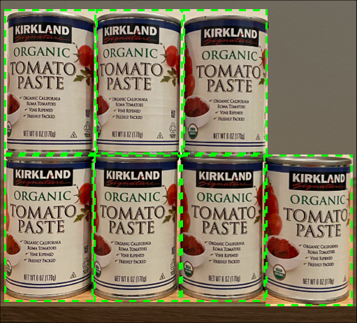
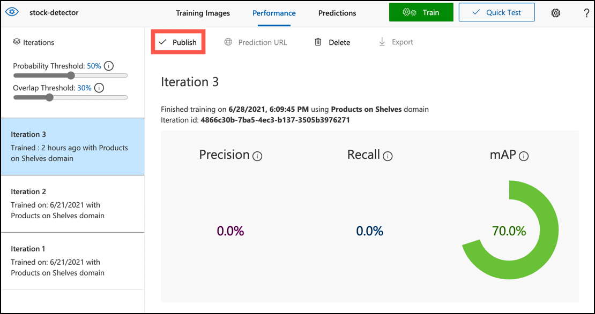

<!--
CO_OP_TRANSLATOR_METADATA:
{
  "original_hash": "1c9e5fa8b7be726c75a97232b1e41c97",
  "translation_date": "2025-08-25T20:45:29+00:00",
  "source_file": "5-retail/lessons/2-check-stock-device/README.md",
  "language_code": "fa"
}
-->
# بررسی موجودی کالا با استفاده از دستگاه IoT


> اسکچ‌نوت توسط [نیتیا ناراسیمهان](https://github.com/nitya). برای مشاهده نسخه بزرگ‌تر روی تصویر کلیک کنید.

## آزمون پیش از درس

[آزمون پیش از درس](https://black-meadow-040d15503.1.azurestaticapps.net/quiz/39)

## مقدمه

در درس قبلی با کاربردهای مختلف تشخیص اشیا در خرده‌فروشی آشنا شدید. همچنین یاد گرفتید که چگونه یک مدل تشخیص اشیا را برای شناسایی موجودی کالا آموزش دهید. در این درس، یاد خواهید گرفت که چگونه از مدل تشخیص اشیای خود در دستگاه IoT برای شمارش موجودی کالا استفاده کنید.

در این درس به موارد زیر خواهیم پرداخت:

* [شمارش موجودی کالا](../../../../../5-retail/lessons/2-check-stock-device)
* [فراخوانی مدل تشخیص اشیا از دستگاه IoT](../../../../../5-retail/lessons/2-check-stock-device)
* [جعبه‌های محدودکننده](../../../../../5-retail/lessons/2-check-stock-device)
* [بازآموزی مدل](../../../../../5-retail/lessons/2-check-stock-device)
* [شمارش موجودی کالا](../../../../../5-retail/lessons/2-check-stock-device)

> 🗑 این آخرین درس در این پروژه است، بنابراین پس از تکمیل این درس و انجام تکلیف، فراموش نکنید که خدمات ابری خود را پاکسازی کنید. برای انجام تکلیف به این خدمات نیاز دارید، بنابراین ابتدا تکلیف را کامل کنید.
>
> در صورت نیاز، به [راهنمای پاکسازی پروژه](../../../clean-up.md) مراجعه کنید.

## شمارش موجودی کالا

مدل‌های تشخیص اشیا می‌توانند برای بررسی موجودی کالا استفاده شوند، چه برای شمارش کالاها و چه برای اطمینان از اینکه کالاها در مکان مناسب قرار دارند. دستگاه‌های IoT مجهز به دوربین می‌توانند در سراسر فروشگاه مستقر شوند تا موجودی کالا را نظارت کنند، به‌ویژه در نقاط حساس که پر کردن مجدد کالاها اهمیت زیادی دارد، مانند مناطقی که تعداد کمی از کالاهای با ارزش بالا ذخیره می‌شوند.

برای مثال، اگر یک دوربین به سمت قفسه‌هایی که می‌توانند ۸ قوطی رب گوجه‌فرنگی را نگه دارند، تنظیم شده باشد و مدل تشخیص اشیا فقط ۷ قوطی را شناسایی کند، یک قوطی کم است و باید دوباره پر شود.



در تصویر بالا، مدل تشخیص اشیا ۷ قوطی رب گوجه‌فرنگی را روی قفسه‌ای که ظرفیت ۸ قوطی دارد، شناسایی کرده است. دستگاه IoT نه تنها می‌تواند نیاز به پر کردن مجدد را اطلاع دهد، بلکه می‌تواند مکان دقیق قوطی گمشده را نیز مشخص کند، که داده مهمی است اگر از ربات‌ها برای پر کردن قفسه‌ها استفاده کنید.

> 💁 بسته به فروشگاه و محبوبیت کالا، احتمالاً پر کردن مجدد فقط برای یک قوطی انجام نمی‌شود. شما باید الگوریتمی طراحی کنید که بر اساس محصول، مشتریان و معیارهای دیگر زمان پر کردن مجدد را تعیین کند.

✅ در چه سناریوهای دیگری می‌توانید تشخیص اشیا و ربات‌ها را ترکیب کنید؟

گاهی اوقات ممکن است کالاهای اشتباهی روی قفسه‌ها قرار گیرند. این می‌تواند ناشی از خطای انسانی هنگام پر کردن مجدد یا تغییر نظر مشتریان و قرار دادن کالا در اولین فضای موجود باشد. اگر این کالا غیرقابل فساد باشد، مانند کنسروها، این یک مزاحمت است. اما اگر کالا قابل فساد باشد، مانند مواد منجمد یا سرد، ممکن است دیگر قابل فروش نباشد زیرا نمی‌توان مدت زمانی که کالا خارج از فریزر بوده را تعیین کرد.

تشخیص اشیا می‌تواند برای شناسایی کالاهای غیرمنتظره استفاده شود و انسان یا ربات را برای بازگرداندن کالا به مکان صحیح مطلع کند.


در تصویر بالا، یک قوطی ذرت بچه روی قفسه کنار رب گوجه‌فرنگی قرار گرفته است. مدل تشخیص اشیا این مورد را شناسایی کرده و دستگاه IoT می‌تواند انسان یا ربات را برای بازگرداندن قوطی به مکان صحیح مطلع کند.

## فراخوانی مدل تشخیص اشیا از دستگاه IoT

مدل تشخیص اشیایی که در درس قبلی آموزش داده‌اید، می‌تواند از دستگاه IoT فراخوانی شود.

### وظیفه - انتشار یک نسخه از مدل تشخیص اشیا

نسخه‌ها از پورتال Custom Vision منتشر می‌شوند.

1. پورتال Custom Vision را در [CustomVision.ai](https://customvision.ai) باز کنید و وارد شوید اگر هنوز باز نکرده‌اید. سپس پروژه `stock-detector` خود را باز کنید.

1. از گزینه‌های بالای صفحه، تب **Performance** را انتخاب کنید.

1. آخرین نسخه را از لیست *Iterations* در سمت صفحه انتخاب کنید.

1. دکمه **Publish** را برای نسخه انتخاب کنید.

    

1. در دیالوگ *Publish Model*، منبع *Prediction resource* را به منبع `stock-detector-prediction` که در درس قبلی ایجاد کرده‌اید تنظیم کنید. نام را به صورت `Iteration2` باقی بگذارید و دکمه **Publish** را انتخاب کنید.

1. پس از انتشار، دکمه **Prediction URL** را انتخاب کنید. این بخش جزئیات API پیش‌بینی را نشان می‌دهد و شما به این جزئیات برای فراخوانی مدل از دستگاه IoT نیاز دارید. بخش پایین‌تر با عنوان *If you have an image file* جزئیاتی است که نیاز دارید. URL نمایش داده شده را کپی کنید که چیزی شبیه به:

    ```output
    https://<location>.api.cognitive.microsoft.com/customvision/v3.0/Prediction/<id>/detect/iterations/Iteration2/image
    ```

    خواهد بود، که `<location>` مکان مورد استفاده شما هنگام ایجاد منبع Custom Vision و `<id>` یک شناسه طولانی متشکل از حروف و اعداد خواهد بود.

    همچنین مقدار *Prediction-Key* را کپی کنید. این یک کلید امن است که باید هنگام فراخوانی مدل ارسال شود. فقط برنامه‌هایی که این کلید را ارسال کنند اجازه استفاده از مدل را دارند و سایر برنامه‌ها رد می‌شوند.

    

✅ وقتی یک نسخه جدید منتشر می‌شود، نام متفاوتی خواهد داشت. فکر می‌کنید چگونه می‌توانید نسخه‌ای که دستگاه IoT استفاده می‌کند را تغییر دهید؟

### وظیفه - فراخوانی مدل تشخیص اشیا از دستگاه IoT

راهنمای مربوطه را دنبال کنید تا از مدل تشخیص اشیا در دستگاه IoT خود استفاده کنید:

* [Arduino - Wio Terminal](wio-terminal-object-detector.md)
* [کامپیوتر تک‌برد - Raspberry Pi/دستگاه مجازی](single-board-computer-object-detector.md)

## جعبه‌های محدودکننده

هنگام استفاده از مدل تشخیص اشیا، نه تنها اشیای شناسایی شده با برچسب‌ها و احتمالات آن‌ها را دریافت می‌کنید، بلکه جعبه‌های محدودکننده اشیا را نیز دریافت می‌کنید. این جعبه‌ها محدوده‌ای را تعریف می‌کنند که مدل تشخیص اشیا شیء را با احتمال مشخص شناسایی کرده است.

> 💁 جعبه محدودکننده یک جعبه است که محدوده‌ای را که شیء شناسایی شده در آن قرار دارد، تعریف می‌کند.

نتایج پیش‌بینی در تب **Predictions** در Custom Vision دارای جعبه‌های محدودکننده‌ای هستند که روی تصویر ارسال شده برای پیش‌بینی ترسیم شده‌اند.


در تصویر بالا، ۴ قوطی رب گوجه‌فرنگی شناسایی شده‌اند. در نتایج، یک مربع قرمز برای هر شیء شناسایی شده در تصویر ترسیم شده است که جعبه محدودکننده برای تصویر را نشان می‌دهد.

✅ پیش‌بینی‌ها را در Custom Vision باز کنید و جعبه‌های محدودکننده را بررسی کنید.

جعبه‌های محدودکننده با ۴ مقدار تعریف می‌شوند - بالا، چپ، ارتفاع و عرض. این مقادیر در مقیاس ۰-۱ هستند و موقعیت‌ها را به عنوان درصدی از اندازه تصویر نشان می‌دهند. مبدا (موقعیت ۰,۰) گوشه بالا سمت چپ تصویر است، بنابراین مقدار بالا فاصله از بالا است و پایین جعبه محدودکننده برابر با بالا به علاوه ارتفاع است.


تصویر بالا ۶۰۰ پیکسل عرض و ۸۰۰ پیکسل ارتفاع دارد. جعبه محدودکننده از ۳۲۰ پیکسل پایین شروع می‌شود، که مقدار بالا برابر با ۰.۴ است (۸۰۰ x 0.4 = 320). از سمت چپ، جعبه محدودکننده از ۲۴۰ پیکسل عرض شروع می‌شود، که مقدار چپ برابر با ۰.۴ است (۶۰۰ x 0.4 = 240). ارتفاع جعبه محدودکننده ۲۴۰ پیکسل است، که مقدار ارتفاع برابر با ۰.۳ است (۸۰۰ x 0.3 = 240). عرض جعبه محدودکننده ۱۲۰ پیکسل است، که مقدار عرض برابر با ۰.۲ است (۶۰۰ x 0.2 = 120).

| مختصات | مقدار |
| ---------- | ----: |
| بالا        | ۰.۴   |
| چپ         | ۰.۴   |
| ارتفاع     | ۰.۳   |
| عرض        | ۰.۲   |

استفاده از مقادیر درصدی از ۰-۱ به این معناست که بدون توجه به اندازه تصویر، جعبه محدودکننده از ۰.۴ مسیر طول و عرض شروع می‌شود و ۰.۳ از ارتفاع و ۰.۲ از عرض را شامل می‌شود.

می‌توانید از جعبه‌های محدودکننده همراه با احتمالات برای ارزیابی دقت شناسایی استفاده کنید. برای مثال، یک مدل تشخیص اشیا می‌تواند چندین شیء را که با هم همپوشانی دارند شناسایی کند، مانند شناسایی یک قوطی داخل دیگری. کد شما می‌تواند جعبه‌های محدودکننده را بررسی کند، بفهمد که این غیرممکن است و هر شیء که همپوشانی قابل توجهی با سایر اشیا دارد را نادیده بگیرد.


در مثال بالا، یک جعبه محدودکننده یک قوطی رب گوجه‌فرنگی را با احتمال ۷۸.۳٪ شناسایی کرده است. یک جعبه محدودکننده دوم کمی کوچک‌تر است و داخل جعبه اول با احتمال ۶۴.۳٪ قرار دارد. کد شما می‌تواند جعبه‌های محدودکننده را بررسی کند، ببیند که کاملاً همپوشانی دارند و احتمال پایین‌تر را نادیده بگیرد زیرا امکان ندارد یک قوطی داخل دیگری باشد.

✅ آیا می‌توانید موقعیتی را تصور کنید که شناسایی یک شیء داخل دیگری معتبر باشد؟

## بازآموزی مدل

مانند مدل طبقه‌بندی تصویر، می‌توانید مدل خود را با استفاده از داده‌های جمع‌آوری شده توسط دستگاه IoT بازآموزی کنید. استفاده از این داده‌های واقعی اطمینان حاصل می‌کند که مدل شما هنگام استفاده از دستگاه IoT به خوبی کار می‌کند.

برخلاف مدل طبقه‌بندی تصویر، نمی‌توانید فقط یک تصویر را برچسب‌گذاری کنید. در عوض باید هر جعبه محدودکننده شناسایی شده توسط مدل را بررسی کنید. اگر جعبه دور شیء اشتباهی باشد، باید حذف شود، اگر در مکان اشتباهی باشد باید تنظیم شود.

### وظیفه - بازآموزی مدل

1. مطمئن شوید که طیف وسیعی از تصاویر را با استفاده از دستگاه IoT خود جمع‌آوری کرده‌اید.

1. از تب **Predictions** یک تصویر را انتخاب کنید. جعبه‌های قرمز نشان‌دهنده جعبه‌های محدودکننده اشیای شناسایی شده هستند.

1. هر جعبه محدودکننده را بررسی کنید. ابتدا آن را انتخاب کنید و یک پنجره پاپ‌آپ نشان‌دهنده برچسب را مشاهده خواهید کرد. از دستگیره‌های گوشه‌های جعبه محدودکننده برای تنظیم اندازه در صورت نیاز استفاده کنید. اگر برچسب اشتباه است، آن را با دکمه **X** حذف کنید و برچسب صحیح را اضافه کنید. اگر جعبه محدودکننده شامل شیء نیست، آن را با دکمه سطل زباله حذف کنید.

1. پس از اتمام ویرایش، تصویر از تب **Predictions** به تب **Training Images** منتقل می‌شود. این فرآیند را برای تمام پیش‌بینی‌ها تکرار کنید.

1. از دکمه **Train** برای بازآموزی مدل خود استفاده کنید. پس از آموزش، نسخه را منتشر کنید و دستگاه IoT خود را به URL نسخه جدید به‌روزرسانی کنید.

1. کد خود را دوباره مستقر کنید و دستگاه IoT خود را آزمایش کنید.

## شمارش موجودی کالا

با ترکیب تعداد اشیای شناسایی شده و جعبه‌های محدودکننده، می‌توانید موجودی کالا روی قفسه را شمارش کنید.

### وظیفه - شمارش موجودی کالا

راهنمای مربوطه را دنبال کنید تا با استفاده از نتایج مدل تشخیص اشیا از دستگاه IoT خود موجودی کالا را شمارش کنید:

* [Arduino - Wio Terminal](wio-terminal-count-stock.md)
* [کامپیوتر تک‌برد - Raspberry Pi/دستگاه مجازی](single-board-computer-count-stock.md)

---

## 🚀 چالش

آیا می‌توانید کالاهای اشتباه را شناسایی کنید؟ مدل خود را برای چندین شیء آموزش دهید، سپس برنامه خود را به‌روزرسانی کنید تا در صورت شناسایی کالاهای اشتباه به شما اطلاع دهد.

شاید حتی این را فراتر ببرید و کالاهای کنار هم روی یک قفسه را شناسایی کنید و ببینید آیا چیزی در مکان اشتباهی قرار گرفته است، با تعریف محدودیت‌هایی برای جعبه‌های محدودکننده.

## آزمون پس از درس

[آزمون پس از درس](https://black-meadow-040d15503.1.azurestaticapps.net/quiz/40)

## مرور و مطالعه شخصی

* درباره نحوه طراحی یک سیستم شناسایی موجودی کالا از انتها به انتها بیشتر بیاموزید از [راهنمای الگوی شناسایی موجودی کالا در لبه در Microsoft Docs](https://docs.microsoft.com/hybrid/app-solutions/pattern-out-of-stock-at-edge?WT.mc_id=academic-17441-jabenn)
* روش‌های دیگر برای ساخت راه‌حل‌های خرده‌فروشی انتها به انتها با ترکیب طیف وسیعی از خدمات IoT و ابری را با تماشای این [ویدیو پشت صحنه یک راه‌حل خرده‌فروشی - Hands On! در YouTube](https://www.youtube.com/watch?v=m3Pc300x2Mw) بیاموزید.

## تکلیف

[استفاده از مدل تشخیص اشیا در لبه](assignment.md)

**سلب مسئولیت**:  
این سند با استفاده از سرویس ترجمه هوش مصنوعی [Co-op Translator](https://github.com/Azure/co-op-translator) ترجمه شده است. در حالی که ما تلاش می‌کنیم دقت را حفظ کنیم، لطفاً توجه داشته باشید که ترجمه‌های خودکار ممکن است حاوی خطاها یا نادرستی‌هایی باشند. سند اصلی به زبان بومی آن باید به عنوان منبع معتبر در نظر گرفته شود. برای اطلاعات حساس، ترجمه حرفه‌ای انسانی توصیه می‌شود. ما هیچ مسئولیتی در قبال سوءتفاهم‌ها یا تفسیرهای نادرست ناشی از استفاده از این ترجمه نداریم.