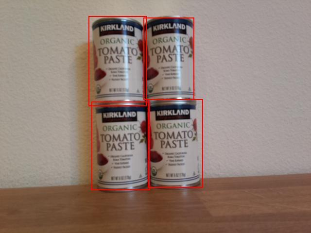

<!--
CO_OP_TRANSLATOR_METADATA:
{
  "original_hash": "0b2ae20b0fc8e73c9598dea937cac038",
  "translation_date": "2025-08-25T20:46:52+00:00",
  "source_file": "5-retail/lessons/2-check-stock-device/wio-terminal-count-stock.md",
  "language_code": "fa"
}
-->
# شمارش موجودی از دستگاه IoT شما - Wio Terminal

ترکیبی از پیش‌بینی‌ها و جعبه‌های محدودکننده می‌تواند برای شمارش موجودی در یک تصویر استفاده شود.

## شمارش موجودی



در تصویر بالا، جعبه‌های محدودکننده کمی با هم همپوشانی دارند. اگر این همپوشانی بسیار بزرگ‌تر بود، ممکن بود جعبه‌های محدودکننده نشان‌دهنده یک شیء یکسان باشند. برای شمارش صحیح اشیاء، باید جعبه‌هایی با همپوشانی قابل‌توجه را نادیده بگیرید.

### وظیفه - شمارش موجودی با نادیده گرفتن همپوشانی

1. پروژه `stock-counter` خود را باز کنید، اگر قبلاً باز نیست.

1. بالای تابع `processPredictions` کد زیر را اضافه کنید:

    ```cpp
    const float overlap_threshold = 0.20f;
    ```

    این کد درصد همپوشانی مجاز را قبل از اینکه جعبه‌های محدودکننده به‌عنوان یک شیء یکسان در نظر گرفته شوند، تعریف می‌کند. مقدار 0.20 نشان‌دهنده 20٪ همپوشانی است.

1. زیر این کد و بالای تابع `processPredictions`، کد زیر را برای محاسبه همپوشانی بین دو مستطیل اضافه کنید:

    ```cpp
    struct Point {
        float x, y;
    };

    struct Rect {
        Point topLeft, bottomRight;
    };

    float area(Rect rect)
    {
        return abs(rect.bottomRight.x - rect.topLeft.x) * abs(rect.bottomRight.y - rect.topLeft.y);
    }
     
    float overlappingArea(Rect rect1, Rect rect2)
    {
        float left = max(rect1.topLeft.x, rect2.topLeft.x);
        float right = min(rect1.bottomRight.x, rect2.bottomRight.x);
        float top = max(rect1.topLeft.y, rect2.topLeft.y);
        float bottom = min(rect1.bottomRight.y, rect2.bottomRight.y);
    
    
        if ( right > left && bottom > top )
        {
            return (right-left)*(bottom-top);
        }
        
        return 0.0f;
    }
    ```

    این کد یک ساختار `Point` برای ذخیره نقاط روی تصویر و یک ساختار `Rect` برای تعریف یک مستطیل با استفاده از مختصات بالا-چپ و پایین-راست تعریف می‌کند. سپس یک تابع `area` تعریف می‌کند که مساحت یک مستطیل را از مختصات بالا-چپ و پایین-راست محاسبه می‌کند.

    سپس یک تابع `overlappingArea` تعریف می‌کند که مساحت همپوشانی دو مستطیل را محاسبه می‌کند. اگر همپوشانی وجود نداشته باشد، مقدار 0 را برمی‌گرداند.

1. زیر تابع `overlappingArea`، یک تابع برای تبدیل یک جعبه محدودکننده به یک `Rect` تعریف کنید:

    ```cpp
    Rect rectFromBoundingBox(JsonVariant prediction)
    {
        JsonObject bounding_box = prediction["boundingBox"].as<JsonObject>();
    
        float left = bounding_box["left"].as<float>();
        float top = bounding_box["top"].as<float>();
        float width = bounding_box["width"].as<float>();
        float height = bounding_box["height"].as<float>();
    
        Point topLeft = {left, top};
        Point bottomRight = {left + width, top + height};
    
        return {topLeft, bottomRight};
    }
    ```

    این تابع یک پیش‌بینی از آشکارساز اشیاء می‌گیرد، جعبه محدودکننده را استخراج می‌کند و از مقادیر آن برای تعریف یک مستطیل استفاده می‌کند. سمت راست از جمع مقدار چپ و عرض محاسبه می‌شود. پایین نیز از جمع مقدار بالا و ارتفاع محاسبه می‌شود.

1. پیش‌بینی‌ها باید با یکدیگر مقایسه شوند، و اگر دو پیش‌بینی همپوشانی بیشتری از آستانه داشته باشند، یکی از آن‌ها باید حذف شود. آستانه همپوشانی یک درصد است، بنابراین باید در اندازه کوچک‌ترین جعبه محدودکننده ضرب شود تا بررسی شود که آیا همپوشانی از درصد مشخص‌شده جعبه محدودکننده فراتر می‌رود یا خیر، نه درصد مشخص‌شده کل تصویر. ابتدا محتوای تابع `processPredictions` را حذف کنید.

1. کد زیر را به تابع خالی `processPredictions` اضافه کنید:

    ```cpp
    std::vector<JsonVariant> passed_predictions;

    for (int i = 0; i < predictions.size(); ++i)
    {
        Rect prediction_1_rect = rectFromBoundingBox(predictions[i]);
        float prediction_1_area = area(prediction_1_rect);
        bool passed = true;

        for (int j = i + 1; j < predictions.size(); ++j)
        {
            Rect prediction_2_rect = rectFromBoundingBox(predictions[j]);
            float prediction_2_area = area(prediction_2_rect);

            float overlap = overlappingArea(prediction_1_rect, prediction_2_rect);
            float smallest_area = min(prediction_1_area, prediction_2_area);

            if (overlap > (overlap_threshold * smallest_area))
            {
                passed = false;
                break;
            }
        }

        if (passed)
        {
            passed_predictions.push_back(predictions[i]);
        }
    }
    ```

    این کد یک بردار برای ذخیره پیش‌بینی‌هایی که همپوشانی ندارند تعریف می‌کند. سپس از طریق تمام پیش‌بینی‌ها حلقه می‌زند و یک `Rect` از جعبه محدودکننده ایجاد می‌کند.

    سپس این کد از طریق پیش‌بینی‌های باقی‌مانده حلقه می‌زند، از پیش‌بینی بعدی به بعد. این کار از مقایسه دوباره پیش‌بینی‌ها جلوگیری می‌کند - وقتی 1 و 2 مقایسه شدند، نیازی به مقایسه 2 با 1 نیست، فقط با 3، 4 و غیره.

    برای هر جفت پیش‌بینی، مساحت همپوشانی محاسبه می‌شود. سپس این مقدار با مساحت کوچک‌ترین جعبه محدودکننده مقایسه می‌شود - اگر همپوشانی از درصد آستانه کوچک‌ترین جعبه محدودکننده فراتر رود، پیش‌بینی به‌عنوان ردشده علامت‌گذاری می‌شود. اگر پس از مقایسه تمام همپوشانی‌ها، پیش‌بینی از بررسی‌ها عبور کند، به مجموعه `passed_predictions` اضافه می‌شود.

    > 💁 این یک روش بسیار ساده برای حذف همپوشانی‌ها است، فقط اولین مورد در یک جفت همپوشانی حذف می‌شود. برای کد تولیدی، باید منطق بیشتری در اینجا قرار دهید، مانند در نظر گرفتن همپوشانی بین چندین شیء، یا اگر یک جعبه محدودکننده درون دیگری قرار دارد.

1. پس از این، کد زیر را برای ارسال جزئیات پیش‌بینی‌های پذیرفته‌شده به مانیتور سریال اضافه کنید:

    ```cpp
    for(JsonVariant prediction : passed_predictions)
    {
        String boundingBox = prediction["boundingBox"].as<String>();
        String tag = prediction["tagName"].as<String>();
        float probability = prediction["probability"].as<float>();

        char buff[32];
        sprintf(buff, "%s:\t%.2f%%\t%s", tag.c_str(), probability * 100.0, boundingBox.c_str());
        Serial.println(buff);
    }
    ```

    این کد از طریق پیش‌بینی‌های پذیرفته‌شده حلقه می‌زند و جزئیات آن‌ها را به مانیتور سریال چاپ می‌کند.

1. زیر این کد، کدی برای چاپ تعداد اقلام شمارش‌شده به مانیتور سریال اضافه کنید:

    ```cpp
    Serial.print("Counted ");
    Serial.print(passed_predictions.size());
    Serial.println(" stock items.");
    ```

    این مقدار سپس می‌تواند به یک سرویس IoT ارسال شود تا در صورت کمبود موجودی هشدار دهد.

1. کد خود را آپلود و اجرا کنید. دوربین را به سمت اشیاء روی یک قفسه بگیرید و دکمه C را فشار دهید. سعی کنید مقدار `overlap_threshold` را تنظیم کنید تا پیش‌بینی‌هایی که نادیده گرفته می‌شوند را مشاهده کنید.

    ```output
    Connecting to WiFi..
    Connected!
    Image captured
    Image read to buffer with length 17416
    tomato paste:   35.84%  {"left":0.395631,"top":0.215897,"width":0.180768,"height":0.359364}
    tomato paste:   35.87%  {"left":0.378554,"top":0.583012,"width":0.14824,"height":0.359382}
    tomato paste:   34.11%  {"left":0.699024,"top":0.592617,"width":0.124411,"height":0.350456}
    tomato paste:   35.16%  {"left":0.513006,"top":0.647853,"width":0.187472,"height":0.325817}
    Counted 4 stock items.
    ```

> 💁 می‌توانید این کد را در پوشه [code-count/wio-terminal](../../../../../5-retail/lessons/2-check-stock-device/code-count/wio-terminal) پیدا کنید.

😀 برنامه شمارش موجودی شما موفقیت‌آمیز بود!

**سلب مسئولیت**:  
این سند با استفاده از سرویس ترجمه هوش مصنوعی [Co-op Translator](https://github.com/Azure/co-op-translator) ترجمه شده است. در حالی که ما تلاش می‌کنیم دقت را حفظ کنیم، لطفاً توجه داشته باشید که ترجمه‌های خودکار ممکن است شامل خطاها یا نادرستی‌ها باشند. سند اصلی به زبان اصلی آن باید به عنوان منبع معتبر در نظر گرفته شود. برای اطلاعات حساس، توصیه می‌شود از ترجمه حرفه‌ای انسانی استفاده کنید. ما مسئولیتی در قبال سوء تفاهم‌ها یا تفسیرهای نادرست ناشی از استفاده از این ترجمه نداریم.